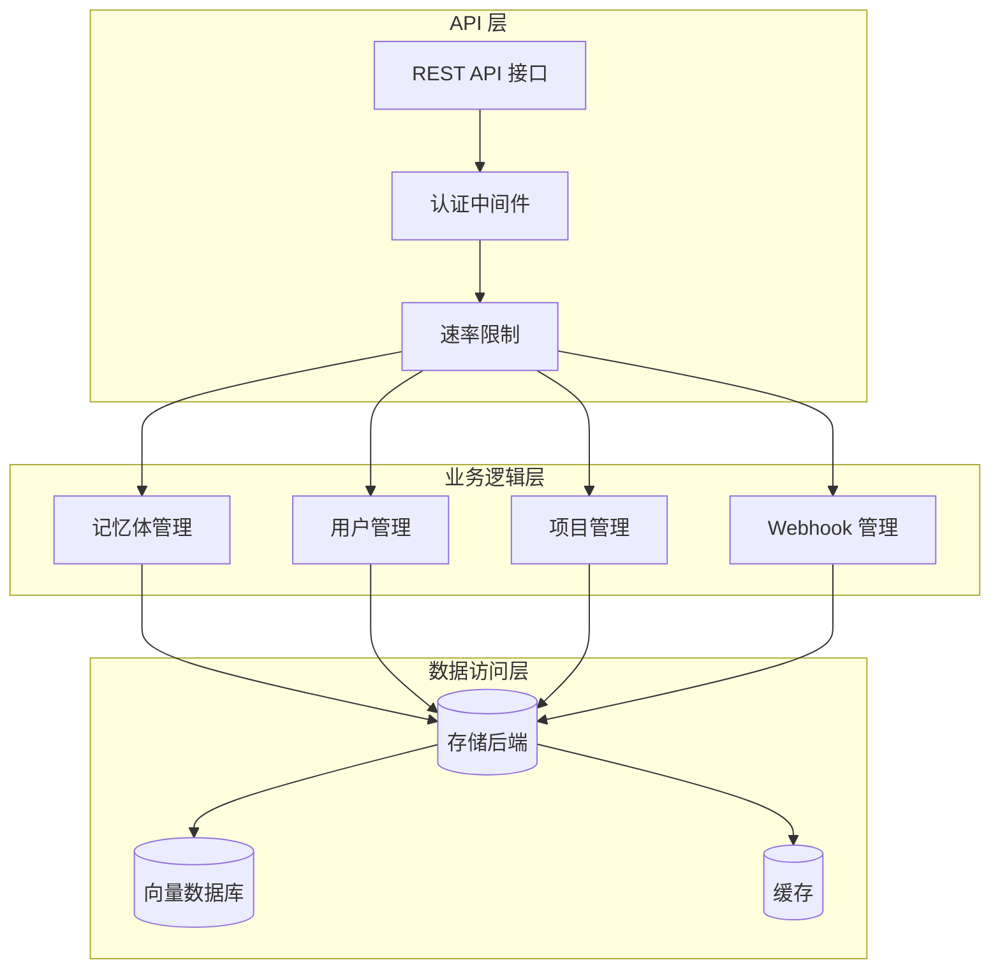
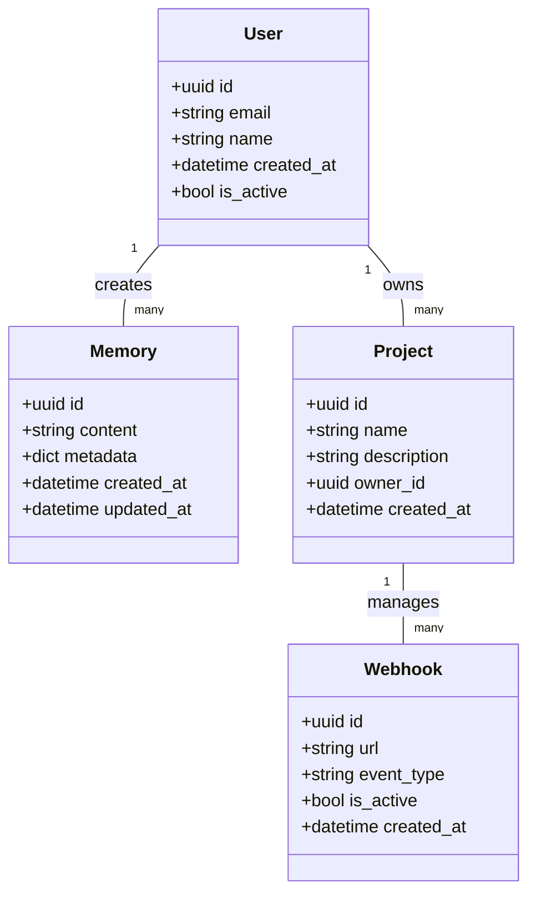
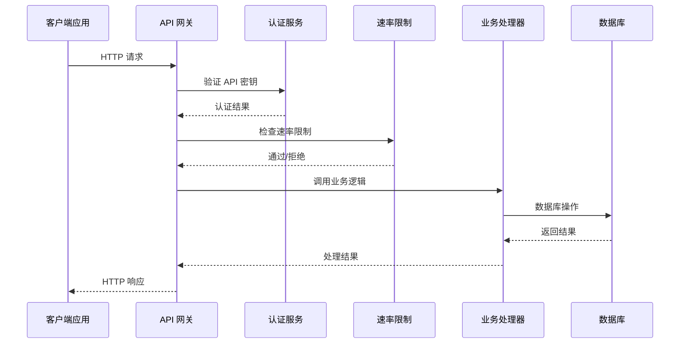
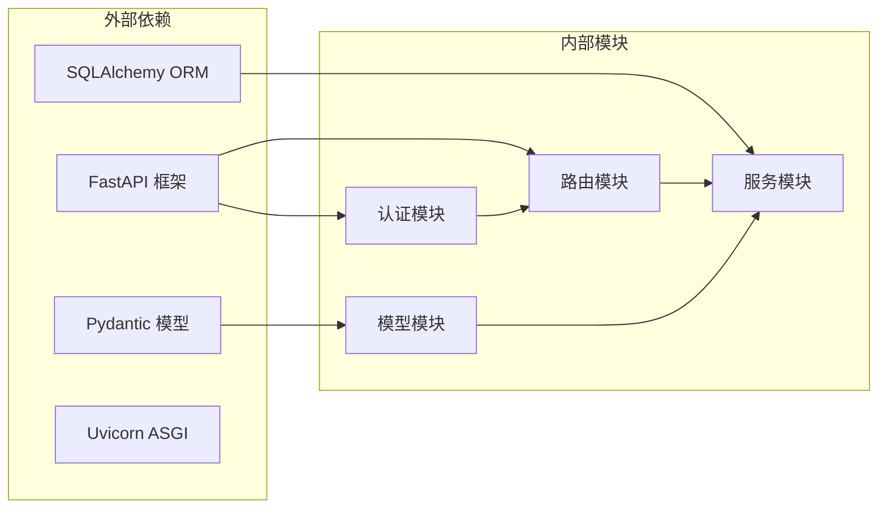

# API 参考文档

<cite>
**本文档引用的文件**
- [main.py](file://server/main.py)
- [auth.py](file://server/auth.py)
- [entities.py](file://server/routers/entities.py)
- [api_keys.py](file://server/routers/api_keys.py)
- [requests.py](file://server/routers/requests.py)
- [models.py](file://server/models.py)
- [schemas.py](file://server/schemas.py)
- [rate_limit.py](file://server/rate_limit.py)
- [errors.py](file://server/errors.py)
- [get-users.mdx](file://docs/api-reference/entities/get-users.mdx)
- [delete-user.mdx](file://docs/api-reference/entities/delete-user.mdx)
- [get-memories.mdx](file://docs/api-reference/memory/get-memories.mdx)
- [add-memories.mdx](file://docs/api-reference/memory/add-memories.mdx)
- [search-memories.mdx](file://docs/api-reference/memory/search-memories.mdx)
- [get-projects.mdx](file://docs/api-reference/project/get-projects.mdx)
- [create-project.mdx](file://docs/api-reference/project/create-project.mdx)
- [get-webhook.mdx](file://docs/api-reference/webhook/get-webhook.mdx)
- [create-webhook.mdx](file://docs/api-reference/webhook/create-webhook.mdx)
- [openapi.json](file://docs/openapi.json)
</cite>

## 目录
1. [简介](#简介)
2. [项目结构](#项目结构)
3. [核心组件](#核心组件)
4. [架构概览](#架构概览)
5. [详细组件分析](#详细组件分析)
6. [依赖关系分析](#依赖关系分析)
7. [性能考虑](#性能考虑)
8. [故障排除指南](#故障排除指南)
9. [结论](#结论)
10. [附录](#附录)

## 简介

mem0 是一个开源的记忆管理系统，提供了完整的 REST API 接口来管理用户、项目、记忆体和 Webhook 等功能模块。该系统支持异步内存操作、多模态支持、实体分区和反馈机制等高级特性。

## 项目结构

mem0 采用分层架构设计，主要包含以下核心组件：

**图表来源**
- [main.py](file://server/main.py)
- [auth.py](file://server/auth.py)
- [models.py](file://server/models.py)

**章节来源**
- [main.py](file://server/main.py)
- [auth.py](file://server/auth.py)

## 核心组件

### 认证系统

系统采用基于 API 密钥的认证机制，支持多种认证方式：

- **API 密钥认证**：通过 Authorization 头部传递 Bearer Token
- **会话认证**：支持基于 Cookie 的会话管理
- **权限控制**：基于角色的访问控制 (RBAC)

### 速率限制

实现多层次的速率限制策略：

- **IP 级限制**：基于客户端 IP 地址的请求频率控制
- **用户级限制**：基于认证用户的请求频率控制
- **API 端点级限制**：针对不同端点设置不同的速率限制

### 数据模型

系统使用 Pydantic 模型进行数据验证和序列化：

**图表来源**
- [models.py](file://server/models.py)
- [schemas.py](file://server/schemas.py)

**章节来源**
- [models.py](file://server/models.py)
- [schemas.py](file://server/schemas.py)

## 架构概览

**图表来源**
- [main.py](file://server/main.py)
- [auth.py](file://server/auth.py)
- [rate_limit.py](file://server/rate_limit.py)

## 详细组件分析

### 用户管理 API

#### 获取用户列表
- **HTTP 方法**: GET
- **URL 模式**: `/api/users`
- **认证**: API 密钥认证
- **查询参数**:
  - `limit`: 返回数量限制 (默认: 100)
  - `offset`: 偏移量 (默认: 0)
  - `email`: 邮箱过滤条件

**章节来源**
- [get-users.mdx](file://docs/api-reference/entities/get-users.mdx)

#### 删除用户
- **HTTP 方法**: DELETE
- **URL 模式**: `/api/users/{user_id}`
- **认证**: API 密钥认证
- **路径参数**:
  - `user_id`: 用户唯一标识符

**章节来源**
- [delete-user.mdx](file://docs/api-reference/entities/delete-user.mdx)

### 记忆体管理 API

#### 获取记忆体列表
- **HTTP 方法**: GET
- **URL 模式**: `/api/memories`
- **认证**: API 密钥认证
- **查询参数**:
  - `user_id`: 用户标识符
  - `project_id`: 项目标识符
  - `limit`: 返回数量限制
  - `offset`: 偏移量
  - `filters`: JSON 格式的过滤条件

**章节来源**
- [get-memories.mdx](file://docs/api-reference/memory/get-memories.mdx)

#### 添加记忆体
- **HTTP 方法**: POST
- **URL 模式**: `/api/memories`
- **认证**: API 密钥认证
- **请求体字段**:
  - `content`: 记忆体内容
  - `user_id`: 关联用户
  - `project_id`: 关联项目
  - `metadata`: 元数据字典
  - `conversation_id`: 会话标识符

**章节来源**
- [add-memories.mdx](file://docs/api-reference/memory/add-memories.mdx)

#### 搜索记忆体
- **HTTP 方法**: POST
- **URL 模式**: `/api/memories/search`
- **认证**: API 密钥认证
- **请求体字段**:
  - `query`: 搜索查询
  - `user_id`: 用户标识符
  - `project_id`: 项目标识符
  - `filters`: 过滤条件
  - `limit`: 返回数量限制

**章节来源**
- [search-memories.mdx](file://docs/api-reference/memory/search-memories.mdx)

### 项目管理 API

#### 获取项目列表
- **HTTP 方法**: GET
- **URL 模式**: `/api/projects`
- **认证**: API 密钥认证
- **查询参数**:
  - `user_id`: 用户标识符
  - `limit`: 数量限制
  - `offset`: 偏移量

**章节来源**
- [get-projects.mdx](file://docs/api-reference/project/get-projects.mdx)

#### 创建项目
- **HTTP 方法**: POST
- **URL 模式**: `/api/projects`
- **认证**: API 密钥认证
- **请求体字段**:
  - `name`: 项目名称
  - `description`: 项目描述
  - `user_id`: 所属用户

**章节来源**
- [create-project.mdx](file://docs/api-reference/project/create-project.mdx)

### Webhook 管理 API

#### 获取 Webhook
- **HTTP 方法**: GET
- **URL 模式**: `/api/webhooks/{webhook_id}`
- **认证**: API 密钥认证
- **路径参数**:
  - `webhook_id`: Webhook 标识符

**章节来源**
- [get-webhook.mdx](file://docs/api-reference/webhook/get-webhook.mdx)

#### 创建 Webhook
- **HTTP 方法**: POST
- **URL 模式**: `/api/webhooks`
- **认证**: API 密钥认证
- **请求体字段**:
  - `url`: 回调 URL
  - `event_type`: 事件类型
  - `secret`: 用于签名的密钥

**章节来源**
- [create-webhook.mdx](file://docs/api-reference/webhook/create-webhook.mdx)

## 依赖关系分析

**图表来源**
- [main.py](file://server/main.py)
- [models.py](file://server/models.py)

**章节来源**
- [main.py](file://server/main.py)
- [models.py](file://server/models.py)

## 性能考虑

### 缓存策略
- **内存缓存**: 使用 Redis 缓存热点数据
- **数据库查询优化**: 合理使用索引和连接池
- **批量操作**: 支持批量记忆体操作以减少网络往返

### 异步处理
- **异步 API**: 支持异步记忆体添加和搜索
- **后台任务**: Webhook 通知使用队列处理
- **流式响应**: 大数据集的分页和流式传输

### 资源管理
- **连接池**: 数据库连接池配置
- **内存监控**: 记忆体使用情况监控
- **垃圾回收**: 自动清理过期数据

## 故障排除指南

### 常见错误码

| 错误码 | 描述 | 解决方案 |
|--------|------|----------|
| 400 | 请求参数无效 | 检查请求体格式和必填字段 |
| 401 | 未授权访问 | 验证 API 密钥有效性 |
| 403 | 权限不足 | 检查用户权限和角色 |
| 404 | 资源不存在 | 确认资源 ID 是否正确 |
| 429 | 请求过于频繁 | 实现指数退避重试 |
| 500 | 服务器内部错误 | 检查日志并重试 |

### 调试工具
- **请求日志**: 详细的 API 调用记录
- **性能监控**: 内置的性能指标收集
- **错误追踪**: 结构化的错误信息

**章节来源**
- [errors.py](file://server/errors.py)

## 结论

mem0 提供了一个完整、可扩展的记忆管理系统 API，具有以下特点：

1. **模块化设计**: 清晰的功能模块划分
2. **安全性**: 多层次的认证和授权机制
3. **性能**: 优化的查询和缓存策略
4. **可扩展性**: 支持自定义嵌入模型和向量数据库
5. **易用性**: 详细的文档和示例

## 附录

### API 版本控制
- **版本策略**: URL 中包含版本号 `/api/v1/...`
- **向后兼容**: 保持 API 接口的向后兼容性
- **弃用政策**: 提前通知 API 变更计划

### 安全最佳实践
- **HTTPS**: 强制使用 HTTPS 协议
- **输入验证**: 严格的数据验证和清理
- **CORS**: 合理的跨域资源共享配置
- **审计日志**: 完整的操作日志记录

### 性能优化建议
- **合理使用索引**: 为常用查询字段建立索引
- **批量操作**: 尽可能使用批量 API 减少请求次数
- **缓存策略**: 利用缓存提高读取性能
- **连接复用**: 复用 HTTP 连接减少开销