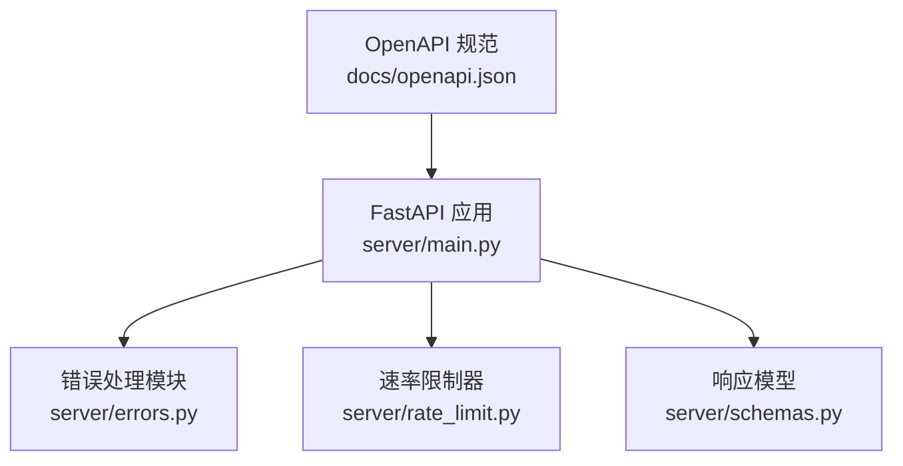
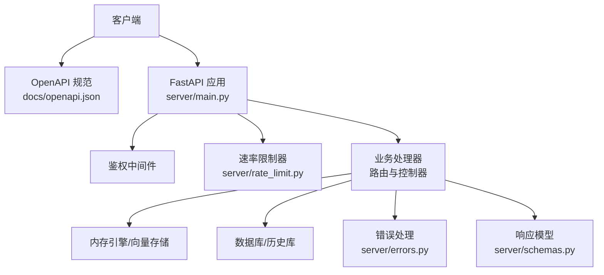
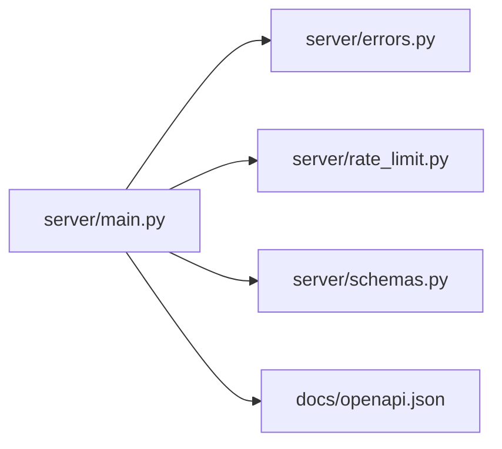

# API 配置和规范

<cite>
**本文引用的文件**
- [openapi.json](file://docs/openapi.json)
- [server/main.py](file://server/main.py)
- [server/schemas.py](file://server/schemas.py)
- [server/errors.py](file://server/errors.py)
- [server/rate_limit.py](file://server/rate_limit.py)
- [docs/api-reference/memory/get-memories.mdx](file://docs/api-reference/memory/get-memories.mdx)
- [docs/api-reference/memory/search-memories.mdx](file://docs/api-reference/memory/search-memories.mdx)
- [docs/api-reference/memory/add-memories.mdx](file://docs/api-reference/memory/add-memories.mdx)
- [docs/api-reference/entities/get-users.mdx](file://docs/api-reference/entities/get-users.mdx)
- [docs/api-reference/events/get-events.mdx](file://docs/api-reference/events/get-events.mdx)
- [docs/api-reference/webhook/create-webhook.mdx](file://docs/api-reference/webhook/create-webhook.mdx)
- [docs/changelog/sdk.mdx](file://docs/changelog/sdk.mdx)
- [docs/migration/api-changes.mdx](file://docs/migration/api-changes.mdx)
- [docs/platform/features/platform-overview.mdx](file://docs/platform/features/platform-overview.mdx)
- [docs/open-source/features/rest-api.mdx](file://docs/open-source/features/rest-api.mdx)
</cite>

## 目录
1. [简介](#简介)
2. [项目结构](#项目结构)
3. [核心组件](#核心组件)
4. [架构总览](#架构总览)
5. [详细组件分析](#详细组件分析)
6. [依赖关系分析](#依赖关系分析)
7. [性能考虑](#性能考虑)
8. [故障排查指南](#故障排查指南)
9. [结论](#结论)
10. [附录](#附录)

## 简介
本文件系统化梳理 Mem0 平台的 API 配置与规范，覆盖版本控制策略、请求/响应格式、错误码定义、基础 URL、端点命名约定、参数传递方式、限流与缓存策略、性能优化建议、OpenAPI 规范与 SDK 生成、客户端集成指引，以及兼容性保证、弃用策略与迁移指南。内容基于仓库中的 OpenAPI 规范、服务端实现与官方文档。

## 项目结构
- API 文档与规范
  - OpenAPI 规范：位于 docs/openapi.json，描述服务器地址、安全方案、路径与数据模型。
  - API 参考文档：位于 docs/api-reference/*，提供各端点的参数、示例与变更说明。
- 服务端实现
  - FastAPI 应用入口与路由挂载：server/main.py
  - 错误处理与上游错误分类：server/errors.py
  - 速率限制器：server/rate_limit.py
  - 响应模型：server/schemas.py
- 官方文档
  - 平台特性与 REST API 使用说明：docs/platform/features/platform-overview.mdx、docs/open-source/features/rest-api.mdx
  - SDK 发布与变更日志：docs/changelog/sdk.mdx
  - API 变更与迁移指南：docs/migration/api-changes.mdx

图表来源
- [openapi.json](file://docs/openapi.json)
- [server/main.py](file://server/main.py)
- [server/errors.py](file://server/errors.py)
- [server/rate_limit.py](file://server/rate_limit.py)
- [server/schemas.py](file://server/schemas.py)

章节来源
- [openapi.json](file://docs/openapi.json)
- [server/main.py](file://server/main.py)

## 核心组件
- 服务器与路由
  - 通过 FastAPI 构建 REST API，启用 CORS、中间件与异常处理器；包含认证、配置管理、内存增删改查、事件查询等路由。
- OpenAPI 规范
  - 描述服务器地址、安全方案（API Key）、路径集合与数据模型，覆盖实体、事件、导出、应用、代理等资源。
- 错误处理
  - 统一捕获上游服务异常，按类型分类为认证失败、配额限制、超时、连接失败、数据库不可达、向量存储不可达等，并返回标准化错误体。
- 速率限制
  - 基于 IP 的慢速限流器，统一拦截超过配额的请求并返回标准错误。
- 响应模型
  - 提供通用消息响应模型，用于删除、重置等操作的标准返回。

章节来源
- [server/main.py](file://server/main.py)
- [server/errors.py](file://server/errors.py)
- [server/rate_limit.py](file://server/rate_limit.py)
- [server/schemas.py](file://server/schemas.py)

## 架构总览
下图展示 API 的总体交互：客户端通过 OpenAPI 描述的端点访问服务端；服务端进行鉴权、限流、调用内存引擎与持久层，并以统一错误与响应模型返回结果。

图表来源
- [openapi.json](file://docs/openapi.json)
- [server/main.py](file://server/main.py)
- [server/errors.py](file://server/errors.py)
- [server/rate_limit.py](file://server/rate_limit.py)
- [server/schemas.py](file://server/schemas.py)

## 详细组件分析

### 版本控制策略
- OpenAPI 版本
  - 规范中声明 OpenAPI 版本为 3.0.1，API 标题与版本字段位于 info 节点。
- 服务器版本
  - FastAPI 应用的 version 字段用于标识服务版本。
- 路径版本
  - OpenAPI 中存在多条路径前缀包含版本号（如 /v1/、/v2/），表明采用路径前缀式版本控制策略。
- 迁移与兼容
  - 变更日志与迁移指南文档提供了版本演进与兼容性说明，建议在升级前阅读相关迁移章节。

章节来源
- [openapi.json](file://docs/openapi.json)
- [server/main.py](file://server/main.py)
- [docs/migration/api-changes.mdx](file://docs/migration/api-changes.mdx)

### 基础 URL 与端点命名约定
- 基础 URL
  - servers 数组中定义了默认服务器地址，用于生成文档与 SDK 示例。
- 端点命名
  - 多数端点采用复数名词（如 /entities/、/events/、/exports/）表示集合；单个资源使用资源名加 ID（如 /entities/{entity_type}/{entity_id}/）。
  - 动作类端点使用动词（如 /memories/{id}/history、/reset）。
- 参数传递
  - 查询参数：如分页、过滤、组织/项目筛选等。
  - 路径参数：如实体类型与 ID。
  - 请求体：JSON 对象，包含业务必需字段与可选字段。

章节来源
- [openapi.json](file://docs/openapi.json)

### 请求/响应格式规范
- 请求体
  - 大多数写操作要求 application/json，包含业务对象（如创建实体、导出任务、搜索请求等）。
- 响应体
  - 成功响应通常返回 JSON 对象或数组；部分端点返回自定义消息对象（如删除成功）。
  - 错误响应包含标准化字段：错误代码、详情、请求 ID。
- 日期时间
  - 规范中对 date-time 格式进行了约束，确保客户端正确解析时间戳。

章节来源
- [openapi.json](file://docs/openapi.json)
- [server/schemas.py](file://server/schemas.py)

### 错误码定义
- 标准错误结构
  - 包含错误代码、详情与请求 ID，便于追踪与排障。
- 上游错误分类
  - 认证失败、配额限制、超时、连接失败、数据库不可达、向量存储不可达、未知错误等。
- HTTP 状态码映射
  - 速率限制返回 429；认证/权限问题返回 401/403；请求无效返回 400/422；服务器错误返回 500+；上游服务异常返回 502。

章节来源
- [server/errors.py](file://server/errors.py)

### 限流策略
- 实现方式
  - 使用基于 IP 的慢速限流器，统一拦截超配额请求。
- 异常处理
  - 捕获速率限制异常并返回标准错误响应。
- 建议
  - 客户端在高并发场景下应实现退避重试与幂等设计；服务端可根据业务调整配额策略。

章节来源
- [server/rate_limit.py](file://server/rate_limit.py)
- [server/main.py](file://server/main.py)

### 缓存机制与性能优化
- 缓存现状
  - 未发现内置缓存层或响应缓存策略。
- 性能建议
  - 合理设置 top_k、阈值与 explain 参数，减少不必要的评分细节。
  - 使用 filters 精确限定查询范围，避免全表扫描。
  - 在客户端实现指数退避与批量请求合并，降低请求频率。
  - 对长耗时任务（如导出）采用异步模式并轮询状态。

章节来源
- [openapi.json](file://docs/openapi.json)
- [server/main.py](file://server/main.py)

### OpenAPI 规范与 SDK 生成
- OpenAPI 规范
  - 包含服务器地址、安全方案、路径、参数与数据模型，支持多语言 SDK 生成。
- SDK 生成
  - 官方文档包含 SDK 发布与变更日志，建议根据最新版本生成客户端 SDK。
- 客户端集成
  - 使用 API Key 或 Bearer Token 进行鉴权；参考各端点示例与参数说明完成集成。

章节来源
- [openapi.json](file://docs/openapi.json)
- [docs/changelog/sdk.mdx](file://docs/changelog/sdk.mdx)

### 兼容性保证、弃用策略与迁移指南
- 兼容性
  - 通过路径版本（/v1/、/v2/）与变更日志维护向后兼容。
- 弃用策略
  - 对已弃用的参数或端点提供警告与替代方案（如 /search 中的废弃字段迁移到 filters）。
- 迁移指南
  - 提供 API 变更与平台迁移的详细说明，建议在升级前评估影响并执行迁移步骤。

章节来源
- [docs/migration/api-changes.mdx](file://docs/migration/api-changes.mdx)
- [server/main.py](file://server/main.py)

## 依赖关系分析
- 组件耦合
  - FastAPI 应用依赖错误处理模块与速率限制器；路由层依赖内存引擎与持久层。
- 外部依赖
  - OpenAI/Gemini 等 LLM/Embedder 提供商需通过配置注入；向量存储提供商需满足打包要求。
- 循环依赖
  - 当前结构清晰，未见循环导入迹象。

图表来源
- [server/main.py](file://server/main.py)
- [server/errors.py](file://server/errors.py)
- [server/rate_limit.py](file://server/rate_limit.py)
- [server/schemas.py](file://server/schemas.py)
- [openapi.json](file://docs/openapi.json)

章节来源
- [server/main.py](file://server/main.py)
- [server/errors.py](file://server/errors.py)
- [server/rate_limit.py](file://server/rate_limit.py)
- [server/schemas.py](file://server/schemas.py)
- [openapi.json](file://docs/openapi.json)

## 性能考虑
- 查询优化
  - 使用 filters 精确过滤；合理设置 top_k 与阈值；必要时开启 explain 获取评分明细但注意开销。
- 存储与网络
  - 选择稳定的向量存储与数据库供应商；在容器部署中确保网络连通性与延迟可控。
- 并发与限流
  - 客户端实现退避重试；服务端通过限流器保护上游资源。

## 故障排查指南
- 常见错误定位
  - 查看错误响应中的错误代码与请求 ID，结合服务端日志定位问题。
- 上游服务异常
  - 分类包括认证失败、配额限制、超时、连接失败、数据库与向量存储不可达等。
- 速率限制
  - 若频繁遇到 429，请降低请求频率或申请更高配额。
- 日志与追踪
  - 服务端中间件会附加 X-Request-ID，便于跨服务链路追踪。

章节来源
- [server/errors.py](file://server/errors.py)
- [server/main.py](file://server/main.py)

## 结论
本文件基于仓库中的 OpenAPI 规范与服务端实现，总结了 Mem0 平台的 API 配置与规范要点。建议在集成过程中严格遵循版本控制策略、参数传递约定与错误处理流程，并结合迁移指南与性能建议完成平滑升级与优化。

## 附录

### 端点与参数参考（节选）
- 内存管理
  - 获取所有记忆、按 ID 获取记忆、搜索记忆、更新记忆、删除记忆、查看历史、批量删除、重置等。
- 实体管理
  - 列举实体、按类型与 ID 删除实体等。
- 事件管理
  - 列举事件、按 ID 获取事件详情。
- 导出与 Webhook
  - 创建导出任务、列举导出结果、创建/更新/删除 Webhook。

章节来源
- [docs/api-reference/memory/get-memories.mdx](file://docs/api-reference/memory/get-memories.mdx)
- [docs/api-reference/memory/search-memories.mdx](file://docs/api-reference/memory/search-memories.mdx)
- [docs/api-reference/memory/add-memories.mdx](file://docs/api-reference/memory/add-memories.mdx)
- [docs/api-reference/entities/get-users.mdx](file://docs/api-reference/entities/get-users.mdx)
- [docs/api-reference/events/get-events.mdx](file://docs/api-reference/events/get-events.mdx)
- [docs/api-reference/webhook/create-webhook.mdx](file://docs/api-reference/webhook/create-webhook.mdx)