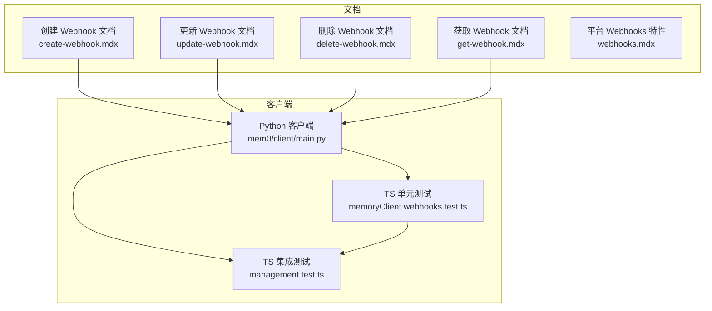
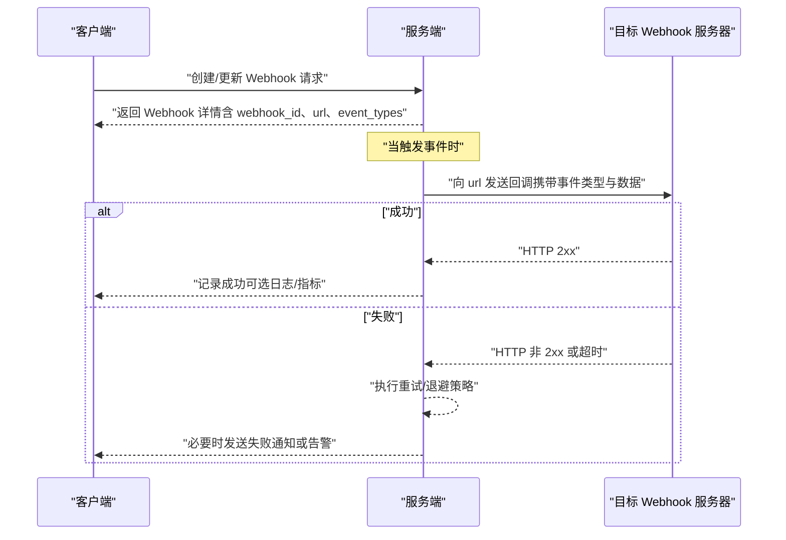
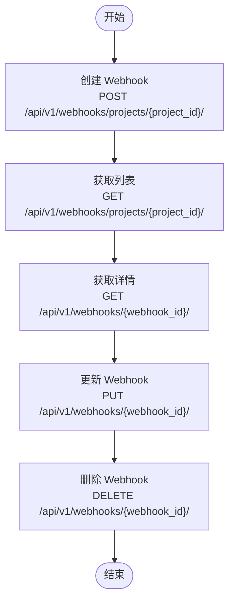
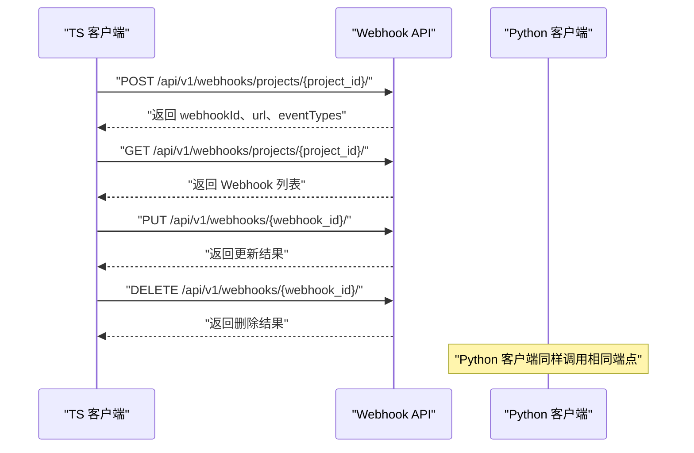
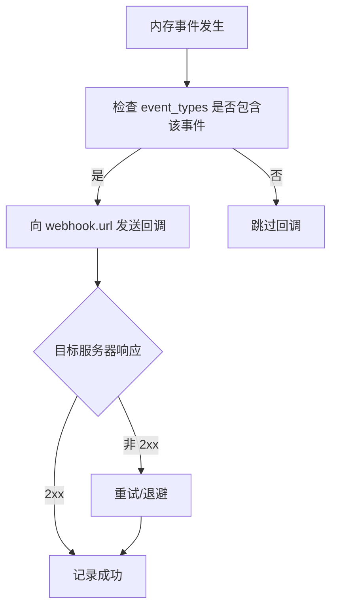
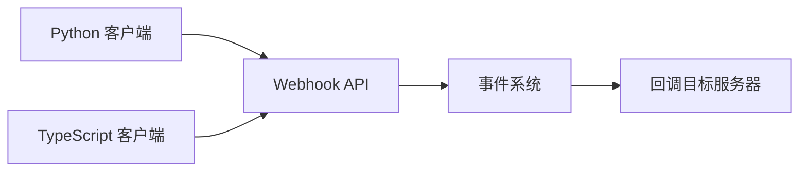

# Webhook API

<cite>
**本文引用的文件**
- [create-webhook.mdx](file://docs/api-reference/webhook/create-webhook.mdx)
- [update-webhook.mdx](file://docs/api-reference/webhook/update-webhook.mdx)
- [delete-webhook.mdx](file://docs/api-reference/webhook/delete-webhook.mdx)
- [get-webhook.mdx](file://docs/api-reference/webhook/get-webhook.mdx)
- [webhooks.mdx](file://docs/platform/features/webhooks.mdx)
- [main.py](file://mem0/client/main.py)
- [memoryClient.webhooks.test.ts](file://mem0-ts/src/client/tests/memoryClient.webhooks.test.ts)
- [management.test.ts](file://mem0-ts/src/client/tests/integration/management.test.ts)
</cite>

## 目录
1. [简介](#简介)
2. [项目结构](#项目结构)
3. [核心组件](#核心组件)
4. [架构总览](#架构总览)
5. [详细组件分析](#详细组件分析)
6. [依赖关系分析](#依赖关系分析)
7. [性能考虑](#性能考虑)
8. [故障排查指南](#故障排查指南)
9. [结论](#结论)
10. [附录](#附录)

## 简介
本文件系统性梳理 Webhook API 的设计与实现，覆盖以下方面：
- Webhook 相关端点：创建、获取列表、获取详情、更新、删除
- Webhook 配置项、事件类型与回调机制
- 安全校验、重试与错误处理策略
- 测试、调试与监控建议

该仓库提供了多语言客户端（Python 与 TypeScript）对 Webhook 能力的调用示例与测试，便于理解端到端流程。

## 项目结构
Webhook API 的接口定义与使用说明主要分布在以下位置：
- 接口文档：docs/api-reference/webhook/*.mdx
- 平台特性说明：docs/platform/features/webhooks.mdx
- 客户端实现与测试：
  - Python 客户端：mem0/client/main.py
  - TypeScript 客户端测试：mem0-ts/src/client/tests/memoryClient.webhooks.test.ts、mem0-ts/src/client/tests/integration/management.test.ts

**图表来源**
- [create-webhook.mdx](file://docs/api-reference/webhook/create-webhook.mdx)
- [update-webhook.mdx](file://docs/api-reference/webhook/update-webhook.mdx)
- [delete-webhook.mdx](file://docs/api-reference/webhook/delete-webhook.mdx)
- [get-webhook.mdx](file://docs/api-reference/webhook/get-webhook.mdx)
- [webhooks.mdx](file://docs/platform/features/webhooks.mdx)
- [main.py](file://mem0/client/main.py)
- [memoryClient.webhooks.test.ts](file://mem0-ts/src/client/tests/memoryClient.webhooks.test.ts)
- [management.test.ts](file://mem0-ts/src/client/tests/integration/management.test.ts)

**章节来源**
- [create-webhook.mdx](file://docs/api-reference/webhook/create-webhook.mdx)
- [update-webhook.mdx](file://docs/api-reference/webhook/update-webhook.mdx)
- [delete-webhook.mdx](file://docs/api-reference/webhook/delete-webhook.mdx)
- [get-webhook.mdx](file://docs/api-reference/webhook/get-webhook.mdx)
- [webhooks.mdx](file://docs/platform/features/webhooks.mdx)
- [main.py](file://mem0/client/main.py)
- [memoryClient.webhooks.test.ts](file://mem0-ts/src/client/tests/memoryClient.webhooks.test.ts)
- [management.test.ts](file://mem0-ts/src/client/tests/integration/management.test.ts)

## 核心组件
- Webhook 端点族
  - 创建 Webhook：POST /api/v1/webhooks/projects/{project_id}/
  - 获取 Webhook 列表：GET /api/v1/webhooks/projects/{project_id}/
  - 获取 Webhook 详情：GET /api/v1/webhooks/{webhook_id}/
  - 更新 Webhook：PUT /api/v1/webhooks/{webhook_id}/
  - 删除 Webhook：DELETE /api/v1/webhooks/{webhook_id}/
- Webhook 配置项
  - 名称（name）
  - 回调地址（url）
  - 事件类型（event_types），如 MEMORY_ADDED、MEMORY_UPDATED、MEMORY_DELETED 等
  - 激活状态（isActive）
  - 标识符（webhook_id）
- 客户端能力
  - Python 客户端：提供 get_webhooks、create_webhook、update_webhook 等方法
  - TypeScript 客户端：通过单元测试与集成测试验证请求体字段命名（snake_case）、响应行为与端点交互

**章节来源**
- [create-webhook.mdx](file://docs/api-reference/webhook/create-webhook.mdx)
- [update-webhook.mdx](file://docs/api-reference/webhook/update-webhook.mdx)
- [delete-webhook.mdx](file://docs/api-reference/webhook/delete-webhook.mdx)
- [get-webhook.mdx](file://docs/api-reference/webhook/get-webhook.mdx)
- [main.py](file://mem0/client/main.py)
- [memoryClient.webhooks.test.ts](file://mem0-ts/src/client/tests/memoryClient.webhooks.test.ts)
- [management.test.ts](file://mem0-ts/src/client/tests/integration/management.test.ts)

## 架构总览
下图展示了 Webhook 的典型调用链路：客户端发起请求至服务端，服务端根据配置向目标 URL 发送回调，并在失败时进行重试与告警。

[此图为概念性流程示意，不直接映射具体源码文件，故无“图表来源”]

## 详细组件分析

### Webhook 端点与参数
- 创建 Webhook
  - 方法与路径：POST /api/v1/webhooks/projects/{project_id}/
  - 关键参数：name、url、event_types（数组）
  - 返回：webhookId、name、url、eventTypes、isActive 等
- 获取 Webhook 列表
  - 方法与路径：GET /api/v1/webhooks/projects/{project_id}/
  - 返回：Webhook 数组（每项包含上述关键字段）
- 获取 Webhook 详情
  - 方法与路径：GET /api/v1/webhooks/{webhook_id}/
  - 返回：单个 Webhook 的完整信息
- 更新 Webhook
  - 方法与路径：PUT /api/v1/webhooks/{webhook_id}/
  - 可更新字段：name、url、event_types
  - 返回：操作结果（如消息）
- 删除 Webhook
  - 方法与路径：DELETE /api/v1/webhooks/{webhook_id}/
  - 返回：删除结果（如消息）

**章节来源**
- [create-webhook.mdx](file://docs/api-reference/webhook/create-webhook.mdx)
- [update-webhook.mdx](file://docs/api-reference/webhook/update-webhook.mdx)
- [delete-webhook.mdx](file://docs/api-reference/webhook/delete-webhook.mdx)
- [get-webhook.mdx](file://docs/api-reference/webhook/get-webhook.mdx)

### 客户端实现与测试要点
- Python 客户端
  - 提供 get_webhooks、create_webhook、update_webhook 等方法，内部构造相应路径并发送请求
  - 响应后封装为字典返回，便于上层使用
- TypeScript 客户端测试
  - 单元测试验证请求体字段命名规范（snake_case：event_types），以及不包含 webhookId、eventTypes 等字段
  - 集成测试覆盖创建、查询、更新、删除的端到端流程，断言返回值与状态

**图表来源**
- [main.py](file://mem0/client/main.py)
- [memoryClient.webhooks.test.ts](file://mem0-ts/src/client/tests/memoryClient.webhooks.test.ts)
- [management.test.ts](file://mem0-ts/src/client/tests/integration/management.test.ts)

**章节来源**
- [main.py](file://mem0/client/main.py)
- [memoryClient.webhooks.test.ts](file://mem0-ts/src/client/tests/memoryClient.webhooks.test.ts)
- [management.test.ts](file://mem0-ts/src/client/tests/integration/management.test.ts)

### 事件类型与回调机制
- 事件类型示例：MEMORY_ADDED、MEMORY_UPDATED、MEMORY_DELETED
- 回调内容：服务端在事件发生时向 webhook.url 发送请求，携带事件类型与相关数据
- 过滤与订阅：通过 event_types 控制回调范围

**章节来源**
- [management.test.ts](file://mem0-ts/src/client/tests/integration/management.test.ts)

### 安全验证
- 认证与授权：Webhook 端点受平台认证保护，需确保请求携带有效凭据
- 回调签名：建议在目标服务器校验回调签名，防止伪造请求
- 传输安全：使用 HTTPS 以保障回调传输机密性与完整性
- 速率限制：服务端可能对回调频率进行限制，避免对下游造成压力

[本节为通用实践说明，未直接分析具体源码文件，故无“章节来源”]

### 重试机制与错误处理
- 重试策略：服务端在回调失败时执行重试与退避，直至成功或达到上限
- 失败处理：记录失败原因、统计失败次数；必要时触发告警或通知
- 超时控制：合理设置回调超时时间，避免阻塞主流程
- 幂等性：目标服务器应保证重复回调的幂等性，避免副作用

[本节为通用实践说明，未直接分析具体源码文件，故无“章节来源”]

### 测试、调试与监控
- 单元测试：验证请求体字段命名（snake_case）、不含多余字段
- 集成测试：覆盖创建、查询、更新、删除的完整流程
- 调试技巧：开启服务端日志，观察回调发送与响应；在目标服务器记录收到的请求与响应
- 监控指标：回调成功率、延迟分布、失败原因分类、重试次数等

**章节来源**
- [memoryClient.webhooks.test.ts](file://mem0-ts/src/client/tests/memoryClient.webhooks.test.ts)
- [management.test.ts](file://mem0-ts/src/client/tests/integration/management.test.ts)

## 依赖关系分析
- 客户端到服务端：Python 与 TypeScript 客户端均依赖 Webhook API 的统一端点
- 端点到业务：Webhook 端点与项目维度绑定（/projects/{project_id}），体现按项目隔离的配置管理
- 端点到事件：回调由事件驱动，事件类型决定是否发送回调

**图表来源**
- [main.py](file://mem0/client/main.py)
- [memoryClient.webhooks.test.ts](file://mem0-ts/src/client/tests/memoryClient.webhooks.test.ts)
- [management.test.ts](file://mem0-ts/src/client/tests/integration/management.test.ts)

**章节来源**
- [main.py](file://mem0/client/main.py)
- [memoryClient.webhooks.test.ts](file://mem0-ts/src/client/tests/memoryClient.webhooks.test.ts)
- [management.test.ts](file://mem0-ts/src/client/tests/integration/management.test.ts)

## 性能考虑
- 回调并发：避免在回调中执行耗时操作，必要时异步化或队列化
- 超时与重试：合理设置超时与重试间隔，避免雪崩效应
- 目标服务器容量：确保目标服务器具备足够的吞吐能力，必要时限流或扩容
- 日志与追踪：为回调请求建立唯一标识，便于跨系统追踪

[本节为通用指导，未直接分析具体源码文件，故无“章节来源”]

## 故障排查指南
- 回调未到达
  - 检查 webhook.url 是否可达且支持 HTTPS
  - 校验 event_types 是否包含对应事件
  - 查看服务端回调日志与失败计数
- 回调失败率高
  - 检查目标服务器响应码与超时情况
  - 评估重试策略与退避参数
  - 关注网络抖动与防火墙策略
- 数据不一致
  - 确认回调幂等性实现
  - 对比服务端与目标服务器的数据状态
- 客户端侧问题
  - 使用单元/集成测试复现问题
  - 核对请求体字段命名（snake_case）与必填项

**章节来源**
- [memoryClient.webhooks.test.ts](file://mem0-ts/src/client/tests/memoryClient.webhooks.test.ts)
- [management.test.ts](file://mem0-ts/src/client/tests/integration/management.test.ts)

## 结论
Webhook API 在本仓库中提供了完整的生命周期管理能力：从创建、查询、更新到删除，配合事件类型过滤与回调机制，满足多种业务场景下的实时联动需求。结合安全校验、重试与监控实践，可构建稳定可靠的回调体系。

[本节为总结性内容，未直接分析具体源码文件，故无“章节来源”]

## 附录
- 平台特性说明：平台 Webhooks 功能概述与最佳实践
- 接口文档：各端点的详细参数与示例

**章节来源**
- [webhooks.mdx](file://docs/platform/features/webhooks.mdx)
- [create-webhook.mdx](file://docs/api-reference/webhook/create-webhook.mdx)
- [update-webhook.mdx](file://docs/api-reference/webhook/update-webhook.mdx)
- [delete-webhook.mdx](file://docs/api-reference/webhook/delete-webhook.mdx)
- [get-webhook.mdx](file://docs/api-reference/webhook/get-webhook.mdx)