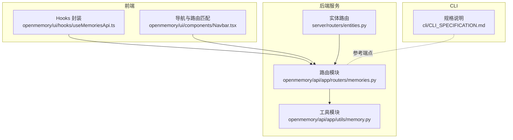
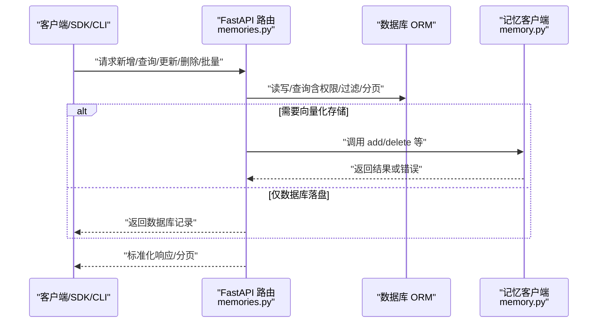
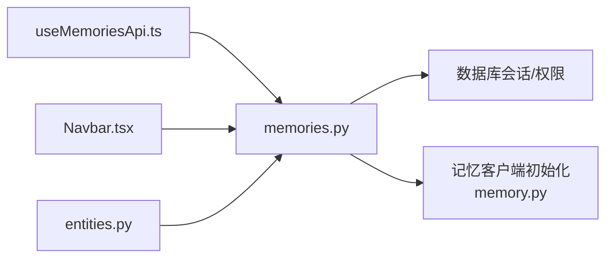

# 内存管理 API

<cite>
**本文引用的文件**
- [openmemory/api/app/routers/memories.py](file://openmemory/api/app/routers/memories.py)
- [openmemory/api/app/utils/memory.py](file://openmemory/api/app/utils/memory.py)
- [CLI 规格说明](file://cli/CLI_SPECIFICATION.md)
- [openmemory/ui/hooks/useMemoriesApi.ts](file://openmemory/ui/hooks/useMemoriesApi.ts)
- [openmemory/ui/components/Navbar.tsx](file://openmemory/ui/components/Navbar.tsx)
- [server/routers/entities.py](file://server/routers/entities.py)
</cite>

## 目录
1. [简介](#简介)
2. [项目结构](#项目结构)
3. [核心组件](#核心组件)
4. [架构总览](#架构总览)
5. [详细组件分析](#详细组件分析)
6. [依赖关系分析](#依赖关系分析)
7. [性能考量](#性能考量)
8. [故障排查指南](#故障排查指南)
9. [结论](#结论)
10. [附录](#附录)

## 简介
本文件为“内存管理 API”的权威技术文档，覆盖所有与内存操作相关的端点：新增记忆、搜索记忆、获取记忆详情、批量列出与筛选、更新记忆、删除记忆、暂停/归档状态变更、访问日志与相关记忆查询等。文档同时说明过滤、排序与分页参数的使用方式，并对批量操作与异步处理进行说明。为便于不同背景的读者理解，文档采用由浅入深的方式组织内容，并在需要时提供可视化图示。

## 项目结构
围绕内存管理 API 的关键代码位于以下位置：
- FastAPI 后端路由与业务逻辑：openmemory/api/app/routers/memories.py
- 记忆客户端初始化与配置解析：openmemory/api/app/utils/memory.py
- CLI 规格与平台端点参考：cli/CLI_SPECIFICATION.md
- 前端调用封装（用于理解请求/响应形态）：openmemory/ui/hooks/useMemoriesApi.ts、openmemory/ui/components/Navbar.tsx
- 平台侧实体路由（用户/代理/运行维度的批量清理）：server/routers/entities.py

图表来源
- [openmemory/api/app/routers/memories.py:1-694](file://openmemory/api/app/routers/memories.py#L1-L694)
- [openmemory/api/app/utils/memory.py:1-505](file://openmemory/api/app/utils/memory.py#L1-L505)
- [openmemory/ui/hooks/useMemoriesApi.ts:181-344](file://openmemory/ui/hooks/useMemoriesApi.ts#L181-L344)
- [openmemory/ui/components/Navbar.tsx:20-62](file://openmemory/ui/components/Navbar.tsx#L20-L62)
- [server/routers/entities.py:1-77](file://server/routers/entities.py#L1-L77)
- [CLI 规格说明:912-927](file://cli/CLI_SPECIFICATION.md#L912-L927)

章节来源
- [openmemory/api/app/routers/memories.py:1-694](file://openmemory/api/app/routers/memories.py#L1-L694)
- [openmemory/api/app/utils/memory.py:1-505](file://openmemory/api/app/utils/memory.py#L1-L505)
- [CLI 规格说明:912-927](file://cli/CLI_SPECIFICATION.md#L912-L927)

## 核心组件
- 路由层（FastAPI）：提供内存增删改查、批量操作、状态变更、访问日志与相关记忆查询等端点；支持过滤、排序与分页。
- 工具层（Memory 客户端）：负责自动检测与拼装向量库、LLM、嵌入模型配置，按需初始化外部记忆客户端。
- 前端 Hooks：封装常用请求（如批量删除、状态变更、按 ID 获取），并处理加载态与错误。
- CLI 规格：定义平台端点清单、过滤构建规则、分页约定与错误映射，作为跨语言实现的契约。

章节来源
- [openmemory/api/app/routers/memories.py:100-186](file://openmemory/api/app/routers/memories.py#L100-L186)
- [openmemory/api/app/routers/memories.py:355-391](file://openmemory/api/app/routers/memories.py#L355-L391)
- [openmemory/api/app/routers/memories.py:415-484](file://openmemory/api/app/routers/memories.py#L415-L484)
- [openmemory/api/app/utils/memory.py:404-501](file://openmemory/api/app/utils/memory.py#L404-L501)
- [openmemory/ui/hooks/useMemoriesApi.ts:181-344](file://openmemory/ui/hooks/useMemoriesApi.ts#L181-L344)
- [CLI 规格说明:912-927](file://cli/CLI_SPECIFICATION.md#L912-L927)

## 架构总览
下图展示从客户端到后端路由、再到记忆客户端与数据库的整体交互路径。

图表来源
- [openmemory/api/app/routers/memories.py:220-327](file://openmemory/api/app/routers/memories.py#L220-L327)
- [openmemory/api/app/utils/memory.py:404-501](file://openmemory/api/app/utils/memory.py#L404-L501)

## 详细组件分析

### 新增记忆（单条）
- 方法与路径
  - POST /api/v1/memories/
- 请求体字段
  - user_id: 字符串，必填
  - text: 字符串，必填
  - metadata: 对象，可选
  - infer: 布尔，可选，默认启用事实抽取
  - app: 字符串，可选，默认值见实现
- 成功响应
  - 返回数据库中保存的记忆对象（包含 id、content、created_at、state、app_id、categories、metadata_ 等）
- 失败场景
  - 用户不存在：404
  - 应用被暂停：403
  - 记忆客户端不可用：返回包含 error 的 JSON
- 异步与向量化
  - 若外部记忆客户端可用，则先写入向量库，再回写数据库；若不可用则仅入库并返回提示信息

章节来源
- [openmemory/api/app/routers/memories.py:212-327](file://openmemory/api/app/routers/memories.py#L212-L327)
- [openmemory/api/app/utils/memory.py:404-501](file://openmemory/api/app/utils/memory.py#L404-L501)

### 搜索记忆（平台端点参考）
- 方法与路径
  - POST /v2/memories/search/
- 请求体字段
  - 由 CLI 规格定义的过滤器与分页参数（详见“过滤/分页”小节）
- 成功响应
  - 返回记忆列表（规范化处理以兼容多种包装形式）
- 失败场景
  - 认证失败：401
  - 资源不存在：404
  - 其他错误：对应映射的错误类

章节来源
- [CLI 规格说明:912-927](file://cli/CLI_SPECIFICATION.md#L912-L927)
- [CLI 规格说明:945-966](file://cli/CLI_SPECIFICATION.md#L945-L966)

### 获取记忆详情
- 方法与路径
  - GET /api/v1/memories/{memory_id}
- 查询参数
  - user_id: 字符串，建议传入以确保权限校验
- 成功响应
  - 包含 id、text、created_at、state、app_id、app_name、categories、metadata_ 等字段
- 失败场景
  - 记忆不存在：404

章节来源
- [openmemory/api/app/routers/memories.py:331-347](file://openmemory/api/app/routers/memories.py#L331-L347)

### 列出记忆（平台端点参考）
- 方法与路径
  - POST /v2/memories/
- 查询参数
  - page、page_size（均为查询参数）
- 请求体字段
  - 过滤器与 enable_graph（均在请求体中）
- 成功响应
  - 分页结果（规范化处理）
- 失败场景
  - 认证失败：401
  - 资源不存在：404
  - 其他错误：对应映射的错误类

章节来源
- [CLI 规格说明:912-927](file://cli/CLI_SPECIFICATION.md#L912-L927)
- [CLI 规格说明:945-950](file://cli/CLI_SPECIFICATION.md#L945-L950)

### 批量列出与筛选（后端端点）
- 方法与路径
  - POST /api/v1/memories/filter
- 请求体字段
  - user_id: 字符串，必填
  - page: 整数，默认 1
  - size: 整数，默认 10
  - search_query: 字符串，可选
  - app_ids: 数组（UUID），可选
  - category_ids: 数组（UUID），可选
  - sort_column: 字符串，可选（支持 memory、app_name、created_at）
  - sort_direction: 字符串，可选（asc 或 desc）
  - from_date: 时间戳，可选
  - to_date: 时间戳，可选
  - show_archived: 布尔，可选，默认不显示已归档
- 成功响应
  - 分页结果，每项包含 id、content、created_at、state、app_id、app_name、categories、metadata_
- 失败场景
  - 用户不存在：404
  - 排序列无效：400
  - 排序方向无效：400

章节来源
- [openmemory/api/app/routers/memories.py:532-636](file://openmemory/api/app/routers/memories.py#L532-L636)

### 列出记忆（后端端点）
- 方法与路径
  - GET /api/v1/memories/
- 查询参数
  - user_id: 字符串，必填
  - app_id: UUID，可选
  - from_date: 时间戳，可选
  - to_date: 时间戳，可选
  - categories: 逗号分隔字符串，可选
  - search_query: 字符串，可选
  - sort_column: 字符串，可选（支持 memory、categories、app_name、created_at）
  - sort_direction: 字符串，可选（asc 或 desc）
  - page、page_size: 分页参数（通过 fastapi_pagination 的 Params 依赖注入）
- 成功响应
  - 分页结果，每项包含 id、content、created_at、state、app_id、app_name、categories、metadata_
- 失败场景
  - 用户不存在：404

章节来源
- [openmemory/api/app/routers/memories.py:100-186](file://openmemory/api/app/routers/memories.py#L100-L186)

### 更新记忆
- 方法与路径
  - PUT /api/v1/memories/{memory_id}
- 请求体字段
  - memory_content: 字符串，必填
  - user_id: 字符串，必填
- 成功响应
  - 返回更新后的记忆对象
- 失败场景
  - 用户不存在：404
  - 记忆不存在：404

章节来源
- [openmemory/api/app/routers/memories.py:517-530](file://openmemory/api/app/routers/memories.py#L517-L530)

### 删除记忆
- 方法与路径
  - DELETE /api/v1/memories/{memory_id}
- 成功响应
  - 返回消息（例如“删除成功”）
- 失败场景
  - 记忆不存在：404

章节来源
- [openmemory/api/app/routers/memories.py:331-347](file://openmemory/api/app/routers/memories.py#L331-L347)

### 批量删除
- 方法与路径
  - DELETE /api/v1/memories/
- 请求体字段
  - memory_ids: 数组（UUID），必填
  - user_id: 字符串，必填
- 成功响应
  - 返回消息（例如“成功删除 n 条记忆”）
- 失败场景
  - 用户不存在：404
  - 记忆客户端不可用：503

章节来源
- [openmemory/api/app/routers/memories.py:355-391](file://openmemory/api/app/routers/memories.py#L355-L391)

### 批量暂停/归档/删除（状态变更）
- 方法与路径
  - POST /api/v1/memories/actions/pause
- 请求体字段
  - memory_ids: 数组（UUID），可选
  - category_ids: 数组（UUID），可选
  - app_id: UUID，可选
  - all_for_app: 布尔，可选
  - global_pause: 布尔，可选
  - state: 枚举（paused、archived、deleted），可选，默认 paused
  - user_id: 字符串，必填
- 成功响应
  - 返回消息（例如“成功暂停/归档/删除 n 条记忆”）
- 失败场景
  - 参数无效：400
  - 用户不存在：404

章节来源
- [openmemory/api/app/routers/memories.py:415-484](file://openmemory/api/app/routers/memories.py#L415-L484)

### 归档/删除（便捷端点）
- 方法与路径
  - POST /api/v1/memories/actions/archive
  - DELETE /api/v1/memories/（批量删除）
- 行为说明
  - 归档：将记忆状态标记为 archived，并记录状态历史
  - 删除：将记忆状态标记为 deleted，并记录状态历史

章节来源
- [openmemory/api/app/routers/memories.py:394-403](file://openmemory/api/app/routers/memories.py#L394-L403)
- [openmemory/api/app/routers/memories.py:355-391](file://openmemory/api/app/routers/memories.py#L355-L391)

### 访问日志与相关记忆
- 访问日志
  - 方法与路径：GET /api/v1/memories/{memory_id}/access-log
  - 查询参数：page、page_size（默认 1、10，上限 100）
  - 成功响应：包含 total、page、page_size、logs
- 相关记忆
  - 方法与路径：GET /api/v1/memories/{memory_id}/related
  - 查询参数：user_id、page、page_size（page 默认 1，size 固定为 5）
  - 成功响应：分页结果，按类别交集与出现次数排序

章节来源
- [openmemory/api/app/routers/memories.py:488-510](file://openmemory/api/app/routers/memories.py#L488-L510)
- [openmemory/api/app/routers/memories.py:639-694](file://openmemory/api/app/routers/memories.py#L639-L694)

### 实体级批量清理（平台端点）
- 方法与路径
  - GET /v1/entities/
  - DELETE /v1/entities/{type}/{id}
- 行为说明
  - 列出实体（user/agent/run）及其记忆总数
  - 删除指定实体类型与 ID 下的所有记忆（管理员）

章节来源
- [server/routers/entities.py:43-77](file://server/routers/entities.py#L43-L77)

## 依赖关系分析
- 路由依赖数据库会话与权限检查，部分端点依赖记忆客户端进行向量存储操作。
- 记忆客户端通过环境变量与数据库配置动态组装，支持多向量库与多 LLM/嵌入提供商。
- 前端通过 Hooks 统一封装常见批量操作，减少重复逻辑。

图表来源
- [openmemory/api/app/routers/memories.py:100-186](file://openmemory/api/app/routers/memories.py#L100-L186)
- [openmemory/api/app/utils/memory.py:404-501](file://openmemory/api/app/utils/memory.py#L404-L501)
- [openmemory/ui/hooks/useMemoriesApi.ts:181-344](file://openmemory/ui/hooks/useMemoriesApi.ts#L181-L344)
- [openmemory/ui/components/Navbar.tsx:20-62](file://openmemory/ui/components/Navbar.tsx#L20-L62)
- [server/routers/entities.py:43-77](file://server/routers/entities.py#L43-L77)

## 性能考量
- 分页与排序
  - 使用 fastapi_pagination 提供高效分页；排序字段与方向需合法，避免全表扫描。
- 过滤策略
  - 优先使用索引列（如 created_at、user_id、app_id、categories）以降低查询成本。
- 向量库写入
  - 新增记忆时若启用外部记忆客户端，应关注网络延迟与重试策略；客户端不可用时仅入库，保证可用性。
- 相关记忆查询
  - 相关性基于类别交集与出现次数，固定 page_size=5，避免大结果集。

章节来源
- [openmemory/api/app/routers/memories.py:100-186](file://openmemory/api/app/routers/memories.py#L100-L186)
- [openmemory/api/app/routers/memories.py:639-694](file://openmemory/api/app/routers/memories.py#L639-L694)
- [openmemory/api/app/utils/memory.py:404-501](file://openmemory/api/app/utils/memory.py#L404-L501)

## 故障排查指南
- 认证失败
  - 平台端点参考中明确 401 映射为认证错误；请检查 API Key 与 Base URL。
- 资源不存在
  - 404 常见于记忆 ID 错误或用户不存在；请核对 user_id 与 memory_id。
- 记忆客户端不可用
  - 批量删除与新增时若返回服务不可用，检查向量库连接与配置；系统将降级为仅数据库落盘。
- 排序与过滤错误
  - 排序列或方向非法会触发 400；确认 sort_column 与 sort_direction 的取值范围。

章节来源
- [CLI 规格说明:968-979](file://cli/CLI_SPECIFICATION.md#L968-L979)
- [openmemory/api/app/routers/memories.py:517-530](file://openmemory/api/app/routers/memories.py#L517-L530)
- [openmemory/api/app/routers/memories.py:355-391](file://openmemory/api/app/routers/memories.py#L355-L391)

## 结论
本文档系统梳理了内存管理 API 的端点、参数、响应与错误处理，并结合前端与 CLI 的使用实践，给出过滤、排序与分页的最佳实践。对于大规模部署，建议结合索引优化、分页与缓存策略提升性能；在混合部署场景下，注意向量库可用性与降级策略。

## 附录

### 过滤、排序与分页参数速查
- 列出记忆（后端 GET）
  - 查询参数：user_id、app_id、from_date、to_date、categories、search_query、sort_column、sort_direction、page、page_size
  - 支持排序列：memory、categories、app_name、created_at
- 批量筛选（后端 POST）
  - 请求体字段：user_id、page、size、search_query、app_ids、category_ids、sort_column、sort_direction、from_date、to_date、show_archived
  - 支持排序列：memory、app_name、created_at
- 列出记忆（平台端点）
  - 查询参数：page、page_size
  - 请求体：filters、enable_graph
- 搜索记忆（平台端点）
  - 请求体：filters、enable_graph
  - 响应：数组或包裹在 results/memories 中的数组（统一规范化）

章节来源
- [openmemory/api/app/routers/memories.py:100-186](file://openmemory/api/app/routers/memories.py#L100-L186)
- [openmemory/api/app/routers/memories.py:532-636](file://openmemory/api/app/routers/memories.py#L532-L636)
- [CLI 规格说明:945-966](file://cli/CLI_SPECIFICATION.md#L945-L966)

### 批量操作与异步处理
- 批量删除
  - 通过请求体携带 memory_ids 与 user_id；内部逐条调用外部记忆客户端删除并向量库同步，随后在数据库中标记为 deleted。
- 状态变更（暂停/归档/删除）
  - 支持按 memory_ids、category_ids、app_id、全局开关等条件批量变更；变更后记录状态历史。
- 异步与降级
  - 当外部记忆客户端不可用时，新增/删除等操作将仅在数据库层面执行，并返回包含 error 的 JSON，避免阻塞主流程。

章节来源
- [openmemory/api/app/routers/memories.py:355-391](file://openmemory/api/app/routers/memories.py#L355-L391)
- [openmemory/api/app/routers/memories.py:415-484](file://openmemory/api/app/routers/memories.py#L415-L484)
- [openmemory/api/app/utils/memory.py:404-501](file://openmemory/api/app/utils/memory.py#L404-L501)