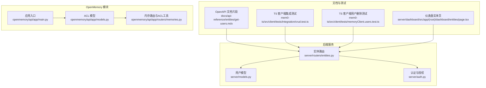
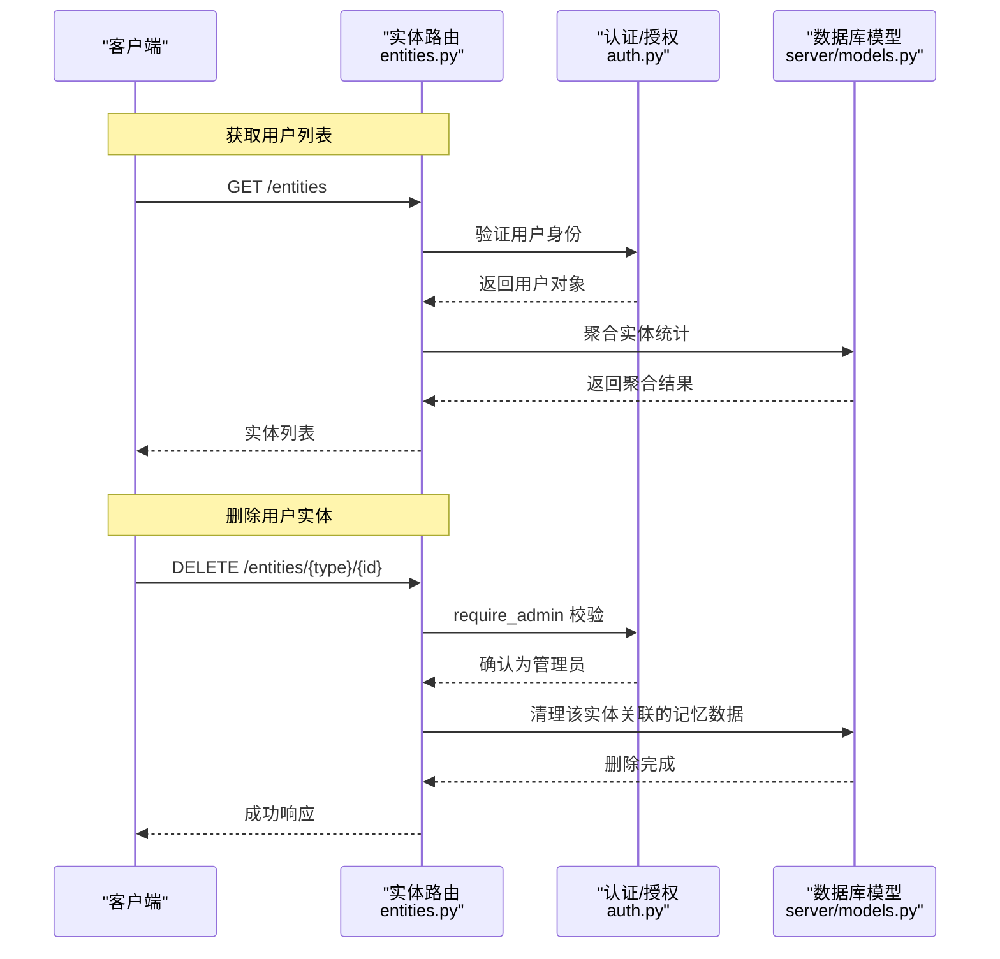
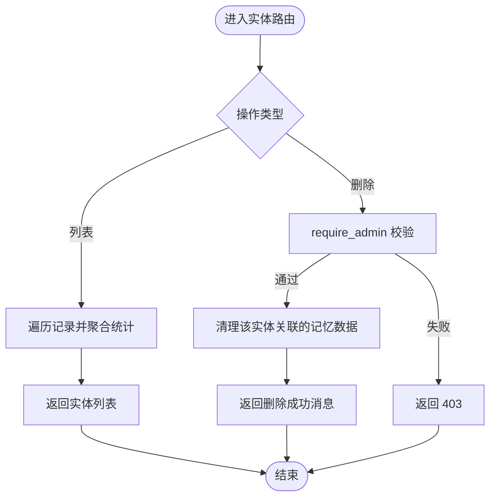
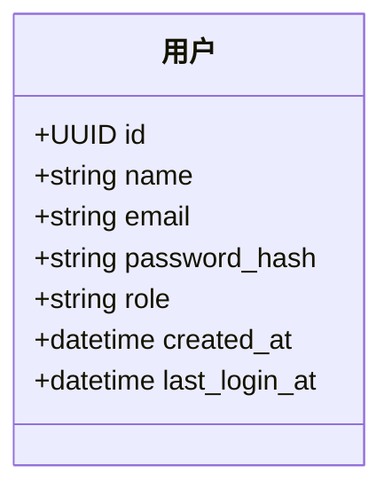
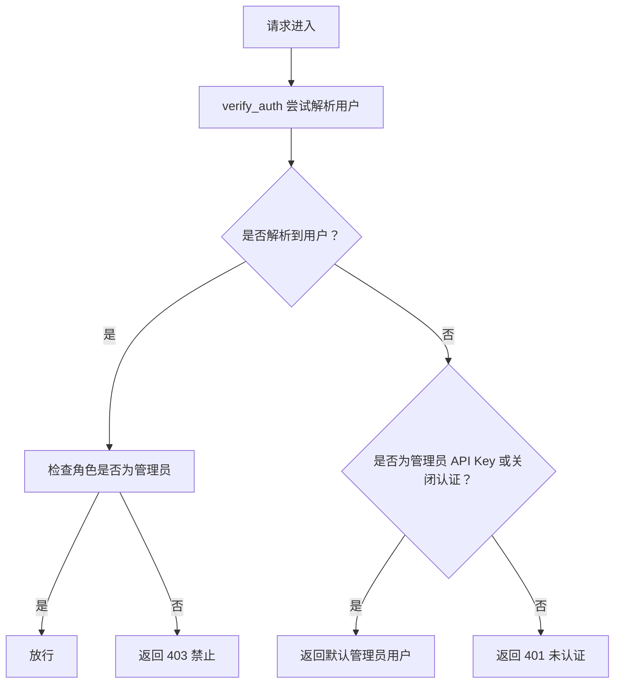
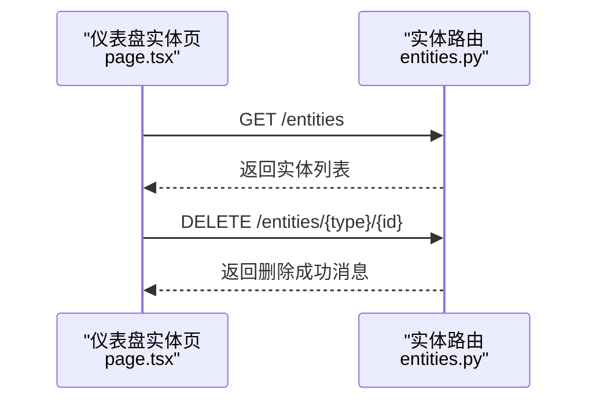
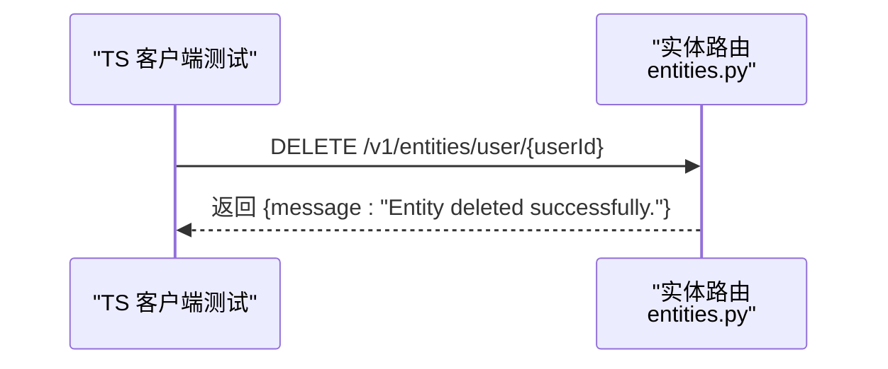
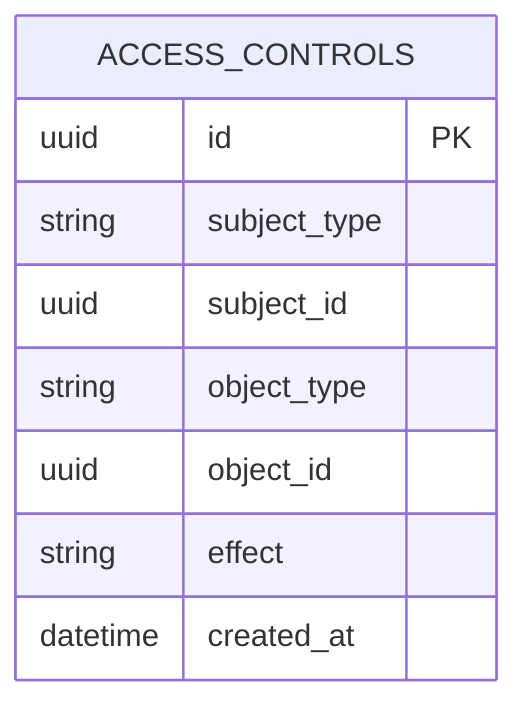
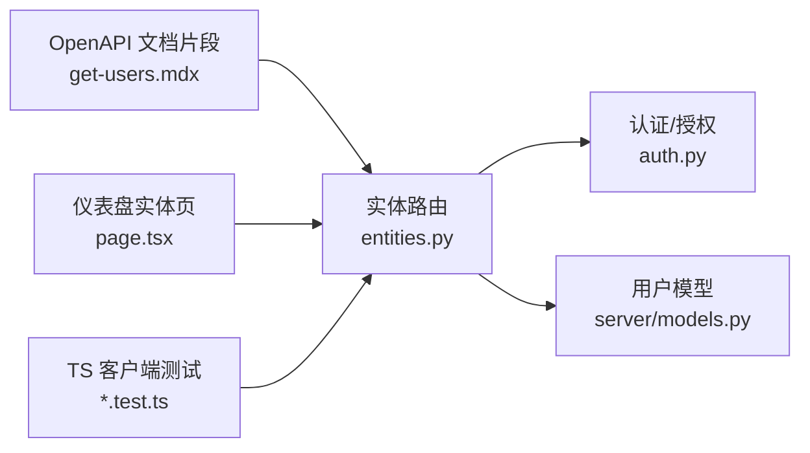

# 用户管理 API

<cite>
**本文引用的文件**
- [entities.py](file://server/routers/entities.py)
- [models.py](file://server/models.py)
- [auth.py](file://server/auth.py)
- [get-users.mdx](file://docs/api-reference/entities/get-users.mdx)
- [page.tsx](file://server/dashboard/src/app/(root)/dashboard/entities/page.tsx)
- [crud.test.ts](file://mem0-ts/src/client/tests/integration/crud.test.ts)
- [memoryClient.users.test.ts](file://mem0-ts/src/client/tests/memoryClient.users.test.ts)
- [001_create_users_and_api_keys.py](file://server/alembic/versions/001_create_users_and_api_keys.py)
- [main.py](file://openmemory/api/app/main.py)
- [models.py](file://openmemory/api/app/models.py)
- [memories.py](file://openmemory/api/app/routers/memories.py)
</cite>

## 目录
1. [简介](#简介)
2. [项目结构](#项目结构)
3. [核心组件](#核心组件)
4. [架构总览](#架构总览)
5. [详细组件分析](#详细组件分析)
6. [依赖关系分析](#依赖关系分析)
7. [性能考虑](#性能考虑)
8. [故障排除指南](#故障排除指南)
9. [结论](#结论)
10. [附录](#附录)

## 简介
本文件面向“用户管理 API”的使用者与维护者，系统性梳理平台中与“用户”相关的实体管理能力，包括：
- 获取用户列表（实体聚合视图）
- 删除用户（通过实体统一入口）
- 用户实体模型结构与字段语义
- 权限与访问控制（认证、授权、管理员限制）
- 状态与生命周期管理（登录时间、创建时间等）
- 常见问题排查与最佳实践

说明：在当前代码库中，“用户”以“实体类型”的形式存在，用户数据并非直接暴露为独立的“用户表”，而是通过“实体聚合”接口进行统一管理；删除用户通过统一的实体删除接口完成。

## 项目结构
围绕用户管理的关键模块与文件如下：
- 后端路由层：实体路由负责列出实体与删除实体
- 数据模型层：定义用户实体的数据库模型
- 认证与授权：鉴权中间件与管理员权限校验
- 文档与测试：OpenAPI 文档片段、前端仪表盘页面、客户端测试用例
- OpenMemory 模块：与内存访问控制相关的 ACL 模型（用于理解平台级访问控制）

**图表来源**
- [entities.py:43-76](file://server/routers/entities.py#L43-L76)
- [models.py:18-28](file://server/models.py#L18-L28)
- [auth.py:173-215](file://server/auth.py#L173-L215)
- [get-users.mdx:1-5](file://docs/api-reference/entities/get-users.mdx#L1-L5)
- [crud.test.ts:250-266](file://mem0-ts/src/client/tests/integration/crud.test.ts#L250-L266)
- [memoryClient.users.test.ts:37-74](file://mem0-ts/src/client/tests/memoryClient.users.test.ts#L37-L74)
- [page.tsx](file://server/dashboard/src/app/(root)/dashboard/entities/page.tsx#L1-L104)
- [main.py](file://openmemory/api/app/main.py)
- [models.py:132-140](file://openmemory/api/app/models.py#L132-L140)
- [memories.py:60-97](file://openmemory/api/app/routers/memories.py#L60-L97)

**章节来源**
- [entities.py:43-76](file://server/routers/entities.py#L43-L76)
- [models.py:18-28](file://server/models.py#L18-L28)
- [auth.py:173-215](file://server/auth.py#L173-L215)
- [get-users.mdx:1-5](file://docs/api-reference/entities/get-users.mdx#L1-L5)
- [page.tsx](file://server/dashboard/src/app/(root)/dashboard/entities/page.tsx#L1-L104)
- [crud.test.ts:250-266](file://mem0-ts/src/client/tests/integration/crud.test.ts#L250-L266)
- [memoryClient.users.test.ts:37-74](file://mem0-ts/src/client/tests/memoryClient.users.test.ts#L37-L74)
- [models.py:132-140](file://openmemory/api/app/models.py#L132-L140)
- [memories.py:60-97](file://openmemory/api/app/routers/memories.py#L60-L97)

## 核心组件
- 实体路由（实体聚合与删除）
  - 列出实体：聚合来自多条记录的用户维度信息，返回实体清单
  - 删除实体：按实体类型与 ID 删除，内部会清理该实体关联的所有记忆数据
- 用户模型（数据库）
  - 字段：主键 ID、名称、邮箱（唯一索引）、密码哈希、角色、创建时间、最后登录时间
- 认证与授权
  - 鉴权中间件：要求有效用户或特定场景下的默认用户
  - 管理员权限：仅管理员可执行删除等敏感操作
- 文档与测试
  - OpenAPI 文档片段：描述“获取用户列表”的端点
  - TS 客户端测试：覆盖删除用户实体的调用路径
  - 仪表盘页面：展示实体列表与删除交互

**章节来源**
- [entities.py:43-76](file://server/routers/entities.py#L43-L76)
- [models.py:18-28](file://server/models.py#L18-L28)
- [auth.py:173-215](file://server/auth.py#L173-L215)
- [get-users.mdx:1-5](file://docs/api-reference/entities/get-users.mdx#L1-L5)
- [memoryClient.users.test.ts:37-74](file://mem0-ts/src/client/tests/memoryClient.users.test.ts#L37-L74)
- [crud.test.ts:250-266](file://mem0-ts/src/client/tests/integration/crud.test.ts#L250-L266)
- [page.tsx](file://server/dashboard/src/app/(root)/dashboard/entities/page.tsx#L1-L104)

## 架构总览
下图展示了“用户管理 API”的关键流程：客户端通过实体路由发起请求，后端进行鉴权与管理员权限校验，随后执行实体聚合或删除操作，并返回结果。

**图表来源**
- [entities.py:43-76](file://server/routers/entities.py#L43-L76)
- [auth.py:173-215](file://server/auth.py#L173-L215)
- [models.py:18-28](file://server/models.py#L18-L28)

## 详细组件分析

### 组件一：实体路由（实体聚合与删除）
- 功能职责
  - 列出实体：遍历存储中的记录，按实体类型与 ID 聚合统计（如首次/最近活跃时间、记忆总数），输出实体清单
  - 删除实体：根据实体类型与 ID 删除对应实体，内部会清理该实体关联的所有记忆数据
- 关键行为
  - 删除实体前需管理员权限
  - 删除成功返回标准消息响应
- 典型调用
  - 获取用户列表：GET /v1/entities/
  - 删除用户实体：DELETE /v1/entities/user/{user_id}

**图表来源**
- [entities.py:43-76](file://server/routers/entities.py#L43-L76)
- [auth.py:193-215](file://server/auth.py#L193-L215)

**章节来源**
- [entities.py:43-76](file://server/routers/entities.py#L43-L76)
- [auth.py:193-215](file://server/auth.py#L193-L215)

### 组件二：用户模型（数据库）
- 结构与字段
  - 主键：UUID
  - 名称：字符串，最大长度 255
  - 邮箱：字符串，唯一且带索引
  - 密码哈希：文本类型
  - 角色：字符串，默认值为管理员
  - 创建时间：带时区的时间戳，默认为当前 UTC
  - 最后登录时间：可空，带时区的时间戳
- 复杂度与约束
  - 邮箱唯一性与索引，有利于查询与去重
  - 时间字段支持排序与范围查询
- 与实体的关系
  - 用户作为“实体类型”之一参与实体聚合
  - 删除用户通过实体删除接口完成

**图表来源**
- [models.py:18-28](file://server/models.py#L18-L28)

**章节来源**
- [models.py:18-28](file://server/models.py#L18-L28)

### 组件三：认证与授权
- 鉴权中间件
  - require_auth：确保返回非空用户；在特定场景（如管理员 API Key 或关闭认证）下允许默认用户
- 管理员权限
  - require_admin：除常规管理员外，在特定场景下也视为管理员；否则拒绝访问
- 与实体删除的关系
  - 删除实体需要管理员权限，防止误删或越权操作

**图表来源**
- [auth.py:173-215](file://server/auth.py#L173-L215)

**章节来源**
- [auth.py:173-215](file://server/auth.py#L173-L215)

### 组件四：OpenAPI 文档与前端仪表盘
- OpenAPI 文档片段
  - 描述“获取用户列表”的端点与用途
- 仪表盘实体页
  - 展示实体列表，支持按类型筛选与删除操作
  - 删除确认与错误提示

**图表来源**
- [page.tsx](file://server/dashboard/src/app/(root)/dashboard/entities/page.tsx#L1-L104)
- [entities.py:43-76](file://server/routers/entities.py#L43-L76)

**章节来源**
- [get-users.mdx:1-5](file://docs/api-reference/entities/get-users.mdx#L1-L5)
- [page.tsx](file://server/dashboard/src/app/(root)/dashboard/entities/page.tsx#L1-L104)

### 组件五：客户端测试（用户删除）
- 测试覆盖
  - 删除用户实体的调用路径与响应格式
  - 默认实体类型为“user”
- 实践意义
  - 保证删除接口的稳定性与一致性

**图表来源**
- [memoryClient.users.test.ts:37-74](file://mem0-ts/src/client/tests/memoryClient.users.test.ts#L37-L74)
- [crud.test.ts:250-266](file://mem0-ts/src/client/tests/integration/crud.test.ts#L250-L266)
- [entities.py:70-76](file://server/routers/entities.py#L70-L76)

**章节来源**
- [memoryClient.users.test.ts:37-74](file://mem0-ts/src/client/tests/memoryClient.users.test.ts#L37-L74)
- [crud.test.ts:250-266](file://mem0-ts/src/client/tests/integration/crud.test.ts#L250-L266)
- [entities.py:70-76](file://server/routers/entities.py#L70-L76)

### 组件六：平台级访问控制（ACL）与用户状态
- 平台级访问控制
  - OpenMemory 提供基于主体/客体的 ACL 模型，可用于限制应用对内存的访问范围
  - 与用户实体管理无直接耦合，但体现了平台的访问控制设计思路
- 用户状态
  - 用户模型包含创建时间与最后登录时间，可用于状态追踪与审计

**图表来源**
- [models.py:132-140](file://openmemory/api/app/models.py#L132-L140)

**章节来源**
- [models.py:132-140](file://openmemory/api/app/models.py#L132-L140)
- [memories.py:60-97](file://openmemory/api/app/routers/memories.py#L60-L97)
- [models.py:18-28](file://server/models.py#L18-L28)

## 依赖关系分析
- 组件耦合
  - 实体路由依赖认证中间件与用户模型
  - 删除实体会触发记忆清理逻辑（由路由内部调用实现）
- 外部依赖
  - OpenAPI 文档片段用于生成对外 API 文档
  - 前端仪表盘与客户端测试共同验证端到端行为

**图表来源**
- [entities.py:43-76](file://server/routers/entities.py#L43-L76)
- [auth.py:173-215](file://server/auth.py#L173-L215)
- [models.py:18-28](file://server/models.py#L18-L28)
- [get-users.mdx:1-5](file://docs/api-reference/entities/get-users.mdx#L1-L5)
- [page.tsx](file://server/dashboard/src/app/(root)/dashboard/entities/page.tsx#L1-L104)
- [memoryClient.users.test.ts:37-74](file://mem0-ts/src/client/tests/memoryClient.users.test.ts#L37-L74)
- [crud.test.ts:250-266](file://mem0-ts/src/client/tests/integration/crud.test.ts#L250-L266)

**章节来源**
- [entities.py:43-76](file://server/routers/entities.py#L43-L76)
- [auth.py:173-215](file://server/auth.py#L173-L215)
- [models.py:18-28](file://server/models.py#L18-L28)
- [get-users.mdx:1-5](file://docs/api-reference/entities/get-users.mdx#L1-L5)
- [page.tsx](file://server/dashboard/src/app/(root)/dashboard/entities/page.tsx#L1-L104)
- [memoryClient.users.test.ts:37-74](file://mem0-ts/src/client/tests/memoryClient.users.test.ts#L37-L74)
- [crud.test.ts:250-266](file://mem0-ts/src/client/tests/integration/crud.test.ts#L250-L266)

## 性能考虑
- 实体聚合复杂度
  - 列表接口会对多条记录进行遍历与聚合，建议在数据量较大时配合分页或筛选条件
- 索引与查询
  - 用户邮箱字段具备唯一索引，有助于快速定位用户
- 删除操作
  - 删除实体会清理该实体关联的记忆数据，建议在低峰期执行批量删除

[本节为通用指导，不涉及具体文件分析]

## 故障排除指南
- 401 未认证
  - 可能原因：缺少有效凭据或处于关闭认证场景但未满足默认用户条件
  - 处理建议：检查 API Key 或认证配置
- 403 禁止访问
  - 可能原因：当前用户非管理员
  - 处理建议：使用管理员账户或具备管理员权限的 API Key
- 删除失败
  - 可能原因：实体不存在或上游异常
  - 处理建议：确认实体类型与 ID 正确，查看后端日志

**章节来源**
- [auth.py:173-215](file://server/auth.py#L173-L215)
- [entities.py:70-76](file://server/routers/entities.py#L70-L76)

## 结论
- 当前代码库中，“用户”以“实体类型”存在，用户管理通过统一的实体路由完成，包括实体聚合与删除
- 用户模型提供基础字段与时间戳，便于审计与状态追踪
- 认证与授权严格区分普通用户与管理员，删除等敏感操作仅限管理员
- 建议在生产环境中结合索引与分页策略优化实体列表查询，并在低峰期执行批量删除

[本节为总结性内容，不涉及具体文件分析]

## 附录

### API 端点一览（实体视角）
- 获取用户列表
  - 方法与路径：GET /v1/entities/
  - 说明：返回实体聚合结果，其中包含用户类型的实体清单
  - 参考：[get-users.mdx:1-5](file://docs/api-reference/entities/get-users.mdx#L1-L5)
- 删除用户实体
  - 方法与路径：DELETE /v1/entities/user/{user_id}
  - 说明：删除指定用户实体及其关联的记忆数据
  - 参考：[entities.py:70-76](file://server/routers/entities.py#L70-L76)，[memoryClient.users.test.ts:37-74](file://mem0-ts/src/client/tests/memoryClient.users.test.ts#L37-L74)，[crud.test.ts:250-266](file://mem0-ts/src/client/tests/integration/crud.test.ts#L250-L266)

**章节来源**
- [get-users.mdx:1-5](file://docs/api-reference/entities/get-users.mdx#L1-L5)
- [entities.py:43-76](file://server/routers/entities.py#L43-L76)
- [memoryClient.users.test.ts:37-74](file://mem0-ts/src/client/tests/memoryClient.users.test.ts#L37-L74)
- [crud.test.ts:250-266](file://mem0-ts/src/client/tests/integration/crud.test.ts#L250-L266)

### 用户实体结构与字段说明
- 字段
  - id：实体主键（UUID）
  - name：用户名称
  - email：用户邮箱（唯一）
  - password_hash：密码哈希
  - role：角色（默认管理员）
  - created_at：创建时间（UTC）
  - last_login_at：最后登录时间（UTC）
- 验证规则
  - 邮箱唯一性与索引
  - 角色默认值为管理员
  - 时间字段为可空或默认当前时间

**章节来源**
- [models.py:18-28](file://server/models.py#L18-L28)

### 权限管理与访问控制
- 认证
  - require_auth：确保返回有效用户；在特定场景下允许默认用户
- 授权
  - require_admin：仅管理员可执行删除等敏感操作
- 平台级 ACL
  - OpenMemory 提供基于主体/客体的访问控制模型，可用于限制应用对内存的访问范围

**章节来源**
- [auth.py:173-215](file://server/auth.py#L173-L215)
- [models.py:132-140](file://openmemory/api/app/models.py#L132-L140)
- [memories.py:60-97](file://openmemory/api/app/routers/memories.py#L60-L97)

### 用户状态管理与激活/禁用
- 现状
  - 用户模型包含创建时间与最后登录时间，可用于状态追踪
  - 未发现显式的“启用/禁用”开关字段
- 建议
  - 若需启用/禁用功能，可在现有模型基础上扩展状态字段，并在路由层增加相应校验与变更接口

**章节来源**
- [models.py:18-28](file://server/models.py#L18-L28)