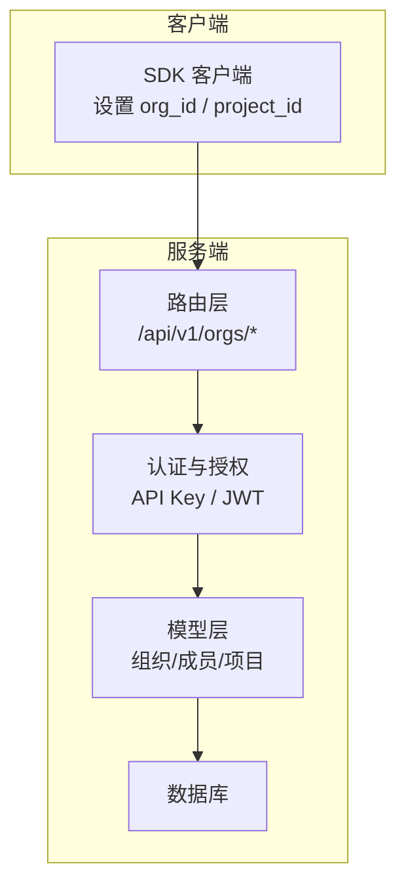
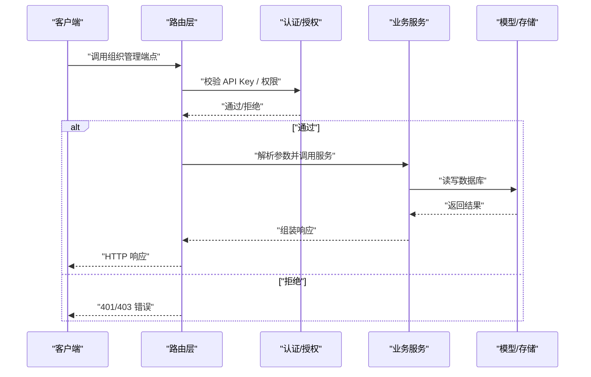
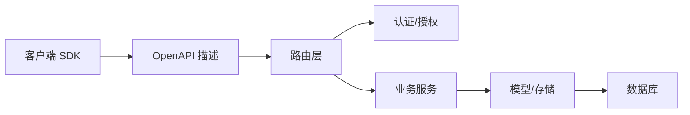

# 组织管理 API

<cite>
**本文引用的文件**
- [openapi.json](file://docs/openapi.json)
- [add-org-member.mdx](file://docs/api-reference/organization/add-org-member.mdx)
- [get-org-members.mdx](file://docs/api-reference/organization/get-org-members.mdx)
- [create-org.mdx](file://docs/api-reference/organization/create-org.mdx)
- [get-org.mdx](file://docs/api-reference/organization/get-org.mdx)
- [get-orgs.mdx](file://docs/api-reference/organization/get-orgs.mdx)
- [delete-org.mdx](file://docs/api-reference/organization/delete-org.mdx)
- [organizations-projects.mdx](file://docs/api-reference/organizations-projects.mdx)
- [main.py](file://mem0/client/main.py)
- [main.py](file://server/main.py)
- [models.py](file://server/models.py)
- [schemas.py](file://server/schemas.py)
- [auth.py](file://server/auth.py)
- [routers/api_keys.py](file://server/routers/api_keys.py)
- [routers/auth.py](file://server/routers/auth.py)
- [routers/entities.py](file://server/routers/entities.py)
- [routers/requests.py](file://server/routers/requests.py)
</cite>

## 目录
1. [简介](#简介)
2. [项目结构](#项目结构)
3. [核心组件](#核心组件)
4. [架构总览](#架构总览)
5. [详细组件分析](#详细组件分析)
6. [依赖关系分析](#依赖关系分析)
7. [性能考虑](#性能考虑)
8. [故障排除指南](#故障排除指南)
9. [结论](#结论)
10. [附录](#附录)

## 简介
本文件系统化梳理平台的组织管理 API，覆盖组织生命周期（创建、查询、删除）、组织成员管理（添加、查询）以及与项目层级的关系。文档同时解释组织与项目的多租户隔离机制、成员角色与权限模型，并给出调用流程图与数据流图，帮助开发者快速集成与排障。

## 项目结构
组织管理 API 的接口定义集中在 OpenAPI 文档中，配套的 API 参考文档提供了每个端点的用途、参数与响应示例。客户端 SDK 通过 org_id 与 project_id 实现对组织与项目资源的访问控制；服务端路由与模型层负责鉴权、校验与持久化。

图表来源
- [openapi.json](file://docs/openapi.json)
- [main.py](file://server/main.py)
- [models.py](file://server/models.py)
- [schemas.py](file://server/schemas.py)

章节来源
- [openapi.json](file://docs/openapi.json)
- [organizations-projects.mdx](file://docs/api-reference/organizations-projects.mdx)

## 核心组件
- 组织管理端点
  - 创建组织：POST /api/v1/orgs/organizations/
  - 获取单个组织：GET /api/v1/orgs/organizations/{org_id}
  - 获取组织列表：GET /api/v1/orgs/organizations/
  - 删除组织：DELETE /api/v1/orgs/organizations/{org_id}
- 成员管理端点
  - 添加组织成员：POST /api/v1/orgs/organizations/{org_id}/members/
  - 查询组织成员：GET /api/v1/orgs/organizations/{org_id}/members/

章节来源
- [create-org.mdx](file://docs/api-reference/organization/create-org.mdx)
- [get-org.mdx](file://docs/api-reference/organization/get-org.mdx)
- [get-orgs.mdx](file://docs/api-reference/organization/get-orgs.mdx)
- [delete-org.mdx](file://docs/api-reference/organization/delete-org.mdx)
- [add-org-member.mdx](file://docs/api-reference/organization/add-org-member.mdx)
- [get-org-members.mdx](file://docs/api-reference/organization/get-org-members.mdx)

## 架构总览
组织管理 API 基于统一的路由前缀 /api/v1/orgs/，采用基于 API Key 的认证与授权策略。客户端在 SDK 中设置 org_id 与 project_id，服务端在请求处理链路中进行身份验证、权限校验与业务逻辑执行。

图表来源
- [openapi.json](file://docs/openapi.json)
- [routers/api_keys.py](file://server/routers/api_keys.py)
- [routers/auth.py](file://server/routers/auth.py)
- [models.py](file://server/models.py)

## 详细组件分析

### 组织管理端点
- 创建组织
  - 方法与路径：POST /api/v1/orgs/organizations/
  - 功能：为当前用户或其可管理范围创建新组织
  - 关键参数：名称、描述等（以实际 OpenAPI 定义为准）
  - 响应：组织对象（含 org_id）
- 获取单个组织
  - 方法与路径：GET /api/v1/orgs/organizations/{org_id}
  - 功能：按 org_id 返回组织详情
  - 访问控制：需具备组织可见性
- 获取组织列表
  - 方法与路径：GET /api/v1/orgs/organizations/
  - 功能：列出当前主体可访问的组织集合
- 删除组织
  - 方法与路径：DELETE /api/v1/orgs/organizations/{org_id}
  - 功能：删除指定组织（通常需要 OWNER 权限）
  - 注意：删除可能涉及级联清理与审计日志

章节来源
- [create-org.mdx](file://docs/api-reference/organization/create-org.mdx)
- [get-org.mdx](file://docs/api-reference/organization/get-org.mdx)
- [get-orgs.mdx](file://docs/api-reference/organization/get-orgs.mdx)
- [delete-org.mdx](file://docs/api-reference/organization/delete-org.mdx)
- [openapi.json](file://docs/openapi.json)

### 成员管理端点
- 添加组织成员
  - 方法与路径：POST /api/v1/orgs/organizations/{org_id}/members/
  - 角色模型：
    - READER：仅允许查看组织资源
    - OWNER：拥有组织完全管理权限
  - 参数：目标用户标识、角色
  - 响应：成员关系对象
- 查询组织成员
  - 方法与路径：GET /api/v1/orgs/organizations/{org_id}/members/
  - 响应：成员列表（包含 user_id 与 role）

章节来源
- [add-org-member.mdx](file://docs/api-reference/organization/add-org-member.mdx)
- [get-org-members.mdx](file://docs/api-reference/organization/get-org-members.mdx)
- [openapi.json](file://docs/openapi.json)

### 多组织支持与隔离机制
- 多组织支持
  - 客户端通过 SDK 设置 org_id 与 project_id，确保后续请求限定在该组织/项目上下文中
  - 路由层在处理时读取 org_id 并进行访问控制校验
- 隔离机制
  - 数据隔离：组织与项目的数据在存储层面按 org_id 进行分组与限制
  - 权限隔离：不同组织的成员无法互相访问对方的资源，除非被显式授权
  - API 隔离：端点均要求携带 org_id，避免跨组织越权

章节来源
- [main.py](file://mem0/client/main.py)
- [openapi.json](file://docs/openapi.json)

### 组织与项目层级关系
- 组织是最高级实体，项目隶属于组织
- 项目成员管理端点位于组织路径下，体现“组织 -> 项目”的层级
- 客户端在 SDK 中维护 org_id 与 project_id，用于区分不同项目的资源边界

章节来源
- [organizations-projects.mdx](file://docs/api-reference/organizations-projects.mdx)
- [openapi.json](file://docs/openapi.json)

## 依赖关系分析
组织管理 API 的关键依赖链如下：
- 客户端 SDK 依赖 OpenAPI 描述与服务端路由
- 路由层依赖认证模块与业务服务
- 业务服务依赖模型层与数据库
- 模型层依赖数据库表结构与约束

图表来源
- [openapi.json](file://docs/openapi.json)
- [main.py](file://server/main.py)
- [models.py](file://server/models.py)
- [schemas.py](file://server/schemas.py)

章节来源
- [openapi.json](file://docs/openapi.json)
- [main.py](file://server/main.py)
- [models.py](file://server/models.py)
- [schemas.py](file://server/schemas.py)

## 性能考虑
- 批量查询优化：成员列表与组织列表建议分页与条件过滤，避免一次性拉取大量数据
- 缓存策略：对只读的组织信息与成员列表可引入短期缓存，降低数据库压力
- 并发控制：成员变更与组织删除等写操作建议加锁或幂等设计，防止竞态
- 日志与监控：对高频率端点增加指标埋点，便于定位性能瓶颈

## 故障排除指南
- 401 未授权
  - 检查 API Key 是否正确传递与有效
  - 确认账户是否已激活并具备组织访问权限
- 403 禁止访问
  - 核对当前用户在目标组织中的角色（需 OWNER 或相应权限）
- 404 组织不存在
  - 确认 org_id 是否正确，是否存在拼写错误
- 409 冲突
  - 成员重复添加或组织名称冲突时可能出现，需先检查现有状态再重试
- 5xx 服务器错误
  - 查看服务端日志与数据库连接状态，确认路由与模型层无异常

章节来源
- [openapi.json](file://docs/openapi.json)
- [routers/auth.py](file://server/routers/auth.py)
- [auth.py](file://server/auth.py)

## 结论
组织管理 API 提供了完整的组织生命周期与成员管理能力，并通过明确的角色模型与严格的多租户隔离机制保障安全与稳定。结合客户端 SDK 的 org_id 与 project_id 管理，开发者可以高效地在多组织场景下构建应用。

## 附录
- 快速参考
  - 创建组织：POST /api/v1/orgs/organizations/
  - 获取组织：GET /api/v1/orgs/organizations/{org_id}
  - 获取组织列表：GET /api/v1/orgs/organizations/
  - 删除组织：DELETE /api/v1/orgs/organizations/{org_id}
  - 添加成员：POST /api/v1/orgs/organizations/{org_id}/members/
  - 查询成员：GET /api/v1/orgs/organizations/{org_id}/members/
- 角色说明
  - READER：仅读取权限
  - OWNER：完全管理权限