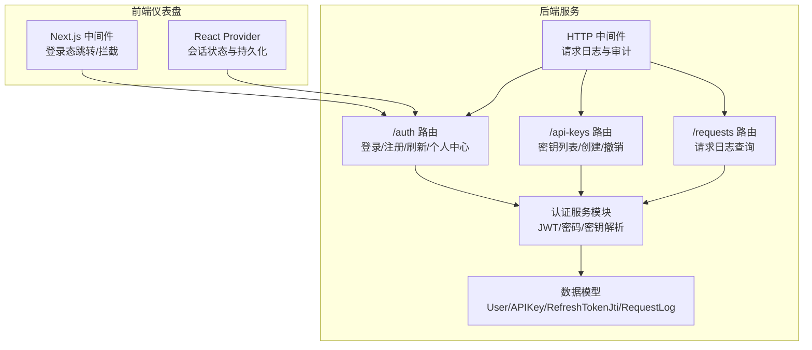
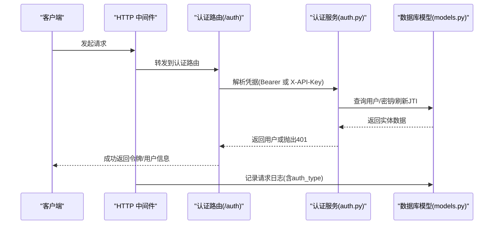
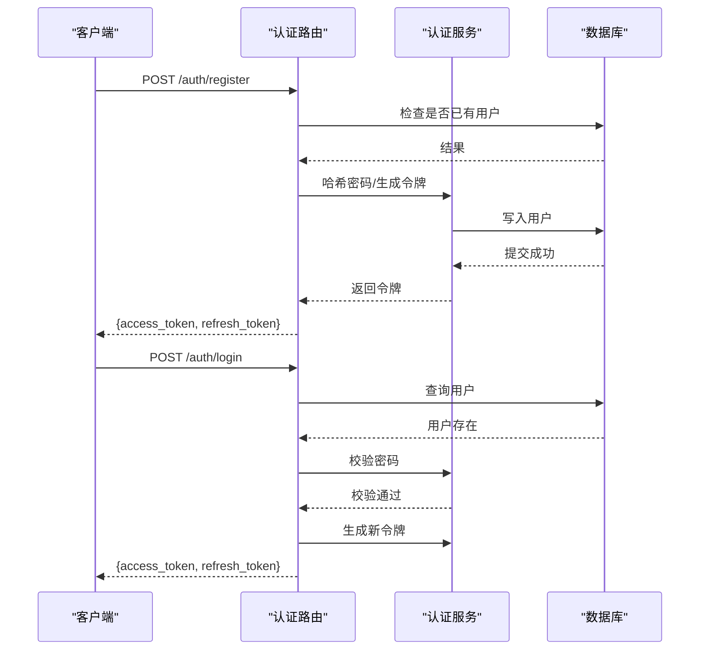
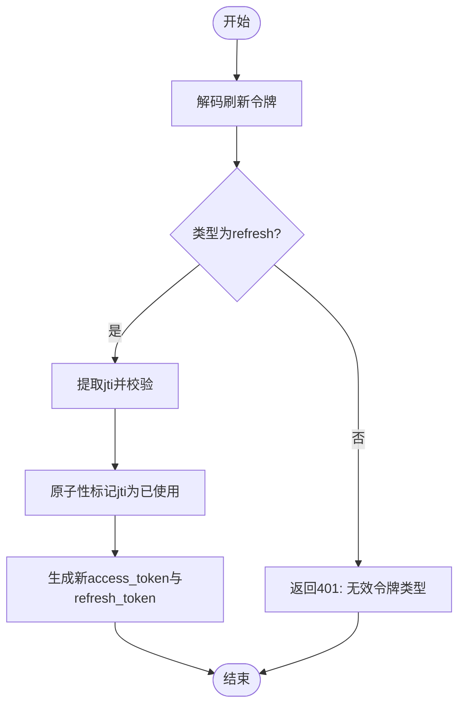
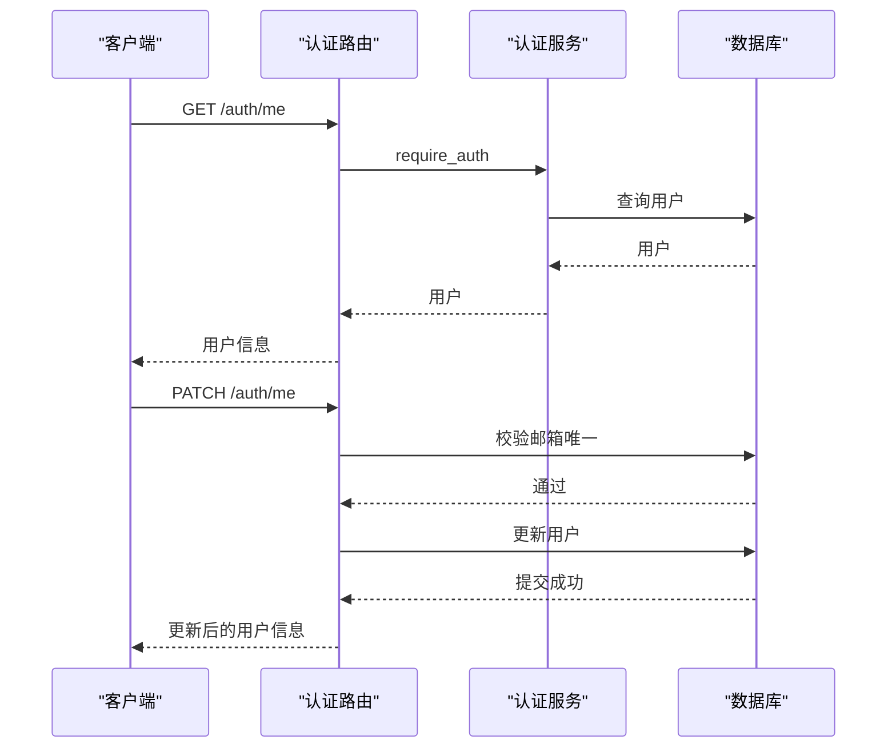
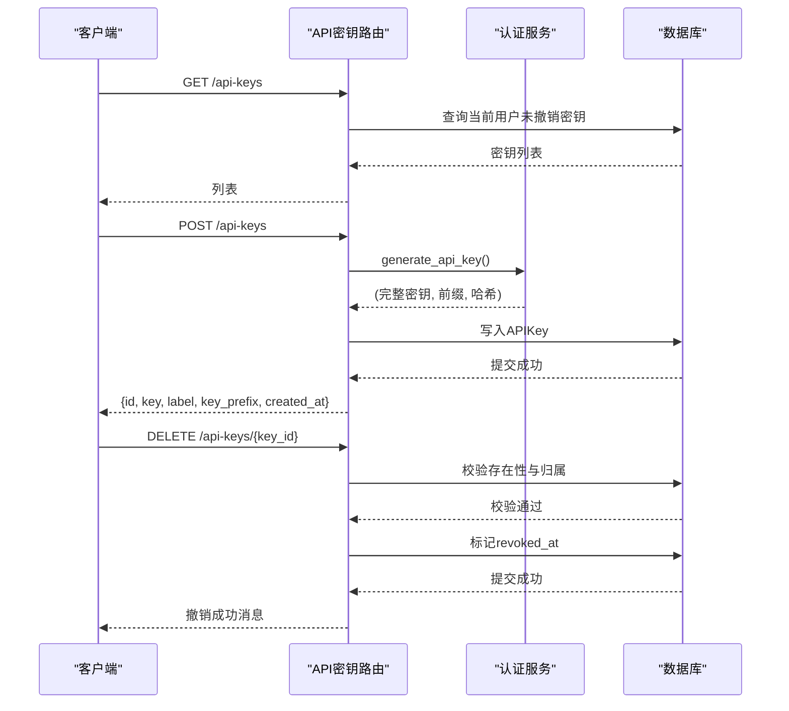
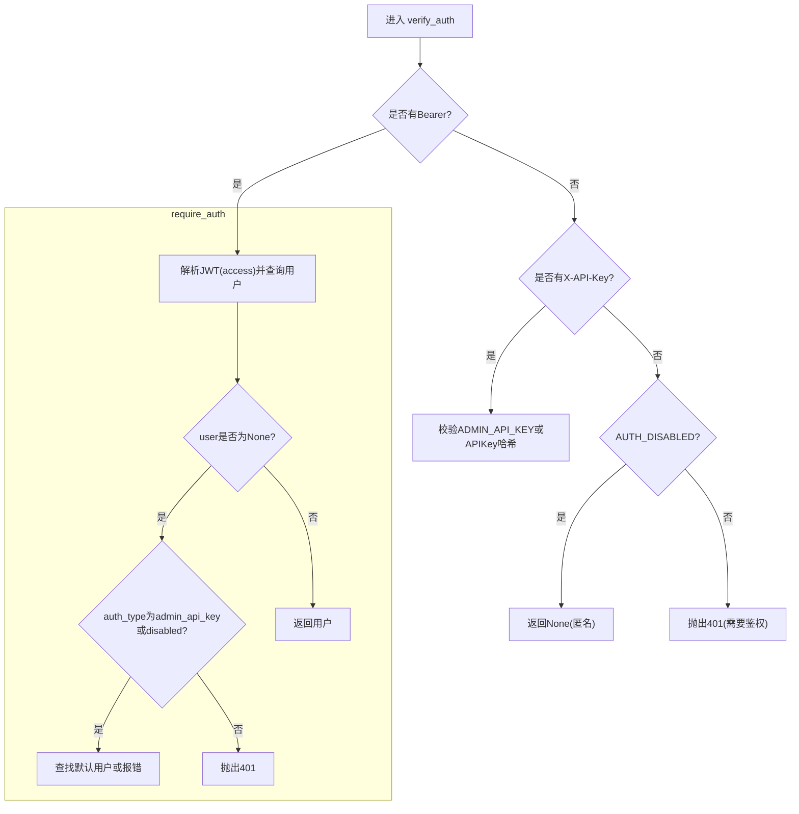
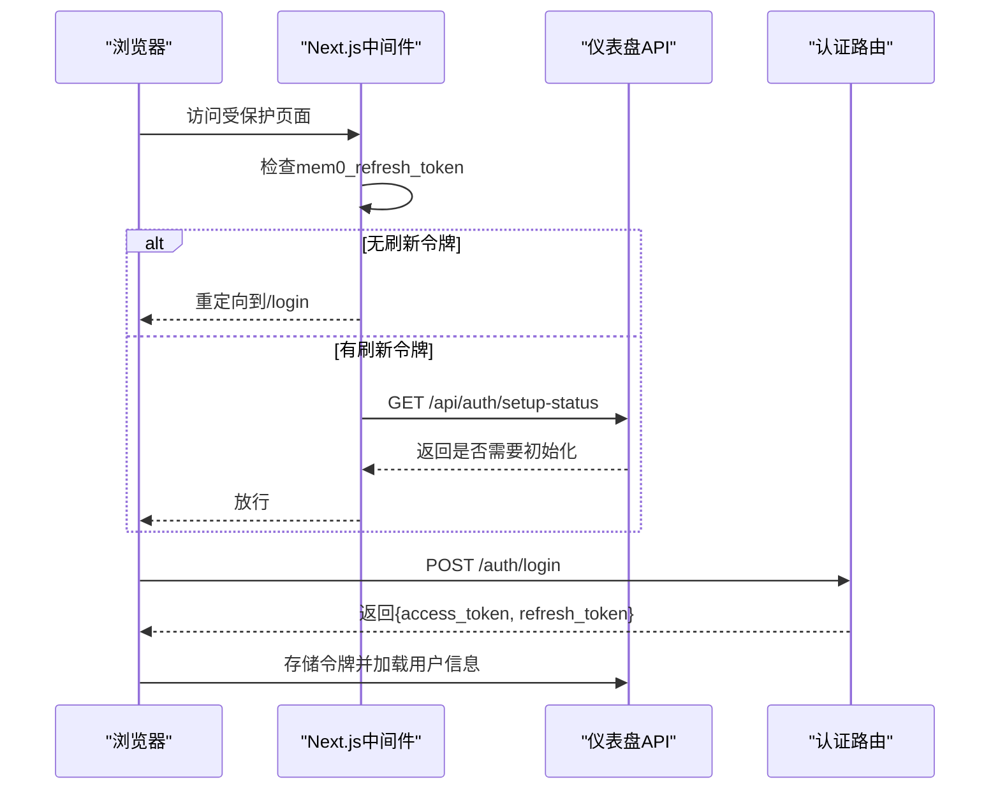
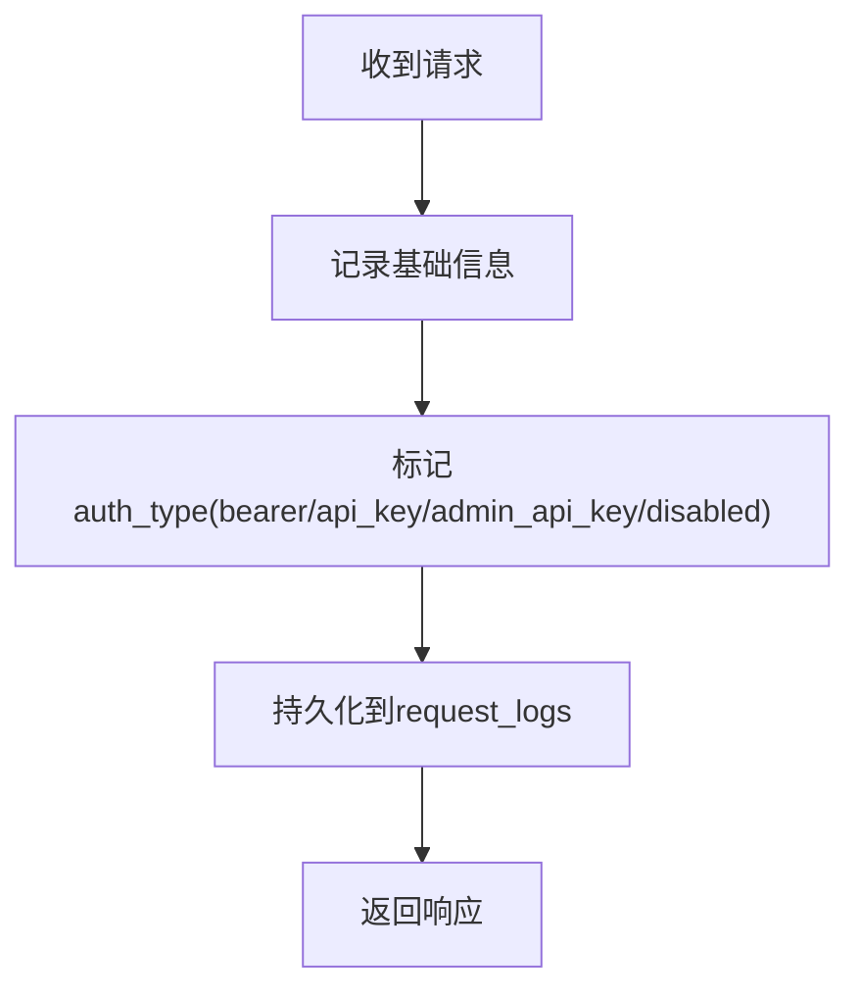
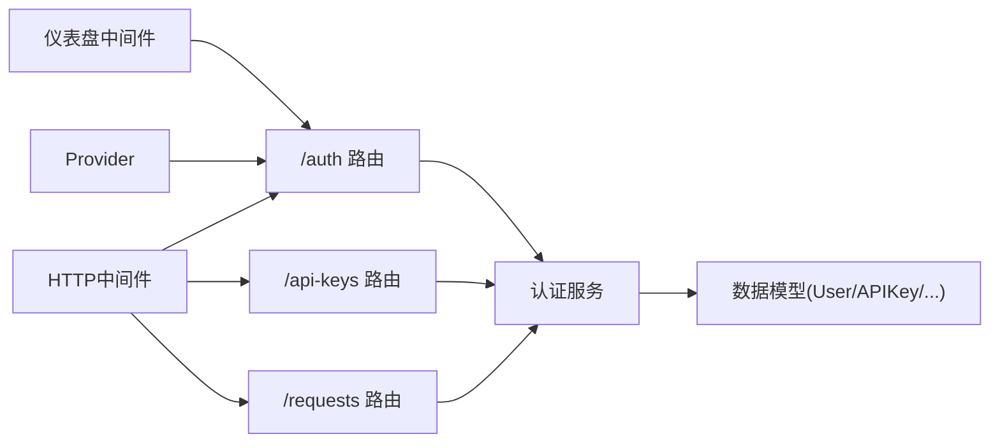

# 认证 API

<cite>
**本文引用的文件**
- [server/routers/auth.py](file://server/routers/auth.py)
- [server/auth.py](file://server/auth.py)
- [server/routers/api_keys.py](file://server/routers/api_keys.py)
- [server/models.py](file://server/models.py)
- [server/routers/requests.py](file://server/routers/requests.py)
- [server/main.py](file://server/main.py)
- [server/dashboard/src/middleware.ts](file://server/dashboard/src/middleware.ts)
- [server/dashboard/src/lib/auth.tsx](file://server/dashboard/src/lib/auth.tsx)
- [mem0/utils/gcp_auth.py](file://mem0/utils/gcp_auth.py)
</cite>

## 目录
1. [简介](#简介)
2. [项目结构](#项目结构)
3. [核心组件](#核心组件)
4. [架构总览](#架构总览)
5. [详细组件分析](#详细组件分析)
6. [依赖关系分析](#依赖关系分析)
7. [性能考量](#性能考量)
8. [故障排查指南](#故障排查指南)
9. [结论](#结论)
10. [附录](#附录)

## 简介
本文件为平台认证 API 的权威技术文档，覆盖登录、注册、刷新令牌、用户资料管理、API 密钥生成与撤销等全部认证相关端点；深入解析 JWT 令牌机制与会话管理策略；提供 API 密钥全生命周期管理流程；说明认证中间件、权限校验与访问控制实现；并补充 OAuth/第三方集成思路与安全最佳实践。

## 项目结构
认证能力由后端 FastAPI 路由、认证服务模块、数据库模型与前端仪表盘中间件共同组成，形成“请求进入—认证解析—权限校验—业务处理”的闭环。

图表来源
- [server/routers/auth.py:1-213](file://server/routers/auth.py#L1-L213)
- [server/routers/api_keys.py:1-89](file://server/routers/api_keys.py#L1-L89)
- [server/routers/requests.py:1-46](file://server/routers/requests.py#L1-L46)
- [server/auth.py:1-216](file://server/auth.py#L1-L216)
- [server/models.py:1-75](file://server/models.py#L1-L75)
- [server/main.py:249-285](file://server/main.py#L249-L285)
- [server/dashboard/src/middleware.ts:1-67](file://server/dashboard/src/middleware.ts#L1-L67)
- [server/dashboard/src/lib/auth.tsx:64-112](file://server/dashboard/src/lib/auth.tsx#L64-L112)

章节来源
- [server/routers/auth.py:1-213](file://server/routers/auth.py#L1-L213)
- [server/routers/api_keys.py:1-89](file://server/routers/api_keys.py#L1-L89)
- [server/routers/requests.py:1-46](file://server/routers/requests.py#L1-L46)
- [server/auth.py:1-216](file://server/auth.py#L1-L216)
- [server/models.py:1-75](file://server/models.py#L1-L75)
- [server/main.py:249-285](file://server/main.py#L249-L285)
- [server/dashboard/src/middleware.ts:1-67](file://server/dashboard/src/middleware.ts#L1-L67)
- [server/dashboard/src/lib/auth.tsx:64-112](file://server/dashboard/src/lib/auth.tsx#L64-L112)

## 核心组件
- 认证路由层：提供登录、注册、刷新、当前用户信息、修改密码、更新资料、引导完成等端点。
- 认证服务层：封装 JWT 编解码、密码哈希与校验、API 密钥生成与校验、刷新令牌 JTI 消费、认证/授权中间件。
- 数据模型层：用户、API 密钥、刷新令牌 JTI、请求日志等。
- 前端中间件与会话：仪表盘侧登录态判断、自动刷新与持久化。
- 请求审计：统一 HTTP 中间件记录请求日志与鉴权类型。

章节来源
- [server/routers/auth.py:1-213](file://server/routers/auth.py#L1-L213)
- [server/auth.py:1-216](file://server/auth.py#L1-L216)
- [server/models.py:1-75](file://server/models.py#L1-L75)
- [server/dashboard/src/middleware.ts:1-67](file://server/dashboard/src/middleware.ts#L1-L67)
- [server/dashboard/src/lib/auth.tsx:64-112](file://server/dashboard/src/lib/auth.tsx#L64-L112)
- [server/main.py:249-285](file://server/main.py#L249-L285)

## 架构总览
认证体系采用“双令牌 + 多入口”的设计：短期访问令牌用于常规 API 调用，长期刷新令牌用于安全续期；支持 Bearer JWT、X-API-Key 两种鉴权方式，并兼容管理员专用的 ADMIN_API_KEY 与可禁用认证模式。

图表来源
- [server/routers/auth.py:125-141](file://server/routers/auth.py#L125-L141)
- [server/auth.py:144-170](file://server/auth.py#L144-L170)
- [server/models.py:18-62](file://server/models.py#L18-L62)
- [server/main.py:249-285](file://server/main.py#L249-L285)

## 详细组件分析

### 登录与注册流程
- 注册：仅在无用户时开放，创建首个管理员账户，返回短期访问令牌与长期刷新令牌。
- 登录：验证邮箱与密码，成功后返回短期访问令牌与长期刷新令牌，并更新最近登录时间。

图表来源
- [server/routers/auth.py:94-141](file://server/routers/auth.py#L94-L141)
- [server/auth.py:25-36](file://server/auth.py#L25-L36)
- [server/auth.py:57-69](file://server/auth.py#L57-L69)

章节来源
- [server/routers/auth.py:94-141](file://server/routers/auth.py#L94-L141)
- [server/auth.py:25-36](file://server/auth.py#L25-L36)
- [server/auth.py:57-69](file://server/auth.py#L57-L69)

### 刷新令牌流程
- 使用刷新令牌换取新的访问令牌；服务端对刷新令牌的 JTI 进行原子性标记，防止重放攻击。
- 若刷新令牌类型不正确或已过期/被使用，则拒绝续期。

图表来源
- [server/routers/auth.py:144-164](file://server/routers/auth.py#L144-L164)
- [server/auth.py:72-94](file://server/auth.py#L72-L94)
- [server/auth.py:63-69](file://server/auth.py#L63-L69)

章节来源
- [server/routers/auth.py:144-164](file://server/routers/auth.py#L144-L164)
- [server/auth.py:72-94](file://server/auth.py#L72-L94)
- [server/auth.py:63-69](file://server/auth.py#L63-L69)

### 当前用户与资料管理
- 获取当前用户：需要有效认证。
- 更新资料：支持修改姓名与邮箱（邮箱唯一性约束）。
- 修改密码：校验当前密码，设置新密码并持久化。

图表来源
- [server/routers/auth.py:167-189](file://server/routers/auth.py#L167-L189)
- [server/auth.py:173-185](file://server/auth.py#L173-L185)
- [server/models.py:18-28](file://server/models.py#L18-L28)

章节来源
- [server/routers/auth.py:167-189](file://server/routers/auth.py#L167-L189)
- [server/auth.py:173-185](file://server/auth.py#L173-L185)
- [server/models.py:18-28](file://server/models.py#L18-L28)

### API 密钥管理
- 列表：按创建者过滤未撤销的密钥，返回标签、前缀、创建时间与最后使用时间。
- 创建：生成完整密钥、前缀与哈希，写入数据库并返回完整密钥（仅首次可见）。
- 撤销：按密钥 ID 与创建者进行校验，确保幂等撤销。

图表来源
- [server/routers/api_keys.py:38-88](file://server/routers/api_keys.py#L38-L88)
- [server/auth.py:38-48](file://server/auth.py#L38-L48)
- [server/models.py:30-41](file://server/models.py#L30-L41)

章节来源
- [server/routers/api_keys.py:38-88](file://server/routers/api_keys.py#L38-L88)
- [server/auth.py:38-48](file://server/auth.py#L38-L48)
- [server/models.py:30-41](file://server/models.py#L30-L41)

### 认证中间件与权限控制
- verify_auth：优先解析 Bearer JWT；否则解析 X-API-Key；若配置了 ADMIN_API_KEY 或 AUTH_DISABLED 可直接放行。
- require_auth：强制非空用户；当 ADMIN_API_KEY 或 AUTH_DISABLED 且用户表为空时，回退到默认管理员。
- require_admin：在 require_auth 基础上进一步校验管理员角色。

图表来源
- [server/auth.py:144-185](file://server/auth.py#L144-L185)
- [server/auth.py:193-215](file://server/auth.py#L193-L215)

章节来源
- [server/auth.py:144-185](file://server/auth.py#L144-L185)
- [server/auth.py:193-215](file://server/auth.py#L193-L215)

### 会话管理与前端交互
- 仪表盘中间件：对受保护路径进行登录态检查，无刷新令牌则重定向至登录页。
- React Provider：登录/注册后存储访问令牌与刷新令牌，自动调用刷新接口维持会话。

图表来源
- [server/dashboard/src/middleware.ts:1-67](file://server/dashboard/src/middleware.ts#L1-L67)
- [server/dashboard/src/lib/auth.tsx:64-112](file://server/dashboard/src/lib/auth.tsx#L64-L112)
- [server/routers/auth.py:125-141](file://server/routers/auth.py#L125-L141)

章节来源
- [server/dashboard/src/middleware.ts:1-67](file://server/dashboard/src/middleware.ts#L1-L67)
- [server/dashboard/src/lib/auth.tsx:64-112](file://server/dashboard/src/lib/auth.tsx#L64-L112)
- [server/routers/auth.py:125-141](file://server/routers/auth.py#L125-L141)

### 请求审计与日志
- HTTP 中间件统一记录请求方法、路径、状态码、耗时与鉴权类型，便于追踪 API 密钥与管理员行为。
- 请求日志路由仅管理员可查看，且默认筛选 API 密钥类鉴权类型。

图表来源
- [server/main.py:249-285](file://server/main.py#L249-L285)
- [server/routers/requests.py:30-46](file://server/routers/requests.py#L30-L46)
- [server/models.py:43-52](file://server/models.py#L43-L52)

章节来源
- [server/main.py:249-285](file://server/main.py#L249-L285)
- [server/routers/requests.py:30-46](file://server/routers/requests.py#L30-L46)
- [server/models.py:43-52](file://server/models.py#L43-L52)

## 依赖关系分析
- 路由依赖认证服务：登录/注册/刷新/当前用户均依赖认证服务提供的令牌生成与解析。
- 认证服务依赖数据库模型：用户、API 密钥、刷新令牌 JTI、请求日志。
- 前端中间件依赖后端认证路由与会话存储：登录态判断与自动刷新。
- 请求审计中间件独立于业务路由，但与认证类型强关联。

图表来源
- [server/routers/auth.py:1-213](file://server/routers/auth.py#L1-L213)
- [server/routers/api_keys.py:1-89](file://server/routers/api_keys.py#L1-L89)
- [server/routers/requests.py:1-46](file://server/routers/requests.py#L1-L46)
- [server/auth.py:1-216](file://server/auth.py#L1-L216)
- [server/models.py:1-75](file://server/models.py#L1-L75)
- [server/main.py:249-285](file://server/main.py#L249-L285)
- [server/dashboard/src/middleware.ts:1-67](file://server/dashboard/src/middleware.ts#L1-L67)
- [server/dashboard/src/lib/auth.tsx:64-112](file://server/dashboard/src/lib/auth.tsx#L64-L112)

章节来源
- [server/routers/auth.py:1-213](file://server/routers/auth.py#L1-L213)
- [server/routers/api_keys.py:1-89](file://server/routers/api_keys.py#L1-L89)
- [server/routers/requests.py:1-46](file://server/routers/requests.py#L1-L46)
- [server/auth.py:1-216](file://server/auth.py#L1-L216)
- [server/models.py:1-75](file://server/models.py#L1-L75)
- [server/main.py:249-285](file://server/main.py#L249-L285)
- [server/dashboard/src/middleware.ts:1-67](file://server/dashboard/src/middleware.ts#L1-L67)
- [server/dashboard/src/lib/auth.tsx:64-112](file://server/dashboard/src/lib/auth.tsx#L64-L112)

## 性能考量
- 速率限制：登录、注册、刷新端点均配置限流，避免暴力破解与滥用。
- 密钥前缀索引：API 密钥查询基于前缀快速定位候选集，再进行哈希比对。
- 刷新令牌 JTI 原子性：单行条件更新避免并发重放竞争。
- 审计日志异步化：建议将日志持久化放入后台任务队列以降低主链路延迟。

章节来源
- [server/routers/auth.py:95-96](file://server/routers/auth.py#L95-L96)
- [server/routers/auth.py:126-127](file://server/routers/auth.py#L126-L127)
- [server/routers/auth.py:145-146](file://server/routers/auth.py#L145-L146)
- [server/auth.py:127-141](file://server/auth.py#L127-L141)
- [server/auth.py:72-94](file://server/auth.py#L72-L94)
- [server/main.py:258-276](file://server/main.py#L258-L276)

## 故障排查指南
- 401 未认证/令牌无效
  - 检查请求头是否包含有效的 Bearer 令牌或 X-API-Key。
  - 确认 JWT_SECRET 已正确配置。
  - 对于刷新令牌，确认 jti 未被使用且未过期。
- 403 权限不足
  - 管理员专用端点需管理员角色；ADMIN_API_KEY 或 AUTH_DISABLED 场景下需满足默认管理员回退条件。
- 404 密钥不存在
  - 撤销密钥时需确保归属一致且尚未撤销。
- 速率限制触发
  - 登录/注册/刷新过于频繁，建议降低调用频率或增加等待时间。
- 审计日志缺失
  - 确认中间件未跳过该路径；检查数据库连接与异常捕获逻辑。

章节来源
- [server/auth.py:51-54](file://server/auth.py#L51-L54)
- [server/auth.py:166-170](file://server/auth.py#L166-L170)
- [server/auth.py:193-215](file://server/auth.py#L193-L215)
- [server/routers/api_keys.py:78-88](file://server/routers/api_keys.py#L78-L88)
- [server/routers/auth.py:95-96](file://server/routers/auth.py#L95-L96)
- [server/routers/auth.py:126-127](file://server/routers/auth.py#L126-L127)
- [server/routers/auth.py:145-146](file://server/routers/auth.py#L145-L146)
- [server/main.py:249-285](file://server/main.py#L249-L285)

## 结论
本认证体系以 JWT 为核心，结合刷新令牌与 API 密钥，实现了“短期易用、长期安全”的平衡；通过严格的速率限制、原子性刷新与审计日志，保障了系统的安全性与可观测性。前端中间件与 Provider 协同，提供了良好的用户体验。对于 OAuth/第三方集成，可在现有认证服务基础上扩展外部提供商回调与用户映射逻辑。

## 附录

### OAuth 与第三方集成建议
- 在认证服务中新增外部提供商回调端点，接收授权码并交换访问令牌。
- 将第三方用户标识映射到内部用户模型，保持统一的用户上下文。
- 对第三方登录场景复用现有 require_auth/require_admin 中间件，确保权限一致。

[本节为概念性指导，不直接分析具体文件]

### 安全最佳实践
- 强制 HTTPS 传输，严格管理 JWT_SECRET 与 ADMIN_API_KEY。
- 定期轮换密钥，启用密钥撤销与失效时间控制。
- 启用速率限制与 IP 白名单策略，监控异常登录尝试。
- 审计日志保留与告警联动，及时发现可疑行为。

[本节为通用指导，不直接分析具体文件]