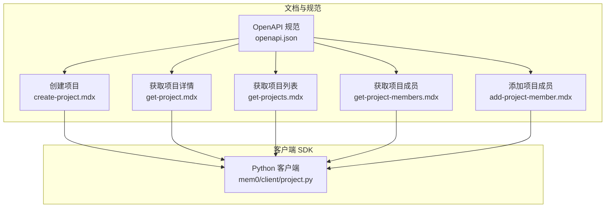
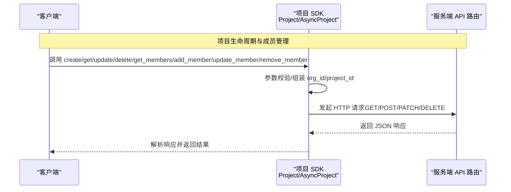
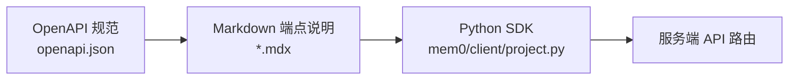

# 项目管理 API

<cite>
**本文引用的文件**
- [mem0/client/project.py](file://mem0/client/project.py)
- [docs/api-reference/project/create-project.mdx](file://docs/api-reference/project/create-project.mdx)
- [docs/api-reference/project/get-project.mdx](file://docs/api-reference/project/get-project.mdx)
- [docs/api-reference/project/get-projects.mdx](file://docs/api-reference/project/get-projects.mdx)
- [docs/api-reference/project/get-project-members.mdx](file://docs/api-reference/project/get-project-members.mdx)
- [docs/api-reference/project/add-project-member.mdx](file://docs/api-reference/project/add-project-member.mdx)
- [docs/api-reference/organizations-projects.mdx](file://docs/api-reference/organizations-projects.mdx)
- [docs/changelog/highlights.mdx](file://docs/changelog/highlights.mdx)
- [docs/changelog/platform.mdx](file://docs/changelog/platform.mdx)
- [docs/platform/features/memory-decay.mdx](file://docs/platform/features/memory-decay.mdx)
- [docs/openapi.json](file://docs/openapi.json)
</cite>

## 目录
1. [简介](#简介)
2. [项目结构](#项目结构)
3. [核心组件](#核心组件)
4. [架构总览](#架构总览)
5. [详细组件分析](#详细组件分析)
6. [依赖关系分析](#依赖关系分析)
7. [性能考虑](#性能考虑)
8. [故障排查指南](#故障排查指南)
9. [结论](#结论)
10. [附录](#附录)

## 简介
本文件系统性梳理平台的“项目管理 API”，覆盖以下能力：
- 项目生命周期：创建、查询单个与列表、更新、删除
- 成员管理：查询成员、新增成员（含角色）、更新成员角色、移除成员
- 项目配置与功能开关：自定义指令、自定义分类、检索条件、多语言模式、记忆衰减（Memory Decay）
- 访问控制与权限模型：基于项目内角色（只读/拥有者）的授权
- 组织隔离与资源边界：通过组织 ID 与项目 ID 实现资源隔离
- 团队协作与工作流：围绕项目维度的团队协作与权限治理

## 项目结构
项目管理 API 的接口由服务端路由与客户端 SDK 共同实现，文档侧以 OpenAPI 描述各端点；SDK 侧提供同步与异步两类调用封装。

图示来源
- [docs/openapi.json](file://docs/openapi.json)
- [mem0/client/project.py](file://mem0/client/project.py)
- [docs/api-reference/project/create-project.mdx](file://docs/api-reference/project/create-project.mdx)
- [docs/api-reference/project/get-project.mdx](file://docs/api-reference/project/get-project.mdx)
- [docs/api-reference/project/get-projects.mdx](file://docs/api-reference/project/get-projects.mdx)
- [docs/api-reference/project/get-project-members.mdx](file://docs/api-reference/project/get-project-members.mdx)
- [docs/api-reference/project/add-project-member.mdx](file://docs/api-reference/project/add-project-member.mdx)

章节来源
- [docs/api-reference/project/create-project.mdx:1-5](file://docs/api-reference/project/create-project.mdx#L1-L5)
- [docs/api-reference/project/get-project.mdx:1-5](file://docs/api-reference/project/get-project.mdx#L1-L5)
- [docs/api-reference/project/get-projects.mdx:1-5](file://docs/api-reference/project/get-projects.mdx#L1-L5)
- [docs/api-reference/project/get-project-members.mdx:1-5](file://docs/api-reference/project/get-project-members.mdx#L1-L5)
- [docs/api-reference/project/add-project-member.mdx:1-11](file://docs/api-reference/project/add-project-member.mdx#L1-L11)
- [docs/openapi.json:4056-4103](file://docs/openapi.json#L4056-L4103)

## 核心组件
- 项目配置对象：用于在 SDK 中统一注入组织 ID、项目 ID、用户邮箱等上下文参数，便于后续请求自动携带。
- 抽象基类：定义项目管理的统一接口契约，包括获取、创建、更新、删除、成员查询、新增成员、更新成员、移除成员。
- 同步实现：基于同步 HTTP 客户端发起请求，封装路径拼接、参数准备、错误处理与遥测上报。
- 异步实现：基于异步 HTTP 客户端发起请求，行为与同步版本一致，适用于高并发场景。

章节来源
- [mem0/client/project.py:16-29](file://mem0/client/project.py#L16-L29)
- [mem0/client/project.py:28-297](file://mem0/client/project.py#L28-L297)
- [mem0/client/project.py:299-621](file://mem0/client/project.py#L299-L621)
- [mem0/client/project.py:623-945](file://mem0/client/project.py#L623-L945)

## 架构总览
下图展示从客户端到服务端的关键交互流程，涵盖项目 CRUD 与成员管理。

图示来源
- [mem0/client/project.py:325-620](file://mem0/client/project.py#L325-L620)
- [mem0/client/project.py:649-945](file://mem0/client/project.py#L649-L945)

## 详细组件分析

### 项目生命周期 API
- 创建项目
  - 方法与路径：POST /api/v1/orgs/organizations/{org_id}/projects/
  - 请求体字段：name（必填），description（可选）
  - 响应：创建后的项目对象（包含标识、名称、描述、时间戳等）
- 获取单个项目
  - 方法与路径：GET /api/v1/orgs/organizations/{org_id}/projects/{project_id}/
  - 查询参数：fields（可选，指定返回字段集合）
  - 响应：项目详情对象
- 获取项目列表
  - 方法与路径：GET /api/v1/orgs/organizations/{org_id}/projects/
  - 响应：项目数组（每项包含标识、名称、描述、时间戳与成员列表）
- 更新项目
  - 方法与路径：PATCH /api/v1/orgs/organizations/{org_id}/projects/{project_id}/
  - 请求体字段：custom_instructions（可选）、custom_categories（可选）、retrieval_criteria（可选）、multilingual（可选）、decay（可选）
  - 响应：更新后的项目对象
- 删除项目
  - 方法与路径：DELETE /api/v1/orgs/organizations/{org_id}/projects/{project_id}/
  - 响应：删除确认对象

章节来源
- [docs/api-reference/project/create-project.mdx:1-5](file://docs/api-reference/project/create-project.mdx#L1-L5)
- [docs/api-reference/project/get-project.mdx:1-5](file://docs/api-reference/project/get-project.mdx#L1-L5)
- [docs/api-reference/project/get-projects.mdx:1-5](file://docs/api-reference/project/get-projects.mdx#L1-L5)
- [docs/openapi.json:4056-4103](file://docs/openapi.json#L4056-L4103)
- [mem0/client/project.py:356-464](file://mem0/client/project.py#L356-L464)
- [mem0/client/project.py:681-788](file://mem0/client/project.py#L681-L788)

### 成员管理 API
- 获取项目成员
  - 方法与路径：GET /api/v1/orgs/organizations/{org_id}/projects/{project_id}/members/
  - 响应：成员数组（每项包含用户名、角色）
- 新增成员
  - 方法与路径：POST /api/v1/orgs/organizations/{org_id}/projects/{project_id}/members/
  - 请求体字段：email（必填）、role（必填，仅支持 READ 与 OWNER）
  - 响应：新增成员确认对象
- 更新成员角色
  - 方法与路径：PUT /api/v1/orgs/organizations/{org_id}/projects/{project_id}/members/
  - 请求体字段：email（必填）、role（必填，仅支持 READ 与 OWNER）
  - 响应：更新后成员信息
- 移除成员
  - 方法与路径：DELETE /api/v1/orgs/organizations/{org_id}/projects/{project_id}/members/?email={email}
  - 查询参数：email（必填）
  - 响应：移除确认对象

章节来源
- [docs/api-reference/project/get-project-members.mdx:1-5](file://docs/api-reference/project/get-project-members.mdx#L1-L5)
- [docs/api-reference/project/add-project-member.mdx:1-11](file://docs/api-reference/project/add-project-member.mdx#L1-L11)
- [mem0/client/project.py:492-620](file://mem0/client/project.py#L492-L620)
- [mem0/client/project.py:649-945](file://mem0/client/project.py#L649-L945)

### 项目配置与功能开关
- 自定义指令（custom_instructions）：为项目设定定制化提示词或约束
- 自定义分类（custom_categories）：为项目建立专属的记忆分类体系
- 检索条件（retrieval_criteria）：定义检索时的过滤与排序策略
- 多语言模式（multilingual）：启用输入语言感知的记忆存储与检索
- 记忆衰减（decay）：开启搜索时对近期访问记忆的加权偏置，缓解“陈旧”记忆主导检索结果

章节来源
- [docs/api-reference/organizations-projects.mdx:113](file://docs/api-reference/organizations-projects.mdx#L113)
- [docs/api-reference/organizations-projects.mdx:204](file://docs/api-reference/organizations-projects.mdx#L204)
- [docs/changelog/highlights.mdx:25](file://docs/changelog/highlights.mdx#L25)
- [docs/changelog/platform.mdx:20](file://docs/changelog/platform.mdx#L20)
- [docs/platform/features/memory-decay.mdx:58](file://docs/platform/features/memory-decay.mdx#L58)
- [mem0/client/project.py:394-464](file://mem0/client/project.py#L394-L464)
- [mem0/client/project.py:718-788](file://mem0/client/project.py#L718-L788)

### 权限与访问控制
- 角色模型
  - READ：只读访问，允许查看项目资源
  - OWNER：完全管理权限，可管理项目与资源
- 授权边界
  - 所有项目相关操作均需提供 org_id 与 project_id，确保组织与项目维度的访问隔离
- 参数校验
  - SDK 在发起请求前会校验 org_id 与 project_id 是否齐全，并对成员角色进行枚举校验

章节来源
- [docs/api-reference/project/add-project-member.mdx:7-11](file://docs/api-reference/project/add-project-member.mdx#L7-L11)
- [mem0/client/project.py:75-108](file://mem0/client/project.py#L75-L108)
- [mem0/client/project.py:537-538](file://mem0/client/project.py#L537-L538)
- [mem0/client/project.py:573-574](file://mem0/client/project.py#L573-L574)

### 组织隔离与资源边界
- 组织级路径前缀：/api/v1/orgs/organizations/{org_id}/...，确保跨组织资源隔离
- 项目级路径前缀：/api/v1/orgs/organizations/{org_id}/projects/{project_id}/...，确保跨项目资源隔离
- SDK 统一参数准备：在内部自动拼装 org_id 与 project_id，避免误传导致越权

章节来源
- [mem0/client/project.py:85-132](file://mem0/client/project.py#L85-L132)
- [mem0/client/project.py:344](file://mem0/client/project.py#L344)
- [mem0/client/project.py:507](file://mem0/client/project.py#L507)

### 团队协作与工作流
- 成员角色变更：通过更新成员角色实现权限动态调整
- 成员批量管理：结合成员查询与新增/移除接口，构建团队成员全生命周期管理
- 配置联动：通过更新项目配置（如自定义分类、检索条件、多语言与记忆衰减）提升团队协作效率与检索质量

章节来源
- [mem0/client/project.py:554-620](file://mem0/client/project.py#L554-L620)
- [mem0/client/project.py:718-788](file://mem0/client/project.py#L718-L788)

## 依赖关系分析
- 文档层（OpenAPI）定义端点、参数与响应结构
- 客户端 SDK 封装 HTTP 请求、参数校验与错误处理
- 服务端路由根据路径与方法解析 org_id 与 project_id，执行业务逻辑并返回结果

图示来源
- [docs/openapi.json](file://docs/openapi.json)
- [mem0/client/project.py](file://mem0/client/project.py)
- [docs/api-reference/project/*.mdx](file://docs/api-reference/project/*.mdx)

章节来源
- [docs/openapi.json:4056-4103](file://docs/openapi.json#L4056-L4103)
- [mem0/client/project.py:325-620](file://mem0/client/project.py#L325-L620)

## 性能考虑
- 异步 SDK：在高并发场景建议使用异步实现，降低等待开销
- 字段选择：获取详情时可通过 fields 参数缩小响应体大小，减少网络与序列化成本
- 批量操作：成员管理建议合并多次调用为一次批量导入/导出流程（若服务端支持）

## 故障排查指南
- 参数缺失
  - 现象：抛出参数校验错误
  - 处理：确保同时提供 org_id 与 project_id；成员角色必须为 READ 或 OWNER
- 权限不足
  - 现象：HTTP 403/401
  - 处理：确认当前账户在目标项目中的角色是否满足操作要求
- 资源不存在
  - 现象：HTTP 404
  - 处理：检查 org_id 与 project_id 是否正确；确认项目存在且未被删除
- 速率限制
  - 现象：HTTP 429
  - 处理：降低请求频率或增加重试退避策略
- 网络异常
  - 现象：连接超时或中断
  - 处理：检查网络连通性与代理设置，必要时启用重试与熔断

章节来源
- [mem0/client/project.py:75-108](file://mem0/client/project.py#L75-L108)
- [mem0/client/project.py:537-538](file://mem0/client/project.py#L537-L538)
- [mem0/client/project.py:573-574](file://mem0/client/project.py#L573-L574)

## 结论
项目管理 API 提供了完整的项目生命周期与成员管理能力，并通过组织与项目两级 ID 实现强隔离。配合自定义指令、分类、检索条件、多语言与记忆衰减等功能开关，能够满足多样化的团队协作与知识管理需求。建议在生产环境中优先采用异步 SDK、合理裁剪响应字段，并严格遵循角色权限模型进行成员管理。

## 附录

### 端点一览与关键参数
- 创建项目
  - 方法：POST
  - 路径：/api/v1/orgs/organizations/{org_id}/projects/
  - 请求体：name（必填），description（可选）
- 获取项目详情
  - 方法：GET
  - 路径：/api/v1/orgs/organizations/{org_id}/projects/{project_id}/
  - 查询：fields（可选）
- 获取项目列表
  - 方法：GET
  - 路径：/api/v1/orgs/organizations/{org_id}/projects/
- 更新项目
  - 方法：PATCH
  - 路径：/api/v1/orgs/organizations/{org_id}/projects/{project_id}/
  - 请求体：custom_instructions（可选）、custom_categories（可选）、retrieval_criteria（可选）、multilingual（可选）、decay（可选）
- 删除项目
  - 方法：DELETE
  - 路径：/api/v1/orgs/organizations/{org_id}/projects/{project_id}/
- 获取项目成员
  - 方法：GET
  - 路径：/api/v1/orgs/organizations/{org_id}/projects/{project_id}/members/
- 新增成员
  - 方法：POST
  - 路径：/api/v1/orgs/organizations/{org_id}/projects/{project_id}/members/
  - 请求体：email（必填）、role（必填，READ/OWNER）
- 更新成员角色
  - 方法：PUT
  - 路径：/api/v1/orgs/organizations/{org_id}/projects/{project_id}/members/
  - 请求体：email（必填）、role（必填，READ/OWNER）
- 移除成员
  - 方法：DELETE
  - 路径：/api/v1/orgs/organizations/{org_id}/projects/{project_id}/members/?email={email}

章节来源
- [docs/api-reference/project/create-project.mdx:1-5](file://docs/api-reference/project/create-project.mdx#L1-L5)
- [docs/api-reference/project/get-project.mdx:1-5](file://docs/api-reference/project/get-project.mdx#L1-L5)
- [docs/api-reference/project/get-projects.mdx:1-5](file://docs/api-reference/project/get-projects.mdx#L1-L5)
- [docs/api-reference/project/get-project-members.mdx:1-5](file://docs/api-reference/project/get-project-members.mdx#L1-L5)
- [docs/api-reference/project/add-project-member.mdx:1-11](file://docs/api-reference/project/add-project-member.mdx#L1-L11)
- [docs/openapi.json:4056-4103](file://docs/openapi.json#L4056-L4103)