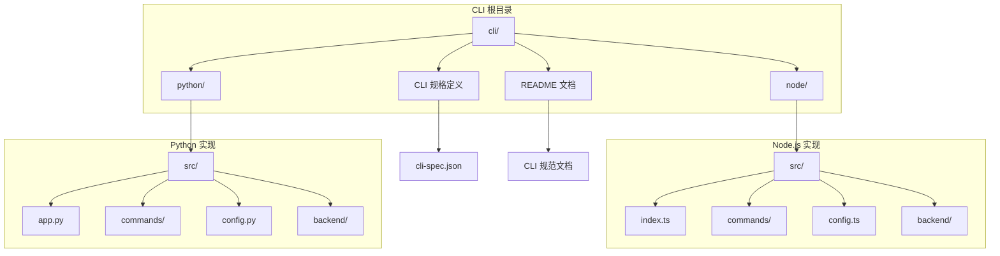
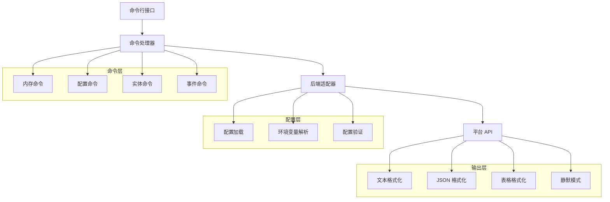
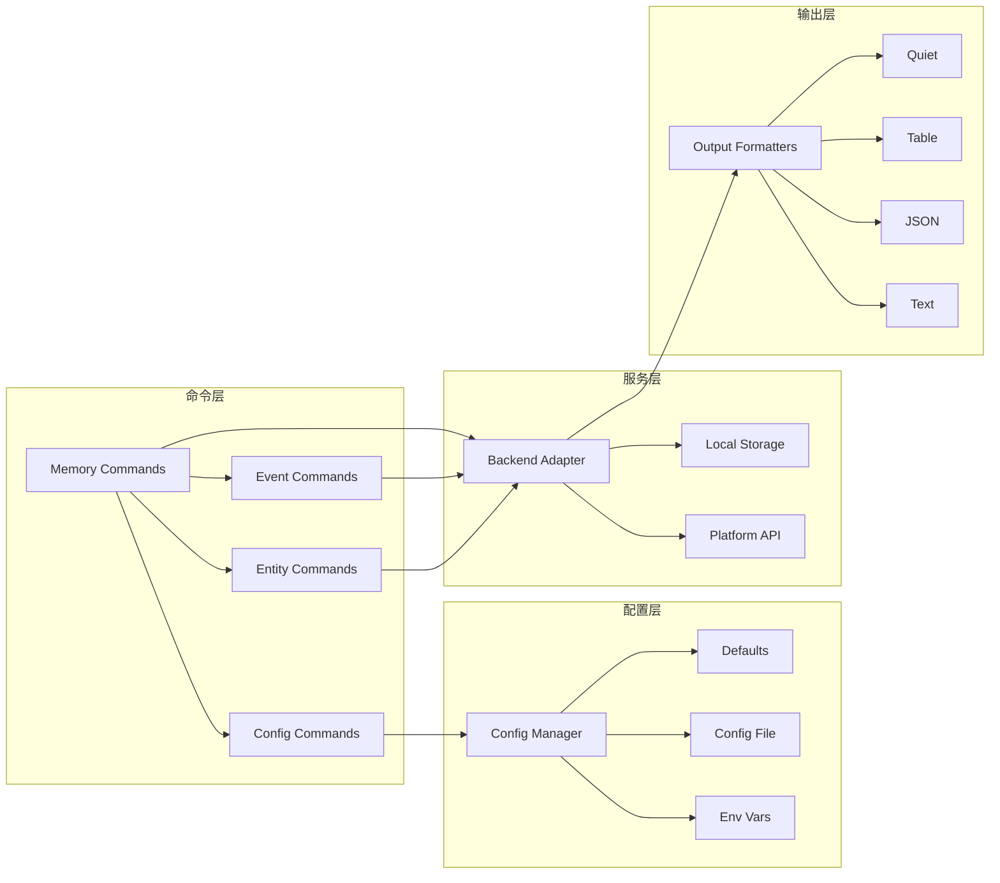

# CLI 工具使用指南

<cite>
**本文档引用的文件**
- [cli/README.md](file://cli/README.md)
- [CLI 规范文档](file://cli/CLI_SPECIFICATION.md)
- [CLI 规格定义](file://cli/cli-spec.json)
- [Node.js 版本 README](file://cli/node/README.md)
- [Python 版本 README](file://cli/python/README.md)
- [Node.js 包配置](file://cli/node/package.json)
- [Python 包配置](file://cli/python/pyproject.toml)
- [Node.js 主入口](file://cli/node/src/index.ts)
- [Python 主入口](file://cli/python/src/mem0_cli/app.py)
- [Node.js 配置管理](file://cli/node/src/config.ts)
- [Python 配置管理](file://cli/python/src/mem0_cli/config.py)
- [Node.js 内存命令实现](file://cli/node/src/commands/memory.ts)
- [Python 内存命令实现](file://cli/python/src/mem0_cli/commands/memory.py)
</cite>

## 目录
1. [简介](#简介)
2. [项目结构](#项目结构)
3. [核心组件](#核心组件)
4. [架构概览](#架构概览)
5. [详细组件分析](#详细组件分析)
6. [依赖关系分析](#依赖关系分析)
7. [性能考虑](#性能考虑)
8. [故障排除指南](#故障排除指南)
9. [结论](#结论)
10. [附录](#附录)

## 简介

mem0 CLI 是 mem0 记忆层的官方命令行界面，为 AI 代理提供记忆管理功能。该工具支持 Python 和 Node.js 两种实现，具有相同的命令行为和输出格式。

mem0 CLI 提供了完整的记忆生命周期管理能力，包括记忆的添加、搜索、列出、更新和删除操作。它专为 AI 代理设计，支持机器友好的输出模式，适用于工具循环和自动化场景。

## 项目结构

CLI 项目采用双语言实现架构，共享统一的规格定义：



**图表来源**
- [cli/README.md](file://cli/README.md)
- [CLI 规范文档](file://cli/CLI_SPECIFICATION.md)

**章节来源**
- [cli/README.md:1-137](file://cli/README.md#L1-L137)
- [CLI 规范文档:34-52](file://cli/CLI_SPECIFICATION.md#L34-L52)

## 核心组件

### 安装与配置

CLI 支持通过 npm 和 pip 两种方式安装，提供完全相同的功能：

```bash
# Node.js 安装
npm install -g @mem0/cli

# Python 安装
pip install mem0-cli
```

### 配置系统

CLI 使用分层配置系统，优先级从高到低：

1. **命令行参数**：最高优先级
2. **环境变量**：MEM0_API_KEY、MEM0_BASE_URL 等
3. **配置文件**：~/.mem0/config.json
4. **默认值**：内置默认配置

配置文件结构：
```json
{
  "version": 1,
  "platform": {
    "api_key": "m0-xxxxxxxx",
    "base_url": "https://api.mem0.ai",
    "user_email": "user@example.com"
  },
  "defaults": {
    "user_id": "alice",
    "agent_id": "",
    "app_id": "",
    "run_id": ""
  }
}
```

**章节来源**
- [cli/README.md:7-18](file://cli/README.md#L7-L18)
- [Node.js 配置管理:90-132](file://cli/node/src/config.ts#L90-L132)
- [Python 配置管理:88-144](file://cli/python/src/mem0_cli/config.py#L88-L144)

## 架构概览

CLI 采用模块化架构，包含以下核心层次：



**图表来源**
- [Node.js 主入口:25-88](file://cli/node/src/index.ts#L25-L88)
- [Python 主入口:23-32](file://cli/python/src/mem0_cli/app.py#L23-L32)

## 详细组件分析

### 初始化命令 (init)

初始化命令提供三种认证方式：

```bash
# 交互式设置向导
mem0 init

# 邮箱登录（需要验证码）
mem0 init --email alice@company.com

# 使用现有 API 密钥
mem0 init --api-key m0-xxx

# 强制覆盖现有配置
mem0 init --api-key m0-xxx --force
```

初始化流程特点：
- 检测现有配置并询问确认
- 支持非交互式邮箱登录
- 自动保存配置到 ~/.mem0/config.json
- 支持 Agent Mode 引导模式

**章节来源**
- [CLI 规范文档:140-191](file://cli/CLI_SPECIFICATION.md#L140-L191)
- [Node.js 主入口:203-251](file://cli/node/src/index.ts#L203-L251)
- [Python 主入口:254-273](file://cli/python/src/mem0_cli/app.py#L254-L273)

### 记忆管理命令

#### 添加记忆 (add)

```bash
# 基本用法
mem0 add "I prefer dark mode and use vim keybindings" --user-id alice

# 从文件读取消息
mem0 add --file conversation.json --user-id alice

# 从标准输入读取
echo "Loves hiking on weekends" | mem0 add --user-id alice

# 设置元数据和分类
mem0 add "Important meeting" --user-id alice --metadata '{"priority":"high"}' --categories '["work","meeting"]'

# 设置过期时间
mem0 add "Temporary note" --user-id alice --expires 2025-12-31
```

支持的输入源：
- 直接文本参数
- JSON 消息数组
- 文件输入
- 标准输入管道

**章节来源**
- [CLI 规范文档:194-247](file://cli/CLI_SPECIFICATION.md#L194-L247)
- [Node.js 内存命令实现:37-210](file://cli/node/src/commands/memory.ts#L37-L210)
- [Python 内存命令实现:50-211](file://cli/python/src/mem0_cli/commands/memory.py#L50-L211)

#### 搜索记忆 (search)

```bash
# 基本搜索
mem0 search "preferences" --user-id alice

# 高级搜索选项
mem0 search "tools" -u alice -o json -k 5 --threshold 0.5 --rerank

# 关键词搜索
mem0 search "important documents" --keyword

# 过滤表达式
mem0 search "project work" --filter '{"category":"work"}'

# 字段选择
mem0 search "meeting notes" --fields "memory,text,created_at"
```

搜索特性：
- 语义相似度搜索
- 关键词搜索模式
- 结果重排序
- 高级过滤表达式
- 自定义字段返回

**章节来源**
- [CLI 规范文档:250-299](file://cli/CLI_SPECIFICATION.md#L250-L299)
- [Node.js 内存命令实现:212-330](file://cli/node/src/commands/memory.ts#L212-L330)
- [Python 内存命令实现:213-321](file://cli/python/src/mem0_cli/commands/memory.py#L213-L321)

#### 列出记忆 (list)

```bash
# 基本列表
mem0 list --user-id alice

# 分页和过滤
mem0 list --user-id alice --category preferences --output json

# 时间范围过滤
mem0 list --user-id alice --after 2024-01-01 --page-size 50

# 表格显示
mem0 list --user-id alice --output table
```

列表特性：
- 分页支持
- 类别过滤
- 时间范围过滤
- 多种输出格式

**章节来源**
- [CLI 规范文档:341-383](file://cli/CLI_SPECIFICATION.md#L341-L383)
- [Node.js 内存命令实现:355-447](file://cli/node/src/commands/memory.ts#L355-L447)
- [Python 内存命令实现:343-441](file://cli/python/src/mem0_cli/commands/memory.py#L343-L441)

#### 更新记忆 (update)

```bash
# 更新文本内容
mem0 update abc-123 "Updated preference text"

# 更新元数据
mem0 update abc-123 --metadata '{"priority":"high","updated_by":"admin"}'

# 从标准输入更新
echo "new text" | mem0 update abc-123
```

**章节来源**
- [CLI 规范文档:386-426](file://cli/CLI_SPECIFICATION.md#L386-L426)
- [Node.js 内存命令实现:449-491](file://cli/node/src/commands/memory.ts#L449-L491)
- [Python 内存命令实现:443-484](file://cli/python/src/mem0_cli/commands/memory.py#L443-L484)

#### 删除记忆 (delete)

```bash
# 删除单个记忆
mem0 delete abc-123

# 预览删除操作
mem0 delete abc-123 --dry-run

# 批量删除（按作用域）
mem0 delete --all --user-id alice --force

# 全项目删除
mem0 delete --all --project --force

# 删除实体及其所有记忆
mem0 delete --entity --user-id alice --force
```

删除模式互斥性：
- `<memoryId>` 与 `--all` 不能同时使用
- `<memoryId>` 与 `--entity` 不能同时使用  
- `--all` 与 `--entity` 不能同时使用

**章节来源**
- [CLI 规范文档:429-493](file://cli/CLI_SPECIFICATION.md#L429-L493)
- [Node.js 内存命令实现:493-704](file://cli/node/src/commands/memory.ts#L493-L704)
- [Python 内存命令实现:487-672](file://cli/python/src/mem0_cli/commands/memory.py#L487-L672)

### 配置管理命令

#### 配置查看 (config show)

```bash
# 显示当前配置
mem0 config show

# JSON 格式输出
mem0 config show -o json
```

#### 获取配置值 (config get)

```bash
# 获取 API 密钥
mem0 config get platform.api_key

# 获取默认用户 ID
mem0 config get defaults.user_id
```

#### 设置配置值 (config set)

```bash
# 设置默认用户 ID
mem0 config set defaults.user_id alice

# 设置基础 URL
mem0 config set platform.base_url https://api.mem0.ai
```

**章节来源**
- [CLI 规范文档:550-628](file://cli/CLI_SPECIFICATION.md#L550-L628)
- [Node.js 主入口:606-651](file://cli/node/src/index.ts#L606-L651)
- [Python 主入口:649-695](file://cli/python/src/mem0_cli/app.py#L649-L695)

### 实体管理命令

#### 列出实体 (entity list)

```bash
# 列出用户
mem0 entity list users

# 列出代理
mem0 entity list agents -o json

# 列出应用
mem0 entity list apps

# 列出运行
mem0 entity list runs
```

#### 删除实体 (entity delete)

```bash
# 删除用户及其所有记忆
mem0 entity delete --user-id alice --force

# 预览删除
mem0 entity delete --user-id alice --dry-run
```

**章节来源**
- [CLI 规范文档:631-710](file://cli/CLI_SPECIFICATION.md#L631-L710)
- [Node.js 主入口:654-701](file://cli/node/src/index.ts#L654-L701)
- [Python 主入口:699-776](file://cli/python/src/mem0_cli/app.py#L699-L776)

### 事件管理命令

#### 事件列表 (event list)

```bash
# 查看最近事件
mem0 event list

# JSON 格式输出
mem0 event list -o json
```

#### 事件状态 (event status)

```bash
# 查看特定事件状态
mem0 event status evt-abc123
```

**章节来源**
- [CLI 规范文档:713-791](file://cli/CLI_SPECIFICATION.md#L713-L791)
- [Node.js 主入口:704-745](file://cli/node/src/index.ts#L704-L745)
- [Python 主入口:785-840](file://cli/python/src/mem0_cli/app.py#L785-L840)

## 依赖关系分析

### 技术栈对比

| 技术特性 | Node.js 实现 | Python 实现 |
|---------|-------------|-------------|
| CLI 框架 | Commander.js 12.0.0 | Typer >= 0.9.0 |
| 输出美化 | Chalk + Cli-table3 | Rich >= 13.0.0 |
| 加载指示器 | Ora 8.0.0 | Rich Status |
| 框架面板 | Boxen 7.1.0 | Rich Panels |
| HTTP 客户端 | Native fetch | Httpx >= 0.24.0 |
| 构建系统 | Tsup 8.0.0 | Hatchling |
| 测试框架 | Vitest 1.5.0 | Pytest 7.0 |
| 类型检查 | TypeScript 5.4.0 | Ruff 类型检查 |
| 最低运行时 | Node >= 18.0.0 | Python >= 3.10 |
| 模块格式 | ESM | 标准包 |

### 组件耦合关系



**图表来源**
- [Node.js 主入口:25-88](file://cli/node/src/index.ts#L25-L88)
- [Python 主入口:23-32](file://cli/python/src/mem0_cli/app.py#L23-L32)

**章节来源**
- [Node.js 包配置:32-47](file://cli/node/package.json#L32-L47)
- [Python 包配置:27-31](file://cli/python/pyproject.toml#L27-L31)

## 性能考虑

### 输出模式优化

CLI 提供多种输出模式以适应不同使用场景：

| 模式 | 描述 | 适用场景 |
|------|------|----------|
| text | 人类可读的彩色格式化输出 | 交互式使用、调试 |
| json | 结构化 JSON 输出 | 管道处理、程序消费 |
| table | 表格格式输出 | 数据展示、报告生成 |
| quiet | 最小化输出 | 脚本自动化、批处理 |

### Agent 模式特性

Agent 模式提供专门优化的输出格式：

```json
{
  "status": "success",
  "command": "search",
  "duration_ms": 134,
  "scope": { "user_id": "alice" },
  "count": 2,
  "data": [
    { "id": "abc-123", "memory": "User prefers dark mode", "score": 0.97 }
  ]
}
```

Agent 模式的特殊处理：
- 移除人类友好输出（颜色、图标、横幅）
- 清理数据字段，仅保留代理需要的信息
- 错误作为 JSON 输出，带有非零退出码

### 批量操作优化

导入命令支持批量处理大量记忆：

```bash
# 批量导入 JSON 文件
mem0 import data.json --user-id alice -o json
```

批量处理特性：
- 进度指示器（每 10 项显示一次）
- 成功/失败计数统计
- 并发处理优化

**章节来源**
- [cli/README.md:99-122](file://cli/README.md#L99-L122)
- [Node.js 内存命令实现:53-94](file://cli/node/src/commands/memory.ts#L53-L94)

## 故障排除指南

### 常见错误及解决方案

#### 认证失败

**问题**：`Authentication failed. Your API key may be invalid or expired.`

**解决方案**：
1. 运行 `mem0 init` 重新初始化
2. 检查环境变量 `MEM0_API_KEY`
3. 验证 API 密钥的有效性

#### 配置文件权限问题

**问题**：配置文件权限不正确导致无法读取

**解决方案**：
1. 检查 `~/.mem0/config.json` 权限
2. 确保文件权限为 600
3. 重新生成配置文件

#### 网络连接问题

**问题**：无法连接到 mem0 API

**解决方案**：
1. 检查网络连接
2. 验证 `MEM0_BASE_URL` 设置
3. 尝试使用不同的网络环境

### 调试技巧

#### 启用详细日志

```bash
# 使用调试模式
mem0 --agent search "test" --user-id alice

# 查看帮助树
mem0 help --json
```

#### 验证配置

```bash
# 检查连接状态
mem0 status

# 查看配置详情
mem0 config show
```

**章节来源**
- [CLI 规格定义:109-126](file://cli/cli-spec.json#L109-L126)
- [Node.js 主入口:52-85](file://cli/node/src/index.ts#L52-L85)

## 结论

mem0 CLI 提供了一个功能完整、设计精良的记忆管理工具，具有以下优势：

1. **双语言支持**：Node.js 和 Python 实现提供相同的功能体验
2. **AI 代理友好**：专门的 Agent 模式支持自动化场景
3. **灵活的配置系统**：多层配置优先级满足各种部署需求
4. **丰富的输出格式**：适应从交互式使用到自动化脚本的各种场景
5. **完善的错误处理**：清晰的错误信息和故障排除指导

该工具特别适合需要在 AI 代理中集成持久记忆功能的开发者，以及需要在 CI/CD 流水线中管理记忆数据的 DevOps 团队。

## 附录

### 环境变量参考

| 变量名 | 描述 | 默认值 |
|--------|------|--------|
| MEM0_API_KEY | API 密钥 | 无 |
| MEM0_BASE_URL | API 基础 URL | https://api.mem0.ai |
| MEM0_USER_ID | 默认用户 ID | 无 |
| MEM0_AGENT_ID | 默认代理 ID | 无 |
| MEM0_APP_ID | 默认应用 ID | 无 |
| MEM0_RUN_ID | 默认运行 ID | 无 |
| MEM0_ENABLE_GRAPH | 启用图记忆 | false |

### CI/CD 集成最佳实践

#### GitHub Actions 示例

```yaml
name: Memory Management
on: [push, pull_request]

jobs:
  memory_ops:
    runs-on: ubuntu-latest
    steps:
      - uses: actions/checkout@v4
      
      - name: Setup Python
        uses: actions/setup-python@v4
        with:
          python-version: '3.10'
          
      - name: Install mem0 CLI
        run: pip install mem0-cli
        
      - name: Configure mem0
        run: |
          mem0 init --api-key ${{ secrets.MEM0_API_KEY }} --user-id bot-user
          
      - name: Import memories
        run: mem0 import data.json --user-id bot-user
```

#### 命令行补全设置

**Bash/Zsh 补全**：
```bash
# 生成补全脚本
mem0 completion bash > ~/.mem0-completion.bash
echo "source ~/.mem0-completion.bash" >> ~/.bashrc
```

**别名设置**：
```bash
# 创建常用别名
alias madd='mem0 add --user-id alice'
alias msearch='mem0 search --user-id alice'
alias mlist='mem0 list --user-id alice'
```

**章节来源**
- [cli/README.md:111-122](file://cli/README.md#L111-L122)
- [Node.js 版本 README:301-313](file://cli/node/README.md#L301-L313)
- [Python 版本 README:310-322](file://cli/python/README.md#L310-L322)