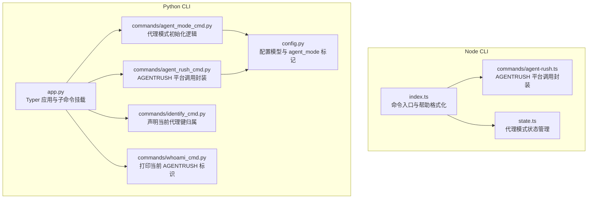
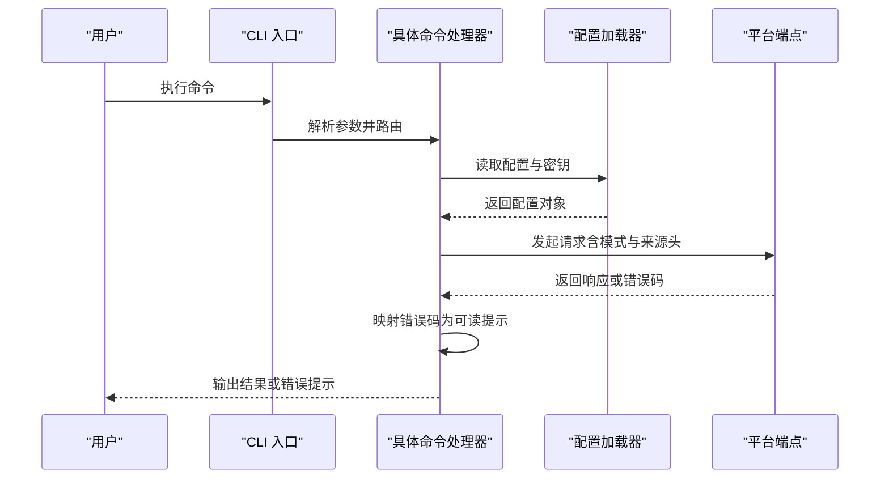
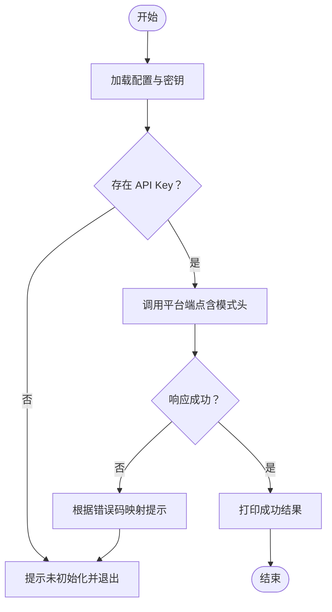
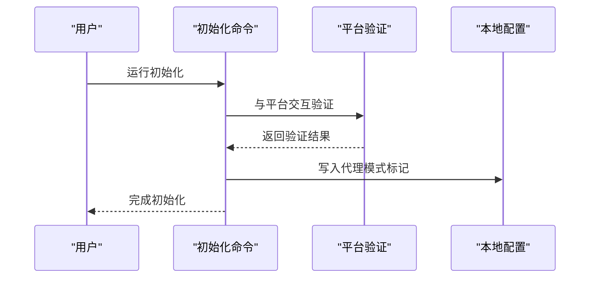
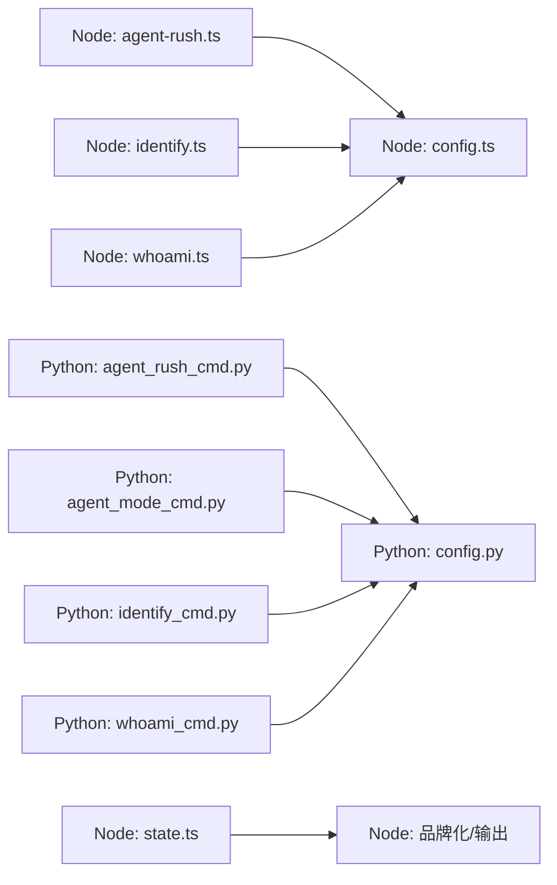

# 代理模式命令

<cite>
**本文引用的文件**
- [cli/node/src/index.ts](file://cli/node/src/index.ts)
- [cli/node/src/commands/agent-rush.ts](file://cli/node/src/commands/agent-rush.ts)
- [cli/node/src/state.ts](file://cli/node/src/state.ts)
- [cli/python/src/mem0_cli/commands/agent_rush_cmd.py](file://cli/python/src/mem0_cli/commands/agent_rush_cmd.py)
- [cli/python/src/mem0_cli/commands/agent_mode_cmd.py](file://cli/python/src/mem0_cli/commands/agent_mode_cmd.py)
- [cli/python/src/mem0_cli/commands/identify_cmd.py](file://cli/python/src/mem0_cli/commands/identify_cmd.py)
- [cli/python/src/mem0_cli/commands/whoami_cmd.py](file://cli/python/src/mem0_cli/commands/whoami_cmd.py)
- [cli/python/src/mem0_cli/app.py](file://cli/python/src/mem0_cli/app.py)
- [cli/python/src/mem0_cli/config.py](file://cli/python/src/mem0_cli/config.py)
</cite>

## 目录
1. [简介](#简介)
2. [项目结构](#项目结构)
3. [核心组件](#核心组件)
4. [架构总览](#架构总览)
5. [详细组件分析](#详细组件分析)
6. [依赖关系分析](#依赖关系分析)
7. [性能考量](#性能考量)
8. [故障排查指南](#故障排查指南)
9. [结论](#结论)
10. [附录](#附录)

## 简介
本指南聚焦于代理模式相关命令，系统讲解以下内容：
- agent-mode 与 agent-rush 命令的功能、使用场景与工作原理
- 代理模式的配置要求与切换管理方法
- 代理模式下的特殊参数与选项说明
- 实际使用案例与最佳实践建议

## 项目结构
代理模式命令在 Node 与 Python 双语言 CLI 中均有实现，核心由“初始化与标识”（agent-mode/identify/whoami）与“公共游戏模式”（agent-rush）两部分组成。Node 版本通过命令注册与帮助格式化组织；Python 版本通过 Typer 子应用聚合子命令。

图表来源
- [cli/node/src/index.ts:253-281](file://cli/node/src/index.ts#L253-L281)
- [cli/node/src/commands/agent-rush.ts:1-88](file://cli/node/src/commands/agent-rush.ts#L1-L88)
- [cli/node/src/state.ts:1-40](file://cli/node/src/state.ts#L1-L40)
- [cli/python/src/mem0_cli/app.py:931-972](file://cli/python/src/mem0_cli/app.py#L931-L972)
- [cli/python/src/mem0_cli/commands/agent_rush_cmd.py:1-45](file://cli/python/src/mem0_cli/commands/agent_rush_cmd.py#L1-L45)
- [cli/python/src/mem0_cli/commands/agent_mode_cmd.py:146-146](file://cli/python/src/mem0_cli/commands/agent_mode_cmd.py#L146-L146)
- [cli/python/src/mem0_cli/commands/identify_cmd.py:1-38](file://cli/python/src/mem0_cli/commands/identify_cmd.py#L1-L38)
- [cli/python/src/mem0_cli/commands/whoami_cmd.py:1-200](file://cli/python/src/mem0_cli/commands/whoami_cmd.py#L1-L200)
- [cli/python/src/mem0_cli/config.py:31-31](file://cli/python/src/mem0_cli/config.py#L31-L31)

章节来源
- [cli/node/src/index.ts:253-281](file://cli/node/src/index.ts#L253-L281)
- [cli/python/src/mem0_cli/app.py:931-972](file://cli/python/src/mem0_cli/app.py#L931-L972)

## 核心组件
- 代理模式状态与命令上下文：Node 侧通过全局状态模块维护是否处于代理模式以及当前命令名，用于品牌化输出与提示。
- AGENTRUSH 平台封装：Node 与 Python 两端均封装了对平台端点的调用，统一设置来源与模式头，并处理错误码与配额提示。
- 初始化与标识：Python 端提供代理模式初始化流程与“声明归属”“查询标识”的命令，配合配置模型中的 agent_mode 字段进行状态标记。

章节来源
- [cli/node/src/state.ts:1-40](file://cli/node/src/state.ts#L1-L40)
- [cli/node/src/commands/agent-rush.ts:33-75](file://cli/node/src/commands/agent-rush.ts#L33-L75)
- [cli/python/src/mem0_cli/commands/agent_rush_cmd.py:29-45](file://cli/python/src/mem0_cli/commands/agent_rush_cmd.py#L29-L45)
- [cli/python/src/mem0_cli/commands/agent_mode_cmd.py:146-146](file://cli/python/src/mem0_cli/commands/agent_mode_cmd.py#L146-L146)
- [cli/python/src/mem0_cli/commands/identify_cmd.py:27-38](file://cli/python/src/mem0_cli/commands/identify_cmd.py#L27-L38)
- [cli/python/src/mem0_cli/config.py:31-31](file://cli/python/src/mem0_cli/config.py#L31-L31)

## 架构总览
下图展示 Node 与 Python 两端在代理模式下的交互路径：命令解析、状态注入、平台调用与错误处理。

图表来源
- [cli/node/src/commands/agent-rush.ts:33-75](file://cli/node/src/commands/agent-rush.ts#L33-L75)
- [cli/python/src/mem0_cli/commands/agent_rush_cmd.py:118-124](file://cli/python/src/mem0_cli/commands/agent_rush_cmd.py#L118-L124)

## 详细组件分析

### AGENTRUSH 命令族（agent-rush）
- 功能概述
  - 提供“添加记忆”和“搜索记忆”的子命令，直接调用平台端点，无需额外标志位。
  - 在调用时自动携带来源与客户端信息及“代理模式”标识头，便于服务端统计与限流。
- 使用场景
  - 快速共享或检索公共记忆，适合竞赛、演示或教学场景。
  - 需要遵守公开可见与内容规范（如长度、禁止链接、不含敏感信息等）。
- 错误与配额提示
  - 服务端返回特定错误码时，CLI 将映射为用户可理解的提示，例如首次添加前需完成若干次搜索、配额耗尽、未处于代理模式等。
- 特殊参数与选项
  - Node 与 Python 两端均无额外标志位，内容通过子命令参数传入；Python 端在请求头中显式标注“代理模式”。

图表来源
- [cli/node/src/commands/agent-rush.ts:33-75](file://cli/node/src/commands/agent-rush.ts#L33-L75)
- [cli/python/src/mem0_cli/commands/agent_rush_cmd.py:35-45](file://cli/python/src/mem0_cli/commands/agent_rush_cmd.py#L35-L45)

章节来源
- [cli/node/src/commands/agent-rush.ts:1-88](file://cli/node/src/commands/agent-rush.ts#L1-L88)
- [cli/python/src/mem0_cli/commands/agent_rush_cmd.py:1-45](file://cli/python/src/mem0_cli/commands/agent_rush_cmd.py#L1-L45)
- [cli/python/src/mem0_cli/commands/agent_rush_cmd.py:118-124](file://cli/python/src/mem0_cli/commands/agent_rush_cmd.py#L118-L124)

### 代理模式初始化与标识（agent-mode、identify、whoami）
- 代理模式初始化（agent-mode）
  - 在 Python 端，初始化流程会与平台进行验证交互，并在本地配置中标记为“代理模式”状态。
- 声明归属（identify）
  - 仅适用于未被认领的代理模式密钥，用于声明该密钥属于哪个具体代理（如 Claude Code、Cursor 等）。
- 查询标识（whoami）
  - 打印当前活跃的 AGENTRUSH 标识，便于确认当前会话的归属。

图表来源
- [cli/python/src/mem0_cli/commands/agent_mode_cmd.py:146-146](file://cli/python/src/mem0_cli/commands/agent_mode_cmd.py#L146-L146)
- [cli/python/src/mem0_cli/config.py:31-31](file://cli/python/src/mem0_cli/config.py#L31-L31)

章节来源
- [cli/python/src/mem0_cli/commands/agent_mode_cmd.py:146-146](file://cli/python/src/mem0_cli/commands/agent_mode_cmd.py#L146-L146)
- [cli/python/src/mem0_cli/commands/identify_cmd.py:1-38](file://cli/python/src/mem0_cli/commands/identify_cmd.py#L1-L38)
- [cli/python/src/mem0_cli/commands/whoami_cmd.py:1-200](file://cli/python/src/mem0_cli/commands/whoami_cmd.py#L1-L200)
- [cli/python/src/mem0_cli/config.py:31-31](file://cli/python/src/mem0_cli/config.py#L31-L31)

### Node CLI 的命令组织与帮助
- Node 侧通过命令入口注册“agent-rush”子命令组，并启用富帮助格式化，便于展示子命令与使用示例。
- 代理模式状态通过全局状态模块注入到各命令与品牌化输出中。

章节来源
- [cli/node/src/index.ts:253-281](file://cli/node/src/index.ts#L253-L281)
- [cli/node/src/state.ts:1-40](file://cli/node/src/state.ts#L1-L40)

## 依赖关系分析
- Node 与 Python 两端均依赖配置模块以读取 API Key 与基础地址；Python 端还依赖 Typer 与 Rich 进行命令定义与输出美化。
- AGENTRUSH 调用链路中，错误码映射与配额提示在两端保持一致，确保用户体验统一。
- 代理模式状态在 Node 侧通过全局状态模块管理，在 Python 侧通过配置模型字段标记。

图表来源
- [cli/node/src/commands/agent-rush.ts:33-75](file://cli/node/src/commands/agent-rush.ts#L33-L75)
- [cli/python/src/mem0_cli/commands/agent_rush_cmd.py:118-124](file://cli/python/src/mem0_cli/commands/agent_rush_cmd.py#L118-L124)
- [cli/python/src/mem0_cli/commands/agent_mode_cmd.py:146-146](file://cli/python/src/mem0_cli/commands/agent_mode_cmd.py#L146-L146)
- [cli/python/src/mem0_cli/config.py:31-31](file://cli/python/src/mem0_cli/config.py#L31-L31)

章节来源
- [cli/node/src/commands/agent-rush.ts:33-75](file://cli/node/src/commands/agent-rush.ts#L33-L75)
- [cli/python/src/mem0_cli/commands/agent_rush_cmd.py:118-124](file://cli/python/src/mem0_cli/commands/agent_rush_cmd.py#L118-L124)
- [cli/python/src/mem0_cli/commands/agent_mode_cmd.py:146-146](file://cli/python/src/mem0_cli/commands/agent_mode_cmd.py#L146-L146)
- [cli/python/src/mem0_cli/config.py:31-31](file://cli/python/src/mem0_cli/config.py#L31-L31)

## 性能考量
- 请求超时控制：两端在调用平台端点时设置了合理的超时时间，避免长时间阻塞。
- 模式与来源头：通过统一的请求头传递来源与模式信息，有助于服务端进行资源调度与计费统计。
- 配置读取：尽量减少重复读取配置的次数，避免不必要的 IO 开销。

## 故障排查指南
- 未初始化或缺少 API Key
  - 现象：提示未初始化，请先执行初始化命令。
  - 处理：运行初始化命令以生成并绑定代理模式密钥。
- 未处于代理模式
  - 现象：提示需要先切换到代理模式。
  - 处理：先完成代理模式初始化，再执行相关命令。
- 首次添加限制
  - 现象：提示需要先完成若干次搜索才能添加。
  - 处理：先执行搜索命令达到配额要求后再添加。
- 配额耗尽
  - 现象：提示已达到生命周期配额。
  - 处理：等待重置或联系管理员。
- 内容不合规
  - 现象：提示内容长度不符、包含链接或违禁词。
  - 处理：调整内容长度、移除链接与违禁词后重试。
- 环境未开放 AGENTRUSH
  - 现象：提示当前环境未开放 AGENTRUSH。
  - 处理：确认环境配置或联系支持。

章节来源
- [cli/node/src/commands/agent-rush.ts:18-31](file://cli/node/src/commands/agent-rush.ts#L18-L31)
- [cli/python/src/mem0_cli/commands/agent_rush_cmd.py:35-45](file://cli/python/src/mem0_cli/commands/agent_rush_cmd.py#L35-L45)

## 结论
- agent-mode 与 agent-rush 命令共同构成代理模式的完整使用闭环：前者负责初始化与状态标记，后者负责公共游戏模式下的记忆操作。
- 两端实现保持一致的错误映射与配额策略，确保跨语言一致性。
- 在使用 AGENTRUSH 时务必遵守公开可见与内容规范，避免泄露敏感信息。

## 附录
- 使用建议
  - 初次使用：先完成代理模式初始化，再进行身份声明与 whoami 校验。
  - AGENTRUSH：遵循搜索-添加的顺序，注意内容长度与合规性。
  - 切换与管理：通过初始化与身份声明命令管理代理模式状态，必要时使用 whoami 核对当前标识。
- 参考命令位置
  - Node：命令入口与帮助格式化位于入口文件；AGENTRUSH 封装位于对应命令文件；状态管理位于状态模块。
  - Python：Typer 子应用挂载于主应用；各命令位于 commands 目录；配置模型位于 config 文件。

章节来源
- [cli/node/src/index.ts:253-281](file://cli/node/src/index.ts#L253-L281)
- [cli/node/src/commands/agent-rush.ts:1-88](file://cli/node/src/commands/agent-rush.ts#L1-L88)
- [cli/node/src/state.ts:1-40](file://cli/node/src/state.ts#L1-L40)
- [cli/python/src/mem0_cli/app.py:931-972](file://cli/python/src/mem0_cli/app.py#L931-L972)
- [cli/python/src/mem0_cli/commands/agent_rush_cmd.py:1-45](file://cli/python/src/mem0_cli/commands/agent_rush_cmd.py#L1-L45)
- [cli/python/src/mem0_cli/commands/agent_mode_cmd.py:146-146](file://cli/python/src/mem0_cli/commands/agent_mode_cmd.py#L146-L146)
- [cli/python/src/mem0_cli/commands/identify_cmd.py:1-38](file://cli/python/src/mem0_cli/commands/identify_cmd.py#L1-L38)
- [cli/python/src/mem0_cli/commands/whoami_cmd.py:1-200](file://cli/python/src/mem0_cli/commands/whoami_cmd.py#L1-L200)
- [cli/python/src/mem0_cli/config.py:31-31](file://cli/python/src/mem0_cli/config.py#L31-L31)