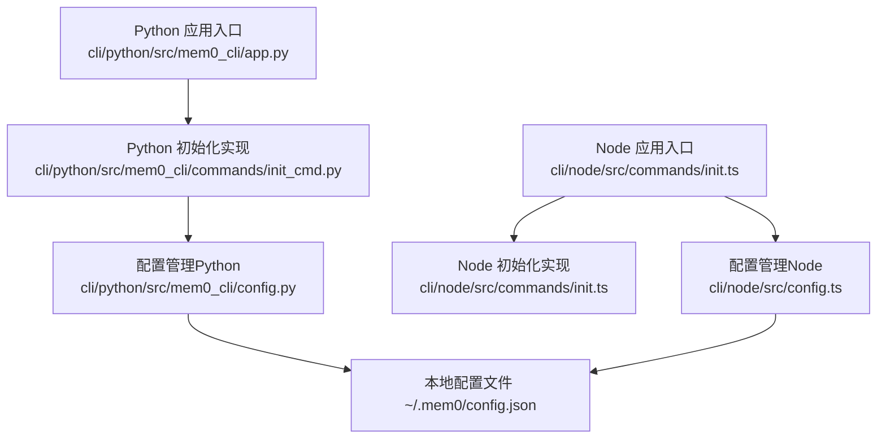
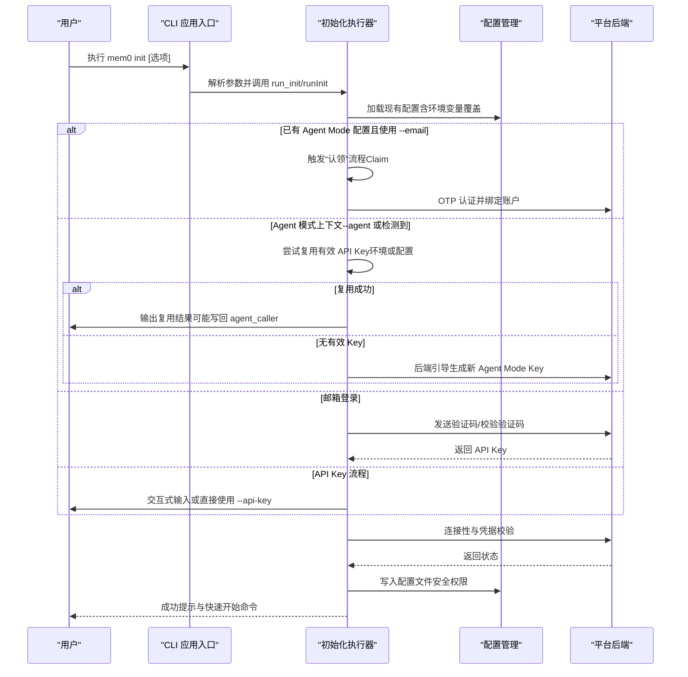
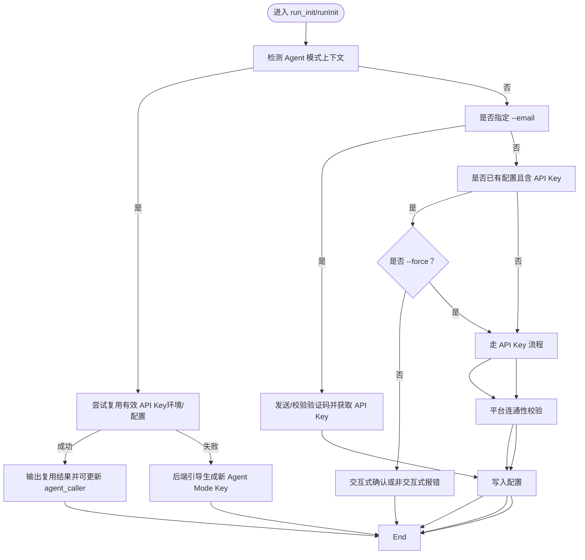
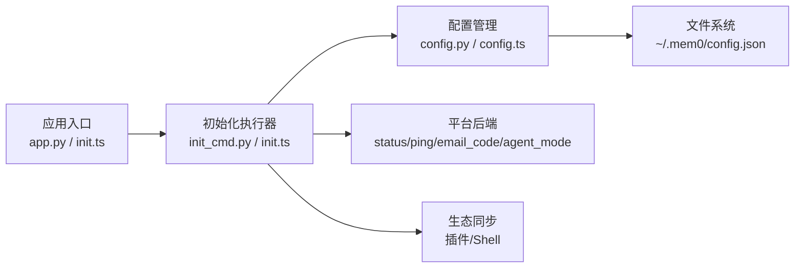

# 初始化命令（init）

<cite>
**本文引用的文件**
- [cli/python/src/mem0_cli/commands/init_cmd.py](file://cli/python/src/mem0_cli/commands/init_cmd.py)
- [cli/node/src/commands/init.ts](file://cli/node/src/commands/init.ts)
- [cli/python/src/mem0_cli/app.py](file://cli/python/src/mem0_cli/app.py)
- [cli/python/src/mem0_cli/config.py](file://cli/python/src/mem0_cli/config.py)
- [cli/node/src/config.ts](file://cli/node/src/config.ts)
- [cli/README.md](file://cli/README.md)
- [cli/python/tests/test_init_internals.py](file://cli/python/tests/test_init_internals.py)
</cite>

## 目录
1. [简介](#简介)
2. [项目结构](#项目结构)
3. [核心组件](#核心组件)
4. [架构总览](#架构总览)
5. [详细组件分析](#详细组件分析)
6. [依赖关系分析](#依赖关系分析)
7. [性能考量](#性能考量)
8. [故障排查指南](#故障排查指南)
9. [结论](#结论)
10. [附录](#附录)

## 简介
本指南面向首次使用 mem0 CLI 的用户与集成开发者，系统讲解 init 命令的功能、参数、使用场景与初始化流程。内容涵盖：
- 初始化目标：创建并校验本地配置，确保 CLI 可以连接到 mem0 平台
- 参数选项：认证方式（邮箱验证码、已有 API Key、Agent Mode）、默认实体 ID、覆盖策略等
- 配置文件：~/.mem0/config.json 的结构与默认值
- 环境变量：MEM0_* 系列变量的作用与优先级
- 依赖检查：网络连通性验证、API Key 校验、平台可用性检测
- 常见错误：典型失败原因与修复建议
- 完整示例：交互式与非交互式用法、参数组合

## 项目结构
CLI 在 Python 与 Node.js 两端实现一致的初始化逻辑，入口命令在各自语言的主应用中注册，并委托给对应的初始化模块执行。

图表来源
- [cli/python/src/mem0_cli/app.py:849-898](file://cli/python/src/mem0_cli/app.py#L849-L898)
- [cli/python/src/mem0_cli/commands/init_cmd.py:197-503](file://cli/python/src/mem0_cli/commands/init_cmd.py#L197-L503)
- [cli/node/src/commands/init.ts:307-612](file://cli/node/src/commands/init.ts#L307-L612)
- [cli/python/src/mem0_cli/config.py:88-144](file://cli/python/src/mem0_cli/config.py#L88-L144)
- [cli/node/src/config.ts:90-132](file://cli/node/src/config.ts#L90-L132)

章节来源
- [cli/python/src/mem0_cli/app.py:849-898](file://cli/python/src/mem0_cli/app.py#L849-L898)
- [cli/README.md:1-137](file://cli/README.md#L1-L137)

## 核心组件
- 命令定义与参数解析
  - Python：通过 Typer 注册 init 子命令，接收 --api-key、--user-id/-u、--email、--code、--force、--agent、--source、--agent-caller 等选项
  - Node：通过命令行参数对象接收相同语义的选项
- 初始化执行器
  - Python：run_init(...) 实现交互式向导、邮箱登录、Agent Mode、键复用与覆盖确认、平台连通性校验
  - Node：runInit(...) 实现等价逻辑，行为与 Python 版保持一致
- 配置管理
  - 读取/写入 ~/.mem0/config.json，支持环境变量覆盖，保存时设置安全权限
  - 提供密钥脱敏显示、嵌套字段读写工具

章节来源
- [cli/python/src/mem0_cli/app.py:849-898](file://cli/python/src/mem0_cli/app.py#L849-L898)
- [cli/python/src/mem0_cli/commands/init_cmd.py:197-503](file://cli/python/src/mem0_cli/commands/init_cmd.py#L197-L503)
- [cli/node/src/commands/init.ts:307-612](file://cli/node/src/commands/init.ts#L307-L612)
- [cli/python/src/mem0_cli/config.py:88-144](file://cli/python/src/mem0_cli/config.py#L88-L144)
- [cli/node/src/config.ts:90-132](file://cli/node/src/config.ts#L90-L132)

## 架构总览
初始化流程的关键步骤如下：

图表来源
- [cli/python/src/mem0_cli/commands/init_cmd.py:197-503](file://cli/python/src/mem0_cli/commands/init_cmd.py#L197-L503)
- [cli/node/src/commands/init.ts:307-612](file://cli/node/src/commands/init.ts#L307-L612)
- [cli/python/src/mem0_cli/config.py:147-181](file://cli/python/src/mem0_cli/config.py#L147-L181)
- [cli/node/src/config.ts:134-179](file://cli/node/src/config.ts#L134-L179)

## 详细组件分析

### 命令定义与参数
- Python 子命令 init
  - 关键选项：--api-key、--user-id/-u、--email、--code、--force、--agent、--source、--agent-caller
  - 示例与帮助信息由命令注释提供
- Node 子命令 runInit
  - 接收与 Python 对应的选项对象，行为一致

章节来源
- [cli/python/src/mem0_cli/app.py:849-898](file://cli/python/src/mem0_cli/app.py#L849-L898)
- [cli/node/src/commands/init.ts:307-317](file://cli/node/src/commands/init.ts#L307-L317)

### 初始化决策树与流程
- Agent Mode 优先路径
  - 若检测到 Agent 上下文（--agent、全局 agent 模式或代理检测），优先尝试复用有效 API Key；若无可复用，则后端引导生成新的 Agent Mode Key
- 邮箱登录路径
  - 支持交互式获取验证码或非交互式传入 --code；成功后返回 API Key 并写入配置
- API Key 路径
  - 支持交互式输入或非交互式传入 --api-key；随后进行平台连通性校验
- 覆盖保护
  - 当存在已保存的 API Key 且未显式 --force 时，交互式终端会询问确认，非交互式终端要求 --force

图表来源
- [cli/python/src/mem0_cli/commands/init_cmd.py:197-503](file://cli/python/src/mem0_cli/commands/init_cmd.py#L197-L503)
- [cli/node/src/commands/init.ts:307-612](file://cli/node/src/commands/init.ts#L307-L612)

章节来源
- [cli/python/src/mem0_cli/commands/init_cmd.py:197-503](file://cli/python/src/mem0_cli/commands/init_cmd.py#L197-L503)
- [cli/node/src/commands/init.ts:307-612](file://cli/node/src/commands/init.ts#L307-L612)

### 配置文件创建与默认设置
- 文件位置：~/.mem0/config.json
- 默认值与字段
  - platform.api_key：空字符串（需填写或从环境变量注入）
  - platform.base_url：默认为 https://api.mem0.ai
  - platform.user_email：空字符串（邮箱登录成功后填充）
  - platform.agent_mode：布尔，Agent Mode 未认领时为真
  - platform.created_via：记录创建来源（"agent_mode"/"email"/"api_key"/"existing_key"）
  - platform.agent_caller：Agent Mode 自声明身份（如 claude-code）
  - platform.claimed_at：人类认领时间戳
  - platform.default_user_id：后端引导返回的默认用户 ID
  - defaults.user_id/agent_id/app_id/run_id：空字符串
  - telemetry.anonymous_id：匿名标识
  - agent_rush.acknowledged_at：AGENTrush 公开记忆警告的人类确认时间戳
- 权限与同步
  - 写入时设置 0600 权限
  - 写入后尝试同步 API Key 到生态插件与 shell 配置（幂等、不创建新条目）

章节来源
- [cli/python/src/mem0_cli/config.py:26-68](file://cli/python/src/mem0_cli/config.py#L26-L68)
- [cli/python/src/mem0_cli/config.py:147-181](file://cli/python/src/mem0_cli/config.py#L147-L181)
- [cli/node/src/config.ts:20-55](file://cli/node/src/config.ts#L20-L55)
- [cli/node/src/config.ts:134-179](file://cli/node/src/config.ts#L134-L179)

### 环境变量与覆盖规则
- 优先级（高到低）
  1. CLI 选项（如 --api-key、--base-url）
  2. 环境变量（MEM0_API_KEY、MEM0_BASE_URL、MEM0_USER_ID、MEM0_AGENT_ID、MEM0_APP_ID、MEM0_RUN_ID）
  3. 配置文件 ~/.mem0/config.json
  4. 默认值
- 主要变量
  - MEM0_API_KEY：API Key
  - MEM0_BASE_URL：平台基础地址
  - MEM0_USER_ID/MEM0_AGENT_ID/MEM0_APP_ID/MEM0_RUN_ID：默认实体 ID

章节来源
- [cli/python/src/mem0_cli/config.py:119-143](file://cli/python/src/mem0_cli/config.py#L119-L143)
- [cli/node/src/config.ts:120-131](file://cli/node/src/config.ts#L120-L131)
- [cli/README.md:111-122](file://cli/README.md#L111-L122)

### 依赖检查与平台校验
- 连接性测试
  - 初始化完成后调用后端 status/ping 接口，验证凭据与连通性
  - 成功后可缓存 user_email 用于遥测
- 键有效性探测
  - 使用 /v1/ping 校验 API Key；对网络错误与 5xx 视为不确定，避免误触发新 Key 生成

章节来源
- [cli/python/src/mem0_cli/commands/init_cmd.py:537-567](file://cli/python/src/mem0_cli/commands/init_cmd.py#L537-L567)
- [cli/node/src/commands/init.ts:275-305](file://cli/node/src/commands/init.ts#L275-L305)
- [cli/python/src/mem0_cli/commands/init_cmd.py:106-123](file://cli/python/src/mem0_cli/commands/init_cmd.py#L106-L123)
- [cli/node/src/commands/init.ts:39-57](file://cli/node/src/commands/init.ts#L39-L57)

### 参数与使用场景示例
以下示例均来自官方 README 与命令注释，便于快速上手与自动化集成。

- 交互式初始化
  - mem0 init
- 邮箱登录（获取新 API Key）
  - mem0 init --email alice@company.com
- 邮箱登录（非交互，需配合 --code）
  - mem0 init --email alice@company.com --code 482901
- 使用已有 API Key（非交互）
  - mem0 init --api-key m0-xxx --user-id alice
- Agent Mode 引导（无需邮箱）
  - mem0 init --agent --agent-caller claude-code
- 在已有 Agent Mode 配置基础上认领账户
  - mem0 init --email alice@company.com
- 覆盖保护（CI/自动化）
  - mem0 init --api-key m0-xxx --user-id alice --force

章节来源
- [cli/README.md:19-45](file://cli/README.md#L19-L45)
- [cli/python/src/mem0_cli/app.py:878-885](file://cli/python/src/mem0_cli/app.py#L878-L885)

## 依赖关系分析
- 组件耦合
  - 命令入口仅负责参数解析与分发，初始化逻辑独立于应用层，降低耦合
  - 配置模块提供统一的数据结构与持久化接口，被初始化与其它命令共享
- 外部依赖
  - 平台后端：/v1/ping、/api/v1/auth/email_code、/api/v1/auth/email_code/verify、/api/v1/auth/agent_mode/caller 等
  - 生态同步：插件与 shell 配置同步（幂等更新）

图表来源
- [cli/python/src/mem0_cli/app.py:849-898](file://cli/python/src/mem0_cli/app.py#L849-L898)
- [cli/python/src/mem0_cli/commands/init_cmd.py:197-503](file://cli/python/src/mem0_cli/commands/init_cmd.py#L197-L503)
- [cli/node/src/commands/init.ts:307-612](file://cli/node/src/commands/init.ts#L307-L612)
- [cli/python/src/mem0_cli/config.py:147-181](file://cli/python/src/mem0_cli/config.py#L147-L181)
- [cli/node/src/config.ts:134-179](file://cli/node/src/config.ts#L134-L179)

## 性能考量
- 键探测采用短超时请求，避免阻塞；网络异常与上游错误被视为“不确定”，优先复用现有键
- 非 TTY 环境要求必要参数，减少无效等待
- 配置写入采用原子写入与最小权限（0600），兼顾安全性与性能

## 故障排查指南
- “同时使用 --api-key 与 --email”
  - 现象：命令直接退出并提示冲突
  - 处理：二选一，或先清理旧配置再重试
- “--code 未配合 --email”
  - 现象：提示 --code 需要 --email
  - 处理：补齐 --email 或移除 --code
- “非交互终端缺少 --api-key”
  - 现象：提示需要提供 --api-key 或改用 --agent
  - 处理：在脚本中显式传入 --api-key，或使用 Agent Mode
- “现有配置将被覆盖”
  - 现象：交互式确认或非交互式报错
  - 处理：添加 --force 显式允许覆盖，或备份 ~/.mem0/config.json
- “邮箱验证码发送/校验失败”
  - 现象：429 频控或失败详情
  - 处理：稍后再试；检查邮箱拼写与网络；必要时使用 --agent
- “无法连接平台”
  - 现象：status/ping 返回不可连接
  - 处理：检查 MEM0_BASE_URL、网络连通性、API Key 是否过期；重新运行初始化
- “Agent Mode 引导 403”
  - 现象：日限额或其他权限限制
  - 处理：等待额度恢复或改用邮箱登录；查看更明确的错误提示

章节来源
- [cli/python/src/mem0_cli/commands/init_cmd.py:247-249](file://cli/python/src/mem0_cli/commands/init_cmd.py#L247-L249)
- [cli/node/src/commands/init.ts:345-352](file://cli/node/src/commands/init.ts#L345-L352)
- [cli/python/src/mem0_cli/commands/init_cmd.py:409-414](file://cli/python/src/mem0_cli/commands/init_cmd.py#L409-L414)
- [cli/node/src/commands/init.ts:508-518](file://cli/node/src/commands/init.ts#L508-L518)
- [cli/python/src/mem0_cli/commands/init_cmd.py:342-362](file://cli/python/src/mem0_cli/commands/init_cmd.py#L342-L362)
- [cli/node/src/commands/init.ts:432-464](file://cli/node/src/commands/init.ts#L432-L464)
- [cli/python/tests/test_init_internals.py:170-206](file://cli/python/tests/test_init_internals.py#L170-L206)

## 结论
init 命令提供了三种主要的初始化路径：Agent Mode、邮箱登录与手动 API Key 输入。它遵循严格的覆盖保护与环境变量优先级，并在写入配置前进行平台连通性校验。通过合理的参数组合与环境变量配置，既能满足交互式使用，也能无缝接入 CI/CD 管道。

## 附录

### 配置文件结构参考
- 顶层字段
  - version：配置版本号
  - defaults：默认实体 ID
  - platform：平台相关配置
  - telemetry：遥测配置
  - agent_rush：AGENTrush 相关配置
- platform 字段
  - api_key、base_url、user_email、agent_mode、created_via、agent_caller、claimed_at、default_user_id
- defaults 字段
  - user_id、agent_id、app_id、run_id

章节来源
- [cli/python/src/mem0_cli/config.py:62-68](file://cli/python/src/mem0_cli/config.py#L62-L68)
- [cli/node/src/config.ts:49-55](file://cli/node/src/config.ts#L49-L55)