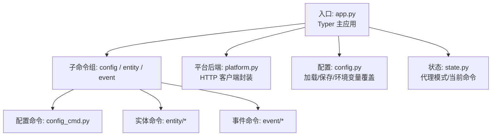
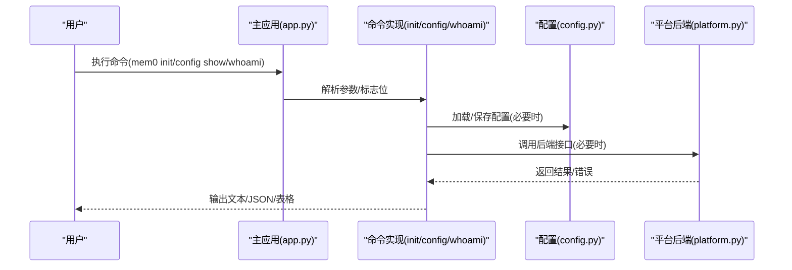
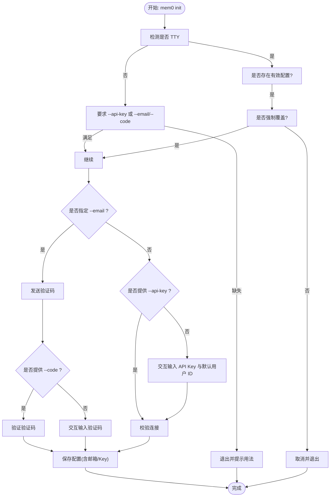
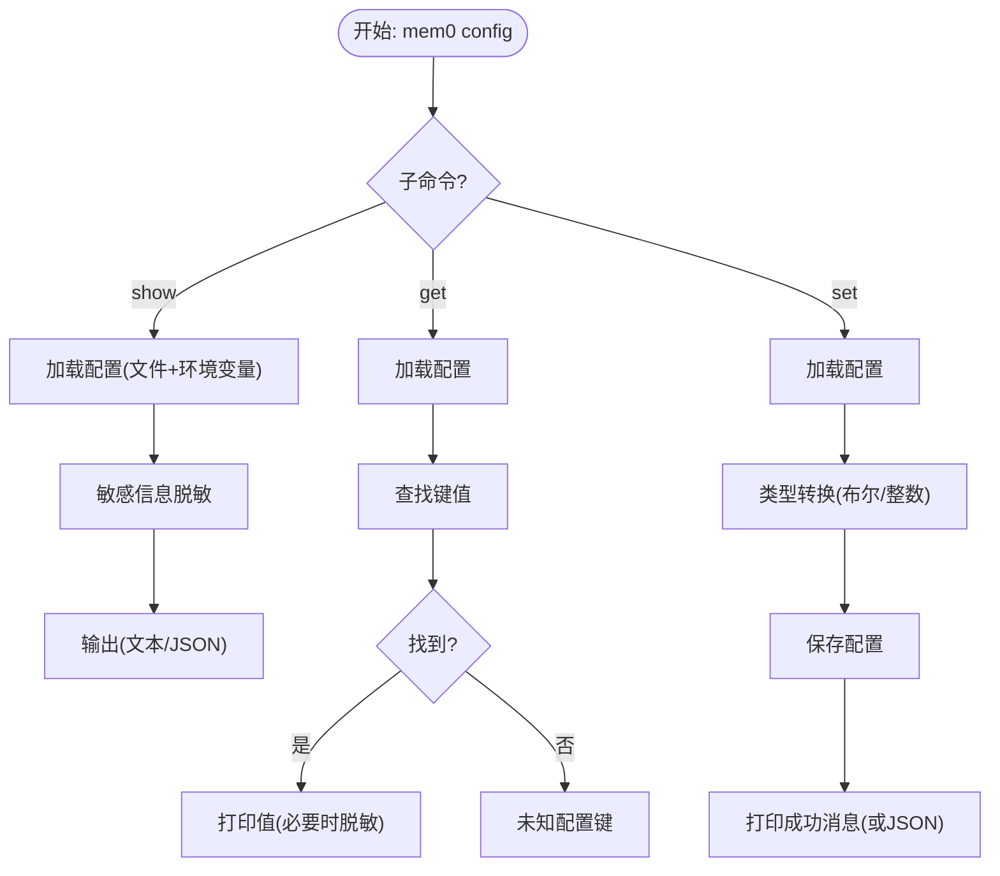
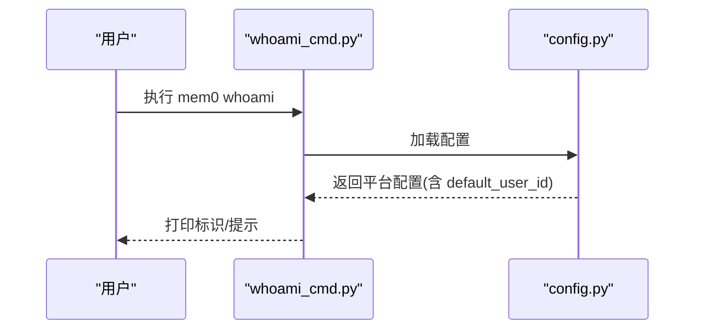
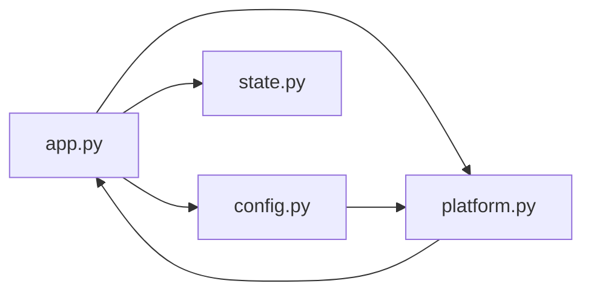

# 基础命令

<cite>
**本文引用的文件**
- [app.py](file://cli/python/src/mem0_cli/app.py)
- [config.py](file://cli/python/src/mem0_cli/config.py)
- [config_cmd.py](file://cli/python/src/mem0_cli/commands/config_cmd.py)
- [init_cmd.py](file://cli/python/src/mem0_cli/commands/init_cmd.py)
- [whoami_cmd.py](file://cli/python/src/mem0_cli/commands/whoami_cmd.py)
- [platform.py](file://cli/python/src/mem0_cli/backend/platform.py)
- [state.py](file://cli/python/src/mem0_cli/state.py)
- [CLI 规范](file://cli/CLI_SPECIFICATION.md)
- [测试：命令](file://cli/python/tests/test_commands.py)
- [测试：配置](file://cli/python/tests/test_config.py)
</cite>

## 目录
1. [简介](#简介)
2. [项目结构](#项目结构)
3. [核心组件](#核心组件)
4. [架构总览](#架构总览)
5. [详细组件分析](#详细组件分析)
6. [依赖关系分析](#依赖关系分析)
7. [性能考量](#性能考量)
8. [故障排除指南](#故障排除指南)
9. [结论](#结论)
10. [附录](#附录)

## 简介
本指南聚焦 mem0 CLI 的“基础命令”，包括初始化命令（init）、配置命令（config）与用户信息命令（whoami）。文档覆盖命令参数、标志位、使用场景、前置条件与依赖、输出格式、错误处理与故障排除，并通过图示展示调用流程与数据流。

## 项目结构
- CLI 入口与主应用在 Python 实现中由 Typer 定义，命令注册于主应用对象，并按功能分组（如 config、entity、event）。
- 配置管理位于独立模块，负责加载/保存配置、环境变量覆盖、密钥脱敏显示。
- 平台后端封装 HTTP 请求，统一处理鉴权、错误与通知。
- 状态模块用于标记“代理模式”以及当前命令名，影响输出与行为。

图表来源
- [app.py:1-120](file://cli/python/src/mem0_cli/app.py#L1-L120)
- [config.py:1-120](file://cli/python/src/mem0_cli/config.py#L1-L120)
- [platform.py:1-80](file://cli/python/src/mem0_cli/backend/platform.py#L1-L80)
- [state.py:1-46](file://cli/python/src/mem0_cli/state.py#L1-L46)

章节来源
- [app.py:1-120](file://cli/python/src/mem0_cli/app.py#L1-L120)
- [config.py:1-120](file://cli/python/src/mem0_cli/config.py#L1-L120)
- [CLI 规范:138-191](file://cli/CLI_SPECIFICATION.md#L138-L191)

## 核心组件
- 初始化命令（init）
  - 功能：交互式设置向导；支持邮箱验证码登录、API Key 登录、非交互模式、代理模式（Agent Mode）。
  - 关键点：存在现有配置时的覆盖保护；邮箱登录流程；代理模式复用或生成新密钥。
- 配置命令（config）
  - 功能：显示配置、获取值、设置值；支持短键别名；类型强制（布尔/整数）。
  - 关键点：密钥脱敏显示；环境变量优先级高于配置文件。
- 用户信息命令（whoami）
  - 功能：打印当前会话的默认用户标识（AgentRush 标识），用于识别代理模式会话。

章节来源
- [init_cmd.py:197-503](file://cli/python/src/mem0_cli/commands/init_cmd.py#L197-L503)
- [config_cmd.py:21-128](file://cli/python/src/mem0_cli/commands/config_cmd.py#L21-L128)
- [whoami_cmd.py:15-26](file://cli/python/src/mem0_cli/commands/whoami_cmd.py#L15-L26)
- [config.py:88-144](file://cli/python/src/mem0_cli/config.py#L88-L144)

## 架构总览
下图展示基础命令的典型调用链：从主应用到具体命令，再到后端与配置模块。

图表来源
- [app.py:217-250](file://cli/python/src/mem0_cli/app.py#L217-L250)
- [init_cmd.py:197-503](file://cli/python/src/mem0_cli/commands/init_cmd.py#L197-L503)
- [config_cmd.py:21-128](file://cli/python/src/mem0_cli/commands/config_cmd.py#L21-L128)
- [whoami_cmd.py:15-26](file://cli/python/src/mem0_cli/commands/whoami_cmd.py#L15-L26)
- [platform.py:14-71](file://cli/python/src/mem0_cli/backend/platform.py#L14-L71)

## 详细组件分析

### 初始化命令（init）
- 用途
  - 首次安装或重装 CLI 时建立本地配置；支持邮箱验证码登录与 API Key 登录；支持非交互模式与代理模式。
- 参数与标志位
  - --api-key：直接传入 API Key（跳过交互）。
  - -u/--user-id：默认用户 ID（跳过交互）。
  - --email：邮箱登录（触发验证码发送/验证）。
  - --code：验证码（与 --email 搭配，非交互）。
  - --force：覆盖现有配置且不提示。
  - --agent：进入代理模式（Agent Mode）。
  - --agent-caller：代理调用者标识（仅在复用/识别时影响）。
- 行为要点
  - 存在现有配置且含有效 API Key 时，可选择复用而非覆盖。
  - 邮箱登录成功后写入配置并保存用户邮箱。
  - 非 TTY 环境下必须提供 --api-key 或 --email/--code，否则报错。
  - 代理模式优先复用有效 Key，否则后端生成新的代理模式 Key。
- 使用场景
  - 新用户首次使用 CLI。
  - 在 CI/自动化脚本中非交互地注入 API Key。
  - 在代理环境中以 Agent Mode 运行。
- 示例
  - mem0 init
  - mem0 init --api-key m0-xxx --user-id alice
  - mem0 init --email alice@company.com
  - mem0 init --email alice@company.com --code 482901
- 输出格式
  - 文本：成功/失败提示、下一步建议。
  - JSON：在代理模式下返回结构化输出（由内部逻辑决定）。
- 错误处理
  - 验证码错误/频率限制、网络异常、无效 Key、缺少必要参数等均会打印错误并退出。
- 故障排除
  - 若提示“无 API Key 配置”，请先运行 mem0 init 或设置 MEM0_API_KEY 环境变量。
  - 若提示“无效或过期 API Key”，请重新运行 mem0 init 获取新 Key。
  - 非 TTY 环境需显式提供 --api-key 或 --email/--code。

图表来源
- [init_cmd.py:197-503](file://cli/python/src/mem0_cli/commands/init_cmd.py#L197-L503)

章节来源
- [init_cmd.py:197-503](file://cli/python/src/mem0_cli/commands/init_cmd.py#L197-L503)
- [CLI 规范:140-191](file://cli/CLI_SPECIFICATION.md#L140-L191)
- [测试：命令:703-742](file://cli/python/tests/test_commands.py#L703-L742)

### 配置命令（config）
- 子命令
  - config show：显示当前配置（敏感信息脱敏）。
  - config get <key>：获取某配置项值。
  - config set <key> <value>：设置某配置项值（自动类型转换）。
- 参数与标志位
  - config show：-o/--output=text|json。
  - config get：必填参数 key（支持短键别名）。
  - config set：必填参数 key、value。
- 行为要点
  - 支持短键别名（如 api_key 对应 platform.api_key）。
  - 环境变量优先于配置文件。
  - 设置值时对布尔/整数进行类型转换。
- 使用场景
  - 查看当前配置、定位问题。
  - 在 CI 中动态设置默认用户 ID、Base URL。
- 示例
  - mem0 config show
  - mem0 config get platform.api_key
  - mem0 config set defaults.user_id alice
- 输出格式
  - 文本：表格或纯文本。
  - JSON：结构化输出（含命令名、数据、耗时等）。
- 错误处理
  - 未知键名时报错。
  - 设置不存在的键名时报错。
- 故障排除
  - 若显示的 API Key 为空，检查 MEM0_API_KEY 环境变量是否正确设置。
  - 若修改未生效，确认环境变量是否覆盖了配置文件。

图表来源
- [config_cmd.py:21-128](file://cli/python/src/mem0_cli/commands/config_cmd.py#L21-L128)
- [config.py:88-144](file://cli/python/src/mem0_cli/config.py#L88-L144)

章节来源
- [config_cmd.py:21-128](file://cli/python/src/mem0_cli/commands/config_cmd.py#L21-L128)
- [config.py:88-144](file://cli/python/src/mem0_cli/config.py#L88-L144)
- [CLI 规范:550-628](file://cli/CLI_SPECIFICATION.md#L550-L628)
- [测试：配置:17-125](file://cli/python/tests/test_config.py#L17-L125)

### 用户信息命令（whoami）
- 用途
  - 打印当前会话的默认用户标识（AgentRush 标识），用于识别代理模式会话。
- 参数与标志位
  - 无。
- 使用场景
  - 在代理模式下快速确认当前会话的默认用户标识。
- 示例
  - mem0 whoami
- 输出格式
  - 文本：打印标识与引导链接。
- 错误处理
  - 若未找到默认用户标识，提示先运行 mem0 init --agent。
- 故障排除
  - 若提示“未找到默认用户标识”，请先以代理模式初始化：mem0 init --agent。

图表来源
- [whoami_cmd.py:15-26](file://cli/python/src/mem0_cli/commands/whoami_cmd.py#L15-L26)
- [config.py:88-144](file://cli/python/src/mem0_cli/config.py#L88-L144)

章节来源
- [whoami_cmd.py:15-26](file://cli/python/src/mem0_cli/commands/whoami_cmd.py#L15-L26)
- [CLI 规范:713-757](file://cli/CLI_SPECIFICATION.md#L713-L757)

## 依赖关系分析
- 主应用 app.py
  - 注册全局选项（--version、--json/--agent）与回调，负责命令分发与通用帮助。
  - 通过 _get_backend_and_config/_get_backend 统一构建后端与加载配置。
- 配置模块 config.py
  - 提供配置加载/保存、环境变量覆盖、短键别名、密钥脱敏。
- 平台后端 platform.py
  - 封装 HTTP 请求、鉴权错误处理、资源不存在与通用错误。
- 状态模块 state.py
  - 记录代理模式与当前命令，影响输出与提示。

图表来源
- [app.py:100-162](file://cli/python/src/mem0_cli/app.py#L100-L162)
- [config.py:88-144](file://cli/python/src/mem0_cli/config.py#L88-L144)
- [platform.py:14-71](file://cli/python/src/mem0_cli/backend/platform.py#L14-L71)
- [state.py:10-26](file://cli/python/src/mem0_cli/state.py#L10-L26)

章节来源
- [app.py:100-162](file://cli/python/src/mem0_cli/app.py#L100-L162)
- [config.py:88-144](file://cli/python/src/mem0_cli/config.py#L88-L144)
- [platform.py:14-71](file://cli/python/src/mem0_cli/backend/platform.py#L14-L71)
- [state.py:10-26](file://cli/python/src/mem0_cli/state.py#L10-L26)

## 性能考量
- 初始化阶段的网络请求采用较短超时（如 ping 验证），避免阻塞用户。
- 配置读写为本地文件操作，注意权限与并发写入。
- 后端请求统一携带客户端版本与来源信息，便于服务端统计与排障。

## 故障排除指南
- “无 API Key 配置”
  - 现象：提示需要运行 mem0 init 或设置 MEM0_API_KEY。
  - 处理：运行 mem0 init 或设置环境变量后重试。
- “无效或过期 API Key”
  - 现象：提示认证失败。
  - 处理：重新运行 mem0 init 获取新 Key。
- “非交互终端但缺少必要参数”
  - 现象：在非 TTY 环境下提示需要 --api-key 或 --email/--code。
  - 处理：在 CI 中显式传入相应参数。
- “覆盖现有配置”
  - 现象：存在有效配置时提示确认覆盖。
  - 处理：使用 --force 跳过确认；或在交互模式下选择否。
- “未知配置键”
  - 现象：config get/set 报未知键。
  - 处理：检查键名是否正确，支持短键别名映射。

章节来源
- [app.py:122-151](file://cli/python/src/mem0_cli/app.py#L122-L151)
- [init_cmd.py:341-415](file://cli/python/src/mem0_cli/commands/init_cmd.py#L341-L415)
- [config_cmd.py:94-108](file://cli/python/src/mem0_cli/commands/config_cmd.py#L94-L108)
- [CLI 规范:165-182](file://cli/CLI_SPECIFICATION.md#L165-L182)

## 结论
基础命令（init、config、whoami）构成了 mem0 CLI 的使用起点。通过明确的参数与标志位、严格的前置条件与错误处理，以及一致的输出格式，用户可在交互与自动化场景中高效地完成配置与身份确认。建议在 CI/CD 中结合环境变量与非交互参数，确保稳定与可重复性。

## 附录
- 常用环境变量
  - MEM0_API_KEY：API Key
  - MEM0_BASE_URL：平台 Base URL
  - MEM0_USER_ID / MEM0_AGENT_ID / MEM0_APP_ID / MEM0_RUN_ID：默认实体 ID
- 相关参考
  - CLI 规范：完整命令定义、行为与输出格式
  - 测试用例：命令与配置的行为验证

章节来源
- [CLI 规范:138-191](file://cli/CLI_SPECIFICATION.md#L138-L191)
- [测试：命令:1-120](file://cli/python/tests/test_commands.py#L1-L120)
- [测试：配置:1-125](file://cli/python/tests/test_config.py#L1-L125)