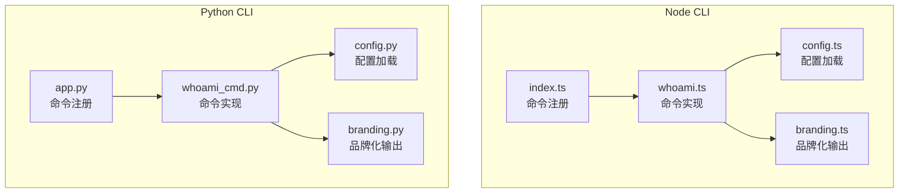
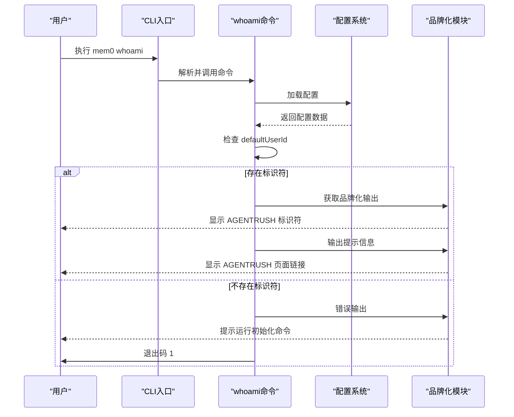
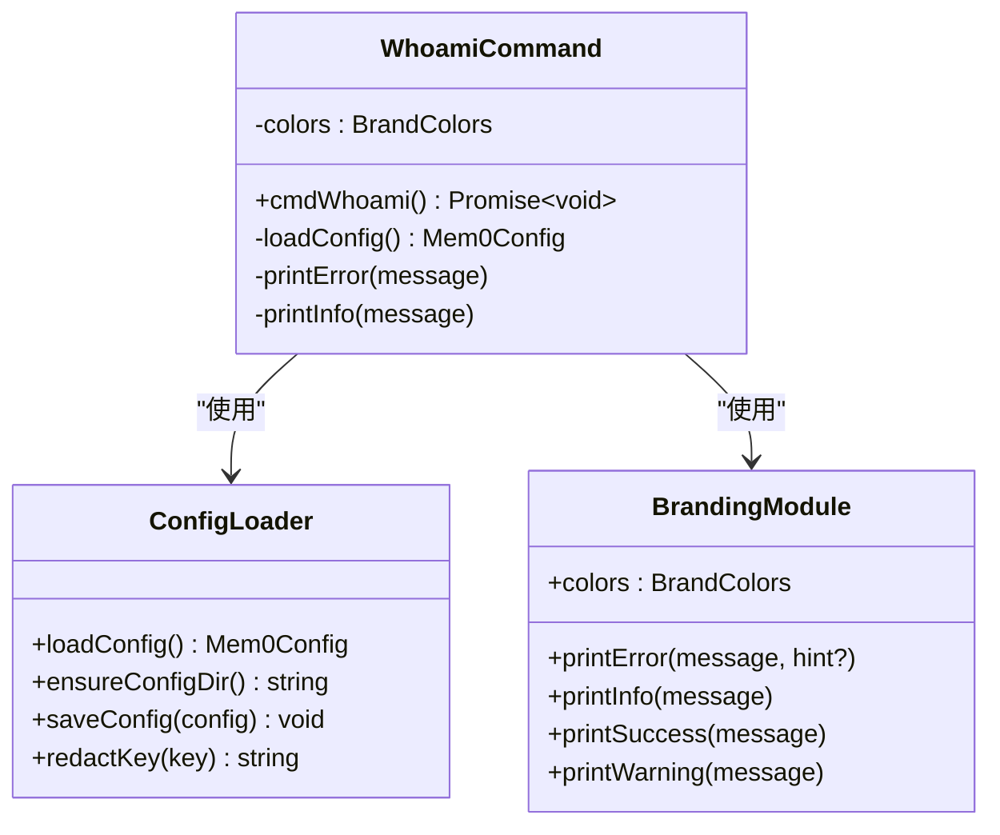
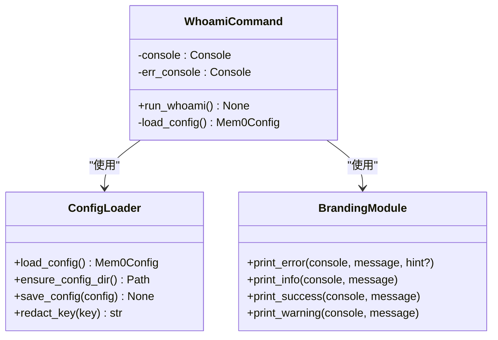
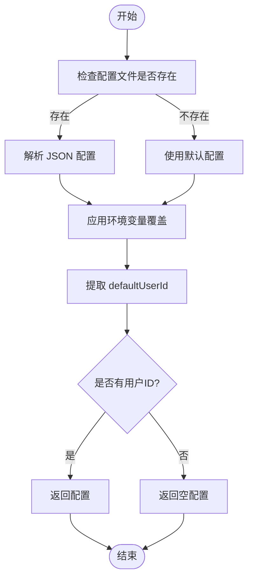
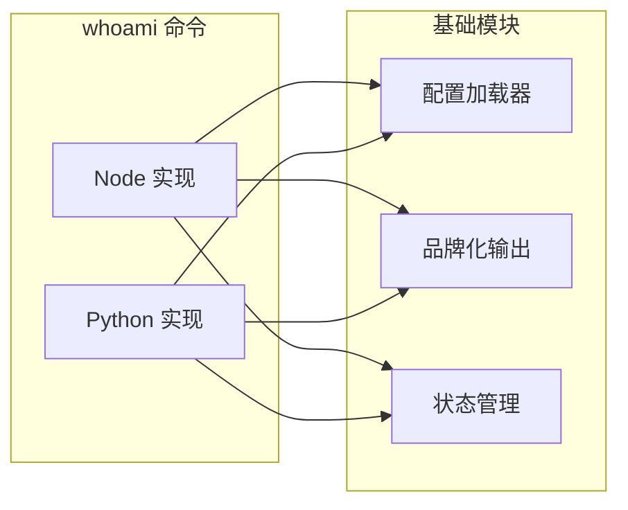

# 用户信息命令 (whoami)

<cite>
**本文档引用的文件**
- [cli/node/src/commands/whoami.ts](file://cli/node/src/commands/whoami.ts)
- [cli/python/src/mem0_cli/commands/whoami_cmd.py](file://cli/python/src/mem0_cli/commands/whoami_cmd.py)
- [cli/node/src/config.ts](file://cli/node/src/config.ts)
- [cli/python/src/mem0_cli/config.py](file://cli/python/src/mem0_cli/config.py)
- [cli/node/src/branding.ts](file://cli/node/src/branding.ts)
- [cli/python/src/mem0_cli/branding.py](file://cli/python/src/mem0_cli/branding.py)
- [cli/node/src/index.ts](file://cli/node/src/index.ts)
- [cli/python/src/mem0_cli/app.py](file://cli/python/src/mem0_cli/app.py)
</cite>

## 目录
1. [简介](#简介)
2. [项目结构](#项目结构)
3. [核心组件](#核心组件)
4. [架构概览](#架构概览)
5. [详细组件分析](#详细组件分析)
6. [依赖关系分析](#依赖关系分析)
7. [性能考虑](#性能考虑)
8. [故障排除指南](#故障排除指南)
9. [结论](#结论)

## 简介
`mem0 whoami` 命令用于显示当前激活的代理模式（Agent Mode）下的默认用户标识符（AGENTRUSH 标识符）。该命令从本地配置中读取信息，不进行网络调用，旨在快速确认用户的 AGENTRUSH 身份。

## 项目结构
CLI 工程采用双语言实现（Node.js 和 Python），两者在功能上保持一致：
- Node.js 实现位于 `cli/node/src/commands/whoami.ts`
- Python 实现位于 `cli/python/src/mem0_cli/commands/whoami_cmd.py`
- 配置管理分别位于对应语言的 config 模块
- 品牌化输出统一由各自语言的 branding 模块负责



**图表来源**
- [cli/node/src/index.ts:265-273](file://cli/node/src/index.ts#L265-L273)
- [cli/node/src/commands/whoami.ts:1-18](file://cli/node/src/commands/whoami.ts#L1-L18)
- [cli/node/src/config.ts:90-132](file://cli/node/src/config.ts#L90-L132)
- [cli/node/src/branding.ts:1-173](file://cli/node/src/branding.ts#L1-L173)
- [cli/python/src/mem0_cli/app.py:917-926](file://cli/python/src/mem0_cli/app.py#L917-L926)
- [cli/python/src/mem0_cli/commands/whoami_cmd.py:1-26](file://cli/python/src/mem0_cli/commands/whoami_cmd.py#L1-L26)
- [cli/python/src/mem0_cli/config.py:88-144](file://cli/python/src/mem0_cli/config.py#L88-L144)
- [cli/python/src/mem0_cli/branding.py:1-179](file://cli/python/src/mem0_cli/branding.py#L1-L179)

**章节来源**
- [cli/node/src/index.ts:265-273](file://cli/node/src/index.ts#L265-L273)
- [cli/python/src/mem0_cli/app.py:917-926](file://cli/python/src/mem0_cli/app.py#L917-L926)

## 核心组件
- 命令实现：从配置中读取 `defaultUserId` 并打印，若不存在则提示初始化
- 配置系统：支持文件、环境变量和默认值的优先级顺序
- 品牌化输出：统一的颜色方案和终端适配

**章节来源**
- [cli/node/src/commands/whoami.ts:9-18](file://cli/node/src/commands/whoami.ts#L9-L18)
- [cli/python/src/mem0_cli/commands/whoami_cmd.py:15-25](file://cli/python/src/mem0_cli/commands/whoami_cmd.py#L15-L25)
- [cli/node/src/config.ts:90-132](file://cli/node/src/config.ts#L90-L132)
- [cli/python/src/mem0_cli/config.py:88-144](file://cli/python/src/mem0_cli/config.py#L88-L144)

## 架构概览
`whoami` 命令遵循最小化设计原则：仅访问本地配置文件，避免网络依赖，确保响应速度和可靠性。



**图表来源**
- [cli/node/src/commands/whoami.ts:9-18](file://cli/node/src/commands/whoami.ts#L9-L18)
- [cli/python/src/mem0_cli/commands/whoami_cmd.py:15-25](file://cli/python/src/mem0_cli/commands/whoami_cmd.py#L15-L25)
- [cli/node/src/config.ts:90-132](file://cli/node/src/config.ts#L90-L132)
- [cli/python/src/mem0_cli/config.py:88-144](file://cli/python/src/mem0_cli/config.py#L88-L144)

## 详细组件分析

### Node.js 实现分析
Node.js 版本的 `whoami` 命令实现简洁明了：



**图表来源**
- [cli/node/src/commands/whoami.ts:6-18](file://cli/node/src/commands/whoami.ts#L6-L18)
- [cli/node/src/config.ts:90-132](file://cli/node/src/config.ts#L90-L132)
- [cli/node/src/branding.ts:22-173](file://cli/node/src/branding.ts#L22-L173)

关键特性：
- 配置加载：从 `~/.mem0/config.json` 读取，支持环境变量覆盖
- 条件输出：根据是否为 Agent Mode 决定输出格式
- 错误处理：未找到标识符时提供明确的初始化指引

**章节来源**
- [cli/node/src/commands/whoami.ts:1-18](file://cli/node/src/commands/whoami.ts#L1-L18)
- [cli/node/src/config.ts:90-132](file://cli/node/src/config.ts#L90-L132)
- [cli/node/src/branding.ts:84-104](file://cli/node/src/branding.ts#L84-L104)

### Python 实现分析
Python 版本采用 Typer 框架，提供更丰富的交互体验：



**图表来源**
- [cli/python/src/mem0_cli/commands/whoami_cmd.py:1-26](file://cli/python/src/mem0_cli/commands/whoami_cmd.py#L1-L26)
- [cli/python/src/mem0_cli/config.py:88-144](file://cli/python/src/mem0_cli/config.py#L88-L144)
- [cli/python/src/mem0_cli/branding.py:76-113](file://cli/python/src/mem0_cli/branding.py#L76-L113)

Python 实现特色：
- Rich 终端渲染：支持彩色输出和富文本格式
- 统一的错误处理：通过标准错误流输出，便于机器解析
- 环境变量集成：自动读取 MEM0_* 系列环境变量

**章节来源**
- [cli/python/src/mem0_cli/commands/whoami_cmd.py:1-26](file://cli/python/src/mem0_cli/commands/whoami_cmd.py#L1-L26)
- [cli/python/src/mem0_cli/config.py:88-144](file://cli/python/src/mem0_cli/config.py#L88-L144)
- [cli/python/src/mem0_cli/branding.py:76-113](file://cli/python/src/mem0_cli/branding.py#L76-L113)

### 配置系统分析
两种实现共享相同的配置结构和加载逻辑：



**图表来源**
- [cli/node/src/config.ts:90-132](file://cli/node/src/config.ts#L90-L132)
- [cli/python/src/mem0_cli/config.py:88-144](file://cli/python/src/mem0_cli/config.py#L88-L144)

配置优先级（最高到最低）：
1. CLI 标志（命令行参数）
2. 环境变量（MEM0_*）
3. 配置文件（~/.mem0/config.json）
4. 默认值

**章节来源**
- [cli/node/src/config.ts:4-9](file://cli/node/src/config.ts#L4-L9)
- [cli/python/src/mem0_cli/config.py:1-8](file://cli/python/src/mem0_cli/config.py#L1-L8)

## 依赖关系分析
`whoami` 命令的依赖关系简单清晰，主要依赖于配置系统和品牌化模块：



**图表来源**
- [cli/node/src/commands/whoami.ts:6-7](file://cli/node/src/commands/whoami.ts#L6-L7)
- [cli/python/src/mem0_cli/commands/whoami_cmd.py:8-9](file://cli/python/src/mem0_cli/commands/whoami_cmd.py#L8-L9)

**章节来源**
- [cli/node/src/commands/whoami.ts:6-7](file://cli/node/src/commands/whoami.ts#L6-L7)
- [cli/python/src/mem0_cli/commands/whoami_cmd.py:8-9](file://cli/python/src/mem0_cli/commands/whoami_cmd.py#L8-L9)

## 性能考虑
- 本地文件 I/O：仅读取配置文件，无网络请求
- 内存占用：常量级别的内存使用
- 响应时间：毫秒级的文件读取和字符串拼接
- 可扩展性：由于无外部依赖，性能表现稳定

## 故障排除指南

### 常见问题及解决方案

#### 问题：未找到 default_user_id
**症状**：命令执行后提示需要先运行初始化
**原因**：用户尚未完成 Agent Mode 初始化
**解决方法**：
```bash
# 运行初始化命令
mem0 init --agent

# 或者使用其他初始化方式
mem0 init --api-key <your-key>
mem0 init --email <your-email>
```

#### 问题：配置文件损坏或格式错误
**症状**：配置加载失败或部分字段缺失
**解决方法**：
1. 备份当前配置文件
2. 删除或重命名 `~/.mem0/config.json`
3. 重新运行初始化命令

#### 问题：环境变量冲突
**症状**：期望的配置与实际不符
**解决方法**：
```bash
# 检查当前设置
echo $MEM0_USER_ID
echo $MEM0_API_KEY

# 清除特定环境变量
unset MEM0_USER_ID
unset MEM0_API_KEY

# 或者临时覆盖
MEM0_USER_ID="new-value" mem0 whoami
```

#### 问题：权限不足导致配置文件无法读取
**症状**：权限错误或文件不可访问
**解决方法**：
```bash
# 检查文件权限
ls -la ~/.mem0/config.json

# 修复权限（Node.js 版本）
chmod 600 ~/.mem0/config.json

# 修复权限（Python 版本）
chmod 600 ~/.mem0/config.json
```

**章节来源**
- [cli/node/src/commands/whoami.ts:12-15](file://cli/node/src/commands/whoami.ts#L12-L15)
- [cli/python/src/mem0_cli/commands/whoami_cmd.py:18-23](file://cli/python/src/mem0_cli/commands/whoami_cmd.py#L18-L23)
- [cli/node/src/branding.ts:84-104](file://cli/node/src/branding.ts#L84-L104)
- [cli/python/src/mem0_cli/branding.py:76-96](file://cli/python/src/mem0_cli/branding.py#L76-L96)

## 结论
`mem0 whoami` 命令是一个设计精良的工具，体现了以下优秀特性：
- **简单性**：专注于单一职责，实现简洁
- **可靠性**：完全本地化操作，不受网络影响
- **一致性**：Node.js 和 Python 两个版本功能对等
- **可维护性**：清晰的依赖关系和错误处理机制

该命令为用户提供了快速确认 AGENTRUSH 身份的能力，是 CLI 生态系统中的重要组成部分。通过合理的配置管理和错误处理，它确保了良好的用户体验和稳定的性能表现。