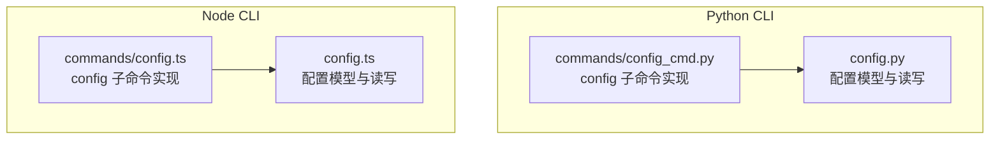
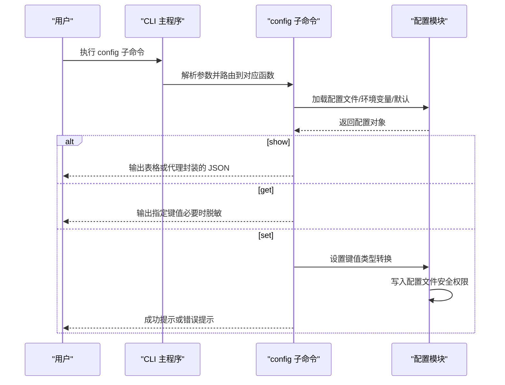
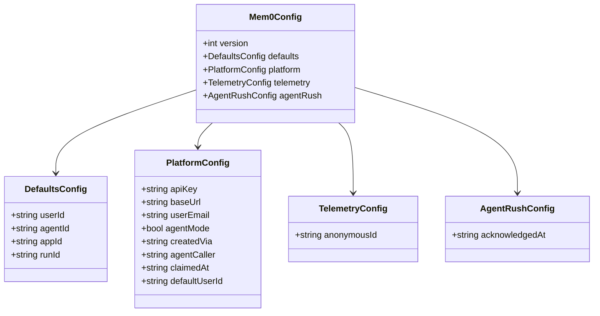
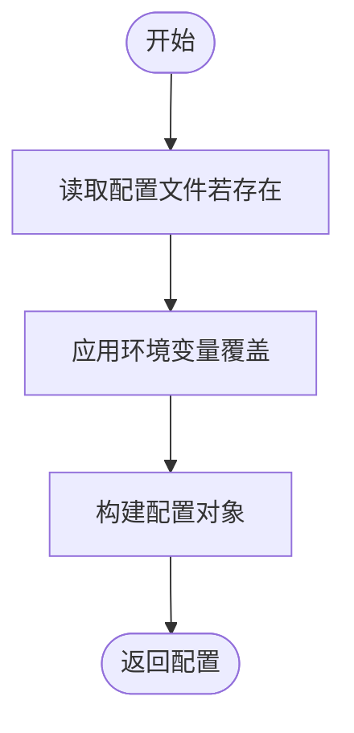
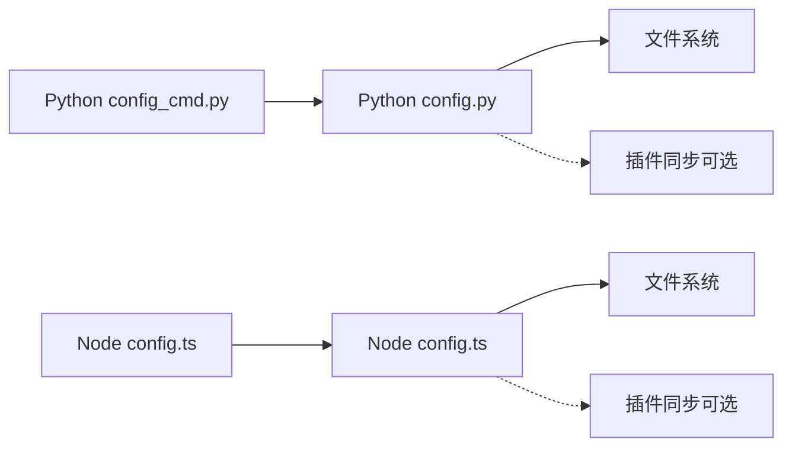

# 配置命令（config）

<cite>
**本文引用的文件**
- [cli/python/src/mem0_cli/commands/config_cmd.py](file://cli/python/src/mem0_cli/commands/config_cmd.py)
- [cli/python/src/mem0_cli/config.py](file://cli/python/src/mem0_cli/config.py)
- [cli/node/src/commands/config.ts](file://cli/node/src/commands/config.ts)
- [cli/node/src/config.ts](file://cli/node/src/config.ts)
- [cli/node/tests/config.test.ts](file://cli/node/tests/config.test.ts)
- [cli/python/src/mem0_cli/app.py](file://cli/python/src/mem0_cli/app.py)
- [cli/node/src/index.ts](file://cli/node/src/index.ts)
</cite>

## 目录
1. [简介](#简介)
2. [项目结构](#项目结构)
3. [核心组件](#核心组件)
4. [架构总览](#架构总览)
5. [详细组件分析](#详细组件分析)
6. [依赖关系分析](#依赖关系分析)
7. [性能考虑](#性能考虑)
8. [故障排查指南](#故障排查指南)
9. [结论](#结论)
10. [附录：命令与用法示例](#附录命令与用法示例)

## 简介
本指南面向使用 mem0 CLI 的用户与开发者，系统讲解 config 配置命令的功能、参数、使用场景与工作机制。内容涵盖：
- 配置项的读取、设置与管理流程
- 配置文件的存储位置与格式规范
- 配置优先级与环境变量覆盖规则
- 安全性与错误处理策略
- 完整的命令行示例与最佳实践

## 项目结构
本仓库同时提供 Python 与 Node 两套 CLI 实现，二者在功能上保持一致，均支持 config 子命令的 show、get、set 操作。

图表来源
- [cli/python/src/mem0_cli/commands/config_cmd.py:1-128](file://cli/python/src/mem0_cli/commands/config_cmd.py#L1-L128)
- [cli/python/src/mem0_cli/config.py:1-242](file://cli/python/src/mem0_cli/config.py#L1-L242)
- [cli/node/src/commands/config.ts:1-110](file://cli/node/src/commands/config.ts#L1-L110)
- [cli/node/src/config.ts:1-233](file://cli/node/src/config.ts#L1-L233)

章节来源
- [cli/python/src/mem0_cli/commands/config_cmd.py:1-128](file://cli/python/src/mem0_cli/commands/config_cmd.py#L1-L128)
- [cli/python/src/mem0_cli/config.py:1-242](file://cli/python/src/mem0_cli/config.py#L1-L242)
- [cli/node/src/commands/config.ts:1-110](file://cli/node/src/commands/config.ts#L1-L110)
- [cli/node/src/config.ts:1-233](file://cli/node/src/config.ts#L1-L233)

## 核心组件
- 配置数据模型
  - Python 版本使用 dataclass 表达配置结构；Node 版本使用 TypeScript 接口表达相同结构。
  - 关键字段包括：平台配置（API Key、Base URL、邮箱、Agent Mode 等）、默认标识（user_id、agent_id、app_id、run_id）、遥测匿名 ID、Agent Rush 认可时间戳等。
- 配置读取与持久化
  - 从文件加载、环境变量覆盖、默认值回退，最终形成运行时配置对象。
  - 写入时确保目录安全权限与文件安全权限，避免敏感信息泄露。
- 配置访问工具
  - 支持点式路径访问与短名别名映射，便于命令行操作。
  - 提供密钥脱敏显示能力，保护 API Key 等敏感信息。

章节来源
- [cli/python/src/mem0_cli/config.py:26-68](file://cli/python/src/mem0_cli/config.py#L26-L68)
- [cli/node/src/config.ts:20-55](file://cli/node/src/config.ts#L20-L55)
- [cli/python/src/mem0_cli/config.py:205-242](file://cli/python/src/mem0_cli/config.py#L205-L242)
- [cli/node/src/config.ts:187-232](file://cli/node/src/config.ts#L187-L232)

## 架构总览
下图展示 Python 与 Node 两端的 config 命令调用链路与配置读写流程。

图表来源
- [cli/python/src/mem0_cli/commands/config_cmd.py:21-128](file://cli/python/src/mem0_cli/commands/config_cmd.py#L21-L128)
- [cli/python/src/mem0_cli/config.py:88-144](file://cli/python/src/mem0_cli/config.py#L88-L144)
- [cli/node/src/commands/config.ts:19-110](file://cli/node/src/commands/config.ts#L19-L110)
- [cli/node/src/config.ts:90-132](file://cli/node/src/config.ts#L90-L132)

## 详细组件分析

### Python 实现概览
- 命令入口
  - show/get/set 分别对应三个函数，统一设置当前命令状态并进行输出封装。
- 配置读取
  - 从 JSON 文件加载，随后应用环境变量覆盖，最后返回配置对象。
- 配置写入
  - 将内存中的配置序列化为 JSON 并落盘，设置安全权限；同时尝试同步插件生态中的 API Key。
- 键访问与类型转换
  - 支持短名别名与点式路径；根据目标字段类型进行布尔/整数转换。

章节来源
- [cli/python/src/mem0_cli/commands/config_cmd.py:21-128](file://cli/python/src/mem0_cli/commands/config_cmd.py#L21-L128)
- [cli/python/src/mem0_cli/config.py:88-144](file://cli/python/src/mem0_cli/config.py#L88-L144)
- [cli/python/src/mem0_cli/config.py:147-194](file://cli/python/src/mem0_cli/config.py#L147-L194)
- [cli/python/src/mem0_cli/config.py:205-242](file://cli/python/src/mem0_cli/config.py#L205-L242)

### Node 实现概览
- 命令入口
  - 与 Python 版本一一对应，支持输出模式切换（文本/JSON/代理）。
- 配置读取与写入
  - 逻辑与 Python 版本一致，同样处理环境变量覆盖与安全权限。
- 键访问与类型转换
  - 使用 KEY_MAP 映射点式路径到对象字段，支持布尔/整数类型转换。

章节来源
- [cli/node/src/commands/config.ts:19-110](file://cli/node/src/commands/config.ts#L19-L110)
- [cli/node/src/config.ts:90-132](file://cli/node/src/config.ts#L90-L132)
- [cli/node/src/config.ts:134-179](file://cli/node/src/config.ts#L134-L179)
- [cli/node/src/config.ts:187-232](file://cli/node/src/config.ts#L187-L232)

### 类与数据模型

图表来源
- [cli/python/src/mem0_cli/config.py:26-68](file://cli/python/src/mem0_cli/config.py#L26-L68)
- [cli/node/src/config.ts:20-55](file://cli/node/src/config.ts#L20-L55)

章节来源
- [cli/python/src/mem0_cli/config.py:26-68](file://cli/python/src/mem0_cli/config.py#L26-L68)
- [cli/node/src/config.ts:20-55](file://cli/node/src/config.ts#L20-L55)

### 配置读取与覆盖流程

图表来源
- [cli/python/src/mem0_cli/config.py:88-144](file://cli/python/src/mem0_cli/config.py#L88-L144)
- [cli/node/src/config.ts:90-132](file://cli/node/src/config.ts#L90-L132)

章节来源
- [cli/python/src/mem0_cli/config.py:88-144](file://cli/python/src/mem0_cli/config.py#L88-L144)
- [cli/node/src/config.ts:90-132](file://cli/node/src/config.ts#L90-L132)

### 配置写入与安全
- 写入前确保目录与文件具备安全权限（仅当前用户可读写）。
- 写入后尝试同步 API Key 到插件生态，失败不阻断主流程。
- 脱敏显示策略：对包含“api_key”或以“key”结尾的键进行脱敏。

章节来源
- [cli/python/src/mem0_cli/config.py:147-194](file://cli/python/src/mem0_cli/config.py#L147-L194)
- [cli/node/src/config.ts:134-179](file://cli/node/src/config.ts#L134-L179)
- [cli/python/src/mem0_cli/commands/config_cmd.py:19-15](file://cli/python/src/mem0_cli/commands/config_cmd.py#L19-L15)
- [cli/node/src/commands/config.ts:6-13](file://cli/node/src/commands/config.ts#L6-L13)

## 依赖关系分析
- 命令与配置模块的耦合
  - config 子命令直接依赖配置模块提供的加载、保存、键访问与类型转换能力。
- 外部依赖
  - Python 端依赖 rich 进行富文本输出；Node 端依赖 cli-table3。
- 插件生态集成
  - 写入配置后尝试同步 API Key 到插件生态，属于可选增强功能，不影响配置文件权威性。

图表来源
- [cli/python/src/mem0_cli/commands/config_cmd.py:8-15](file://cli/python/src/mem0_cli/commands/config_cmd.py#L8-L15)
- [cli/python/src/mem0_cli/config.py:187-193](file://cli/python/src/mem0_cli/config.py#L187-L193)
- [cli/node/src/commands/config.ts:7-13](file://cli/node/src/commands/config.ts#L7-L13)
- [cli/node/src/config.ts:170-178](file://cli/node/src/config.ts#L170-L178)

章节来源
- [cli/python/src/mem0_cli/commands/config_cmd.py:8-15](file://cli/python/src/mem0_cli/commands/config_cmd.py#L8-L15)
- [cli/python/src/mem0_cli/config.py:187-193](file://cli/python/src/mem0_cli/config.py#L187-L193)
- [cli/node/src/commands/config.ts:7-13](file://cli/node/src/commands/config.ts#L7-L13)
- [cli/node/src/config.ts:170-178](file://cli/node/src/config.ts#L170-L178)

## 性能考虑
- 配置读取为轻量级 JSON 解析与少量字段赋值，开销极低。
- 写入采用原子写（先写临时再覆盖），但当前实现为直接写入文件，建议在高并发场景下避免同时多进程写同一配置文件。
- 脱敏与类型转换均为常量时间操作，对整体性能影响可忽略。

## 故障排查指南
- 未知配置键
  - 当使用 get 或 set 指定不存在的键时，命令会报告“未知配置键”，请检查键名是否正确或是否为短名别名。
- 权限问题
  - 若出现无法写入配置文件，请检查家目录下的 .mem0 目录与 config.json 的权限，确保仅当前用户可读写。
- 环境变量覆盖未生效
  - 确认环境变量名称拼写正确且已在当前 shell 会话中导出；注意大小写与命名空间。
- 插件同步失败
  - 写入成功但插件生态未更新属可接受行为，不影响配置文件权威性；可稍后手动刷新或重启相关工具。

章节来源
- [cli/python/src/mem0_cli/commands/config_cmd.py:94-96](file://cli/python/src/mem0_cli/commands/config_cmd.py#L94-L96)
- [cli/node/src/commands/config.ts:73-75](file://cli/node/src/commands/config.ts#L73-L75)
- [cli/python/src/mem0_cli/config.py:187-193](file://cli/python/src/mem0_cli/config.py#L187-L193)
- [cli/node/src/config.ts:170-178](file://cli/node/src/config.ts#L170-L178)

## 结论
mem0 CLI 的 config 命令提供了简洁一致的配置管理体验，支持查看、查询与设置配置项，并通过严格的优先级与安全策略保障稳定性与安全性。建议在团队协作中约定统一的环境变量与配置文件维护方式，减少冲突与误操作。

## 附录：命令与用法示例
以下示例适用于 Python 与 Node 两端 CLI（命令形态一致）。请根据实际安装方式选择对应的可执行程序名称。

- 查看当前配置
  - 文本表格输出：mem0 config show
  - JSON 输出：mem0 config show --output json
  - 代理封装输出：mem0 config show --output agent
- 获取单个配置项
  - 获取平台 API Key：mem0 config get platform.api_key 或 mem0 config get api_key
  - 获取基础地址：mem0 config get platform.base_url 或 mem0 config get base_url
  - 获取默认用户 ID：mem0 config get defaults.user_id 或 mem0 config get user_id
- 设置配置项
  - 设置 API Key：mem0 config set platform.api_key <your_key>
  - 设置基础地址：mem0 config set platform.base_url https://api.mem0.ai
  - 设置默认用户 ID：mem0 config set defaults.user_id user_xxx
  - 设置布尔值：mem0 config set defaults.some_flag true
- 配置文件位置与格式
  - 存储位置：~/.mem0/config.json
  - 文件格式：JSON，包含 version、defaults、platform、telemetry、agent_rush 等字段
  - 示例结构要点：platform.api_key、platform.base_url、defaults.user_id、defaults.agent_id、defaults.app_id、defaults.run_id 等
- 环境变量覆盖
  - MEM0_API_KEY、MEM0_BASE_URL、MEM0_USER_ID、MEM0_AGENT_ID、MEM0_APP_ID、MEM0_RUN_ID
- 错误处理与提示
  - 未知键：命令会提示“未知配置键”
  - 权限不足：请检查 ~/.mem0 与 config.json 的权限
  - 插件同步失败：不影响配置文件写入，可后续重试

章节来源
- [cli/python/src/mem0_cli/commands/config_cmd.py:21-128](file://cli/python/src/mem0_cli/commands/config_cmd.py#L21-L128)
- [cli/node/src/commands/config.ts:19-110](file://cli/node/src/commands/config.ts#L19-L110)
- [cli/python/src/mem0_cli/config.py:19-24](file://cli/python/src/mem0_cli/config.py#L19-L24)
- [cli/node/src/config.ts:15-18](file://cli/node/src/config.ts#L15-L18)
- [cli/python/src/mem0_cli/config.py:119-143](file://cli/python/src/mem0_cli/config.py#L119-L143)
- [cli/node/src/config.ts:120-131](file://cli/node/src/config.ts#L120-L131)