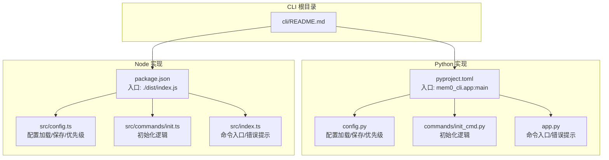
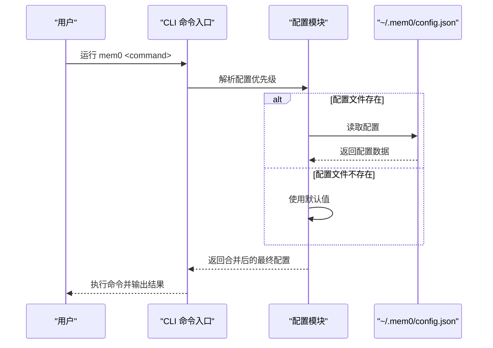
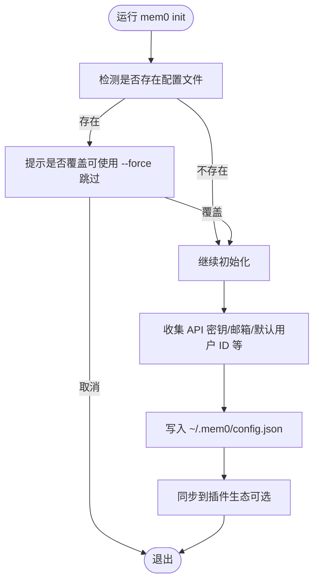
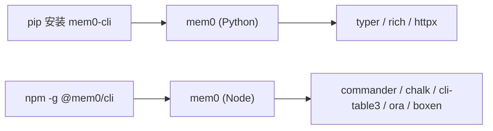

# 安装和配置

<cite>
**本文引用的文件**
- [cli/README.md](file://cli/README.md)
- [cli/python/README.md](file://cli/python/README.md)
- [cli/node/README.md](file://cli/node/README.md)
- [cli/python/pyproject.toml](file://cli/python/pyproject.toml)
- [cli/node/package.json](file://cli/node/package.json)
- [cli/python/src/mem0_cli/config.py](file://cli/python/src/mem0_cli/config.py)
- [cli/node/src/config.ts](file://cli/node/src/config.ts)
- [cli/python/src/mem0_cli/commands/init_cmd.py](file://cli/python/src/mem0_cli/commands/init_cmd.py)
- [cli/node/src/commands/init.ts](file://cli/node/src/commands/init.ts)
- [cli/python/src/mem0_cli/app.py](file://cli/python/src/mem0_cli/app.py)
- [cli/node/src/index.ts](file://cli/node/src/index.ts)
- [cli/python/src/mem0_cli/plugin_sync.py](file://cli/python/src/mem0_cli/plugin_sync.py)
- [cli/node/src/plugin-sync.ts](file://cli/node/src/plugin-sync.ts)
</cite>

## 目录
1. [简介](#简介)
2. [项目结构](#项目结构)
3. [核心组件](#核心组件)
4. [架构总览](#架构总览)
5. [详细组件分析](#详细组件分析)
6. [依赖关系分析](#依赖关系分析)
7. [性能考虑](#性能考虑)
8. [故障排查指南](#故障排查指南)
9. [结论](#结论)
10. [附录](#附录)

## 简介
本指南面向首次使用 mem0 CLI 的用户与运维人员，覆盖 Python 与 Node.js 双实现的安装、配置与验证流程。内容包括：
- Python 与 Node.js 版本要求与安装方式（pip 与 npm/pnpm）
- 环境变量配置（API 密钥、基础地址、默认作用域等）
- 配置文件创建与编辑（默认位置、字段含义、优先级）
- 不同操作系统下的注意事项与差异
- 安装验证与常见问题解决

## 项目结构
mem0 CLI 提供两套实现：Python 与 Node.js，二者行为一致，均通过全局可执行命令 mem0 使用。

图表来源
- [cli/README.md:1-137](file://cli/README.md#L1-L137)
- [cli/python/pyproject.toml:1-78](file://cli/python/pyproject.toml#L1-L78)
- [cli/node/package.json:1-59](file://cli/node/package.json#L1-L59)
- [cli/python/src/mem0_cli/config.py:1-242](file://cli/python/src/mem0_cli/config.py#L1-L242)
- [cli/node/src/config.ts:1-233](file://cli/node/src/config.ts#L1-L233)

章节来源
- [cli/README.md:1-137](file://cli/README.md#L1-L137)

## 核心组件
- 可执行命令：mem0（Python 与 Node 实现安装后均可用）
- 配置系统：本地配置文件 ~/.mem0/config.json，支持环境变量覆盖
- 初始化流程：交互式或非交互式设置 API 密钥与默认作用域
- 插件生态同步：在部分 IDE 插件中注入 MEM0_API_KEY

章节来源
- [cli/python/README.md:11-350](file://cli/python/README.md#L11-L350)
- [cli/node/README.md:12-338](file://cli/node/README.md#L12-L338)
- [cli/python/src/mem0_cli/config.py:1-242](file://cli/python/src/mem0_cli/config.py#L1-L242)
- [cli/node/src/config.ts:1-233](file://cli/node/src/config.ts#L1-L233)

## 架构总览
CLI 启动时按“命令行参数 > 环境变量 > 配置文件 > 默认值”的优先级解析配置；初始化命令会写入配置文件并尝试同步到插件生态。

图表来源
- [cli/python/src/mem0_cli/config.py:88-144](file://cli/python/src/mem0_cli/config.py#L88-L144)
- [cli/node/src/config.ts:90-132](file://cli/node/src/config.ts#L90-L132)

## 详细组件分析

### Python 安装与版本要求
- Python 版本：3.10 及以上
- 推荐安装方式：
  - 使用 pipx（隔离安装，推荐）
  - 使用 pip（需注意系统管理环境限制）
- 安装命令与注意事项见 Python README

章节来源
- [cli/python/README.md:7-26](file://cli/python/README.md#L7-L26)
- [cli/python/pyproject.toml:11](file://cli/python/pyproject.toml#L11)

### Node.js 安装与版本要求
- Node.js 版本：18 及以上
- 安装方式：npm 全局安装
- 开发建议：pnpm（开发时使用）

章节来源
- [cli/node/README.md:7-11](file://cli/node/README.md#L7-L11)
- [cli/node/package.json:18-20](file://cli/node/package.json#L18-L20)

### 配置文件与优先级
- 配置文件路径：~/.mem0/config.json
- 优先级（从高到低）：
  1) 命令行参数（如 --api-key、--base-url）
  2) 环境变量（MEM0_API_KEY、MEM0_BASE_URL 等）
  3) 配置文件（~/.mem0/config.json）
  4) 默认值
- 支持的关键字段（节选）：
  - 平台配置（platform）：api_key、base_url、user_email、agent_mode、default_user_id 等
  - 默认作用域（defaults）：user_id、agent_id、app_id、run_id
  - 遥测（telemetry）、Agent Rush（agent_rush）

章节来源
- [cli/python/src/mem0_cli/config.py:3-8](file://cli/python/src/mem0_cli/config.py#L3-L8)
- [cli/python/src/mem0_cli/config.py:26-68](file://cli/python/src/mem0_cli/config.py#L26-L68)
- [cli/node/src/config.ts:4-9](file://cli/node/src/config.ts#L4-L9)
- [cli/node/src/config.ts:20-55](file://cli/node/src/config.ts#L20-L55)

### 环境变量配置
- 常用变量（以 Python 实现为例）：
  - MEM0_API_KEY：API 密钥
  - MEM0_BASE_URL：API 基础地址
  - MEM0_USER_ID、MEM0_AGENT_ID、MEM0_APP_ID、MEM0_RUN_ID：默认作用域
  - MEM0_ENABLE_GRAPH：是否启用图谱记忆
- 优先级高于配置文件，低于命令行参数

章节来源
- [cli/python/README.md:310-322](file://cli/python/README.md#L310-L322)
- [cli/node/README.md:301-313](file://cli/node/README.md#L301-L313)
- [cli/python/src/mem0_cli/config.py:119-143](file://cli/python/src/mem0_cli/config.py#L119-L143)
- [cli/node/src/config.ts:120-131](file://cli/node/src/config.ts#L120-L131)

### 初始化与配置文件创建
- 初始化命令：mem0 init
- 支持交互式与非交互式（传入 --api-key 或 --email）
- 若检测到现有配置，会询问是否覆盖；CI 场景可用 --force 跳过确认
- 初始化流程会写入 ~/.mem0/config.json，并尝试同步到插件生态

图表来源
- [cli/python/src/mem0_cli/commands/init_cmd.py:243](file://cli/python/src/mem0_cli/commands/init_cmd.py#L243)
- [cli/node/src/commands/init.ts:338](file://cli/node/src/commands/init.ts#L338)
- [cli/python/src/mem0_cli/config.py:147-194](file://cli/python/src/mem0_cli/config.py#L147-L194)
- [cli/node/src/config.ts:134-179](file://cli/node/src/config.ts#L134-L179)

章节来源
- [cli/python/README.md:60-74](file://cli/python/README.md#L60-L74)
- [cli/node/README.md:51-65](file://cli/node/README.md#L51-L65)

### 插件生态同步（API 密钥）
- Python 实现：在保存配置时尝试同步 MEM0_API_KEY 到插件生态（如 Claude Code 插件）
- Node 实现：同样在保存配置时进行同步

章节来源
- [cli/python/src/mem0_cli/plugin_sync.py:1-20](file://cli/python/src/mem0_cli/plugin_sync.py#L1-L20)
- [cli/node/src/plugin-sync.ts:1-80](file://cli/node/src/plugin-sync.ts#L1-L80)
- [cli/python/src/mem0_cli/config.py:187-193](file://cli/python/src/mem0_cli/config.py#L187-L193)
- [cli/node/src/config.ts:170-178](file://cli/node/src/config.ts#L170-L178)

### 命令入口与错误提示
- Python：命令入口位于 mem0_cli.app，未配置 API 密钥时会提示运行 mem0 init 或设置 MEM0_API_KEY
- Node：命令入口位于 src/index.ts，同样在缺少密钥时给出提示

章节来源
- [cli/python/src/mem0_cli/app.py:125](file://cli/python/src/mem0_cli/app.py#L125)
- [cli/python/src/mem0_cli/app.py:145](file://cli/python/src/mem0_cli/app.py#L145)
- [cli/node/src/index.ts:44](file://cli/node/src/index.ts#L44)
- [cli/node/src/index.ts:76](file://cli/node/src/index.ts#L76)

## 依赖关系分析
- Python 实现依赖 typer、rich、httpx 等库，入口为 mem0_cli.app:main
- Node 实现依赖 commander、chalk、cli-table3、ora、boxen 等库，入口为 dist/index.js
- 两者均通过全局安装提供相同的 mem0 命令

图表来源
- [cli/python/pyproject.toml:27-31](file://cli/python/pyproject.toml#L27-L31)
- [cli/node/package.json:32-38](file://cli/node/package.json#L32-L38)

章节来源
- [cli/python/pyproject.toml:1-78](file://cli/python/pyproject.toml#L1-L78)
- [cli/node/package.json:1-59](file://cli/node/package.json#L1-L59)

## 性能考虑
- 配置加载为轻量级 JSON 文件读取，开销极小
- 环境变量覆盖发生在内存中，无额外 IO
- 建议在 CI 中通过环境变量直接注入配置，避免磁盘写入

## 故障排查指南
- macOS Homebrew Python 环境下使用 pip 安装失败
  - 现象：PEP 668 外部管理环境限制导致安装失败
  - 解决：改用 pipx 安装，或在虚拟环境中使用 pip
  - 参考：Python README 中的相关说明
- 未设置 API 密钥导致命令失败
  - 现象：命令入口提示运行 mem0 init 或设置 MEM0_API_KEY
  - 解决：运行 mem0 init，或设置 MEM0_API_KEY 环境变量
- 配置文件权限问题
  - 现象：配置文件权限不正确导致读写异常
  - 解决：确保 ~/.mem0/config.json 权限为 0600，目录权限为 0700
- Node.js 版本过低
  - 现象：安装或运行时报 Node 版本不兼容
  - 解决：升级至 Node.js 18+

章节来源
- [cli/python/README.md:25](file://cli/python/README.md#L25)
- [cli/python/src/mem0_cli/app.py:125](file://cli/python/src/mem0_cli/app.py#L125)
- [cli/python/src/mem0_cli/app.py:145](file://cli/python/src/mem0_cli/app.py#L145)
- [cli/node/src/index.ts:44](file://cli/node/src/index.ts#L44)
- [cli/node/src/index.ts:76](file://cli/node/src/index.ts#L76)
- [cli/python/src/mem0_cli/config.py:81-85](file://cli/python/src/mem0_cli/config.py#L81-L85)
- [cli/python/src/mem0_cli/config.py:180](file://cli/python/src/mem0_cli/config.py#L180)
- [cli/node/src/config.ts:85-88](file://cli/node/src/config.ts#L85-L88)
- [cli/node/src/config.ts:163-164](file://cli/node/src/config.ts#L163-L164)

## 结论
- 选择 Python 或 Node.js 实现均可获得一致的 CLI 行为
- 通过环境变量与配置文件灵活控制 API 密钥与默认作用域
- 初始化流程简单可靠，支持交互与非交互两种模式
- 在多平台部署时，注意版本要求与权限设置

## 附录

### 快速安装与验证清单
- Python
  - 安装：pipx install mem0-cli 或 pip install mem0-cli
  - 验证：mem0 --help
- Node.js
  - 安装：npm install -g @mem0/cli
  - 验证：mem0 --help
- 初始化
  - mem0 init（交互式）或 mem0 init --api-key <your_key>
- 验证连接
  - mem0 status

章节来源
- [cli/README.md:7-45](file://cli/README.md#L7-L45)
- [cli/python/README.md:11-56](file://cli/python/README.md#L11-L56)
- [cli/node/README.md:12-47](file://cli/node/README.md#L12-L47)