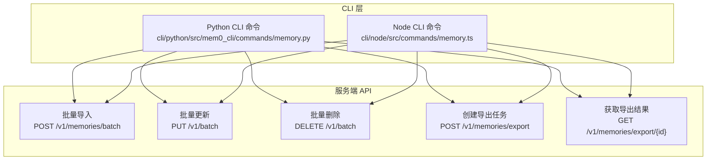
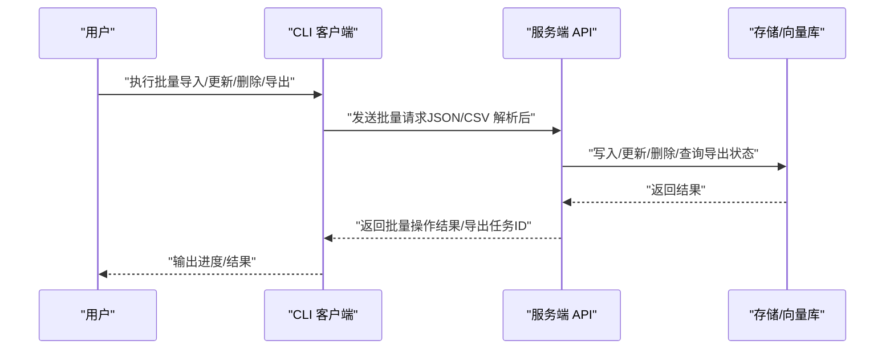
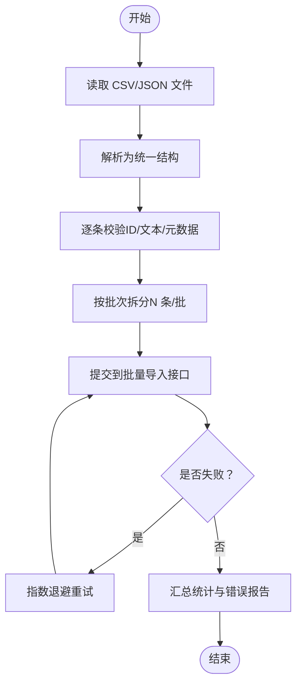
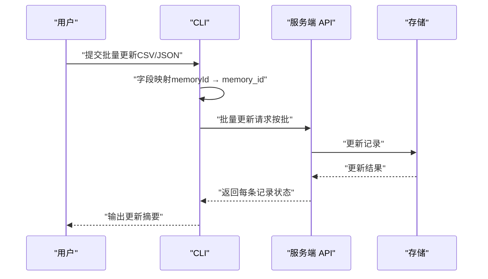
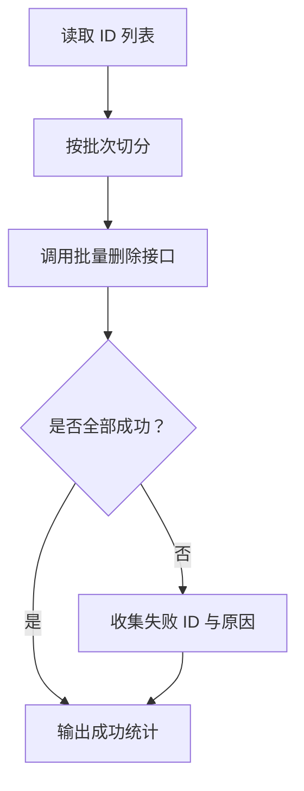
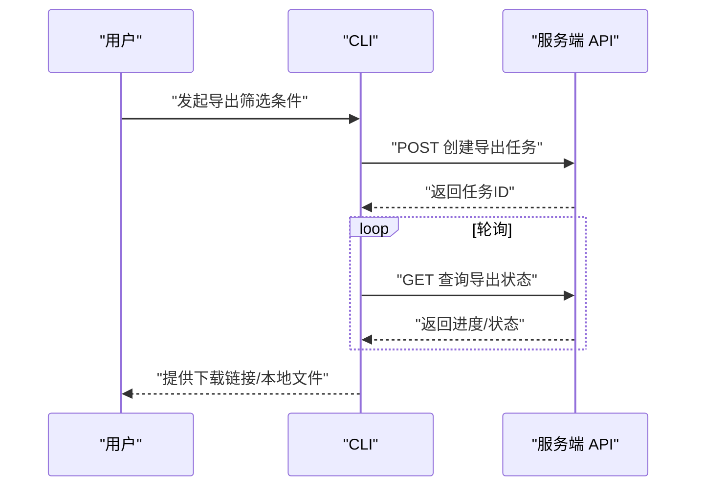
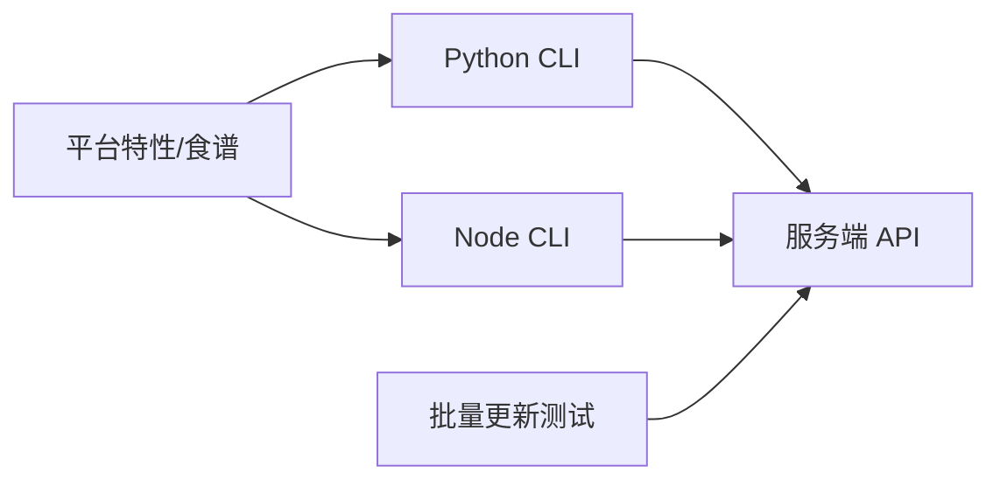

# 批量操作

<cite>
**本文引用的文件**
- [cli/python/src/mem0_cli/commands/memory.py](file://cli/python/src/mem0_cli/commands/memory.py)
- [cli/node/src/commands/memory.ts](file://cli/node/src/commands/memory.ts)
- [mem0-ts/src/client/tests/memoryClient.batch.test.ts](file://mem0-ts/src/client/tests/memoryClient.batch.test.ts)
- [docs/api-reference/memory/add-memories.mdx](file://docs/api-reference/memory/add-memories.mdx)
- [docs/api-reference/memory/batch-update.mdx](file://docs/api-reference/memory/batch-update.mdx)
- [docs/api-reference/memory/batch-delete.mdx](file://docs/api-reference/memory/batch-delete.mdx)
- [docs/api-reference/memory/create-memory-export.mdx](file://docs/api-reference/memory/create-memory-export.mdx)
- [docs/api-reference/memory/get-memory-export.mdx](file://docs/api-reference/memory/get-memory-export.mdx)
- [docs/platform/features/memory-export.mdx](file://docs/platform/features/memory-export.mdx)
- [docs/cookbooks/essentials/exporting-memories.mdx](file://docs/cookbooks/essentials/exporting-memories.mdx)
- [docs/platform/advanced-memory-operations.mdx](file://docs/platform/advanced-memory-operations.mdx)
</cite>

## 目录
1. [简介](#简介)
2. [项目结构](#项目结构)
3. [核心组件](#核心组件)
4. [架构总览](#架构总览)
5. [详细组件分析](#详细组件分析)
6. [依赖关系分析](#依赖关系分析)
7. [性能考量](#性能考量)
8. [故障排查指南](#故障排查指南)
9. [结论](#结论)
10. [附录](#附录)

## 简介
本指南面向需要通过 CLI 对记忆（Memory）进行批量操作的用户，涵盖批量导入、批量导出与批量更新的完整流程，并提供 CSV 与 JSON 两种格式的数据处理示例思路、性能优化策略、错误处理机制以及大数据集处理的最佳实践。同时给出批处理脚本编写与调度建议，帮助你在生产环境中稳定高效地运行批量任务。

## 项目结构
围绕批量操作的关键位置如下：
- Python CLI 命令入口位于：cli/python/src/mem0_cli/commands/memory.py
- Node CLI 命令入口位于：cli/node/src/commands/memory.ts
- 批量更新/删除的客户端测试位于：mem0-ts/src/client/tests/memoryClient.batch.test.ts
- API 参考文档（批量导入、批量更新、批量删除、导出、获取导出）位于 docs/api-reference/memory/* 与 docs/platform/features/memory-export.mdx、docs/cookbooks/essentials/exporting-memories.mdx

图表来源
- [cli/python/src/mem0_cli/commands/memory.py](file://cli/python/src/mem0_cli/commands/memory.py)
- [cli/node/src/commands/memory.ts](file://cli/node/src/commands/memory.ts)
- [docs/api-reference/memory/add-memories.mdx](file://docs/api-reference/memory/add-memories.mdx)
- [docs/api-reference/memory/batch-update.mdx](file://docs/api-reference/memory/batch-update.mdx)
- [docs/api-reference/memory/batch-delete.mdx](file://docs/api-reference/memory/batch-delete.mdx)
- [docs/api-reference/memory/create-memory-export.mdx](file://docs/api-reference/memory/create-memory-export.mdx)
- [docs/api-reference/memory/get-memory-export.mdx](file://docs/api-reference/memory/get-memory-export.mdx)

章节来源
- [cli/python/src/mem0_cli/commands/memory.py](file://cli/python/src/mem0_cli/commands/memory.py)
- [cli/node/src/commands/memory.ts](file://cli/node/src/commands/memory.ts)

## 核心组件
- 批量导入（Add Memories Batch）
  - 功能：一次提交多条记忆记录，支持批量写入。
  - 入口：Python CLI 的批量导入命令；Node CLI 的对应命令。
  - 参考：API 文档“批量导入”。
- 批量更新（Batch Update）
  - 功能：对已存在的多条记忆进行批量更新，字段映射（如 memoryId → memory_id）由客户端自动处理。
  - 入口：Python/Node CLI 的批量更新命令。
  - 参考：API 文档“批量更新”；客户端测试覆盖了请求体转换逻辑。
- 批量删除（Batch Delete）
  - 功能：根据 ID 列表批量删除记忆。
  - 入口：Python/Node CLI 的批量删除命令。
  - 参考：API 文档“批量删除”。
- 导出与获取导出（Export & Get Export）
  - 功能：触发后台异步导出任务，随后轮询或查询导出结果。
  - 入口：Python/Node CLI 的导出相关命令。
  - 参考：API 文档“创建导出”、“获取导出”；平台特性与食谱中提供了导出示例与最佳实践。

章节来源
- [docs/api-reference/memory/add-memories.mdx](file://docs/api-reference/memory/add-memories.mdx)
- [docs/api-reference/memory/batch-update.mdx](file://docs/api-reference/memory/batch-update.mdx)
- [docs/api-reference/memory/batch-delete.mdx](file://docs/api-reference/memory/batch-delete.mdx)
- [docs/api-reference/memory/create-memory-export.mdx](file://docs/api-reference/memory/create-memory-export.mdx)
- [docs/api-reference/memory/get-memory-export.mdx](file://docs/api-reference/memory/get-memory-export.mdx)
- [mem0-ts/src/client/tests/memoryClient.batch.test.ts](file://mem0-ts/src/client/tests/memoryClient.batch.test.ts)

## 架构总览
下图展示了从 CLI 到服务端 API 的调用链路，以及批量操作在系统中的位置：

图表来源
- [cli/python/src/mem0_cli/commands/memory.py](file://cli/python/src/mem0_cli/commands/memory.py)
- [cli/node/src/commands/memory.ts](file://cli/node/src/commands/memory.ts)
- [docs/api-reference/memory/add-memories.mdx](file://docs/api-reference/memory/add-memories.mdx)
- [docs/api-reference/memory/batch-update.mdx](file://docs/api-reference/memory/batch-update.mdx)
- [docs/api-reference/memory/batch-delete.mdx](file://docs/api-reference/memory/batch-delete.mdx)
- [docs/api-reference/memory/create-memory-export.mdx](file://docs/api-reference/memory/create-memory-export.mdx)
- [docs/api-reference/memory/get-memory-export.mdx](file://docs/api-reference/memory/get-memory-export.mdx)

## 详细组件分析

### 批量导入（CSV/JSON）
- 数据准备
  - CSV：建议包含唯一标识列（如 memory_id）、文本内容列（text）、元数据列（metadata，可选）。确保列名与服务端期望一致。
  - JSON：数组对象，每个对象代表一条记忆记录，字段包含但不限于 id/text/metadata。
- 处理流程
  - CLI 读取文件，按行/元素解析为统一结构。
  - 转换为批量导入请求体，调用“批量导入”接口。
  - 输出成功/失败统计与错误明细。
- 错误处理
  - 单条记录校验失败不影响其他记录（批量语义），但需记录并报告。
  - 超时、网络异常需重试与退避策略。
- 性能优化
  - 分批提交（例如每批 100~1000 条），避免单次请求过大。
  - 并发控制（线程/进程池大小限制），避免资源耗尽。
  - 预先清洗数据（去重、长度截断、编码规范化）。

图表来源
- [cli/python/src/mem0_cli/commands/memory.py](file://cli/python/src/mem0_cli/commands/memory.py)
- [docs/api-reference/memory/add-memories.mdx](file://docs/api-reference/memory/add-memories.mdx)

章节来源
- [cli/python/src/mem0_cli/commands/memory.py](file://cli/python/src/mem0_cli/commands/memory.py)
- [docs/api-reference/memory/add-memories.mdx](file://docs/api-reference/memory/add-memories.mdx)

### 批量更新（CSV/JSON）
- 数据准备
  - CSV/JSON 至少包含更新目标的唯一标识（如 memoryId 或 memory_id）与待更新字段（如 text、metadata）。
- 处理流程
  - CLI 将 memoryId 自动转换为 memory_id（客户端测试覆盖该行为）。
  - 按批次提交到“批量更新”接口。
  - 记录每条记录的更新结果与错误原因。
- 错误处理
  - 未找到 ID、字段类型不匹配等错误需单独上报。
  - 支持幂等更新（重复提交相同变更应保持一致）。
- 性能优化
  - 合理批次大小与并发度。
  - 使用索引优化（若底层存储支持）。

图表来源
- [cli/node/src/commands/memory.ts](file://cli/node/src/commands/memory.ts)
- [mem0-ts/src/client/tests/memoryClient.batch.test.ts](file://mem0-ts/src/client/tests/memoryClient.batch.test.ts)
- [docs/api-reference/memory/batch-update.mdx](file://docs/api-reference/memory/batch-update.mdx)

章节来源
- [cli/node/src/commands/memory.ts](file://cli/node/src/commands/memory.ts)
- [mem0-ts/src/client/tests/memoryClient.batch.test.ts](file://mem0-ts/src/client/tests/memoryClient.batch.test.ts)
- [docs/api-reference/memory/batch-update.mdx](file://docs/api-reference/memory/batch-update.mdx)

### 批量删除（CSV/JSON）
- 数据准备
  - CSV/JSON 提供要删除的记忆 ID 列表。
- 处理流程
  - CLI 读取 ID 列表，按批次调用“批量删除”接口。
  - 统计删除成功数、失败数与失败原因。
- 错误处理
  - 不存在的 ID 应被忽略或单独标记。
  - 删除权限不足、系统保护规则等情况需明确提示。

图表来源
- [cli/python/src/mem0_cli/commands/memory.py](file://cli/python/src/mem0_cli/commands/memory.py)
- [docs/api-reference/memory/batch-delete.mdx](file://docs/api-reference/memory/batch-delete.mdx)

章节来源
- [cli/python/src/mem0_cli/commands/memory.py](file://cli/python/src/mem0_cli/commands/memory.py)
- [docs/api-reference/memory/batch-delete.mdx](file://docs/api-reference/memory/batch-delete.mdx)

### 批量导出（CSV/JSON）
- 触发导出
  - CLI 调用“创建导出任务”接口，传入筛选条件（时间范围、标签、用户等）。
- 获取导出
  - 使用“获取导出结果”接口轮询任务状态，完成后下载导出文件。
- 格式选择
  - CSV：适合表格化浏览与二次处理。
  - JSON：保留嵌套结构与原始字段类型，便于程序化消费。
- 最佳实践
  - 大数据集建议分页/分段导出，避免单文件过大。
  - 导出前进行数据脱敏与合规检查。

图表来源
- [cli/node/src/commands/memory.ts](file://cli/node/src/commands/memory.ts)
- [docs/api-reference/memory/create-memory-export.mdx](file://docs/api-reference/memory/create-memory-export.mdx)
- [docs/api-reference/memory/get-memory-export.mdx](file://docs/api-reference/memory/get-memory-export.mdx)
- [docs/platform/features/memory-export.mdx](file://docs/platform/features/memory-export.mdx)
- [docs/cookbooks/essentials/exporting-memories.mdx](file://docs/cookbooks/essentials/exporting-memories.mdx)

章节来源
- [cli/node/src/commands/memory.ts](file://cli/node/src/commands/memory.ts)
- [docs/api-reference/memory/create-memory-export.mdx](file://docs/api-reference/memory/create-memory-export.mdx)
- [docs/api-reference/memory/get-memory-export.mdx](file://docs/api-reference/memory/get-memory-export.mdx)
- [docs/platform/features/memory-export.mdx](file://docs/platform/features/memory-export.mdx)
- [docs/cookbooks/essentials/exporting-memories.mdx](file://docs/cookbooks/essentials/exporting-memories.mdx)

## 依赖关系分析
- CLI 与服务端 API 的耦合点
  - 批量导入/更新/删除/导出均通过标准 HTTP 接口访问，CLI 仅负责数据格式化与传输。
- 客户端测试对批量更新的约束
  - 测试覆盖了字段映射（memoryId → memory_id）与请求方法（PUT），确保客户端与服务端契约一致。
- 平台特性与食谱
  - 平台特性文档与食谱提供了导出场景下的参数、权限与合规建议，有助于批量导出的落地实施。

图表来源
- [cli/python/src/mem0_cli/commands/memory.py](file://cli/python/src/mem0_cli/commands/memory.py)
- [cli/node/src/commands/memory.ts](file://cli/node/src/commands/memory.ts)
- [mem0-ts/src/client/tests/memoryClient.batch.test.ts](file://mem0-ts/src/client/tests/memoryClient.batch.test.ts)
- [docs/platform/features/memory-export.mdx](file://docs/platform/features/memory-export.mdx)
- [docs/cookbooks/essentials/exporting-memories.mdx](file://docs/cookbooks/essentials/exporting-memories.mdx)

章节来源
- [cli/python/src/mem0_cli/commands/memory.py](file://cli/python/src/mem0_cli/commands/memory.py)
- [cli/node/src/commands/memory.ts](file://cli/node/src/commands/memory.ts)
- [mem0-ts/src/client/tests/memoryClient.batch.test.ts](file://mem0-ts/src/client/tests/memoryClient.batch.test.ts)
- [docs/platform/features/memory-export.mdx](file://docs/platform/features/memory-export.mdx)
- [docs/cookbooks/essentials/exporting-memories.mdx](file://docs/cookbooks/essentials/exporting-memories.mdx)

## 性能考量
- 批次大小与并发
  - 建议每批 100~1000 条，结合网络与服务端限流策略调整。
  - 并发度不超过 CPU/IO 能力上限，避免队列积压。
- 数据预处理
  - 去重、长度截断、编码规范化、缺失值填充，减少服务端校验开销。
- 导出优化
  - 分段导出（按时间/标签/用户），降低单次导出压力。
  - 优先使用压缩格式与流式下载，减少内存占用。
- 错误恢复
  - 失败重试采用指数退避，避免雪崩效应。
  - 断点续传：记录已成功的批次 ID，失败后从断点继续。

## 故障排查指南
- 常见错误类型
  - 字段不匹配：确认 memoryId 是否正确映射为 memory_id。
  - 权限不足：检查 API Key 作用域与项目权限。
  - 超时/网络抖动：启用重试与退避，必要时降低批次大小。
  - 导出任务长时间 pending：检查筛选条件是否过于宽泛或系统负载过高。
- 日志与诊断
  - CLI 输出详细的状态码与错误信息，结合服务端日志定位问题。
  - 对于导出任务，记录任务 ID 并定期轮询状态。
- 回滚与补偿
  - 批量更新/删除失败时，保留失败清单以便人工复核与补偿操作。
  - 导出失败时，缩小筛选范围重试或分时段导出。

章节来源
- [docs/platform/advanced-memory-operations.mdx](file://docs/platform/advanced-memory-operations.mdx)

## 结论
通过 CLI 实现批量导入、更新、删除与导出，能够显著提升大规模记忆数据管理效率。配合合理的批次大小、并发控制与错误处理策略，可在保证稳定性的同时获得良好吞吐。建议在生产环境引入自动化调度与监控告警，确保批处理任务的持续可靠运行。

## 附录
- 批处理脚本编写与调度
  - Shell/Python 脚本：封装 CLI 命令，设置参数（输入文件、批次大小、并发度、重试次数）。
  - 调度工具：使用 cron（Linux）或计划任务（Windows）定时执行；或使用 Airflow/Dagster 等编排工具。
  - 监控与告警：记录任务状态、失败率与耗时，异常时邮件/IM 通知。
- 大数据集处理最佳实践
  - 分治策略：按时间/用户/标签拆分任务，避免单次操作过大。
  - 增量处理：区分全量与增量，优先增量以减少对系统的冲击。
  - 资源预留：为高峰期预留额外带宽与计算资源，避免影响在线业务。