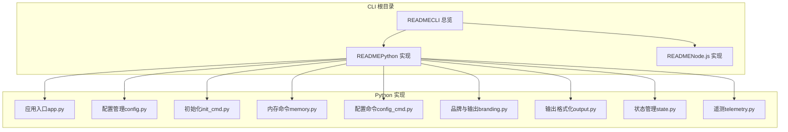
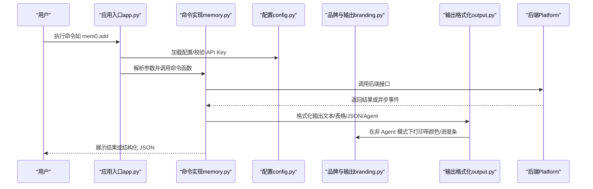
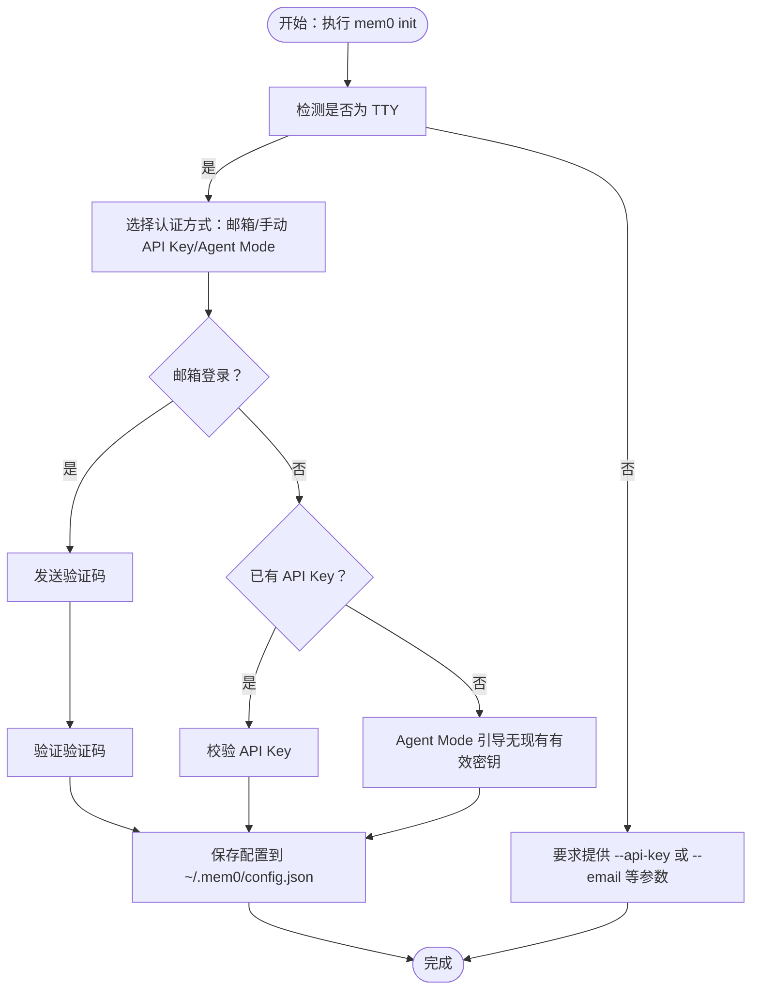
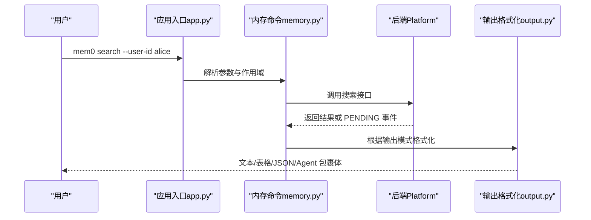
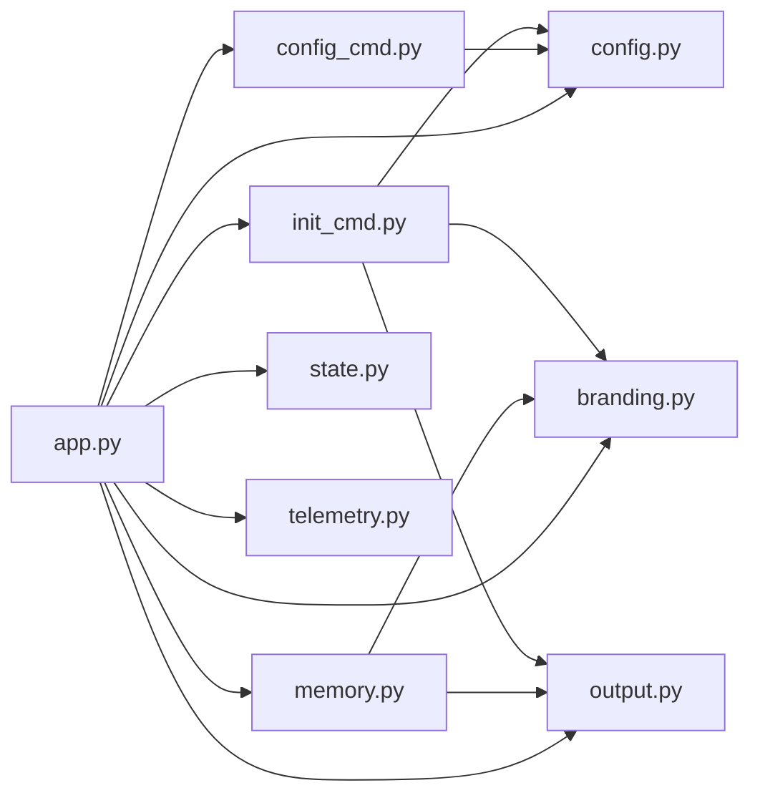

# 故障排除

<cite>
**本文引用的文件**
- [README（CLI 总览）](file://cli/README.md)
- [README（Python 实现）](file://cli/python/README.md)
- [README（Node.js 实现）](file://cli/node/README.md)
- [应用入口（Python）](file://cli/python/src/mem0_cli/app.py)
- [配置管理（Python）](file://cli/python/src/mem0_cli/config.py)
- [初始化流程（Python）](file://cli/python/src/mem0_cli/commands/init_cmd.py)
- [内存命令（Python）](file://cli/python/src/mem0_cli/commands/memory.py)
- [配置命令（Python）](file://cli/python/src/mem0_cli/commands/config_cmd.py)
- [品牌与输出（Python）](file://cli/python/src/mem0_cli/branding.py)
- [输出格式化（Python）](file://cli/python/src/mem0_cli/output.py)
- [状态管理（Python）](file://cli/python/src/mem0_cli/state.py)
- [遥测（Python）](file://cli/python/src/mem0_cli/telemetry.py)
</cite>

## 目录
1. [简介](#简介)
2. [项目结构](#项目结构)
3. [核心组件](#核心组件)
4. [架构总览](#架构总览)
5. [详细组件分析](#详细组件分析)
6. [依赖关系分析](#依赖关系分析)
7. [性能考虑](#性能考虑)
8. [故障排除指南](#故障排除指南)
9. [结论](#结论)
10. [附录](#附录)

## 简介
本指南面向使用 mem0 CLI 的用户与集成开发者，聚焦于常见问题的快速定位与解决路径。内容覆盖网络连接、权限与认证、配置错误、输出与调试、性能诊断以及社区支持渠道。文档基于仓库中的 CLI 源码与官方文档进行梳理，确保可操作性与准确性。

## 项目结构
CLI 提供 Python 与 Node.js 双实现，二者行为一致。Python 实现位于 cli/python，Node.js 实现位于 cli/node。核心模块包括：
- 应用入口：解析命令、全局选项与子命令注册
- 命令实现：内存增删改查、实体管理、事件查询、配置管理、初始化向导
- 配置管理：本地配置文件、环境变量覆盖、安全权限
- 输出与品牌：人类可读与机器可读输出、Agent 模式、错误封装
- 状态与遥测：Agent 模式开关、当前命令上下文、匿名遥测

图表来源
- [README（CLI 总览）](file://cli/README.md)
- [README（Python 实现）](file://cli/python/README.md)
- [README（Node.js 实现）](file://cli/node/README.md)
- [应用入口（Python）](file://cli/python/src/mem0_cli/app.py)
- [配置管理（Python）](file://cli/python/src/mem0_cli/config.py)
- [初始化流程（Python）](file://cli/python/src/mem0_cli/commands/init_cmd.py)
- [内存命令（Python）](file://cli/python/src/mem0_cli/commands/memory.py)
- [配置命令（Python）](file://cli/python/src/mem0_cli/commands/config_cmd.py)
- [品牌与输出（Python）](file://cli/python/src/mem0_cli/branding.py)
- [输出格式化（Python）](file://cli/python/src/mem0_cli/output.py)
- [状态管理（Python）](file://cli/python/src/mem0_cli/state.py)
- [遥测（Python）](file://cli/python/src/mem0_cli/telemetry.py)

章节来源
- [README（CLI 总览）](file://cli/README.md)
- [README（Python 实现）](file://cli/python/README.md)
- [README（Node.js 实现）](file://cli/node/README.md)

## 核心组件
- 全局回调与命令注册：在应用入口中定义全局选项（如 --json/--agent）、版本输出，并注册各子命令与分组。
- 后端与配置：通过 _get_backend_and_config 统一加载配置、校验 API Key 并建立后端连接；支持环境变量覆盖。
- 初始化向导：支持交互式与非交互式两种模式，覆盖邮箱验证码登录、已有 API Key 复用、Agent Mode 引导。
- 内存命令：add/search/list/get/update/delete，统一处理输入校验、异步事件去重、Agent 模式输出封装。
- 配置命令：config show/get/set，支持嵌套键访问与类型转换。
- 输出与品牌：文本/表格/JSON/安静模式；Agent 模式下屏蔽动画、仅输出结构化 JSON 包裹体。
- 状态与遥测：记录当前命令、Agent 模式标志位；发送匿名遥测事件。

章节来源
- [应用入口（Python）](file://cli/python/src/mem0_cli/app.py)
- [配置管理（Python）](file://cli/python/src/mem0_cli/config.py)
- [初始化流程（Python）](file://cli/python/src/mem0_cli/commands/init_cmd.py)
- [内存命令（Python）](file://cli/python/src/mem0_cli/commands/memory.py)
- [配置命令（Python）](file://cli/python/src/mem0_cli/commands/config_cmd.py)
- [品牌与输出（Python）](file://cli/python/src/mem0_cli/branding.py)
- [输出格式化（Python）](file://cli/python/src/mem0_cli/output.py)
- [状态管理（Python）](file://cli/python/src/mem0_cli/state.py)
- [遥测（Python）](file://cli/python/src/mem0_cli/telemetry.py)

## 架构总览
CLI 的调用链从应用入口开始，经由全局回调与命令解析，进入具体命令实现，再通过后端访问平台 API。错误在命令层捕获并按模式输出，Agent 模式下统一为 JSON 包裹体。

图表来源
- [应用入口（Python）](file://cli/python/src/mem0_cli/app.py)
- [内存命令（Python）](file://cli/python/src/mem0_cli/commands/memory.py)
- [配置管理（Python）](file://cli/python/src/mem0_cli/config.py)
- [品牌与输出（Python）](file://cli/python/src/mem0_cli/branding.py)
- [输出格式化（Python）](file://cli/python/src/mem0_cli/output.py)

## 详细组件分析

### 初始化流程（mem0 init）
- 支持三种认证路径：邮箱验证码登录、已有 API Key 复用、Agent Mode 引导。
- 非 TTY 环境要求显式传入必要参数，避免阻塞。
- 连接测试失败时给出明确提示与修复建议。

图表来源
- [初始化流程（Python）](file://cli/python/src/mem0_cli/commands/init_cmd.py)
- [配置管理（Python）](file://cli/python/src/mem0_cli/config.py)

章节来源
- [初始化流程（Python）](file://cli/python/src/mem0_cli/commands/init_cmd.py)
- [配置管理（Python）](file://cli/python/src/mem0_cli/config.py)

### 内存命令（add/search/list/get/update/delete）
- 输入校验：空查询、无效 JSON、过期日期格式、阈值范围等。
- 异步事件：对批量/后台任务返回的 PENDING 事件进行去重展示。
- Agent 模式：统一输出结构化 JSON 包裹体，字段精简，无动画与提示。

图表来源
- [应用入口（Python）](file://cli/python/src/mem0_cli/app.py)
- [内存命令（Python）](file://cli/python/src/mem0_cli/commands/memory.py)
- [输出格式化（Python）](file://cli/python/src/mem0_cli/output.py)

章节来源
- [内存命令（Python）](file://cli/python/src/mem0_cli/commands/memory.py)
- [输出格式化（Python）](file://cli/python/src/mem0_cli/output.py)

### 配置管理（config）
- 支持 show/get/set 三类子命令，键名支持短名别名与点号路径。
- 保存时对配置文件设置安全权限，敏感字段显示脱敏。
- 环境变量优先级高于配置文件，再次高于默认值。

章节来源
- [配置命令（Python）](file://cli/python/src/mem0_cli/commands/config_cmd.py)
- [配置管理（Python）](file://cli/python/src/mem0_cli/config.py)

### 错误处理与 Agent 模式
- 非 Agent 模式：stderr 输出带颜色的进度条与耗时，错误包含提示建议。
- Agent 模式：stdout 输出结构化 JSON 包裹体，包含 status/command/error/data 等字段，便于工具循环消费。

章节来源
- [品牌与输出（Python）](file://cli/python/src/mem0_cli/branding.py)
- [输出格式化（Python）](file://cli/python/src/mem0_cli/output.py)
- [状态管理（Python）](file://cli/python/src/mem0_cli/state.py)

## 依赖关系分析
- 应用入口依赖配置加载、后端工厂、命令模块；命令模块依赖后端、输出格式化与品牌模块。
- 配置模块负责文件读写与环境变量覆盖；遥测模块独立于主流程，采用异步子进程上报。

图表来源
- [应用入口（Python）](file://cli/python/src/mem0_cli/app.py)
- [配置管理（Python）](file://cli/python/src/mem0_cli/config.py)
- [初始化流程（Python）](file://cli/python/src/mem0_cli/commands/init_cmd.py)
- [内存命令（Python）](file://cli/python/src/mem0_cli/commands/memory.py)
- [配置命令（Python）](file://cli/python/src/mem0_cli/commands/config_cmd.py)
- [品牌与输出（Python）](file://cli/python/src/mem0_cli/branding.py)
- [输出格式化（Python）](file://cli/python/src/mem0_cli/output.py)
- [状态管理（Python）](file://cli/python/src/mem0_cli/state.py)
- [遥测（Python）](file://cli/python/src/mem0_cli/telemetry.py)

章节来源
- [应用入口（Python）](file://cli/python/src/mem0_cli/app.py)

## 性能考虑
- 搜索与列表命令包含耗时统计，便于识别慢查询。
- 批量删除/导入可能触发后台异步事件，建议通过 event 子命令跟踪进度。
- 输出模式选择：表格/文本适合人工阅读；JSON/Agent 更利于管道与自动化。

章节来源
- [内存命令（Python）](file://cli/python/src/mem0_cli/commands/memory.py)
- [输出格式化（Python）](file://cli/python/src/mem0_cli/output.py)

## 故障排除指南

### 1. 网络连接与认证问题
- 现象
  - “无法验证 API Key（网络问题）”或“无效或已过期的 API Key”
  - 连接测试失败，提示检查 API Key
- 排查步骤
  - 确认 MEM0_API_KEY 环境变量或本地配置文件中的 API Key 是否正确
  - 使用 mem0 status 检查连接状态
  - 若使用代理或受限网络，确认基础 URL（MEM0_BASE_URL）指向正确的网关
  - 在非 TTY 环境（CI/CD）中，确保通过 --api-key 或 --email/--code 提供必要参数
- 修复建议
  - 重新运行 mem0 init，选择邮箱登录或手动输入 API Key
  - 如为 Agent Mode 未认领账户，遵循输出中的提示完成认领
  - 如网络不稳定导致初次校验失败，可忽略警告继续使用（不影响后续请求）

章节来源
- [应用入口（Python）](file://cli/python/src/mem0_cli/app.py)
- [初始化流程（Python）](file://cli/python/src/mem0_cli/commands/init_cmd.py)
- [品牌与输出（Python）](file://cli/python/src/mem0_cli/branding.py)

### 2. 权限与配置错误
- 现象
  - 配置文件权限不正确或被其他程序修改
  - config get/set 报未知键
- 排查步骤
  - 检查 ~/.mem0/config.json 权限是否为 0600（仅当前用户可读写）
  - 使用 config show 查看当前生效配置（敏感字段脱敏显示）
  - 使用 config get 获取指定键值；支持短名别名与点号路径
- 修复建议
  - 重新运行 mem0 config set 设置键值；注意布尔/整数类型的输入会被自动转换
  - 如需重置，删除配置文件后重新执行 mem0 init

章节来源
- [配置管理（Python）](file://cli/python/src/mem0_cli/config.py)
- [配置命令（Python）](file://cli/python/src/mem0_cli/commands/config_cmd.py)

### 3. 命令参数与输入问题
- 现象
  - 查询为空、JSON 解析失败、过期日期格式错误、阈值不在合法范围
- 排查步骤
  - 检查命令帮助（mem0 <command> --help），确认参数拼写与取值范围
  - 对于 --messages/--metadata/--filter 等 JSON 参数，先在外部校验 JSON 有效性
  - 对于 --expires，必须为未来日期且符合 YYYY-MM-DD 格式
- 修复建议
  - 使用 --output json 将原始响应输出以便进一步分析
  - 在 Agent 模式下，使用 --agent/--json 获取结构化 JSON 包裹体，便于工具消费

章节来源
- [内存命令（Python）](file://cli/python/src/mem0_cli/commands/memory.py)

### 4. 输出与调试技巧
- 现象
  - 人类可读输出与机器可读输出混杂，或需要结构化数据
- 排查步骤
  - 使用 --output text/json/table/quiet 控制输出格式
  - 使用 --agent/--json 获取统一的 JSON 包裹体，其中包含 status/command/duration_ms/scope/count/data 等字段
  - 在非 TTY 环境中，Agent 模式会屏蔽动画与提示，仅输出 JSON
- 修复建议
  - 在工具循环中始终使用 --agent，避免解析人类可读文本
  - 使用 jq 等工具对 JSON 输出进行过滤与提取

章节来源
- [输出格式化（Python）](file://cli/python/src/mem0_cli/output.py)
- [品牌与输出（Python）](file://cli/python/src/mem0_cli/branding.py)
- [状态管理（Python）](file://cli/python/src/mem0_cli/state.py)

### 5. 异步事件与后台任务
- 现象
  - add 返回 PENDING 事件，或 delete/all 触发后台清理
- 排查步骤
  - 记录 event_id，使用 mem0 event status <event-id> 查询进度
  - 使用 mem0 event list 查看近期事件
- 修复建议
  - 等待后台任务完成后重试相关查询
  - 对批量操作使用 --dry-run 预览影响范围

章节来源
- [内存命令（Python）](file://cli/python/src/mem0_cli/commands/memory.py)

### 6. 性能问题诊断与优化
- 现象
  - 搜索/列表响应较慢
- 排查步骤
  - 观察输出末尾的耗时统计（秒）
  - 减少 top-k、调整阈值、启用关键词检索（--keyword）或缩小时间范围
  - 使用 --output json 获取原始响应，结合业务侧缓存策略
- 修复建议
  - 合理设置分页（--page/--page-size）
  - 优先使用精确过滤条件（--filter、--category、--after/--before）

章节来源
- [内存命令（Python）](file://cli/python/src/mem0_cli/commands/memory.py)

### 7. 社区支持与问题反馈
- 官方文档与 CLI 说明：参见 CLI 总览与各实现 README
- 平台仪表盘：在仪表盘获取新的 API Key 并查看服务状态
- 反馈渠道：参考项目根目录文档与模板，提交 Issue 时附上：
  - CLI 版本与语言（Python/Node.js）
  - 命令与参数（脱敏后的 API Key）
  - 输出模式（text/json/agent）
  - 期望行为与实际行为对比
  - 可复现步骤与环境信息（操作系统、Shell、网络环境）

章节来源
- [README（CLI 总览）](file://cli/README.md)
- [README（Python 实现）](file://cli/python/README.md)
- [README（Node.js 实现）](file://cli/node/README.md)

## 结论
通过本指南，您可以系统地定位与解决 mem0 CLI 的常见问题：从认证与网络，到配置与参数，再到输出与性能。建议在自动化场景中统一使用 Agent 模式输出，配合事件查询与日志分析，持续优化查询与批处理策略。

## 附录
- 常用命令速查
  - mem0 init：初始化与认证
  - mem0 add/search/list/get/update/delete：内存操作
  - mem0 config show/get/set：配置管理
  - mem0 event list/status：后台事件查询
  - mem0 status/version：连接与版本信息
- 环境变量
  - MEM0_API_KEY、MEM0_BASE_URL、MEM0_USER_ID、MEM0_AGENT_ID、MEM0_APP_ID、MEM0_RUN_ID、MEM0_ENABLE_GRAPH、MEM0_TELEMETRY

章节来源
- [README（CLI 总览）](file://cli/README.md)
- [应用入口（Python）](file://cli/python/src/mem0_cli/app.py)
- [配置管理（Python）](file://cli/python/src/mem0_cli/config.py)
- [内存命令（Python）](file://cli/python/src/mem0_cli/commands/memory.py)
- [配置命令（Python）](file://cli/python/src/mem0_cli/commands/config_cmd.py)
- [遥测（Python）](file://cli/python/src/mem0_cli/telemetry.py)