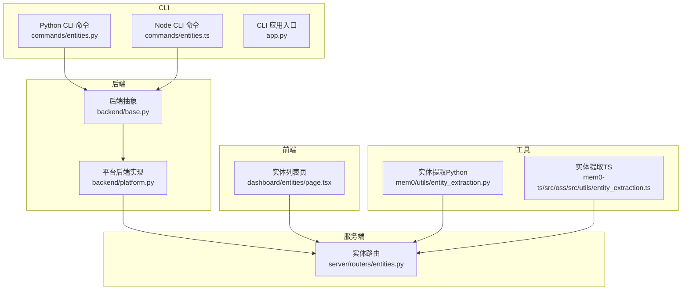
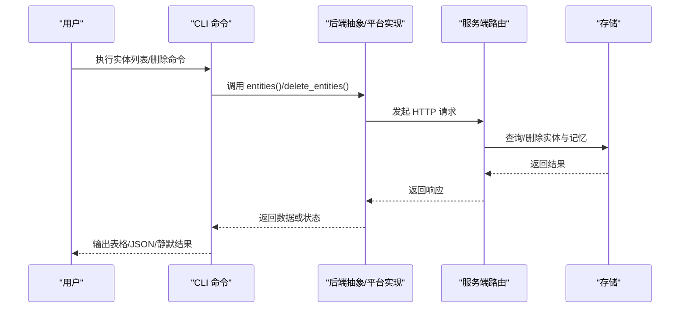
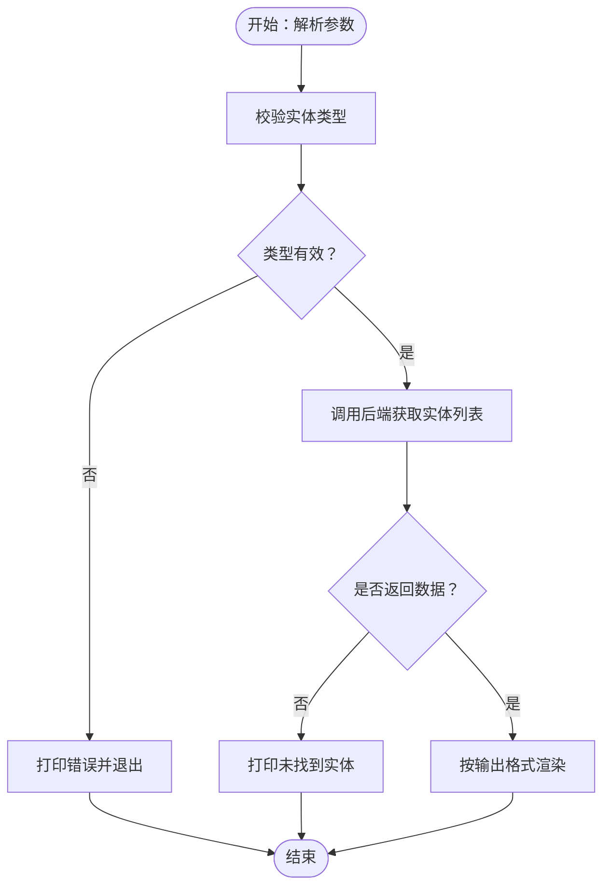
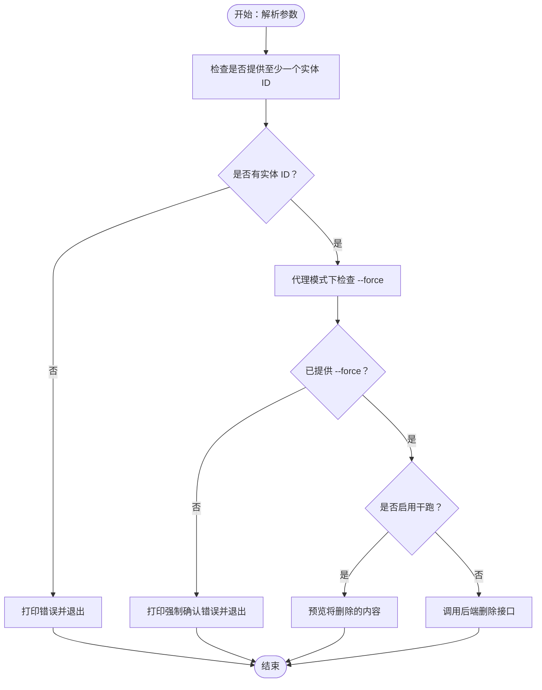
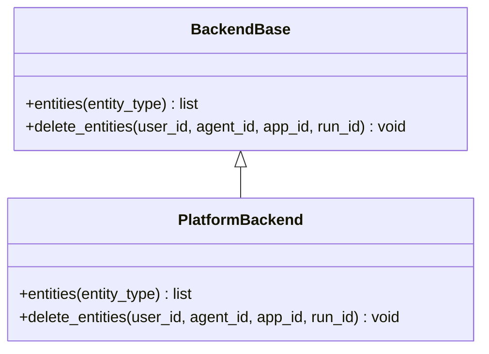
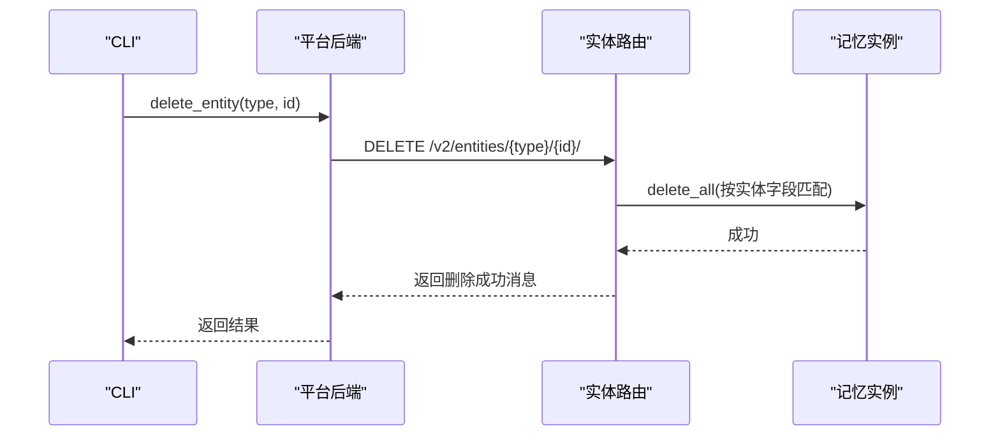
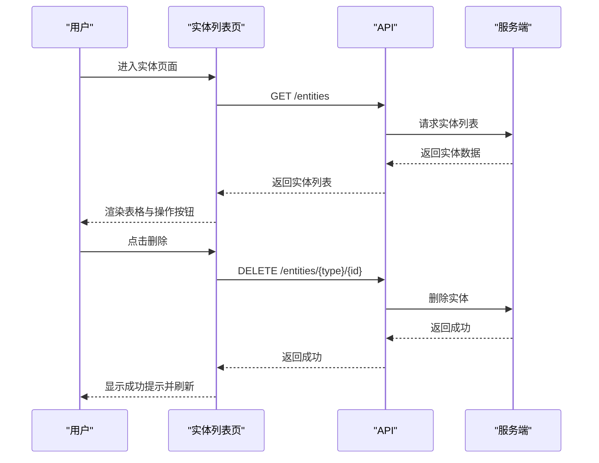
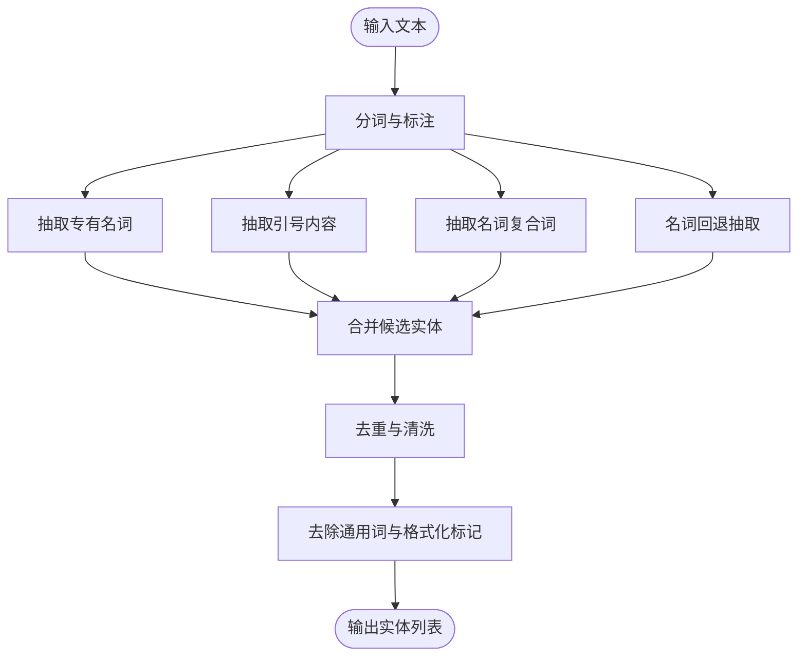
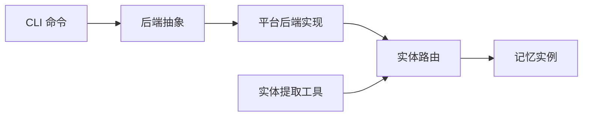

# 实体管理

<cite>
**本文引用的文件**
- [CLI 规格（Python）](file://cli/CLI_SPECIFICATION.md)
- [实体命令（Python）](file://cli/python/src/mem0_cli/commands/entities.py)
- [实体命令（Node）](file://cli/node/src/commands/entities.ts)
- [CLI 应用入口（Python）](file://cli/python/src/mem0_cli/app.py)
- [后端抽象（Python）](file://cli/python/src/mem0_cli/backend/base.py)
- [平台后端实现（Python）](file://cli/python/src/mem0_cli/backend/platform.py)
- [实体路由（Server）](file://server/routers/entities.py)
- [实体列表页面（Dashboard）](file://server/dashboard/src/app/(root)/dashboard/entities/page.tsx)
- [实体提取工具（Python）](file://mem0/utils/entity_extraction.py)
- [实体提取工具（TypeScript）](file://mem0-ts/src/oss/src/utils/entity_extraction.ts)
- [测试：实体删除（Python 测试）](file://cli/python/tests/test_commands.py)
- [测试：实体提取（Python 测试）](file://tests/utils/test_entity_extraction.py)
</cite>

## 目录
1. [简介](#简介)
2. [项目结构](#项目结构)
3. [核心组件](#核心组件)
4. [架构总览](#架构总览)
5. [详细组件分析](#详细组件分析)
6. [依赖关系分析](#依赖关系分析)
7. [性能考量](#性能考量)
8. [故障排查指南](#故障排查指南)
9. [结论](#结论)
10. [附录](#附录)

## 简介
本指南聚焦“实体管理”相关命令与能力，覆盖实体的创建、查询、更新与删除流程；解释实体在记忆系统中的作用与重要性；介绍实体分类、标签管理与实体链接等高级功能；提供最佳实践与常见使用场景，并给出实体数据结构说明与实际操作示例路径。

## 项目结构
围绕实体管理的关键位置如下：
- CLI（Python/Node）：提供实体列表与删除命令，支持多种输出格式与交互模式
- 后端抽象与平台实现：封装对服务端实体接口的调用
- 服务端路由：定义实体列表与删除的 REST 接口
- Dashboard 页面：可视化展示实体并支持删除
- 实体提取工具：从文本中抽取命名实体，为实体分类与链接奠定基础

图表来源
- [实体命令（Python）:26-81](file://cli/python/src/mem0_cli/commands/entities.py#L26-L81)
- [实体命令（Node）:22-82](file://cli/node/src/commands/entities.ts#L22-L82)
- [CLI 应用入口（Python）:699-725](file://cli/python/src/mem0_cli/app.py#L699-L725)
- [后端抽象（Python）:83-101](file://cli/python/src/mem0_cli/backend/base.py#L83-L101)
- [平台后端实现（Python）:280-334](file://cli/python/src/mem0_cli/backend/platform.py#L280-L334)
- [实体路由（Server）:43-76](file://server/routers/entities.py#L43-L76)
- [实体列表页面（Dashboard）](file://server/dashboard/src/app/(root)/dashboard/entities/page.tsx#L20-L104)
- [实体提取工具（Python）:1-344](file://mem0/utils/entity_extraction.py#L1-L344)
- [实体提取工具（TypeScript）:341-701](file://mem0-ts/src/oss/src/utils/entity_extraction.ts#L341-L701)

章节来源
- [CLI 规格（Python）:671-712](file://cli/CLI_SPECIFICATION.md#L671-L712)
- [实体命令（Python）:26-81](file://cli/python/src/mem0_cli/commands/entities.py#L26-L81)
- [实体命令（Node）:22-82](file://cli/node/src/commands/entities.ts#L22-L82)
- [CLI 应用入口（Python）:699-725](file://cli/python/src/mem0_cli/app.py#L699-L725)
- [后端抽象（Python）:83-101](file://cli/python/src/mem0_cli/backend/base.py#L83-L101)
- [平台后端实现（Python）:280-334](file://cli/python/src/mem0_cli/backend/platform.py#L280-L334)
- [实体路由（Server）:43-76](file://server/routers/entities.py#L43-L76)
- [实体列表页面（Dashboard）](file://server/dashboard/src/app/(root)/dashboard/entities/page.tsx#L20-L104)
- [实体提取工具（Python）:1-344](file://mem0/utils/entity_extraction.py#L1-L344)
- [实体提取工具（TypeScript）:341-701](file://mem0-ts/src/oss/src/utils/entity_extraction.ts#L341-L701)

## 核心组件
- 实体列表命令
  - Python：支持输出格式为表格、JSON、静默模式；可按用户/代理/应用/运行维度过滤
  - Node：支持输出格式为表格、JSON；具备交互式确认与错误提示
- 实体删除命令
  - 支持级联删除实体及其全部记忆；在代理模式下需要强制确认
  - 可选干跑模式预览将要删除的内容
- 后端抽象与平台实现
  - 提供统一的 entities 与 delete_entities 接口，封装 HTTP 请求
- 服务端路由
  - 列表：聚合所有实体类型与 ID，统计每个实体的记忆总数与时间信息
  - 删除：根据实体类型与 ID 删除该实体及其全部记忆
- Dashboard 页面
  - 展示实体列表，支持删除确认与刷新
- 实体提取工具
  - 从文本中抽取命名实体，支持多种类型与清洗策略，用于实体分类与链接

章节来源
- [CLI 规格（Python）:671-712](file://cli/CLI_SPECIFICATION.md#L671-L712)
- [实体命令（Python）:26-81](file://cli/python/src/mem0_cli/commands/entities.py#L26-L81)
- [实体命令（Node）:22-82](file://cli/node/src/commands/entities.ts#L22-L82)
- [后端抽象（Python）:83-101](file://cli/python/src/mem0_cli/backend/base.py#L83-L101)
- [平台后端实现（Python）:280-334](file://cli/python/src/mem0_cli/backend/platform.py#L280-L334)
- [实体路由（Server）:43-76](file://server/routers/entities.py#L43-L76)
- [实体列表页面（Dashboard）](file://server/dashboard/src/app/(root)/dashboard/entities/page.tsx#L20-L104)
- [实体提取工具（Python）:1-344](file://mem0/utils/entity_extraction.py#L1-L344)
- [实体提取工具（TypeScript）:341-701](file://mem0-ts/src/oss/src/utils/entity_extraction.ts#L341-L701)

## 架构总览
实体管理涉及 CLI、后端抽象层、服务端路由与前端界面的协同工作。CLI 将用户意图转化为后端请求，后端通过平台实现访问服务端实体接口，服务端聚合与处理实体数据，前端负责展示与交互。

图表来源
- [实体命令（Python）:26-81](file://cli/python/src/mem0_cli/commands/entities.py#L26-L81)
- [实体命令（Node）:22-82](file://cli/node/src/commands/entities.ts#L22-L82)
- [后端抽象（Python）:83-101](file://cli/python/src/mem0_cli/backend/base.py#L83-L101)
- [平台后端实现（Python）:280-334](file://cli/python/src/mem0_cli/backend/platform.py#L280-L334)
- [实体路由（Server）:43-76](file://server/routers/entities.py#L43-L76)

## 详细组件分析

### 实体列表命令
- 功能要点
  - 支持实体类型：users、agents、apps、runs
  - 输出格式：table（默认）、json、agent（代理模式）、quiet（静默）
  - 错误处理：无效类型时退出；无结果时提示；异常时提示平台特性要求
- 控制流
  - 参数校验与类型检查
  - 调用后端接口获取实体列表
  - 按输出格式渲染表格或 JSON
  - 计时与统计输出

图表来源
- [实体命令（Python）:26-81](file://cli/python/src/mem0_cli/commands/entities.py#L26-L81)
- [实体命令（Node）:22-82](file://cli/node/src/commands/entities.ts#L22-L82)

章节来源
- [CLI 规格（Python）:671-712](file://cli/CLI_SPECIFICATION.md#L671-L712)
- [实体命令（Python）:26-81](file://cli/python/src/mem0_cli/commands/entities.py#L26-L81)
- [实体命令（Node）:22-82](file://cli/node/src/commands/entities.ts#L22-L82)

### 实体删除命令
- 功能要点
  - 支持按用户/代理/应用/运行维度删除
  - 干跑模式：仅预览将要删除的内容
  - 强制模式：跳过确认（尤其在代理模式下必须显式指定）
  - 级联删除：删除实体及其全部记忆
- 控制流
  - 参数校验：至少提供一个实体 ID
  - 代理模式强制确认检查
  - 组装作用域参数并调用后端删除接口
  - 输出成功/失败信息

图表来源
- [实体命令（Python）:83-120](file://cli/python/src/mem0_cli/commands/entities.py#L83-L120)
- [实体命令（Node）:84-114](file://cli/node/src/commands/entities.ts#L84-L114)

章节来源
- [CLI 规格（Python）:671-712](file://cli/CLI_SPECIFICATION.md#L671-L712)
- [实体命令（Python）:83-120](file://cli/python/src/mem0_cli/commands/entities.py#L83-L120)
- [实体命令（Node）:84-114](file://cli/node/src/commands/entities.ts#L84-L114)
- [测试：实体删除（Python 测试）:896-917](file://cli/python/tests/test_commands.py#L896-L917)

### 后端抽象与平台实现
- 后端抽象
  - 定义 entities 与 delete_entities 接口，供 CLI 使用
- 平台实现
  - GET /v1/entities/：拉取实体列表
  - DELETE /v2/entities/{entity_type}/{entity_id}/：删除实体（级联删除其记忆）
  - 参数校验：至少提供一个实体 ID；否则抛出错误
  - 来源标记：携带 source=CLI 的查询参数便于追踪

图表来源
- [后端抽象（Python）:83-101](file://cli/python/src/mem0_cli/backend/base.py#L83-L101)
- [平台后端实现（Python）:280-334](file://cli/python/src/mem0_cli/backend/platform.py#L280-L334)

章节来源
- [后端抽象（Python）:83-101](file://cli/python/src/mem0_cli/backend/base.py#L83-L101)
- [平台后端实现（Python）:280-334](file://cli/python/src/mem0_cli/backend/platform.py#L280-L334)

### 服务端实体路由
- 列表接口
  - 聚合所有实体类型与 ID，统计每个实体的记忆总数与时间信息
  - 返回标准化的实体对象列表
- 删除接口
  - 根据实体类型与 ID 删除该实体及其全部记忆
  - 异常时返回上游错误

图表来源
- [实体路由（Server）:43-76](file://server/routers/entities.py#L43-L76)
- [平台后端实现（Python）:280-334](file://cli/python/src/mem0_cli/backend/platform.py#L280-L334)

章节来源
- [实体路由（Server）:43-76](file://server/routers/entities.py#L43-L76)

### Dashboard 实体列表页面
- 功能要点
  - 加载并展示实体列表，包含类型、ID、记忆数、最近活跃时间
  - 支持删除确认与 Toast 提示
  - 刷新后自动重新加载数据

图表来源
- [实体列表页面（Dashboard）](file://server/dashboard/src/app/(root)/dashboard/entities/page.tsx#L20-L104)
- [实体路由（Server）:43-76](file://server/routers/entities.py#L43-L76)

章节来源
- [实体列表页面（Dashboard）](file://server/dashboard/src/app/(root)/dashboard/entities/page.tsx#L20-L104)

### 实体提取工具
- 目标
  - 从自然语言文本中抽取命名实体，支持多种类型与清洗策略
- 关键能力
  - 抽取类型：专有名词、引号内容、名词复合词、名词回退
  - 去重与清洗：去除通用词汇、格式化标记、句末标点等
  - 批量处理：支持批量输入以提升效率
- 在实体管理中的作用
  - 为实体分类与链接提供基础数据
  - 支持实体检索与过滤

图表来源
- [实体提取工具（Python）:1-344](file://mem0/utils/entity_extraction.py#L1-L344)
- [实体提取工具（TypeScript）:341-701](file://mem0-ts/src/oss/src/utils/entity_extraction.ts#L341-L701)

章节来源
- [实体提取工具（Python）:1-344](file://mem0/utils/entity_extraction.py#L1-L344)
- [实体提取工具（TypeScript）:341-701](file://mem0-ts/src/oss/src/utils/entity_extraction.ts#L341-L701)
- [测试：实体提取（Python 测试）:31-101](file://tests/utils/test_entity_extraction.py#L31-L101)

## 依赖关系分析
- CLI 与后端
  - CLI 通过后端抽象调用平台实现，平台实现封装 HTTP 请求
- 后端与服务端
  - 平台实现对接服务端实体路由，完成实体列表与删除
- 服务端与存储
  - 服务端路由调用记忆实例执行删除操作
- 工具与业务
  - 实体提取工具为实体分类与链接提供数据支撑

图表来源
- [实体命令（Python）:26-81](file://cli/python/src/mem0_cli/commands/entities.py#L26-L81)
- [平台后端实现（Python）:280-334](file://cli/python/src/mem0_cli/backend/platform.py#L280-L334)
- [实体路由（Server）:43-76](file://server/routers/entities.py#L43-L76)
- [实体提取工具（Python）:1-344](file://mem0/utils/entity_extraction.py#L1-L344)

章节来源
- [CLI 应用入口（Python）:699-725](file://cli/python/src/mem0_cli/app.py#L699-L725)
- [后端抽象（Python）:83-101](file://cli/python/src/mem0_cli/backend/base.py#L83-L101)
- [平台后端实现（Python）:280-334](file://cli/python/src/mem0_cli/backend/platform.py#L280-L334)
- [实体路由（Server）:43-76](file://server/routers/entities.py#L43-L76)
- [实体提取工具（Python）:1-344](file://mem0/utils/entity_extraction.py#L1-L344)

## 性能考量
- 批量处理
  - 实体提取工具支持批量输入，减少重复开销
- 输出格式选择
  - 大量实体时优先使用 JSON 或静默输出，避免表格渲染带来的额外处理
- 干跑模式
  - 删除前使用干跑模式评估影响范围，降低误删风险与后续修复成本
- 级联删除
  - 删除实体会级联删除其全部记忆，注意在生产环境谨慎使用

## 故障排查指南
- 无效实体类型
  - 现象：CLI 提示类型无效并退出
  - 处理：确保实体类型为 users、agents、apps、runs 之一
- 缺少实体 ID
  - 现象：删除命令报错，提示需提供至少一个实体 ID
  - 处理：补充 --user-id、--agent-id、--app-id、--run-id 中的一个或多个
- 代理模式强制确认
  - 现象：代理模式下删除被拒绝
  - 处理：添加 --force 参数以跳过确认
- 平台特性要求
  - 现象：功能提示可能需要平台支持
  - 处理：确认后端实现与服务端路由可用性
- 删除失败
  - 现象：删除接口异常
  - 处理：检查服务端日志与权限配置，确认实体存在且未被锁定

章节来源
- [实体命令（Python）:26-81](file://cli/python/src/mem0_cli/commands/entities.py#L26-L81)
- [实体命令（Node）:22-82](file://cli/node/src/commands/entities.ts#L22-L82)
- [平台后端实现（Python）:280-334](file://cli/python/src/mem0_cli/backend/platform.py#L280-L334)
- [实体路由（Server）:43-76](file://server/routers/entities.py#L43-L76)

## 结论
实体管理命令提供了从查询到删除的完整链路，结合后端抽象与服务端路由，实现了跨 CLI、平台与存储的一致体验。实体提取工具为实体分类与链接提供了坚实的数据基础。建议在生产环境中谨慎使用删除与干跑功能，配合实体提取工具进行实体治理与优化。

## 附录

### 实体数据结构说明
- 实体对象
  - 字段：id、type、total_memories、created_at、updated_at
  - 用途：用于列表展示与统计
- 删除响应
  - 字段：message
  - 用途：确认删除操作成功

章节来源
- [实体路由（Server）:43-76](file://server/routers/entities.py#L43-L76)

### 实际操作示例（示例路径）
- 实体列表
  - Python CLI：参见 [CLI 规格（Python）:671-712](file://cli/CLI_SPECIFICATION.md#L671-L712)
  - Node CLI：参见 [实体命令（Node）:22-82](file://cli/node/src/commands/entities.ts#L22-L82)
- 实体删除
  - Python CLI：参见 [CLI 规格（Python）:671-712](file://cli/CLI_SPECIFICATION.md#L671-L712)
  - Node CLI：参见 [实体命令（Node）:84-114](file://cli/node/src/commands/entities.ts#L84-L114)
- Dashboard 删除
  - 参见 [实体列表页面（Dashboard）](file://server/dashboard/src/app/(root)/dashboard/entities/page.tsx#L20-L104)

### 最佳实践
- 分类与标签
  - 使用实体类型（users、agents、apps、runs）进行逻辑隔离
  - 结合实体提取工具进行实体归类与去重
- 链接与检索
  - 基于实体提取结果建立实体链接，提升检索准确性
- 安全与审计
  - 删除前使用干跑模式评估影响
  - 在代理模式下务必使用 --force 明确确认
- 性能优化
  - 大规模实体列表优先使用 JSON 输出
  - 批量处理文本以提高实体提取效率