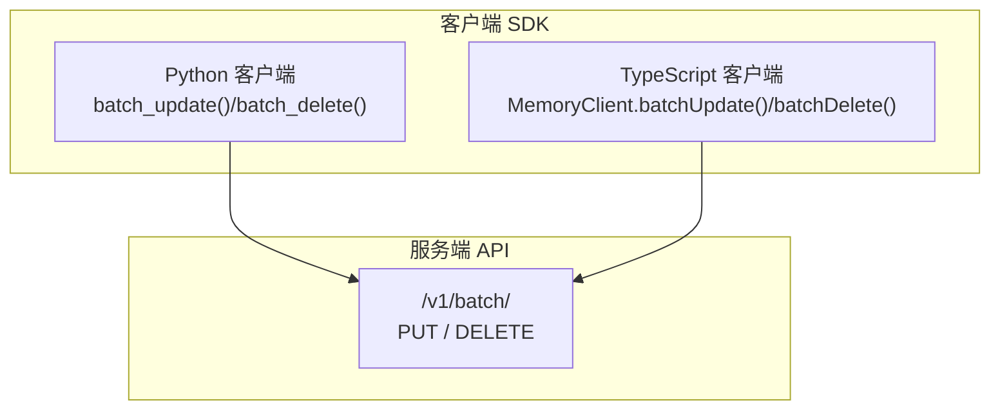
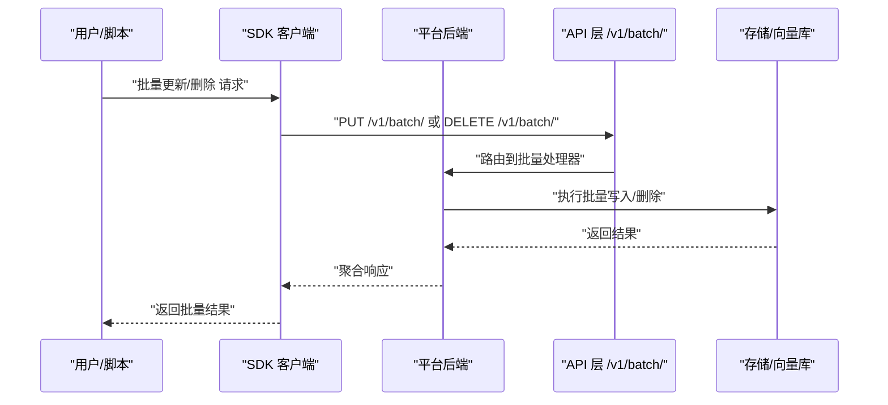
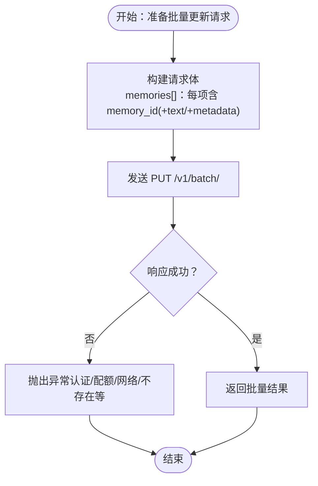
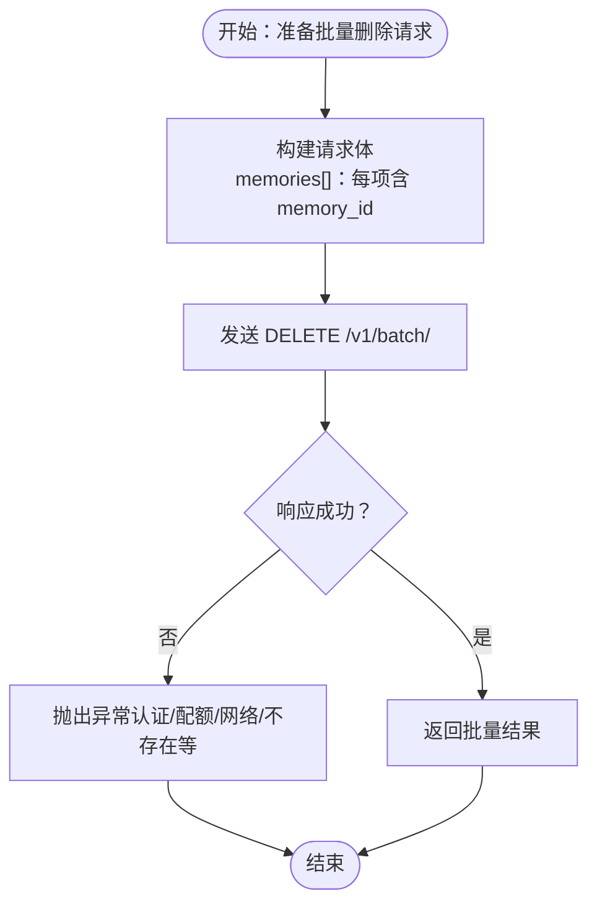
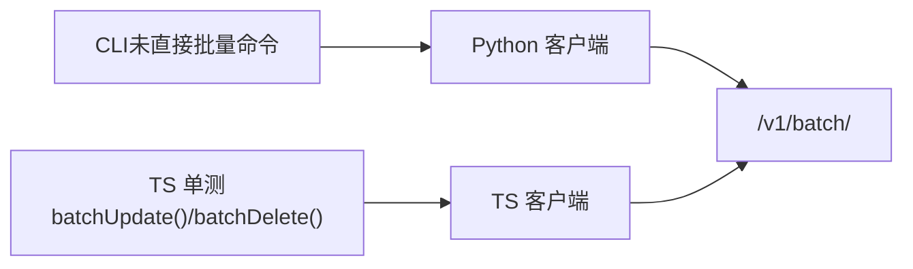

# 批量操作

<cite>
**本文引用的文件**
- [Python 客户端主模块（批量更新/删除）](file://mem0/client/main.py)
- [TypeScript 客户端单元测试（批量更新/删除）](file://mem0-ts/src/client/tests/memoryClient.batch.test.ts)
- [TypeScript 集成测试（批量更新/删除）](file://mem0-ts/src/client/tests/integration/batch.test.ts)
- [Python CLI 内存命令](file://cli/python/src/mem0_cli/commands/memory.py)
- [Node CLI 内存命令](file://cli/node/src/commands/memory.ts)
- [CLI 规范（目录结构与命令分组）](file://cli/CLI_SPECIFICATION.md)
- [OpenAPI 批量更新文档](file://docs/api-reference/memory/batch-update.mdx)
- [OpenAPI 批量删除文档](file://docs/api-reference/memory/batch-delete.mdx)
- [LLM 最佳实践（批量添加建议）](file://LLM.md)
</cite>

## 目录
1. [简介](#简介)
2. [项目结构](#项目结构)
3. [核心组件](#核心组件)
4. [架构总览](#架构总览)
5. [详细组件分析](#详细组件分析)
6. [依赖关系分析](#依赖关系分析)
7. [性能考量](#性能考量)
8. [故障排查指南](#故障排查指南)
9. [结论](#结论)
10. [附录：批量数据格式与示例](#附录批量数据格式与示例)

## 简介
本指南聚焦于“批量操作”能力，覆盖批量添加、批量更新、批量删除三类操作的使用方式、数据格式、错误处理与回滚机制、性能与限制，并结合实际案例给出最佳实践。当前仓库在客户端 SDK 中提供了批量更新与批量删除的接口；CLI 命令未直接暴露批量子命令，但可通过后端 API 的批量端点进行调用或在上层工具中以批处理方式实现。

## 项目结构
- 客户端 SDK 提供批量更新与批量删除方法，分别对应服务端 /v1/batch/ 的 PUT 与 DELETE 接口。
- CLI 层未直接提供批量子命令，但其命令注册与帮助面板可用于理解命令组织方式。
- 文档层对批量更新与批量删除的 OpenAPI 行为进行了说明。

图表来源
- [Python 客户端主模块（批量更新/删除）:560-610](file://mem0/client/main.py#L560-L610)
- [TypeScript 客户端单元测试（批量更新/删除）:18-60](file://mem0-ts/src/client/tests/memoryClient.batch.test.ts#L18-L60)
- [OpenAPI 批量更新文档:1-5](file://docs/api-reference/memory/batch-update.mdx#L1-L5)
- [OpenAPI 批量删除文档:1-6](file://docs/api-reference/memory/batch-delete.mdx#L1-L6)

章节来源
- [CLI 规范（目录结构与命令分组）:55-105](file://cli/CLI_SPECIFICATION.md#L55-L105)
- [OpenAPI 批量更新文档:1-5](file://docs/api-reference/memory/batch-update.mdx#L1-L5)
- [OpenAPI 批量删除文档:1-6](file://docs/api-reference/memory/batch-delete.mdx#L1-L6)

## 核心组件
- Python 客户端
  - 同步批量更新：通过 PUT /v1/batch/ 发送包含 memories 数组的请求体，每个元素需包含 memory_id（以及可选的 text、metadata）。
  - 同步批量删除：通过 DELETE /v1/batch/ 发送包含 memories 数组的请求体，每个元素需包含 memory_id。
  - 异步版本同理，使用异步客户端发起相同请求。
- TypeScript 客户端
  - 单元测试验证了批量更新会将 memoryId 转换为 memory_id 并发送至 /v1/batch/（PUT），批量删除发送至 /v1/batch/（DELETE）。
- CLI
  - 当前未提供独立的批量子命令；如需批量处理，可在外部脚本中按批次调用单条更新/删除接口，或通过后端封装统一入口。

章节来源
- [Python 客户端主模块（批量更新/删除）:560-610](file://mem0/client/main.py#L560-L610)
- [Python 客户端主模块（批量更新/删除）:1490-1518](file://mem0/client/main.py#L1490-L1518)
- [TypeScript 客户端单元测试（批量更新/删除）:18-60](file://mem0-ts/src/client/tests/memoryClient.batch.test.ts#L18-L60)
- [TypeScript 集成测试（批量更新/删除）](file://mem0-ts/src/client/tests/integration/batch.test.ts)

## 架构总览
批量操作的典型调用链如下：

图表来源
- [Python 客户端主模块（批量更新/删除）:560-610](file://mem0/client/main.py#L560-L610)
- [TypeScript 客户端单元测试（批量更新/删除）:18-60](file://mem0-ts/src/client/tests/memoryClient.batch.test.ts#L18-L60)
- [OpenAPI 批量更新文档:1-5](file://docs/api-reference/memory/batch-update.mdx#L1-L5)
- [OpenAPI 批量删除文档:1-6](file://docs/api-reference/memory/batch-delete.mdx#L1-L6)

## 详细组件分析

### 批量更新（PUT /v1/batch/）
- 数据模型要点
  - 请求体包含一个 memories 数组，数组中的每个元素代表一条待更新的记忆项。
  - 必填字段：memory_id（字符串）。
  - 可选字段：text（字符串）、metadata（对象）。
- 处理流程
  - SDK 将请求体发送至 /v1/batch/（PUT）。
  - 服务端逐条校验并更新，返回聚合结果。
- 错误与回滚
  - SDK 抛出多种异常类型（如认证失败、速率限制、配额超限、网络错误、记忆不存在等）。
  - 具体回滚策略由服务端实现，SDK 不做本地回滚；建议在应用侧记录批次 ID 并在失败时重试或补偿。
- 输出形态
  - 返回 JSON 结构，包含批量操作状态与明细。

图表来源
- [Python 客户端主模块（批量更新/删除）:560-582](file://mem0/client/main.py#L560-L582)
- [TypeScript 客户端单元测试（批量更新/删除）:18-47](file://mem0-ts/src/client/tests/memoryClient.batch.test.ts#L18-L47)

章节来源
- [Python 客户端主模块（批量更新/删除）:560-582](file://mem0/client/main.py#L560-L582)
- [TypeScript 客户端单元测试（批量更新/删除）:18-47](file://mem0-ts/src/client/tests/memoryClient.batch.test.ts#L18-L47)
- [OpenAPI 批量更新文档:1-5](file://docs/api-reference/memory/batch-update.mdx#L1-L5)

### 批量删除（DELETE /v1/batch/）
- 数据模型要点
  - 请求体包含一个 memories 数组，数组中的每个元素仅需包含 memory_id。
- 处理流程
  - SDK 将请求体发送至 /v1/batch/（DELETE）。
  - 服务端逐条校验并删除，返回聚合结果。
- 错误与回滚
  - 同样支持多种异常类型；建议在应用侧记录待删 ID 列表并在失败时重试或补偿。
- 输出形态
  - 返回 JSON 结构，包含批量操作状态与明细。

图表来源
- [Python 客户端主模块（批量更新/删除）:584-608](file://mem0/client/main.py#L584-L608)
- [TypeScript 客户端单元测试（批量更新/删除）:64-74](file://mem0-ts/src/client/tests/memoryClient.batch.test.ts#L64-L74)
- [OpenAPI 批量删除文档:1-6](file://docs/api-reference/memory/batch-delete.mdx#L1-L6)

章节来源
- [Python 客户端主模块（批量更新/删除）:584-608](file://mem0/client/main.py#L584-L608)
- [TypeScript 客户端单元测试（批量更新/删除）:64-74](file://mem0-ts/src/client/tests/memoryClient.batch.test.ts#L64-L74)
- [OpenAPI 批量删除文档:1-6](file://docs/api-reference/memory/batch-delete.mdx#L1-L6)

### 批量添加（概念与建议）
- 当前仓库未提供客户端 SDK 的批量添加方法。
- 文档与最佳实践建议：在需要大批量导入时，优先采用批量更新/删除的思路，或在上层以“批量添加”的方式组织请求（例如将多条添加任务转换为批量更新的“补丁式”更新，或在外部脚本中按批次调用单条添加接口）。
- 参考最佳实践：批量添加应避免过多小请求，尽量合并为较大的批次，控制单次请求体大小与并发度。

章节来源
- [LLM 最佳实践（批量添加建议）:1010-1285](file://LLM.md#L1010-L1285)

## 依赖关系分析
- 客户端 SDK 与服务端 API 的耦合点为 /v1/batch/ 端点，请求体结构一致（memories[]）。
- TypeScript 客户端单元测试验证了字段映射（memoryId → memory_id）与端点路径。
- CLI 未直接暴露批量命令，但其命令注册与输出格式可作为上层批处理工具的参考。

图表来源
- [TypeScript 客户端单元测试（批量更新/删除）:18-74](file://mem0-ts/src/client/tests/memoryClient.batch.test.ts#L18-L74)
- [Python 客户端主模块（批量更新/删除）:560-610](file://mem0/client/main.py#L560-L610)
- [CLI 规范（目录结构与命令分组）:55-105](file://cli/CLI_SPECIFICATION.md#L55-L105)

章节来源
- [TypeScript 客户端单元测试（批量更新/删除）:18-74](file://mem0-ts/src/client/tests/memoryClient.batch.test.ts#L18-L74)
- [Python 客户端主模块（批量更新/删除）:560-610](file://mem0/client/main.py#L560-L610)
- [CLI 规范（目录结构与命令分组）:55-105](file://cli/CLI_SPECIFICATION.md#L55-L105)

## 性能考量
- 减少往返次数：批量操作显著降低网络开销与协议栈成本。
- 控制批次大小：根据服务端限制与网络状况调整批次大小，避免单次请求过大导致超时或被拒。
- 并发与限流：合理设置并发度，遵循 SDK/服务端的速率限制与配额策略。
- 数据压缩与序列化：确保请求体紧凑，避免冗余字段。
- 顺序一致性：批量更新/删除通常按请求顺序处理，若业务强依赖顺序，应在应用层保证输入顺序与幂等性。

## 故障排查指南
- 常见异常类型（Python 客户端）
  - 认证失败、速率限制、配额超限、网络错误、记忆不存在等。
- 建议的排查步骤
  - 检查请求体结构是否符合要求（memories[] 中每项至少包含 memory_id）。
  - 校验 memory_id 是否存在且有效。
  - 关注服务端返回的状态码与错误信息，必要时开启更详细的日志。
  - 对失败批次进行重试与补偿，记录批次 ID 以便追踪。
- 回滚与补偿
  - SDK 不做本地回滚；建议在应用侧维护“已处理/待重试”清单，失败时按需补偿。

章节来源
- [Python 客户端主模块（批量更新/删除）:570-576](file://mem0/client/main.py#L570-L576)
- [Python 客户端主模块（批量更新/删除）:596-602](file://mem0/client/main.py#L596-L602)
- [Python 客户端主模块（批量更新/删除）:1506-1512](file://mem0/client/main.py#L1506-L1512)

## 结论
- 批量更新与批量删除在当前仓库中已有明确的客户端接口与测试覆盖，适合用于大规模记忆项的高效变更。
- CLI 未直接提供批量子命令，但可借助 SDK 或外部脚本实现批处理。
- 实践中应关注批次大小、并发度与错误处理策略，确保稳定性与可观测性。

## 附录：批量数据格式与示例
- 批量更新请求体
  - 字段
    - memories: 数组
      - memory_id: 字符串（必填）
      - text: 字符串（可选）
      - metadata: 对象（可选）
- 批量删除请求体
  - 字段
    - memories: 数组
      - memory_id: 字符串（必填）

章节来源
- [Python 客户端主模块（批量更新/删除）:560-582](file://mem0/client/main.py#L560-L582)
- [Python 客户端主模块（批量更新/删除）:584-608](file://mem0/client/main.py#L584-L608)
- [TypeScript 客户端单元测试（批量更新/删除）:18-74](file://mem0-ts/src/client/tests/memoryClient.batch.test.ts#L18-L74)