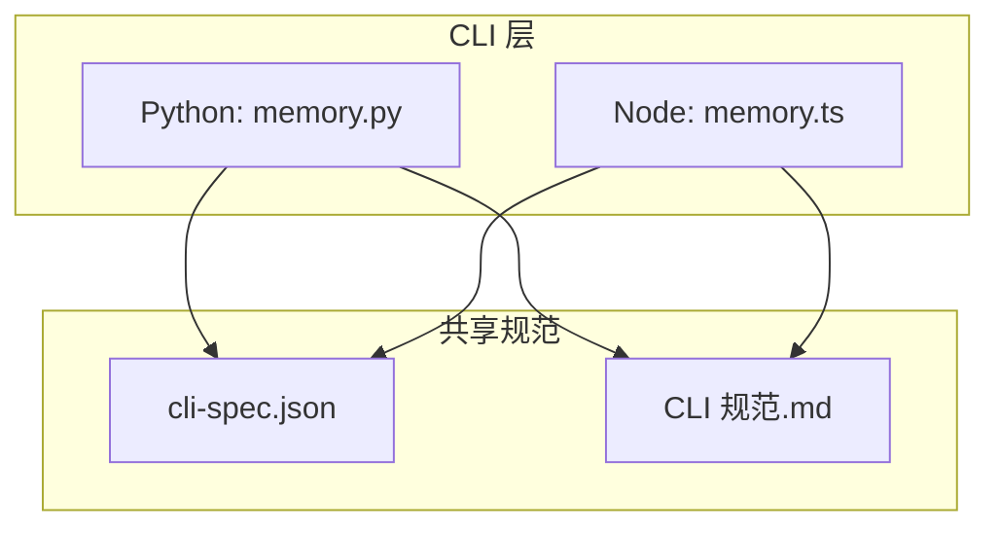
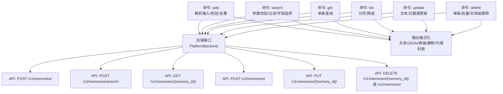
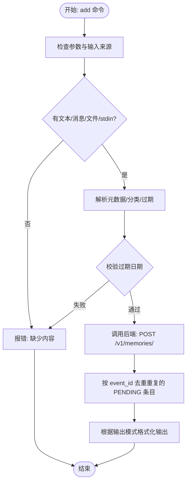
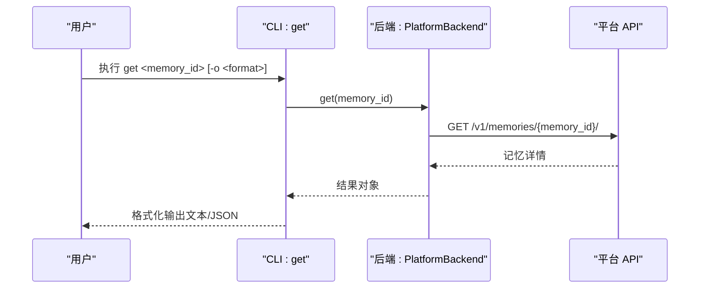
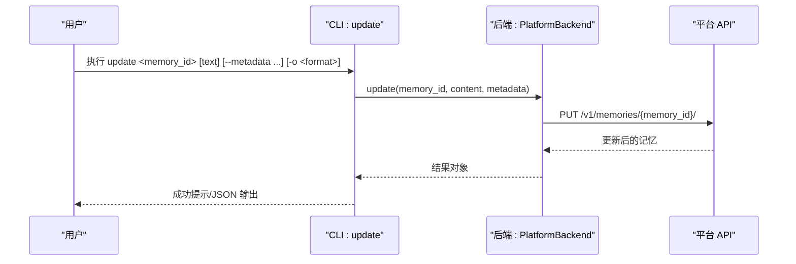
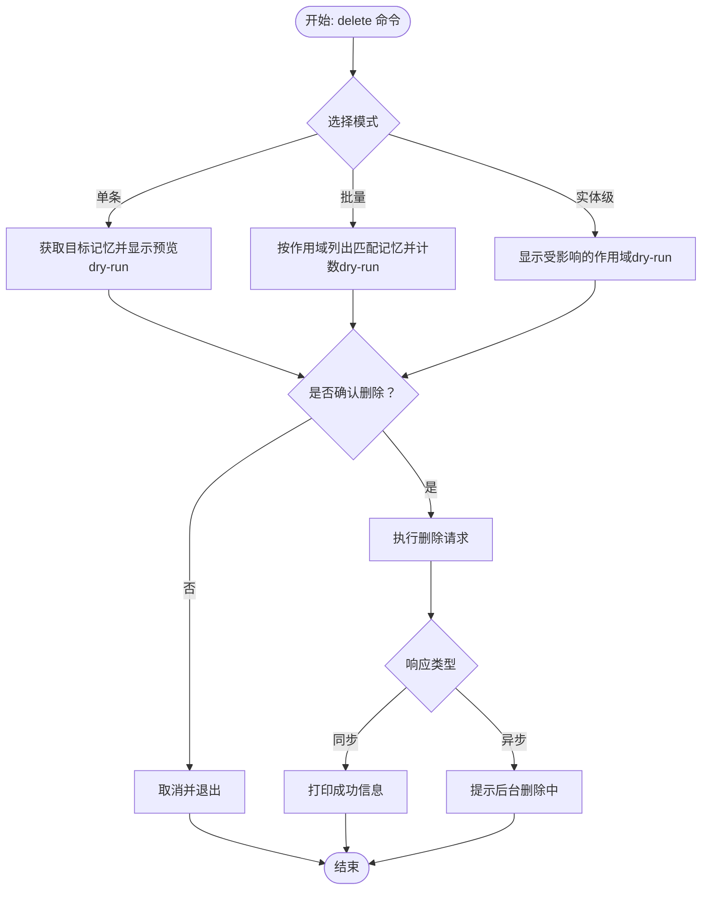
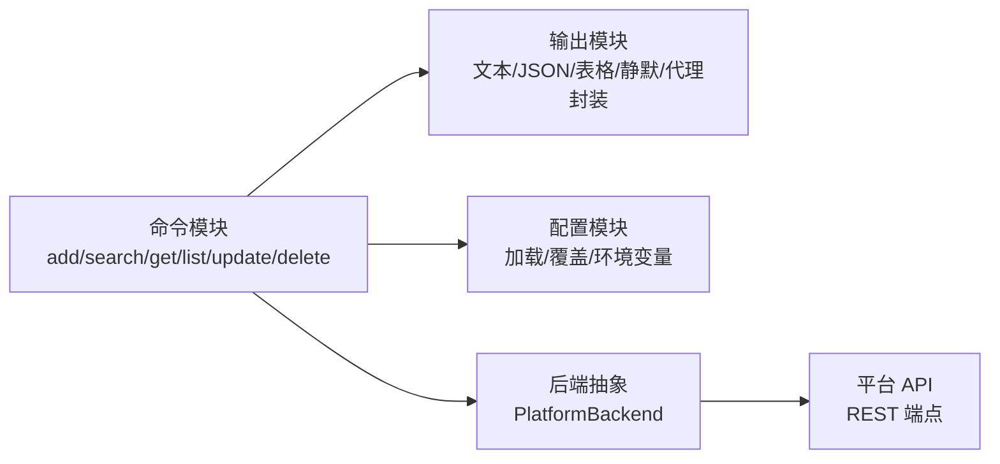

# 记忆 CRUD 操作

<cite>
**本文引用的文件**
- [memory.ts](file://cli/node/src/commands/memory.ts)
- [memory.py](file://cli/python/src/mem0_cli/commands/memory.py)
- [CLI 规范.md](file://cli/CLI_SPECIFICATION.md)
- [cli-spec.json](file://cli/cli-spec.json)
- [add-memories.mdx](file://docs/api-reference/memory/add-memories.mdx)
- [get-memory.mdx](file://docs/api-reference/memory/get-memory.mdx)
- [update-memory.mdx](file://docs/api-reference/memory/update-memory.mdx)
- [delete-memory.mdx](file://docs/api-reference/memory/delete-memory.mdx)
</cite>

## 目录
1. [简介](#简介)
2. [项目结构](#项目结构)
3. [核心组件](#核心组件)
4. [架构总览](#架构总览)
5. [详细组件分析](#详细组件分析)
6. [依赖关系分析](#依赖关系分析)
7. [性能考量](#性能考量)
8. [故障排查指南](#故障排查指南)
9. [结论](#结论)
10. [附录](#附录)

## 简介
本指南聚焦于 mem0 CLI 的“记忆 CRUD”能力，系统讲解以下命令的使用方法与最佳实践：
- 添加记忆：add
- 获取记忆：get
- 更新记忆：update
- 删除记忆：delete（含单条与批量两种模式）

内容覆盖命令参数详解、必填字段说明、可选参数配置、输出格式、批量与单条操作差异、错误处理与常见问题解决，并辅以流程图与时序图帮助理解。

## 项目结构
mem0 CLI 在 Python 与 Node 两端提供一致的行为与输出，核心命令集中在：
- Python 实现：cli/python/src/mem0_cli/commands/memory.py
- Node 实现：cli/node/src/commands/memory.ts

两者均遵循共享规范文件 cli/cli-spec.json 与 CLI 规范文档 CLI 规范.md 中的命令定义、选项分组、默认值与行为约束。

图表来源
- [memory.py:1-672](file://cli/python/src/mem0_cli/commands/memory.py#L1-L672)
- [memory.ts:1-704](file://cli/node/src/commands/memory.ts#L1-L704)
- [cli-spec.json:1-552](file://cli/cli-spec.json#L1-L552)
- [CLI 规范.md:1-800](file://cli/CLI_SPECIFICATION.md#L1-L800)

章节来源
- [CLI 规范.md: 138-493:138-493](file://cli/CLI_SPECIFICATION.md#L138-L493)
- [cli-spec.json: 179-369:179-369](file://cli/cli-spec.json#L179-L369)

## 核心组件
- 添加记忆（add）
  - 输入优先级：文件 > 消息 JSON > 文本参数 > 标准输入（管道或重定向）
  - 支持消息数组、元数据 JSON、不可变标记、推理开关、过期日期、分类列表
  - 输出：文本/JSON/静默；支持去重事件（按 event_id）
- 搜索记忆（search）
  - 查询参数校验：top-k ≥ 1，阈值 0.0~1.0
  - 支持关键词检索、重排、过滤表达式、字段选择
  - 输出：文本/JSON/表格
- 获取记忆（get）
  - 单条查询，返回指定记忆详情
- 列表记忆（list）
  - 分页与筛选：页码、每页数量、分类、时间范围
  - 输出：文本/JSON/表格
- 更新记忆（update）
  - 可更新文本或元数据（JSON）
- 删除记忆（delete）
  - 单条删除、批量删除（按作用域）、实体级级联删除
  - 支持预演（dry-run）与强制确认（force）

章节来源
- [memory.py: 50-672:50-672](file://cli/python/src/mem0_cli/commands/memory.py#L50-L672)
- [memory.ts: 37-704:37-704](file://cli/node/src/commands/memory.ts#L37-L704)
- [CLI 规范.md: 194-493:194-493](file://cli/CLI_SPECIFICATION.md#L194-L493)

## 架构总览
下图展示 CLI 命令到后端 API 的调用路径与关键处理点（如参数解析、校验、输出格式化、事件去重）：

图表来源
- [memory.py: 50-672:50-672](file://cli/python/src/mem0_cli/commands/memory.py#L50-L672)
- [memory.ts: 37-704:37-704](file://cli/node/src/commands/memory.ts#L37-L704)
- [cli-spec.json: 87-98:87-98](file://cli/cli-spec.json#L87-L98)

## 详细组件分析

### 添加记忆（add）
- 参数与输入优先级
  - 文本内容：作为单条记忆添加
  - 消息 JSON：传入对话数组（每个元素包含角色与内容）
  - 文件：从 JSON 文件读取消息数组
  - 标准输入：当未提供文本且 stdin 为管道或文件时自动读取
- 关键选项
  - 作用域：用户、代理、应用、运行（-u/--user-id、--agent-id、--app-id、--run-id）
  - 元数据：-m/--metadata（JSON）
  - 不可变：--immutable 阻止后续更新
  - 推理：--no-infer 跳过推理，存储原始文本
  - 过期：--expires（YYYY-MM-DD，必须在未来）
  - 分类：--categories（JSON 数组或逗号分隔）
  - 图谱：--graph/--no-graph 控制是否启用图谱提取
  - 输出：-o/--output（text/json/quiet），默认 text
- 处理逻辑要点
  - 内容为空时拒绝执行
  - 对返回结果进行事件去重（按 event_id）
  - 输出前打印作用域信息与处理摘要
- 批量 vs 单条
  - 单条：传入单条文本或消息
  - 批量：通过导入命令（import）对 JSON 文件逐项调用 add
- 示例与输出
  - 文本添加：mem0 add "偏好设置" -u alice -o json
  - 管道输入：echo "偏好设置" | mem0 add -u alice
  - 文件导入：mem0 add --file msgs.json -u alice -o json

图表来源
- [memory.ts: 37-210:37-210](file://cli/node/src/commands/memory.ts#L37-L210)
- [memory.py: 50-211:50-211](file://cli/python/src/mem0_cli/commands/memory.py#L50-L211)
- [CLI 规范.md: 194-247:194-247](file://cli/CLI_SPECIFICATION.md#L194-L247)

章节来源
- [CLI 规范.md: 194-247:194-247](file://cli/CLI_SPECIFICATION.md#L194-L247)
- [cli-spec.json: 179-216:179-216](file://cli/cli-spec.json#L179-L216)
- [add-memories.mdx: 1-86:1-86](file://docs/api-reference/memory/add-memories.mdx#L1-L86)

### 获取记忆（get）
- 必填参数
  - memory_id：目标记忆的唯一标识
- 选项
  - 输出：-o/--output（text/json），默认 text
- 行为
  - 直接调用 GET /v1/memories/{memory_id}/ 返回单条记录
  - 支持代理封装输出（agent 模式）

图表来源
- [memory.ts: 332-353:332-353](file://cli/node/src/commands/memory.ts#L332-L353)
- [memory.py: 323-341:323-341](file://cli/python/src/mem0_cli/commands/memory.py#L323-L341)
- [cli-spec.json: 89-94:89-94](file://cli/cli-spec.json#L89-L94)

章节来源
- [CLI 规范.md: 303-337:303-337](file://cli/CLI_SPECIFICATION.md#L303-L337)
- [cli-spec.json: 254-276:254-276](file://cli/cli-spec.json#L254-L276)
- [get-memory.mdx: 1-5:1-5](file://docs/api-reference/memory/get-memory.mdx#L1-L5)

### 更新记忆（update）
- 参数
  - memory_id：目标记忆 ID
  - text：新文本内容（可选）
  - 选项：-m/--metadata（JSON）、-o/--output（text/json/quiet）
- 行为
  - 支持仅更新文本或仅更新元数据，或同时更新
  - 输出包含耗时统计（非 quiet 模式）

图表来源
- [memory.ts: 449-491:449-491](file://cli/node/src/commands/memory.ts#L449-L491)
- [memory.py: 443-485:443-485](file://cli/python/src/mem0_cli/commands/memory.py#L443-L485)
- [cli-spec.json: 93-94:93-94](file://cli/cli-spec.json#L93-L94)

章节来源
- [CLI 规范.md: 386-425:386-425](file://cli/CLI_SPECIFICATION.md#L386-L425)
- [cli-spec.json: 305-334:305-334](file://cli/cli-spec.json#L305-L334)
- [update-memory.mdx: 1-5:1-5](file://docs/api-reference/memory/update-memory.mdx#L1-L5)

### 删除记忆（delete）
- 三种互斥模式
  - 单条删除：<memory_id>（不可与 --all/--entity 同时使用）
  - 批量删除：--all [scope]（可配合 --project 进行项目级全删）
  - 实体级删除：--entity [scope]（删除实体及其所有记忆）
- 关键选项
  - --all：删除匹配作用域的所有记忆
  - --entity：删除实体及其所有记忆
  - --project：与 --all 搭配，项目级全删（发送通配符实体 ID）
  - --dry-run：预演，不实际删除
  - --force：跳过确认
  - 作用域：-u/--user-id、--agent-id、--app-id、--run-id
  - 输出：-o/--output（text/json/quiet）
- 行为细节
  - 项目级全删可能返回异步响应（带 message 字段），CLI 提示后台删除中
  - 预演模式会先拉取数据并打印概要，然后提示“无更改”
  - 非 agent 模式下需要确认；agent 模式下强制要求 --force

图表来源
- [memory.ts: 493-704:493-704](file://cli/node/src/commands/memory.ts#L493-L704)
- [memory.py: 487-672:487-672](file://cli/python/src/mem0_cli/commands/memory.py#L487-L672)
- [CLI 规范.md: 429-493:429-493](file://cli/CLI_SPECIFICATION.md#L429-L493)

章节来源
- [CLI 规范.md: 429-493:429-493](file://cli/CLI_SPECIFICATION.md#L429-L493)
- [cli-spec.json: 337-369:337-369](file://cli/cli-spec.json#L337-L369)
- [delete-memory.mdx: 1-5:1-5](file://docs/api-reference/memory/delete-memory.mdx#L1-L5)

## 依赖关系分析
- 命令层依赖后端抽象（Backend），通过统一接口访问平台 API
- 输出层支持多种格式：文本、JSON、表格、静默、代理封装
- 参数校验与业务规则由各命令函数集中实现，确保两端一致性
- 作用域与图谱相关选项在 add/search/list 命令中生效，update/get/delete 不涉及

图表来源
- [memory.ts: 1-L35:1-35](file://cli/node/src/commands/memory.ts#L1-L35)
- [memory.py: 15-L34:15-34](file://cli/python/src/mem0_cli/commands/memory.py#L15-L34)
- [cli-spec.json: 87-108:87-108](file://cli/cli-spec.json#L87-L108)

章节来源
- [cli-spec.json: 87-108:87-108](file://cli/cli-spec.json#L87-L108)

## 性能考量
- 搜索与列表支持 top-k 与阈值控制，合理设置可降低响应时间与输出体积
- 批量删除可能触发后台异步处理，建议使用 --project 时结合 --force 并谨慎确认
- 输出模式影响 I/O 与渲染开销：JSON/表格通常比纯文本更重，适合程序消费
- 事件去重避免重复日志与冗余处理，提升批量导入体验

## 故障排查指南
- 常见错误与提示
  - 缺少内容：当未提供文本、消息、文件或标准输入时拒绝执行
  - 无效 JSON：--metadata、--filter、--messages 等参数需为合法 JSON
  - 参数范围：--top-k 必须 ≥ 1；--threshold 必须在 0.0~1.0
  - 过期日期：--expires 必须为 YYYY-MM-DD 且在未来
  - 作用域缺失：某些命令需要至少一个实体 ID（用户/代理/应用/运行）
- 解决方案
  - 使用 --dry-run 预演删除，确认影响范围
  - 在 agent 模式下执行破坏性操作需添加 --force
  - 使用 --output json 获取机器可读输出便于脚本处理
  - 遇到认证失败或资源不存在，请检查 API Key 与基础 URL 配置

章节来源
- [memory.ts: 89-108:89-108](file://cli/node/src/commands/memory.ts#L89-L108)
- [memory.py: 97-132:97-132](file://cli/python/src/mem0_cli/commands/memory.py#L97-L132)
- [CLI 规范.md: 194-493:194-493](file://cli/CLI_SPECIFICATION.md#L194-L493)
- [cli-spec.json: 109-126:109-126](file://cli/cli-spec.json#L109-L126)

## 结论
mem0 CLI 的记忆 CRUD 命令提供了从单条到批量、从检索到管理的完整工具链。通过明确的参数体系、严格的输入校验与多样的输出格式，既能满足开发者日常使用，也能适配自动化脚本与 AI Agent 的集成需求。建议在生产环境中配合 --dry-run 与 --force 的审慎使用，以及合理的 top-k/阈值配置，获得稳定高效的体验。

## 附录
- 命令速查
  - 添加：mem0 add "<文本>" -u <用户> -o json
  - 搜索：mem0 search "<查询>" -u <用户> -k 5 -o table
  - 获取：mem0 get <记忆ID> -o json
  - 列表：mem0 list -u <用户> --page 1 --page-size 100 -o table
  - 更新：mem0 update <记忆ID> "<新文本>" -m '{"key":"val"}'
  - 删除：mem0 delete <记忆ID> --force
- 批量与单条差异
  - 单条：针对单一 memory_id 的增删改
  - 批量：通过 --all 或导入文件进行多条处理，注意项目级全删的异步特性与确认流程