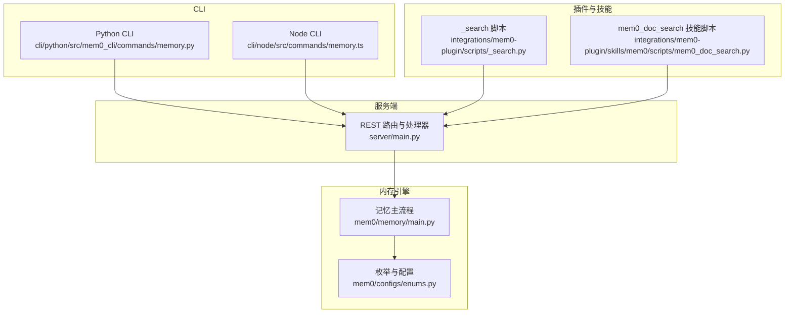
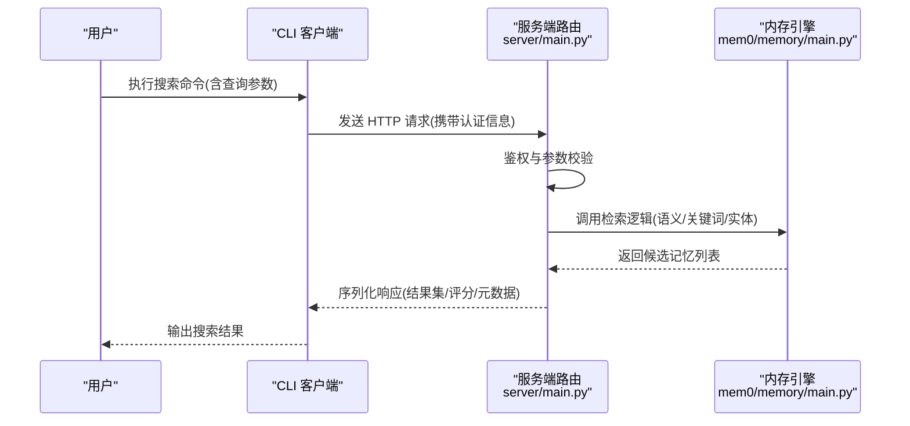
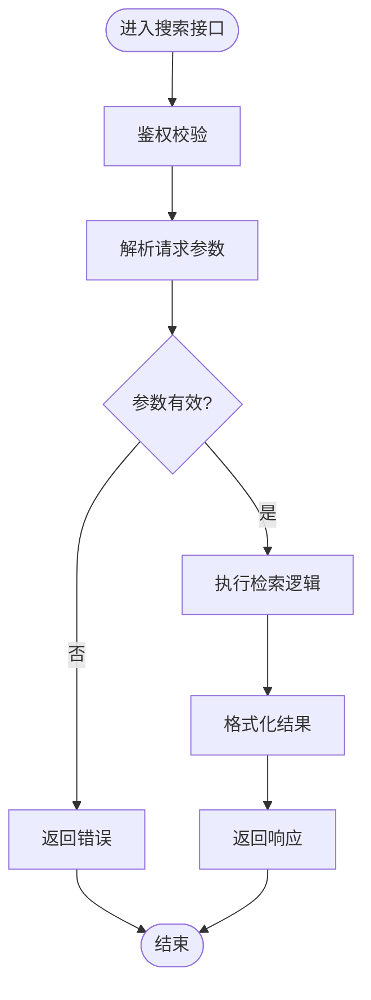
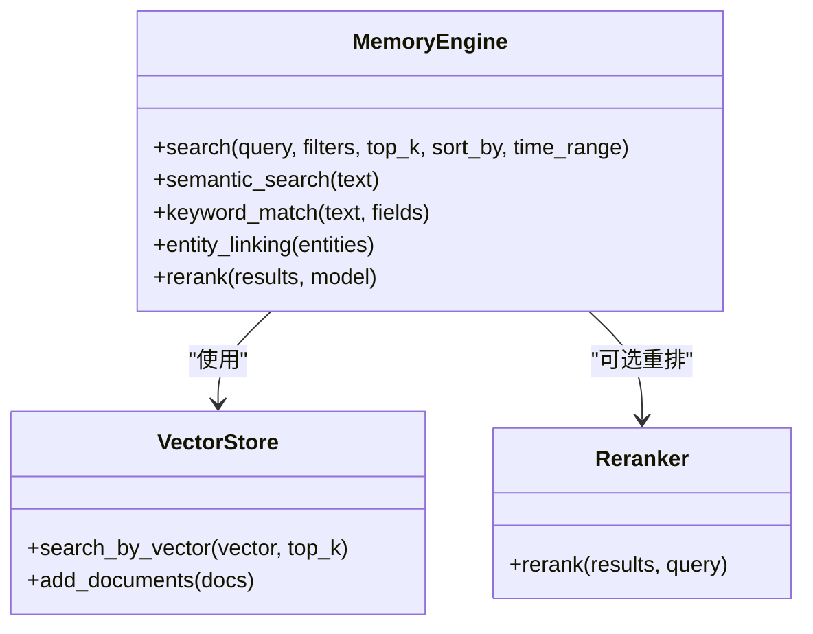
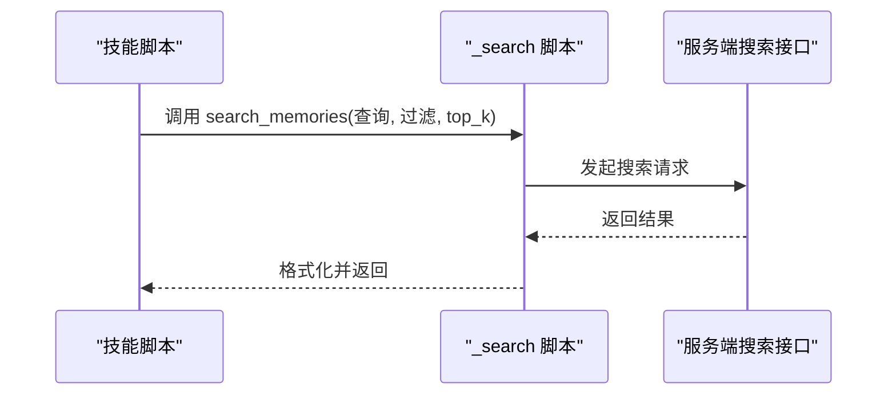
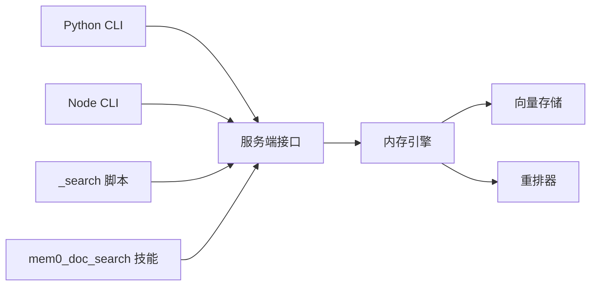

# 记忆搜索和检索

<cite>
**本文引用的文件**
- [cli/python/src/mem0_cli/commands/memory.py](file://cli/python/src/mem0_cli/commands/memory.py)
- [cli/node/src/commands/memory.ts](file://cli/node/src/commands/memory.ts)
- [server/main.py](file://server/main.py)
- [integrations/mem0-plugin/scripts/_search.py](file://integrations/mem0-plugin/scripts/_search.py)
- [integrations/mem0-plugin/skills/mem0/scripts/mem0_doc_search.py](file://integrations/mem0-plugin/skills/mem0/scripts/mem0_doc_search.py)
- [mem0/memory/main.py](file://mem0/memory/main.py)
- [mem0/configs/enums.py](file://mem0/configs/enums.py)
- [docs/api-reference/memory/search-memories.mdx](file://docs/api-reference/memory/search-memories.mdx)
- [docs/core-concepts/memory-operations/search.mdx](file://docs/core-concepts/memory-operations/search.mdx)
- [docs/platform/features/criteria-retrieval.mdx](file://docs/platform/features/criteria-retrieval.mdx)
- [docs/platform/features/entity-scoped-memory.mdx](file://docs/platform/features/entity-scoped-memory.mdx)
- [docs/platform/features/temporal-reasoning.mdx](file://docs/platform/features/temporal-reasoning.mdx)
- [docs/open-source/features/reranker-search.mdx](file://docs/open-source/features/reranker-search.mdx)
- [docs/platform/advanced-memory-operations.mdx](file://docs/platform/advanced-memory-operations.mdx)
- [examples/misc/personalized_search.py](file://examples/misc/personalized_search.py)
</cite>

## 目录
1. [简介](#简介)
2. [项目结构](#项目结构)
3. [核心组件](#核心组件)
4. [架构总览](#架构总览)
5. [详细组件分析](#详细组件分析)
6. [依赖关系分析](#依赖关系分析)
7. [性能考虑](#性能考虑)
8. [故障排除指南](#故障排除指南)
9. [结论](#结论)
10. [附录](#附录)

## 简介
本指南面向使用 mem0 的开发者与平台用户，系统讲解“记忆搜索与检索”能力，覆盖 CLI 命令、REST API、插件脚本与内部实现的关键路径。内容包括：
- 搜索命令的查询选项与参数配置
- 语义检索、关键词匹配、实体链接等检索模式
- 过滤条件、排序规则、分页参数的使用
- 复杂查询场景（多条件组合、时间范围筛选）示例
- 搜索结果格式说明与最佳实践

## 项目结构
围绕“记忆搜索与检索”，本仓库的关键位置如下：
- CLI 层：Python 与 Node 两端均提供 memory 相关命令入口
- 服务端层：REST 接口定义与实现，负责接收请求、执行检索与返回结果
- 内存引擎层：核心检索逻辑、向量存储、重排器、实体提取等
- 插件与技能层：在外部工具中集成搜索能力
- 文档层：官方 API 参考与概念指南

**图表来源**
- [cli/python/src/mem0_cli/commands/memory.py](file://cli/python/src/mem0_cli/commands/memory.py)
- [cli/node/src/commands/memory.ts](file://cli/node/src/commands/memory.ts)
- [server/main.py](file://server/main.py)
- [mem0/memory/main.py](file://mem0/memory/main.py)
- [mem0/configs/enums.py](file://mem0/configs/enums.py)
- [integrations/mem0-plugin/scripts/_search.py](file://integrations/mem0-plugin/scripts/_search.py)
- [integrations/mem0-plugin/skills/mem0/scripts/mem0_doc_search.py](file://integrations/mem0-plugin/skills/mem0/scripts/mem0_doc_search.py)

**章节来源**
- [cli/python/src/mem0_cli/commands/memory.py](file://cli/python/src/mem0_cli/commands/memory.py)
- [cli/node/src/commands/memory.ts](file://cli/node/src/commands/memory.ts)
- [server/main.py](file://server/main.py)
- [mem0/memory/main.py](file://mem0/memory/main.py)
- [mem0/configs/enums.py](file://mem0/configs/enums.py)
- [integrations/mem0-plugin/scripts/_search.py](file://integrations/mem0-plugin/scripts/_search.py)
- [integrations/mem0-plugin/skills/mem0/scripts/mem0_doc_search.py](file://integrations/mem0-plugin/skills/mem0/scripts/mem0_doc_search.py)

## 核心组件
- CLI 搜索命令：提供本地或远程调用的记忆检索入口，支持多种查询参数与输出格式
- 服务端搜索接口：统一处理请求、校验鉴权、路由到内存引擎，并返回标准化结果
- 内存引擎：封装检索算法、向量相似度、元数据过滤、重排器与实体链接
- 插件与技能：在外部工具链中嵌入搜索能力，便于自动化与工作流集成
- 文档与示例：官方 API 参考与示例脚本，帮助理解参数与使用方式

**章节来源**
- [docs/api-reference/memory/search-memories.mdx](file://docs/api-reference/memory/search-memories.mdx)
- [docs/core-concepts/memory-operations/search.mdx](file://docs/core-concepts/memory-operations/search.mdx)

## 架构总览
下图展示从 CLI 到服务端再到内存引擎的整体调用链路。

**图表来源**
- [server/main.py](file://server/main.py)
- [mem0/memory/main.py](file://mem0/memory/main.py)

**章节来源**
- [server/main.py](file://server/main.py)
- [mem0/memory/main.py](file://mem0/memory/main.py)

## 详细组件分析

### CLI 搜索命令
- Python CLI：通过 memory 子命令暴露搜索功能，支持查询文本、过滤条件、分页与输出控制
- Node CLI：提供同等能力的 TypeScript 实现，便于在 Node 生态中集成

使用要点：
- 查询参数：文本查询、过滤键值对、top_k、排序字段、时间范围等
- 输出格式：JSON/表格/简洁模式，便于机器与人类消费
- 配置来源：全局配置文件、环境变量、命令行参数

**章节来源**
- [cli/python/src/mem0_cli/commands/memory.py](file://cli/python/src/mem0_cli/commands/memory.py)
- [cli/node/src/commands/memory.ts](file://cli/node/src/commands/memory.ts)

### 服务端搜索接口
- 路由与处理器：在服务端定义统一的搜索端点，接收请求并进行鉴权
- 请求模型：包含查询文本、过滤条件、排序规则、分页参数等
- 响应模型：标准化的结果列表，包含记忆内容、相似度分数、元数据与时间戳

**图表来源**
- [server/main.py](file://server/main.py)

**章节来源**
- [server/main.py](file://server/main.py)

### 内存引擎与检索模式
- 语义检索：基于向量相似度计算，适合意图与上下文匹配
- 关键词匹配：基于文本关键词与元数据字段的精确/模糊匹配
- 实体链接：结合实体抽取与命名实体识别，提升跨文档一致性检索
- 重排器：可选地对候选结果进行再排序，提高相关性
- 时间与空间过滤：支持按时间范围、项目/用户域、类别/标签等过滤

**图表来源**
- [mem0/memory/main.py](file://mem0/memory/main.py)
- [mem0/configs/enums.py](file://mem0/configs/enums.py)

**章节来源**
- [mem0/memory/main.py](file://mem0/memory/main.py)
- [mem0/configs/enums.py](file://mem0/configs/enums.py)

### 插件与技能中的搜索
- 插件脚本：提供可复用的 search_memories 函数，支持 API 错误处理、响应类型判断与 top_k 控制
- 技能脚本：在外部工具中以技能形式调用搜索，便于工作流编排

**图表来源**
- [integrations/mem0-plugin/scripts/_search.py](file://integrations/mem0-plugin/scripts/_search.py)
- [integrations/mem0-plugin/skills/mem0/scripts/mem0_doc_search.py](file://integrations/mem0-plugin/skills/mem0/scripts/mem0_doc_search.py)
- [server/main.py](file://server/main.py)

**章节来源**
- [integrations/mem0-plugin/scripts/_search.py](file://integrations/mem0-plugin/scripts/_search.py)
- [integrations/mem0-plugin/skills/mem0/scripts/mem0_doc_search.py](file://integrations/mem0-plugin/skills/mem0/scripts/mem0_doc_search.py)

### 检索模式详解
- 语义搜索：适合表达意图而非字面匹配的场景，如“总结上周会议要点”
- 关键词匹配：适合精确检索，如按标签、类别或特定字段筛选
- 实体链接：在多段记忆中定位同一实体的不同表述，提升召回稳定性
- 组合策略：先关键词粗筛，再语义精排；或先实体链接聚合，再按时间/热度排序

**章节来源**
- [docs/platform/features/entity-scoped-memory.mdx](file://docs/platform/features/entity-scoped-memory.mdx)
- [docs/platform/features/temporal-reasoning.mdx](file://docs/platform/features/temporal-reasoning.mdx)
- [docs/open-source/features/reranker-search.mdx](file://docs/open-source/features/reranker-search.mdx)

### 参数与查询选项
- 查询文本：必填或可选，取决于检索模式
- 过滤条件：支持元数据键值过滤、时间范围、项目/用户域
- 排序规则：按相似度、时间、热度等字段排序
- 分页参数：top_k、offset/page_size 控制返回数量与页码
- 重排器：可选启用，提升最终相关性

参考官方 API 文档以获取参数表与默认值。

**章节来源**
- [docs/api-reference/memory/search-memories.mdx](file://docs/api-reference/memory/search-memories.mdx)

### 复杂查询场景示例
- 多条件组合：同时指定关键词、标签与时间范围，先关键词过滤，再语义打分
- 时间范围筛选：限定最近 N 天内的记忆，结合热度排序
- 实体跨文档检索：输入多个实体名，合并其相关记忆并去重
- 结果二次加工：将检索结果传给重排器，或进一步分类统计

示例脚本展示了如何在外部环境中组织这些步骤。

**章节来源**
- [examples/misc/personalized_search.py](file://examples/misc/personalized_search.py)

### 搜索结果格式说明
- 字段概览：记忆 ID、内容、相似度分数、时间戳、元数据（标签、类别、来源等）
- 排序与分页：top_k 控制返回条数；offset/page_size 支持分页浏览
- 结果形态：数组对象，便于直接序列化为 JSON 或表格展示

**章节来源**
- [docs/api-reference/memory/search-memories.mdx](file://docs/api-reference/memory/search-memories.mdx)

## 依赖关系分析
- CLI 依赖服务端接口；服务端依赖内存引擎；内存引擎依赖向量存储与可选重排器
- 插件与技能通过服务端暴露的能力间接耦合
- 配置枚举统一了检索模式与行为开关

**图表来源**
- [cli/python/src/mem0_cli/commands/memory.py](file://cli/python/src/mem0_cli/commands/memory.py)
- [cli/node/src/commands/memory.ts](file://cli/node/src/commands/memory.ts)
- [server/main.py](file://server/main.py)
- [mem0/memory/main.py](file://mem0/memory/main.py)
- [integrations/mem0-plugin/scripts/_search.py](file://integrations/mem0-plugin/scripts/_search.py)
- [integrations/mem0-plugin/skills/mem0/scripts/mem0_doc_search.py](file://integrations/mem0-plugin/skills/mem0/scripts/mem0_doc_search.py)

**章节来源**
- [cli/python/src/mem0_cli/commands/memory.py](file://cli/python/src/mem0_cli/commands/memory.py)
- [cli/node/src/commands/memory.ts](file://cli/node/src/commands/memory.ts)
- [server/main.py](file://server/main.py)
- [mem0/memory/main.py](file://mem0/memory/main.py)
- [integrations/mem0-plugin/scripts/_search.py](file://integrations/mem0-plugin/scripts/_search.py)
- [integrations/mem0-plugin/skills/mem0/scripts/mem0_doc_search.py](file://integrations/mem0-plugin/skills/mem0/scripts/mem0_doc_search.py)

## 性能考虑
- 向量检索：合理设置 top_k，避免过大导致延迟上升；必要时开启索引优化
- 元数据过滤：优先使用高选择性的过滤键，减少候选集规模
- 重排器：仅在需要时启用，避免额外计算开销
- 缓存策略：对热点查询结果进行短期缓存
- 分页与并发：控制单次 top_k，结合分页与限速避免峰值抖动

[本节为通用指导，不直接分析具体文件]

## 故障排除指南
- 无 API 密钥：当密钥为空时，搜索可能返回空结果或报错，需检查配置
- 响应类型异常：确认返回是否为列表或对象，按测试用例处理不同形态
- top_k 不生效：检查客户端与服务端参数映射，确保传递正确
- API 错误处理：捕获网络/鉴权/参数错误，记录状态码与消息以便排查

**章节来源**
- [integrations/mem0-plugin/tests/test_search.py](file://integrations/mem0-plugin/tests/test_search.py)

## 结论
通过 CLI、服务端接口与内存引擎的协同，mem0 提供了灵活且强大的记忆检索能力。建议根据业务场景选择合适的检索模式，合理配置过滤与排序，并结合重排器与实体链接提升结果质量。遵循本文参数与最佳实践，可在复杂查询场景中获得稳定、可预期的检索效果。

[本节为总结性内容，不直接分析具体文件]

## 附录
- 相关特性文档：高级检索、实体作用域记忆、时间推理、重排器搜索
- 平台与开源差异：平台版提供更多高级特性与托管能力，开源版可自建基础设施

**章节来源**
- [docs/platform/features/criteria-retrieval.mdx](file://docs/platform/features/criteria-retrieval.mdx)
- [docs/platform/features/entity-scoped-memory.mdx](file://docs/platform/features/entity-scoped-memory.mdx)
- [docs/platform/features/temporal-reasoning.mdx](file://docs/platform/features/temporal-reasoning.mdx)
- [docs/open-source/features/reranker-search.mdx](file://docs/open-source/features/reranker-search.mdx)
- [docs/platform/advanced-memory-operations.mdx](file://docs/platform/advanced-memory-operations.mdx)