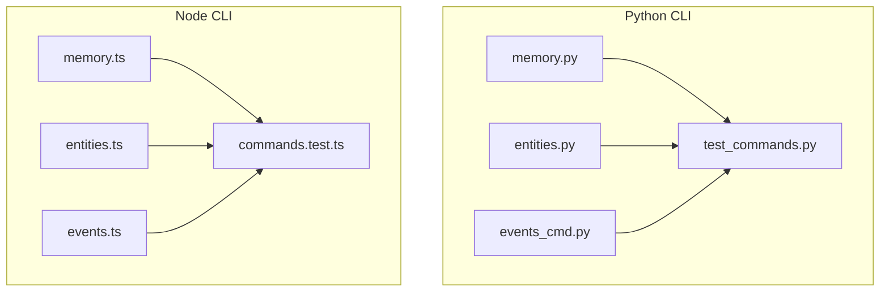
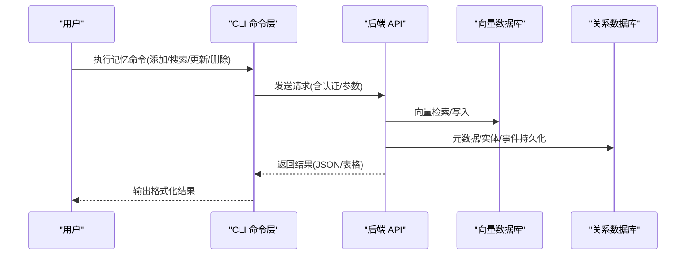
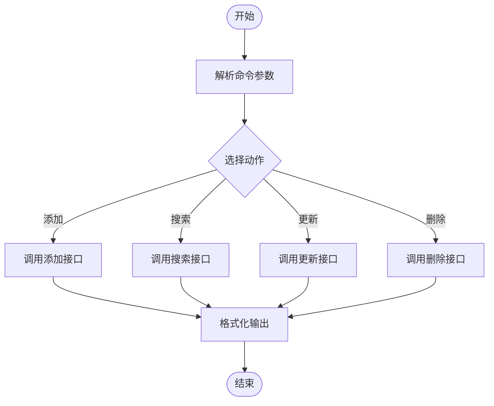
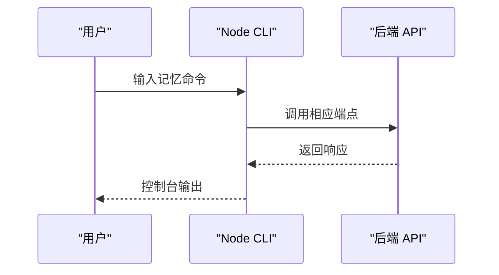
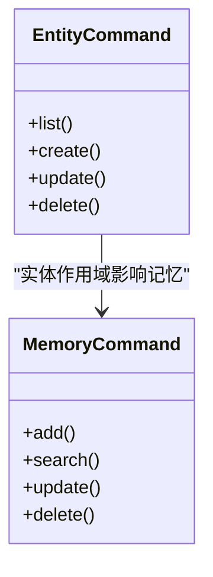
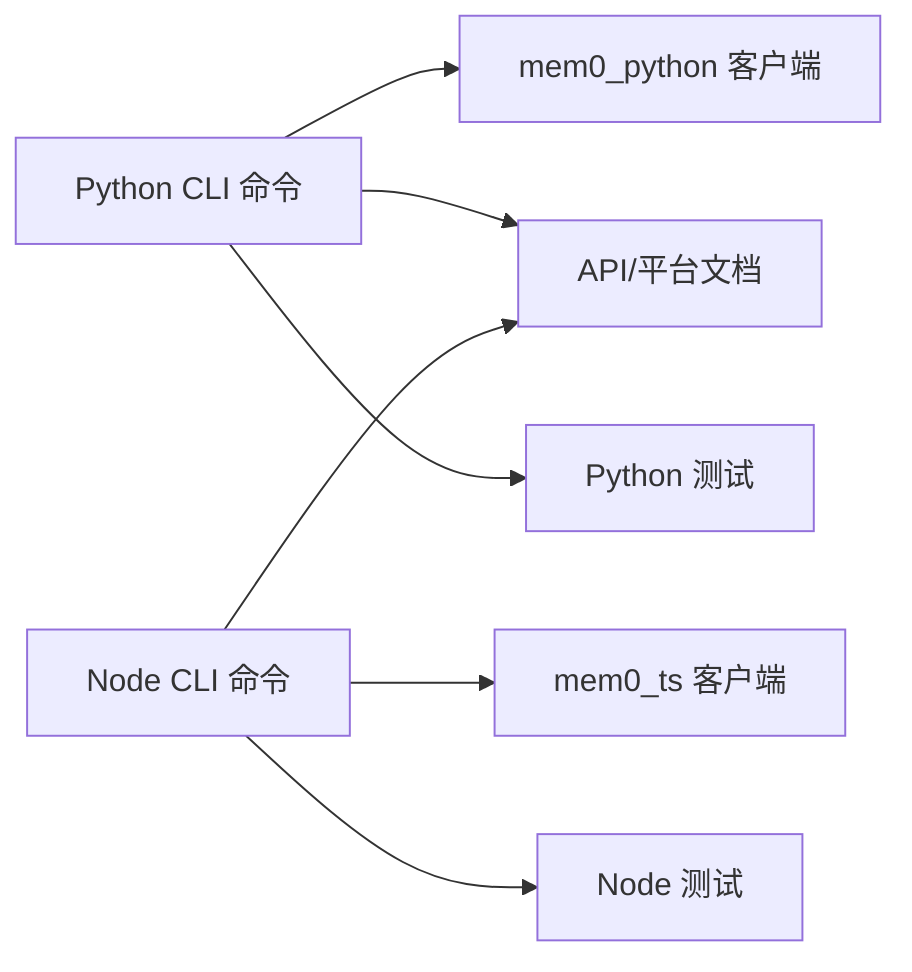

# 记忆操作命令

<cite>
**本文引用的文件**
- [cli/python/src/mem0_cli/commands/memory.py](file://cli/python/src/mem0_cli/commands/memory.py)
- [cli/node/src/commands/memory.ts](file://cli/node/src/commands/memory.ts)
- [cli/python/src/mem0_cli/commands/entities.py](file://cli/python/src/mem0_cli/commands/entities.py)
- [cli/node/src/commands/entities.ts](file://cli/node/src/commands/entities.ts)
- [cli/python/src/mem0_cli/commands/events_cmd.py](file://cli/python/src/mem0_cli/commands/events_cmd.py)
- [cli/node/src/commands/events.ts](file://cli/node/src/commands/events.ts)
- [cli/python/tests/test_commands.py](file://cli/python/tests/test_commands.py)
- [cli/node/tests/commands.test.ts](file://cli/node/tests/commands.test.ts)
- [docs/api-reference/memory/add-memories.mdx](file://docs/api-reference/memory/add-memories.mdx)
- [docs/api-reference/memory/search-memories.mdx](file://docs/api-reference/memory/search-memories.mdx)
- [docs/api-reference/memory/update-memory.mdx](file://docs/api-reference/memory/update-memory.mdx)
- [docs/api-reference/memory/delete-memories.mdx](file://docs/api-reference/memory/delete-memories.mdx)
- [docs/api-reference/entities/get-users.mdx](file://docs/api-reference/entities/get-users.mdx)
- [docs/api-reference/events/get-events.mdx](file://docs/api-reference/events/get-events.mdx)
- [docs/platform/features/entity-scoped-memory.mdx](file://docs/platform/features/entity-scoped-memory.mdx)
- [docs/platform/features/criteria-retrieval.mdx](file://docs/platform/features/criteria-retrieval.mdx)
- [docs/platform/features/v2-memory-filters.mdx](file://docs/platform/features/v2-memory-filters.mdx)
- [docs/platform/advanced-memory-operations.mdx](file://docs/platform/advanced-memory-operations.mdx)
- [docs/cookbooks/essentials/building-ai-companion.mdx](file://docs/cookbooks/essentials/building-ai-companion.mdx)
- [docs/cookbooks/essentials/tagging-and-organizing-memories.mdx](file://docs/cookbooks/essentials/tagging-and-organizing-memories.mdx)
- [docs/cookbooks/essentials/exporting-memories.mdx](file://docs/cookbooks/essentials/exporting-memories.mdx)
</cite>

## 目录
1. [简介](#简介)
2. [项目结构](#项目结构)
3. [核心组件](#核心组件)
4. [架构总览](#架构总览)
5. [详细组件分析](#详细组件分析)
6. [依赖关系分析](#依赖关系分析)
7. [性能考虑](#性能考虑)
8. [故障排除指南](#故障排除指南)
9. [结论](#结论)
10. [附录](#附录)

## 简介
本指南面向使用 mem0 的开发者与运维人员，系统讲解记忆操作命令的完整用法，包括添加记忆、搜索记忆、更新记忆、删除记忆等核心功能；覆盖实体管理、事件管理等高级能力；提供批量操作示例与最佳实践；解释记忆过滤、排序与分页参数；并通过实际案例展示复杂查询与条件筛选。

## 项目结构
mem0 提供 Python 与 Node 两套 CLI 实现，均在各自语言目录下维护命令模块。记忆相关命令位于：
- Python: cli/python/src/mem0_cli/commands/memory.py
- Node: cli/node/src/commands/memory.ts

实体与事件管理分别位于：
- Python: cli/python/src/mem0_cli/commands/entities.py, events_cmd.py
- Node: cli/node/src/commands/entities.ts, events.ts

测试用例位于：
- Python: cli/python/tests/test_commands.py
- Node: cli/node/tests/commands.test.ts

官方文档提供了 API 参考与平台特性说明，是理解参数与行为的重要依据。

**图表来源**
- [cli/python/src/mem0_cli/commands/memory.py](file://cli/python/src/mem0_cli/commands/memory.py)
- [cli/node/src/commands/memory.ts](file://cli/node/src/commands/memory.ts)
- [cli/python/src/mem0_cli/commands/entities.py](file://cli/python/src/mem0_cli/commands/entities.py)
- [cli/node/src/commands/entities.ts](file://cli/node/src/commands/entities.ts)
- [cli/python/tests/test_commands.py](file://cli/python/tests/test_commands.py)
- [cli/node/tests/commands.test.ts](file://cli/node/tests/commands.test.ts)

**章节来源**
- [cli/python/src/mem0_cli/commands/memory.py](file://cli/python/src/mem0_cli/commands/memory.py)
- [cli/node/src/commands/memory.ts](file://cli/node/src/commands/memory.ts)
- [cli/python/src/mem0_cli/commands/entities.py](file://cli/python/src/mem0_cli/commands/entities.py)
- [cli/node/src/commands/entities.ts](file://cli/node/src/commands/entities.ts)
- [cli/python/tests/test_commands.py](file://cli/python/tests/test_commands.py)
- [cli/node/tests/commands.test.ts](file://cli/node/tests/commands.test.ts)

## 核心组件
本节概述记忆操作命令的核心职责与交互模式：
- 添加记忆：支持单条与批量新增，可设置元数据、分类、时间戳等属性
- 搜索记忆：支持关键词检索、向量相似度检索、过滤与排序、分页
- 更新记忆：按 ID 更新内容或元数据，支持增量更新
- 删除记忆：支持单条删除与批量删除
- 实体管理：用户/实体的增删改查与权限关联
- 事件管理：事件记录的查询与导出
- 高级特性：实体作用域记忆、条件检索、过滤器与排序

上述能力在 Python 与 Node 两端均有对应实现，并通过测试用例验证基本行为。

**章节来源**
- [cli/python/src/mem0_cli/commands/memory.py](file://cli/python/src/mem0_cli/commands/memory.py)
- [cli/node/src/commands/memory.ts](file://cli/node/src/commands/memory.ts)
- [cli/python/tests/test_commands.py](file://cli/python/tests/test_commands.py)
- [cli/node/tests/commands.test.ts](file://cli/node/tests/commands.test.ts)

## 架构总览
下图展示了记忆命令在 CLI 中的调用链路与外部服务交互：

该流程体现了 CLI 作为前端工具对后端 API 的封装，以及对向量存储与关系存储的协同访问。

[此图为概念性架构示意，不直接映射具体源码文件，故无“图表来源”]

## 详细组件分析

### 记忆命令（Python）
- 添加记忆：支持单条与批量新增，参数包括内容、元数据、分类、时间戳等
- 搜索记忆：支持关键词与向量检索，过滤字段、排序字段、分页参数
- 更新记忆：按 ID 更新内容或元数据
- 删除记忆：按 ID 或条件批量删除
- 批量操作：批量更新与批量删除接口
- 导出与反馈：支持导出与反馈机制（参考平台文档）

**图表来源**
- [cli/python/src/mem0_cli/commands/memory.py](file://cli/python/src/mem0_cli/commands/memory.py)

**章节来源**
- [cli/python/src/mem0_cli/commands/memory.py](file://cli/python/src/mem0_cli/commands/memory.py)
- [docs/api-reference/memory/add-memories.mdx](file://docs/api-reference/memory/add-memories.mdx)
- [docs/api-reference/memory/search-memories.mdx](file://docs/api-reference/memory/search-memories.mdx)
- [docs/api-reference/memory/update-memory.mdx](file://docs/api-reference/memory/update-memory.mdx)
- [docs/api-reference/memory/delete-memories.mdx](file://docs/api-reference/memory/delete-memories.mdx)

### 记忆命令（Node）
- 功能与 Python 版本一致，提供相同的命令入口与参数模型
- 支持批量操作、过滤、排序与分页
- 输出格式与错误处理遵循 Node 端约定

**图表来源**
- [cli/node/src/commands/memory.ts](file://cli/node/src/commands/memory.ts)

**章节来源**
- [cli/node/src/commands/memory.ts](file://cli/node/src/commands/memory.ts)

### 实体管理命令（Python）
- 用户/实体的查询、创建、更新、删除
- 与记忆的实体作用域关联
- 平台特性支持实体级记忆隔离与权限控制

**图表来源**
- [cli/python/src/mem0_cli/commands/entities.py](file://cli/python/src/mem0_cli/commands/entities.py)

**章节来源**
- [cli/python/src/mem0_cli/commands/entities.py](file://cli/python/src/mem0_cli/commands/entities.py)
- [docs/api-reference/entities/get-users.mdx](file://docs/api-reference/entities/get-users.mdx)
- [docs/platform/features/entity-scoped-memory.mdx](file://docs/platform/features/entity-scoped-memory.mdx)

### 实体管理命令（Node）
- 对应的实体 CRUD 操作
- 与记忆命令在 Node 端保持一致的参数与行为

**章节来源**
- [cli/node/src/commands/entities.ts](file://cli/node/src/commands/entities.ts)

### 事件管理命令（Python）
- 事件查询与详情查看
- 与记忆操作的审计与追踪关联

**章节来源**
- [cli/python/src/mem0_cli/commands/events_cmd.py](file://cli/python/src/mem0_cli/commands/events_cmd.py)
- [docs/api-reference/events/get-events.mdx](file://docs/api-reference/events/get-events.mdx)

### 事件管理命令（Node）
- 事件查询与详情查看
- 与记忆操作的审计与追踪关联

**章节来源**
- [cli/node/src/commands/events.ts](file://cli/node/src/commands/events.ts)

## 依赖关系分析
- Python CLI 依赖 mem0_python 客户端与内部命令模块
- Node CLI 依赖 mem0_ts 客户端与内部命令模块
- 测试用例覆盖命令行为与参数校验
- 文档为命令参数与行为提供权威参考

**图表来源**
- [cli/python/src/mem0_cli/commands/memory.py](file://cli/python/src/mem0_cli/commands/memory.py)
- [cli/node/src/commands/memory.ts](file://cli/node/src/commands/memory.ts)
- [cli/python/tests/test_commands.py](file://cli/python/tests/test_commands.py)
- [cli/node/tests/commands.test.ts](file://cli/node/tests/commands.test.ts)

**章节来源**
- [cli/python/src/mem0_cli/commands/memory.py](file://cli/python/src/mem0_cli/commands/memory.py)
- [cli/node/src/commands/memory.ts](file://cli/node/src/commands/memory.ts)
- [cli/python/tests/test_commands.py](file://cli/python/tests/test_commands.py)
- [cli/node/tests/commands.test.ts](file://cli/node/tests/commands.test.ts)

## 性能考虑
- 向量检索的 top_k 参数直接影响召回质量与性能，建议根据业务规模调整
- 过滤与排序会增加查询成本，建议仅在必要时启用
- 批量操作可显著提升吞吐，但需注意内存占用与网络带宽
- 分页参数合理设置可避免一次性返回大量数据导致的延迟
- 使用实体作用域与条件检索可减少无关数据扫描

[本节为通用指导，无需特定文件来源]

## 故障排除指南
- 参数缺失或类型错误：检查必填字段与数据类型，参考测试用例中的参数组合
- 权限不足：确认认证信息与实体权限配置
- 网络超时：检查后端服务状态与网络连通性
- 结果为空：确认过滤条件是否过于严格，或是否存在实体作用域限制

**章节来源**
- [cli/python/tests/test_commands.py](file://cli/python/tests/test_commands.py)
- [cli/node/tests/commands.test.ts](file://cli/node/tests/commands.test.ts)

## 结论
mem0 的记忆操作命令在 Python 与 Node 两端提供一致的功能与参数模型，结合实体与事件管理，形成完整的记忆生命周期管理方案。通过合理使用过滤、排序与分页，配合批量操作与平台特性，可在不同场景下获得高效稳定的体验。

[本节为总结性内容，无需特定文件来源]

## 附录

### 常用命令与参数速查
- 添加记忆：支持内容、元数据、分类、时间戳等字段
- 搜索记忆：关键词/向量检索、过滤字段、排序字段、分页
- 更新记忆：按 ID 更新内容或元数据
- 删除记忆：按 ID 或条件批量删除
- 实体管理：用户/实体的增删改查
- 事件管理：事件查询与详情查看

**章节来源**
- [docs/api-reference/memory/add-memories.mdx](file://docs/api-reference/memory/add-memories.mdx)
- [docs/api-reference/memory/search-memories.mdx](file://docs/api-reference/memory/search-memories.mdx)
- [docs/api-reference/memory/update-memory.mdx](file://docs/api-reference/memory/update-memory.mdx)
- [docs/api-reference/memory/delete-memories.mdx](file://docs/api-reference/memory/delete-memories.mdx)
- [docs/api-reference/entities/get-users.mdx](file://docs/api-reference/entities/get-users.mdx)
- [docs/api-reference/events/get-events.mdx](file://docs/api-reference/events/get-events.mdx)

### 高级特性与最佳实践
- 实体作用域记忆：为不同实体提供独立的记忆空间
- 条件检索：基于元数据与时间范围的精确检索
- 过滤与排序：结合业务需求优化检索结果
- 批量操作：提升大规模数据处理效率
- 导出与反馈：用于评估与持续改进

**章节来源**
- [docs/platform/features/entity-scoped-memory.mdx](file://docs/platform/features/entity-scoped-memory.mdx)
- [docs/platform/features/criteria-retrieval.mdx](file://docs/platform/features/criteria-retrieval.mdx)
- [docs/platform/features/v2-memory-filters.mdx](file://docs/platform/features/v2-memory-filters.mdx)
- [docs/platform/advanced-memory-operations.mdx](file://docs/platform/advanced-memory-operations.mdx)
- [docs/cookbooks/essentials/exporting-memories.mdx](file://docs/cookbooks/essentials/exporting-memories.mdx)