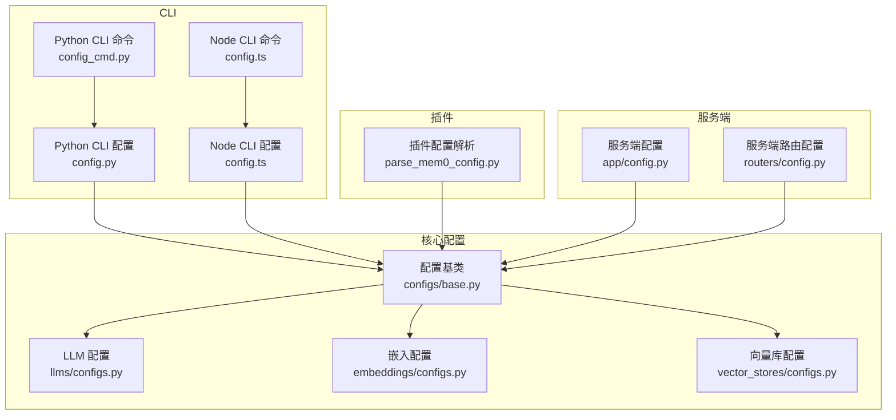
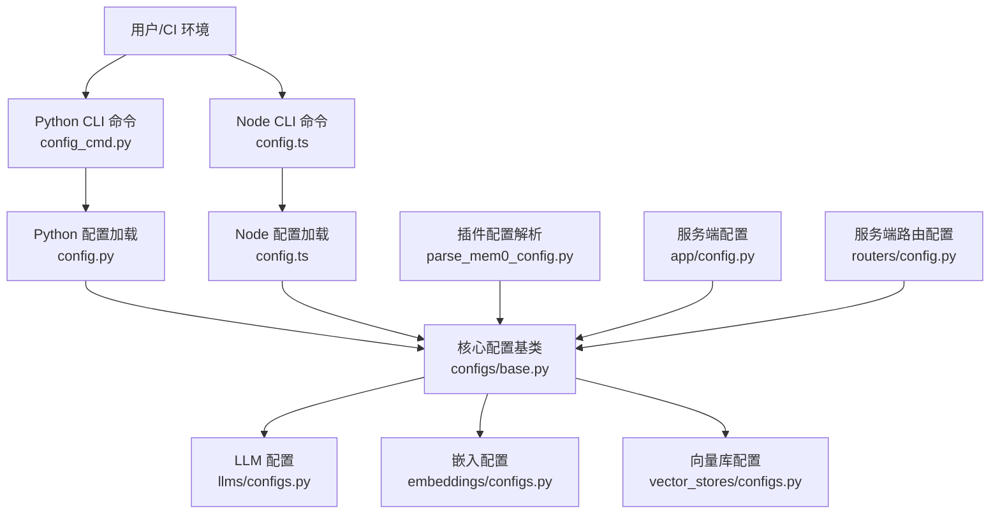
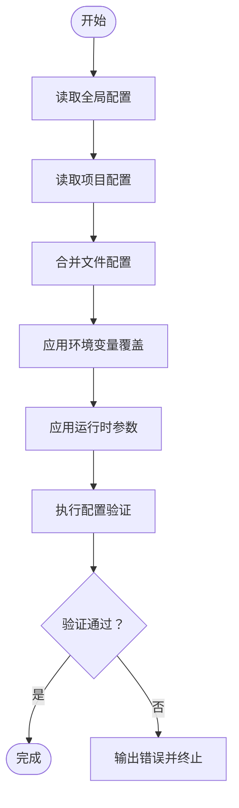
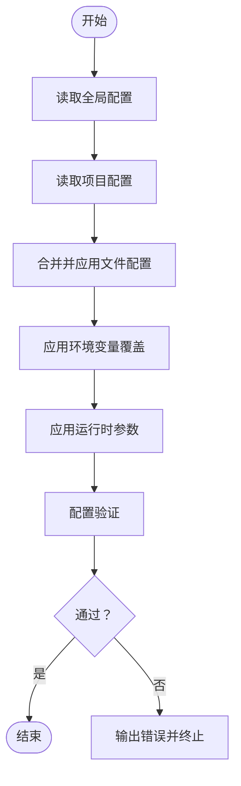
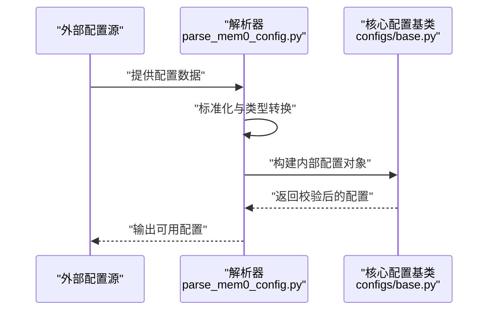
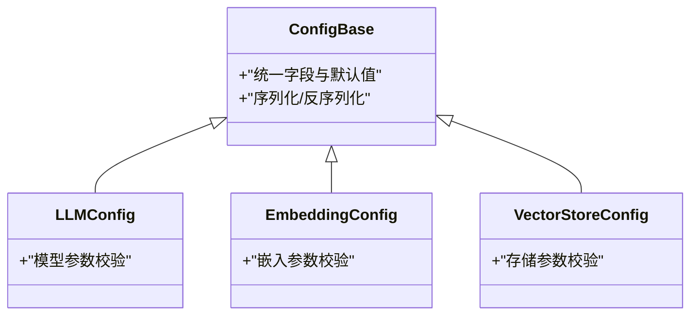
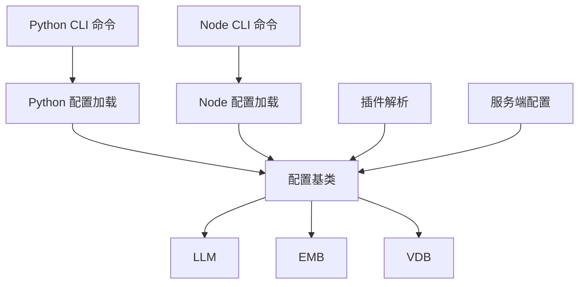

# 配置管理

<cite>
**本文引用的文件**
- [cli/python/src/mem0_cli/config.py](file://cli/python/src/mem0_cli/config.py)
- [cli/python/src/mem0_cli/commands/config_cmd.py](file://cli/python/src/mem0_cli/commands/config_cmd.py)
- [cli/node/src/config.ts](file://cli/node/src/config.ts)
- [cli/node/src/commands/config.ts](file://cli/node/src/commands/config.ts)
- [integrations/mem0-plugin/scripts/parse_mem0_config.py](file://integrations/mem0-plugin/scripts/parse_mem0_config.py)
- [openmemory/api/app/config.py](file://openmemory/api/app/config.py)
- [openmemory/api/app/routers/config.py](file://openmemory/api/app/routers/config.py)
- [mem0/configs/base.py](file://mem0/configs/base.py)
- [mem0/llms/configs.py](file://mem0/llms/configs.py)
- [mem0/embeddings/configs.py](file://mem0/embeddings/configs.py)
- [mem0/vector_stores/configs.py](file://mem0/vector_stores/configs.py)
- [openmemory/backup-scripts/export_openmemory.sh](file://openmemory/backup-scripts/export_openmemory.sh)
- [cli/python/tests/test_config.py](file://cli/python/tests/test_config.py)
- [cli/node/tests/config.test.ts](file://cli/node/tests/config.test.ts)
</cite>

## 目录
1. [简介](#简介)
2. [项目结构](#项目结构)
3. [核心组件](#核心组件)
4. [架构总览](#架构总览)
5. [详细组件分析](#详细组件分析)
6. [依赖关系分析](#依赖关系分析)
7. [性能考量](#性能考量)
8. [故障排查指南](#故障排查指南)
9. [结论](#结论)
10. [附录](#附录)

## 简介
本指南聚焦于 CLI 的配置管理，系统性阐述配置文件的层级与结构（全局配置、项目配置、运行时配置）、环境变量优先级与覆盖规则、配置验证与调试方法、配置迁移与备份恢复流程，以及多环境下的最佳实践。内容基于仓库中 Python 与 Node 两套 CLI 实现、插件解析脚本、服务端配置模块与向量存储/嵌入/大模型等配置定义进行归纳总结。

## 项目结构
CLI 配置相关分布在以下位置：
- Python CLI：命令实现与配置加载逻辑位于 [cli/python/src/mem0_cli/commands/config_cmd.py](file://cli/python/src/mem0_cli/commands/config_cmd.py) 与 [cli/python/src/mem0_cli/config.py](file://cli/python/src/mem0_cli/config.py)
- Node CLI：命令实现与配置加载逻辑位于 [cli/node/src/commands/config.ts](file://cli/node/src/commands/config.ts) 与 [cli/node/src/config.ts](file://cli/node/src/config.ts)
- 插件侧配置解析：[integrations/mem0-plugin/scripts/parse_mem0_config.py](file://integrations/mem0-plugin/scripts/parse_mem0_config.py)
- 服务端配置：[openmemory/api/app/config.py](file://openmemory/api/app/config.py)、[openmemory/api/app/routers/config.py](file://openmemory/api/app/routers/config.py)
- 核心配置基类与各子系统配置：[mem0/configs/base.py](file://mem0/configs/base.py)、[mem0/llms/configs.py](file://mem0/llms/configs.py)、[mem0/embeddings/configs.py](file://mem0/embeddings/configs.py)、[mem0/vector_stores/configs.py](file://mem0/vector_stores/configs.py)

图表来源
- [cli/python/src/mem0_cli/config.py](file://cli/python/src/mem0_cli/config.py)
- [cli/python/src/mem0_cli/commands/config_cmd.py](file://cli/python/src/mem0_cli/commands/config_cmd.py)
- [cli/node/src/config.ts](file://cli/node/src/config.ts)
- [cli/node/src/commands/config.ts](file://cli/node/src/commands/config.ts)
- [integrations/mem0-plugin/scripts/parse_mem0_config.py](file://integrations/mem0-plugin/scripts/parse_mem0_config.py)
- [openmemory/api/app/config.py](file://openmemory/api/app/config.py)
- [openmemory/api/app/routers/config.py](file://openmemory/api/app/routers/config.py)
- [mem0/configs/base.py](file://mem0/configs/base.py)
- [mem0/llms/configs.py](file://mem0/llms/configs.py)
- [mem0/embeddings/configs.py](file://mem0/embeddings/configs.py)
- [mem0/vector_stores/configs.py](file://mem0/vector_stores/configs.py)

章节来源
- [cli/python/src/mem0_cli/config.py](file://cli/python/src/mem0_cli/config.py)
- [cli/python/src/mem0_cli/commands/config_cmd.py](file://cli/python/src/mem0_cli/commands/config_cmd.py)
- [cli/node/src/config.ts](file://cli/node/src/config.ts)
- [cli/node/src/commands/config.ts](file://cli/node/src/commands/config.ts)
- [integrations/mem0-plugin/scripts/parse_mem0_config.py](file://integrations/mem0-plugin/scripts/parse_mem0_config.py)
- [openmemory/api/app/config.py](file://openmemory/api/app/config.py)
- [openmemory/api/app/routers/config.py](file://openmemory/api/app/routers/config.py)
- [mem0/configs/base.py](file://mem0/configs/base.py)
- [mem0/llms/configs.py](file://mem0/llms/configs.py)
- [mem0/embeddings/configs.py](file://mem0/embeddings/configs.py)
- [mem0/vector_stores/configs.py](file://mem0/vector_stores/configs.py)

## 核心组件
- Python CLI 配置加载与命令入口：负责从用户目录或项目目录读取配置，并在命令执行时合并运行时参数。
- Node CLI 配置加载与命令入口：与 Python CLI 对应，提供相同的配置读取与覆盖机制。
- 插件配置解析：将外部配置转换为内部可识别的结构，便于后续初始化。
- 服务端配置：提供平台侧的默认配置与路由层的配置暴露。
- 核心配置基类与子系统配置：定义统一的配置结构、字段校验与默认值策略。

章节来源
- [cli/python/src/mem0_cli/config.py](file://cli/python/src/mem0_cli/config.py)
- [cli/python/src/mem0_cli/commands/config_cmd.py](file://cli/python/src/mem0_cli/commands/config_cmd.py)
- [cli/node/src/config.ts](file://cli/node/src/config.ts)
- [cli/node/src/commands/config.ts](file://cli/node/src/commands/config.ts)
- [integrations/mem0-plugin/scripts/parse_mem0_config.py](file://integrations/mem0-plugin/scripts/parse_mem0_config.py)
- [openmemory/api/app/config.py](file://openmemory/api/app/config.py)
- [openmemory/api/app/routers/config.py](file://openmemory/api/app/routers/config.py)
- [mem0/configs/base.py](file://mem0/configs/base.py)
- [mem0/llms/configs.py](file://mem0/llms/configs.py)
- [mem0/embeddings/configs.py](file://mem0/embeddings/configs.py)
- [mem0/vector_stores/configs.py](file://mem0/vector_stores/configs.py)

## 架构总览
下图展示 CLI 配置在不同语言实现中的交互关系，以及与核心配置模块、插件与服务端的衔接。

图表来源
- [cli/python/src/mem0_cli/commands/config_cmd.py](file://cli/python/src/mem0_cli/commands/config_cmd.py)
- [cli/python/src/mem0_cli/config.py](file://cli/python/src/mem0_cli/config.py)
- [cli/node/src/commands/config.ts](file://cli/node/src/commands/config.ts)
- [cli/node/src/config.ts](file://cli/node/src/config.ts)
- [mem0/configs/base.py](file://mem0/configs/base.py)
- [mem0/llms/configs.py](file://mem0/llms/configs.py)
- [mem0/embeddings/configs.py](file://mem0/embeddings/configs.py)
- [mem0/vector_stores/configs.py](file://mem0/vector_stores/configs.py)
- [integrations/mem0-plugin/scripts/parse_mem0_config.py](file://integrations/mem0-plugin/scripts/parse_mem0_config.py)
- [openmemory/api/app/config.py](file://openmemory/api/app/config.py)
- [openmemory/api/app/routers/config.py](file://openmemory/api/app/routers/config.py)

## 详细组件分析

### Python CLI 配置加载与命令
- 配置读取顺序与覆盖
  - 全局配置：通常来自用户主目录下的配置文件（例如用户级配置文件路径）。
  - 项目配置：当前工作目录或指定项目目录下的配置文件。
  - 运行时配置：命令行参数、环境变量注入，优先级高于文件配置。
- 环境变量优先级
  - 环境变量键名遵循统一前缀与点号分隔的命名规范，用于覆盖对应配置项。
  - 运行时传入的环境变量在命令执行阶段生效，优先于文件配置。
- 配置验证
  - 在加载后对关键字段进行类型与范围校验；若缺失必要字段则抛出明确错误提示。
  - 支持输出当前生效的完整配置以供审计与排障。
- 调试建议
  - 使用“显示当前配置”命令打印最终合并后的配置树。
  - 检查环境变量是否正确设置且未被 shell 或 CI 环境覆盖。
  - 对比全局与项目配置文件差异，确认覆盖链路。

图表来源
- [cli/python/src/mem0_cli/commands/config_cmd.py](file://cli/python/src/mem0_cli/commands/config_cmd.py)
- [cli/python/src/mem0_cli/config.py](file://cli/python/src/mem0_cli/config.py)

章节来源
- [cli/python/src/mem0_cli/commands/config_cmd.py](file://cli/python/src/mem0_cli/commands/config_cmd.py)
- [cli/python/src/mem0_cli/config.py](file://cli/python/src/mem0_cli/config.py)

### Node CLI 配置加载与命令
- 配置读取顺序与覆盖
  - 全局配置：用户主目录下的配置文件。
  - 项目配置：当前工作目录或指定项目目录下的配置文件。
  - 运行时配置：命令行参数、环境变量注入，优先级高于文件配置。
- 环境变量优先级
  - 采用与 Python CLI 一致的命名规范，确保跨语言一致性。
- 配置验证与调试
  - 提供“查看当前配置”能力，输出合并后的配置树。
  - 对不合法或缺失的关键字段给出清晰报错信息。

图表来源
- [cli/node/src/commands/config.ts](file://cli/node/src/commands/config.ts)
- [cli/node/src/config.ts](file://cli/node/src/config.ts)

章节来源
- [cli/node/src/commands/config.ts](file://cli/node/src/commands/config.ts)
- [cli/node/src/config.ts](file://cli/node/src/config.ts)

### 插件配置解析
- 功能概述
  - 将外部输入（如 JSON/YAML 字符串、文件路径）解析为内部统一的配置对象。
  - 与核心配置基类对接，保证不同来源的配置能被一致处理。
- 关键流程
  - 输入预处理：标准化键名、类型转换。
  - 与核心配置合并：保留必需字段，补充默认值。
  - 输出校验：确保解析结果满足最小可用约束。

图表来源
- [integrations/mem0-plugin/scripts/parse_mem0_config.py](file://integrations/mem0-plugin/scripts/parse_mem0_config.py)
- [mem0/configs/base.py](file://mem0/configs/base.py)

章节来源
- [integrations/mem0-plugin/scripts/parse_mem0_config.py](file://integrations/mem0-plugin/scripts/parse_mem0_config.py)
- [mem0/configs/base.py](file://mem0/configs/base.py)

### 服务端配置与路由
- 服务端配置
  - 定义平台默认配置与运行参数，作为 CLI 初始化的参考基准。
- 路由层配置
  - 提供配置查询接口，便于前端或工具读取当前生效的配置快照。
- 与 CLI 的关系
  - CLI 读取的服务端配置可作为“全局配置”的一部分，或在无本地配置时提供默认值。

图表来源
- [openmemory/api/app/config.py](file://openmemory/api/app/config.py)
- [openmemory/api/app/routers/config.py](file://openmemory/api/app/routers/config.py)

章节来源
- [openmemory/api/app/config.py](file://openmemory/api/app/config.py)
- [openmemory/api/app/routers/config.py](file://openmemory/api/app/routers/config.py)

### 核心配置基类与子系统配置
- 配置基类
  - 统一字段定义、默认值策略与序列化/反序列化逻辑。
- 子系统配置
  - LLM 配置：模型选择、凭据、调用参数等。
  - 嵌入配置：嵌入模型、维度、批处理策略等。
  - 向量库配置：连接参数、索引策略、持久化选项等。
- 验证与兼容
  - 在子系统层面进行参数合法性检查，避免无效组合导致运行时错误。

图表来源
- [mem0/configs/base.py](file://mem0/configs/base.py)
- [mem0/llms/configs.py](file://mem0/llms/configs.py)
- [mem0/embeddings/configs.py](file://mem0/embeddings/configs.py)
- [mem0/vector_stores/configs.py](file://mem0/vector_stores/configs.py)

章节来源
- [mem0/configs/base.py](file://mem0/configs/base.py)
- [mem0/llms/configs.py](file://mem0/llms/configs.py)
- [mem0/embeddings/configs.py](file://mem0/embeddings/configs.py)
- [mem0/vector_stores/configs.py](file://mem0/vector_stores/configs.py)

## 依赖关系分析
- 耦合与内聚
  - CLI 两端（Python/Node）与核心配置模块保持低耦合，通过统一的配置基类与子系统配置进行解耦。
  - 插件解析脚本与核心配置模块弱耦合，仅在数据结构层面交互。
- 外部依赖
  - 服务端配置与路由为 CLI 提供平台侧默认值与查询接口。
- 循环依赖
  - 当前结构未见循环依赖迹象；配置加载与验证流程单向向下传递至子系统。

图表来源
- [cli/python/src/mem0_cli/commands/config_cmd.py](file://cli/python/src/mem0_cli/commands/config_cmd.py)
- [cli/python/src/mem0_cli/config.py](file://cli/python/src/mem0_cli/config.py)
- [cli/node/src/commands/config.ts](file://cli/node/src/commands/config.ts)
- [cli/node/src/config.ts](file://cli/node/src/config.ts)
- [mem0/configs/base.py](file://mem0/configs/base.py)
- [mem0/llms/configs.py](file://mem0/llms/configs.py)
- [mem0/embeddings/configs.py](file://mem0/embeddings/configs.py)
- [mem0/vector_stores/configs.py](file://mem0/vector_stores/configs.py)
- [integrations/mem0-plugin/scripts/parse_mem0_config.py](file://integrations/mem0-plugin/scripts/parse_mem0_config.py)
- [openmemory/api/app/config.py](file://openmemory/api/app/config.py)

章节来源
- [cli/python/src/mem0_cli/commands/config_cmd.py](file://cli/python/src/mem0_cli/commands/config_cmd.py)
- [cli/python/src/mem0_cli/config.py](file://cli/python/src/mem0_cli/config.py)
- [cli/node/src/commands/config.ts](file://cli/node/src/commands/config.ts)
- [cli/node/src/config.ts](file://cli/node/src/config.ts)
- [mem0/configs/base.py](file://mem0/configs/base.py)
- [mem0/llms/configs.py](file://mem0/llms/configs.py)
- [mem0/embeddings/configs.py](file://mem0/embeddings/configs.py)
- [mem0/vector_stores/configs.py](file://mem0/vector_stores/configs.py)
- [integrations/mem0-plugin/scripts/parse_mem0_config.py](file://integrations/mem0-plugin/scripts/parse_mem0_config.py)
- [openmemory/api/app/config.py](file://openmemory/api/app/config.py)

## 性能考量
- 配置读取与解析
  - 文件读取与 JSON/YAML 解析成本较低，建议缓存已解析的配置对象，避免重复 IO。
- 合并与覆盖
  - 环境变量覆盖与运行时参数合并应尽量减少深层对象复制，优先浅拷贝+按需更新。
- 验证开销
  - 在开发模式启用严格校验，在生产模式可考虑延迟校验或批量校验以降低启动时间。
- 并发场景
  - 多进程/多线程下共享配置时，确保只读访问；写操作通过原子替换或锁保护。

## 故障排查指南
- 常见问题定位
  - 配置未生效：检查环境变量键名是否符合规范；确认运行时参数是否覆盖了预期字段。
  - 字段类型错误：查看子系统配置的字段类型要求，修正配置文件或环境变量值。
  - 缺失必填字段：根据错误提示补齐相应字段，并重新执行命令。
- 调试手段
  - 使用“显示当前配置”命令输出合并后的配置树，核对覆盖链路。
  - 在测试环境中开启详细日志，观察配置加载与验证过程。
- 单元测试参考
  - Python CLI 配置测试：[cli/python/tests/test_config.py](file://cli/python/tests/test_config.py)
  - Node CLI 配置测试：[cli/node/tests/config.test.ts](file://cli/node/tests/config.test.ts)

章节来源
- [cli/python/tests/test_config.py](file://cli/python/tests/test_config.py)
- [cli/node/tests/config.test.ts](file://cli/node/tests/config.test.ts)

## 结论
本指南梳理了 CLI 配置的层级结构、覆盖规则与验证流程，并给出了跨语言一致性设计、插件解析对接与服务端配置协同的实践方案。结合测试与调试方法，可在多环境下稳定地管理配置并快速定位问题。

## 附录

### 配置文件层级与优先级
- 层级
  - 全局配置：用户主目录下的配置文件。
  - 项目配置：当前工作目录或指定项目目录下的配置文件。
  - 运行时配置：命令行参数与环境变量注入。
- 优先级
  - 运行时配置 > 环境变量 > 项目配置 > 全局配置 > 默认值。

章节来源
- [cli/python/src/mem0_cli/commands/config_cmd.py](file://cli/python/src/mem0_cli/commands/config_cmd.py)
- [cli/python/src/mem0_cli/config.py](file://cli/python/src/mem0_cli/config.py)
- [cli/node/src/commands/config.ts](file://cli/node/src/commands/config.ts)
- [cli/node/src/config.ts](file://cli/node/src/config.ts)

### 环境变量命名规范
- 命名格式：统一前缀 + 点号分隔的层级路径（如前缀.子系统.字段）。
- 示例路径参考：[cli/python/src/mem0_cli/config.py](file://cli/python/src/mem0_cli/config.py)、[cli/node/src/config.ts](file://cli/node/src/config.ts)

章节来源
- [cli/python/src/mem0_cli/config.py](file://cli/python/src/mem0_cli/config.py)
- [cli/node/src/config.ts](file://cli/node/src/config.ts)

### 配置验证与调试
- 验证要点
  - 字段存在性与类型匹配。
  - 数值范围与枚举值约束。
  - 子系统间依赖关系（如模型与嵌入的兼容性）。
- 调试步骤
  - 打印最终配置树。
  - 分层对比文件与环境变量覆盖结果。
  - 参考单元测试用例定位边界条件。

章节来源
- [cli/python/tests/test_config.py](file://cli/python/tests/test_config.py)
- [cli/node/tests/config.test.ts](file://cli/node/tests/config.test.ts)

### 配置迁移与备份恢复
- 备份
  - 导出当前配置快照（服务端路由提供查询接口）。
  - 备份用户主目录与项目目录下的配置文件。
- 迁移
  - 在新环境安装 CLI 后，先导入备份的配置文件。
  - 使用“显示当前配置”核对迁移结果，必要时微调覆盖项。
- 恢复
  - 若配置损坏，回滚到最近一次备份。
  - 如涉及服务端配置变更，同步调整服务端默认值。

章节来源
- [openmemory/api/app/routers/config.py](file://openmemory/api/app/routers/config.py)
- [openmemory/backup-scripts/export_openmemory.sh](file://openmemory/backup-scripts/export_openmemory.sh)

### 不同环境下的最佳实践
- 开发环境
  - 使用较小的模型与嵌入，缩短等待时间；开启详细日志。
- 测试环境
  - 固定关键配置参数，避免随机性；使用“显示当前配置”进行一致性校验。
- 生产环境
  - 通过环境变量注入敏感参数；限制可写权限，避免误改。
  - 使用服务端默认配置作为兜底，确保降级可用。