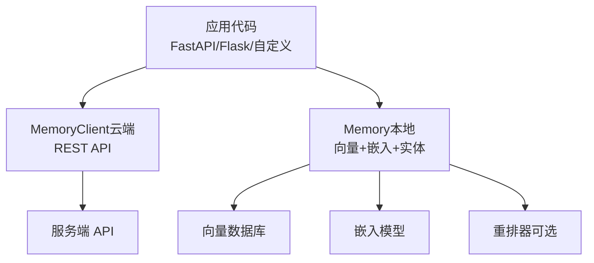
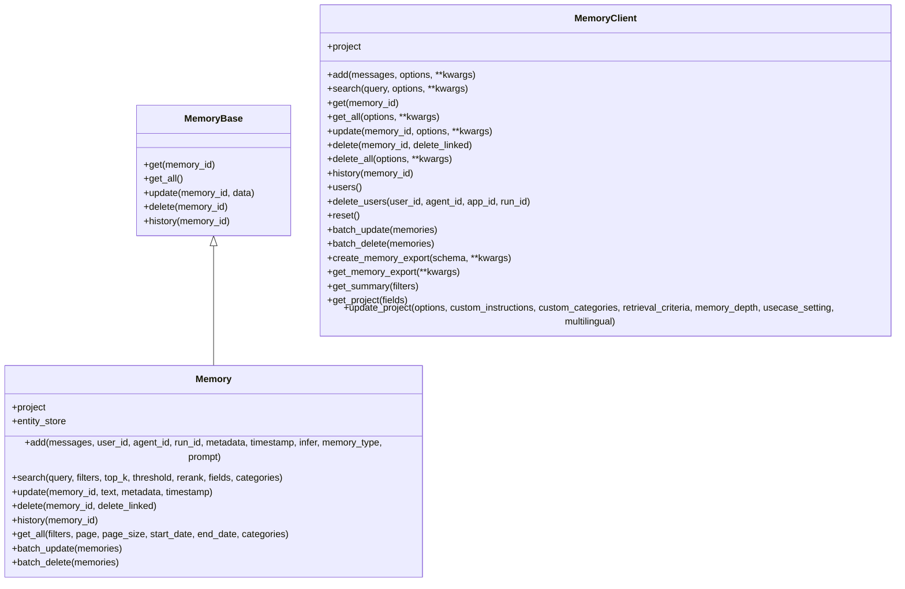
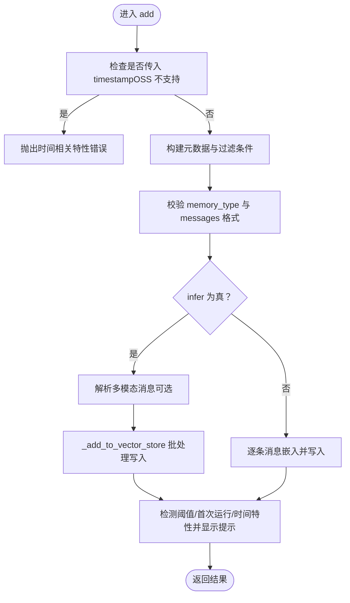
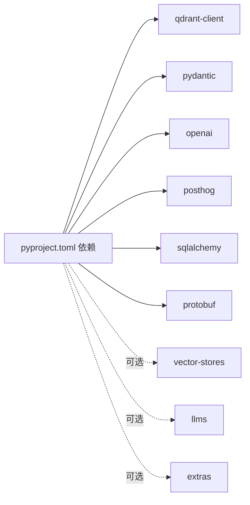

# Python SDK 使用指南

<cite>
**本文档引用的文件**
- [mem0/__init__.py](file://mem0/__init__.py)
- [mem0/memory/main.py](file://mem0/memory/main.py)
- [mem0/client/main.py](file://mem0/client/main.py)
- [mem0/configs/base.py](file://mem0/configs/base.py)
- [mem0/exceptions.py](file://mem0/exceptions.py)
- [mem0/client/types.py](file://mem0/client/types.py)
- [pyproject.toml](file://pyproject.toml)
- [README.md](file://README.md)
- [mem0/memory/base.py](file://mem0/memory/base.py)
- [mem0/memory/notices.py](file://mem0/memory/notices.py)
- [examples/misc/test.py](file://examples/misc/test.py)
</cite>

## 目录
1. [简介](#简介)
2. [项目结构](#项目结构)
3. [核心组件](#核心组件)
4. [架构总览](#架构总览)
5. [详细组件分析](#详细组件分析)
6. [依赖关系分析](#依赖关系分析)
7. [性能考虑](#性能考虑)
8. [故障排除指南](#故障排除指南)
9. [结论](#结论)
10. [附录](#附录)

## 简介
本指南面向希望在 Python 应用中集成 Mem0 长期记忆能力的开发者，覆盖从安装、导入、基础配置到 Memory 类的完整使用流程（初始化、添加记忆、搜索记忆、更新记忆、删除记忆），并提供与 FastAPI、Flask 等主流框架的集成方法、异常处理策略与性能优化建议。

## 项目结构
- SDK 入口导出：通过包级导出同步与异步客户端与 Memory 类，便于直接按需导入。
- 核心实现：
  - Memory（本地/自托管）：负责向量存储、嵌入、重排、实体链接、历史记录等本地化能力。
  - MemoryClient（云端/平台）：封装 REST API 调用，提供统一的增删改查接口。
- 配置与类型：
  - MemoryConfig、VectorStoreConfig、LlmConfig、EmbedderConfig 等模型定义。
  - 客端参数类型（AddMemoryOptions、SearchMemoryOptions 等）。
- 异常体系：结构化的异常类，便于在应用层进行分类处理与用户提示。
- 示例与文档：README 提供快速开始与安装指引；examples 展示工具函数式集成。

图示来源
- [mem0/client/main.py](file://mem0/client/main.py)
- [mem0/memory/main.py](file://mem0/memory/main.py)

章节来源
- [mem0/__init__.py](file://mem0/__init__.py)
- [pyproject.toml](file://pyproject.toml)
- [README.md](file://README.md)

## 核心组件
- Memory（本地/自托管）
  - 初始化：基于 MemoryConfig 构建嵌入器、向量存储、LLM、历史数据库、可选重排器。
  - 记忆操作：add、search、update、delete、history、get_all、batch_* 等。
  - 实体链接：自动抽取实体并建立跨记忆的链接，提升检索效果。
- MemoryClient（云端/平台）
  - 初始化：支持传入 api_key/host 或环境变量 MEM0_API_KEY，默认 host 为官方服务地址。
  - 记忆操作：add、search、get、get_all、update、delete、delete_all、history、users、batch_* 等。
  - 项目管理：project 属性提供项目级能力（OSS 版本限制较多）。
- 配置与类型
  - MemoryConfig：包含向量库、LLM、嵌入器、历史数据库路径、重排器、版本、自定义指令等。
  - AddMemoryOptions/SearchMemoryOptions 等：为客户端方法提供强类型参数。
- 异常体系
  - 结构化异常类（AuthenticationError、RateLimitError、ValidationError、MemoryNotFoundError、NetworkError、MemoryQuotaExceededError、VectorStoreError、EmbeddingError、LLMError、DatabaseError 等），并提供状态码映射与错误信息构造。

章节来源
- [mem0/memory/main.py](file://mem0/memory/main.py)
- [mem0/client/main.py](file://mem0/client/main.py)
- [mem0/configs/base.py](file://mem0/configs/base.py)
- [mem0/client/types.py](file://mem0/client/types.py)
- [mem0/exceptions.py](file://mem0/exceptions.py)

## 架构总览
下图展示了 SDK 在不同部署形态下的交互关系：本地 Memory 适合测试与自托管；MemoryClient 适合云端/平台模式。

图示来源
- [mem0/memory/base.py](file://mem0/memory/base.py)
- [mem0/memory/main.py](file://mem0/memory/main.py)
- [mem0/client/main.py](file://mem0/client/main.py)

## 详细组件分析

### 安装与导入
- 安装
  - 基础安装：pip install mem0ai
  - 增强混合检索（BM25 关键词 + 实体）：pip install mem0ai[nlp]，并下载英文模型资源。
- 导入
  - from mem0 import Memory, MemoryClient
  - 包级导出同时提供同步与异步客户端与 Memory 类，便于直接使用。

章节来源
- [README.md](file://README.md)
- [pyproject.toml](file://pyproject.toml)
- [mem0/__init__.py](file://mem0/__init__.py)

### 基础配置
- MemoryConfig 字段
  - vector_store：向量库配置（provider、config、collection_name 等）
  - llm：语言模型配置（provider、config）
  - embedder：嵌入模型配置（provider、config）
  - history_db_path：历史数据库路径（默认 ~/.mem0/history.db）
  - reranker：可选重排器配置
  - version：API 版本（默认 v1.1）
  - custom_instructions：自定义提取指令
- 重要注意
  - OSS 版本不支持 project.update 的部分字段（如 decay），调用会抛出错误。
  - 向量存储若不支持关键字检索，将禁用混合检索（BM25），仅语义相似度。

章节来源
- [mem0/configs/base.py](file://mem0/configs/base.py)
- [mem0/memory/main.py](file://mem0/memory/main.py)

### Memory 类使用详解

#### 初始化
- 方式一：使用默认配置
  - memory = Memory()
- 方式二：从字典构建配置
  - Memory.from_config(config_dict)
- 初始化内容
  - 创建嵌入器、向量存储、LLM、SQLite 历史库
  - 可选初始化重排器
  - 实体存储延迟初始化（首次使用时创建）

章节来源
- [mem0/memory/main.py](file://mem0/memory/main.py)
- [mem0/configs/base.py](file://mem0/configs/base.py)

#### 添加记忆（add）
- 支持输入格式：字符串、单条消息字典、消息列表
- 支持标识：user_id、agent_id、run_id 三者至少其一
- infer 行为
  - True：通过 LLM 推断事实并决定新增/更新/删除
  - False：直接将每条消息作为独立记忆写入
- procedural memory
  - 当指定 memory_type=“procedural_memory”且存在 agent_id 时，走专用流程
- 返回结果
  - v1.1+ 返回包含 results 列表的字典，元素含 id、memory、event 等

图示来源
- [mem0/memory/main.py](file://mem0/memory/main.py)

章节来源
- [mem0/memory/main.py](file://mem0/memory/main.py)

#### 搜索记忆（search）
- 参数要点
  - filters：必须通过 filters 传递 user_id/agent_id/run_id 等标识
  - top_k、threshold、rerank、fields、categories
- 返回
  - v1.1+ 返回包含 results 的字典

章节来源
- [mem0/memory/main.py](file://mem0/memory/main.py)

#### 更新记忆（update）
- 支持字段：text、metadata、timestamp
- 至少提供一个更新字段，否则抛错

章节来源
- [mem0/memory/main.py](file://mem0/memory/main.py)

#### 删除记忆（delete）
- 支持 delete_linked：删除被替代的记忆链（transitive）
- 返回删除结果

章节来源
- [mem0/memory/main.py](file://mem0/memory/main.py)

#### 获取历史（history）
- 返回某记忆的历史变更记录

章节来源
- [mem0/memory/main.py](file://mem0/memory/main.py)

#### 批量操作（batch_*）
- batch_update：批量更新
- batch_delete：批量删除

章节来源
- [mem0/memory/main.py](file://mem0/memory/main.py)

### MemoryClient 类使用详解

#### 初始化
- 支持传入 api_key、host、自定义 httpx.Client
- 若未提供 api_key，将尝试读取 MEM0_API_KEY 环境变量
- 内部会验证 API Key 并设置请求头与超时

章节来源
- [mem0/client/main.py](file://mem0/client/main.py)

#### 添加记忆（add）
- 输入与返回同上，但通过 REST API 调用服务端

章节来源
- [mem0/client/main.py](file://mem0/client/main.py)

#### 搜索（search）、获取（get）、分页获取（get_all）
- 支持 filters、top_k、threshold、rerank、fields、categories 等参数
- get_all 支持分页参数 page/page_size

章节来源
- [mem0/client/main.py](file://mem0/client/main.py)

#### 更新（update）、删除（delete）、批量（batch_*）
- 语义与本地 Memory 对应方法一致

章节来源
- [mem0/client/main.py](file://mem0/client/main.py)

#### 项目管理（project）
- OSS 版本 project.update 仅支持部分字段，其他字段会抛出错误

章节来源
- [mem0/memory/main.py](file://mem0/memory/main.py)

### 与主流框架集成

#### FastAPI 集成
- 将 MemoryClient 注入 FastAPI 应用，提供 /chat、/search、/memories/{user_id}、/memories/{memory_id} 等路由
- 请求体使用 Pydantic 模型，异常统一转换为 HTTPException

参考示例路径
- [LLM.md 中的 FastAPI 示例:1133-1198](file://LLM.md#L1133-L1198)

章节来源
- [mem0/client/main.py](file://mem0/client/main.py)

#### Flask 集成
- 在 Flask 应用中创建 MemoryClient 实例，编写路由处理记忆的增删改查
- 注意：Flask 无内置 Pydantic 自动序列化，需自行处理请求参数与响应格式

章节来源
- [mem0/client/main.py](file://mem0/client/main.py)

### 最佳实践与示例
- 工具函数式集成
  - 将搜索与保存记忆封装为工具函数，便于在智能体或代理中复用
  - 示例：examples/misc/test.py 中定义了 search_memory 与 save_memory 工具，并在代理中使用

参考示例路径
- [examples/misc/test.py](file://examples/misc/test.py)

章节来源
- [examples/misc/test.py](file://examples/misc/test.py)

## 依赖关系分析

图示来源
- [pyproject.toml](file://pyproject.toml)

章节来源
- [pyproject.toml](file://pyproject.toml)

## 性能考虑
- 混合检索（BM25 + 语义 + 实体）建议启用 nlp 组件以获得更佳召回质量。
- 向量存储选择
  - 支持多种向量库（如 qdrant、faiss、pgvector 等），根据规模与部署形态选择。
  - 若向量库不支持关键字检索，将降级为纯语义检索。
- 实体链接
  - 自动抽取并链接实体，有助于提升检索相关性，但会增加写入与更新开销。
- 通知与阈值
  - SDK 会在特定条件下触发性能/使用提示（如慢查询、阈值过高），帮助识别潜在瓶颈。

章节来源
- [mem0/memory/main.py](file://mem0/memory/main.py)
- [mem0/memory/notices.py](file://mem0/memory/notices.py)

## 故障排除指南

### 常见异常与处理
- 认证失败（AuthenticationError）
  - 检查 MEM0_API_KEY 是否正确设置，或在初始化时显式传入。
- 速率限制（RateLimitError）
  - 根据 debug_info 中的 retry_after 进行指数退避重试。
- 输入校验失败（ValidationError）
  - 检查 user_id 格式、messages 结构、filters 键名等。
- 记忆不存在（MemoryNotFoundError）
  - 确认 memory_id 正确，或先执行搜索确认存在。
- 网络错误（NetworkError）
  - 检查网络连通性与 host 地址。
- 额度超限（MemoryQuotaExceededError）
  - 升级套餐或清理历史记忆。
- 向量存储/嵌入/LLM/数据库错误
  - 检查对应 Provider 配置与连接状态。

章节来源
- [mem0/exceptions.py](file://mem0/exceptions.py)
- [mem0/client/main.py](file://mem0/client/main.py)

### 常见问题
- 为什么某些项目更新字段无效？
  - OSS 版本 project.update 仅支持部分字段，其他字段会抛出错误。
- 为什么搜索结果为空？
  - 检查 filters 是否包含 user_id/agent_id/run_id，且与写入时一致。
- 为什么性能提示出现？
  - 可能由于 top_k 过大、内存数量过多或查询耗时较长，建议降低 top_k 或优化索引。

章节来源
- [mem0/memory/main.py](file://mem0/memory/main.py)
- [mem0/memory/notices.py](file://mem0/memory/notices.py)

## 结论
Mem0 Python SDK 提供了简洁而强大的记忆管理能力，既支持本地自托管的 Memory，也支持云端/平台的 MemoryClient。通过结构化的配置、强类型的客户端参数与完善的异常体系，开发者可以快速在应用中集成长期记忆，并结合 FastAPI/Flask 等框架构建智能对话系统与知识增强应用。

## 附录

### 快速开始（本地 Memory）
- 安装与导入
  - pip install mem0ai
  - from mem0 import Memory
- 初始化与使用
  - memory = Memory()
  - memory.add(messages, user_id="alice")
  - memory.search("偏好", filters={"user_id": "alice"})

章节来源
- [README.md](file://README.md)
- [mem0/memory/main.py](file://mem0/memory/main.py)