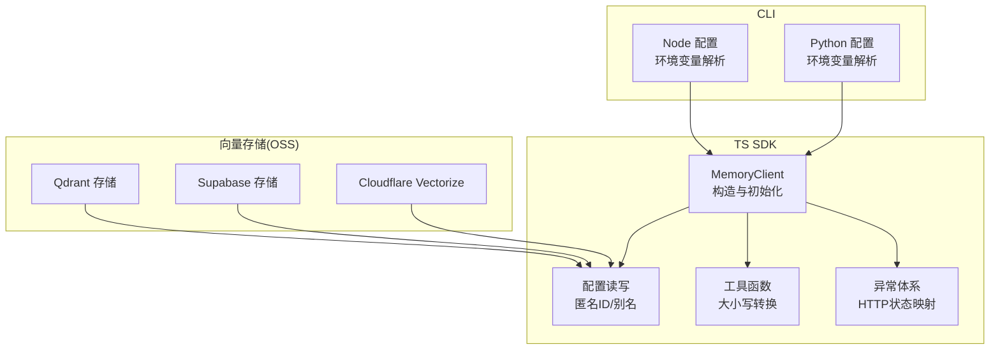
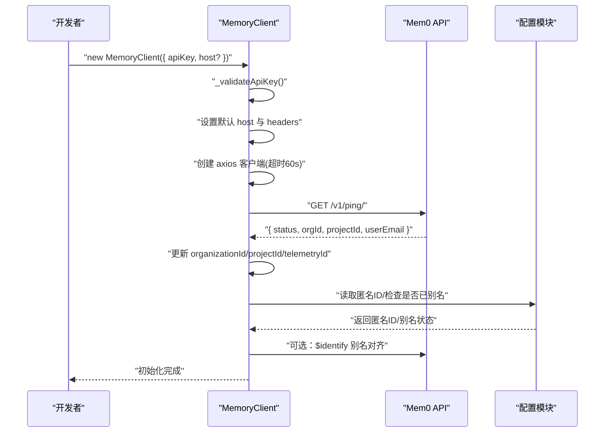
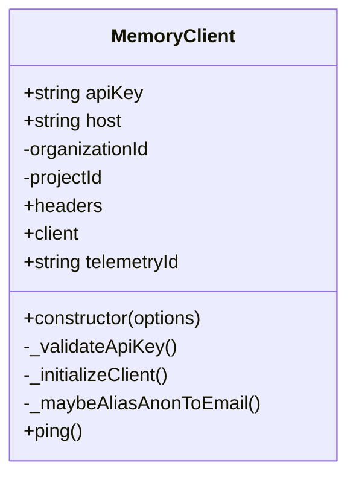
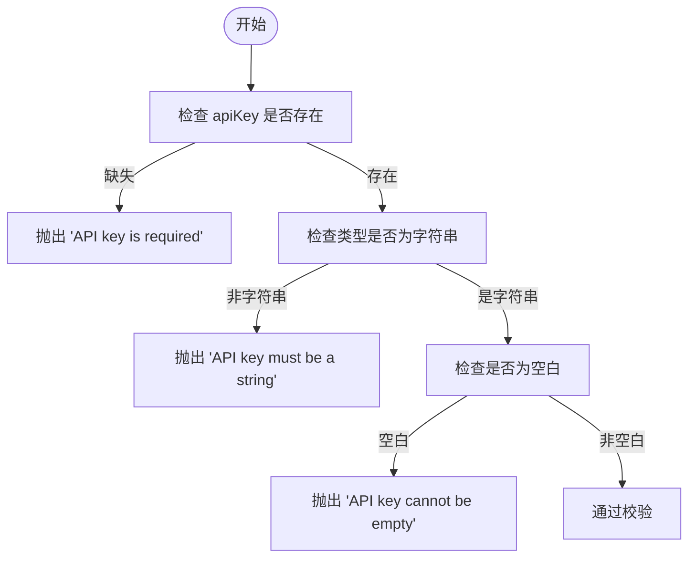
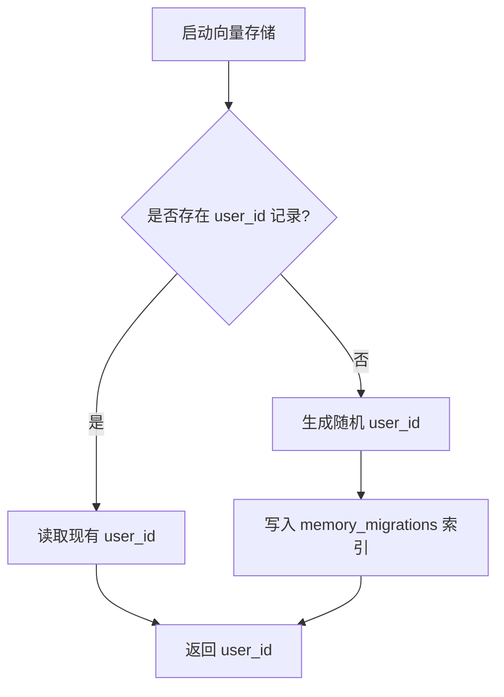
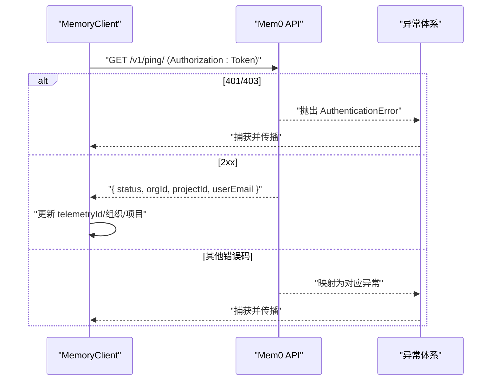
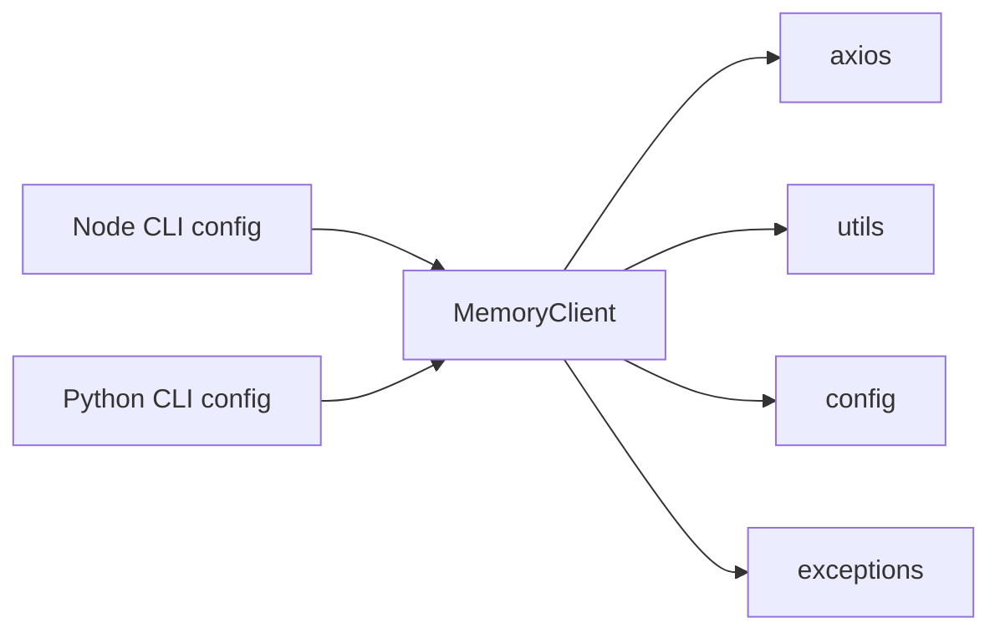

# 内存初始化

<cite>
**本文引用的文件**
- [mem0.ts](file://mem0-ts/src/client/mem0.ts)
- [config.ts](file://mem0-ts/src/client/config.ts)
- [utils.ts](file://mem0-ts/src/client/utils.ts)
- [exceptions.ts](file://mem0-ts/src/common/exceptions.ts)
- [memoryClient.init.test.ts](file://mem0-ts/src/client/tests/memoryClient.init.test.ts)
- [initialization.test.ts](file://mem0-ts/src/client/tests/integration/initialization.test.ts)
- [CLI_SPECIFICATION.md](file://cli/CLI_SPECIFICATION.md)
- [cli-spec.json](file://cli/cli-spec.json)
- [config.py](file://cli/python/src/mem0_cli/config.py)
- [config.ts（Node）](file://cli/node/src/config.ts)
- [qdrant.ts](file://mem0-ts/src/oss/src/vector_stores/qdrant.ts)
- [supabase.ts](file://mem0-ts/src/oss/src/vector_stores/supabase.ts)
- [vectorize.ts](file://mem0-ts/src/oss/src/vector_stores/vectorize.ts)
</cite>

## 目录
1. [简介](#简介)
2. [项目结构](#项目结构)
3. [核心组件](#核心组件)
4. [架构总览](#架构总览)
5. [详细组件分析](#详细组件分析)
6. [依赖关系分析](#依赖关系分析)
7. [性能考量](#性能考量)
8. [故障排查指南](#故障排查指南)
9. [结论](#结论)
10. [附录](#附录)

## 简介
本文件聚焦于内存初始化，系统性阐述 TypeScript SDK 中 MemoryClient 类的初始化流程与配置项，包括：
- 构造函数参数与默认行为
- API 密钥的获取与校验
- 主机地址的配置与默认值
- 初始化方式（环境变量、直接参数、自定义 HTTP 客户端）
- 用户 ID 的生成与身份关联机制
- 身份验证流程与错误处理
- 最佳实践与常见问题排查

## 项目结构
与“内存初始化”直接相关的核心文件分布如下：
- SDK 核心：MemoryClient 实现、配置读写、工具函数、异常体系
- CLI 配置：Node/Python CLI 对配置与环境变量的支持
- 向量存储：OSS 模式下用户 ID 的生成与持久化策略
- 测试用例：覆盖初始化、ping、认证等关键路径

**图表来源**
- [mem0.ts:82-147](file://mem0-ts/src/client/mem0.ts#L82-L147)
- [config.ts:81-165](file://mem0-ts/src/client/config.ts#L81-L165)
- [utils.ts:1-50](file://mem0-ts/src/client/utils.ts#L1-L50)
- [exceptions.ts:58-148](file://mem0-ts/src/common/exceptions.ts#L58-L148)
- [config.py（Node）:120-131](file://cli/node/src/config.ts#L120-L131)
- [config.py（Python）:119-143](file://cli/python/src/mem0_cli/config.py#L119-L143)
- [qdrant.ts:397-417](file://mem0-ts/src/oss/src/vector_stores/qdrant.ts#L397-L417)
- [supabase.ts:409-442](file://mem0-ts/src/oss/src/vector_stores/supabase.ts#L409-L442)
- [vectorize.ts:234-279](file://mem0-ts/src/oss/src/vector_stores/vectorize.ts#L234-L279)

**章节来源**
- [mem0.ts:82-147](file://mem0-ts/src/client/mem0.ts#L82-L147)
- [config.ts:1-166](file://mem0-ts/src/client/config.ts#L1-L166)
- [utils.ts:1-50](file://mem0-ts/src/client/utils.ts#L1-L50)
- [exceptions.ts:58-148](file://mem0-ts/src/common/exceptions.ts#L58-L148)
- [CLI_SPECIFICATION.md:996-1027](file://cli/CLI_SPECIFICATION.md#L996-L1027)
- [cli-spec.json:34-89](file://cli/cli-spec.json#L34-L89)
- [config.py（Node）:120-131](file://cli/node/src/config.ts#L120-L131)
- [config.py（Python）:119-143](file://cli/python/src/mem0_cli/config.py#L119-L143)
- [qdrant.ts:397-417](file://mem0-ts/src/oss/src/vector_stores/qdrant.ts#L397-L417)
- [supabase.ts:409-442](file://mem0-ts/src/oss/src/vector_stores/supabase.ts#L409-L442)
- [vectorize.ts:234-279](file://mem0-ts/src/oss/src/vector_stores/vectorize.ts#L234-L279)

## 核心组件
- MemoryClient：负责初始化、认证、请求封装与错误转换
- 配置模块：在 Node 环境中读写本地配置，管理匿名 ID 与别名对齐
- 工具模块：键名大小写转换（camel/snake），用于请求体与响应的兼容
- 异常体系：将 HTTP 状态码映射为语义化的 SDK 异常类型

**章节来源**
- [mem0.ts:82-147](file://mem0-ts/src/client/mem0.ts#L82-L147)
- [config.ts:81-165](file://mem0-ts/src/client/config.ts#L81-L165)
- [utils.ts:1-50](file://mem0-ts/src/client/utils.ts#L1-L50)
- [exceptions.ts:58-148](file://mem0-ts/src/common/exceptions.ts#L58-L148)

## 架构总览
MemoryClient 初始化的关键流程：
- 解析构造参数（apiKey、host）
- 校验 apiKey（非空、字符串、非空白）
- 设置默认 host 与请求头（Authorization: Token）
- 创建 axios 实例（超时 60 秒）
- 执行 ping 接口以解析组织/项目信息，并回填 telemetryId
- 若启用遥测且存在匿名 ID，尝试将匿名 ID 与邮箱进行别名对齐
- 记录初始化事件

**图表来源**
- [mem0.ts:103-147](file://mem0-ts/src/client/mem0.ts#L103-L147)
- [mem0.ts:215-250](file://mem0-ts/src/client/mem0.ts#L215-L250)
- [config.ts:149-171](file://mem0-ts/src/client/config.ts#L149-L171)

**章节来源**
- [mem0.ts:103-147](file://mem0-ts/src/client/mem0.ts#L103-L147)
- [mem0.ts:215-250](file://mem0-ts/src/client/mem0.ts#L215-L250)
- [config.ts:149-171](file://mem0-ts/src/client/config.ts#L149-L171)

## 详细组件分析

### MemoryClient 构造函数与初始化
- 参数
  - apiKey：必填；必须为非空字符串
  - host：可选；未提供时默认为 https://api.mem0.ai
- 行为
  - 校验 apiKey 并抛出明确错误
  - 设置 Authorization 头（Token 前缀）
  - 创建 axios 实例，设置 baseURL、headers、timeout
  - 自动执行 ping，解析 orgId/projectId/userEmail
  - 若未设置 telemetryId，则基于 apiKey 生成哈希作为默认标识
  - 尝试将匿名 ID 与邮箱进行别名对齐（遥测启用时）

**图表来源**
- [mem0.ts:77-147](file://mem0-ts/src/client/mem0.ts#L77-L147)

**章节来源**
- [mem0.ts:77-147](file://mem0-ts/src/client/mem0.ts#L77-L147)

### API 密钥的获取与设置
- 获取方式
  - 直接传参：new MemoryClient({ apiKey })
  - 环境变量：MEM0_API_KEY（Node/Python CLI 均支持）
- 校验规则
  - 必须提供；类型必须为字符串；不可为空白
- 错误类型
  - 空字符串或仅空白：抛出明确错误
  - 非字符串：抛出明确错误

**图表来源**
- [mem0.ts:91-101](file://mem0-ts/src/client/mem0.ts#L91-L101)

**章节来源**
- [mem0.ts:91-101](file://mem0-ts/src/client/mem0.ts#L91-L101)
- [memoryClient.init.test.ts:24-40](file://mem0-ts/src/client/tests/memoryClient.init.test.ts#L24-L40)

### 主机地址配置
- 默认值：https://api.mem0.ai
- 自定义方式
  - 传参：new MemoryClient({ apiKey, host: "https://custom.mem0.ai" })
  - 环境变量：MEM0_BASE_URL（Node/Python CLI）
- CLI 规范
  - 默认基地址可在 CLI 文档与规范中查看
  - Node/Python CLI 支持从环境变量覆盖 base_url

**章节来源**
- [mem0.ts:105-105](file://mem0-ts/src/client/mem0.ts#L105-L105)
- [CLI_SPECIFICATION.md:895-910](file://cli/CLI_SPECIFICATION.md#L895-L910)
- [cli-spec.json:39-53](file://cli/cli-spec.json#L39-L53)
- [config.py（Node）:123-124](file://cli/node/src/config.ts#L123-L124)
- [config.py（Python）:124-126](file://cli/python/src/mem0_cli/config.py#L124-L126)

### 初始化方式示例
- 环境变量配置
  - Node：MEM0_API_KEY、MEM0_BASE_URL、MEM0_USER_ID、MEM0_AGENT_ID、MEM0_APP_ID、MEM0_RUN_ID
  - Python：同上
- 直接参数传递
  - new MemoryClient({ apiKey: "...", host: "..." })
- 自定义 HTTP 客户端
  - SDK 使用 axios；如需自定义（如代理、拦截器），可在创建实例后按 axios 方式扩展（注意：SDK 内部会注入 Authorization 与超时）

**章节来源**
- [CLI_SPECIFICATION.md:996-1008](file://cli/CLI_SPECIFICATION.md#L996-L1008)
- [cli-spec.json:43-82](file://cli/cli-spec.json#L43-L82)
- [config.py（Node）:120-131](file://cli/node/src/config.ts#L120-L131)
- [config.py（Python）:119-143](file://cli/python/src/mem0_cli/config.py#L119-L143)
- [mem0.ts:114-118](file://mem0-ts/src/client/mem0.ts#L114-L118)

### 用户 ID 的生成机制与身份关联
- 生成策略（OSS 模式下的向量存储）
  - Qdrant：若无记录则生成随机 user_id 并写入 memory_migrations 索引
  - Supabase：插入一条记录以生成 user_id，失败时回退为固定匿名标识
  - Cloudflare Vectorize：通过查询索引元数据获取 user_id，不存在则创建索引并写入
- 别名对齐（遥测）
  - 若 telemetryId 为邮箱且存在匿名 ID，则尝试将匿名 ID 与邮箱进行识别对齐
  - 对齐结果会持久化到本地配置，避免重复对齐

**图表来源**
- [qdrant.ts:397-417](file://mem0-ts/src/oss/src/vector_stores/qdrant.ts#L397-L417)
- [supabase.ts:409-442](file://mem0-ts/src/oss/src/vector_stores/supabase.ts#L409-L442)
- [vectorize.ts:234-279](file://mem0-ts/src/oss/src/vector_stores/vectorize.ts#L234-L279)

**章节来源**
- [qdrant.ts:397-417](file://mem0-ts/src/oss/src/vector_stores/qdrant.ts#L397-L417)
- [supabase.ts:409-442](file://mem0-ts/src/oss/src/vector_stores/supabase.ts#L409-L442)
- [vectorize.ts:234-279](file://mem0-ts/src/oss/src/vector_stores/vectorize.ts#L234-L279)
- [config.ts:149-171](file://mem0-ts/src/client/config.ts#L149-L171)

### 身份验证流程
- 请求头
  - Authorization: Token <apiKey>
  - 每次请求会附加 Mem0-User-ID: telemetryId
- ping 接口
  - 成功：返回 { status: "ok", orgId?, projectId?, userEmail? }
  - 失败：根据响应状态映射为具体异常（如 401 映射为 AuthenticationError）
- 异常映射
  - 401/403 → AuthenticationError
  - 400/409/422 → ValidationError
  - 404 → MemoryNotFoundError
  - 429 → RateLimitError
  - 408/502/503/504 → NetworkError
  - 413 → MemoryQuotaExceededError
  - 其他 → MemoryError

**图表来源**
- [mem0.ts:215-250](file://mem0-ts/src/client/mem0.ts#L215-L250)
- [exceptions.ts:58-148](file://mem0-ts/src/common/exceptions.ts#L58-L148)

**章节来源**
- [mem0.ts:215-250](file://mem0-ts/src/client/mem0.ts#L215-L250)
- [exceptions.ts:58-148](file://mem0-ts/src/common/exceptions.ts#L58-L148)
- [initialization.test.ts:59-62](file://mem0-ts/src/client/tests/integration/initialization.test.ts#L59-L62)

## 依赖关系分析
- MemoryClient 依赖
  - axios：HTTP 客户端
  - utils：键名转换（camel/snake）
  - config：匿名 ID 读写与别名对齐
  - exceptions：HTTP 状态到异常类型的映射
- CLI 与 SDK 的耦合点
  - 环境变量 MEM0_API_KEY/MEM0_BASE_URL 等在 CLI 层解析后可直接用于 SDK 初始化
  - CLI 规范与 JSON 描述了字段与默认值

**图表来源**
- [mem0.ts:1-37](file://mem0-ts/src/client/mem0.ts#L1-L37)
- [config.py（Node）:120-131](file://cli/node/src/config.ts#L120-L131)
- [config.py（Python）:119-143](file://cli/python/src/mem0_cli/config.py#L119-L143)

**章节来源**
- [mem0.ts:1-37](file://mem0-ts/src/client/mem0.ts#L1-L37)
- [config.py（Node）:120-131](file://cli/node/src/config.ts#L120-L131)
- [config.py（Python）:119-143](file://cli/python/src/mem0_cli/config.py#L119-L143)

## 性能考量
- 超时设置：SDK 默认超时 60 秒，适用于大多数场景；长耗时操作建议在业务层做重试与分页
- 异步 ping：初始化阶段会发起一次 ping，确保后续调用无需额外鉴权开销
- 请求头复用：SDK 在内部统一注入 Authorization 与 Mem0-User-ID，减少重复设置

[本节为通用指导，不直接分析具体文件]

## 故障排查指南
- 常见错误与定位
  - API key 缺失/为空/非字符串：构造时即抛错
  - 401/403：检查密钥有效性与权限范围
  - 400/409/422：检查请求参数格式与必填项
  - 404：资源不存在或 ID 不合法
  - 429：触发限流，建议退避重试
  - 413：配额不足，调整用量或升级方案
  - 408/502/503/504：网络不稳定或服务异常，建议重试
- 单元测试与集成测试
  - 单元测试覆盖构造参数校验、默认 host、Authorization 头、axios 超时
  - 集成测试覆盖 ping 成功、无效 ID 抛错、无效密钥抛错

**章节来源**
- [exceptions.ts:58-148](file://mem0-ts/src/common/exceptions.ts#L58-L148)
- [memoryClient.init.test.ts:24-60](file://mem0-ts/src/client/tests/memoryClient.init.test.ts#L24-L60)
- [initialization.test.ts:34-62](file://mem0-ts/src/client/tests/integration/initialization.test.ts#L34-L62)

## 结论
- MemoryClient 的初始化流程清晰、健壮：严格的参数校验、默认值与超时设置、自动 ping 与遥测对齐
- API 密钥与主机地址可通过多种方式配置，满足不同部署形态
- OSS 模式下的用户 ID 生成与持久化策略完善，保证跨组件一致性
- 建议在生产环境中结合环境变量与 CLI 配置，配合 SDK 的异常体系进行稳健的错误处理

[本节为总结性内容，不直接分析具体文件]

## 附录

### 初始化参数与默认值速查
- apiKey：必填；类型为字符串；不可为空白
- host：可选；默认 https://api.mem0.ai；可通过 MEM0_BASE_URL 或 CLI 配置覆盖
- Authorization 头：Token <apiKey>
- 超时：60 秒

**章节来源**
- [mem0.ts:77-118](file://mem0-ts/src/client/mem0.ts#L77-L118)
- [CLI_SPECIFICATION.md:895-910](file://cli/CLI_SPECIFICATION.md#L895-L910)
- [cli-spec.json:39-53](file://cli/cli-spec.json#L39-L53)