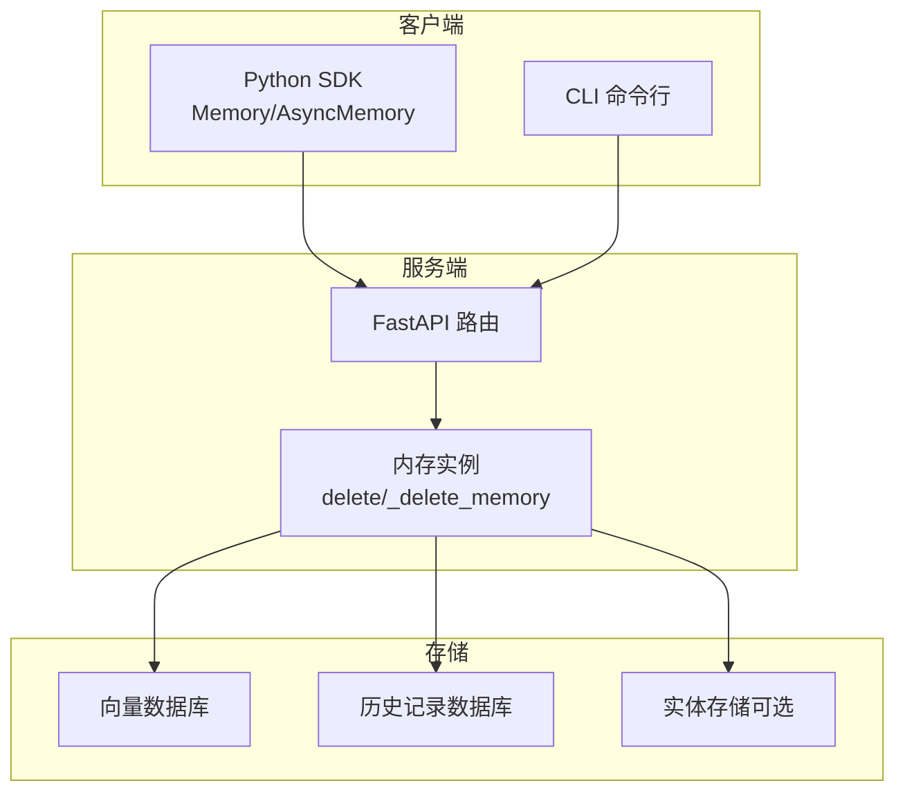
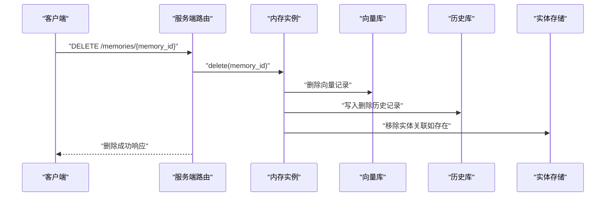
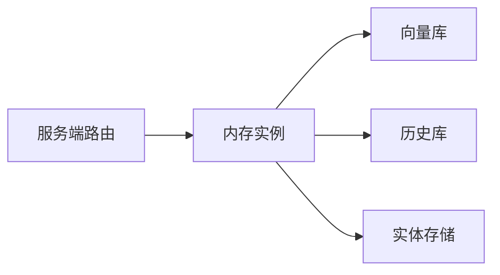
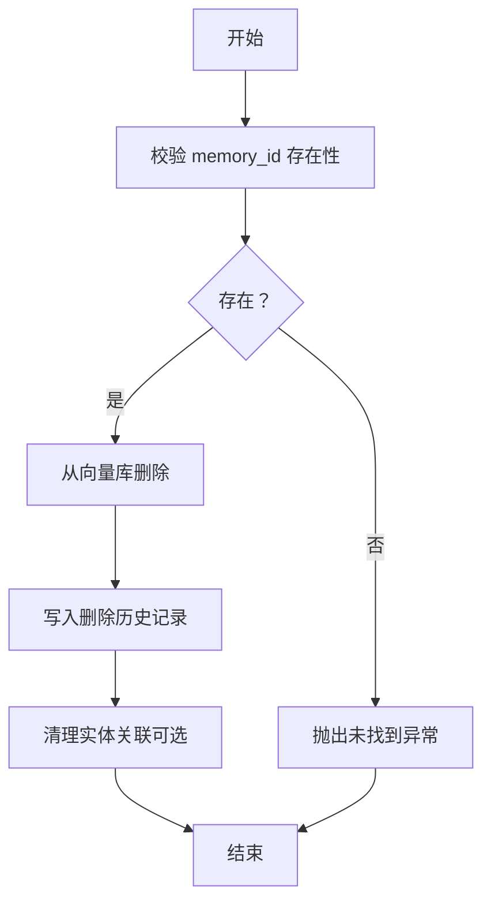

# 删除记忆

<cite>
**本文引用的文件**
- [mem0/memory/main.py](file://mem0/memory/main.py)
- [server/main.py](file://server/main.py)
- [docs/api-reference/memory/delete-memory.mdx](file://docs/api-reference/memory/delete-memory.mdx)
- [docs/api-reference/memory/batch-delete.mdx](file://docs/api-reference/memory/batch-delete.mdx)
- [cli/node/src/index.ts](file://cli/node/src/index.ts)
- [tests/test_client.py](file://tests/test_client.py)
</cite>

## 目录
1. [简介](#简介)
2. [项目结构](#项目结构)
3. [核心组件](#核心组件)
4. [架构总览](#架构总览)
5. [详细组件分析](#详细组件分析)
6. [依赖关系分析](#依赖关系分析)
7. [性能考量](#性能考量)
8. [故障排查指南](#故障排查指南)
9. [结论](#结论)
10. [附录](#附录)

## 简介
本文件系统化阐述“删除记忆”操作，覆盖以下关键点：
- delete_memory 方法的使用方式与记忆 ID 要求
- 删除确认机制与幂等性保障
- delete_linked 参数的作用、影响范围与默认行为
- 单个删除与批量删除的完整示例路径
- 删除后的数据恢复机制与不可逆性说明
- 安全考虑与最佳实践
- 错误处理与回滚策略

## 项目结构
围绕删除记忆的关键实现分布在以下模块：
- Python SDK 层：内存实例的同步/异步删除逻辑
- 服务端路由层：REST API 对外暴露删除接口
- 文档层：OpenAPI 描述与参数说明
- CLI 层：删除命令行参数互斥校验与用法提示
- 测试层：对 delete_linked 参数传递行为的验证

图表来源
- [mem0/memory/main.py:1887-1915](file://mem0/memory/main.py#L1887-L1915)
- [server/main.py:482-509](file://server/main.py#L482-L509)

章节来源
- [mem0/memory/main.py:1887-1915](file://mem0/memory/main.py#L1887-L1915)
- [server/main.py:482-509](file://server/main.py#L482-L509)

## 核心组件
- 同步删除入口：Memory.delete(memory_id)
- 异步删除入口：AsyncMemory.delete(memory_id)
- 内部删除实现：Memory._delete_memory / AsyncMemory._delete_memory
- 服务端路由：DELETE /memories/{memory_id}、DELETE /memories（批量）
- 批量删除客户端：batch_delete（通过 /v1/batch/ PUT/DELETE）

章节来源
- [mem0/memory/main.py:1887-1915](file://mem0/memory/main.py#L1887-L1915)
- [mem0/memory/main.py:3420-3440](file://mem0/memory/main.py#L3420-L3440)
- [server/main.py:482-509](file://server/main.py#L482-L509)
- [docs/api-reference/memory/batch-delete.mdx:1-6](file://docs/api-reference/memory/batch-delete.mdx#L1-L6)

## 架构总览
删除流程从客户端发起，经由服务端路由进入内存实例执行，最终更新向量库与历史库，并清理实体关联。

图表来源
- [server/main.py:482-489](file://server/main.py#L482-L489)
- [mem0/memory/main.py:1887-1915](file://mem0/memory/main.py#L1887-L1915)

## 详细组件分析

### delete_memory 方法与记忆 ID 要求
- 入口方法
  - 同步：Memory.delete(memory_id)
  - 异步：AsyncMemory.delete(memory_id)
- 记忆 ID 要求
  - 必须为已存在的唯一标识符，对应向量库中的 vector_id
  - 若不存在，内部会抛出异常（例如“未找到”），客户端应捕获并处理
- 删除确认机制
  - 服务端路由直接调用内存实例删除，不进行二次确认
  - 历史库中会写入删除记录，具备审计能力
- 幂等性
  - 多次删除同一 ID 不会重复写入历史，但建议客户端在业务侧避免重复触发

章节来源
- [mem0/memory/main.py:1887-1915](file://mem0/memory/main.py#L1887-L1915)
- [server/main.py:482-489](file://server/main.py#L482-L489)

### delete_linked 参数的作用与影响范围
- 参数语义
  - 控制是否同时删除与该记忆相关联的实体记录（entity store 中的链接）
- 默认行为
  - 在测试中验证了 delete_linked=True 会被传入请求参数；False 则不会显式携带该参数，保持默认路径
- 影响范围
  - 当启用时，会清理实体存储中指向该记忆的所有关联，降低“幽灵链接”
  - 关闭时仅删除记忆本身及其历史，保留实体与记忆的潜在关联

章节来源
- [tests/test_client.py:193-209](file://tests/test_client.py#L193-L209)

### 删除确认机制与安全提示
- 服务端未实现额外二次确认弹窗或验证码
- 建议客户端在调用前进行业务级确认（如弹窗提示、日志记录）
- 历史记录可用于事后审计与追踪

章节来源
- [server/main.py:482-489](file://server/main.py#L482-L489)

### 单个删除示例（路径）
- 服务端接口定义（OpenAPI）
  - [docs/api-reference/memory/delete-memory.mdx:1-5](file://docs/api-reference/memory/delete-memory.mdx#L1-L5)
- 客户端调用（Python SDK）
  - 同步：Memory.delete(memory_id)
  - 异步：AsyncMemory.delete(memory_id)
  - 参考实现位置：
    - [mem0/memory/main.py:1887-1915](file://mem0/memory/main.py#L1887-L1915)
    - [mem0/memory/main.py:3420-3440](file://mem0/memory/main.py#L3420-L3440)

### 批量删除示例（路径）
- 批量删除接口（OpenAPI）
  - [docs/api-reference/memory/batch-delete.mdx:1-6](file://docs/api-reference/memory/batch-delete.mdx#L1-L6)
- 客户端调用（Python SDK）
  - 同步：Memory.batch_delete([...])（内部以 /v1/batch/ 发起请求）
  - 异步：AsyncMemory.batch_delete([...])
  - 参考实现位置：
    - [mem0/memory/main.py:1495-1504](file://mem0/memory/main.py#L1495-L1504)
    - [mem0/memory/main.py:1695-1700](file://mem0/memory/main.py#L1695-L1700)

### 删除后的数据恢复机制与不可逆性
- 恢复机制
  - 历史库记录删除事件，可用于审计与问题定位
  - 部分向量库支持基于时间点的备份/快照（取决于具体提供商配置）
- 不可逆性
  - 删除后立即从检索库移除
  - 建议在业务侧增加软删除或归档策略，避免误删造成数据丢失

章节来源
- [mem0/memory/main.py:1899-1910](file://mem0/memory/main.py#L1899-L1910)

### 安全考虑与最佳实践
- 权限控制
  - 删除单个记忆通常不需要管理员权限，但批量删除 /memories 需要管理员角色
  - 参考服务端路由：
    - [server/main.py:482-489](file://server/main.py#L482-L489)
    - [server/main.py:492-509](file://server/main.py#L492-L509)
- 参数互斥与输入校验
  - CLI 层对 memoryId、--all、--entity 进行互斥校验，防止误用
  - 参考 CLI 校验：
    - [cli/node/src/index.ts:532-556](file://cli/node/src/index.ts#L532-L556)
- 业务侧确认
  - 在调用前进行二次确认，记录操作日志，便于回溯
- 最小化风险
  - 优先使用过滤条件（user_id/run_id/agent_id）进行批量删除，避免误伤
  - 对高价值记忆设置访问白名单与审批流程

章节来源
- [server/main.py:492-509](file://server/main.py#L492-L509)
- [cli/node/src/index.ts:532-556](file://cli/node/src/index.ts#L532-L556)

### 错误处理与回滚策略
- 常见错误
  - 记忆不存在：内部抛出“未找到”类异常，需在客户端捕获并提示用户
  - 权限不足：批量删除需要管理员权限，否则返回 401/403
  - 参数缺失：批量删除至少需要一个标识符（user_id/run_id/agent_id）
- 回滚策略
  - 无内置自动回滚
  - 建议在业务层实现“软删除+归档”，或在外部备份向量库后执行硬删除
  - 使用历史记录进行审计与人工核查

章节来源
- [server/main.py:492-509](file://server/main.py#L492-L509)
- [mem0/memory/main.py:1887-1915](file://mem0/memory/main.py#L1887-L1915)

## 依赖关系分析
- 组件耦合
  - 服务端路由依赖内存实例
  - 内存实例依赖向量库与历史库
  - 实体存储清理为可选步骤，失败不影响主删除流程
- 外部依赖
  - 向量库提供商（如 Chroma、Qdrant、FAISS 等）
  - 历史库（SQLite）
  - 实体存储（按配置启用）

图表来源
- [server/main.py:482-509](file://server/main.py#L482-L509)
- [mem0/memory/main.py:1887-1915](file://mem0/memory/main.py#L1887-L1915)

## 性能考量
- 单条删除
  - 主要开销在于向量库删除与历史写入，通常为 O(1)
- 批量删除
  - 顺序执行多条删除，整体复杂度与数量线性相关
  - 建议分批提交，避免单次请求过大导致超时
- 实体清理
  - 清理实体关联为可选且非致命操作，失败不影响主流程

## 故障排查指南
- “记忆不存在”
  - 检查 memory_id 是否正确
  - 确认向量库中是否存在该记录
- “权限不足”
  - 确认调用批量删除时具备管理员权限
- “参数冲突”
  - CLI 层已做互斥校验，确保只传入一种模式（单个/全部/实体）
- “删除后仍可检索”
  - 检查向量库索引是否重建或缓存是否刷新
  - 查看历史库记录确认删除是否成功

章节来源
- [cli/node/src/index.ts:532-556](file://cli/node/src/index.ts#L532-L556)
- [server/main.py:492-509](file://server/main.py#L492-L509)

## 结论
删除记忆是高风险操作，应结合权限控制、参数校验与业务确认机制共同使用。通过历史记录与外部备份，可在一定程度上降低不可逆带来的风险。推荐在生产环境采用“软删除+归档”的策略，并对批量删除施加更严格的审批流程。

## 附录

### 删除流程算法概要

图表来源
- [mem0/memory/main.py:1887-1915](file://mem0/memory/main.py#L1887-L1915)