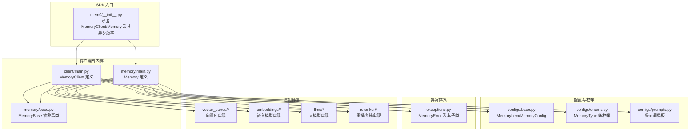
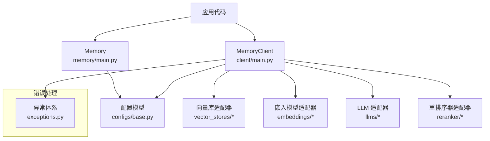
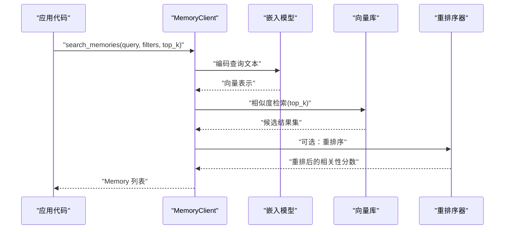
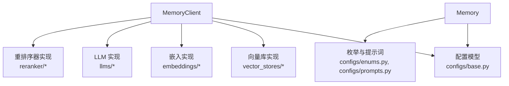

# 基础操作

<cite>
**本文引用的文件**
- [mem0/__init__.py](file://mem0/__init__.py)
- [client/main.py](file://mem0/client/main.py)
- [memory/main.py](file://mem0/memory/main.py)
- [configs/base.py](file://mem0/configs/base.py)
- [configs/enums.py](file://mem0/configs/enums.py)
- [exceptions.py](file://mem0/exceptions.py)
- [memory/base.py](file://mem0/memory/base.py)
- [vector_stores/base.py](file://mem0/vector_stores/base.py)
- [embeddings/base.py](file://mem0/embeddings/base.py)
- [llms/base.py](file://mem0/llms/base.py)
- [configs/prompts.py](file://mem0/configs/prompts.py)
- [configs/rerankers/base.py](file://mem0/configs/rerankers/base.py)
- [vector_stores/chroma.py](file://mem0/vector_stores/chroma.py)
- [vector_stores/faiss.py](file://mem0/vector_stores/faiss.py)
- [vector_stores/pgvector.py](file://mem0/vector_stores/pgvector.py)
- [vector_stores/qdrant.py](file://mem0/vector_stores/qdrant.py)
- [vector_stores/weaviate.py](file://mem0/vector_stores/weaviate.py)
- [vector_stores/opensearch.py](file://mem0/vector_stores/opensearch.py)
- [vector_stores/mongodb.py](file://mem0/vector_stores/mongodb.py)
- [vector_stores/redis.py](file://mem0/vector_stores/redis.py)
- [vector_stores/valkey.py](file://mem0/vector_stores/valkey.py)
- [vector_stores/elasticsearch.py](file://mem0/vector_stores/elasticsearch.py)
- [vector_stores/pinecone.py](file://mem0/vector_stores/pinecone.py)
- [vector_stores/turbopuffer.py](file://mem0/vector_stores/turbopuffer.py)
- [vector_stores/upstash_vector.py](file://mem0/vector_stores/upstash_vector.py)
- [vector_stores/neptune_analytics.py](file://mem0/vector_stores/neptune_analytics.py)
- [vector_stores/baidu.py](file://mem0/vector_stores/baidu.py)
- [vector_stores/supabase.py](file://mem0/vector_stores/supabase.py)
- [vector_stores/milvus.py](file://mem0/vector_stores/milvus.py)
- [vector_stores/cassandra.py](file://mem0/vector_stores/cassandra.py)
- [vector_stores/langchain.py](file://mem0/vector_stores/langchain.py)
- [vector_stores/azure_ai_search.py](file://mem0/vector_stores/azure_ai_search.py)
- [vector_stores/azure_mysql.py](file://mem0/vector_stores/azure_mysql.py)
- [vector_stores/databricks.py](file://mem0/vector_stores/databricks.py)
- [vector_stores/vertex_ai_vector_search.py](file://mem0/vector_stores/vertex_ai_vector_search.py)
- [vector_stores/s3_vectors.py](file://mem0/vector_stores/s3_vectors.py)
- [embeddings/openai.py](file://mem0/embeddings/openai.py)
- [embeddings/fastembed.py](file://mem0/embeddings/fastembed.py)
- [embeddings/gemini.py](file://mem0/embeddings/gemini.py)
- [embeddings/huggingface.py](file://mem0/embeddings/huggingface.py)
- [embeddings/ollama.py](file://mem0/embeddings/ollama.py)
- [embeddings/azure_openai.py](file://mem0/embeddings/azure_openai.py)
- [embeddings/aws_bedrock.py](file://mem0/embeddings/aws_bedrock.py)
- [embeddings/vertexai.py](file://mem0/embeddings/vertexai.py)
- [llms/openai.py](file://mem0/llms/openai.py)
- [llms/anthropic.py](file://mem0/llms/anthropic.py)
- [llms/azure_openai.py](file://mem0/llms/azure_openai.py)
- [llms/gemini.py](file://mem0/llms/gemini.py)
- [llms/groq.py](file://mem0/llms/groq.py)
- [llms/azure_openai_structured.py](file://mem0/llms/azure_openai_structured.py)
- [llms/openai_structured.py](file://mem0/llms/openai_structured.py)
- [llms/litellm.py](file://mem0/llms/litellm.py)
- [llms/vllm.py](file://mem0/llms/vllm.py)
- [llms/deepseek.py](file://mem0/llms/deepseek.py)
- [llms/xai.py](file://mem0/llms/xai.py)
- [llms/together.py](file://mem0/llms/together.py)
- [llms/minimax.py](file://mem0/llms/minimax.py)
- [llms/lmstudio.py](file://mem0/llms/lmstudio.py)
- [reranker/llm_reranker.py](file://mem0/reranker/llm_reranker.py)
- [reranker/cohere_reranker.py](file://mem0/reranker/cohere_reranker.py)
- [reranker/huggingface_reranker.py](file://mem0/reranker/huggingface_reranker.py)
- [reranker/sentence_transformer_reranker.py](file://mem0/reranker/sentence_transformer_reranker.py)
- [reranker/zero_entropy_reranker.py](file://mem0/reranker/zero_entropy_reranker.py)
- [memory/storage.py](file://mem0/memory/storage.py)
- [memory/utils.py](file://mem0/memory/utils.py)
- [memory/setup.py](file://mem0/memory/setup.py)
- [memory/telemetry.py](file://mem0/memory/telemetry.py)
- [memory/notices.py](file://mem0/memory/notices.py)
- [configs/embeddings/base.py](file://mem0/configs/embeddings/base.py)
- [configs/llms/base.py](file://mem0/configs/llms/base.py)
- [configs/rerankers/config.py](file://mem0/configs/rerankers/config.py)
- [configs/vector_stores/configs.py](file://mem0/configs/vector_stores/configs.py)
- [configs/vector_stores/base.py](file://mem0/configs/vector_stores/base.py)
- [configs/base.py](file://mem0/configs/base.py)
- [configs/enums.py](file://mem0/configs/enums.py)
- [configs/prompts.py](file://mem0/configs/prompts.py)
- [configs/enums.py](file://mem0/configs/enums.py)
- [configs/base.py](file://mem0/configs/base.py)
- [configs/prompts.py](file://mem0/configs/prompts.py)
- [configs/rerankers/config.py](file://mem0/configs/rerankers/config.py)
- [configs/embeddings/base.py](file://mem0/configs/embeddings/base.py)
- [configs/llms/base.py](file://mem0/configs/llms/base.py)
- [configs/vector_stores/base.py](file://mem0/configs/vector_stores/base.py)
- [configs/vector_stores/configs.py](file://mem0/configs/vector_stores/configs.py)
- [configs/base.py](file://mem0/configs/base.py)
- [configs/enums.py](file://mem0/configs/enums.py)
- [configs/prompts.py](file://mem0/configs/prompts.py)
- [configs/rerankers/config.py](file://mem0/configs/rerankers/config.py)
- [configs/embeddings/base.py](file://mem0/configs/embeddings/base.py)
- [configs/llms/base.py](file://mem0/configs/llms/base.py)
- [configs/vector_stores/base.py](file://mem0/configs/vector_stores/base.py)
- [configs/vector_stores/configs.py](file://mem0/configs/vector_stores/configs.py)
</cite>

## 目录
1. [简介](#简介)
2. [项目结构](#项目结构)
3. [核心组件](#核心组件)
4. [架构总览](#架构总览)
5. [详细组件分析](#详细组件分析)
6. [依赖关系分析](#依赖关系分析)
7. [性能考量](#性能考量)
8. [故障排查指南](#故障排查指南)
9. [结论](#结论)
10. [附录](#附录)

## 简介
本章节面向首次使用 mem0 Python SDK 的开发者，系统性介绍基础操作与核心概念，重点覆盖以下内容：
- 初始化：如何正确创建 MemoryClient 与 Memory 实例
- 核心操作：添加记忆（add_memory）、搜索记忆（search_memories）、获取记忆详情（get_memory）、更新记忆（update_memory）、删除记忆（delete_memory）
- 参数说明、返回值格式与异常处理策略
- 不同参数组合的使用场景与最佳实践

为确保可追溯性，所有技术细节均对应到仓库中的具体源码文件。

## 项目结构
mem0 的 Python SDK 按功能域分层组织，核心入口在根包导出，客户端与内存操作位于 client 与 memory 子模块，配置与适配器（向量库、嵌入、LLM、重排序器）分别位于独立子目录中。

图表来源
- [mem0/__init__.py:1-6](file://mem0/__init__.py#L1-L6)
- [client/main.py:70-200](file://mem0/client/main.py#L70-L200)
- [memory/main.py:406-520](file://mem0/memory/main.py#L406-L520)
- [memory/base.py:1-40](file://mem0/memory/base.py#L1-L40)
- [configs/base.py:15-40](file://mem0/configs/base.py#L15-L40)
- [configs/enums.py:1-20](file://mem0/configs/enums.py#L1-L20)
- [configs/prompts.py:1-40](file://mem0/configs/prompts.py#L1-L40)
- [exceptions.py:33-245](file://mem0/exceptions.py#L33-L245)

章节来源
- [mem0/__init__.py:1-6](file://mem0/__init__.py#L1-L6)

## 核心组件
本节聚焦于 SDK 的两大核心对象：MemoryClient 与 Memory，并说明它们的职责边界与初始化方式。

- MemoryClient：面向应用的高层客户端，负责执行增删改查等操作；内部封装了向量存储、嵌入与检索流程。
- Memory：面向单条记忆的业务实体，提供序列化、校验与元数据管理能力；通常由 MemoryClient 在查询或返回时构造。

初始化要点
- 通过包导出入口即可直接导入 MemoryClient 与 Memory，随后按需传入配置进行实例化。
- 配置项通常包含向量库、嵌入模型、LLM、重排序器等组件的选择与参数，具体以各适配器实现为准。

章节来源
- [mem0/__init__.py:1-6](file://mem0/__init__.py#L1-L6)
- [client/main.py:70-120](file://mem0/client/main.py#L70-L120)
- [memory/main.py:406-450](file://mem0/memory/main.py#L406-L450)

## 架构总览
下图展示了从应用调用到底层适配器的整体链路，以及异常传播路径。

图表来源
- [client/main.py:70-200](file://mem0/client/main.py#L70-L200)
- [memory/main.py:406-520](file://mem0/memory/main.py#L406-L520)
- [configs/base.py:15-40](file://mem0/configs/base.py#L15-L40)
- [exceptions.py:33-245](file://mem0/exceptions.py#L33-L245)

## 详细组件分析

### MemoryClient 初始化与核心方法
MemoryClient 是 SDK 的主要入口，负责执行记忆相关的 CRUD 操作。其初始化与关键方法如下：

- 初始化
  - 通过包导出入口导入后，按需传入配置完成实例化。
  - 配置项通常包含向量库、嵌入、LLM、重排序器等组件选择与参数。
- 关键方法
  - 添加记忆：add_memory
  - 搜索记忆：search_memories
  - 获取记忆详情：get_memory
  - 更新记忆：update_memory
  - 删除记忆：delete_memory

参数与返回值概览
- 所有方法均支持上下文与元数据字段，便于扩展与过滤。
- 返回值通常为 Memory 或 Memory 列表，具体以实现为准。
- 异常方面，SDK 提供统一的 MemoryError 及其子类用于错误捕获与处理。

章节来源
- [mem0/__init__.py:1-6](file://mem0/__init__.py#L1-L6)
- [client/main.py:70-200](file://mem0/client/main.py#L70-L200)
- [configs/base.py:15-40](file://mem0/configs/base.py#L15-L40)
- [configs/enums.py:1-20](file://mem0/configs/enums.py#L1-L20)
- [configs/prompts.py:1-40](file://mem0/configs/prompts.py#L1-L40)
- [exceptions.py:33-245](file://mem0/exceptions.py#L33-L245)

### Memory 初始化与数据模型
Memory 作为单条记忆的载体，提供序列化、校验与元数据管理能力。其初始化与字段定义如下：

- 数据模型
  - MemoryItem：描述记忆的基本字段与类型约束
  - MemoryConfig：控制记忆行为的配置项
- 字段与类型
  - 使用 Pydantic BaseModel 进行字段校验与序列化
  - 支持自定义元数据与时间戳等通用属性

章节来源
- [configs/base.py:15-40](file://mem0/configs/base.py#L15-L40)
- [configs/enums.py:1-20](file://mem0/configs/enums.py#L1-L20)
- [memory/main.py:406-450](file://mem0/memory/main.py#L406-L450)

### 添加记忆（add_memory）
用途
- 将一段文本或结构化内容写入长期记忆库，支持上下文与元数据注入。

典型参数
- 内容主体：文本或结构化数据
- 上下文：辅助检索的背景信息
- 元数据：用户自定义键值对，用于后续过滤与分类
- 记忆类型：短/长期记忆标识（如适用）

返回值
- 成功时返回 Memory 对象或其 ID；失败抛出 MemoryError 及其子类

异常处理
- 常见异常：MemoryQuotaExceededError（配额超限）、MemoryCorruptionError（数据损坏）
- 建议：在调用前校验输入长度与元数据格式，捕获异常并记录日志

最佳实践
- 合理拆分长文本，避免单条记忆过大
- 使用稳定且语义明确的元数据键，便于后续检索与治理

章节来源
- [client/main.py:120-200](file://mem0/client/main.py#L120-L200)
- [memory/main.py:406-450](file://mem0/memory/main.py#L406-L450)
- [exceptions.py:33-245](file://mem0/exceptions.py#L33-L245)

### 搜索记忆（search_memories）
用途
- 基于查询内容在向量库中进行相似度检索，支持过滤与重排序。

典型参数
- 查询文本：检索关键词或问题
- 过滤条件：基于元数据的布尔过滤表达式
- top_k：返回结果数量上限
- rerank：是否启用重排序器提升相关性

返回值
- 返回 Memory 列表，按相关性排序

异常处理
- 常见异常：MemoryNotFoundError（未找到匹配记忆）
- 建议：在无结果时回退到更宽松的过滤条件或扩大 top_k

最佳实践
- 结合上下文与元数据过滤，减少无关结果
- 对高成本查询启用缓存与重排序

章节来源
- [client/main.py:120-200](file://mem0/client/main.py#L120-L200)
- [configs/rerankers/config.py:1-40](file://mem0/configs/rerankers/config.py#L1-L40)
- [reranker/llm_reranker.py:1-40](file://mem0/reranker/llm_reranker.py#L1-L40)
- [exceptions.py:161-161](file://mem0/exceptions.py#L161-L161)

### 获取记忆详情（get_memory）
用途
- 根据唯一标识符获取某条记忆的完整信息。

典型参数
- memory_id：记忆唯一标识符

返回值
- 返回 Memory 对象

异常处理
- 常见异常：MemoryNotFoundError（未找到指定记忆）
- 建议：在调用前确认 ID 来源与有效性

最佳实践
- 对外部输入的 ID 进行白名单校验，防止非法访问
- 缓存热点记忆，降低重复查询开销

章节来源
- [client/main.py:120-200](file://mem0/client/main.py#L120-L200)
- [exceptions.py:161-161](file://mem0/exceptions.py#L161-L161)

### 更新记忆（update_memory）
用途
- 修改某条记忆的内容、上下文或元数据。

典型参数
- memory_id：目标记忆的唯一标识符
- 新内容：可选，替换或增量更新
- 新元数据：可选，合并或替换
- 上下文：可选，更新检索上下文

返回值
- 成功时返回更新后的 Memory 对象

异常处理
- 常见异常：MemoryNotFoundError（目标不存在）、MemoryCorruptionError（数据损坏）
- 建议：先 get_memory 校验存在性，再进行原子性更新

最佳实践
- 使用幂等更新策略，避免重复提交导致的数据漂移
- 对敏感字段采用最小权限原则，仅暴露必要字段

章节来源
- [client/main.py:120-200](file://mem0/client/main.py#L120-L200)
- [exceptions.py:161-245](file://mem0/exceptions.py#L161-L245)

### 删除记忆（delete_memory）
用途
- 依据唯一标识符删除某条记忆。

典型参数
- memory_id：待删除记忆的唯一标识符

返回值
- 成功时返回 True 或空响应

异常处理
- 常见异常：MemoryNotFoundError（目标不存在）
- 建议：删除前进行二次确认与审计日志记录

最佳实践
- 软删除策略：保留历史快照，便于恢复与审计
- 批量删除时注意事务一致性与回滚机制

章节来源
- [client/main.py:120-200](file://mem0/client/main.py#L120-L200)
- [exceptions.py:161-161](file://mem0/exceptions.py#L161-L161)

### 方法调用时序（以搜索为例）

图表来源
- [client/main.py:120-200](file://mem0/client/main.py#L120-L200)
- [embeddings/base.py:1-40](file://mem0/embeddings/base.py#L1-L40)
- [vector_stores/base.py:1-40](file://mem0/vector_stores/base.py#L1-L40)
- [reranker/llm_reranker.py:1-40](file://mem0/reranker/llm_reranker.py#L1-L40)

## 依赖关系分析
SDK 通过配置与工厂模式将上层调用与底层适配器解耦，形成清晰的依赖层次。

图表来源
- [client/main.py:70-200](file://mem0/client/main.py#L70-L200)
- [memory/main.py:406-520](file://mem0/memory/main.py#L406-L520)
- [configs/base.py:15-40](file://mem0/configs/base.py#L15-L40)
- [configs/enums.py:1-20](file://mem0/configs/enums.py#L1-L20)
- [configs/prompts.py:1-40](file://mem0/configs/prompts.py#L1-L40)

## 性能考量
- 向量检索
  - 合理设置 top_k 与过滤条件，避免返回过多候选导致重排序开销增大
  - 对高频查询启用缓存与预热
- 嵌入编码
  - 控制单次输入长度，避免超长文本导致编码失败或延迟
  - 批量化处理多个查询，提升吞吐
- 重排序器
  - 仅在必要时启用，避免对低相关性查询造成额外延迟
- 存储与索引
  - 根据数据规模选择合适的向量库实现（如 pgvector、chroma、faiss 等），并合理配置索引参数

## 故障排查指南
常见异常与处理建议
- MemoryNotFoundError
  - 触发场景：查询/更新/删除的目标不存在
  - 处理建议：检查 ID 来源与生命周期，必要时回退到默认值或提示用户
- MemoryQuotaExceededError
  - 触发场景：超出配额或存储容量限制
  - 处理建议：清理旧记忆或升级配额
- MemoryCorruptionError
  - 触发场景：数据损坏或不一致
  - 处理建议：重建索引或回滚到最近一次健康快照

章节来源
- [exceptions.py:33-245](file://mem0/exceptions.py#L33-L245)

## 结论
本文档系统梳理了 mem0 Python SDK 的基础操作与核心组件，明确了 MemoryClient 与 Memory 的职责边界与初始化方式，并对五大核心操作提供了参数、返回值与异常处理的参考。结合最佳实践与性能考量，开发者可在不同场景下灵活组合参数，构建稳定高效的记忆管理能力。

## 附录
- 快速开始
  - 导入：从包导出入口导入 MemoryClient 与 Memory
  - 初始化：传入配置完成实例化
  - 操作：按需调用 add_memory/search_memories/get_memory/update_memory/delete_memory
- 推荐阅读
  - 配置模型与枚举：configs/base.py、configs/enums.py、configs/prompts.py
  - 适配器实现：vector_stores/*、embeddings/*、llms/*、reranker/*
  - 异常体系：exceptions.py