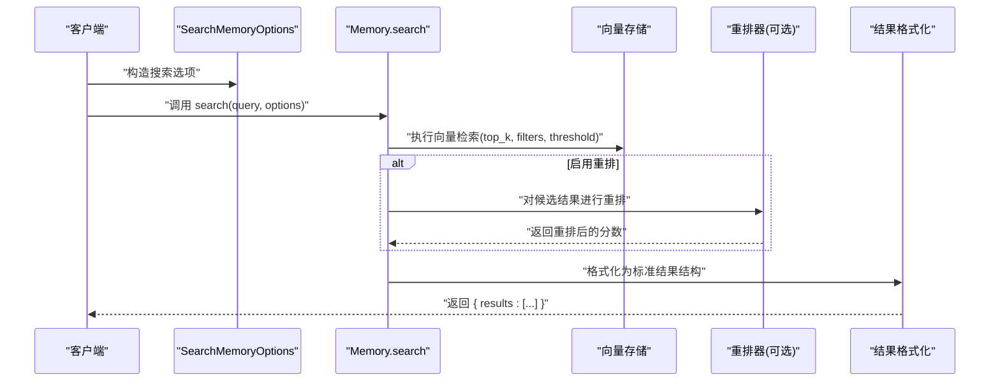
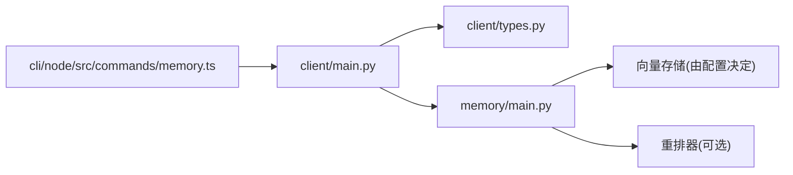

# 搜索记忆

<cite>
**本文引用的文件**
- [mem0/memory/main.py](file://mem0/memory/main.py)
- [mem0/client/main.py](file://mem0/client/main.py)
- [mem0/client/types.py](file://mem0/client/types.py)
- [docs/api-reference/memory/search-memories.mdx](file://docs/api-reference/memory/search-memories.mdx)
- [docs/core-concepts/memory-operations/search.mdx](file://docs/core-concepts/memory-operations/search.mdx)
- [docs/open-source/features/reranker-search.mdx](file://docs/open-source/features/reranker-search.mdx)
- [docs/platform/features/v2-memory-filters.mdx](file://docs/platform/features/v2-memory-filters.mdx)
- [cli/node/src/commands/memory.ts](file://cli/node/src/commands/memory.ts)
- [tests/test_main.py](file://tests/test_main.py)
- [tests/memory/test_performance_slow_query_notice.py](file://tests/memory/test_performance_slow_query_notice.py)
- [LLM.md](file://LLM.md)
</cite>

## 目录
1. [简介](#简介)
2. [项目结构](#项目结构)
3. [核心组件](#核心组件)
4. [架构总览](#架构总览)
5. [详细组件分析](#详细组件分析)
6. [依赖关系分析](#依赖关系分析)
7. [性能考量](#性能考量)
8. [故障排查指南](#故障排查指南)
9. [结论](#结论)
10. [附录](#附录)

## 简介
本文件系统性阐述“搜索记忆”能力，重点围绕 search_memories 方法的使用方式与行为，包括：
- 查询字符串的格式要求与验证规则
- SearchMemoryOptions 参数详解（如 top_k、filters、rerank 等）
- 完整示例：基础搜索、带过滤条件的搜索、以及结合重排的高级搜索
- 搜索结果的格式与排序机制
- 性能优化建议与常见问题解决方案

## 项目结构
与“搜索记忆”直接相关的核心位置如下：
- 核心实现位于内存模块的主类中，提供同步与异步 search 接口
- 客户端层提供统一入口与选项封装
- 文档层提供 API 参考、概念说明与最佳实践
- CLI 层提供命令行参数校验与调用示例

```mermaid
graph TB
subgraph "客户端层"
C1["client/main.py<br/>search(query, options)"]
T1["client/types.py<br/>SearchMemoryOptions"]
end
subgraph "核心实现层"
M1["memory/main.py<br/>Memory.search / AsyncMemory.search"]
end
subgraph "文档与示例"
D1["api-reference/memory/search-memories.mdx"]
D2["core-concepts/memory-operations/search.mdx"]
D3["open-source/features/reranker-search.mdx"]
D4["platform/features/v2-memory-filters.mdx"]
end
subgraph "CLI"
CLI["cli/node/src/commands/memory.ts"]
end
C1 --> M1
T1 --> C1
D1 --> C1
D2 --> M1
D3 --> M1
D4 --> M1
CLI --> C1
```

图表来源
- [mem0/client/main.py:288](file://mem0/client/main.py#L288)
- [mem0/client/types.py:36](file://mem0/client/types.py#L36)
- [mem0/memory/main.py:1232](file://mem0/memory/main.py#L1232)
- [docs/api-reference/memory/search-memories.mdx](file://docs/api-reference/memory/search-memories.mdx)
- [docs/core-concepts/memory-operations/search.mdx](file://docs/core-concepts/memory-operations/search.mdx)
- [docs/open-source/features/reranker-search.mdx](file://docs/open-source/features/reranker-search.mdx)
- [docs/platform/features/v2-memory-filters.mdx](file://docs/platform/features/v2-memory-filters.mdx)
- [cli/node/src/commands/memory.ts:235](file://cli/node/src/commands/memory.ts#L235)

章节来源
- [mem0/client/main.py:288](file://mem0/client/main.py#L288)
- [mem0/client/types.py:36](file://mem0/client/types.py#L36)
- [mem0/memory/main.py:1232](file://mem0/memory/main.py#L1232)
- [docs/api-reference/memory/search-memories.mdx](file://docs/api-reference/memory/search-memories.mdx)
- [docs/core-concepts/memory-operations/search.mdx](file://docs/core-concepts/memory-operations/search.mdx)
- [docs/open-source/features/reranker-search.mdx](file://docs/open-source/features/reranker-search.mdx)
- [docs/platform/features/v2-memory-filters.mdx](file://docs/platform/features/v2-memory-filters.mdx)
- [cli/node/src/commands/memory.ts:235](file://cli/node/src/commands/memory.ts#L235)

## 核心组件
- search_memories 方法（同步与异步）：在内存主类中提供统一的检索接口，支持 top_k、filters、threshold、rerank、explain、reference_date 等参数，并对返回结果进行标准化格式化
- SearchMemoryOptions：客户端层对搜索选项的封装，便于以结构化方式传递参数
- 过滤器体系：支持实体标识符（user_id、agent_id、run_id 等）与元数据增强过滤（比较、集合、逻辑运算等）
- 重排机制：可选的 rerank 开关，结合配置或请求级开关启用语义重排
- 结果解释：explain 开关用于输出评分细节，便于调试与调优

章节来源
- [mem0/memory/main.py:1232](file://mem0/memory/main.py#L1232)
- [mem0/memory/main.py:2766](file://mem0/memory/main.py#L2766)
- [mem0/client/types.py:36](file://mem0/client/types.py#L36)
- [mem0/client/main.py:288](file://mem0/client/main.py#L288)

## 架构总览
下图展示从客户端到核心实现的调用链路与关键处理点。



图表来源
- [mem0/client/main.py:288](file://mem0/client/main.py#L288)
- [mem0/client/types.py:36](file://mem0/client/types.py#L36)
- [mem0/memory/main.py:1232](file://mem0/memory/main.py#L1232)
- [mem0/memory/main.py:2766](file://mem0/memory/main.py#L2766)

## 详细组件分析

### search_memories 方法与参数
- 查询字符串格式要求
  - 作为字符串传入，建议包含明确关键词，以便提升检索质量
  - 可结合 filters 缩小范围，避免过宽泛的查询导致噪声
- 关键参数
  - top_k：返回结果数量上限，默认值与实现细节见源码注释
  - filters：实体标识符与元数据过滤组合，至少包含 user_id、agent_id、run_id 中的一个；支持增强元数据过滤（比较、集合、逻辑运算）
  - threshold：相似度阈值，低于阈值的结果会被过滤
  - rerank：是否启用重排（基于语义重排器），可在配置或请求级开启
  - explain：是否输出评分细节，便于调试与评估
  - reference_date：时间感知查询的参考时间（平台 v3 的时间感知查询内部使用）
- 返回结构
  - 标准化结果列表，每个条目包含 id、memory、hash、时间戳、promoted 元数据字段与额外 metadata 字段
  - 若启用 rerank，可能包含 rerank_score 或重排后的新排序

章节来源
- [mem0/memory/main.py:1232](file://mem0/memory/main.py#L1232)
- [mem0/memory/main.py:2766](file://mem0/memory/main.py#L2766)
- [mem0/memory/main.py:2784](file://mem0/memory/main.py#L2784)
- [mem0/memory/main.py:2788](file://mem0/memory/main.py#L2788)

### SearchMemoryOptions 类
- 作用：封装搜索时的可选参数，便于客户端以结构化方式传递
- 常用字段（依据客户端入口与实现注释）
  - top_k、filters、threshold、rerank、explain、reference_date 等
- 使用建议
  - 在需要复用相同搜索策略时，优先通过该对象集中管理参数
  - 与实现层参数保持一致，避免未知参数导致的错误

章节来源
- [mem0/client/types.py:36](file://mem0/client/types.py#L36)
- [mem0/client/main.py:288](file://mem0/client/main.py#L288)

### 过滤器体系与验证规则
- 实体标识符过滤
  - 至少包含 user_id、agent_id、run_id 之一
  - 示例：filters={"user_id": "...", "agent_id": "..."}
- 元数据增强过滤
  - 支持比较运算（等于、不等于、大于、小于、包含、大小写无关包含等）
  - 支持集合运算（包含于、不包含于）
  - 支持逻辑运算（AND、OR、NOT）
  - 示例：filters={"AND": [{"user_id": "u1"}, {"category": {"in": ["cat1","cat2"]}}]}
- 验证与错误
  - 不合法的过滤器会触发参数校验错误
  - 建议在调用前确保 filters 结构正确且包含必要的实体标识符

章节来源
- [mem0/memory/main.py:2784](file://mem0/memory/main.py#L2784)
- [mem0/memory/main.py:2788](file://mem0/memory/main.py#L2788)
- [docs/platform/features/v2-memory-filters.mdx:108](file://docs/platform/features/v2-memory-filters.mdx#L108)
- [docs/platform/features/v2-memory-filters.mdx:118](file://docs/platform/features/v2-memory-filters.mdx#L118)

### 重排与排序机制
- 重排开关
  - 可在配置中默认启用，也可在每次请求中通过 rerank 控制
  - 重排会改变候选顺序，但不会绕过过滤条件
- 排序依据
  - 默认按语义相似度排序
  - 启用重排后，结果按重排器计算的相关性重新排序
- 结果字段
  - 基础字段：id、memory、hash、created_at、updated_at
  - 元数据：promoted 字段与额外 metadata
  - 重排场景下可能包含 rerank_score 或重排后的排序

章节来源
- [docs/open-source/features/reranker-search.mdx:270](file://docs/open-source/features/reranker-search.mdx#L270)
- [docs/open-source/features/reranker-search.mdx:311](file://docs/open-source/features/reranker-search.mdx#L311)
- [mem0/memory/main.py:1232](file://mem0/memory/main.py#L1232)

### 查询示例与最佳实践
- 基础搜索
  - 使用 filters 指定 user_id 或 agent_id/run_id 组合
  - 设置合理的 top_k 与 threshold
- 带过滤条件的搜索
  - 利用元数据过滤缩小范围（如 category、priority、时间区间等）
  - 使用逻辑运算组合多个条件
- 高级搜索选项
  - 启用 rerank 提升语义相关性排序
  - 使用 explain 输出评分细节，辅助调试
- CLI 调用
  - CLI 对 top_k、threshold、filters 等参数进行校验与传递
  - 可通过命令行指定用户、代理、应用、运行会话等上下文

章节来源
- [docs/api-reference/memory/search-memories.mdx](file://docs/api-reference/memory/search-memories.mdx)
- [docs/core-concepts/memory-operations/search.mdx:159](file://docs/core-concepts/memory-operations/search.mdx#L159)
- [cli/node/src/commands/memory.ts:235](file://cli/node/src/commands/memory.ts#L235)

## 依赖关系分析
- 客户端层依赖内存主类的 search 接口
- 内存主类依赖向量存储与可选重排器
- 过滤器解析与校验在内存主类中完成
- CLI 层负责参数校验与调用转发



图表来源
- [mem0/client/main.py:288](file://mem0/client/main.py#L288)
- [mem0/client/types.py:36](file://mem0/client/types.py#L36)
- [mem0/memory/main.py:1232](file://mem0/memory/main.py#L1232)
- [cli/node/src/commands/memory.ts:235](file://cli/node/src/commands/memory.ts#L235)

章节来源
- [mem0/client/main.py:288](file://mem0/client/main.py#L288)
- [mem0/client/types.py:36](file://mem0/client/types.py#L36)
- [mem0/memory/main.py:1232](file://mem0/memory/main.py#L1232)
- [cli/node/src/commands/memory.ts:235](file://cli/node/src/commands/memory.ts#L235)

## 性能考量
- top_k 与阈值
  - 合理设置 top_k，避免过大导致检索耗时与内存压力上升
  - 使用 threshold 过滤低分结果，减少下游处理成本
- 重排开销
  - 启用 rerank 会增加额外计算，建议在必要时开启或批量控制
- 时间感知查询
  - 平台 v3 的时间感知查询内部使用时间推理，注意其对性能的影响
- 首次运行与慢查询提示
  - 首次运行或慢查询会触发性能提示，有助于识别瓶颈
- 最佳实践
  - 使用具体查询词、合理过滤、限制返回数量、必要时启用 explain 调优

章节来源
- [tests/memory/test_performance_slow_query_notice.py:159](file://tests/memory/test_performance_slow_query_notice.py#L159)
- [docs/core-concepts/memory-operations/search.mdx:159](file://docs/core-concepts/memory-operations/search.mdx#L159)
- [LLM.md:939](file://LLM.md#L939)

## 故障排查指南
- 过滤器语法错误
  - 确保 filters 结构正确，至少包含 user_id、agent_id、run_id 之一
  - 使用逻辑运算符包裹数组，避免根节点为字面值
- 参数范围校验失败
  - CLI 对 top_k、threshold 等参数进行范围校验，需满足最小值与边界条件
- 结果为空或不符合预期
  - 检查 filters 是否过于严格
  - 尝试降低 threshold 或扩大 filters 范围
  - 使用 explain 查看评分细节，定位问题
- 重排未生效
  - 确认已启用 rerank（配置或请求级）
  - 检查重排器配置是否正确
- 时间范围查询
  - 使用 gte/lt 等边界操作符构建日期范围
  - 注意空值与 null 的处理差异

章节来源
- [cli/node/src/commands/memory.ts:249](file://cli/node/src/commands/memory.ts#L249)
- [docs/platform/features/v2-memory-filters.mdx:346](file://docs/platform/features/v2-memory-filters.mdx#L346)
- [docs/platform/features/v2-memory-filters.mdx:369](file://docs/platform/features/v2-memory-filters.mdx#L369)
- [docs/platform/features/v2-memory-filters.mdx:379](file://docs/platform/features/v2-memory-filters.mdx#L379)
- [docs/core-concepts/memory-operations/search.mdx:159](file://docs/core-concepts/memory-operations/search.mdx#L159)

## 结论
search_memories 提供了灵活、可扩展的记忆检索能力。通过合理组织查询词、使用实体标识符与元数据过滤、控制 top_k 与阈值、按需启用重排与 explain，可以在准确性与性能之间取得平衡。建议在生产环境中结合 CLI 校验、性能提示与文档示例，持续迭代优化检索策略。

## 附录

### API 行为与测试参考
- 单元测试覆盖了搜索流程与返回结构的基本行为
- 测试中模拟了向量存储返回的候选集与嵌入编码过程

章节来源
- [tests/test_main.py:93](file://tests/test_main.py#L93)