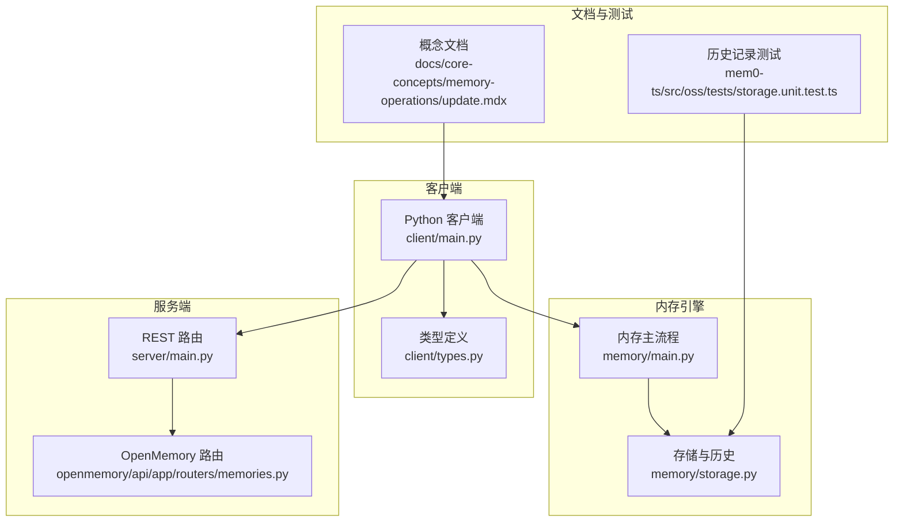
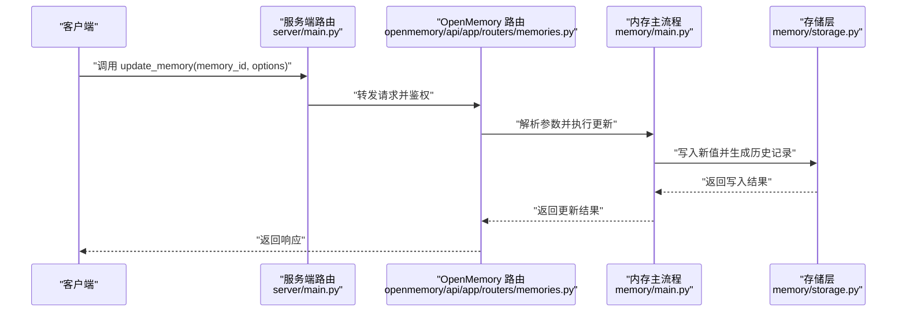
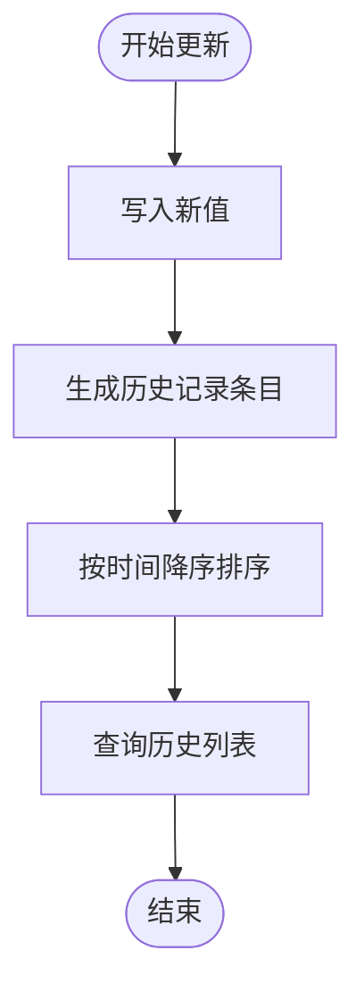
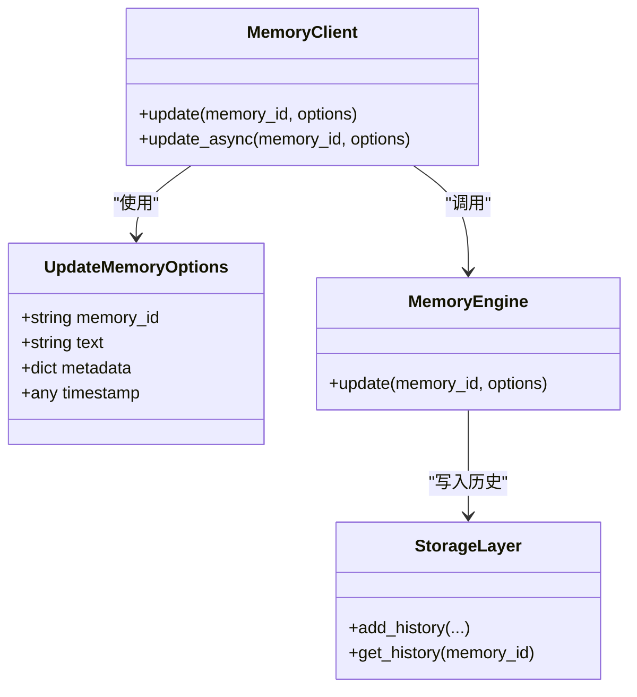

# 更新记忆

<cite>
**本文引用的文件**
- [mem0/client/main.py](file://mem0/client/main.py)
- [mem0/client/types.py](file://mem0/client/types.py)
- [mem0/memory/main.py](file://mem0/memory/main.py)
- [mem0/memory/storage.py](file://mem0/memory/storage.py)
- [server/main.py](file://server/main.py)
- [openmemory/api/app/routers/memories.py](file://openmemory/api/app/routers/memories.py)
- [docs/core-concepts/memory-operations/update.mdx](file://docs/core-concepts/memory-operations/update.mdx)
- [docs/platform/features/timestamp.mdx](file://docs/platform/features/timestamp.mdx)
- [cli/python/src/mem0_cli/commands/memory.py](file://cli/python/src/mem0_cli/commands/memory.py)
- [mem0-ts/src/oss/tests/storage.unit.test.ts](file://mem0-ts/src/oss/tests/storage.unit.test.ts)
</cite>

## 目录
1. [简介](#简介)
2. [项目结构](#项目结构)
3. [核心组件](#核心组件)
4. [架构总览](#架构总览)
5. [详细组件分析](#详细组件分析)
6. [依赖关系分析](#依赖关系分析)
7. [性能考量](#性能考量)
8. [故障排除指南](#故障排除指南)
9. [结论](#结论)
10. [附录](#附录)

## 简介
本篇文档围绕“更新记忆”操作进行系统化说明，重点覆盖以下方面：
- update_memory 方法的使用方式与调用流程
- UpdateMemoryOptions 类的关键参数（text、metadata、timestamp 等）及其必填/可选要求
- 部分更新与完全更新的实践差异
- 更新后的记忆历史记录机制与时间线维护
- 并发更新的处理与冲突解决策略
- 最佳实践与常见错误处理建议

## 项目结构
与“更新记忆”直接相关的核心模块分布如下：
- 客户端层：Python 客户端提供 update_memory 接口与 UpdateMemoryOptions 参数类型定义
- 内存引擎层：内存主流程与存储层负责实际写入与历史记录维护
- 服务端层：REST API 路由与业务逻辑对接客户端请求
- 文档层：官方概念文档与平台特性文档对参数语义与时间戳使用进行说明
- CLI 层：命令行工具中也包含与记忆更新相关的命令实现
- 测试层：TS 单测验证历史记录的添加与排序行为

图示来源
- [mem0/client/main.py](file://mem0/client/main.py)
- [mem0/client/types.py](file://mem0/client/types.py)
- [mem0/memory/main.py](file://mem0/memory/main.py)
- [mem0/memory/storage.py](file://mem0/memory/storage.py)
- [server/main.py](file://server/main.py)
- [openmemory/api/app/routers/memories.py](file://openmemory/api/app/routers/memories.py)
- [docs/core-concepts/memory-operations/update.mdx](file://docs/core-concepts/memory-operations/update.mdx)
- [mem0-ts/src/oss/tests/storage.unit.test.ts](file://mem0-ts/src/oss/tests/storage.unit.test.ts)

章节来源
- [mem0/client/main.py](file://mem0/client/main.py)
- [mem0/client/types.py](file://mem0/client/types.py)
- [mem0/memory/main.py](file://mem0/memory/main.py)
- [mem0/memory/storage.py](file://mem0/memory/storage.py)
- [server/main.py](file://server/main.py)
- [openmemory/api/app/routers/memories.py](file://openmemory/api/app/routers/memories.py)
- [docs/core-concepts/memory-operations/update.mdx](file://docs/core-concepts/memory-operations/update.mdx)
- [mem0-ts/src/oss/tests/storage.unit.test.ts](file://mem0-ts/src/oss/tests/storage.unit.test.ts)

## 核心组件
- Python 客户端 update_memory 方法：对外暴露统一的更新入口，支持传入 UpdateMemoryOptions 进行参数化更新
- UpdateMemoryOptions 类型：定义 text、metadata、timestamp 等字段，用于描述更新内容与上下文
- 内存主流程 memory/main.py：协调向量数据库、嵌入模型与存储层，执行更新写入
- 存储层 memory/storage.py：负责持久化与历史记录管理，确保每次变更可追溯
- 服务端路由 server/main.py 与 OpenMemory 路由 openmemory/api/app/routers/memories.py：承接外部请求，完成鉴权与参数校验后委派到内存引擎
- 文档与测试：概念文档明确参数语义；TS 测试验证历史记录的正确性与排序

章节来源
- [mem0/client/main.py](file://mem0/client/main.py)
- [mem0/client/types.py:87](file://mem0/client/types.py#L87-L120)
- [mem0/memory/main.py](file://mem0/memory/main.py)
- [mem0/memory/storage.py](file://mem0/memory/storage.py)
- [server/main.py:462](file://server/main.py#L462-L520)
- [openmemory/api/app/routers/memories.py:517](file://openmemory/api/app/routers/memories.py#L517-L580)
- [docs/core-concepts/memory-operations/update.mdx](file://docs/core-concepts/memory-operations/update.mdx)
- [mem0-ts/src/oss/tests/storage.unit.test.ts:155-194](file://mem0-ts/src/oss/tests/storage.unit.test.ts#L155-L194)

## 架构总览
下图展示从客户端到服务端再到内存引擎与存储的历史记录写入路径。

图示来源
- [server/main.py:462](file://server/main.py#L462-L520)
- [openmemory/api/app/routers/memories.py:517](file://openmemory/api/app/routers/memories.py#L517-L580)
- [mem0/memory/main.py](file://mem0/memory/main.py)
- [mem0/memory/storage.py](file://mem0/memory/storage.py)

## 详细组件分析

### UpdateMemoryOptions 参数详解
- 必需参数
  - memory_id：通过 add 或 search 返回的记忆唯一标识，用于定位待更新目标
- 可选参数
  - text：要替换或更新的记忆内容
  - metadata：键值对形式的元数据，可用于过滤、分类或增强检索
  - timestamp：自定义时间戳（Unix 秒或 ISO 8601 字符串），用于覆盖默认写入时间，保持时间线准确性
  - 其他：根据具体实现可能支持增量字段（例如仅更新 metadata）

参数语义与约束可参考官方概念文档中的“Key terms”与“Using Custom Timestamps”。

章节来源
- [docs/core-concepts/memory-operations/update.mdx](file://docs/core-concepts/memory-operations/update.mdx)
- [docs/platform/features/timestamp.mdx](file://docs/platform/features/timestamp.mdx)
- [mem0/client/types.py:87-120](file://mem0/client/types.py#L87-L120)

### update_memory 方法使用与调用流程
- 客户端入口
  - 同步与异步两种调用方式均支持，分别对应不同场景下的性能与并发需求
  - 建议在高并发或批量更新时优先考虑异步接口以提升吞吐
- 参数传递
  - 使用 UpdateMemoryOptions 封装 text、metadata、timestamp 等，避免散乱参数带来的歧义
- 服务端处理
  - 鉴权与参数校验通过后，路由层将请求委派给内存主流程
- 内存引擎与存储
  - 引擎层负责更新嵌入向量与元数据索引
  - 存储层写入新值并生成一条历史记录条目，保留旧值以便回溯

章节来源
- [mem0/client/main.py:338-370](file://mem0/client/main.py#L338-L370)
- [mem0/client/main.py:1254-1280](file://mem0/client/main.py#L1254-L1280)
- [server/main.py:462](file://server/main.py#L462-L520)
- [openmemory/api/app/routers/memories.py:517](file://openmemory/api/app/routers/memories.py#L517-L580)
- [mem0/memory/main.py](file://mem0/memory/main.py)
- [mem0/memory/storage.py](file://mem0/memory/storage.py)

### 部分更新与完全更新
- 部分更新
  - 仅提供需要变更的字段（如仅更新 metadata 或仅更新 text）
  - 未提供的字段保持不变，避免误覆盖
- 完全更新
  - 同时提供 text、metadata、timestamp 等全部字段
  - 适用于需要一次性重置记忆状态的场景
- 实践建议
  - 在频繁变更的场景下优先采用部分更新，降低写放大与冲突概率
  - 对于批量导入或迁移，采用完全更新以保证一致性

章节来源
- [docs/core-concepts/memory-operations/update.mdx](file://docs/core-concepts/memory-operations/update.mdx)
- [mem0/client/types.py:87-120](file://mem0/client/types.py#L87-L120)

### 更新后的记忆历史记录机制
- 每次更新都会在历史表中新增一条记录，包含：
  - memory_id：关联的记忆标识
  - old_value/new_value：更新前后的值对比
  - action：操作类型（如 UPDATE）
  - timestamp：更新发生的时间点（可为用户指定或系统生成）
- 查询历史
  - 支持按 memory_id 获取历史列表，并按时间降序排列
  - 对不存在的记忆返回空列表，便于前端容错
- 测试验证
  - TS 单测覆盖了历史记录的添加、排序与边界情况

图示来源
- [mem0-ts/src/oss/tests/storage.unit.test.ts:155-194](file://mem0-ts/src/oss/tests/storage.unit.test.ts#L155-L194)
- [mem0/memory/storage.py](file://mem0/memory/storage.py)

章节来源
- [mem0-ts/src/oss/tests/storage.unit.test.ts:155-194](file://mem0-ts/src/oss/tests/storage.unit.test.ts#L155-L194)
- [mem0/memory/storage.py](file://mem0/memory/storage.py)

### 并发更新的处理与冲突解决
- 并发写入
  - 多个客户端同时更新同一 memory_id 时，应遵循“最后写入获胜”的策略
  - 历史记录会保留所有变更，便于审计与回溯
- 冲突解决
  - 基于时间戳的最终一致性：timestamp 更新的更新视为有效
  - 若未显式提供 timestamp，使用系统时间作为比较基准
- 建议
  - 在应用层引入幂等性控制（如基于客户端生成的请求 ID），避免重复提交导致的历史冗余
  - 对关键记忆设置“不可变”标记，必要时通过删除+重建规避并发风险

章节来源
- [docs/platform/features/timestamp.mdx](file://docs/platform/features/timestamp.mdx)
- [mem0/memory/storage.py](file://mem0/memory/storage.py)

### 完整示例（步骤说明）
- 场景一：部分更新文本
  - 步骤：构造 UpdateMemoryOptions，仅设置 text；调用 update_memory；确认历史记录新增一条 UPDATE 条目
- 场景二：完全更新（文本+元数据+时间戳）
  - 步骤：构造 UpdateMemoryOptions，设置 text、metadata、timestamp；调用 update_memory；核对向量与索引已同步更新
- 场景三：批量更新（平台能力）
  - 步骤：使用平台提供的批量更新接口，单次请求更新多个 memory_id；关注返回的每个项的状态与错误信息

章节来源
- [docs/core-concepts/memory-operations/update.mdx](file://docs/core-concepts/memory-operations/update.mdx)
- [mem0/client/main.py:338-370](file://mem0/client/main.py#L338-L370)
- [mem0/client/main.py:1254-1280](file://mem0/client/main.py#L1254-L1280)

### 类型与接口关系

图示来源
- [mem0/client/types.py:87-120](file://mem0/client/types.py#L87-L120)
- [mem0/client/main.py:338-370](file://mem0/client/main.py#L338-L370)
- [mem0/client/main.py:1254-1280](file://mem0/client/main.py#L1254-L1280)
- [mem0/memory/main.py](file://mem0/memory/main.py)
- [mem0/memory/storage.py](file://mem0/memory/storage.py)

## 依赖关系分析
- 客户端依赖
  - UpdateMemoryOptions 作为强类型参数，确保调用方提供正确的字段组合
  - 同步/异步接口并存，满足不同性能需求
- 服务端依赖
  - server/main.py 与 openmemory/api/app/routers/memories.py 提供统一入口，完成鉴权与参数透传
- 存储依赖
  - memory/storage.py 维护历史记录与持久化，是更新可追溯性的基础

图示来源
- [mem0/client/types.py:87-120](file://mem0/client/types.py#L87-L120)
- [mem0/client/main.py:338-370](file://mem0/client/main.py#L338-L370)
- [server/main.py:462](file://server/main.py#L462-L520)
- [openmemory/api/app/routers/memories.py:517](file://openmemory/api/app/routers/memories.py#L517-L580)
- [mem0/memory/main.py](file://mem0/memory/main.py)
- [mem0/memory/storage.py](file://mem0/memory/storage.py)

章节来源
- [mem0/client/types.py:87-120](file://mem0/client/types.py#L87-L120)
- [mem0/client/main.py:338-370](file://mem0/client/main.py#L338-L370)
- [server/main.py:462](file://server/main.py#L462-L520)
- [openmemory/api/app/routers/memories.py:517](file://openmemory/api/app/routers/memories.py#L517-L580)
- [mem0/memory/main.py](file://mem0/memory/main.py)
- [mem0/memory/storage.py](file://mem0/memory/storage.py)

## 性能考量
- 批量更新
  - 平台提供批量更新能力，建议在需要同时修改大量记忆时使用，减少网络往返与事务开销
- 异步接口
  - 在高并发场景优先使用异步 update，提高吞吐与资源利用率
- 历史记录成本
  - 每次更新都会产生历史记录，长期运行会产生额外存储与查询成本，建议定期归档或清理策略

## 故障排除指南
- 常见问题
  - memory_id 无效：检查是否来自 add 或 search 的返回值
  - 参数缺失：确保至少提供 memory_id；若仅更新部分字段，其他字段可省略
  - 时间戳格式错误：timestamp 支持 Unix 秒或 ISO 8601 字符串，注意时区与精度
  - 并发冲突：多实例同时更新同一记忆时，确认最终一致性策略与历史记录审计
- 排查步骤
  - 使用 get_history 检查历史记录顺序与内容
  - 核对服务端日志与返回状态码
  - 对批量更新逐项检查失败原因并重试

章节来源
- [mem0-ts/src/oss/tests/storage.unit.test.ts:155-194](file://mem0-ts/src/oss/tests/storage.unit.test.ts#L155-L194)
- [openmemory/api/app/routers/memories.py:517](file://openmemory/api/app/routers/memories.py#L517-L580)
- [docs/platform/features/timestamp.mdx](file://docs/platform/features/timestamp.mdx)

## 结论
更新记忆是维护知识库准确性的关键能力。通过强类型的 UpdateMemoryOptions 与完善的存储历史机制，系统能够在保证一致性的同时提供灵活的更新方式。结合批量更新与异步接口，可在高并发场景下获得更优的性能表现。建议在生产环境中配合时间戳策略、历史审计与幂等控制，构建稳健的更新体系。

## 附录
- CLI 中的记忆更新命令实现可参考：
  - [cli/python/src/mem0_cli/commands/memory.py](file://cli/python/src/mem0_cli/commands/memory.py)
- 更多参数与使用示例请参阅：
  - [docs/core-concepts/memory-operations/update.mdx](file://docs/core-concepts/memory-operations/update.mdx)
  - [docs/platform/features/timestamp.mdx](file://docs/platform/features/timestamp.mdx)