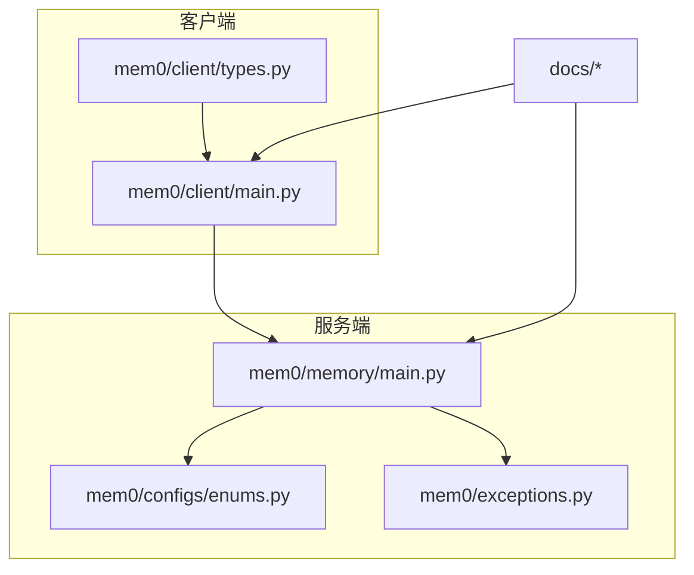
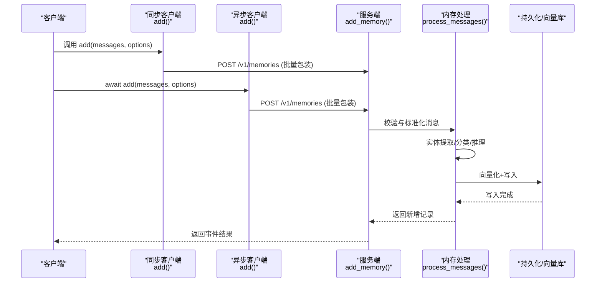
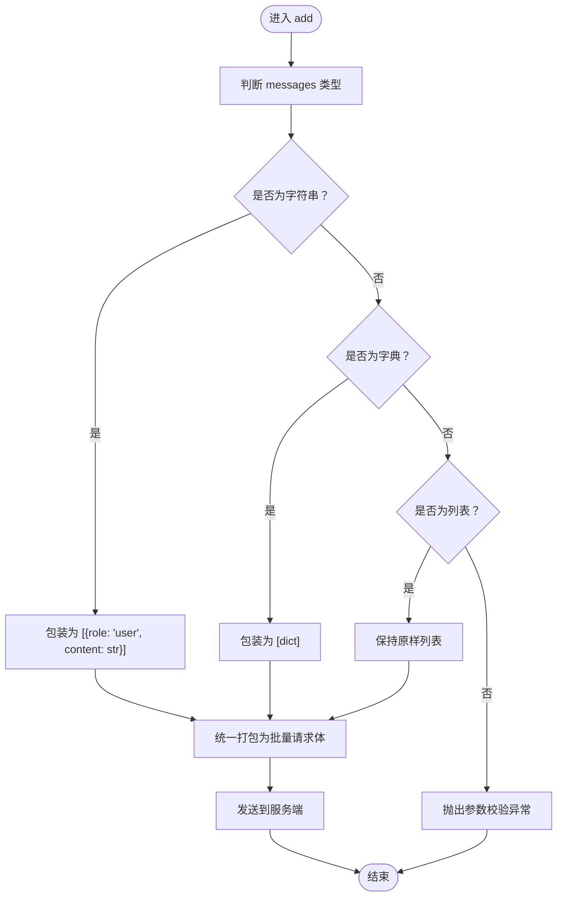
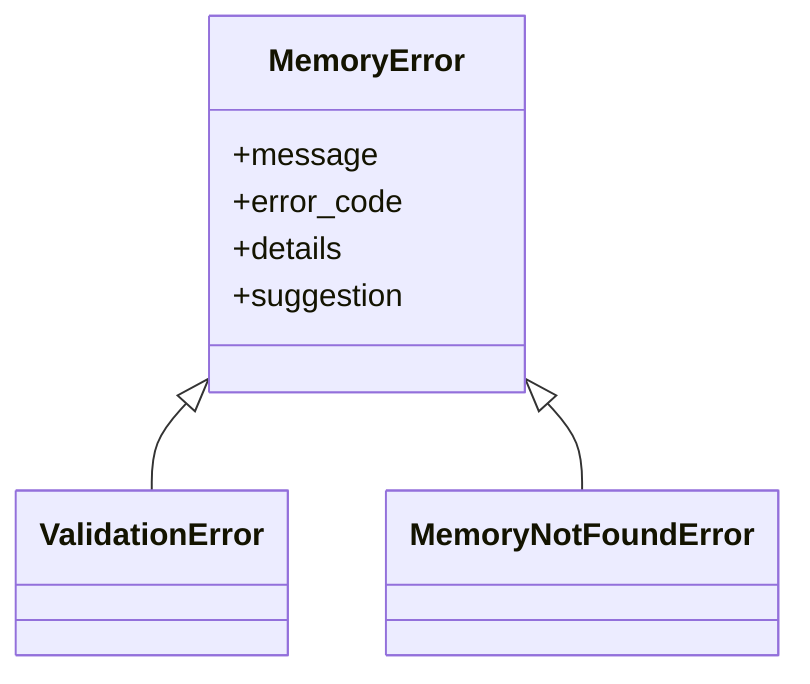
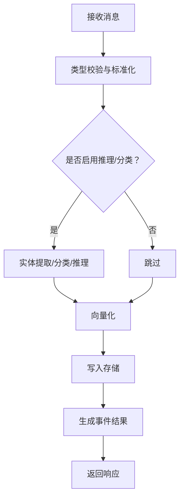
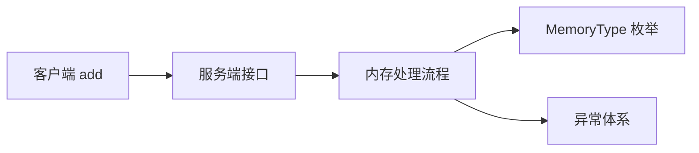

# 添加记忆

<cite>
**本文引用的文件**
- [mem0/client/main.py](file://mem0/client/main.py)
- [mem0/client/types.py](file://mem0/client/types.py)
- [mem0/memory/main.py](file://mem0/memory/main.py)
- [mem0/configs/enums.py](file://mem0/configs/enums.py)
- [mem0/exceptions.py](file://mem0/exceptions.py)
- [docs/open-source/features/async-memory.mdx](file://docs/open-source/features/async-memory.mdx)
- [skills/mem0/references/features.md](file://skills/mem0/references/features.md)
- [docs/api-reference/memory/add-memories.mdx](file://docs/api-reference/memory/add-memories.mdx)
</cite>

## 目录
1. [简介](#简介)
2. [项目结构](#项目结构)
3. [核心组件](#核心组件)
4. [架构总览](#架构总览)
5. [详细组件分析](#详细组件分析)
6. [依赖关系分析](#依赖关系分析)
7. [性能考量](#性能考量)
8. [故障排查指南](#故障排查指南)
9. [结论](#结论)
10. [附录](#附录)

## 简介
本篇文档聚焦于“添加记忆”操作，系统性说明 Python 客户端与服务端在实现 add_memory 方法时对消息输入的支持范围、参数校验规则、异常处理策略以及性能与最佳实践。重点覆盖以下方面：
- 支持的消息格式：字符串、字典、列表（含多模态内容）
- AddMemoryOptions 参数详解：filters、metadata、infer、custom_categories、custom_instructions、timestamp、structured_data_schema
- 单条与批量添加的差异与适用场景
- 参数验证与异常类型
- 性能优化建议与常见问题排查

## 项目结构
围绕“添加记忆”的关键代码分布在以下模块：
- 客户端入口与方法：mem0/client/main.py
- 客户端选项模型：mem0/client/types.py
- 服务端内存处理逻辑：mem0/memory/main.py
- 枚举与异常：mem0/configs/enums.py、mem0/exceptions.py
- 文档参考：docs/open-source/features/async-memory.mdx、skills/mem0/references/features.md、docs/api-reference/memory/add-memories.mdx

图表来源
- [mem0/client/main.py](file://mem0/client/main.py)
- [mem0/client/types.py](file://mem0/client/types.py)
- [mem0/memory/main.py](file://mem0/memory/main.py)
- [mem0/configs/enums.py](file://mem0/configs/enums.py)
- [mem0/exceptions.py](file://mem0/exceptions.py)
- [docs/open-source/features/async-memory.mdx](file://docs/open-source/features/async-memory.mdx)
- [skills/mem0/references/features.md](file://skills/mem0/references/features.md)
- [docs/api-reference/memory/add-memories.mdx](file://docs/api-reference/memory/add-memories.mdx)

章节来源
- [mem0/client/main.py](file://mem0/client/main.py)
- [mem0/client/types.py](file://mem0/client/types.py)
- [mem0/memory/main.py](file://mem0/memory/main.py)
- [mem0/configs/enums.py](file://mem0/configs/enums.py)
- [mem0/exceptions.py](file://mem0/exceptions.py)
- [docs/open-source/features/async-memory.mdx](file://docs/open-source/features/async-memory.mdx)
- [skills/mem0/references/features.md](file://skills/mem0/references/features.md)
- [docs/api-reference/memory/add-memories.mdx](file://docs/api-reference/memory/add-memories.mdx)

## 核心组件
- 客户端 add 方法：负责将用户提供的消息与选项封装为请求体，并调用服务端接口；支持同步与异步两种形态。
- AddMemoryOptions 模型：定义过滤器、元数据、推理开关、分类器、指令、时间戳、结构化数据模式等参数。
- 服务端 add 流程：接收消息，进行类型校验与标准化，执行实体链接与向量化存储，返回事件结果。

章节来源
- [mem0/client/main.py](file://mem0/client/main.py)
- [mem0/client/types.py](file://mem0/client/types.py)
- [mem0/memory/main.py](file://mem0/memory/main.py)

## 架构总览
下图展示了从客户端到服务端的“添加记忆”调用链路与关键处理节点。

图表来源
- [mem0/client/main.py](file://mem0/client/main.py)
- [mem0/memory/main.py](file://mem0/memory/main.py)

## 详细组件分析

### add_memory 方法与消息格式支持
- 输入支持三种形式：
  - 字符串：会被自动包装为单条用户消息
  - 字典：作为单条消息传入
  - 列表：作为多条消息传入
- 多模态内容：支持文本、图片（URL/Base64）、文档（MDX/TXT/PDF）等，详见多模态参考文档。
- 批量提交：客户端内部会将单条或多条消息统一包装为批量请求体，再发送至服务端。

图表来源
- [mem0/memory/main.py](file://mem0/memory/main.py)

章节来源
- [mem0/memory/main.py](file://mem0/memory/main.py)
- [skills/mem0/references/features.md](file://skills/mem0/references/features.md)

### AddMemoryOptions 参数详解
- filters：可选，用于指定身份域（如 user_id、agent_id、app_id 等），需放入 filters 字典中，不在顶层传递
- metadata：可选，附加元数据
- infer：可选，是否对输入进行推理以抽取记忆要点
- custom_categories：可选，自定义分类器配置
- custom_instructions：可选，定制事实抽取指令
- timestamp：可选，Unix 时间戳，用于控制记忆的时间属性
- structured_data_schema：可选，结构化数据抽取的模式定义

章节来源
- [mem0/client/types.py](file://mem0/client/types.py)

### 单条 vs 批量添加
- 单条添加：传入字符串、字典或仅一条消息的列表
- 批量添加：传入多条消息的列表，客户端会将其整体打包为批量请求体
- 两者最终均通过服务端统一处理流程，区别在于请求体的规模与并发特性

章节来源
- [mem0/client/main.py](file://mem0/client/main.py)
- [mem0/memory/main.py](file://mem0/memory/main.py)

### 参数验证规则与异常处理
- 验证规则
  - messages 必须为字符串、字典或字典列表，否则触发参数校验异常
  - memory_type 若指定，必须为过程性记忆类型
- 异常类型
  - 参数校验失败：ValidationError
  - 记忆不存在：MemoryNotFoundError
  - 其他网络/配额/限流等：对应具体异常类型

图表来源
- [mem0/exceptions.py](file://mem0/exceptions.py)

章节来源
- [mem0/memory/main.py](file://mem0/memory/main.py)
- [mem0/exceptions.py](file://mem0/exceptions.py)

### 处理流程与数据模型
- 服务端处理阶段概览
  - 校验与标准化消息
  - 可选：实体提取、分类、推理
  - 向量化与持久化
  - 返回事件结果（包含新增记录）

图表来源
- [mem0/memory/main.py](file://mem0/memory/main.py)

章节来源
- [mem0/memory/main.py](file://mem0/memory/main.py)

### 多模态内容支持
- 图片（URL/Base64）
- 文档（MDX/TXT）
- PDF
- 客户端会按规范提取有效文本内容后进行存储

章节来源
- [skills/mem0/references/features.md](file://skills/mem0/references/features.md)

### API 参考与使用示例路径
- 官方 API 文档：添加记忆接口
- 示例路径（请参阅对应文档文件，避免直接粘贴代码）：
  - [docs/api-reference/memory/add-memories.mdx](file://docs/api-reference/memory/add-memories.mdx)
  - [docs/open-source/features/async-memory.mdx](file://docs/open-source/features/async-memory.mdx)
  - [skills/mem0/references/features.md](file://skills/mem0/references/features.md)

章节来源
- [docs/api-reference/memory/add-memories.mdx](file://docs/api-reference/memory/add-memories.mdx)
- [docs/open-source/features/async-memory.mdx](file://docs/open-source/features/async-memory.mdx)
- [skills/mem0/references/features.md](file://skills/mem0/references/features.md)

## 依赖关系分析
- 客户端 add 方法依赖服务端接口与统一的批量请求体结构
- 服务端 add 流程依赖内存类型枚举与异常体系
- 多模态处理依赖外部解析逻辑（由参考文档给出）

图表来源
- [mem0/client/main.py](file://mem0/client/main.py)
- [mem0/memory/main.py](file://mem0/memory/main.py)
- [mem0/configs/enums.py](file://mem0/configs/enums.py)
- [mem0/exceptions.py](file://mem0/exceptions.py)

章节来源
- [mem0/client/main.py](file://mem0/client/main.py)
- [mem0/memory/main.py](file://mem0/memory/main.py)
- [mem0/configs/enums.py](file://mem0/configs/enums.py)
- [mem0/exceptions.py](file://mem0/exceptions.py)

## 性能考量
- 批量提交优于频繁单条提交，减少网络往返与序列化开销
- 控制消息数量与大小，避免超长文本导致编码与向量化耗时增加
- 使用异步客户端提升并发吞吐（尤其在高 QPS 场景）
- 对大体积多模态内容，建议预处理裁剪或分块，降低单次处理压力
- 合理设置 filters 以缩小检索范围，提高后续检索效率

## 故障排查指南
- 常见异常与定位
  - 参数校验失败：检查 messages 的类型与结构，确保符合字符串/字典/列表要求
  - 记忆不存在：确认 memory_id 或过滤条件是否正确
  - 网络/配额/限流：根据异常类型调整重试策略与速率限制
- 排查步骤
  - 核对 AddMemoryOptions 中的 filters、metadata、timestamp 等字段
  - 在异步场景下观察事件 ID 与处理时延
  - 结合日志与事件追踪定位瓶颈

章节来源
- [mem0/exceptions.py](file://mem0/exceptions.py)
- [mem0/memory/main.py](file://mem0/memory/main.py)
- [docs/open-source/features/async-memory.mdx](file://docs/open-source/features/async-memory.mdx)

## 结论
“添加记忆”在客户端与服务端之间形成了清晰的职责边界：客户端负责消息格式标准化与批量封装，服务端负责校验、推理、分类与持久化。通过合理选择消息格式、正确配置 AddMemoryOptions、采用批量与异步策略，可在保证稳定性的同时获得更优的性能表现。

## 附录
- 最佳实践
  - 优先使用批量提交，合并相近时间段内的多次添加
  - 对多模态内容进行预处理，去除无关上下文
  - 明确 filters 的作用域，避免跨用户/跨代理的数据泄露
  - 在异步环境中结合日志与指标监控，持续评估性能