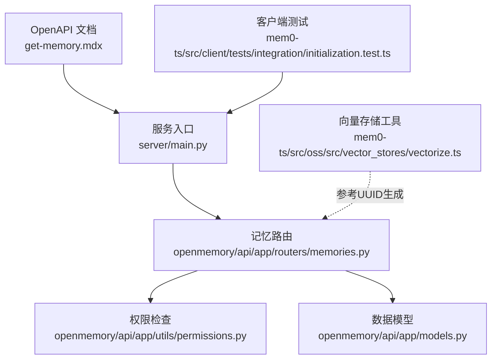
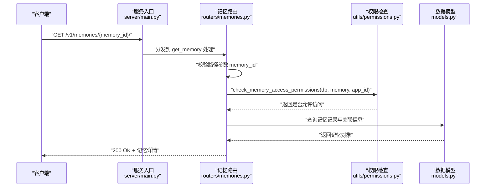
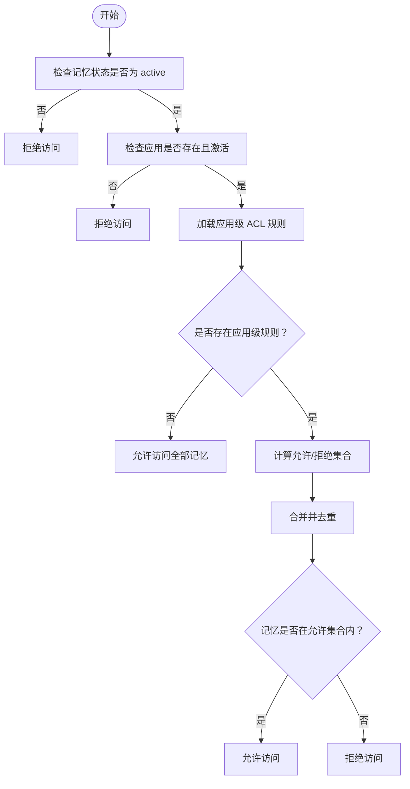
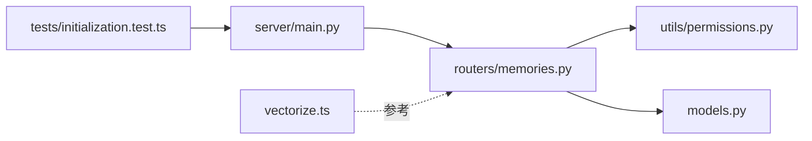

# 获取记忆详情

<cite>
**本文引用的文件**
- [get-memory.mdx](file://docs/api-reference/memory/get-memory.mdx)
- [memories.py](file://openmemory/api/app/routers/memories.py)
- [models.py](file://openmemory/api/app/models.py)
- [permissions.py](file://openmemory/api/app/utils/permissions.py)
- [main.py](file://server/main.py)
- [initialization.test.ts](file://mem0-ts/src/client/tests/integration/initialization.test.ts)
- [vectorize.ts](file://mem0-ts/src/oss/src/vector_stores/vectorize.ts)
- [export_openmemory.sh](file://openmemory/backup-scripts/export_openmemory.sh)
</cite>

## 目录
1. [简介](#简介)
2. [项目结构](#项目结构)
3. [核心组件](#核心组件)
4. [架构总览](#架构总览)
5. [详细组件分析](#详细组件分析)
6. [依赖关系分析](#依赖关系分析)
7. [性能考虑](#性能考虑)
8. [故障排除指南](#故障排除指南)
9. [结论](#结论)
10. [附录](#附录)

## 简介
本文件面向需要调用“获取记忆详情”接口的开发者与集成者，系统性说明 get_memory 方法的使用方式、记忆 ID 的格式与校验规则、返回数据结构（记忆内容、元数据、时间戳等）、权限控制与访问限制、错误处理策略，以及典型使用场景与注意事项。文档同时提供从 OpenAPI 规范到后端实现的端到端映射，并给出可直接参考的调用流程图与时序图。

## 项目结构
围绕“获取记忆详情”的相关实现分布在以下模块：
- 文档层：OpenAPI 规范定义了接口路径与请求行为
- 后端路由层：负责解析路径参数、鉴权与业务调用
- 数据模型层：定义记忆对象、分类、访问控制等实体
- 权限工具层：提供基于应用与访问控制列表的授权检查
- 客户端测试层：覆盖无效 ID 与不存在 ID 的错误行为
- 向量存储层：展示 UUID 生成与索引元数据的使用场景

图表来源
- [get-memory.mdx](file://docs/api-reference/memory/get-memory.mdx)
- [main.py](file://server/main.py)
- [memories.py](file://openmemory/api/app/routers/memories.py)
- [permissions.py](file://openmemory/api/app/utils/permissions.py)
- [models.py](file://openmemory/api/app/models.py)
- [initialization.test.ts](file://mem0-ts/src/client/tests/integration/initialization.test.ts)
- [vectorize.ts](file://mem0-ts/src/oss/src/vector_stores/vectorize.ts)

章节来源
- [get-memory.mdx](file://docs/api-reference/memory/get-memory.mdx)
- [main.py](file://server/main.py)
- [memories.py](file://openmemory/api/app/routers/memories.py)

## 核心组件
- 接口定义与路径参数
  - 接口名称：获取记忆详情
  - OpenAPI 路径：GET /v1/memories/{memory_id}/
  - 路径参数：memory_id（字符串）
- 记忆对象模型
  - 包含主键 memory_id（UUID）
  - 元数据字段：agent_id、user_id、run_id、hash 等
  - 分类关联：通过中间表 memory_categories 关联类别
- 权限控制
  - 基于应用状态与访问控制列表（ACL）进行授权
  - 支持“允许/拒绝”两类规则，支持对特定记忆或全部记忆生效
- 错误处理
  - 非法 UUID 字符串触发参数校验错误
  - 不存在的记忆 ID 返回资源不存在错误

章节来源
- [get-memory.mdx](file://docs/api-reference/memory/get-memory.mdx)
- [memories.py](file://openmemory/api/app/routers/memories.py)
- [models.py](file://openmemory/api/app/models.py)
- [permissions.py](file://openmemory/api/app/utils/permissions.py)
- [initialization.test.ts](file://mem0-ts/src/client/tests/integration/initialization.test.ts)

## 架构总览
下图展示了从客户端到服务端、再到数据库与权限系统的整体调用链路。

图表来源
- [main.py](file://server/main.py)
- [memories.py](file://openmemory/api/app/routers/memories.py)
- [permissions.py](file://openmemory/api/app/utils/permissions.py)
- [models.py](file://openmemory/api/app/models.py)

## 详细组件分析

### 接口与路径参数
- 接口名称：获取记忆详情
- 请求方法：GET
- 路径模板：/v1/memories/{memory_id}/
- 路径参数：
  - memory_id：字符串类型，表示目标记忆的唯一标识
- 响应：
  - 成功：返回记忆对象的 JSON 结构
  - 失败：根据错误类型返回相应状态码与错误信息

章节来源
- [get-memory.mdx](file://docs/api-reference/memory/get-memory.mdx)

### 记忆 ID 的格式要求与验证
- 格式要求
  - 必须为合法的 UUID 字符串（通常为 36 字符，包含连字符）
- 参数校验
  - 当传入非 UUID 字符串时，将触发参数校验错误（例如 400）
  - 当传入合法 UUID 但数据库中不存在该 ID 时，将触发资源不存在错误（例如 404）
- 测试覆盖
  - 客户端测试用例验证了非法 ID 抛出参数校验异常
  - 客户端测试用例验证了不存在的 UUID 抛出“记忆不存在”异常

章节来源
- [initialization.test.ts](file://mem0-ts/src/client/tests/integration/initialization.test.ts)

### 返回的数据结构
- 记忆对象（核心字段）
  - memory_id：记忆主键（UUID）
  - 内容字段：content（字符串）
  - 元数据字段：agent_id、user_id、run_id、hash 等
  - 时间戳字段：created_at、updated_at 等
  - 分类字段：categories（可选，按需返回）
- 关联实体
  - 分类：通过中间表 memory_categories 关联多个类别
  - 访问控制：通过 access_controls 表控制应用对记忆的访问范围

章节来源
- [models.py](file://openmemory/api/app/models.py)
- [memories.py](file://openmemory/api/app/routers/memories.py)

### 权限控制与访问限制
- 授权条件
  - 记忆状态必须为 active
  - 应用状态必须为激活（is_active）
  - 应用级访问控制列表（ACL）必须允许访问
- ACL 规则
  - 支持 allow/deny 两种效果
  - 支持针对特定记忆或全部记忆的规则
  - 若未配置应用级规则，则默认允许所有记忆
- 访问集合计算
  - 通过 get_accessible_memory_ids 计算允许访问的记忆集合
  - deny 优先于 allow；若规则指向“全部拒绝”，则无记忆可访问

图表来源
- [permissions.py](file://openmemory/api/app/utils/permissions.py)
- [memories.py](file://openmemory/api/app/routers/memories.py)

章节来源
- [permissions.py](file://openmemory/api/app/utils/permissions.py)
- [memories.py](file://openmemory/api/app/routers/memories.py)

### 错误处理
- 参数校验失败（如非 UUID 字符串）
  - 状态码：400
  - 异常类型：参数校验异常
- 记忆不存在（合法 UUID 但数据库中无匹配）
  - 状态码：404
  - 异常类型：记忆不存在异常
- 权限不足
  - 状态码：403 或 404（取决于具体实现分支）
  - 原因：应用状态不满足、ACL 拒绝或未配置允许规则

章节来源
- [initialization.test.ts](file://mem0-ts/src/client/tests/integration/initialization.test.ts)
- [permissions.py](file://openmemory/api/app/utils/permissions.py)

### 获取单个记忆的完整示例
- 步骤
  1) 准备请求：使用 GET 方法访问 /v1/memories/{memory_id}/
  2) 校验参数：确保 memory_id 为合法 UUID
  3) 发起请求：携带认证凭据（如 API Key）
  4) 处理响应：成功返回记忆详情，失败根据状态码处理异常
- 注意事项
  - 若启用应用级 ACL，请确认应用已正确配置访问规则
  - 对于多租户或多应用场景，确保使用正确的应用上下文

章节来源
- [get-memory.mdx](file://docs/api-reference/memory/get-memory.mdx)
- [main.py](file://server/main.py)
- [memories.py](file://openmemory/api/app/routers/memories.py)

### 实际使用场景与注意事项
- 使用场景
  - 单条记忆回溯：查看某次交互或事件对应的记忆内容与元数据
  - 记忆审计：结合访问日志追踪谁在何时访问过某条记忆
  - 分类管理：在返回结果中包含分类信息以支持后续筛选
- 注意事项
  - 记忆 ID 必须为合法 UUID，避免因参数校验导致 400 错误
  - 在多应用或多租户环境中，务必确保应用状态为激活且 ACL 已正确配置
  - 若返回结构包含分类，注意分类数量可能较多，建议按需展开
  - 导出与备份脚本会包含访问控制信息，便于迁移与恢复

章节来源
- [export_openmemory.sh](file://openmemory/backup-scripts/export_openmemory.sh)
- [memories.py](file://openmemory/api/app/routers/memories.py)

## 依赖关系分析
- 组件耦合
  - 服务入口依赖记忆路由进行具体处理
  - 记忆路由依赖权限工具与数据模型完成查询与授权
  - 权限工具依赖访问控制模型与路由辅助函数
- 外部依赖
  - 客户端测试依赖异常类型以断言错误行为
  - 向量存储工具展示了 UUID 生成与索引元数据的使用模式，可作为 ID 设计参考

图表来源
- [main.py](file://server/main.py)
- [memories.py](file://openmemory/api/app/routers/memories.py)
- [permissions.py](file://openmemory/api/app/utils/permissions.py)
- [models.py](file://openmemory/api/app/models.py)
- [initialization.test.ts](file://mem0-ts/src/client/tests/integration/initialization.test.ts)
- [vectorize.ts](file://mem0-ts/src/oss/src/vector_stores/vectorize.ts)

章节来源
- [main.py](file://server/main.py)
- [memories.py](file://openmemory/api/app/routers/memories.py)
- [permissions.py](file://openmemory/api/app/utils/permissions.py)
- [models.py](file://openmemory/api/app/models.py)
- [initialization.test.ts](file://mem0-ts/src/client/tests/integration/initialization.test.ts)
- [vectorize.ts](file://mem0-ts/src/oss/src/vector_stores/vectorize.ts)

## 性能考虑
- 查询优化
  - 记忆表与分类关联表均具备索引，建议在高并发场景下复用现有索引设计
  - 若仅需基础信息，避免一次性加载过多关联字段
- 权限检查
  - ACL 规则计算采用集合运算，建议在应用侧缓存常用规则集以降低重复查询成本
- 日志与审计
  - 访问日志按时间与对象维度建立索引，便于审计与回溯

## 故障排除指南
- 400 参数错误
  - 现象：传入的 memory_id 不是合法 UUID
  - 处理：修正 ID 格式为标准 UUID
- 404 资源不存在
  - 现象：传入合法 UUID 但在数据库中找不到对应记忆
  - 处理：确认记忆是否已被删除或 ID 是否正确
- 403/404 权限不足
  - 现象：应用状态非激活或 ACL 拒绝访问
  - 处理：检查应用状态与 ACL 配置，必要时添加 allow 规则或调整对象范围

章节来源
- [initialization.test.ts](file://mem0-ts/src/client/tests/integration/initialization.test.ts)
- [permissions.py](file://openmemory/api/app/utils/permissions.py)

## 结论
“获取记忆详情”接口提供了以 UUID 为索引的精确记忆检索能力。通过严格的参数校验、完善的权限控制与清晰的错误反馈，系统能够在多应用、多租户环境下安全地暴露记忆数据。建议在生产环境中配合 ACL 与访问日志，确保最小权限原则与可追溯性。

## 附录
- 记忆对象结构（简化）
  - memory_id：UUID
  - content：字符串
  - agent_id：字符串
  - user_id：字符串
  - run_id：字符串
  - hash：字符串
  - categories：数组（可选）
  - created_at：时间戳
  - updated_at：时间戳
- 访问控制结构（简化）
  - subject_type：主体类型（如 app）
  - subject_id：主体 ID（UUID）
  - object_type：对象类型（如 memory）
  - object_id：对象 ID（UUID，可空）
  - effect：allow/deny
  - created_at：时间戳