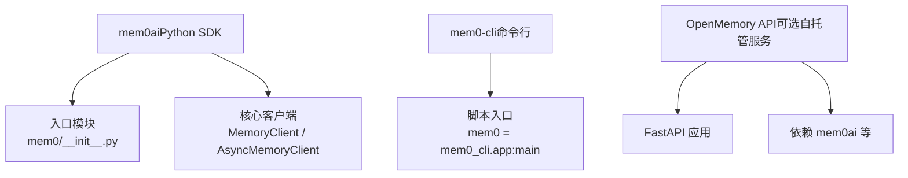
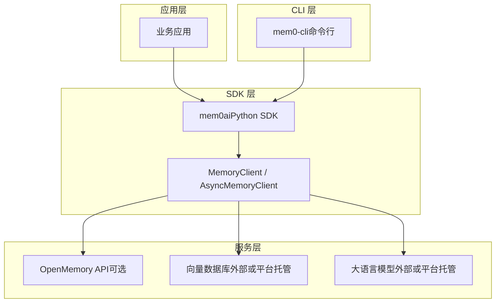
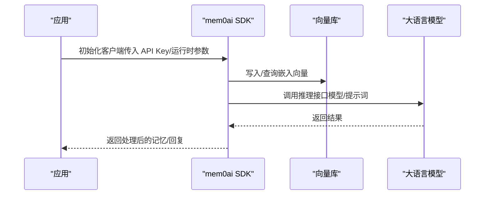
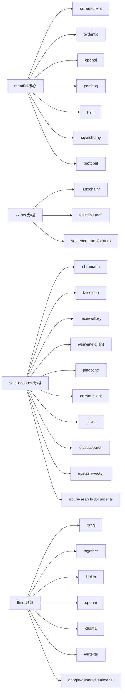

# 安装和配置

<cite>
**本文引用的文件**
- [mem0/__init__.py](file://mem0/__init__.py)
- [pyproject.toml（根项目）](file://pyproject.toml)
- [pyproject.toml（CLI 子项目）](file://cli/python/pyproject.toml)
- [README.md（项目总览）](file://README.md)
- [requirements.txt（OpenMemory API）](file://openmemory/api/requirements.txt)
</cite>

## 目录
1. [简介](#简介)
2. [项目结构](#项目结构)
3. [核心组件](#核心组件)
4. [架构总览](#架构总览)
5. [详细组件分析](#详细组件分析)
6. [依赖关系分析](#依赖关系分析)
7. [性能考虑](#性能考虑)
8. [故障排查指南](#故障排查指南)
9. [结论](#结论)
10. [附录](#附录)

## 简介
本章节面向首次接触 mem0 Python SDK 的用户，提供从安装到配置的完整指南。内容涵盖：
- 使用 pip 安装 mem0ai 及可选功能包
- 运行环境与依赖项要求
- API 密钥与认证配置
- 向量数据库与嵌入模型配置
- 大语言模型（LLM）配置
- 不同部署环境的配置示例：本地开发、Docker 环境、生产环境
- 配置文件结构、环境变量优先级与运行时配置方法
- 常见配置错误的排查与解决

## 项目结构
mem0 提供 Python SDK（mem0ai）与配套 CLI（mem0-cli）。SDK 通过入口模块导出核心客户端类，便于直接在应用中使用；CLI 则提供命令行工具以初始化、添加与检索记忆。

图表来源
- [mem0/__init__.py:1-7](file://mem0/__init__.py#L1-L7)
- [pyproject.toml（根项目）:5-24](file://pyproject.toml#L5-L24)
- [pyproject.toml（CLI 子项目）:41-42](file://cli/python/pyproject.toml#L41-L42)
- [requirements.txt（OpenMemory API）:1-20](file://openmemory/api/requirements.txt#L1-L20)

章节来源
- [mem0/__init__.py:1-7](file://mem0/__init__.py#L1-L7)
- [pyproject.toml（根项目）:1-160](file://pyproject.toml#L1-L160)
- [pyproject.toml（CLI 子项目）:1-78](file://cli/python/pyproject.toml#L1-L78)
- [README.md:119-137](file://README.md#L119-L137)
- [requirements.txt（OpenMemory API）:1-20](file://openmemory/api/requirements.txt#L1-L20)

## 核心组件
- SDK 入口与导出
  - SDK 在入口模块中导出核心客户端类，便于直接导入使用。
- CLI
  - 通过脚本入口注册命令行工具，支持初始化、添加与搜索等操作。
- 可选功能分组
  - 根项目提供可选依赖分组，如 nlp、vector-stores、llms、extras 等，按需安装。

章节来源
- [mem0/__init__.py:1-7](file://mem0/__init__.py#L1-L7)
- [pyproject.toml（根项目）:26-74](file://pyproject.toml#L26-L74)
- [pyproject.toml（CLI 子项目）:41-42](file://cli/python/pyproject.toml#L41-L42)

## 架构总览
下图展示 SDK、CLI 与可选自托管服务之间的关系及典型调用路径。

图表来源
- [mem0/__init__.py:1-7](file://mem0/__init__.py#L1-L7)
- [pyproject.toml（根项目）:16-24](file://pyproject.toml#L16-L24)
- [pyproject.toml（CLI 子项目）:27-31](file://cli/python/pyproject.toml#L27-L31)
- [requirements.txt（OpenMemory API）:10-11](file://openmemory/api/requirements.txt#L10-L11)

## 详细组件分析

### 安装与环境准备
- Python 版本要求
  - 根项目声明最低 Python 版本为 3.10，建议使用 3.10–3.12 以获得最佳兼容性。
- 基础安装
  - 使用 pip 安装 mem0ai 即可开始使用核心能力。
- 可选功能安装
  - NLP 支持：安装 nlp 分组，并下载对应的语言模型资源。
  - 向量数据库：安装 vector-stores 分组以启用更多向量库适配器。
  - LLM：安装 llms 分组以启用更多大模型提供商适配器。
  - extras：安装额外工具链（如 LangChain、Elasticsearch、Sentence Transformers 等）。
- CLI 安装
  - 可通过 pip 或 npm 安装 mem0-cli，并注册命令入口。

章节来源
- [pyproject.toml（根项目）:15-24](file://pyproject.toml#L15-L24)
- [pyproject.toml（根项目）:26-74](file://pyproject.toml#L26-L74)
- [README.md:119-137](file://README.md#L119-L137)
- [pyproject.toml（CLI 子项目）:11-26](file://cli/python/pyproject.toml#L11-L26)
- [pyproject.toml（CLI 子项目）:41-42](file://cli/python/pyproject.toml#L41-L42)

### 配置文件结构与环境变量优先级
- 配置文件结构
  - SDK 未内置专用配置文件格式；通常通过运行时参数或环境变量进行配置。
- 环境变量优先级
  - 在大多数实现中，SDK 会遵循“环境变量 > 默认值”的优先级策略。具体优先级取决于各组件（向量库、嵌入、LLM）的实现细节。
- 运行时配置方法
  - 通过构造函数传参或全局配置对象设置；部分组件支持从环境变量自动加载。

章节来源
- [README.md:138-150](file://README.md#L138-L150)

### API 密钥与认证配置
- 平台与自托管差异
  - 平台模式：通过平台提供的 API Key 访问服务端。
  - 自托管模式：可通过管理界面生成密钥，或在开发阶段禁用鉴权（不建议用于生产）。
- 常见配置要点
  - 设置 API Key 环境变量或在 SDK 初始化时显式传入。
  - 若使用 OpenMemory API，其 requirements 中包含 mem0ai 依赖，确保版本兼容。

章节来源
- [README.md:138-150](file://README.md#L138-L150)
- [requirements.txt（OpenMemory API）:10-11](file://openmemory/api/requirements.txt#L10-L11)

### 向量存储配置
- 可选向量库支持
  - 通过 vector-stores 分组安装多种向量数据库适配器，如 Chroma、Faiss、Redis、Weaviate、Pinecone、Qdrant、Milvus、Elasticsearch、Valkey、Azure AI Search 等。
- 选择与部署
  - 本地开发可选用轻量级向量库（如 Faiss、Chroma），生产环境建议使用云托管或企业级向量库。
- 连接参数
  - 通过运行时参数或环境变量配置连接地址、认证凭据与索引名称等。

章节来源
- [pyproject.toml（根项目）:30-54](file://pyproject.toml#L30-L54)
- [README.md:138-150](file://README.md#L138-L150)

### LLM 配置
- 可选 LLM 提供商支持
  - 通过 llms 分组安装多种大模型提供商适配器，如 OpenAI、Groq、Together AI、Ollama、Vertex AI、Google Generative AI、Anthropic、xAI、DeepSeek、MiniMax、Sarvam、LM Studio、LiteLLM 等。
- 默认与推荐
  - 文档指出默认 LLM 为 OpenAI 的 gpt-5-mini；嵌入模型默认为 OpenAI 的 text-embedding-3-small；混合检索建议使用至少 GTE-Qwen2-1.5B 等同等水平的嵌入模型。
- 运行时切换
  - 通过运行时参数或环境变量切换模型与供应商；注意不同提供商的认证方式与速率限制。

章节来源
- [pyproject.toml（根项目）:55-64](file://pyproject.toml#L55-L64)
- [README.md:194-199](file://README.md#L194-L199)

### 不同部署环境下的配置示例

#### 本地开发
- 安装
  - 安装基础 SDK 与可选 NLP 支持。
- 向量存储
  - 推荐使用本地 Faiss 或 Chroma，便于快速迭代。
- LLM
  - 可使用 LiteLLM 或 Ollama 在本地推理，减少网络依赖。
- 认证
  - 开发阶段可临时禁用鉴权或使用测试 API Key。

章节来源
- [README.md:119-137](file://README.md#L119-L137)
- [README.md:138-150](file://README.md#L138-L150)

#### Docker 环境
- 服务编排
  - 使用 docker compose 启动自托管栈，访问 Web 控制台完成初始化与密钥发放。
- SDK 集成
  - 在容器内安装 mem0ai，并通过环境变量注入 API Key 与向量库连接参数。
- 注意事项
  - 确保容器网络可达向量库与 LLM 服务端点。

章节来源
- [README.md:138-150](file://README.md#L138-L150)

#### 生产环境
- 服务端
  - 使用平台托管或自托管方案，开启鉴权与安全策略。
- SDK 部署
  - 将 API Key 与敏感配置放入受控的环境变量或密钥管理服务。
- 性能与扩展
  - 选择高可用向量库与具备弹性扩缩容能力的 LLM 服务端点。

章节来源
- [README.md:111-117](file://README.md#L111-L117)
- [README.md:138-150](file://README.md#L138-L150)

### 配置流程时序（概念示意）
以下序列图展示从应用到 SDK、再到向量库与 LLM 的典型调用链。

（该图为概念示意，不直接映射具体源码文件）

## 依赖关系分析
- 核心依赖
  - SDK 核心依赖包括 qdrant-client、pydantic、openai、posthog、pytz、sqlalchemy、protobuf 等。
- 可选依赖
  - vector-stores、llms、extras 等分组提供对多厂商与多组件的支持。
- CLI 依赖
  - CLI 依赖 typer、rich、httpx 等，提供命令行交互与网络请求能力。
- OpenMemory API 依赖
  - 包含 mem0ai、openai、mcp 等，作为可选自托管服务的后端。

图表来源
- [pyproject.toml（根项目）:16-74](file://pyproject.toml#L16-L74)

章节来源
- [pyproject.toml（根项目）:16-74](file://pyproject.toml#L16-L74)
- [pyproject.toml（CLI 子项目）:27-31](file://cli/python/pyproject.toml#L27-L31)
- [requirements.txt（OpenMemory API）:1-20](file://openmemory/api/requirements.txt#L1-L20)

## 性能考虑
- 混合检索优化
  - 结合语义、BM25 关键词与实体匹配可提升召回质量，但会增加计算开销；根据场景权衡精度与延迟。
- 向量库选择
  - 本地开发优先使用轻量级向量库；生产环境优先选择具备高可用与弹性扩缩容能力的托管服务。
- LLM 推理
  - 使用 LiteLLM 统一路由多家模型，结合缓存与批处理降低调用成本。
- 网络与并发
  - 合理设置超时与重试策略，避免阻塞主线程；在高并发场景下评估向量库与 LLM 的吞吐瓶颈。

（本节为通用指导，不直接分析具体源码文件）

## 故障排查指南
- Python 版本不兼容
  - 症状：安装失败或运行时报错。
  - 解决：确保 Python 版本满足 >=3.10 的要求。
- 缺少可选依赖导致功能不可用
  - 症状：无法使用特定向量库或 LLM 适配器。
  - 解决：按需安装对应分组（vector-stores、llms、extras）。
- 环境变量未生效
  - 症状：SDK 无法连接向量库或 LLM。
  - 解决：检查环境变量是否正确设置，确认优先级顺序符合预期。
- OpenMemory API 版本冲突
  - 症状：服务启动异常或功能缺失。
  - 解决：核对 requirements 中 mem0ai 版本与服务端兼容性。
- 认证问题
  - 症状：401/403 错误。
  - 解决：确认 API Key 是否正确配置，或在开发环境禁用鉴权仅用于本地调试。

章节来源
- [pyproject.toml（根项目）:15-24](file://pyproject.toml#L15-L24)
- [pyproject.toml（根项目）:30-74](file://pyproject.toml#L30-L74)
- [requirements.txt（OpenMemory API）:10-11](file://openmemory/api/requirements.txt#L10-L11)
- [README.md:138-150](file://README.md#L138-L150)

## 结论
通过本文档，您可以在本地、Docker 与生产环境中快速完成 mem0 Python SDK 的安装与配置。建议从基础安装起步，逐步引入 NLP、向量库与 LLM 的可选依赖，并结合实际场景选择合适的部署与认证策略。遇到问题时，优先检查 Python 版本、可选依赖完整性与环境变量配置。

## 附录
- 快速参考
  - 安装：pip install mem0ai
  - 可选安装：pip install mem0ai[nlp]、pip install mem0ai[vector-stores]、pip install mem0ai[llms]、pip install mem0ai[extras]
  - CLI：pip install mem0-cli，命令入口为 mem0
  - 自托管：cd server && make bootstrap 或 docker compose up -d
  - 平台：注册平台账号后获取 API Key 并在应用中配置

章节来源
- [README.md:119-137](file://README.md#L119-L137)
- [README.md:138-150](file://README.md#L138-L150)
- [pyproject.toml（CLI 子项目）:41-42](file://cli/python/pyproject.toml#L41-L42)