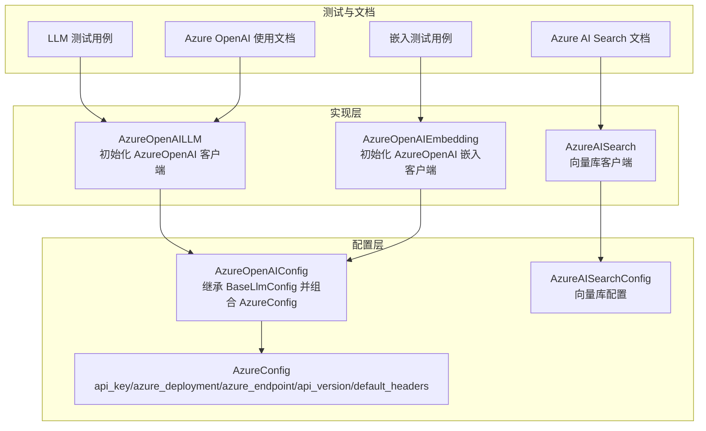
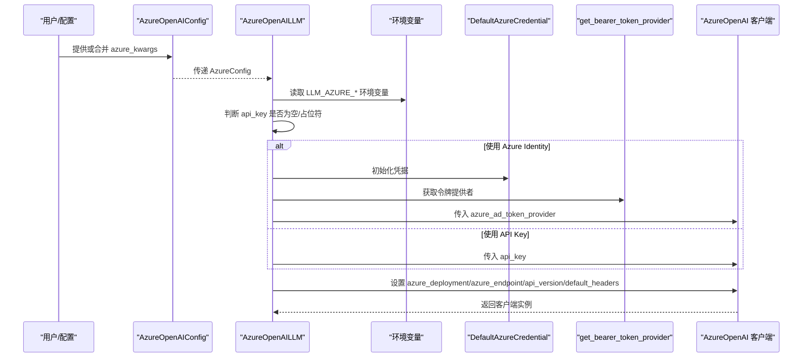
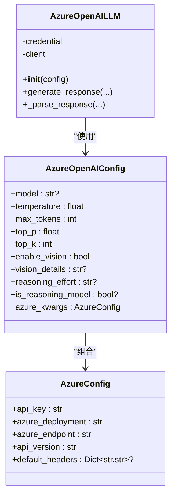
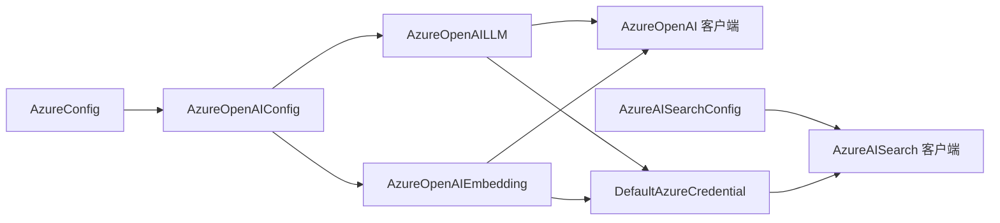

# Azure 配置

<cite>
**本文引用的文件**
- [mem0/configs/base.py](file://mem0/configs/base.py)
- [mem0/configs/llms/azure.py](file://mem0/configs/llms/azure.py)
- [mem0/llms/azure_openai.py](file://mem0/llms/azure_openai.py)
- [mem0/embeddings/azure_openai.py](file://mem0/embeddings/azure_openai.py)
- [tests/llms/test_azure_openai.py](file://tests/llms/test_azure_openai.py)
- [tests/embeddings/test_azure_openai_embeddings.py](file://tests/embeddings/test_azure_openai_embeddings.py)
- [docs/components/llms/models/azure_openai.mdx](file://docs/components/llms/models/azure_openai.mdx)
- [docs/components/vectordbs/dbs/azure.mdx](file://docs/components/vectordbs/dbs/azure.mdx)
- [mem0/configs/vector_stores/azure_ai_search.py](file://mem0/configs/vector_stores/azure_ai_search.py)
- [tests/test_memory_integration.py](file://tests/test_memory_integration.py)
</cite>

## 目录
1. [简介](#简介)
2. [项目结构](#项目结构)
3. [核心组件](#核心组件)
4. [架构总览](#架构总览)
5. [详细组件分析](#详细组件分析)
6. [依赖关系分析](#依赖关系分析)
7. [性能考虑](#性能考虑)
8. [故障排除指南](#故障排除指南)
9. [结论](#结论)
10. [附录](#附录)

## 简介
本文件系统性阐述 mem0 中的 Azure 配置体系，重点围绕 AzureConfig 基类及其在 LLM（Azure OpenAI）与嵌入模型（Azure OpenAI）中的应用，说明 API 密钥、部署名称、端点 URL、API 版本与默认请求头等关键参数的来源与优先级；同时给出 Azure 服务集成的最佳实践、安全配置建议以及常见问题排查方法。文档还覆盖与 Azure AI Search 向量数据库的配置要点，并提供面向不同 Azure 服务（OpenAI、Cognitive Services）的配置示例路径。

## 项目结构
与 Azure 配置相关的核心文件分布如下：
- 配置基类与通用模型：mem0/configs/base.py（定义 AzureConfig）
- LLM 配置：mem0/configs/llms/azure.py（AzureOpenAIConfig 继承自 BaseLlmConfig 并组合 AzureConfig）
- LLM 实现：mem0/llms/azure_openai.py（AzureOpenAI 模型客户端初始化与认证流程）
- 嵌入实现：mem0/embeddings/azure_openai.py（Azure OpenAI 嵌入客户端初始化与认证流程）
- 测试用例：tests/llms/test_azure_openai.py、tests/embeddings/test_azure_openai_embeddings.py（验证配置与环境变量优先级、Azure Identity 使用）
- 文档示例：docs/components/llms/models/azure_openai.mdx、docs/components/vectordbs/dbs/azure.mdx（官方使用说明与 Azure Identity 凭据链）
- 向量库配置：mem0/configs/vector_stores/azure_ai_search.py（Azure AI Search 配置模型）
- 集成示例：tests/test_memory_integration.py（整体内存系统中 Azure 配置的结构化示例）

**图表来源**
- [mem0/configs/base.py:60-82](file://mem0/configs/base.py#L60-L82)
- [mem0/configs/llms/azure.py:7-67](file://mem0/configs/llms/azure.py#L7-L67)
- [mem0/llms/azure_openai.py:16-70](file://mem0/llms/azure_openai.py#L16-L70)
- [mem0/embeddings/azure_openai.py:13-42](file://mem0/embeddings/azure_openai.py#L13-L42)
- [mem0/configs/vector_stores/azure_ai_search.py:6-58](file://mem0/configs/vector_stores/azure_ai_search.py#L6-L58)

**章节来源**
- [mem0/configs/base.py:60-82](file://mem0/configs/base.py#L60-L82)
- [mem0/configs/llms/azure.py:7-67](file://mem0/configs/llms/azure.py#L7-L67)
- [mem0/llms/azure_openai.py:16-70](file://mem0/llms/azure_openai.py#L16-L70)
- [mem0/embeddings/azure_openai.py:13-42](file://mem0/embeddings/azure_openai.py#L13-L42)
- [mem0/configs/vector_stores/azure_ai_search.py:6-58](file://mem0/configs/vector_stores/azure_ai_search.py#L6-L58)

## 核心组件
- AzureConfig（基类）
  - 字段：api_key、azure_deployment、azure_endpoint、api_version、default_headers
  - 用途：为 Azure 服务统一提供认证与连接参数
- AzureOpenAIConfig（LLM 配置）
  - 继承 BaseLlmConfig，新增 azure_kwargs（AzureConfig 实例）
  - 支持温度、最大令牌数、采样参数、视觉能力、推理努力级别等
- AzureOpenAILLM（LLM 实现）
  - 从 AzureConfig 与环境变量解析参数
  - 支持 API Key 与 Azure Identity（DefaultAzureCredential）两种认证方式
- AzureOpenAIEmbedding（嵌入实现）
  - 与 LLM 类似，支持 API Key 与 Azure Identity
- AzureAISearchConfig（向量库配置）
  - 服务名、集合名、API Key、嵌入维度、压缩类型、精度选择、混合检索等

**章节来源**
- [mem0/configs/base.py:60-82](file://mem0/configs/base.py#L60-L82)
- [mem0/configs/llms/azure.py:7-67](file://mem0/configs/llms/azure.py#L7-L67)
- [mem0/llms/azure_openai.py:16-70](file://mem0/llms/azure_openai.py#L16-L70)
- [mem0/embeddings/azure_openai.py:13-42](file://mem0/embeddings/azure_openai.py#L13-L42)
- [mem0/configs/vector_stores/azure_ai_search.py:6-58](file://mem0/configs/vector_stores/azure_ai_search.py#L6-L58)

## 架构总览
下图展示 Azure 配置在 LLM 与嵌入模块中的调用链路，以及认证方式的选择逻辑。

**图表来源**
- [mem0/llms/azure_openai.py:45-70](file://mem0/llms/azure_openai.py#L45-L70)
- [tests/llms/test_azure_openai.py:295-357](file://tests/llms/test_azure_openai.py#L295-L357)

**章节来源**
- [mem0/llms/azure_openai.py:45-70](file://mem0/llms/azure_openai.py#L45-L70)
- [tests/llms/test_azure_openai.py:295-357](file://tests/llms/test_azure_openai.py#L295-L357)

## 详细组件分析

### AzureConfig 结构与参数
- 参数说明
  - api_key：用于直接 API Key 认证
  - azure_deployment：Azure OpenAI 自定义部署名称
  - azure_endpoint：Azure OpenAI 服务端点 URL
  - api_version：Azure OpenAI API 版本
  - default_headers：随请求发送的默认头部
- 优先级与来源
  - 优先使用配置对象中的 azure_kwargs
  - 其次回退到对应环境变量（LLM 与嵌入分别有独立前缀）
  - 若未提供且为占位符字符串，则自动切换至 Azure Identity

**章节来源**
- [mem0/configs/base.py:60-82](file://mem0/configs/base.py#L60-L82)
- [mem0/llms/azure_openai.py:45-49](file://mem0/llms/azure_openai.py#L45-L49)
- [mem0/embeddings/azure_openai.py:17-21](file://mem0/embeddings/azure_openai.py#L17-L21)

### AzureOpenAIConfig 与 AzureOpenAILLM
- 继承关系
  - AzureOpenAIConfig 组合 AzureConfig，作为 LLM 的完整配置入口
- 认证策略
  - 当 api_key 为空或为占位符时，启用 DefaultAzureCredential 并通过令牌提供者注入
  - 否则直接使用 api_key
- 关键行为
  - 若未设置模型名，默认使用特定模型名
  - 支持工具调用、响应格式、推理模型参数等高级特性

**图表来源**
- [mem0/configs/base.py:60-82](file://mem0/configs/base.py#L60-L82)
- [mem0/configs/llms/azure.py:7-67](file://mem0/configs/llms/azure.py#L7-L67)
- [mem0/llms/azure_openai.py:16-146](file://mem0/llms/azure_openai.py#L16-L146)

**章节来源**
- [mem0/configs/llms/azure.py:7-67](file://mem0/configs/llms/azure.py#L7-L67)
- [mem0/llms/azure_openai.py:16-146](file://mem0/llms/azure_openai.py#L16-L146)

### AzureOpenAIEmbedding
- 功能与流程
  - 与 LLM 相同的认证与参数解析逻辑
  - 支持批量嵌入，按上限分批处理以满足服务限制
- 批处理策略
  - 默认批次大小为 100，按索引排序拼接结果

**章节来源**
- [mem0/embeddings/azure_openai.py:13-73](file://mem0/embeddings/azure_openai.py#L13-L73)

### Azure AI Search 向量库配置
- 关键参数
  - service_name：服务名
  - collection_name：集合名（默认值）
  - api_key：API Key（可选）
  - embedding_model_dims：嵌入维度
  - compression_type：向量压缩类型（scalar/binary 或 None）
  - use_float16：是否使用半精度存储
  - hybrid_search：是否启用混合检索
  - vector_filter_mode：过滤模式（preFilter/postFilter）
- 验证规则
  - 不再支持 use_compression，需改用 compression_type
  - 对 compression_type 进行枚举校验

**章节来源**
- [mem0/configs/vector_stores/azure_ai_search.py:6-58](file://mem0/configs/vector_stores/azure_ai_search.py#L6-L58)

### 配置示例与最佳实践

- Azure OpenAI（LLM）
  - 环境变量优先：LLM_AZURE_OPENAI_API_KEY、LLM_AZURE_DEPLOYMENT、LLM_AZURE_ENDPOINT、LLM_AZURE_API_VERSION
  - 可选：使用 Azure Identity 替代 API Key（开发可用 Azure CLI 登录，生产推荐托管身份）
  - 示例参考：[LLM 测试用例（API Key/环境变量/Azure Identity）:295-419](file://tests/llms/test_azure_openai.py#L295-L419)

- Azure OpenAI（Embeddings）
  - 环境变量优先：EMBEDDING_AZURE_OPENAI_API_KEY、EMBEDDING_AZURE_DEPLOYMENT、EMBEDDING_AZURE_ENDPOINT、EMBEDDING_AZURE_API_VERSION
  - 示例参考：[嵌入测试用例（API Key/环境变量/Azure Identity）:72-167](file://tests/embeddings/test_azure_openai_embeddings.py#L72-L167)

- Azure AI Search（向量库）
  - API Key 方式：提供 service_name、api_key、collection_name、embedding_model_dims
  - Azure Identity 方式：不提供 api_key，按凭据链自动认证
  - 示例参考：[Azure AI Search 文档（凭据链与参数）:74-154](file://docs/components/vectordbs/dbs/azure.mdx#L74-L154)

- 整体内存系统示例
  - 展示了 llm/vector_store/embedder 三者的 Azure 配置结构
  - 示例参考：[集成测试（Azure 配置结构）:83-121](file://tests/test_memory_integration.py#L83-L121)

**章节来源**
- [tests/llms/test_azure_openai.py:295-419](file://tests/llms/test_azure_openai.py#L295-L419)
- [tests/embeddings/test_azure_openai_embeddings.py:72-167](file://tests/embeddings/test_azure_openai_embeddings.py#L72-L167)
- [docs/components/vectordbs/dbs/azure.mdx:74-154](file://docs/components/vectordbs/dbs/azure.mdx#L74-L154)
- [tests/test_memory_integration.py:83-121](file://tests/test_memory_integration.py#L83-L121)

## 依赖关系分析
- 组件耦合
  - AzureOpenAIConfig 与 AzureConfig 强耦合（组合关系）
  - AzureOpenAILLM/AzureOpenAIEmbedding 依赖 AzureConfig 与环境变量
  - Azure AI Search 依赖 Azure Identity 或 API Key
- 外部依赖
  - Azure Identity（DefaultAzureCredential、令牌提供者）
  - AzureOpenAI 客户端（OpenAI SDK）
  - Azure AI Search 客户端（Azure SDK）

**图表来源**
- [mem0/configs/base.py:60-82](file://mem0/configs/base.py#L60-L82)
- [mem0/configs/llms/azure.py:7-67](file://mem0/configs/llms/azure.py#L7-L67)
- [mem0/llms/azure_openai.py:16-70](file://mem0/llms/azure_openai.py#L16-L70)
- [mem0/embeddings/azure_openai.py:13-42](file://mem0/embeddings/azure_openai.py#L13-L42)
- [mem0/configs/vector_stores/azure_ai_search.py:6-58](file://mem0/configs/vector_stores/azure_ai_search.py#L6-L58)

**章节来源**
- [mem0/llms/azure_openai.py:16-70](file://mem0/llms/azure_openai.py#L16-L70)
- [mem0/embeddings/azure_openai.py:13-42](file://mem0/embeddings/azure_openai.py#L13-L42)

## 性能考虑
- 批量嵌入
  - AzureOpenAIEmbedding 默认按 100 条分批，减少请求次数并避免超限
- 推理模型参数
  - 对于推理模型，合理设置推理努力级别，避免不必要的采样参数
- 网络代理
  - 通过 http_client_proxies 与 default_headers 控制网络路径与请求头

**章节来源**
- [mem0/embeddings/azure_openai.py:57-73](file://mem0/embeddings/azure_openai.py#L57-L73)
- [mem0/llms/azure_openai.py:102-146](file://mem0/llms/azure_openai.py#L102-L146)

## 故障排除指南
- 认证失败
  - 若设置了 API Key，确认其有效性与版本匹配
  - 若使用 Azure Identity，确保凭据链正确（开发可用 Azure CLI 登录，生产使用托管身份）
  - 参考：[Azure Identity 文档与环境变量配置:137-151](file://docs/components/vectordbs/dbs/azure.mdx#L137-L151)
- 端点或部署错误
  - 检查 azure_endpoint 与 azure_deployment 是否与 Azure 控制台一致
  - 参考：[LLM 测试用例（端点/部署/版本）:330-357](file://tests/llms/test_azure_openai.py#L330-L357)
- 占位符 API Key
  - 将 api_key 设为占位符会触发 Azure Identity，请勿同时设置 API Key
  - 参考：[LLM 测试用例（占位符）:391-419](file://tests/llms/test_azure_openai.py#L391-L419)
- 向量库初始化异常
  - 确认服务名与集合名存在或具备创建权限
  - 参考：[Azure AI Search 文档（初始化与 RBAC）:99-154](file://docs/components/vectordbs/dbs/azure.mdx#L99-L154)

**章节来源**
- [docs/components/vectordbs/dbs/azure.mdx:137-154](file://docs/components/vectordbs/dbs/azure.mdx#L137-L154)
- [tests/llms/test_azure_openai.py:330-419](file://tests/llms/test_azure_openai.py#L330-L419)

## 结论
- AzureConfig 为 Azure 服务提供了统一的参数抽象，结合环境变量与 Azure Identity，既满足开发便捷性也兼顾生产安全性
- AzureOpenAIConfig 将 Azure 参数与 LLM 能力整合，支持工具调用、响应格式与推理模型等特性
- Azure AI Search 配置强调凭据选择与参数校验，建议在生产中优先采用托管身份与最小权限原则
- 建议在 CI/CD 中使用密钥管理服务，避免硬编码 API Key；在开发阶段使用 Azure CLI 登录，便于快速迭代

## 附录

### 环境变量与参数映射表
- LLM（Azure OpenAI）
  - LLM_AZURE_OPENAI_API_KEY → api_key
  - LLM_AZURE_DEPLOYMENT → azure_deployment
  - LLM_AZURE_ENDPOINT → azure_endpoint
  - LLM_AZURE_API_VERSION → api_version
- 嵌入（Azure OpenAI）
  - EMBEDDING_AZURE_OPENAI_API_KEY → api_key
  - EMBEDDING_AZURE_DEPLOYMENT → azure_deployment
  - EMBEDDING_AZURE_ENDPOINT → azure_endpoint
  - EMBEDDING_AZURE_API_VERSION → api_version
- 向量库（Azure AI Search）
  - 服务名与集合名：service_name、collection_name
  - API Key：api_key
  - 嵌入维度：embedding_model_dims
  - 压缩与精度：compression_type、use_float16
  - 混合检索：hybrid_search、vector_filter_mode

**章节来源**
- [mem0/llms/azure_openai.py:45-49](file://mem0/llms/azure_openai.py#L45-L49)
- [mem0/embeddings/azure_openai.py:17-21](file://mem0/embeddings/azure_openai.py#L17-L21)
- [mem0/configs/vector_stores/azure_ai_search.py:6-58](file://mem0/configs/vector_stores/azure_ai_search.py#L6-L58)