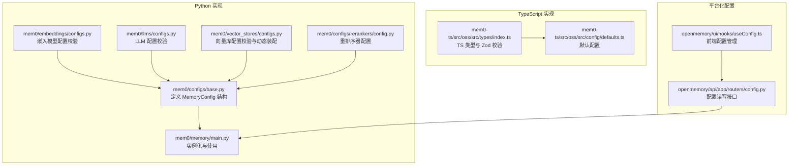
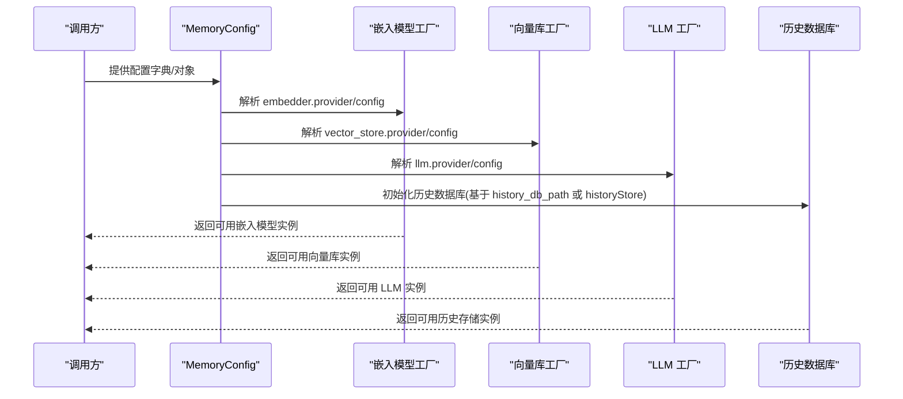
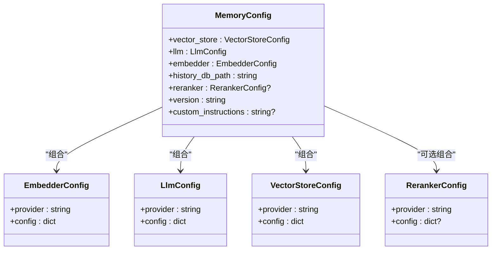

# 内存配置

<cite>
**本文引用的文件**
- [mem0/configs/base.py](file://mem0/configs/base.py)
- [mem0/embeddings/configs.py](file://mem0/embeddings/configs.py)
- [mem0/llms/configs.py](file://mem0/llms/configs.py)
- [mem0/vector_stores/configs.py](file://mem0/vector_stores/configs.py)
- [mem0/configs/rerankers/config.py](file://mem0/configs/rerankers/config.py)
- [mem0-ts/src/oss/src/types/index.ts](file://mem0-ts/src/oss/src/types/index.ts)
- [mem0-ts/src/oss/src/config/defaults.ts](file://mem0-ts/src/oss/src/config/defaults.ts)
- [mem0/memory/main.py](file://mem0/memory/main.py)
- [LLM.md](file://LLM.md)
- [openmemory/api/app/routers/config.py](file://openmemory/api/app/routers/config.py)
- [openmemory/ui/hooks/useConfig.ts](file://openmemory/ui/hooks/useConfig.ts)
</cite>

## 目录
1. [简介](#简介)
2. [项目结构](#项目结构)
3. [核心组件](#核心组件)
4. [架构总览](#架构总览)
5. [详细组件分析](#详细组件分析)
6. [依赖关系分析](#依赖关系分析)
7. [性能考量](#性能考量)
8. [故障排查指南](#故障排查指南)
9. [结论](#结论)
10. [附录](#附录)

## 简介
本文件系统性阐述 MemoryConfig 的结构与参数选项，覆盖向量存储配置、嵌入模型配置、LLM 配置、历史数据库路径与重排序器配置，并给出本地开发、生产环境与自托管部署的配置模板、配置验证规则以及常见问题的解决方案。目标是帮助用户在不同场景下正确、安全地配置内存子系统。

## 项目结构
围绕 MemoryConfig 的相关实现分布在 Python（mem0）与 TypeScript（mem0-ts）两套类型定义中，同时提供默认配置与运行时校验逻辑；部分平台化组件还支持通过 API 动态更新配置。

图表来源
- [mem0/configs/base.py:29-58](file://mem0/configs/base.py#L29-L58)
- [mem0/embeddings/configs.py:6-31](file://mem0/embeddings/configs.py#L6-L31)
- [mem0/llms/configs.py:6-35](file://mem0/llms/configs.py#L6-L35)
- [mem0/vector_stores/configs.py:6-67](file://mem0/vector_stores/configs.py#L6-L67)
- [mem0/configs/rerankers/config.py:6-12](file://mem0/configs/rerankers/config.py#L6-L12)
- [mem0-ts/src/oss/src/types/index.ts:57-75](file://mem0-ts/src/oss/src/types/index.ts#L57-L75)
- [mem0-ts/src/oss/src/config/defaults.ts:3-35](file://mem0-ts/src/oss/src/config/defaults.ts#L3-L35)
- [openmemory/api/app/routers/config.py:228-250](file://openmemory/api/app/routers/config.py#L228-L250)
- [openmemory/ui/hooks/useConfig.ts:29-68](file://openmemory/ui/hooks/useConfig.ts#L29-L68)

章节来源
- [mem0/configs/base.py:29-58](file://mem0/configs/base.py#L29-L58)
- [mem0-ts/src/oss/src/types/index.ts:57-75](file://mem0-ts/src/oss/src/types/index.ts#L57-L75)

## 核心组件
- 向量存储配置：用于选择与初始化向量数据库，支持多种提供商与特定配置项。
- 嵌入模型配置：用于选择嵌入模型提供商与模型参数。
- LLM 配置：用于选择语言模型提供商与推理参数。
- 历史数据库路径：用于持久化历史记录的数据库路径或连接方式。
- 重排序器配置：用于二次打分以提升检索质量，可选启用。

章节来源
- [mem0/configs/base.py:29-58](file://mem0/configs/base.py#L29-L58)
- [mem0-ts/src/oss/src/types/index.ts:57-75](file://mem0-ts/src/oss/src/types/index.ts#L57-L75)

## 架构总览
下图展示了 MemoryConfig 在运行时如何被解析、校验并驱动底层组件：

图表来源
- [mem0/memory/main.py:1985-2002](file://mem0/memory/main.py#L1985-L2002)
- [mem0/configs/base.py:29-58](file://mem0/configs/base.py#L29-L58)

## 详细组件分析

### MemoryConfig 字段详解
- vector_store: 指定向量存储提供商与配置。默认提供者与默认配置见下方“默认值”小节。
- llm: 指定语言模型提供商与推理参数。默认提供者与默认配置见下方“默认值”小节。
- embedder: 指定嵌入模型提供商与模型参数。默认提供者与默认配置见下方“默认值”小节。
- history_db_path: 历史数据库路径，默认位于用户主目录下的 .mem0/history.db。
- reranker: 可选的重排序器配置，支持多种提供商与特定参数。
- version: API 版本号，默认为 v1.1。
- custom_instructions: 可选的自定义指令，用于事实抽取等流程。

章节来源
- [mem0/configs/base.py:29-58](file://mem0/configs/base.py#L29-L58)
- [mem0-ts/src/oss/src/types/index.ts:57-75](file://mem0-ts/src/oss/src/types/index.ts#L57-L75)

### 嵌入模型配置（EmbedderConfig）
- provider: 支持的提供商列表包括 openai、ollama、huggingface、azure_openai、gemini、vertexai、together、lmstudio、langchain、aws_bedrock、fastembed 等。
- config: 提供商特定的配置字典，如模型名、API 密钥、基础 URL 等。

章节来源
- [mem0/embeddings/configs.py:6-31](file://mem0/embeddings/configs.py#L6-L31)

### LLM 配置（LlmConfig）
- provider: 支持的提供商列表包括 openai、ollama、anthropic、groq、together、aws_bedrock、litellm、azure_openai、openai_structured、azure_openai_structured、gemini、deepseek、minimax、xai、sarvam、lmstudio、vllm、langchain 等。
- config: 提供商特定的配置字典，如模型名、API 密钥、基础 URL、超时、温度、最大令牌数等。

章节来源
- [mem0/llms/configs.py:6-35](file://mem0/llms/configs.py#L6-L35)

### 向量存储配置（VectorStoreConfig）
- provider: 支持的提供商列表广泛，包括 qdrant、chroma、pgvector、pinecone、mongodb、milvus、baidu、cassandra、neptune、upstash_vector、azure_ai_search、azure_mysql、redis、valkey、databricks、elasticsearch、vertex_ai_vector_search、opensearch、supabase、weaviate、faiss、langchain、s3_vectors、turbopuffer 等。
- config: 提供商特定的配置对象或字典，若缺少必要字段会按默认策略补全（例如某些提供商需要 path 字段）。

章节来源
- [mem0/vector_stores/configs.py:6-67](file://mem0/vector_stores/configs.py#L6-L67)

### 重排序器配置（RerankerConfig）
- provider: 如 cohere、sentence_transformer、llm_reranker 等。
- config: 提供商特定的配置字典，如模型名、设备、批次大小、评分提示等。

章节来源
- [mem0/configs/rerankers/config.py:6-12](file://mem0/configs/rerankers/config.py#L6-L12)

### 历史数据库路径与历史存储
- history_db_path: 默认位于用户主目录下的 .mem0/history.db。
- historyStore: TS 定义中提供更丰富的历史存储配置（如 sqlite 的 historyDbPath、supabase 的 url/key、表名等），Python 中通过 history_db_path 进行初始化。

章节来源
- [mem0/configs/base.py:42-49](file://mem0/configs/base.py#L42-L49)
- [mem0-ts/src/oss/src/types/index.ts:33-41](file://mem0-ts/src/oss/src/types/index.ts#L33-L41)

### 默认值与默认配置
- Python 默认配置（默认提供商与关键参数）：
  - 嵌入模型：provider=openai，model=text-embedding-3-small
  - 向量存储：provider=memory，collectionName=memories，dimension=1536
  - LLM：provider=openai，model=gpt-5-mini，baseURL=https://api.openai.com/v1
  - 历史存储：provider=sqlite，historyDbPath=memory.db
  - 版本：v1.1
- TypeScript 默认配置：
  - disableHistory=false，version=v1.1
  - 其余字段与 Python 对应，但 TS 使用不同的默认值（例如 LLM 的 model 与 baseURL）

章节来源
- [mem0-ts/src/oss/src/config/defaults.ts:3-35](file://mem0-ts/src/oss/src/config/defaults.ts#L3-L35)
- [mem0/configs/base.py:42-49](file://mem0/configs/base.py#L42-L49)

### 使用场景与配置模板

- 本地开发（Ollama + Chroma）
  - LLM 与嵌入均使用本地 Ollama，向量库使用 Chroma 本地目录。
  - 参考路径：[LLM.md:357-381](file://LLM.md#L357-L381)

- 企业级（Azure OpenAI + Pinecone）
  - LLM 使用 Azure OpenAI，向量库使用 Pinecone。
  - 参考路径：[LLM.md:398-419](file://LLM.md#L398-L419)

- 图数据库（Neo4j）
  - 使用图存储（graph_store）而非向量存储，适用于关系记忆。
  - 参考路径：[LLM.md:383-396](file://LLM.md#L383-L396)

- 平台化配置（通过 API 更新）
  - 可通过平台路由更新嵌入器或获取向量库配置。
  - 参考路径：[openmemory/api/app/routers/config.py:228-250](file://openmemory/api/app/routers/config.py#L228-L250)

- 前端配置管理（Next.js）
  - 通过 useConfig 钩子拉取与保存配置。
  - 参考路径：[openmemory/ui/hooks/useConfig.ts:29-68](file://openmemory/ui/hooks/useConfig.ts#L29-L68)

章节来源
- [LLM.md:357-419](file://LLM.md#L357-L419)
- [openmemory/api/app/routers/config.py:228-250](file://openmemory/api/app/routers/config.py#L228-L250)
- [openmemory/ui/hooks/useConfig.ts:29-68](file://openmemory/ui/hooks/useConfig.ts#L29-L68)

## 依赖关系分析
- MemoryConfig 作为聚合根，依赖嵌入、向量库、LLM 与重排序器的配置类。
- 向量存储配置在运行时根据 provider 动态装配具体配置类，并进行额外字段补齐。
- TS 类型定义与 Zod 校验提供了更强的静态约束与运行时校验。

图表来源
- [mem0/configs/base.py:29-58](file://mem0/configs/base.py#L29-L58)
- [mem0/embeddings/configs.py:6-31](file://mem0/embeddings/configs.py#L6-L31)
- [mem0/llms/configs.py:6-35](file://mem0/llms/configs.py#L6-L35)
- [mem0/vector_stores/configs.py:6-67](file://mem0/vector_stores/configs.py#L6-L67)
- [mem0/configs/rerankers/config.py:6-12](file://mem0/configs/rerankers/config.py#L6-L12)

## 性能考量
- 向量维度与索引：向量维度越高，内存占用越大；合理设置 dimension 与索引参数可显著影响查询性能。
- 批处理与并发：嵌入与检索建议批量处理，减少网络往返与上下文切换。
- 设备与加速：重排序器（如 GPU/CPU）与 LLM 推理设备的选择对延迟与吞吐有直接影响。
- 缓存与预热：向量库与嵌入模型的连接池与模型加载策略需结合业务峰值进行优化。
- 历史存储：SQLite 适合轻量场景；高并发生产建议使用专用数据库或云原生方案。

## 故障排查指南
- 不支持的提供商
  - 现象：启动时报错，提示提供商不受支持。
  - 处理：检查 provider 是否在允许列表内，参考对应配置类的校验逻辑。
  - 参考路径：
    - [mem0/embeddings/configs.py:13-31](file://mem0/embeddings/configs.py#L13-L31)
    - [mem0/llms/configs.py:10-35](file://mem0/llms/configs.py#L10-L35)
    - [mem0/vector_stores/configs.py:40-46](file://mem0/vector_stores/configs.py#L40-L46)

- 向量库配置缺失关键字段
  - 现象：初始化失败或行为异常。
  - 处理：确保 provider 对应的配置类具备必需字段（如某些提供商需要 path），运行时会尝试补齐默认值。
  - 参考路径：[mem0/vector_stores/configs.py:62-67](file://mem0/vector_stores/configs.py#L62-L67)

- 历史数据库路径不可写或权限不足
  - 现象：无法创建或写入历史数据库。
  - 处理：确认 history_db_path 指向的目录存在且具备写权限；或改用 historyStore 指定外部存储。
  - 参考路径：[mem0/configs/base.py:42-49](file://mem0/configs/base.py#L42-L49)

- 重排序器参数不合法
  - 现象：重排序阶段报错或结果异常。
  - 处理：核对 reranker.provider 与 config 参数，确保与所选提供商兼容。
  - 参考路径：[mem0/configs/rerankers/config.py:6-12](file://mem0/configs/rerankers/config.py#L6-L12)

- 平台化配置更新失败
  - 现象：通过 API 更新配置后未生效。
  - 处理：确认请求体结构正确、服务端已保存并触发客户端重置；检查返回状态与错误信息。
  - 参考路径：
    - [openmemory/api/app/routers/config.py:228-250](file://openmemory/api/app/routers/config.py#L228-L250)
    - [openmemory/ui/hooks/useConfig.ts:52-68](file://openmemory/ui/hooks/useConfig.ts#L52-L68)

## 结论
MemoryConfig 将嵌入、向量存储、LLM、历史存储与重排序器整合为统一的配置入口。通过严格的校验与默认值设计，可在本地开发、企业级部署与自托管环境中快速落地。建议在生产中结合实际硬件与数据规模，对维度、索引、设备与缓存策略进行针对性优化，并建立完善的配置变更与回滚机制。

## 附录

### 配置验证规则摘要
- 嵌入模型提供商必须在允许列表内。
- LLM 提供商必须在允许列表内。
- 向量库提供商必须在允许列表内，且其配置类需满足必需字段要求。
- 重排序器配置遵循“禁止额外字段”的策略，避免误传未知参数。
- TS 类型定义与 Zod 校验对关键字段进行强约束，建议在构建阶段即发现配置错误。

章节来源
- [mem0/embeddings/configs.py:13-31](file://mem0/embeddings/configs.py#L13-L31)
- [mem0/llms/configs.py:10-35](file://mem0/llms/configs.py#L10-L35)
- [mem0/vector_stores/configs.py:40-67](file://mem0/vector_stores/configs.py#L40-L67)
- [mem0/configs/rerankers/config.py:12](file://mem0/configs/rerankers/config.py#L12)
- [mem0-ts/src/oss/src/types/index.ts:104-151](file://mem0-ts/src/oss/src/types/index.ts#L104-L151)