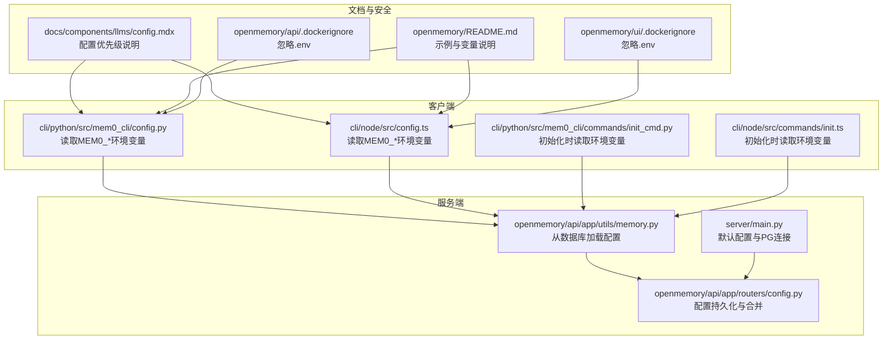
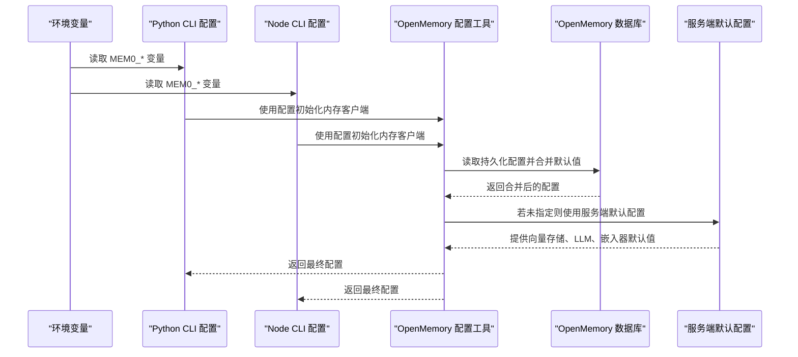
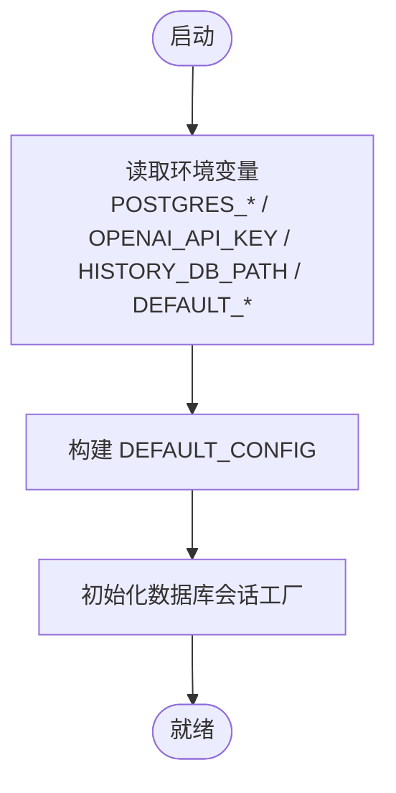
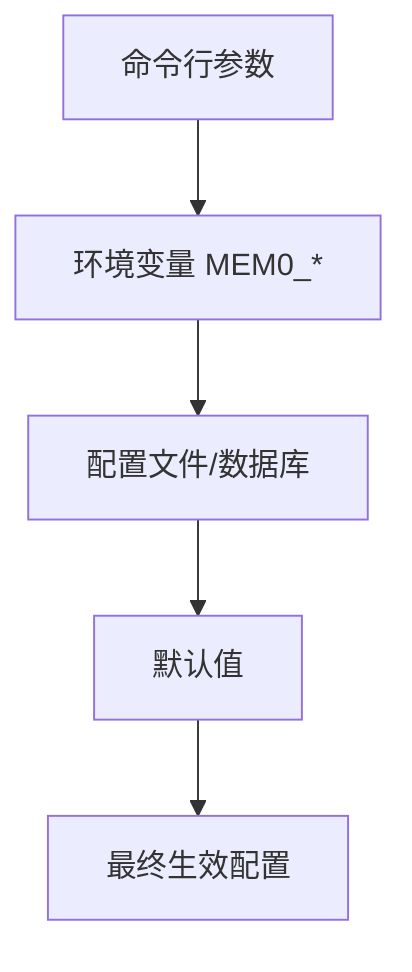
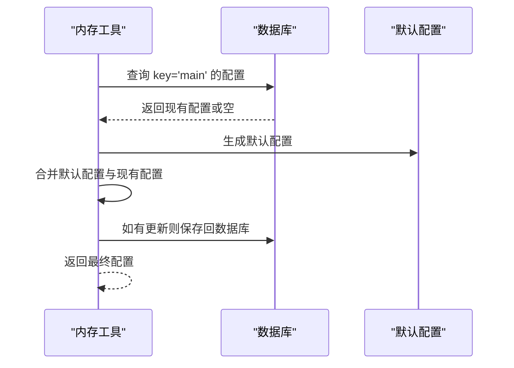
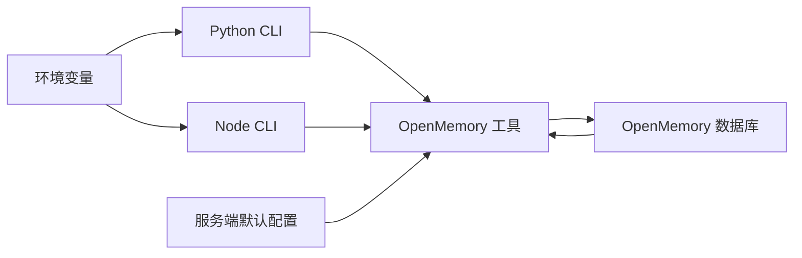

# 环境变量配置

<cite>
**本文档引用的文件**
- [server/main.py](file://server/main.py)
- [cli/python/src/mem0_cli/config.py](file://cli/python/src/mem0_cli/config.py)
- [cli/node/src/config.ts](file://cli/node/src/config.ts)
- [cli/python/src/mem0_cli/commands/init_cmd.py](file://cli/python/src/mem0_cli/commands/init_cmd.py)
- [cli/node/src/commands/init.ts](file://cli/node/src/commands/init.ts)
- [openmemory/api/app/utils/memory.py](file://openmemory/api/app/utils/memory.py)
- [openmemory/api/app/routers/config.py](file://openmemory/api/app/routers/config.py)
- [docs/components/llms/config.mdx](file://docs/components/llms/config.mdx)
- [openmemory/README.md](file://openmemory/README.md)
- [openmemory/api/.dockerignore](file://openmemory/api/.dockerignore)
- [openmemory/ui/.dockerignore](file://openmemory/ui/.dockerignore)
</cite>

## 目录
1. [简介](#简介)
2. [项目结构](#项目结构)
3. [核心组件](#核心组件)
4. [架构总览](#架构总览)
5. [详细组件分析](#详细组件分析)
6. [依赖关系分析](#依赖关系分析)
7. [性能考虑](#性能考虑)
8. [故障排查指南](#故障排查指南)
9. [结论](#结论)
10. [附录](#附录)

## 简介
本文件系统性梳理 mem0 在不同运行环境中的环境变量配置，涵盖 API 密钥、服务端点、数据库连接、向量存储、模型选择、历史数据库路径、遥测开关以及日志级别等关键配置项。同时阐明配置优先级与覆盖机制，并提供开发、测试、生产三类部署环境的配置模板与安全最佳实践。

## 项目结构
围绕环境变量配置的关键位置如下：
- 服务端默认配置与数据库连接：server/main.py
- 客户端（Python/Node）配置加载与覆盖：cli/python/src/mem0_cli/config.py、cli/node/src/config.ts
- 初始化流程中对环境变量的读取与回退：cli/python/src/mem0_cli/commands/init_cmd.py、cli/node/src/commands/init.ts
- OpenMemory 配置持久化与合并：openmemory/api/app/utils/memory.py、openmemory/api/app/routers/config.py
- 文档中关于配置优先级的说明：docs/components/llms/config.mdx
- OpenMemory 的示例与环境变量说明：openmemory/README.md
- Docker 忽略 .env 文件的安全策略：openmemory/api/.dockerignore、openmemory/ui/.dockerignore

**图表来源**
- [server/main.py:104-141](file://server/main.py#L104-L141)
- [openmemory/api/app/utils/memory.py:404-444](file://openmemory/api/app/utils/memory.py#L404-L444)
- [openmemory/api/app/routers/config.py:76-139](file://openmemory/api/app/routers/config.py#L76-L139)
- [cli/python/src/mem0_cli/config.py:119-139](file://cli/python/src/mem0_cli/config.py#L119-L139)
- [cli/node/src/config.ts:120-129](file://cli/node/src/config.ts#L120-L129)
- [docs/components/llms/config.mdx:34-89](file://docs/components/llms/config.mdx#L34-L89)
- [openmemory/README.md:46-88](file://openmemory/README.md#L46-L88)
- [openmemory/api/.dockerignore:1-23](file://openmemory/api/.dockerignore#L1-L23)
- [openmemory/ui/.dockerignore:1-23](file://openmemory/ui/.dockerignore#L1-L23)

**章节来源**
- [server/main.py:104-141](file://server/main.py#L104-L141)
- [openmemory/api/app/utils/memory.py:404-444](file://openmemory/api/app/utils/memory.py#L404-L444)
- [openmemory/api/app/routers/config.py:76-139](file://openmemory/api/app/routers/config.py#L76-L139)
- [cli/python/src/mem0_cli/config.py:119-139](file://cli/python/src/mem0_cli/config.py#L119-L139)
- [cli/node/src/config.ts:120-129](file://cli/node/src/config.ts#L120-L129)
- [docs/components/llms/config.mdx:34-89](file://docs/components/llms/config.mdx#L34-L89)
- [openmemory/README.md:46-88](file://openmemory/README.md#L46-L88)
- [openmemory/api/.dockerignore:1-23](file://openmemory/api/.dockerignore#L1-L23)
- [openmemory/ui/.dockerignore:1-23](file://openmemory/ui/.dockerignore#L1-L23)

## 核心组件
- 服务端默认配置与数据库连接
  - PostgreSQL 连接参数：主机、端口、数据库名、用户、密码、集合名
  - 默认 LLM 与嵌入模型名称
  - 历史数据库路径
  - 默认配置字典用于初始化与回退
- 客户端配置加载
  - MEM0_API_KEY、MEM0_BASE_URL、MEM0_USER_ID、MEM0_AGENT_ID、MEM0_APP_ID、MEM0_RUN_ID
  - TELEMETRY 开关 MEM0_TELEMETRY
- OpenMemory 配置持久化与合并
  - 从数据库读取并合并默认配置
  - 支持 openmemory 与 mem0 两套配置键空间
- 文档与示例
  - 配置优先级：config > 环境变量 > 默认值
  - OpenMemory 示例变量：LLM_PROVIDER、LLM_MODEL、LLM_API_KEY、LLM_BASE_URL、OLLAMA_BASE_URL、EMBEDDER_PROVIDER、EMBEDDER_MODEL、EMBEDDER_API_KEY、EMBEDDER_BASE_URL

**章节来源**
- [server/main.py:104-141](file://server/main.py#L104-L141)
- [cli/python/src/mem0_cli/config.py:119-139](file://cli/python/src/mem0_cli/config.py#L119-L139)
- [cli/node/src/config.ts:120-129](file://cli/node/src/config.ts#L120-L129)
- [openmemory/api/app/utils/memory.py:404-444](file://openmemory/api/app/utils/memory.py#L404-L444)
- [openmemory/api/app/routers/config.py:76-139](file://openmemory/api/app/routers/config.py#L76-L139)
- [docs/components/llms/config.mdx:34-89](file://docs/components/llms/config.mdx#L34-L89)
- [openmemory/README.md:46-88](file://openmemory/README.md#L46-L88)

## 架构总览
下图展示环境变量在不同组件中的读取与覆盖关系，以及与默认配置和数据库配置的交互。

**图表来源**
- [cli/python/src/mem0_cli/config.py:119-139](file://cli/python/src/mem0_cli/config.py#L119-L139)
- [cli/node/src/config.ts:120-129](file://cli/node/src/config.ts#L120-L129)
- [openmemory/api/app/utils/memory.py:404-444](file://openmemory/api/app/utils/memory.py#L404-L444)
- [openmemory/api/app/routers/config.py:76-139](file://openmemory/api/app/routers/config.py#L76-L139)
- [server/main.py:104-141](file://server/main.py#L104-L141)

## 详细组件分析

### 服务端默认配置与数据库连接
- 关键变量
  - POSTGRES_HOST、POSTGRES_PORT、POSTGRES_DB、POSTGRES_USER、POSTGRES_PASSWORD、POSTGRES_COLLECTION_NAME
  - OPENAI_API_KEY（用于 LLM 与嵌入器）
  - HISTORY_DB_PATH（历史数据库路径）
  - DEFAULT_LLM_MODEL、DEFAULT_EMBEDDER_MODEL（默认模型名）
- 行为
  - 以环境变量为源，构造 DEFAULT_CONFIG 字典
  - 向量存储使用 pgvector，数据库凭据来自环境变量
  - 若未设置 OPENAI_API_KEY，则 LLM 与嵌入器配置中 api_key 将为空，需通过上层配置补全

**图表来源**
- [server/main.py:104-141](file://server/main.py#L104-L141)

**章节来源**
- [server/main.py:104-141](file://server/main.py#L104-L141)

### 客户端配置加载（Python 与 Node）
- Python CLI
  - 读取 MEM0_API_KEY、MEM0_BASE_URL、MEM0_USER_ID、MEM0_AGENT_ID、MEM0_APP_ID、MEM0_RUN_ID
  - 读取 MEM0_TELEMETRY 控制遥测开关
- Node CLI
  - 同样读取 MEM0_* 变量并写入配置对象
- 覆盖顺序
  - 命令行参数 > 环境变量 > 配置文件/数据库 > 默认值

**图表来源**
- [cli/python/src/mem0_cli/config.py:119-139](file://cli/python/src/mem0_cli/config.py#L119-L139)
- [cli/node/src/config.ts:120-129](file://cli/node/src/config.ts#L120-L129)
- [docs/components/llms/config.mdx:34-89](file://docs/components/llms/config.mdx#L34-L89)

**章节来源**
- [cli/python/src/mem0_cli/config.py:119-139](file://cli/python/src/mem0_cli/config.py#L119-L139)
- [cli/node/src/config.ts:120-129](file://cli/node/src/config.ts#L120-L129)
- [docs/components/llms/config.mdx:34-89](file://docs/components/llms/config.mdx#L34-L89)

### OpenMemory 配置持久化与合并
- 从数据库读取配置，若缺失则生成默认配置并保存
- 合并逻辑确保 mem0 与 openmemory 键空间存在必要子配置
- 内存客户端初始化时优先采用数据库配置，再回退到默认配置

**图表来源**
- [openmemory/api/app/routers/config.py:76-139](file://openmemory/api/app/routers/config.py#L76-L139)
- [openmemory/api/app/utils/memory.py:404-444](file://openmemory/api/app/utils/memory.py#L404-L444)

**章节来源**
- [openmemory/api/app/routers/config.py:76-139](file://openmemory/api/app/routers/config.py#L76-L139)
- [openmemory/api/app/utils/memory.py:404-444](file://openmemory/api/app/utils/memory.py#L404-L444)

### OpenMemory 示例与变量说明
- 示例变量清单（摘自文档）
  - LLM_PROVIDER、LLM_MODEL、LLM_API_KEY、LLM_BASE_URL、OLLAMA_BASE_URL
  - EMBEDDER_PROVIDER、EMBEDDER_MODEL、EMBEDDER_API_KEY、EMBEDDER_BASE_URL
- 用法建议
  - 通过 .env 文件或容器环境注入
  - 与服务端默认配置协同工作

**章节来源**
- [openmemory/README.md:46-88](file://openmemory/README.md#L46-L88)

## 依赖关系分析
- 组件耦合
  - 客户端配置模块依赖环境变量；当未提供时，回退至默认值或数据库配置
  - 服务端默认配置为客户端与 OpenMemory 提供统一的回退基线
  - OpenMemory 的配置持久化模块负责跨进程/容器的一致性
- 外部依赖
  - PostgreSQL 凭据与集合名由环境变量驱动
  - LLM/嵌入器提供商与模型由环境变量或显式配置决定

**图表来源**
- [server/main.py:104-141](file://server/main.py#L104-L141)
- [cli/python/src/mem0_cli/config.py:119-139](file://cli/python/src/mem0_cli/config.py#L119-L139)
- [cli/node/src/config.ts:120-129](file://cli/node/src/config.ts#L120-L129)
- [openmemory/api/app/utils/memory.py:404-444](file://openmemory/api/app/utils/memory.py#L404-L444)
- [openmemory/api/app/routers/config.py:76-139](file://openmemory/api/app/routers/config.py#L76-L139)

**章节来源**
- [server/main.py:104-141](file://server/main.py#L104-L141)
- [cli/python/src/mem0_cli/config.py:119-139](file://cli/python/src/mem0_cli/config.py#L119-L139)
- [cli/node/src/config.ts:120-129](file://cli/node/src/config.ts#L120-L129)
- [openmemory/api/app/utils/memory.py:404-444](file://openmemory/api/app/utils/memory.py#L404-L444)
- [openmemory/api/app/routers/config.py:76-139](file://openmemory/api/app/routers/config.py#L76-L139)

## 性能考虑
- 环境变量读取为常数时间操作，开销极低
- 避免频繁读取数据库配置；仅在首次加载或配置变更时进行持久化读取
- 对于高并发场景，建议将敏感配置集中管理并通过只读挂载方式注入，减少重复解析

## 故障排查指南
- 常见问题与定位
  - 缺少 API 密钥：检查 MEM0_API_KEY 或 OPENAI_API_KEY 是否正确设置
  - 数据库连接失败：核对 POSTGRES_HOST、PORT、DB、USER、PASSWORD、COLLECTION_NAME
  - 模型不可用：确认 DEFAULT_LLM_MODEL 与 DEFAULT_EMBEDDER_MODEL 是否匹配已启用的提供商
  - 配置未生效：确认是否被更高优先级的配置覆盖（命令行参数 > 环境变量 > 数据库 > 默认值）
- 安全加固
  - 不要将 .env 文件纳入版本控制；仓库中已配置忽略规则
  - 使用只读挂载与最小权限原则管理密钥
  - 在 CI/CD 中使用受控的密钥管理服务

**章节来源**
- [openmemory/api/.dockerignore:1-23](file://openmemory/api/.dockerignore#L1-L23)
- [openmemory/ui/.dockerignore:1-23](file://openmemory/ui/.dockerignore#L1-L23)

## 结论
mem0 的环境变量体系以“配置优先级”为核心设计：显式配置 > 环境变量 > 默认值。服务端提供统一的回退基线，客户端与 OpenMemory 通过数据库持久化实现跨环境一致性。遵循本文档的配置模板与安全实践，可在开发、测试、生产环境中稳定运行。

## 附录

### 环境变量清单与用途
- 通用
  - MEM0_API_KEY：平台或服务端 API 密钥
  - MEM0_BASE_URL：平台或服务端基础地址
  - MEM0_USER_ID、MEM0_AGENT_ID、MEM0_APP_ID、MEM0_RUN_ID：上下文标识符
  - MEM0_TELEMETRY：遥测开关（true/false）
- 服务端默认配置
  - POSTGRES_HOST、POSTGRES_PORT、POSTGRES_DB、POSTGRES_USER、POSTGRES_PASSWORD、POSTGRES_COLLECTION_NAME：PostgreSQL 连接参数
  - OPENAI_API_KEY：LLM 与嵌入器 API 密钥
  - HISTORY_DB_PATH：历史数据库路径
  - DEFAULT_LLM_MODEL、DEFAULT_EMBEDDER_MODEL：默认模型名
- OpenMemory 示例变量
  - LLM_PROVIDER、LLM_MODEL、LLM_API_KEY、LLM_BASE_URL、OLLAMA_BASE_URL
  - EMBEDDER_PROVIDER、EMBEDDER_MODEL、EMBEDDER_API_KEY、EMBEDDER_BASE_URL

**章节来源**
- [cli/python/src/mem0_cli/config.py:119-139](file://cli/python/src/mem0_cli/config.py#L119-L139)
- [cli/node/src/config.ts:120-129](file://cli/node/src/config.ts#L120-L129)
- [server/main.py:104-141](file://server/main.py#L104-L141)
- [openmemory/README.md:46-88](file://openmemory/README.md#L46-L88)

### 配置优先级与覆盖机制
- 优先级顺序（从高到低）
  - 显式配置（如 from_config 传入的 config）
  - 环境变量（MEM0_*、LLM_*、OPENAI_* 等）
  - 数据库配置（OpenMemory）
  - 默认值（服务端 DEFAULT_CONFIG）

**章节来源**
- [docs/components/llms/config.mdx:34-89](file://docs/components/llms/config.mdx#L34-L89)
- [openmemory/api/app/routers/config.py:76-139](file://openmemory/api/app/routers/config.py#L76-L139)

### 不同部署环境的配置模板
- 开发环境
  - 设置 MEM0_API_KEY 为本地或测试密钥
  - 使用本地 LLM/嵌入器（如 Ollama）或测试提供商
  - 将 LLM_BASE_URL/OLLAMA_BASE_URL 指向本地服务
- 测试环境
  - 使用独立的测试数据库与集合名
  - 限制并发与速率，开启必要的日志级别
- 生产环境
  - 使用强密钥管理与只读挂载
  - 固定模型版本与提供商，避免动态切换
  - 启用健康检查与监控告警

**章节来源**
- [openmemory/README.md:46-88](file://openmemory/README.md#L46-L88)

### 安全配置最佳实践与敏感信息保护
- 不将 .env 文件提交到版本库；仓库已内置忽略规则
- 使用最小权限原则与只读挂载
- 在 CI/CD 中使用受控密钥管理服务
- 定期轮换密钥并审计访问日志

**章节来源**
- [openmemory/api/.dockerignore:1-23](file://openmemory/api/.dockerignore#L1-L23)
- [openmemory/ui/.dockerignore:1-23](file://openmemory/ui/.dockerignore#L1-L23)