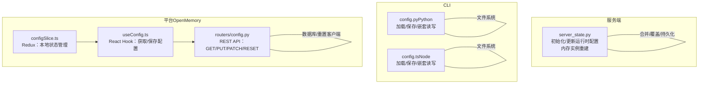
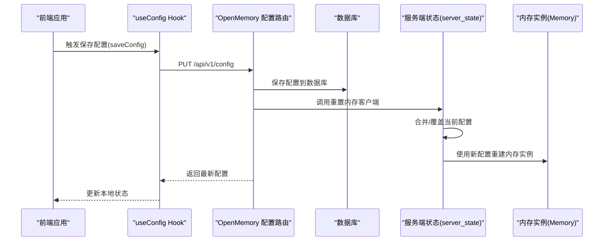
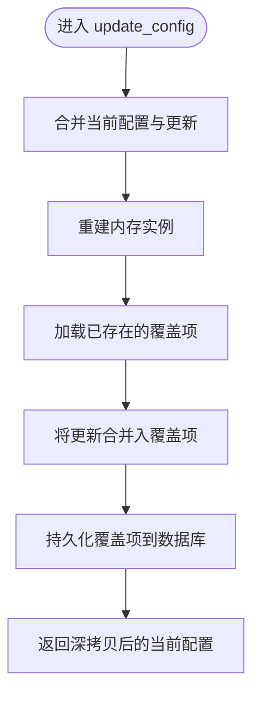
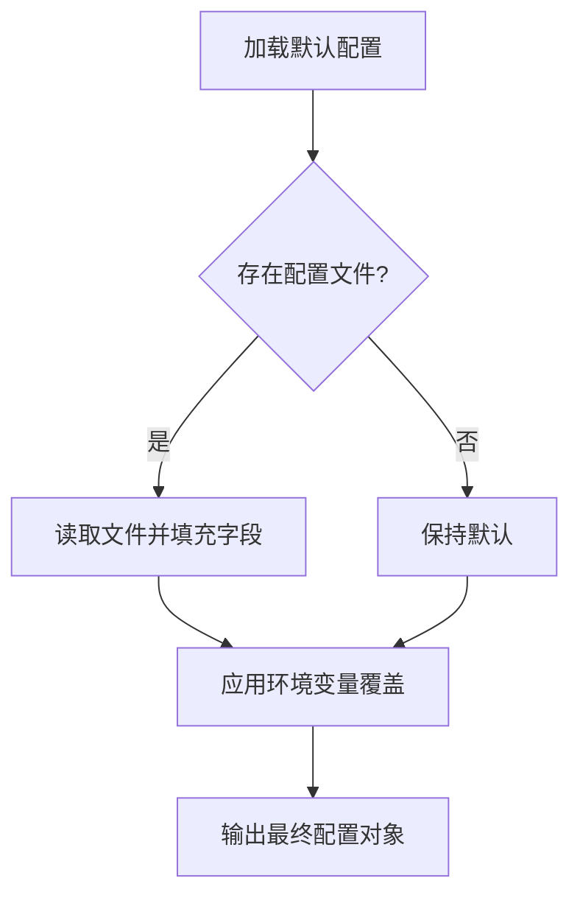
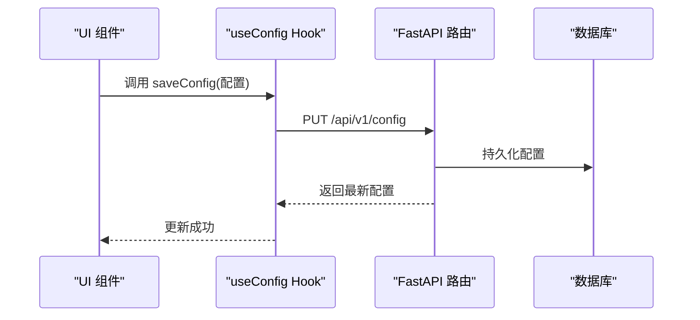

# 运行时配置

<cite>
**本文引用的文件**
- [server_state.py](file://server/server_state.py)
- [config.py（Python CLI）](file://cli/python/src/mem0_cli/config.py)
- [config.ts（Node CLI）](file://cli/node/src/config.ts)
- [config.py（OpenMemory API 路由）](file://openmemory/api/app/routers/config.py)
- [useConfig.ts（OpenMemory 前端 Hook）](file://openmemory/ui/hooks/useConfig.ts)
- [configSlice.ts（OpenMemory Redux Slice）](file://openmemory/ui/store/configSlice.ts)
- [_safe_deepcopy_config 测试](file://tests/memory/test_safe_deepcopy_config.py)
</cite>

## 目录
1. [简介](#简介)
2. [项目结构](#项目结构)
3. [核心组件](#核心组件)
4. [架构总览](#架构总览)
5. [组件详解](#组件详解)
6. [依赖关系分析](#依赖关系分析)
7. [性能考量](#性能考量)
8. [故障排查指南](#故障排查指南)
9. [结论](#结论)
10. [附录](#附录)

## 简介
本文件系统性阐述 mem0 在服务端与前端中的“运行时配置”能力，涵盖以下关键主题：
- 如何在运行时动态修改配置
- 配置更新方法、配置缓存机制与配置生效策略
- 配置继承与覆盖规则
- 最佳实践与性能考虑
- 配置热更新的实现方法与注意事项

## 项目结构
围绕“运行时配置”的相关模块主要分布在三处：
- 服务端状态与持久化：server/server_state.py
- CLI 配置（Python 与 Node）：cli/python/src/mem0_cli/config.py 与 cli/node/src/config.ts
- OpenMemory 平台配置 API 与前端：openmemory/api/app/routers/config.py、openmemory/ui/hooks/useConfig.ts、openmemory/ui/store/configSlice.ts



图表来源
- [server_state.py:1-108](file://server/server_state.py#L1-L108)
- [config.py（Python CLI）:1-242](file://cli/python/src/mem0_cli/config.py#L1-L242)
- [config.ts（Node CLI）:1-233](file://cli/node/src/config.ts#L1-L233)
- [config.py（OpenMemory API 路由）:1-292](file://openmemory/api/app/routers/config.py#L1-L292)
- [useConfig.ts:29-68](file://openmemory/ui/hooks/useConfig.ts#L29-L68)
- [configSlice.ts:69-114](file://openmemory/ui/store/configSlice.ts#L69-L114)

章节来源
- [server_state.py:1-108](file://server/server_state.py#L1-L108)
- [config.py（Python CLI）:1-242](file://cli/python/src/mem0_cli/config.py#L1-L242)
- [config.ts（Node CLI）:1-233](file://cli/node/src/config.ts#L1-L233)
- [config.py（OpenMemory API 路由）:1-292](file://openmemory/api/app/routers/config.py#L1-L292)
- [useConfig.ts:29-68](file://openmemory/ui/hooks/useConfig.ts#L29-L68)
- [configSlice.ts:69-114](file://openmemory/ui/store/configSlice.ts#L69-L114)

## 核心组件
- 服务端运行时配置状态机：负责全局配置的初始化、并发安全更新、内存实例重建与覆盖持久化。
- CLI 配置管理器：提供从文件系统加载/保存配置的能力，并支持通过点路径访问与类型转换设置嵌套字段。
- OpenMemory 平台配置 API：提供 REST 接口以获取/全量更新/部分更新配置，并在更新后重置内存客户端。
- 前端配置 Hook 与状态：提供 React Hook 与 Redux Slice，用于拉取与保存配置。

章节来源
- [server_state.py:76-107](file://server/server_state.py#L76-L107)
- [config.py（Python CLI）:88-144](file://cli/python/src/mem0_cli/config.py#L88-L144)
- [config.ts（Node CLI）:90-131](file://cli/node/src/config.ts#L90-L131)
- [config.py（OpenMemory API 路由）:135-177](file://openmemory/api/app/routers/config.py#L135-L177)
- [useConfig.ts:35-68](file://openmemory/ui/hooks/useConfig.ts#L35-L68)
- [configSlice.ts:69-114](file://openmemory/ui/store/configSlice.ts#L69-L114)

## 架构总览
运行时配置在不同层的职责与交互如下：



图表来源
- [useConfig.ts:52-68](file://openmemory/ui/hooks/useConfig.ts#L52-L68)
- [config.py（OpenMemory API 路由）:141-177](file://openmemory/api/app/routers/config.py#L141-L177)
- [server_state.py:86-95](file://server/server_state.py#L86-L95)

## 组件详解

### 服务端运行时配置（server_state.py）
- 初始化：从默认配置开始，加载数据库中的“覆盖项”，进行深拷贝合并，然后基于合并后的配置创建内存实例。
- 更新：接收增量更新，按层级深度合并到当前配置；随后重建内存实例；同时将更新合并入“覆盖项”并持久化到数据库。
- 获取：返回当前配置的深拷贝，保证外部不直接持有内部状态。
- 并发控制：使用可重入锁保护全局状态，避免竞态。



图表来源
- [server_state.py:86-95](file://server/server_state.py#L86-L95)

章节来源
- [server_state.py:76-107](file://server/server_state.py#L76-L107)

### CLI 配置管理（Python 与 Node）
- 加载顺序（优先级从高到低）：命令行参数 > 环境变量 > 配置文件 > 默认值。
- 文件系统：确保目录权限安全，写入配置文件并设置严格权限。
- 嵌套读写：支持点路径访问与类型转换（布尔/整数），便于命令行或脚本自动化设置。



图表来源
- [config.py（Python CLI）:88-144](file://cli/python/src/mem0_cli/config.py#L88-L144)
- [config.ts（Node CLI）:90-131](file://cli/node/src/config.ts#L90-L131)

章节来源
- [config.py（Python CLI）:1-242](file://cli/python/src/mem0_cli/config.py#L1-L242)
- [config.ts（Node CLI）:1-233](file://cli/node/src/config.ts#L1-L233)

### OpenMemory 平台配置 API 与前端
- API 提供：
  - GET /api/v1/config：获取当前配置
  - PUT /api/v1/config：全量替换配置
  - PATCH /api/v1/config：部分更新配置（深度合并）
  - POST /api/v1/config/reset：重置为默认配置
  - 分段接口：仅更新 LLM、Embedder、Vector Store 或 OpenMemory 子配置
- 更新后行为：调用重置内存客户端，使后续请求使用新的配置。
- 前端 Hook：封装获取与保存配置的异步流程，统一错误处理。
- Redux Slice：维护本地状态，支持细粒度更新（如更新 LLM/Embedder）。



图表来源
- [useConfig.ts:52-68](file://openmemory/ui/hooks/useConfig.ts#L52-L68)
- [config.py（OpenMemory API 路由）:141-177](file://openmemory/api/app/routers/config.py#L141-L177)

章节来源
- [config.py（OpenMemory API 路由）:135-292](file://openmemory/api/app/routers/config.py#L135-L292)
- [useConfig.ts:29-68](file://openmemory/ui/hooks/useConfig.ts#L29-L68)
- [configSlice.ts:69-114](file://openmemory/ui/store/configSlice.ts#L69-L114)

## 依赖关系分析
- 服务端状态依赖数据库中的“覆盖项”表，用于持久化增量更新。
- OpenMemory API 路由依赖数据库存储配置，并在更新后调用“重置内存客户端”逻辑。
- 前端通过 Hook 与 API 交互，Redux Slice 作为本地状态源，避免重复请求。

```mermaid
graph LR
DB["数据库"] <- --> API["OpenMemory 配置路由"]
API --> SRV["服务端状态(server_state)"]
SRV --> MEM["内存实例(Memory)"]
UI["前端"] --> Hook["useConfig Hook"]
Hook --> API
Hook --> Store["Redux Slice"]
```

图表来源
- [config.py（OpenMemory API 路由）:175-177](file://openmemory/api/app/routers/config.py#L175-L177)
- [server_state.py:86-95](file://server/server_state.py#L86-L95)
- [useConfig.ts:35-68](file://openmemory/ui/hooks/useConfig.ts#L35-L68)
- [configSlice.ts:69-114](file://openmemory/ui/store/configSlice.ts#L69-L114)

章节来源
- [config.py（OpenMemory API 路由）:175-177](file://openmemory/api/app/routers/config.py#L175-L177)
- [server_state.py:86-95](file://server/server_state.py#L86-L95)
- [useConfig.ts:35-68](file://openmemory/ui/hooks/useConfig.ts#L35-L68)
- [configSlice.ts:69-114](file://openmemory/ui/store/configSlice.ts#L69-L114)

## 性能考量
- 并发安全：服务端状态使用可重入锁，避免多线程场景下的竞态条件。
- 深拷贝与安全复制：测试覆盖了对不可深拷贝对象的安全降级处理，降低异常风险。
- 数据库写入：覆盖项采用“插入冲突更新”策略，减少写放大。
- 前端节流：建议在频繁变更配置时结合防抖策略，减少不必要的 API 请求（参考通用防抖 Hook 的使用思路）。

章节来源
- [server_state.py:9-12](file://server/server_state.py#L9-L12)
- [_safe_deepcopy_config 测试:346-371](file://tests/memory/test_safe_deepcopy_config.py#L346-L371)

## 故障排查指南
- 无法获取内存实例：若未初始化运行时配置，获取内存实例会抛出运行时错误。请先完成初始化或更新配置。
- 配置未生效：确认是否调用了“重置内存客户端”的逻辑；在平台 API 中，PATCH/PUT 后会自动触发重置。
- 权限问题：CLI 写入配置文件需确保文件权限正确；加载配置前会检查并设置安全权限。
- 类型不匹配：嵌套设置时会进行布尔/整数类型转换，请确保传入字符串符合预期格式。

章节来源
- [server_state.py:103-107](file://server/server_state.py#L103-L107)
- [config.py（OpenMemory API 路由）:175-177](file://openmemory/api/app/routers/config.py#L175-L177)
- [config.py（Python CLI）:147-181](file://cli/python/src/mem0_cli/config.py#L147-L181)
- [config.ts（Node CLI）:134-179](file://cli/node/src/config.ts#L134-L179)

## 结论
- 运行时配置通过“增量更新 + 深度合并 + 覆盖持久化”的方式实现灵活且可控的热更新。
- 服务端与平台 API 协同，确保配置更新后能及时重建内存实例并对外生效。
- CLI 层提供一致的加载/保存与嵌套读写能力，便于自动化与运维集成。
- 建议在生产中结合并发控制、类型转换与权限管理，保障稳定性与安全性。

## 附录

### 配置更新方法速查
- 服务端：调用更新函数，传入增量字典，返回合并后的当前配置。
- 平台 API：使用 PATCH 全量/部分更新，或 PUT 单一子配置端点。
- CLI：通过点路径设置嵌套字段，保存至配置文件。

章节来源
- [server_state.py:86-95](file://server/server_state.py#L86-L95)
- [config.py（OpenMemory API 路由）:159-177](file://openmemory/api/app/routers/config.py#L159-L177)
- [config.py（Python CLI）:218-241](file://cli/python/src/mem0_cli/config.py#L218-L241)
- [config.ts（Node CLI）:213-232](file://cli/node/src/config.ts#L213-L232)

### 配置继承与覆盖规则
- 服务端：当前配置与更新进行深度合并；数据库中的“覆盖项”与更新再次合并后持久化。
- 平台 API：GET 返回完整配置；PUT 全量替换；PATCH 深度合并；分段端点仅更新对应子配置。
- CLI：环境变量覆盖配置文件；命令行参数覆盖环境变量。

章节来源
- [server_state.py:64-73](file://server/server_state.py#L64-L73)
- [config.py（OpenMemory API 路由）:164-170](file://openmemory/api/app/routers/config.py#L164-L170)
- [config.py（Python CLI）:119-142](file://cli/python/src/mem0_cli/config.py#L119-L142)
- [config.ts（Node CLI）:120-130](file://cli/node/src/config.ts#L120-L130)

### 配置缓存机制与生效策略
- 缓存：服务端持有当前配置副本；前端使用 Hook 与 Redux 维护本地状态。
- 生效：服务端在更新后重建内存实例；平台 API 在更新后重置内存客户端；CLI 写入文件后立即生效。

章节来源
- [server_state.py:98-100](file://server/server_state.py#L98-L100)
- [useConfig.ts:35-68](file://openmemory/ui/hooks/useConfig.ts#L35-L68)
- [configSlice.ts:69-114](file://openmemory/ui/store/configSlice.ts#L69-L114)
- [config.py（OpenMemory API 路由）:175-177](file://openmemory/api/app/routers/config.py#L175-L177)

### 最佳实践与注意事项
- 使用 PATCH 实现最小化更新，减少覆盖范围。
- 在高频变更场景下引入前端防抖，降低网络压力。
- 对敏感字段进行脱敏显示（CLI 提供密钥脱敏工具）。
- 更新配置后务必重置内存客户端，确保后续操作使用新配置。
- 服务端更新需注意并发安全，避免与其他线程竞争。

章节来源
- [config.py（Python CLI）:196-203](file://cli/python/src/mem0_cli/config.py#L196-L203)
- [config.ts（Node CLI）:181-185](file://cli/node/src/config.ts#L181-L185)
- [config.py（OpenMemory API 路由）:175-177](file://openmemory/api/app/routers/config.py#L175-L177)
- [server_state.py:8-12](file://server/server_state.py#L8-L12)