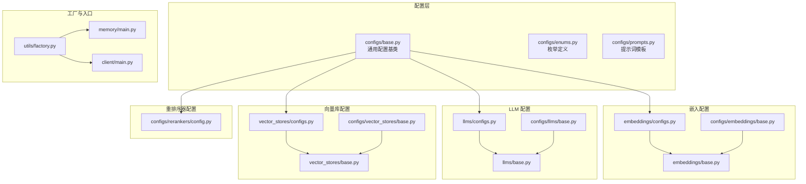
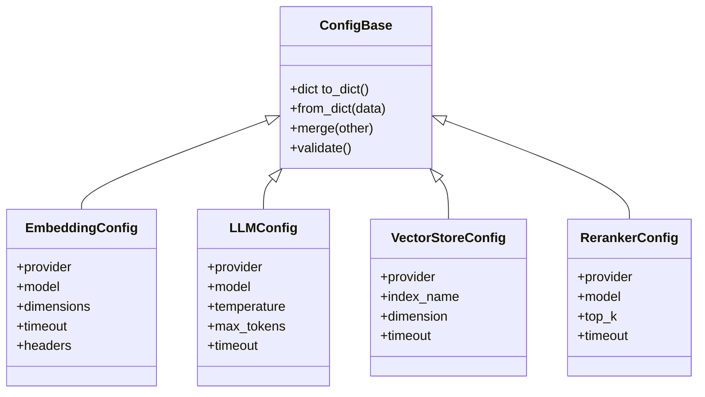
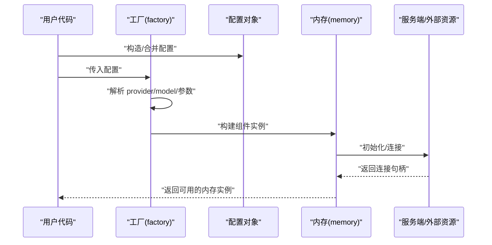
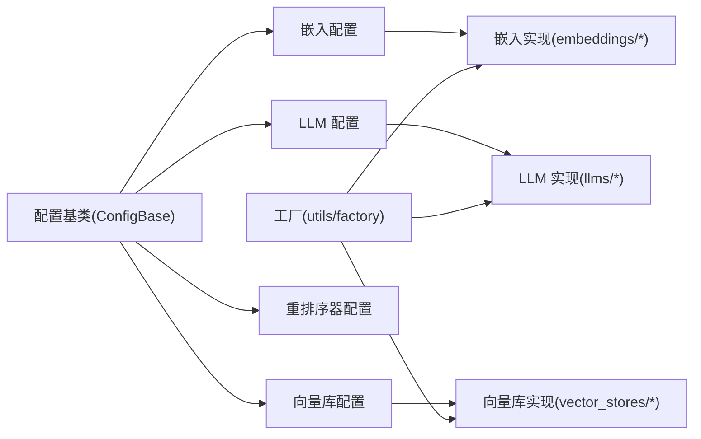

# 配置管理

<cite>
**本文引用的文件**
- [mem0/configs/base.py](file://mem0/configs/base.py)
- [mem0/configs/enums.py](file://mem0/configs/enums.py)
- [mem0/configs/prompts.py](file://mem0/configs/prompts.py)
- [mem0/embeddings/configs.py](file://mem0/embeddings/configs.py)
- [mem0/llms/configs.py](file://mem0/llms/configs.py)
- [mem0/vector_stores/configs.py](file://mem0/vector_stores/configs.py)
- [mem0/configs/rerankers/config.py](file://mem0/configs/rerankers/config.py)
- [mem0/embeddings/base.py](file://mem0/embeddings/base.py)
- [mem0/llms/base.py](file://mem0/llms/base.py)
- [mem0/vector_stores/base.py](file://mem0/vector_stores/base.py)
- [mem0/configs/embeddings/base.py](file://mem0/configs/embeddings/base.py)
- [mem0/configs/llms/base.py](file://mem0/configs/llms/base.py)
- [mem0/configs/vector_stores/base.py](file://mem0/configs/vector_stores/base.py)
- [mem0/utils/factory.py](file://mem0/utils/factory.py)
- [mem0/memory/main.py](file://mem0/memory/main.py)
- [mem0/client/main.py](file://mem0/client/main.py)
- [tests/memory/test_safe_deepcopy_config.py](file://tests/memory/test_safe_deepcopy_config.py)
- [tests/rerankers/test_llm_reranker_config.py](file://tests/rerankers/test_llm_reranker_config.py)
- [tests/rerankers/test_llm_reranker_nested_config.py](file://tests/rerankers/test_llm_reranker_nested_config.py)
- [tests/vector_stores/test_qdrant_config.py](file://tests/vector_stores/test_qdrant_config.py)
</cite>

## 目录
1. [简介](#简介)
2. [项目结构](#项目结构)
3. [核心组件](#核心组件)
4. [架构总览](#架构总览)
5. [详细组件分析](#详细组件分析)
6. [依赖关系分析](#依赖关系分析)
7. [性能考量](#性能考量)
8. [故障排查指南](#故障排查指南)
9. [结论](#结论)
10. [附录](#附录)

## 简介
本文件系统性梳理 mem0 Python SDK 的配置管理机制，覆盖以下方面：
- 配置类结构与参数选项：向量存储、嵌入模型、LLM、重排序器等
- 配置继承与组合模式
- 环境变量覆盖与运行时更新策略
- 不同场景的配置模板与最佳实践
- 配置验证、错误检查与调试方法

## 项目结构
SDK 将“配置”抽象为独立模块，分别在嵌入、LLM、向量库、重排序器等子域下提供可插拔的配置类与工厂加载逻辑；同时通过统一的基类与枚举类型保证跨域一致性。

图表来源
- [mem0/configs/base.py](file://mem0/configs/base.py)
- [mem0/configs/enums.py](file://mem0/configs/enums.py)
- [mem0/configs/prompts.py](file://mem0/configs/prompts.py)
- [mem0/embeddings/configs.py](file://mem0/embeddings/configs.py)
- [mem0/llms/configs.py](file://mem0/llms/configs.py)
- [mem0/vector_stores/configs.py](file://mem0/vector_stores/configs.py)
- [mem0/configs/rerankers/config.py](file://mem0/configs/rerankers/config.py)
- [mem0/embeddings/base.py](file://mem0/embeddings/base.py)
- [mem0/llms/base.py](file://mem0/llms/base.py)
- [mem0/vector_stores/base.py](file://mem0/vector_stores/base.py)
- [mem0/utils/factory.py](file://mem0/utils/factory.py)
- [mem0/memory/main.py](file://mem0/memory/main.py)
- [mem0/client/main.py](file://mem0/client/main.py)

章节来源
- [mem0/configs/base.py](file://mem0/configs/base.py)
- [mem0/configs/enums.py](file://mem0/configs/enums.py)
- [mem0/configs/prompts.py](file://mem0/configs/prompts.py)
- [mem0/embeddings/configs.py](file://mem0/embeddings/configs.py)
- [mem0/llms/configs.py](file://mem0/llms/configs.py)
- [mem0/vector_stores/configs.py](file://mem0/vector_stores/configs.py)
- [mem0/configs/rerankers/config.py](file://mem0/configs/rerankers/config.py)

## 核心组件
- 通用配置基类：提供统一的字段、序列化、校验与合并能力，支持从字典或实例初始化。
- 枚举与提示词：集中管理模型族、检索策略、评分归一化等枚举值，以及默认提示词模板。
- 子域配置：嵌入、LLM、向量库、重排序器各自提供具体配置类，遵循统一的命名与字段风格。
- 工厂与加载：通过工厂根据配置动态构建组件实例，贯穿内存与客户端入口。

章节来源
- [mem0/configs/base.py](file://mem0/configs/base.py)
- [mem0/configs/enums.py](file://mem0/configs/enums.py)
- [mem0/configs/prompts.py](file://mem0/configs/prompts.py)
- [mem0/utils/factory.py](file://mem0/utils/factory.py)

## 架构总览
配置体系采用“分层 + 插件化”的设计：
- 基类层：定义公共字段与行为（如是否启用、超时、重试等）
- 子域层：按功能域细化字段（如嵌入维度、LLM温度、向量库索引参数等）
- 接口层：面向外部暴露统一的配置接口，便于注入到工厂与运行时
- 运行时：工厂解析配置，实例化对应组件；支持运行时更新与热替换

图表来源
- [mem0/configs/base.py](file://mem0/configs/base.py)
- [mem0/embeddings/configs.py](file://mem0/embeddings/configs.py)
- [mem0/llms/configs.py](file://mem0/llms/configs.py)
- [mem0/vector_stores/configs.py](file://mem0/vector_stores/configs.py)
- [mem0/configs/rerankers/config.py](file://mem0/configs/rerankers/config.py)

## 详细组件分析

### 配置继承与组合
- 继承关系：各子域配置均继承自通用配置基类，复用序列化、合并与校验能力。
- 组合关系：运行时通过工厂将多个配置组合为完整的记忆系统（嵌入+向量库+LLM±重排序）。
- 合并与覆盖：支持将新配置与现有配置进行深度合并，优先使用新值；提供安全深拷贝以避免副作用。

图表来源
- [mem0/utils/factory.py](file://mem0/utils/factory.py)
- [mem0/memory/main.py](file://mem0/memory/main.py)
- [mem0/client/main.py](file://mem0/client/main.py)

章节来源
- [mem0/configs/base.py](file://mem0/configs/base.py)
- [mem0/utils/factory.py](file://mem0/utils/factory.py)
- [tests/memory/test_safe_deepcopy_config.py](file://tests/memory/test_safe_deepcopy_config.py)

### 嵌入模型配置（Embeddings）
- 关键字段：提供方、模型名、维度、超时、请求头等
- 典型场景：
  - 本地推理：Ollama/FastEmbed/LMStudio
  - 云端推理：OpenAI/Azure OpenAI/Gemini/Vertex AI/HuggingFace/Together/AWS Bedrock
- 最佳实践：
  - 明确指定维度与模型一致，避免运行时自动推断失败
  - 在多租户/多项目中隔离 index_name 或 collection 名称
  - 对于受限网络，设置合理的 timeout 与重试策略

章节来源
- [mem0/embeddings/configs.py](file://mem0/embeddings/configs.py)
- [mem0/embeddings/base.py](file://mem0/embeddings/base.py)
- [mem0/configs/embeddings/base.py](file://mem0/configs/embeddings/base.py)

### LLM 配置（LLMs）
- 关键字段：提供方、模型名、温度、最大生成长度、超时等
- 典型场景：
  - 结构化输出：OpenAI Structured Outputs/Azure OpenAI Structured
  - 多模态/大模型：Anthropic/Gemini/VLLM/DeepSeek/Sarvam/XAI
  - 云厂商：AWS Bedrock/OpenCLAW/LiteLLM
- 最佳实践：
  - 温度与采样策略需与下游任务匹配（检索增强更稳健，创意类更高）
  - 对长上下文任务，合理设置 max_tokens 与分段策略
  - 使用结构化输出时，确保 schema 与提示词一致

章节来源
- [mem0/llms/configs.py](file://mem0/llms/configs.py)
- [mem0/llms/base.py](file://mem0/llms/base.py)
- [mem0/configs/llms/base.py](file://mem0/configs/llms/base.py)

### 向量存储配置（Vector Stores）
- 关键字段：提供方、索引/集合名称、维度、超时、连接参数等
- 典型场景：
  - 云原生：Pinecone/Qdrant/PgVector/Supabase/Weaviate/MongoDB
  - 自建/边缘：FAISS/Redis/Chroma/Elasticsearch/OpenSearch
  - 数据库：Azure MySQL/Neptune Analytics/Baidu
- 最佳实践：
  - 索引名称与项目/租户绑定，避免冲突
  - 按数据规模选择合适的索引参数与批量写入策略
  - 对高延迟网络，开启连接池与重试

章节来源
- [mem0/vector_stores/configs.py](file://mem0/vector_stores/configs.py)
- [mem0/vector_stores/base.py](file://mem0/vector_stores/base.py)
- [mem0/configs/vector_stores/base.py](file://mem0/configs/vector_stores/base.py)
- [tests/vector_stores/test_qdrant_config.py](file://tests/vector_stores/test_qdrant_config.py)

### 重排序器配置（Rerankers）
- 关键字段：提供方、模型、top_k、超时等
- 典型场景：
  - 基于语义相似度：Sentence Transformer/Cohere
  - 基于 LLM 判别：LLM Reranker
  - 开源生态：HuggingFace
- 最佳实践：
  - top_k 与召回规模平衡，避免过度过滤
  - 在高延迟场景下，适当降低 top_k 与批大小

章节来源
- [mem0/configs/rerankers/config.py](file://mem0/configs/rerankers/config.py)

### 配置验证与错误处理
- 字段校验：在配置基类中实现 validate，覆盖必填项、范围与格式检查
- 类型约束：通过枚举与类型注解减少非法输入
- 异常传播：工厂与运行时捕获底层异常并包装为清晰的错误信息
- 单元测试：针对配置解析与回退逻辑进行覆盖

章节来源
- [mem0/configs/base.py](file://mem0/configs/base.py)
- [tests/rerankers/test_llm_reranker_config.py](file://tests/rerankers/test_llm_reranker_config.py)
- [tests/rerankers/test_llm_reranker_nested_config.py](file://tests/rerankers/test_llm_reranker_nested_config.py)

### 环境变量覆盖与运行时更新
- 环境变量覆盖：配置加载时允许从环境变量读取敏感或动态参数（如密钥、端点），并在未显式传参时生效
- 运行时更新：通过 merge 与深拷贝实现配置热更新，避免直接修改共享实例
- 安全更新：对敏感字段（如 API Key）提供只读视图或延迟生效策略

章节来源
- [mem0/configs/base.py](file://mem0/configs/base.py)
- [tests/memory/test_safe_deepcopy_config.py](file://tests/memory/test_safe_deepcopy_config.py)

### 场景化配置模板与最佳实践
- 本地开发（低延迟、低成本）
  - 嵌入：FastEmbed/Ollama
  - 向量库：FAISS/Chroma
  - LLM：LMStudio/Ollama
- 生产部署（高可用、可观测）
  - 嵌入：OpenAI/Azure OpenAI
  - 向量库：PgVector/Supabase/Qdrant
  - LLM：Anthropic/Gemini/AWS Bedrock
- 多租户/多项目（隔离与权限）
  - 为每个租户/项目设置独立的 index_name/collection
  - 使用命名空间化的环境变量前缀
- 高并发检索（吞吐优先）
  - 调整 top_k 与批大小
  - 启用连接池与缓存
- 长上下文/复杂推理（准确性优先）
  - 降低温度，增加 max_tokens
  - 使用结构化输出与严格 schema

## 依赖关系分析
- 配置到组件的依赖：配置基类被各子域配置继承；工厂依赖配置完成实例化
- 组件到外部的依赖：嵌入/LLM/向量库分别对接第三方 SDK 或数据库驱动
- 测试覆盖：针对配置解析、回退与嵌套配置进行单元测试

图表来源
- [mem0/configs/base.py](file://mem0/configs/base.py)
- [mem0/embeddings/configs.py](file://mem0/embeddings/configs.py)
- [mem0/llms/configs.py](file://mem0/llms/configs.py)
- [mem0/vector_stores/configs.py](file://mem0/vector_stores/configs.py)
- [mem0/utils/factory.py](file://mem0/utils/factory.py)

章节来源
- [mem0/utils/factory.py](file://mem0/utils/factory.py)
- [mem0/embeddings/configs.py](file://mem0/embeddings/configs.py)
- [mem0/llms/configs.py](file://mem0/llms/configs.py)
- [mem0/vector_stores/configs.py](file://mem0/vector_stores/configs.py)

## 性能考量
- 批量化与并行：在检索与嵌入阶段合理设置批大小与并发度
- 缓存与连接池：对高频查询与慢速外部服务启用缓存与连接池
- 参数调优：top_k、max_tokens、温度等参数与任务目标权衡
- 网络与超时：根据部署环境调整超时与重试策略

## 故障排查指南
- 配置解析失败
  - 检查必填字段是否缺失
  - 核对 provider 与 model 是否匹配
- 连接异常
  - 校验 endpoint 与鉴权参数
  - 查看超时与重试配置
- 性能问题
  - 分析 top_k 与召回规模
  - 检查批大小与并发度
- 回退与兼容
  - 使用测试用例验证配置回退逻辑
  - 参考单测定位问题边界

章节来源
- [tests/rerankers/test_llm_reranker_config.py](file://tests/rerankers/test_llm_reranker_config.py)
- [tests/rerankers/test_llm_reranker_nested_config.py](file://tests/rerankers/test_llm_reranker_nested_config.py)
- [tests/vector_stores/test_qdrant_config.py](file://tests/vector_stores/test_qdrant_config.py)

## 结论
该配置管理体系以统一基类为核心，结合子域配置与工厂加载，实现了跨域一致、可扩展且可维护的配置方案。通过严格的校验、环境变量覆盖与运行时更新机制，能够满足从本地开发到生产部署的多样化需求。建议在实际项目中遵循本文的最佳实践，并结合单元测试持续验证配置的正确性与稳定性。

## 附录
- 提示词模板与枚举：用于统一提示词与策略标识，便于跨组件一致性
- 客户端与内存入口：通过统一配置驱动组件实例化，简化集成流程

章节来源
- [mem0/configs/prompts.py](file://mem0/configs/prompts.py)
- [mem0/configs/enums.py](file://mem0/configs/enums.py)
- [mem0/client/main.py](file://mem0/client/main.py)
- [mem0/memory/main.py](file://mem0/memory/main.py)