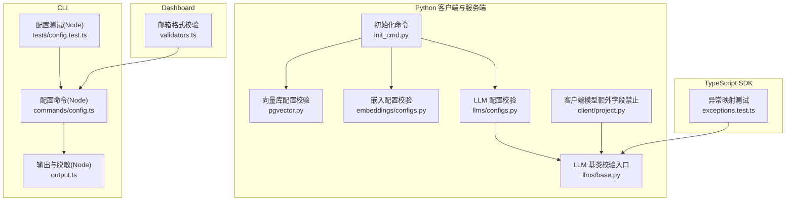
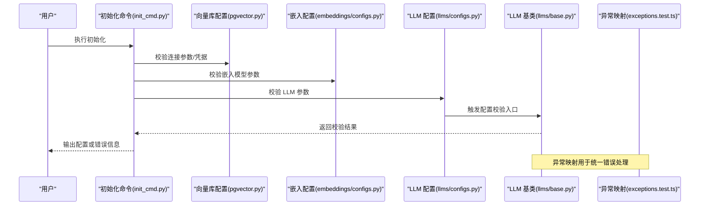
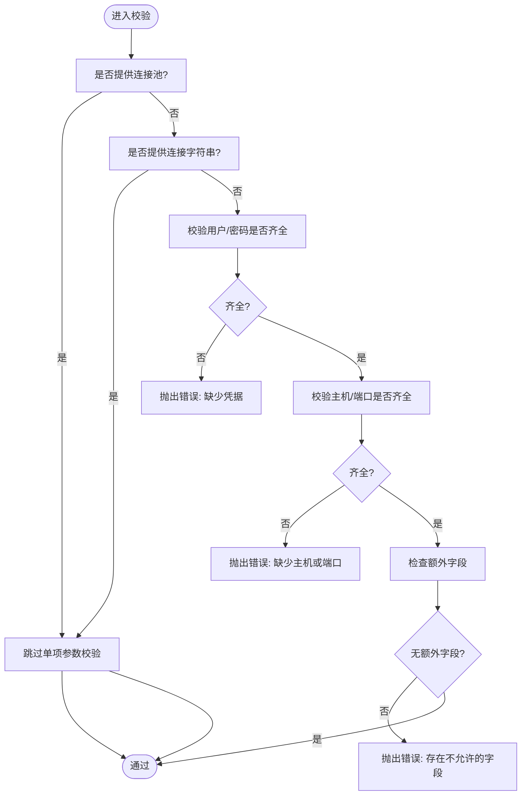
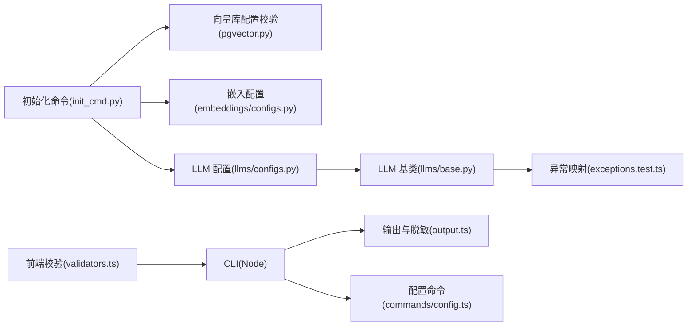

# 配置验证

<cite>
**本文引用的文件**
- [mem0/configs/vector_stores/pgvector.py](file://mem0/configs/vector_stores/pgvector.py)
- [cli/python/src/mem0_cli/commands/init_cmd.py](file://cli/python/src/mem0_cli/commands/init_cmd.py)
- [mem0/client/project.py](file://mem0/client/project.py)
- [mem0/embeddings/configs.py](file://mem0/embeddings/configs.py)
- [mem0/llms/configs.py](file://mem0/llms/configs.py)
- [mem0/llms/base.py](file://mem0/llms/base.py)
- [mem0-ts/src/common/exceptions.test.ts](file://mem0-ts/src/common/exceptions.test.ts)
- [server/main.py](file://server/main.py)
- [cli/node/src/commands/config.ts](file://cli/node/src/commands/config.ts)
- [cli/node/src/output.ts](file://cli/node/src/output.ts)
- [cli/node/tests/config.test.ts](file://cli/node/tests/config.test.ts)
- [server/dashboard/src/lib/validators.ts](file://server/dashboard/src/lib/validators.ts)
</cite>

## 目录
1. [引言](#引言)
2. [项目结构](#项目结构)
3. [核心组件](#核心组件)
4. [架构总览](#架构总览)
5. [详细组件分析](#详细组件分析)
6. [依赖关系分析](#依赖关系分析)
7. [性能考量](#性能考量)
8. [故障排查指南](#故障排查指南)
9. [结论](#结论)
10. [附录](#附录)

## 引言
本文件系统性梳理代码库中的“配置验证”机制与规则，覆盖必填字段检查、数据类型与范围校验、错误检测与报告流程，并给出常见失败原因与解决方案、自定义验证规则的实现方法以及调试技巧。内容以实际源码为依据，辅以图示帮助理解。

## 项目结构
围绕配置验证的关键位置主要分布在以下模块：
- Python 客户端与服务端：在初始化命令、向量库配置、嵌入与大模型配置中执行严格校验；客户端模型启用额外字段禁止策略。
- TypeScript SDK：异常体系映射 HTTP 状态到具体异常类型，便于统一处理配置相关错误。
- CLI（Node/Python）：配置展示、设置、加载与敏感信息脱敏输出。
- Dashboard 前端：基础输入校验（如邮箱格式）。

图表来源
- [cli/python/src/mem0_cli/commands/init_cmd.py:421-488](file://cli/python/src/mem0_cli/commands/init_cmd.py#L421-L488)
- [mem0/configs/vector_stores/pgvector.py:23-54](file://mem0/configs/vector_stores/pgvector.py#L23-L54)
- [mem0/embeddings/configs.py:13-13](file://mem0/embeddings/configs.py#L13-L13)
- [mem0/llms/configs.py:10-10](file://mem0/llms/configs.py#L10-L10)
- [mem0/llms/base.py:27-29](file://mem0/llms/base.py#L27-L29)
- [mem0/client/project.py:24-24](file://mem0/client/project.py#L24-L24)
- [mem0-ts/src/common/exceptions.test.ts:194-246](file://mem0-ts/src/common/exceptions.test.ts#L194-L246)
- [cli/node/src/commands/config.ts:1-48](file://cli/node/src/commands/config.ts#L1-L48)
- [cli/node/src/output.ts:249-272](file://cli/node/src/output.ts#L249-L272)
- [cli/node/tests/config.test.ts:1-59](file://cli/node/tests/config.test.ts#L1-L59)
- [server/dashboard/src/lib/validators.ts:1-3](file://server/dashboard/src/lib/validators.ts#L1-L3)

章节来源
- [cli/python/src/mem0_cli/commands/init_cmd.py:421-488](file://cli/python/src/mem0_cli/commands/init_cmd.py#L421-L488)
- [mem0/configs/vector_stores/pgvector.py:23-54](file://mem0/configs/vector_stores/pgvector.py#L23-L54)
- [mem0/embeddings/configs.py:13-13](file://mem0/embeddings/configs.py#L13-L13)
- [mem0/llms/configs.py:10-10](file://mem0/llms/configs.py#L10-L10)
- [mem0/llms/base.py:27-29](file://mem0/llms/base.py#L27-L29)
- [mem0/client/project.py:24-24](file://mem0/client/project.py#L24-L24)
- [mem0-ts/src/common/exceptions.test.ts:194-246](file://mem0-ts/src/common/exceptions.test.ts#L194-L246)
- [cli/node/src/commands/config.ts:1-48](file://cli/node/src/commands/config.ts#L1-L48)
- [cli/node/src/output.ts:249-272](file://cli/node/src/output.ts#L249-L272)
- [cli/node/tests/config.test.ts:1-59](file://cli/node/tests/config.test.ts#L1-L59)
- [server/dashboard/src/lib/validators.ts:1-3](file://server/dashboard/src/lib/validators.ts#L1-L3)

## 核心组件
- 初始化阶段的平台配置校验：在初始化命令中对平台参数进行组合校验，避免遗漏关键凭据或地址信息。
- 向量库配置校验：通过 Pydantic 的模型验证器对连接参数进行互斥与必填校验，并限制允许字段集合。
- 嵌入与 LLM 配置校验：在各自配置模块中提供验证钩子，确保模型参数合法。
- 客户端模型额外字段禁止：启用额外字段禁止策略，防止传入未知字段导致运行时歧义。
- 异常映射与报告：将 HTTP 状态映射到具体异常类型，便于统一捕获与提示。
- CLI 配置管理：支持显示、设置、加载配置，并对敏感字段进行脱敏输出。
- 前端基础校验：对邮箱等字段进行简单正则校验。

章节来源
- [cli/python/src/mem0_cli/commands/init_cmd.py:421-488](file://cli/python/src/mem0_cli/commands/init_cmd.py#L421-L488)
- [mem0/configs/vector_stores/pgvector.py:23-54](file://mem0/configs/vector_stores/pgvector.py#L23-L54)
- [mem0/embeddings/configs.py:13-13](file://mem0/embeddings/configs.py#L13-L13)
- [mem0/llms/configs.py:10-10](file://mem0/llms/configs.py#L10-L10)
- [mem0/client/project.py:24-24](file://mem0/client/project.py#L24-L24)
- [mem0-ts/src/common/exceptions.test.ts:194-246](file://mem0-ts/src/common/exceptions.test.ts#L194-L246)
- [cli/node/src/commands/config.ts:1-48](file://cli/node/src/commands/config.ts#L1-L48)
- [cli/node/src/output.ts:249-272](file://cli/node/src/output.ts#L249-L272)
- [server/dashboard/src/lib/validators.ts:1-3](file://server/dashboard/src/lib/validators.ts#L1-L3)

## 架构总览
下图展示了从初始化到配置使用的整体流程，以及关键的验证点：

图表来源
- [cli/python/src/mem0_cli/commands/init_cmd.py:421-488](file://cli/python/src/mem0_cli/commands/init_cmd.py#L421-L488)
- [mem0/configs/vector_stores/pgvector.py:23-54](file://mem0/configs/vector_stores/pgvector.py#L23-L54)
- [mem0/embeddings/configs.py:13-13](file://mem0/embeddings/configs.py#L13-L13)
- [mem0/llms/configs.py:10-10](file://mem0/llms/configs.py#L10-L10)
- [mem0/llms/base.py:27-29](file://mem0/llms/base.py#L27-L29)
- [mem0-ts/src/common/exceptions.test.ts:194-246](file://mem0-ts/src/common/exceptions.test.ts#L194-L246)

## 详细组件分析

### 初始化阶段的平台配置校验
- 目标：确保平台相关配置完整且互斥，避免凭据缺失或地址不一致。
- 关键点：
  - 对组合参数进行互斥判断（例如连接池与单个连接参数不能同时出现）。
  - 若提供连接字符串，则跳过单项参数校验。
  - 当未使用连接字符串时，要求凭据与地址信息齐全。
- 错误处理：当条件不满足时抛出明确错误，提示缺少必要字段。

章节来源
- [cli/python/src/mem0_cli/commands/init_cmd.py:421-488](file://cli/python/src/mem0_cli/commands/init_cmd.py#L421-L488)

### 向量库配置校验（以 PostgreSQL 向量存储为例）
- 必填字段检查：
  - 当未提供连接池或连接字符串时，必须同时提供用户与密码、主机与端口。
- 数据类型与范围检查：
  - 使用 Pydantic 模型验证器进行字段合法性检查。
- 额外字段检查：
  - 限定允许字段集合，拒绝未知字段，避免运行时歧义。
- 错误处理：
  - 发现额外字段时抛出错误，提示允许的字段列表。

图表来源
- [mem0/configs/vector_stores/pgvector.py:23-54](file://mem0/configs/vector_stores/pgvector.py#L23-L54)

章节来源
- [mem0/configs/vector_stores/pgvector.py:23-54](file://mem0/configs/vector_stores/pgvector.py#L23-L54)

### 嵌入与 LLM 配置校验
- 嵌入配置：
  - 在嵌入配置模块中提供验证钩子，确保模型参数合法。
- LLM 配置：
  - LLM 配置模块提供验证钩子。
  - LLM 基类暴露统一的配置校验入口，触发链路贯穿至具体实现。
- 错误处理：
  - 校验失败时抛出异常，由上层捕获并反馈给用户。

章节来源
- [mem0/embeddings/configs.py:13-13](file://mem0/embeddings/configs.py#L13-L13)
- [mem0/llms/configs.py:10-10](file://mem0/llms/configs.py#L10-L10)
- [mem0/llms/base.py:27-29](file://mem0/llms/base.py#L27-L29)

### 客户端模型额外字段禁止
- 目标：防止传入未知字段导致运行时行为不可预测。
- 实现：启用额外字段禁止策略，任何未声明字段都会被拒绝。
- 影响：提升配置健壮性，减少因拼写错误或多余字段引发的问题。

章节来源
- [mem0/client/project.py:24-24](file://mem0/client/project.py#L24-L24)

### 异常映射与报告（TypeScript）
- 目标：将 HTTP 状态码映射到具体异常类型，便于统一处理配置相关错误。
- 覆盖范围：400、401、403、404、408、409、413、422、429、500、502、503、504 等。
- 应用场景：SDK 层面根据响应状态选择合适的异常类型，增强可读性与一致性。

章节来源
- [mem0-ts/src/common/exceptions.test.ts:194-246](file://mem0-ts/src/common/exceptions.test.ts#L194-L246)

### CLI 配置管理与脱敏输出
- 功能：
  - 显示当前配置，支持 JSON/Agent 模式输出。
  - 设置/获取嵌套配置项。
  - 对敏感字段（如 API Key）进行脱敏展示。
- 错误与提示：
  - 将错误信息输出到标准错误流，保证用户可见。
  - 支持在非 Agent 模式下输出 Notice 提示。

章节来源
- [cli/node/src/commands/config.ts:1-48](file://cli/node/src/commands/config.ts#L1-L48)
- [cli/node/src/output.ts:249-272](file://cli/node/src/output.ts#L249-L272)
- [cli/node/tests/config.test.ts:1-59](file://cli/node/tests/config.test.ts#L1-L59)

### 前端基础校验（邮箱格式）
- 目标：在前端层面进行基础输入校验，降低无效请求概率。
- 方法：使用正则表达式匹配邮箱格式。

章节来源
- [server/dashboard/src/lib/validators.ts:1-3](file://server/dashboard/src/lib/validators.ts#L1-L3)

## 依赖关系分析
- 初始化命令依赖向量库、嵌入与 LLM 配置模块完成联合校验。
- LLM 配置模块通过基类统一触发校验逻辑。
- 客户端模型启用额外字段禁止策略，强化配置约束。
- 异常映射为 SDK 层提供统一错误处理依据。
- CLI 与前端分别负责用户侧配置展示与输入校验。

图表来源
- [cli/python/src/mem0_cli/commands/init_cmd.py:421-488](file://cli/python/src/mem0_cli/commands/init_cmd.py#L421-L488)
- [mem0/configs/vector_stores/pgvector.py:23-54](file://mem0/configs/vector_stores/pgvector.py#L23-L54)
- [mem0/embeddings/configs.py:13-13](file://mem0/embeddings/configs.py#L13-L13)
- [mem0/llms/configs.py:10-10](file://mem0/llms/configs.py#L10-L10)
- [mem0/llms/base.py:27-29](file://mem0/llms/base.py#L27-L29)
- [mem0-ts/src/common/exceptions.test.ts:194-246](file://mem0-ts/src/common/exceptions.test.ts#L194-L246)
- [cli/node/src/output.ts:249-272](file://cli/node/src/output.ts#L249-L272)
- [cli/node/src/commands/config.ts:1-48](file://cli/node/src/commands/config.ts#L1-L48)
- [server/dashboard/src/lib/validators.ts:1-3](file://server/dashboard/src/lib/validators.ts#L1-L3)

章节来源
- [cli/python/src/mem0_cli/commands/init_cmd.py:421-488](file://cli/python/src/mem0_cli/commands/init_cmd.py#L421-L488)
- [mem0/configs/vector_stores/pgvector.py:23-54](file://mem0/configs/vector_stores/pgvector.py#L23-L54)
- [mem0/embeddings/configs.py:13-13](file://mem0/embeddings/configs.py#L13-L13)
- [mem0/llms/configs.py:10-10](file://mem0/llms/configs.py#L10-L10)
- [mem0/llms/base.py:27-29](file://mem0/llms/base.py#L27-L29)
- [mem0-ts/src/common/exceptions.test.ts:194-246](file://mem0-ts/src/common/exceptions.test.ts#L194-L246)
- [cli/node/src/output.ts:249-272](file://cli/node/src/output.ts#L249-L272)
- [cli/node/src/commands/config.ts:1-48](file://cli/node/src/commands/config.ts#L1-L48)
- [server/dashboard/src/lib/validators.ts:1-3](file://server/dashboard/src/lib/validators.ts#L1-L3)

## 性能考量
- 验证器在初始化阶段集中执行，避免运行期重复校验带来的开销。
- 使用 Pydantic 模型验证器具备良好的性能与可维护性。
- CLI 脱敏与输出采用轻量级处理，不影响整体性能。
- 前端正则校验仅用于基础过滤，不替代后端严格校验。

## 故障排查指南
- 常见失败原因
  - 凭据缺失：未提供连接字符串时，用户/密码或主机/端口至少一项为空。
  - 额外字段：传入了不允许的字段名。
  - 组合参数冲突：同时提供了连接池与单项连接参数。
  - LLM/嵌入参数非法：参数类型或取值不在允许范围内。
  - HTTP 错误：服务端返回 4xx/5xx，映射为对应异常类型。
- 解决方案
  - 补齐必填字段，确保凭据与地址信息完整。
  - 移除额外字段，仅保留允许字段。
  - 二选一提供连接池或单项连接参数。
  - 参考各配置模块的参数说明修正 LLM/嵌入参数。
  - 根据异常类型定位问题来源（认证、配额、网络、验证等）。
- 调试技巧
  - 使用 CLI 的配置显示功能核对当前配置。
  - 在非 Agent 模式下关注 Notice 提示。
  - 对敏感字段进行脱敏输出，避免泄露。
  - 结合异常映射表快速定位错误类别。

章节来源
- [mem0/configs/vector_stores/pgvector.py:23-54](file://mem0/configs/vector_stores/pgvector.py#L23-L54)
- [mem0-ts/src/common/exceptions.test.ts:194-246](file://mem0-ts/src/common/exceptions.test.ts#L194-L246)
- [cli/node/src/commands/config.ts:1-48](file://cli/node/src/commands/config.ts#L1-L48)
- [cli/node/src/output.ts:249-272](file://cli/node/src/output.ts#L249-L272)

## 结论
该代码库在多处实现了严格的配置验证机制：初始化阶段的组合校验、向量库配置的互斥与必填检查、额外字段禁止策略、以及基于 HTTP 状态的异常映射。配合 CLI 的配置管理与脱敏输出，能够有效提升配置的正确性与安全性。建议在扩展新配置时遵循现有模式，新增验证规则并完善错误提示，保持一致的用户体验。

## 附录
- 自定义验证规则实现要点
  - 在相应配置模块中添加验证钩子或模型验证器。
  - 明确报错信息，指出缺失字段或非法取值。
  - 与异常映射保持一致，便于统一处理。
- 调试建议
  - 使用最小化配置复现问题。
  - 分模块逐步放行验证，定位具体失败点。
  - 利用 CLI 输出与 Notice 辅助定位。