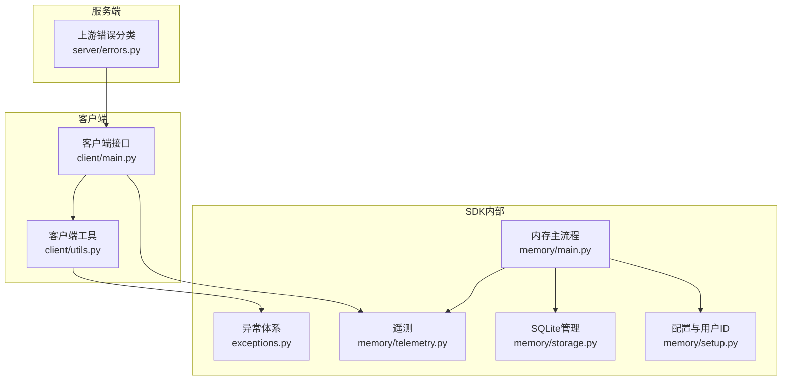
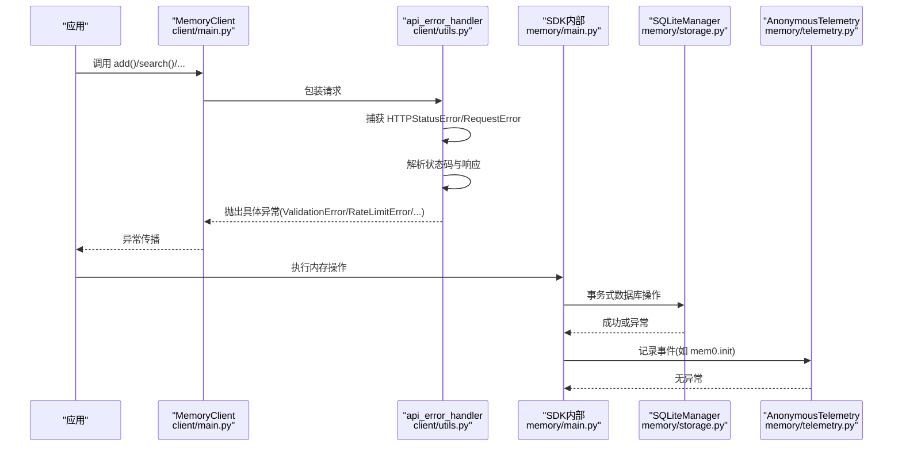
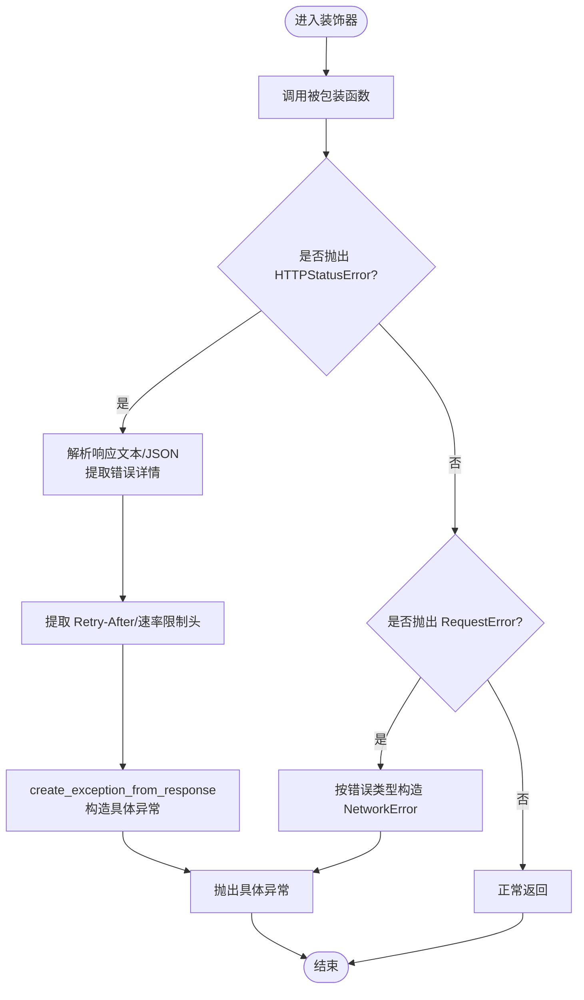
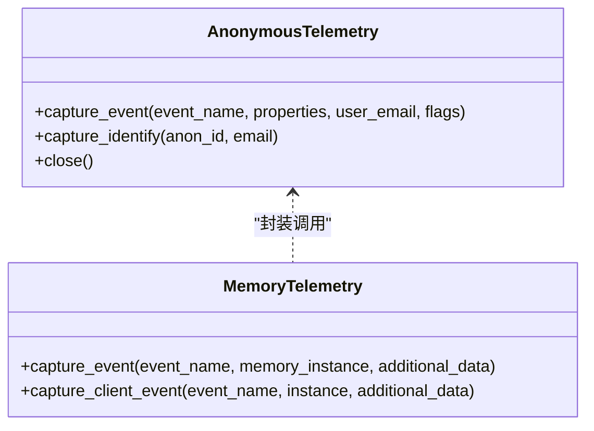
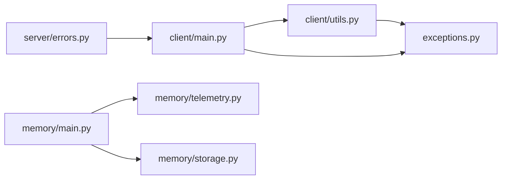

# 错误处理和调试

<cite>
**本文档引用的文件**
- [mem0/exceptions.py](file://mem0/exceptions.py)
- [mem0/client/utils.py](file://mem0/client/utils.py)
- [mem0/client/main.py](file://mem0/client/main.py)
- [mem0/memory/telemetry.py](file://mem0/memory/telemetry.py)
- [mem0/memory/main.py](file://mem0/memory/main.py)
- [mem0/memory/storage.py](file://mem0/memory/storage.py)
- [mem0/memory/setup.py](file://mem0/memory/setup.py)
- [server/errors.py](file://server/errors.py)
- [tests/test_client.py](file://tests/test_client.py)
- [tests/test_memory.py](file://tests/test_memory.py)
</cite>

## 目录
1. [简介](#简介)
2. [项目结构](#项目结构)
3. [核心组件](#核心组件)
4. [架构总览](#架构总览)
5. [详细组件分析](#详细组件分析)
6. [依赖关系分析](#依赖关系分析)
7. [性能考虑](#性能考虑)
8. [故障排除指南](#故障排除指南)
9. [结论](#结论)

## 简介
本文件系统性梳理 Mem0 Python SDK 的错误处理与调试机制，覆盖异常类型与错误码、异常捕获与处理最佳实践、日志记录、性能监控与遥测数据使用方法，并提供常见错误场景的诊断与解决方案，以及调试工具与技巧。

## 项目结构
围绕错误处理与调试的关键模块分布如下：
- 异常定义：mem0/exceptions.py 提供统一的结构化异常体系，支持错误码、建议与调试信息。
- 客户端错误处理：mem0/client/utils.py 提供 API 错误装饰器，将 HTTP/请求错误转换为具体异常；mem0/client/main.py 使用该装饰器保护所有对外 API 方法。
- 服务端上游错误分类：server/errors.py 将上游提供商错误进行分类与标准化响应。
- 遥测与日志：mem0/memory/telemetry.py 提供匿名遥测采集；mem0/memory/main.py 与 mem0/memory/storage.py 中广泛使用标准日志记录。
- 存储层健壮性：mem0/memory/storage.py 对数据库操作采用事务与回滚，确保一致性与可恢复性。
- 配置与用户标识：mem0/memory/setup.py 负责本地配置与用户 ID 管理，支撑遥测与事件关联。

图表来源
- [mem0/client/utils.py:1-116](file://mem0/client/utils.py#L1-L116)
- [mem0/client/main.py:1-800](file://mem0/client/main.py#L1-L800)
- [mem0/exceptions.py:1-485](file://mem0/exceptions.py#L1-L485)
- [mem0/memory/telemetry.py:1-242](file://mem0/memory/telemetry.py#L1-L242)
- [mem0/memory/main.py:1-800](file://mem0/memory/main.py#L1-L800)
- [mem0/memory/storage.py:1-348](file://mem0/memory/storage.py#L1-L348)
- [mem0/memory/setup.py:1-167](file://mem0/memory/setup.py#L1-L167)
- [server/errors.py:1-96](file://server/errors.py#L1-L96)

章节来源
- [mem0/client/utils.py:1-116](file://mem0/client/utils.py#L1-L116)
- [mem0/client/main.py:1-800](file://mem0/client/main.py#L1-L800)
- [mem0/exceptions.py:1-485](file://mem0/exceptions.py#L1-L485)
- [mem0/memory/telemetry.py:1-242](file://mem0/memory/telemetry.py#L1-L242)
- [mem0/memory/main.py:1-800](file://mem0/memory/main.py#L1-L800)
- [mem0/memory/storage.py:1-348](file://mem0/memory/storage.py#L1-L348)
- [mem0/memory/setup.py:1-167](file://mem0/memory/setup.py#L1-L167)
- [server/errors.py:1-96](file://server/errors.py#L1-L96)

## 核心组件
- 结构化异常体系：提供统一的错误码、建议与调试信息，便于程序化处理与用户提示。
- API 错误装饰器：自动解析 HTTP 状态码与响应内容，抛出对应的具体异常类型。
- 上游错误分类：服务端将第三方提供商错误归类为认证失败、限流、超时、连接不可用、请求错误、数据库不可用、向量存储不可用等。
- 遥测与日志：匿名遥测采集（PostHog），日志记录（含请求 ID 注入）。
- 数据库事务与回滚：SQLite 操作在事务中执行，失败时回滚并记录错误。
- 配置与用户标识：保障遥测与事件关联所需的用户身份。

章节来源
- [mem0/exceptions.py:34-485](file://mem0/exceptions.py#L34-L485)
- [mem0/client/utils.py:23-116](file://mem0/client/utils.py#L23-L116)
- [server/errors.py:12-76](file://server/errors.py#L12-L76)
- [mem0/memory/telemetry.py:76-242](file://mem0/memory/telemetry.py#L76-L242)
- [mem0/memory/storage.py:11-348](file://mem0/memory/storage.py#L11-L348)
- [mem0/memory/setup.py:56-167](file://mem0/memory/setup.py#L56-L167)

## 架构总览
下图展示从客户端调用到异常处理、日志与遥测的整体流程：

图表来源
- [mem0/client/main.py:172-800](file://mem0/client/main.py#L172-L800)
- [mem0/client/utils.py:23-116](file://mem0/client/utils.py#L23-L116)
- [mem0/memory/main.py:407-800](file://mem0/memory/main.py#L407-L800)
- [mem0/memory/storage.py:11-348](file://mem0/memory/storage.py#L11-L348)
- [mem0/memory/telemetry.py:76-242](file://mem0/memory/telemetry.py#L76-L242)

## 详细组件分析

### 异常类型与错误码
- 基础异常 MemoryError：提供 message、error_code、details、suggestion、debug_info 字段，便于结构化处理。
- 认证错误 AuthenticationError：用于 API Key 失败、令牌过期、缺少权限等。
- 速率限制 RateLimitError：包含 retry_after、limit、remaining、reset_time 等调试信息。
- 输入验证错误 ValidationError：参数缺失、格式不合法、字段非法等。
- 资源未找到 MemoryNotFoundError：访问不存在的记忆或实体。
- 网络错误 NetworkError：超时、DNS 失败、服务不可达等。
- 配置错误 ConfigurationError：缺少 API Key、主机地址无效、环境变量缺失等。
- 配额超限 MemoryQuotaExceededError：存储或使用配额超限。
- 数据损坏 MemoryCorruptionError：存储数据损坏。
- 向量检索 VectorSearchError：嵌入模型不可用、索引损坏、查询超时等。
- 缓存错误 CacheError：缓存读写失败。
- OSS 特定错误：VectorStoreError、EmbeddingError、LLMError、DatabaseError、DependencyError。
- HTTP 映射：HTTP_STATUS_TO_EXCEPTION 将 HTTP 状态码映射到具体异常类型。

章节来源
- [mem0/exceptions.py:34-485](file://mem0/exceptions.py#L34-L485)

### API 错误装饰器与异常捕获
- api_error_handler 装饰器：
  - 捕获 httpx.HTTPStatusError：解析响应文本与 JSON 错误详情，提取 Retry-After 与速率限制头，调用 create_exception_from_response 生成具体异常。
  - 捕获 httpx.RequestError：根据错误类型区分超时、连接失败等，抛出 NetworkError。
  - 统一记录错误日志，保留请求 URL、方法与状态码等调试信息。
- MemoryClient 方法均通过 @api_error_handler 保护，确保所有外部调用返回结构化异常。

图表来源
- [mem0/client/utils.py:23-116](file://mem0/client/utils.py#L23-L116)
- [mem0/client/main.py:172-800](file://mem0/client/main.py#L172-L800)

章节来源
- [mem0/client/utils.py:23-116](file://mem0/client/utils.py#L23-L116)
- [mem0/client/main.py:172-800](file://mem0/client/main.py#L172-L800)

### 服务端上游错误分类
- 分类依据：异常名称集合、状态码、异常类型（TimeoutError）、模块前缀（如 qdrant_client）等。
- 输出：标准化 code 与 detail，结合 X-Request-ID 返回，便于追踪。

章节来源
- [server/errors.py:12-96](file://server/errors.py#L12-L96)

### 日志记录与请求 ID 注入
- 请求 ID：通过 ContextVar 生成与注入，确保跨模块日志关联。
- 日志工厂：替换默认工厂，自动附加 request_id 字段。
- SDK 内部：大量使用 logging 记录错误、警告与调试信息，便于定位问题。

章节来源
- [server/errors.py:67-96](file://server/errors.py#L67-L96)
- [mem0/memory/main.py:600-700](file://mem0/memory/main.py#L600-L700)
- [mem0/memory/storage.py:96-126](file://mem0/memory/storage.py#L96-L126)

### 遥测与性能监控
- 匿名遥测：AnonymousTelemetry 支持采样（默认 0.1），生命周期事件（如 mem0.init、mem0.reset）始终发送。
- 事件采集：capture_event/capture_client_event 自动注入客户端版本、操作系统、处理器等属性。
- 禁用与降级：MEM0_TELEMETRY 可禁用；异常被捕获不干扰主流程。
- OSS 与 Hosted：OSS 使用带采样的匿名实例，Hosted 使用直连实例。

图表来源
- [mem0/memory/telemetry.py:76-242](file://mem0/memory/telemetry.py#L76-L242)

章节来源
- [mem0/memory/telemetry.py:76-242](file://mem0/memory/telemetry.py#L76-L242)

### 数据库与存储健壮性
- 事务与回滚：所有写操作在 BEGIN/COMMIT 包裹内执行，失败时 ROLLBACK 并记录错误。
- 表迁移与兼容：历史表结构迁移逻辑，保证向后兼容。
- 连接与锁：SQLiteManager 使用线程锁，避免并发冲突。

章节来源
- [mem0/memory/storage.py:11-348](file://mem0/memory/storage.py#L11-L348)

### 配置与用户标识
- 用户 ID：首次运行自动生成并写入 ~/.mem0/config.json，保障遥测可用。
- 别名识别：支持匿名 ID 与邮箱的一次性合并，避免重复上报。

章节来源
- [mem0/memory/setup.py:56-167](file://mem0/memory/setup.py#L56-L167)

## 依赖关系分析
- 客户端到异常：MemoryClient 方法经 api_error_handler 装饰，最终抛出 mem0.exceptions 中的具体异常。
- 异常到 HTTP：create_exception_from_response 将 HTTP 状态码映射到具体异常类型。
- 服务端到上游：server/errors.py 对上游异常进行分类，输出标准化响应。
- 遥测到日志：telemetry 与 logging 共同构成可观测性基础。

图表来源
- [mem0/client/main.py:172-800](file://mem0/client/main.py#L172-L800)
- [mem0/client/utils.py:23-116](file://mem0/client/utils.py#L23-L116)
- [mem0/exceptions.py:406-485](file://mem0/exceptions.py#L406-L485)
- [server/errors.py:12-76](file://server/errors.py#L12-L76)
- [mem0/memory/main.py:407-800](file://mem0/memory/main.py#L407-L800)
- [mem0/memory/telemetry.py:76-242](file://mem0/memory/telemetry.py#L76-L242)
- [mem0/memory/storage.py:11-348](file://mem0/memory/storage.py#L11-L348)

章节来源
- [mem0/client/main.py:172-800](file://mem0/client/main.py#L172-L800)
- [mem0/client/utils.py:23-116](file://mem0/client/utils.py#L23-L116)
- [mem0/exceptions.py:406-485](file://mem0/exceptions.py#L406-L485)
- [server/errors.py:12-76](file://server/errors.py#L12-L76)
- [mem0/memory/main.py:407-800](file://mem0/memory/main.py#L407-L800)
- [mem0/memory/telemetry.py:76-242](file://mem0/memory/telemetry.py#L76-L242)
- [mem0/memory/storage.py:11-348](file://mem0/memory/storage.py#L11-L348)

## 性能考虑
- 遥测采样：默认采样率 0.1，可通过 MEM0_TELEMETRY_SAMPLE_RATE 调整；生命周期事件不受采样影响。
- 事件降噪：异常捕获与日志记录不会抛出异常，避免影响主流程。
- 数据库事务：批量写入采用事务，减少碎片与回滚成本。
- 警告与调试：大量使用 WARNING/DEBUG 级别日志，便于性能瓶颈定位与问题排查。

## 故障排除指南

### 常见异常与处理策略
- 认证失败（401/403）
  - 现象：AuthenticationError。
  - 排查：检查 API Key 是否正确、是否过期、权限是否足够。
  - 处理：重新配置密钥或提升权限。
- 速率限制（429）
  - 现象：RateLimitError，包含 retry_after 等调试信息。
  - 排查：查看 Retry-After 与速率限制头。
  - 处理：指数退避重试，降低请求频率。
- 请求超时/连接失败（408/502/503/504）
  - 现象：NetworkError。
  - 排查：网络连通性、DNS、代理、防火墙。
  - 处理：重试、检查网络、调整超时设置。
- 输入验证错误（400/422/409）
  - 现象：ValidationError。
  - 排查：参数格式、必填字段、元数据结构。
  - 处理：修正输入参数或遵循 SDK 类型约束。
- 资源未找到（404）
  - 现象：MemoryNotFoundError。
  - 排查：确认资源 ID 是否存在、过滤条件是否正确。
  - 处理：先查询再操作，或使用更精确的 filters。
- 配额超限（413）
  - 现象：MemoryQuotaExceededError。
  - 排查：当前用量与配额上限。
  - 处理：清理旧数据或升级计划。
- 数据库错误（5xx）
  - 现象：DatabaseError。
  - 排查：SQLite 连接、磁盘空间、并发写入。
  - 处理：重启服务、释放空间、优化并发。
- 向量存储/嵌入/LLM 错误（OSS）
  - 现象：VectorStoreError/EmbeddingError/LLMError。
  - 排查：模型可用性、向量维度、存储连接。
  - 处理：更换模型/存储、检查配置。

章节来源
- [mem0/exceptions.py:93-485](file://mem0/exceptions.py#L93-L485)
- [mem0/client/utils.py:39-113](file://mem0/client/utils.py#L39-L113)
- [server/errors.py:28-76](file://server/errors.py#L28-L76)

### 调试工具与技巧
- 启用详细日志：在应用侧配置 logging，观察请求 ID 关联的日志。
- 捕获异常并打印：利用异常的 message、error_code、suggestion、debug_info 字段快速定位。
- 遥测开关：MEM0_TELEMETRY 控制遥测开关；MEM0_TELEMETRY_SAMPLE_RATE 控制采样率。
- 配置校验：确认 ~/.mem0/config.json 存在且包含 user_id。
- 单元测试参考：通过 tests/test_client.py 与 tests/test_memory.py 中的断言与模拟，验证参数校验与错误路径。

章节来源
- [mem0/memory/telemetry.py:14-48](file://mem0/memory/telemetry.py#L14-L48)
- [mem0/memory/setup.py:56-76](file://mem0/memory/setup.py#L56-L76)
- [tests/test_client.py:26-210](file://tests/test_client.py#L26-L210)
- [tests/test_memory.py:370-486](file://tests/test_memory.py#L370-L486)

## 结论
Mem0 Python SDK 通过结构化的异常体系、统一的 API 错误装饰器、服务端上游错误分类、完善的日志与遥测机制，以及健壮的数据库事务，构建了清晰、可追踪、易维护的错误处理与调试框架。建议在生产环境中：
- 明确异常分支处理策略（重试、降级、告警）。
- 合理设置 MEM0_TELEMETRY 与采样率，平衡可观测性与性能。
- 在关键路径上记录请求 ID，串联日志与遥测事件。
- 使用单元测试覆盖边界条件与错误路径，确保异常行为可预期。