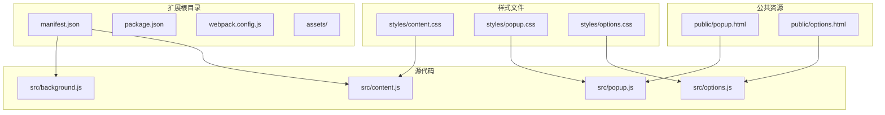
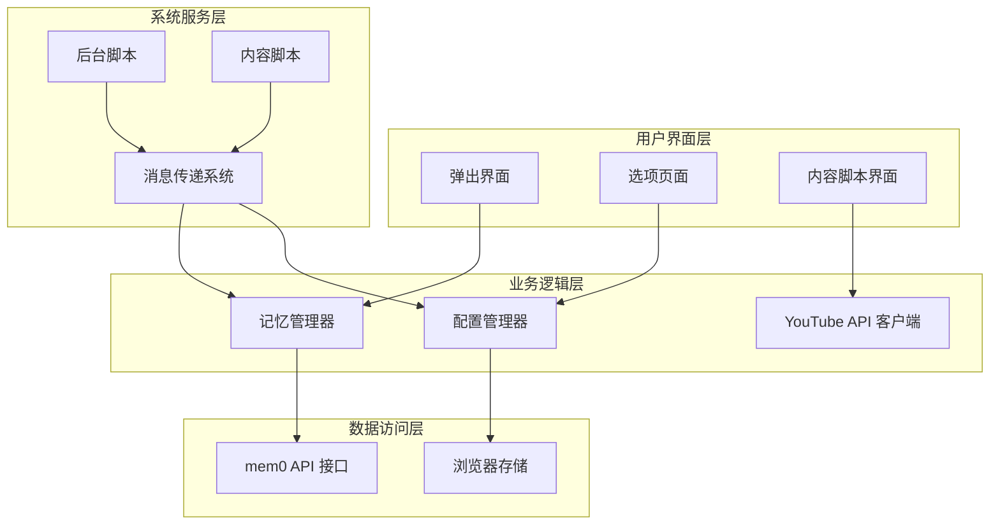
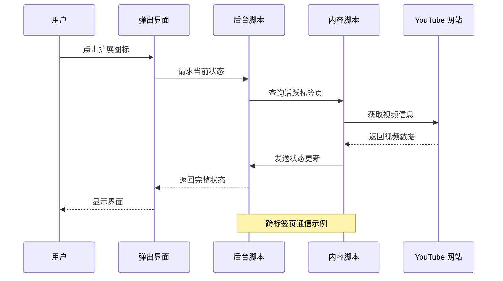
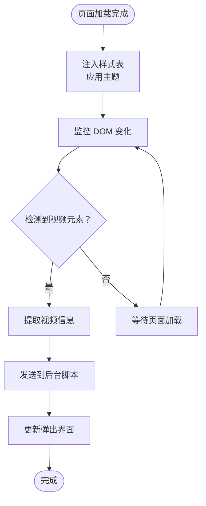
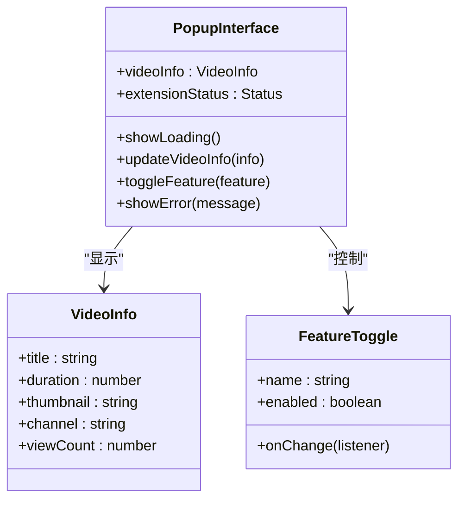
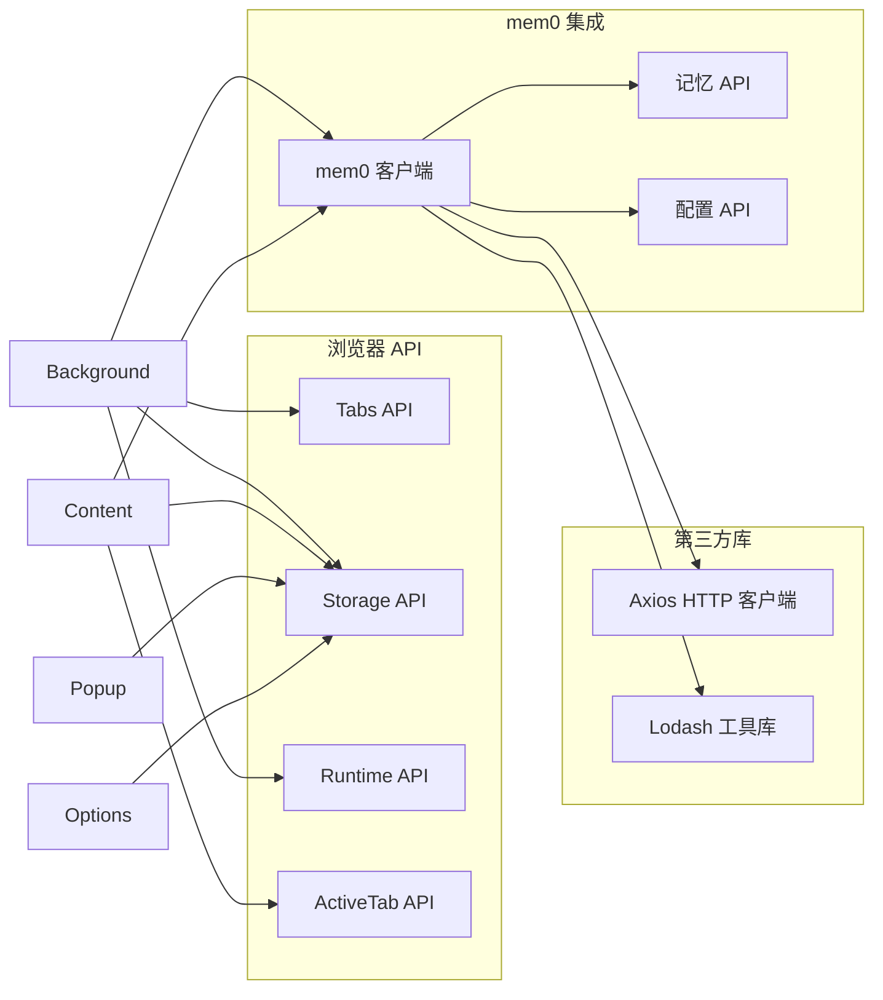

# Chrome 扩展集成

<cite>
**本文档引用的文件**
- [manifest.json](file://examples/yt-assistant-chrome/manifest.json)
- [background.js](file://examples/yt-assistant-chrome/src/background.js)
- [content.js](file://examples/yt-assistant-chrome/src/content.js)
- [popup.js](file://examples/yt-assistant-chrome/src/popup.js)
- [options.js](file://examples/yt-assistant-chrome/src/options.js)
- [popup.html](file://examples/yt-assistant-chrome/public/popup.html)
- [options.html](file://examples/yt-assistant-chrome/public/options.html)
- [content.css](file://examples/yt-assistant-chrome/styles/content.css)
- [popup.css](file://examples/yt-assistant-chrome/styles/popup.css)
- [options.css](file://examples/yt-assistant-chrome/styles/options.css)
- [README.md](file://examples/yt-assistant-chrome/README.md)
- [package.json](file://examples/yt-assistant-chrome/package.json)
- [webpack.config.js](file://examples/yt-assistant-chrome/webpack.config.js)
</cite>

## 目录
1. [简介](#简介)
2. [项目结构](#项目结构)
3. [核心组件](#核心组件)
4. [架构概览](#架构概览)
5. [详细组件分析](#详细组件分析)
6. [依赖关系分析](#依赖关系分析)
7. [性能考虑](#性能考虑)
8. [故障排除指南](#故障排除指南)
9. [结论](#结论)

## 简介

YouTube 助手 Chrome 扩展是一个基于 mem0 的智能助手扩展，旨在为 YouTube 视频提供增强的交互体验。该扩展通过集成 mem0 的记忆管理功能，能够记住用户的偏好设置、历史行为和上下文信息，从而提供个性化的 YouTube 使用体验。

该扩展采用标准的 Chrome Extension 架构，包含后台脚本、内容脚本、弹出界面和选项页面等组件。通过浏览器 API 实现与 YouTube 网站的深度集成，并利用跨标签页通信机制实现数据共享和状态同步。

## 项目结构

YouTube 助手扩展遵循 Chrome Extension 的标准目录结构，主要包含以下组件：

**图表来源**
- [manifest.json](file://examples/yt-assistant-chrome/manifest.json)
- [background.js](file://examples/yt-assistant-chrome/src/background.js)
- [content.js](file://examples/yt-assistant-chrome/src/content.js)
- [popup.js](file://examples/yt-assistant-chrome/src/popup.js)
- [options.js](file://examples/yt-assistant-chrome/src/options.js)

**章节来源**
- [manifest.json](file://examples/yt-assistant-chrome/manifest.json)
- [package.json](file://examples/yt-assistant-chrome/package.json)
- [README.md](file://examples/yt-assistant-chrome/README.md)

## 核心组件

### 后台脚本 (Background Script)

后台脚本是扩展的核心控制中心，负责处理扩展的生命周期事件、管理持久状态和协调各组件间的通信。它监听浏览器事件，维护扩展的全局状态，并为其他组件提供统一的接口。

### 内容脚本 (Content Script)

内容脚本在 YouTube 页面上下文中运行，负责与网页元素交互、提取视频信息和用户行为数据。它们通过消息传递机制与后台脚本通信，实现数据的双向交换。

### 弹出界面 (Popup Interface)

弹出界面提供用户直接交互的入口点，显示当前的扩展状态、快捷操作和配置选项。它通过消息传递与后台脚本通信，获取实时的 YouTube 视频信息和用户偏好设置。

### 选项页面 (Options Page)

选项页面允许用户自定义扩展的行为和外观，包括主题设置、功能开关和高级配置。所有用户配置都会被安全地存储在浏览器的存储 API 中。

**章节来源**
- [background.js](file://examples/yt-assistant-chrome/src/background.js)
- [content.js](file://examples/yt-assistant-chrome/src/content.js)
- [popup.js](file://examples/yt-assistant-chrome/src/popup.js)
- [options.js](file://examples/yt-assistant-chrome/src/options.js)

## 架构概览

YouTube 助手扩展采用分层架构设计，确保各组件职责清晰且松耦合：

**图表来源**
- [background.js](file://examples/yt-assistant-chrome/src/background.js)
- [content.js](file://examples/yt-assistant-chrome/src/content.js)
- [popup.js](file://examples/yt-assistant-chrome/src/popup.js)
- [options.js](file://examples/yt-assistant-chrome/src/options.js)

## 详细组件分析

### 后台脚本详细分析

后台脚本作为扩展的中枢神经系统，承担着以下关键职责：

#### 生命周期管理
- 监听扩展安装和更新事件
- 管理持久化状态和配置
- 处理浏览器启动时的初始化任务

#### 消息路由中心
- 接收来自各个组件的消息
- 路由消息到相应的处理器
- 维护消息队列和优先级

#### 状态同步协调者
- 协调多个标签页间的状态同步
- 处理并发访问冲突
- 维护最终一致性

**图表来源**
- [background.js](file://examples/yt-assistant-chrome/src/background.js)
- [content.js](file://examples/yt-assistant-chrome/src/content.js)
- [popup.js](file://examples/yt-assistant-chrome/src/popup.js)

#### 错误处理机制
后台脚本实现了完善的错误处理策略：
- 异常捕获和恢复
- 重试机制和退避算法
- 用户友好的错误提示
- 日志记录和诊断信息

**章节来源**
- [background.js](file://examples/yt-assistant-chrome/src/background.js)

### 内容脚本详细分析

内容脚本专门设计用于 YouTube 网站的上下文环境中，具有以下特性：

#### DOM 操作策略
- 监控页面变化和动态内容加载
- 安全地注入样式和脚本
- 处理异步内容的延迟加载

#### 数据提取和处理
- 解析视频元数据（标题、描述、时长）
- 提取用户交互行为数据
- 格式化和标准化数据结构

#### 事件监听机制
- 监听播放状态变化
- 捕获用户操作事件
- 响应页面导航事件

**图表来源**
- [content.js](file://examples/yt-assistant-chrome/src/content.js)
- [content.css](file://examples/yt-assistant-chrome/styles/content.css)

**章节来源**
- [content.js](file://examples/yt-assistant-chrome/src/content.js)
- [content.css](file://examples/yt-assistant-chrome/styles/content.css)

### 弹出界面详细分析

弹出界面提供直观的用户交互体验，采用响应式设计确保在不同屏幕尺寸下的良好表现。

#### 界面布局设计
- 顶部显示当前视频信息
- 中部提供快捷操作按钮
- 底部显示扩展状态和版本信息

#### 交互模式
- 实时状态更新
- 加载状态指示
- 错误状态处理

#### 数据可视化
- 进度条显示学习进度
- 图标状态表示功能启用状态
- 切换开关控制功能开关

**图表来源**
- [popup.js](file://examples/yt-assistant-chrome/src/popup.js)
- [popup.html](file://examples/yt-assistant-chrome/public/popup.html)
- [popup.css](file://examples/yt-assistant-chrome/styles/popup.css)

**章节来源**
- [popup.js](file://examples/yt-assistant-chrome/src/popup.js)
- [popup.html](file://examples/yt-assistant-chrome/public/popup.html)
- [popup.css](file://examples/yt-assistant-chrome/styles/popup.css)

### 选项页面详细分析

选项页面提供完整的配置管理功能，支持用户自定义扩展的各种行为。

#### 配置分类管理
- 基础设置：主题选择、功能开关
- 高级设置：API 密钥、内存参数
- 隐私设置：数据收集、存储选项

#### 表单验证机制
- 输入格式验证
- 依赖关系检查
- 实时反馈和错误提示

#### 状态持久化
- 自动保存配置更改
- 支持导入导出配置
- 版本兼容性处理

**章节来源**
- [options.js](file://examples/yt-assistant-chrome/src/options.js)
- [options.html](file://examples/yt-assistant-chrome/public/options.html)
- [options.css](file://examples/yt-assistant-chrome/styles/options.css)

## 依赖关系分析

扩展的依赖关系相对简单，主要依赖于浏览器提供的标准 API 和 mem0 的客户端库。

**图表来源**
- [manifest.json](file://examples/yt-assistant-chrome/manifest.json)
- [background.js](file://examples/yt-assistant-chrome/src/background.js)
- [content.js](file://examples/yt-assistant-chrome/src/content.js)

**章节来源**
- [manifest.json](file://examples/yt-assistant-chrome/manifest.json)
- [package.json](file://examples/yt-assistant-chrome/package.json)

## 性能考虑

### 内存管理
- 及时清理不再使用的事件监听器
- 合理使用缓存机制避免重复计算
- 监控内存使用情况并进行优化

### 网络请求优化
- 批量处理 API 请求减少网络开销
- 实现请求去重和缓存策略
- 使用连接池管理长连接

### UI 响应性
- 将耗时操作移至后台线程
- 实现虚拟滚动处理大量数据
- 使用防抖和节流优化高频操作

## 故障排除指南

### 常见问题诊断

#### 扩展无法加载
1. 检查 manifest.json 的语法正确性
2. 验证所有文件路径的有效性
3. 确认权限声明的完整性

#### 内容脚本不工作
1. 验证匹配模式是否正确
2. 检查 CSP 设置是否阻止脚本执行
3. 确认脚本注入时机的正确性

#### 跨标签页通信失败
1. 检查消息格式和序列化方式
2. 验证消息监听器的注册状态
3. 确认标签页权限和隔离设置

### 调试工具使用

#### 浏览器开发者工具
- 使用扩展页面检查后台脚本状态
- 通过控制台监控 JavaScript 错误
- 利用网络面板分析 API 请求

#### 日志记录策略
- 实现分级日志系统（错误、警告、信息）
- 区分用户可读消息和调试信息
- 确保敏感信息不会被意外记录

**章节来源**
- [background.js](file://examples/yt-assistant-chrome/src/background.js)
- [content.js](file://examples/yt-assistant-chrome/src/content.js)

## 结论

YouTube 助手 Chrome 扩展成功展示了如何将 mem0 的智能记忆功能无缝集成到浏览器环境中。通过合理的架构设计和组件分离，该扩展提供了稳定、高效的 YouTube 增强体验。

扩展的主要优势包括：
- 清晰的分层架构便于维护和扩展
- 完善的错误处理和状态管理机制
- 用户友好的界面设计和交互体验
- 高效的跨组件通信和数据同步

未来可以考虑的功能增强方向：
- 添加更多 YouTube 功能的智能辅助
- 实现更精细的用户偏好学习
- 优化性能和资源使用效率
- 扩展到其他视频平台的支持