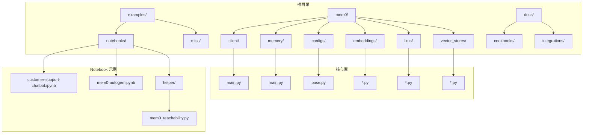
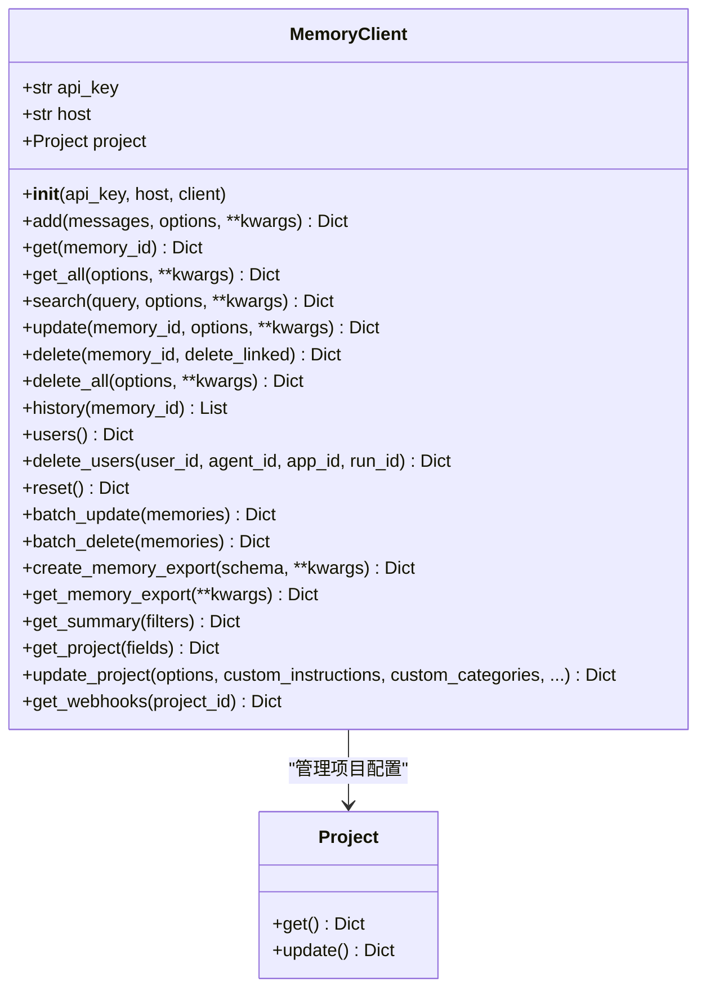
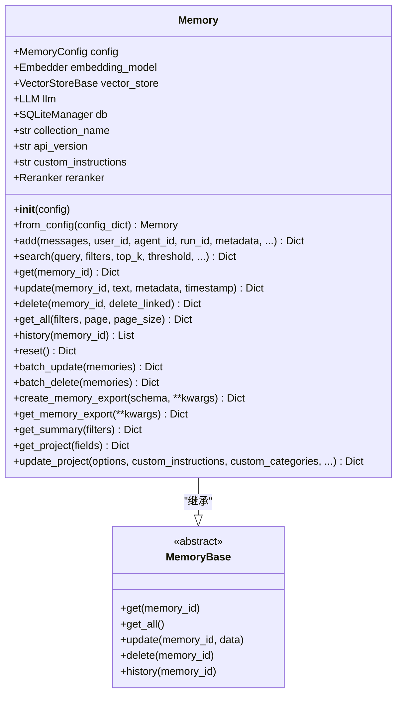
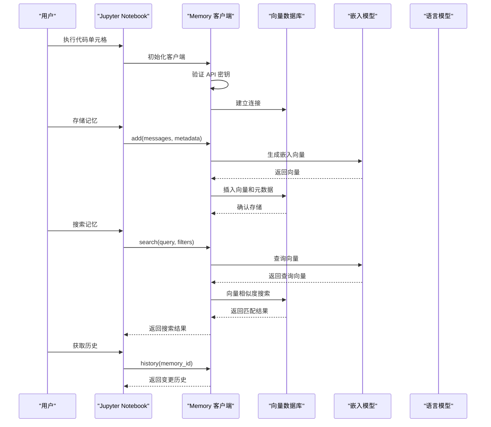
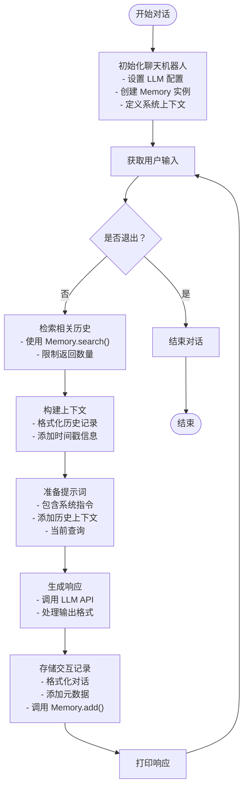
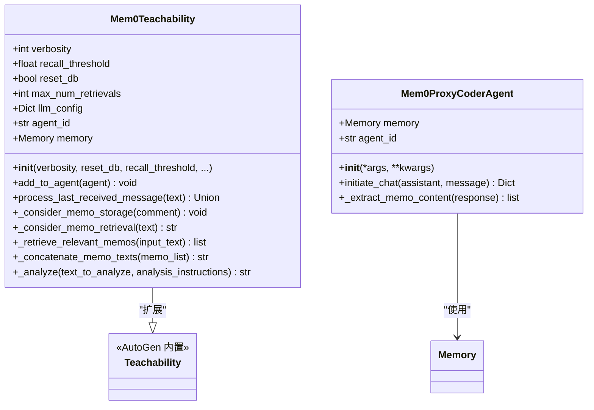
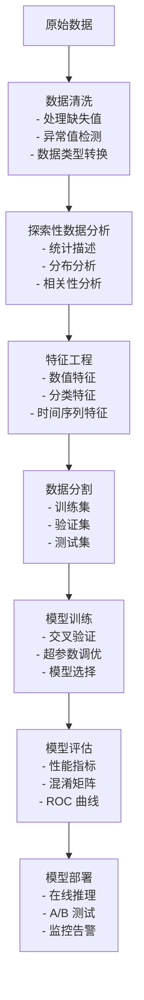
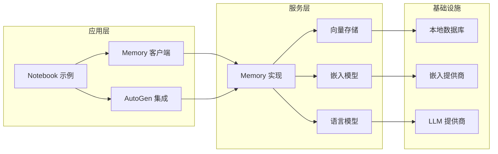
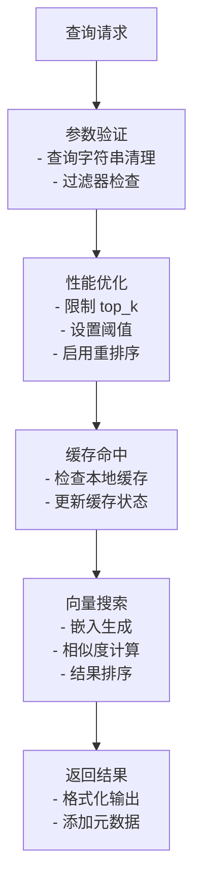

# Jupyter Notebook 示例

<cite>
**本文档引用的文件**
- [customer-support-chatbot.ipynb](file://examples/notebooks/customer-support-chatbot.ipynb)
- [mem0-autogen.ipynb](file://examples/notebooks/mem0-autogen.ipynb)
- [mem0_teachability.py](file://examples/notebooks/helper/mem0_teachability.py)
- [__init__.py](file://mem0/__init__.py)
- [main.py](file://mem0/client/main.py)
- [main.py](file://mem0/memory/main.py)
- [base.py](file://mem0/memory/base.py)
- [base.py](file://mem0/configs/base.py)
</cite>

## 目录
1. [简介](#简介)
2. [项目结构](#项目结构)
3. [核心组件](#核心组件)
4. [架构概览](#架构概览)
5. [详细组件分析](#详细组件分析)
6. [依赖关系分析](#依赖关系分析)
7. [性能考虑](#性能考虑)
8. [故障排除指南](#故障排除指南)
9. [结论](#结论)
10. [附录](#附录)

## 简介

本文件为 mem0 在 Jupyter Notebook 环境中的集成示例文档，重点展示如何在交互式开发环境中使用 mem0 进行数据分析和机器学习项目。文档提供了完整的客户支持聊天机器人实现示例，涵盖数据预处理、模型训练和评估流程，并总结了交互式开发、可视化和实验管理的最佳实践。

mem0 是一个开源的记忆管理系统，支持本地向量数据库存储、多提供商嵌入模型、重排序器以及与多种大语言模型（LLM）的集成。通过 Jupyter Notebook，用户可以进行快速原型设计、数据探索、模型训练和结果验证。

## 项目结构

mem0 项目采用模块化设计，主要包含以下关键目录：

**图表来源**
- [customer-support-chatbot.ipynb:1-226](file://examples/notebooks/customer-support-chatbot.ipynb#L1-L226)
- [mem0-autogen.ipynb:1-800](file://examples/notebooks/mem0-autogen.ipynb#L1-L800)
- [mem0_teachability.py:1-173](file://examples/notebooks/helper/mem0_teachability.py#L1-L173)

**章节来源**
- [customer-support-chatbot.ipynb:1-226](file://examples/notebooks/customer-support-chatbot.ipynb#L1-L226)
- [mem0-autogen.ipynb:1-800](file://examples/notebooks/mem0-autogen.ipynb#L1-L800)

## 核心组件

### Memory 客户端类

Memory 客户端是 mem0 的核心接口，提供内存的增删改查操作：

**图表来源**
- [main.py:71-809](file://mem0/client/main.py#L71-L809)

### Memory 实现类

Memory 类提供本地内存管理功能，支持向量存储和实体提取：

**图表来源**
- [main.py:407-800](file://mem0/memory/main.py#L407-L800)
- [base.py:4-64](file://mem0/memory/base.py#L4-L64)

**章节来源**
- [main.py:71-809](file://mem0/client/main.py#L71-L809)
- [main.py:407-800](file://mem0/memory/main.py#L407-L800)
- [base.py:4-64](file://mem0/memory/base.py#L4-L64)

## 架构概览

mem0 在 Jupyter Notebook 中的典型工作流程如下：

**图表来源**
- [main.py:172-333](file://mem0/client/main.py#L172-L333)
- [main.py:653-759](file://mem0/memory/main.py#L653-L759)

## 详细组件分析

### 客户端支持聊天机器人

该示例展示了如何构建一个完整的客户支持聊天机器人系统：

**图表来源**
- [customer-support-chatbot.ipynb:26-113](file://examples/notebooks/customer-support-chatbot.ipynb#L26-L113)

#### 关键实现要点

1. **配置管理**：使用 Anthropic Claude 作为 LLM 提供商，配置温度、最大令牌数等参数
2. **记忆存储**：将用户和助手的对话作为记忆存储，包含时间戳和类型元数据
3. **上下文检索**：基于查询语句检索相关的历史对话，增强响应的相关性
4. **错误处理**：使用警告机制提示 API 版本兼容性问题

**章节来源**
- [customer-support-chatbot.ipynb:26-113](file://examples/notebooks/customer-support-chatbot.ipynb#L26-L113)

### AutoGen 集成示例

该示例演示了 mem0 与 AutoGen 框架的深度集成：

**图表来源**
- [mem0_teachability.py:19-173](file://examples/notebooks/helper/mem0_teachability.py#L19-L173)

#### 三种集成模式

1. **直接提示注入**：通过检索相关记忆直接修改提示词
2. **UserProxyAgent 方式**：自定义代理类，在聊天前后自动管理记忆
3. **Teachability 扩展**：基于 AutoGen Teachability 功能，实现长期记忆能力

**章节来源**
- [mem0-autogen.ipynb:204-520](file://examples/notebooks/mem0-autogen.ipynb#L204-L520)
- [mem0_teachability.py:19-173](file://examples/notebooks/helper/mem0_teachability.py#L19-L173)

### 数据预处理和特征工程

在 Jupyter Notebook 中进行数据分析时，建议遵循以下最佳实践：

## 依赖关系分析

### 核心依赖关系

**图表来源**
- [main.py:1-800](file://mem0/client/main.py#L1-L800)
- [main.py:1-800](file://mem0/memory/main.py#L1-L800)

### 版本兼容性

示例代码显示了对新版本 API 的兼容性警告：

| 警告类型 | 描述 | 影响范围 |
|---------|------|----------|
| add API 输出格式 | 使用 v1.1+ 格式需要设置 api_version | 存储操作 |
| search API 输出格式 | 使用 v1.1+ 格式需要设置 api_version | 检索操作 |
| get_all API 输出格式 | 使用 v1.1+ 格式需要设置 api_version | 列表操作 |

**章节来源**
- [customer-support-chatbot.ipynb:132-136](file://examples/notebooks/customer-support-chatbot.ipynb#L132-L136)
- [mem0-autogen.ipynb:186-190](file://examples/notebooks/mem0-autogen.ipynb#L186-L190)

## 性能考虑

### 内存管理优化

1. **批量操作**：使用 `batch_update` 和 `batch_delete` 减少网络往返
2. **分页查询**：合理设置 `page_size` 参数控制内存使用
3. **缓存策略**：利用 LLM 和嵌入模型的缓存机制
4. **向量维度**：根据应用场景选择合适的嵌入维度

### 搜索性能优化

## 故障排除指南

### 常见问题及解决方案

1. **API 密钥认证失败**
   - 检查环境变量设置
   - 验证 API 密钥有效性
   - 确认网络连接状态

2. **向量存储连接异常**
   - 检查数据库服务状态
   - 验证连接参数配置
   - 查看磁盘空间和权限

3. **内存不足错误**
   - 减少批量操作大小
   - 清理不必要的内存缓存
   - 优化查询参数

4. **版本兼容性警告**
   - 更新到最新版本
   - 设置正确的 api_version
   - 检查迁移指南

**章节来源**
- [main.py:149-171](file://mem0/client/main.py#L149-L171)

## 结论

mem0 为 Jupyter Notebook 环境提供了强大的记忆管理能力，特别适合以下场景：

1. **交互式数据分析**：结合向量存储进行快速数据探索
2. **机器学习项目**：管理实验历史和最佳实践
3. **智能客服系统**：构建具有上下文记忆的对话机器人
4. **代码辅助工具**：集成 AutoGen 实现智能代码生成

通过合理的配置和最佳实践，mem0 可以显著提升 Jupyter Notebook 开发效率，实现从数据探索到模型部署的完整工作流。

## 附录

### 快速开始指南

1. 安装依赖包
2. 配置 API 密钥
3. 初始化 Memory 客户端
4. 开始存储和检索记忆
5. 集成到现有工作流

### 最佳实践清单

- 使用明确的实体标识符（user_id, agent_id, run_id）
- 合理设置元数据字段
- 定期清理过期记忆
- 监控 API 使用配额
- 实施备份策略