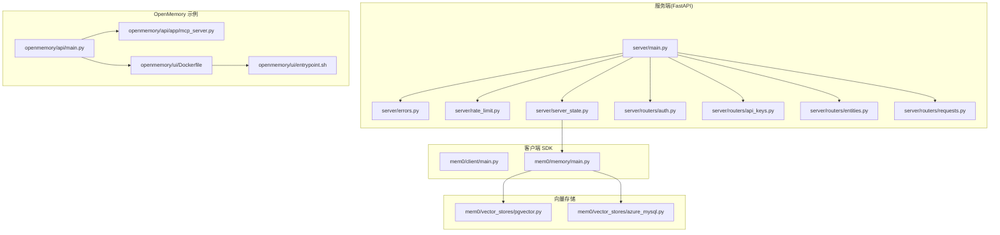
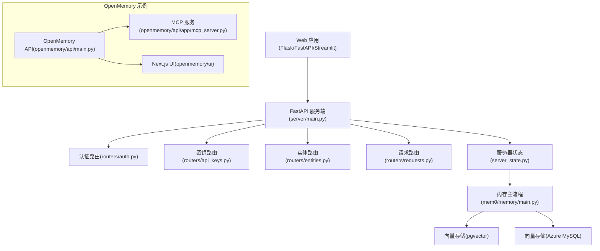
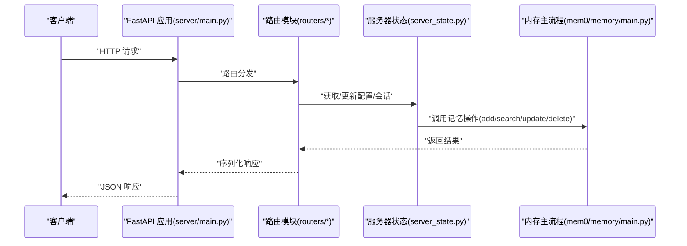
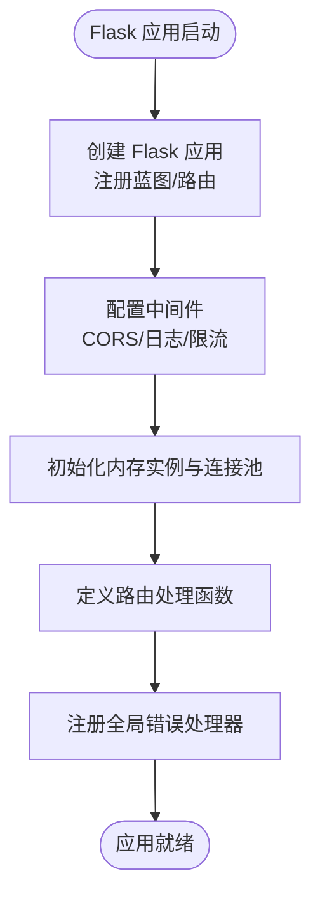
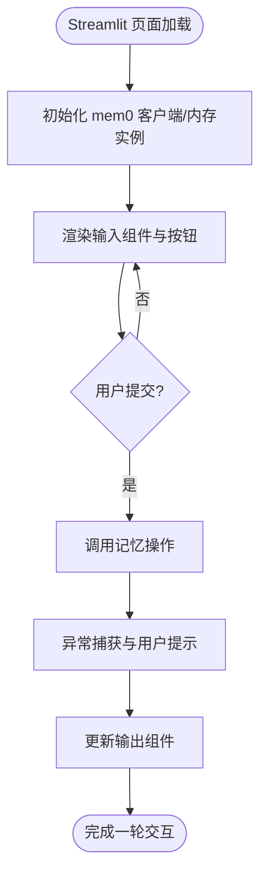
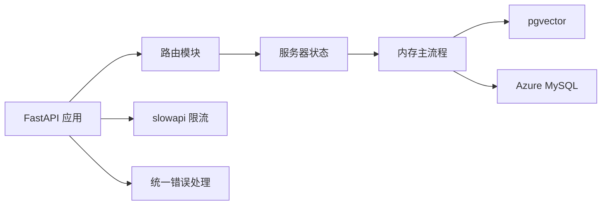

# Web 框架集成

<cite>
**本文引用的文件**
- [server/main.py](file://server/main.py)
- [server/errors.py](file://server/errors.py)
- [server/rate_limit.py](file://server/rate_limit.py)
- [server/server_state.py](file://server/server_state.py)
- [server/models.py](file://server/models.py)
- [server/routers/api_keys.py](file://server/routers/api_keys.py)
- [server/routers/auth.py](file://server/routers/auth.py)
- [server/routers/entities.py](file://server/routers/entities.py)
- [server/routers/requests.py](file://server/routers/requests.py)
- [openmemory/api/main.py](file://openmemory/api/main.py)
- [openmemory/api/app/mcp_server.py](file://openmemory/api/app/mcp_server.py)
- [openmemory/ui/Dockerfile](file://openmemory/ui/Dockerfile)
- [openmemory/ui/entrypoint.sh](file://openmemory/ui/entrypoint.sh)
- [openmemory/api/requirements.txt](file://openmemory/api/requirements.txt)
- [mem0/client/main.py](file://mem0/client/main.py)
- [mem0/memory/main.py](file://mem0/memory/main.py)
- [mem0/vector_stores/pgvector.py](file://mem0/vector_stores/pgvector.py)
- [mem0/vector_stores/azure_mysql.py](file://mem0/vector_stores/azure_mysql.py)
- [docs/open-source/features/async-memory.mdx](file://docs/open-source/features/async-memory.mdx)
</cite>

## 目录
1. [简介](#简介)
2. [项目结构](#项目结构)
3. [核心组件](#核心组件)
4. [架构总览](#架构总览)
5. [详细组件分析](#详细组件分析)
6. [依赖关系分析](#依赖关系分析)
7. [性能考量](#性能考量)
8. [故障排查指南](#故障排查指南)
9. [结论](#结论)
10. [附录](#附录)

## 简介
本文件面向希望在 Python Web 框架中集成 mem0 的开发者，系统性说明如何将 mem0 的记忆（Memory）能力与 FastAPI、Flask、Streamlit 等主流框架对接。内容覆盖路由配置、中间件设置、错误处理、异步与并发控制、资源管理以及生产部署最佳实践。文档中的实现细节均基于仓库现有代码进行归纳总结。

## 项目结构
本仓库包含服务端（FastAPI）、前端 UI、向量存储适配器、客户端 SDK 以及若干集成示例。与 Web 框架集成最相关的模块集中在以下位置：
- 服务端入口与中间件：server/main.py、server/errors.py、server/rate_limit.py、server/server_state.py
- 路由模块：server/routers/*
- 客户端 SDK：mem0/client/*、mem0/memory/*
- 向量存储适配：mem0/vector_stores/*
- OpenMemory 前后端示例：openmemory/api/*、openmemory/ui/*

图表来源
- [server/main.py:1-44](file://server/main.py#L1-L44)
- [server/errors.py:1-31](file://server/errors.py#L1-L31)
- [server/rate_limit.py](file://server/rate_limit.py)
- [server/server_state.py](file://server/server_state.py)
- [server/routers/auth.py](file://server/routers/auth.py)
- [server/routers/api_keys.py](file://server/routers/api_keys.py)
- [server/routers/entities.py](file://server/routers/entities.py)
- [server/routers/requests.py](file://server/routers/requests.py)
- [openmemory/api/main.py:8-12](file://openmemory/api/main.py#L8-L12)
- [openmemory/api/app/mcp_server.py:568-572](file://openmemory/api/app/mcp_server.py#L568-L572)
- [openmemory/ui/Dockerfile:1-52](file://openmemory/ui/Dockerfile#L1-L52)
- [openmemory/ui/entrypoint.sh:1-20](file://openmemory/ui/entrypoint.sh#L1-L20)
- [mem0/client/main.py](file://mem0/client/main.py)
- [mem0/memory/main.py](file://mem0/memory/main.py)
- [mem0/vector_stores/pgvector.py:186-218](file://mem0/vector_stores/pgvector.py#L186-L218)
- [mem0/vector_stores/azure_mysql.py:125-157](file://mem0/vector_stores/azure_mysql.py#L125-L157)

章节来源
- [server/main.py:1-44](file://server/main.py#L1-L44)
- [openmemory/api/main.py:8-12](file://openmemory/api/main.py#L8-L12)

## 核心组件
- 服务端应用与中间件
  - 应用初始化：加载环境变量、安装请求 ID 日志、配置日志格式、注册 CORS、注册路由等。
  - 错误处理：统一异常分类与响应、上游错误封装、请求 ID 上下文注入。
  - 速率限制：基于 slowapi 的限流策略与超限处理。
  - 服务器状态：内存实例初始化、会话工厂设置、当前配置读取与更新。
- 路由模块
  - 认证、API 密钥、实体、请求记录等路由模块按功能拆分，便于扩展与维护。
- 客户端 SDK 与内存主流程
  - 客户端入口与类型定义；内存主流程负责添加、搜索、更新、删除等操作。
- 向量存储适配
  - PostgreSQL(pgvector) 连接池与集合确保；MySQL(Azure) 连接池与 SSL 配置。
- OpenMemory 示例
  - FastAPI 入口与分页中间件；MCP 服务挂载到 FastAPI；UI 使用 Next.js 并通过容器镜像部署。

章节来源
- [server/main.py:1-44](file://server/main.py#L1-L44)
- [server/errors.py:12-31](file://server/errors.py#L12-L31)
- [server/rate_limit.py](file://server/rate_limit.py)
- [server/server_state.py](file://server/server_state.py)
- [server/routers/auth.py](file://server/routers/auth.py)
- [server/routers/api_keys.py](file://server/routers/api_keys.py)
- [server/routers/entities.py](file://server/routers/entities.py)
- [server/routers/requests.py](file://server/routers/requests.py)
- [mem0/client/main.py](file://mem0/client/main.py)
- [mem0/memory/main.py](file://mem0/memory/main.py)
- [mem0/vector_stores/pgvector.py:186-218](file://mem0/vector_stores/pgvector.py#L186-L218)
- [mem0/vector_stores/azure_mysql.py:125-157](file://mem0/vector_stores/azure_mysql.py#L125-L157)
- [openmemory/api/main.py:8-12](file://openmemory/api/main.py#L8-L12)
- [openmemory/api/app/mcp_server.py:568-572](file://openmemory/api/app/mcp_server.py#L568-L572)

## 架构总览
下图展示了服务端与客户端、向量存储之间的交互关系，以及 OpenMemory 示例的前后端协同方式。

图表来源
- [server/main.py:1-44](file://server/main.py#L1-L44)
- [server/routers/auth.py](file://server/routers/auth.py)
- [server/routers/api_keys.py](file://server/routers/api_keys.py)
- [server/routers/entities.py](file://server/routers/entities.py)
- [server/routers/requests.py](file://server/routers/requests.py)
- [server/server_state.py](file://server/server_state.py)
- [mem0/memory/main.py](file://mem0/memory/main.py)
- [mem0/vector_stores/pgvector.py:186-218](file://mem0/vector_stores/pgvector.py#L186-L218)
- [mem0/vector_stores/azure_mysql.py:125-157](file://mem0/vector_stores/azure_mysql.py#L125-L157)
- [openmemory/api/main.py:8-12](file://openmemory/api/main.py#L8-L12)
- [openmemory/api/app/mcp_server.py:568-572](file://openmemory/api/app/mcp_server.py#L568-L572)

## 详细组件分析

### FastAPI 集成要点
- 应用初始化与中间件
  - 加载环境变量、安装请求 ID 日志、配置日志格式、注册 CORS、注册路由模块。
  - 参考路径：[server/main.py:1-44](file://server/main.py#L1-L44)
- 错误处理与请求追踪
  - 统一异常分类与响应、上游错误封装、请求 ID 上下文注入，便于链路追踪与问题定位。
  - 参考路径：[server/errors.py:12-31](file://server/errors.py#L12-L31)
- 速率限制
  - 使用 slowapi 实现限流，超限回调处理。
  - 参考路径：[server/rate_limit.py](file://server/rate_limit.py)
- 服务器状态与内存实例
  - 初始化内存实例、设置会话工厂、读取/更新当前配置。
  - 参考路径：[server/server_state.py](file://server/server_state.py)
- 路由模块
  - 认证、API 密钥、实体、请求记录等模块化路由，便于扩展。
  - 参考路径：[server/routers/auth.py](file://server/routers/auth.py)、[server/routers/api_keys.py](file://server/routers/api_keys.py)、[server/routers/entities.py](file://server/routers/entities.py)、[server/routers/requests.py](file://server/routers/requests.py)

图表来源
- [server/main.py:1-44](file://server/main.py#L1-L44)
- [server/routers/auth.py](file://server/routers/auth.py)
- [server/server_state.py](file://server/server_state.py)
- [mem0/memory/main.py](file://mem0/memory/main.py)

章节来源
- [server/main.py:1-44](file://server/main.py#L1-L44)
- [server/errors.py:12-31](file://server/errors.py#L12-L31)
- [server/rate_limit.py](file://server/rate_limit.py)
- [server/server_state.py](file://server/server_state.py)
- [server/routers/auth.py](file://server/routers/auth.py)
- [server/routers/api_keys.py](file://server/routers/api_keys.py)
- [server/routers/entities.py](file://server/routers/entities.py)
- [server/routers/requests.py](file://server/routers/requests.py)

### Flask 集成要点
- 应用初始化
  - 创建 Flask 应用、注册蓝图或函数路由、配置 CORS、中间件（如日志、限流）。
  - 参考路径：[server/main.py:1-44](file://server/main.py#L1-L44) 中的中间件与日志模式可迁移至 Flask。
- 错误处理
  - 将统一异常分类与响应映射到 Flask 的错误处理器，结合请求上下文注入请求 ID。
  - 参考路径：[server/errors.py:12-31](file://server/errors.py#L12-L31)
- 速率限制
  - 使用 Flask 扩展（如 Flask-Limiter）实现限流，参考服务端 slowapi 的策略设计。
  - 参考路径：[server/rate_limit.py](file://server/rate_limit.py)
- 内存实例与向量存储
  - 在应用启动时初始化内存实例与连接池，确保线程安全与资源复用。
  - 参考路径：[server/server_state.py](file://server/server_state.py)、[mem0/vector_stores/pgvector.py:186-218](file://mem0/vector_stores/pgvector.py#L186-L218)、[mem0/vector_stores/azure_mysql.py:125-157](file://mem0/vector_stores/azure_mysql.py#L125-L157)

图表来源
- [server/main.py:1-44](file://server/main.py#L1-L44)
- [server/errors.py:12-31](file://server/errors.py#L12-L31)
- [server/rate_limit.py](file://server/rate_limit.py)
- [server/server_state.py](file://server/server_state.py)
- [mem0/vector_stores/pgvector.py:186-218](file://mem0/vector_stores/pgvector.py#L186-L218)
- [mem0/vector_stores/azure_mysql.py:125-157](file://mem0/vector_stores/azure_mysql.py#L125-L157)

章节来源
- [server/main.py:1-44](file://server/main.py#L1-L44)
- [server/errors.py:12-31](file://server/errors.py#L12-L31)
- [server/rate_limit.py](file://server/rate_limit.py)
- [server/server_state.py](file://server/server_state.py)
- [mem0/vector_stores/pgvector.py:186-218](file://mem0/vector_stores/pgvector.py#L186-L218)
- [mem0/vector_stores/azure_mysql.py:125-157](file://mem0/vector_stores/azure_mysql.py#L125-L157)

### Streamlit 集成要点
- 应用初始化
  - 在 Streamlit 页面中初始化 mem0 客户端与内存实例，避免在热重载时重复创建。
  - 参考路径：[mem0/client/main.py](file://mem0/client/main.py)、[mem0/memory/main.py](file://mem0/memory/main.py)
- 路由与页面逻辑
  - 将记忆操作封装为 Streamlit 组件或回调函数，使用 session state 管理用户输入与输出。
- 错误处理与日志
  - 将服务端错误处理模式迁移到 Streamlit 的异常捕获与用户提示。
  - 参考路径：[server/errors.py:12-31](file://server/errors.py#L12-L31)
- 性能与并发
  - 使用缓存与会话状态减少重复计算；对长耗时操作使用异步装饰器与进度条。
  - 参考路径：[docs/open-source/features/async-memory.mdx:337-376](file://docs/open-source/features/async-memory.mdx#L337-L376)

图表来源
- [mem0/client/main.py](file://mem0/client/main.py)
- [mem0/memory/main.py](file://mem0/memory/main.py)
- [server/errors.py:12-31](file://server/errors.py#L12-L31)
- [docs/open-source/features/async-memory.mdx:337-376](file://docs/open-source/features/async-memory.mdx#L337-L376)

章节来源
- [mem0/client/main.py](file://mem0/client/main.py)
- [mem0/memory/main.py](file://mem0/memory/main.py)
- [server/errors.py:12-31](file://server/errors.py#L12-L31)
- [docs/open-source/features/async-memory.mdx:337-376](file://docs/open-source/features/async-memory.mdx#L337-L376)

### 异步处理、并发控制与资源管理
- 异步装饰器与日志
  - 使用装饰器包装异步操作，记录开始时间、完成时间与异常，便于性能基线与回归检测。
  - 参考路径：[docs/open-source/features/async-memory.mdx:337-376](file://docs/open-source/features/async-memory.mdx#L337-L376)
- 连接池与集合确保
  - PostgreSQL 连接池在 psycopg2 与 psycopg3 下分别初始化，避免阻塞；Azure MySQL 使用连接池与 SSL 配置。
  - 参考路径：[mem0/vector_stores/pgvector.py:186-218](file://mem0/vector_stores/pgvector.py#L186-L218)、[mem0/vector_stores/azure_mysql.py:125-157](file://mem0/vector_stores/azure_mysql.py#L125-L157)
- 速率限制与超限处理
  - 基于 slowapi 的限流策略与超限回调，防止突发流量冲击。
  - 参考路径：[server/rate_limit.py](file://server/rate_limit.py)

章节来源
- [docs/open-source/features/async-memory.mdx:337-376](file://docs/open-source/features/async-memory.mdx#L337-L376)
- [mem0/vector_stores/pgvector.py:186-218](file://mem0/vector_stores/pgvector.py#L186-L218)
- [mem0/vector_stores/azure_mysql.py:125-157](file://mem0/vector_stores/azure_mysql.py#L125-L157)
- [server/rate_limit.py](file://server/rate_limit.py)

### 生产部署示例与配置
- OpenMemory API 与 UI
  - FastAPI 应用入口与分页中间件；UI 使用 Next.js，通过 Dockerfile 与入口脚本替换环境变量占位符。
  - 参考路径：[openmemory/api/main.py:8-12](file://openmemory/api/main.py#L8-L12)、[openmemory/ui/Dockerfile:1-52](file://openmemory/ui/Dockerfile#L1-L52)、[openmemory/ui/entrypoint.sh:1-20](file://openmemory/ui/entrypoint.sh#L1-L20)
- 依赖与运行
  - API 层使用 requirements.txt 管理依赖；UI 层通过 pnpm 构建与运行。
  - 参考路径：[openmemory/api/requirements.txt](file://openmemory/api/requirements.txt)
- MCP 服务集成
  - 将 MCP 服务挂载到 FastAPI，避免重复发送响应。
  - 参考路径：[openmemory/api/app/mcp_server.py:568-572](file://openmemory/api/app/mcp_server.py#L568-L572)

章节来源
- [openmemory/api/main.py:8-12](file://openmemory/api/main.py#L8-L12)
- [openmemory/ui/Dockerfile:1-52](file://openmemory/ui/Dockerfile#L1-L52)
- [openmemory/ui/entrypoint.sh:1-20](file://openmemory/ui/entrypoint.sh#L1-L20)
- [openmemory/api/requirements.txt](file://openmemory/api/requirements.txt)
- [openmemory/api/app/mcp_server.py:568-572](file://openmemory/api/app/mcp_server.py#L568-L572)

## 依赖关系分析
- 组件耦合与内聚
  - 服务端应用与路由模块高内聚、低耦合；服务器状态集中管理内存实例与配置；错误处理与限流作为横切关注点。
- 外部依赖与集成点
  - FastAPI 作为主要 Web 框架；psycopg2/asyncpg 用于 PostgreSQL；pymysql 用于 MySQL；slowapi 提供限流。
- 接口契约
  - 路由层仅依赖服务器状态提供的接口；内存主流程向上抽象，向下对接不同向量存储。

图表来源
- [server/main.py:1-44](file://server/main.py#L1-L44)
- [server/rate_limit.py](file://server/rate_limit.py)
- [server/errors.py:12-31](file://server/errors.py#L12-L31)
- [server/server_state.py](file://server/server_state.py)
- [mem0/memory/main.py](file://mem0/memory/main.py)
- [mem0/vector_stores/pgvector.py:186-218](file://mem0/vector_stores/pgvector.py#L186-L218)
- [mem0/vector_stores/azure_mysql.py:125-157](file://mem0/vector_stores/azure_mysql.py#L125-L157)

章节来源
- [server/main.py:1-44](file://server/main.py#L1-L44)
- [server/rate_limit.py](file://server/rate_limit.py)
- [server/errors.py:12-31](file://server/errors.py#L12-L31)
- [server/server_state.py](file://server/server_state.py)
- [mem0/memory/main.py](file://mem0/memory/main.py)
- [mem0/vector_stores/pgvector.py:186-218](file://mem0/vector_stores/pgvector.py#L186-L218)
- [mem0/vector_stores/azure_mysql.py:125-157](file://mem0/vector_stores/azure_mysql.py#L125-L157)

## 性能考量
- 异步装饰器与日志
  - 对关键异步操作加装装饰器，记录耗时与异常，形成性能基线。
  - 参考路径：[docs/open-source/features/async-memory.mdx:337-376](file://docs/open-source/features/async-memory.mdx#L337-L376)
- 连接池与集合确保
  - PostgreSQL 连接池在初始化时避免阻塞；Azure MySQL 连接池与 SSL 配置提升稳定性。
  - 参考路径：[mem0/vector_stores/pgvector.py:186-218](file://mem0/vector_stores/pgvector.py#L186-L218)、[mem0/vector_stores/azure_mysql.py:125-157](file://mem0/vector_stores/azure_mysql.py#L125-L157)
- 限流与超限处理
  - 使用 slowapi 控制请求速率，避免下游过载。
  - 参考路径：[server/rate_limit.py](file://server/rate_limit.py)

## 故障排查指南
- 错误分类与响应
  - 将常见异常（认证、权限、限流、超时、连接、请求错误、数据库、向量存储）进行分类映射，统一响应格式。
  - 参考路径：[server/errors.py:19-25](file://server/errors.py#L19-L25)
- 上游错误封装
  - 封装上游服务异常，保留请求 ID 以便追踪。
  - 参考路径：[server/errors.py:12-16](file://server/errors.py#L12-L16)
- 限流超限处理
  - 自定义超限回调，返回明确的错误码与建议。
  - 参考路径：[server/rate_limit.py](file://server/rate_limit.py)
- 日志与请求追踪
  - 在日志中注入请求 ID，便于跨服务定位问题。
  - 参考路径：[server/main.py:43](file://server/main.py#L43)

章节来源
- [server/errors.py:12-25](file://server/errors.py#L12-L25)
- [server/rate_limit.py](file://server/rate_limit.py)
- [server/main.py:43](file://server/main.py#L43)

## 结论
通过服务端 FastAPI 的模块化设计、统一错误处理与限流机制，以及客户端 SDK 与向量存储适配，mem0 能够平滑集成到 FastAPI、Flask、Streamlit 等 Python Web 框架中。配合异步装饰器、连接池与生产级部署方案，可在保证性能与稳定性的同时快速落地记忆增强型应用。

## 附录
- 快速对照清单
  - 初始化应用与中间件：[server/main.py:1-44](file://server/main.py#L1-L44)
  - 错误处理与请求追踪：[server/errors.py:12-31](file://server/errors.py#L12-L31)
  - 速率限制：[server/rate_limit.py](file://server/rate_limit.py)
  - 服务器状态与内存实例：[server/server_state.py](file://server/server_state.py)
  - 客户端 SDK：[mem0/client/main.py](file://mem0/client/main.py)、[mem0/memory/main.py](file://mem0/memory/main.py)
  - 向量存储适配：[mem0/vector_stores/pgvector.py:186-218](file://mem0/vector_stores/pgvector.py#L186-L218)、[mem0/vector_stores/azure_mysql.py:125-157](file://mem0/vector_stores/azure_mysql.py#L125-L157)
  - OpenMemory 示例：[openmemory/api/main.py:8-12](file://openmemory/api/main.py#L8-L12)、[openmemory/ui/Dockerfile:1-52](file://openmemory/ui/Dockerfile#L1-L52)、[openmemory/ui/entrypoint.sh:1-20](file://openmemory/ui/entrypoint.sh#L1-L20)