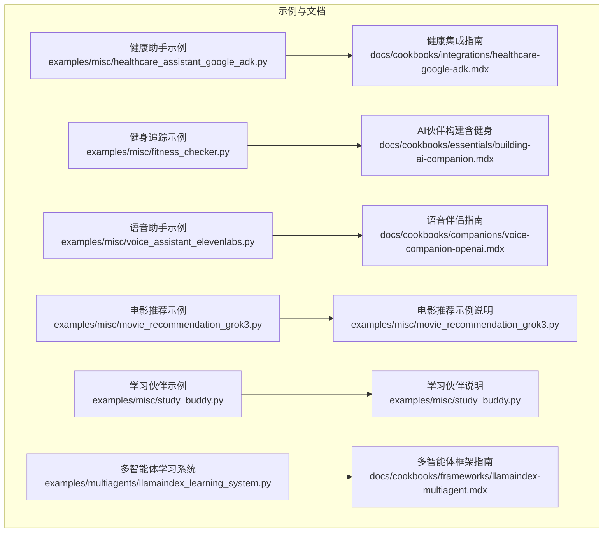
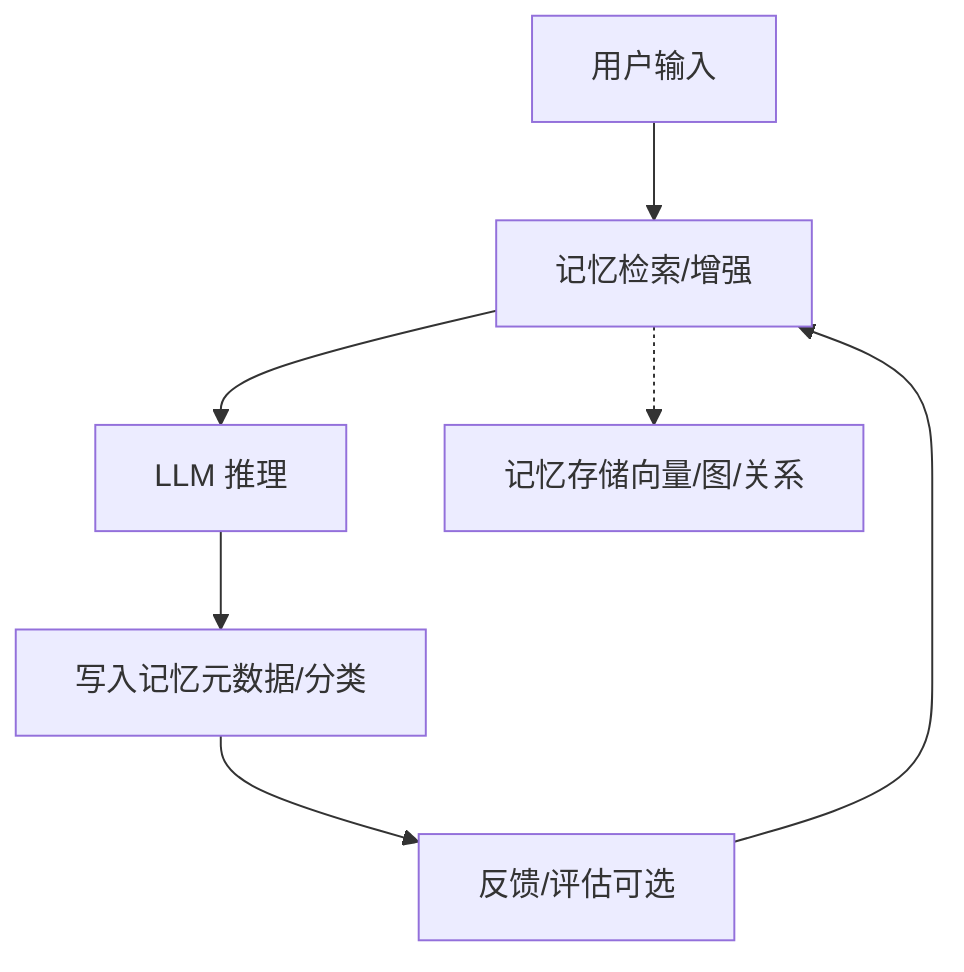
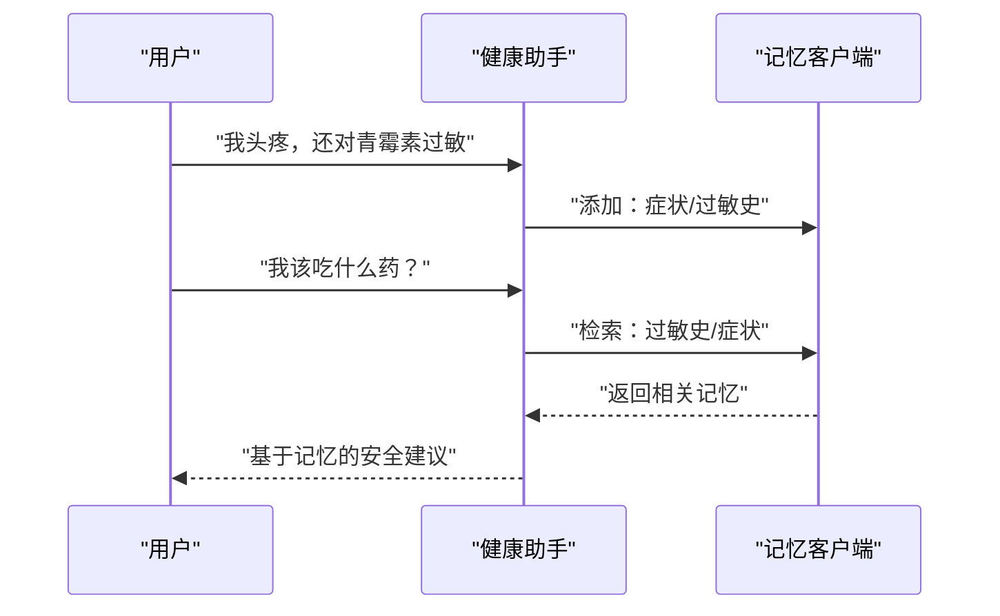
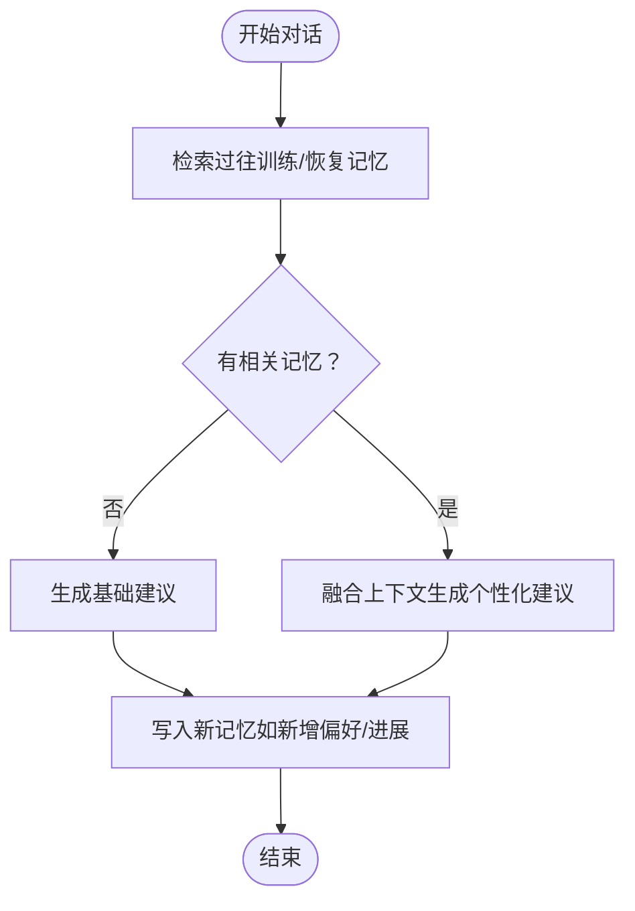
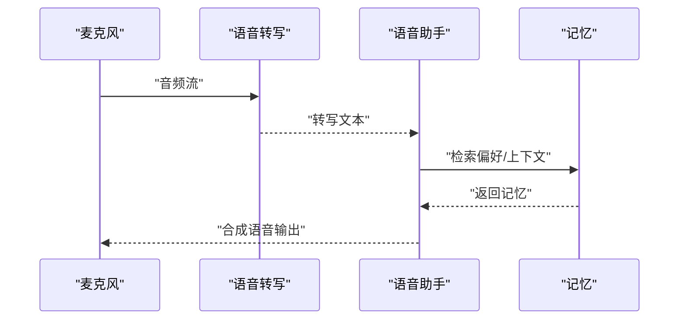
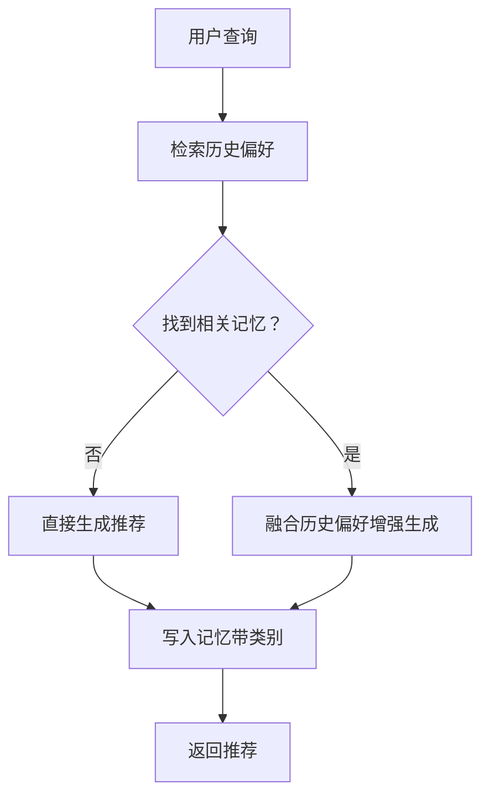
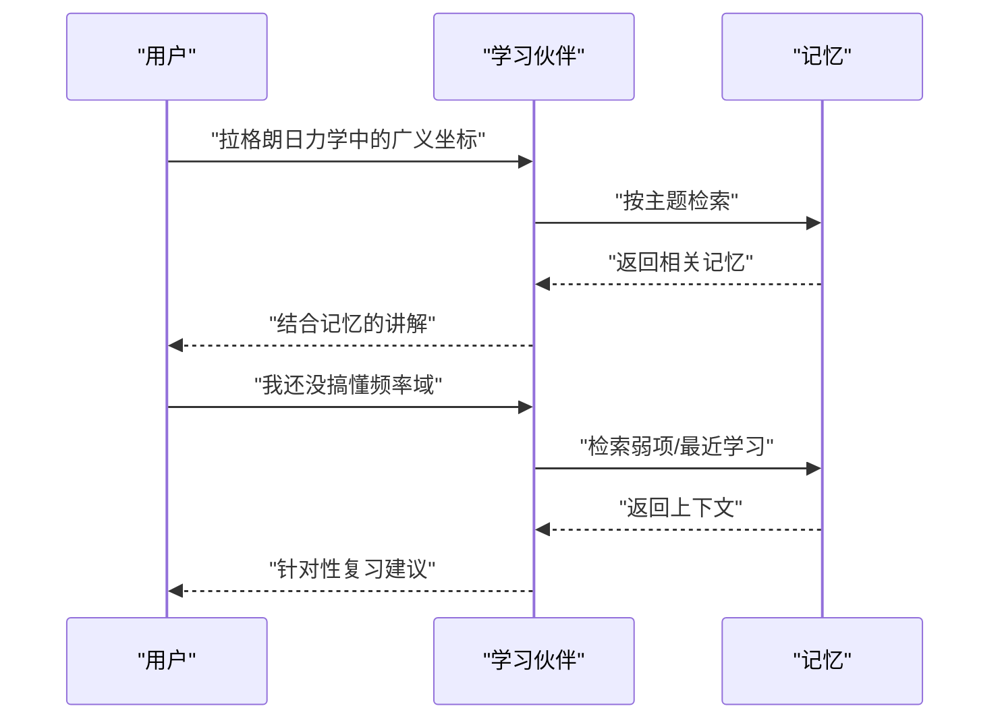
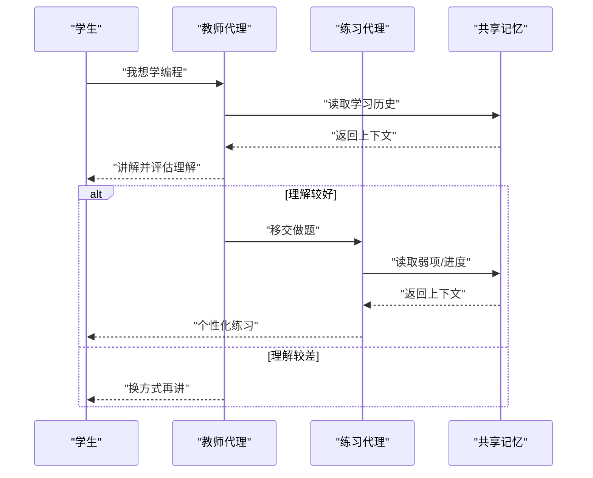
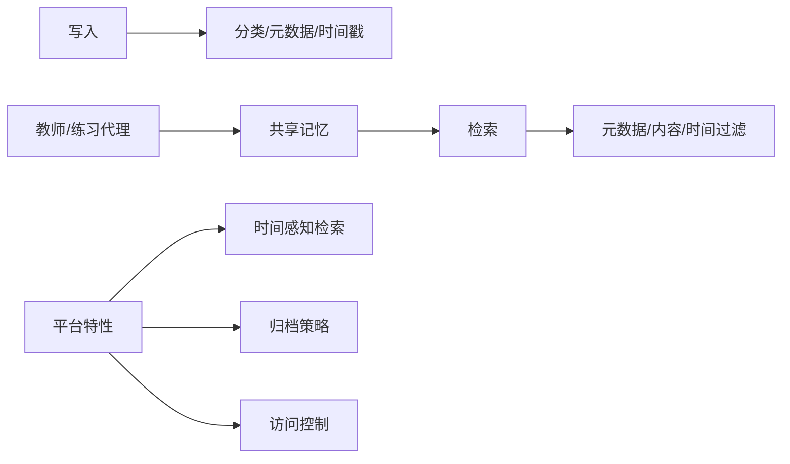

# 专用应用场景

<cite>
**本文引用的文件**
- [examples/misc/healthcare_assistant_google_adk.py](file://examples/misc/healthcare_assistant_google_adk.py)
- [docs/cookbooks/integrations/healthcare-google-adk.mdx](file://docs/cookbooks/integrations/healthcare-google-adk.mdx)
- [examples/misc/fitness_checker.py](file://examples/misc/fitness_checker.py)
- [docs/cookbooks/essentials/building-ai-companion.mdx](file://docs/cookbooks/essentials/building-ai-companion.mdx)
- [examples/misc/voice_assistant_elevenlabs.py](file://examples/misc/voice_assistant_elevenlabs.py)
- [docs/cookbooks/companions/voice-companion-openai.mdx](file://docs/cookbooks/companions/voice-companion-openai.mdx)
- [examples/misc/movie_recommendation_grok3.py](file://examples/misc/movie_recommendation_grok3.py)
- [examples/misc/study_buddy.py](file://examples/misc/study_buddy.py)
- [examples/multiagents/llamaindex_learning_system.py](file://examples/multiagents/llamaindex_learning_system.py)
- [docs/cookbooks/frameworks/llamaindex-multiagent.mdx](file://docs/cookbooks/frameworks/llamaindex-multiagent.mdx)
- [docs/cookbooks/essentials/controlling-memory-ingestion.mdx](file://docs/cookbooks/essentials/controlling-memory-ingestion.mdx)
- [docs/open-source/features/metadata-filtering.mdx](file://docs/open-source/features/metadata-filtering.mdx)
- [docs/platform/features/v2-memory-filters.mdx](file://docs/platform/features/v2-memory-filters.mdx)
- [docs/platform/features/temporal-reasoning.mdx](file://docs/platform/features/temporal-reasoning.mdx)
- [openmemory/api/alembic/versions/0b53c747049a_initial_migration.py](file://openmemory/api/alembic/versions/0b53c747049a_initial_migration.py)
- [server/routers/auth.py](file://server/routers/auth.py)
</cite>

## 目录
1. 引言
2. 项目结构
3. 核心组件
4. 架构总览
5. 详细场景分析
6. 依赖关系分析
7. 性能与可扩展性
8. 合规与隐私
9. 故障排查
10. 结论

## 引言
本集成文档聚焦 mem0 在六大垂直领域的专用应用场景：健康助手、健身教练、语音助手、电影推荐、学习伙伴与多智能体学习系统。我们将从“特殊需求—数据处理—用户体验优化”三个维度展开，并补充面向医疗、金融等行业的合规与隐私建议。

## 项目结构
围绕专用场景，mem0 提供了丰富的示例与文档资源，涵盖：
- 场景示例：健康、健身、语音、电影、学习、多智能体教学
- 配置与能力：自定义指令、元数据过滤、时间感知检索、平台特性
- 平台与服务端：访问控制、归档策略、认证与密码管理

图示来源
- [examples/misc/healthcare_assistant_google_adk.py:1-200](file://examples/misc/healthcare_assistant_google_adk.py#L1-L200)
- [examples/misc/fitness_checker.py:1-120](file://examples/misc/fitness_checker.py#L1-L120)
- [examples/misc/voice_assistant_elevenlabs.py:1-160](file://examples/misc/voice_assistant_elevenlabs.py#L1-L160)
- [examples/misc/movie_recommendation_grok3.py:1-80](file://examples/misc/movie_recommendation_grok3.py#L1-L80)
- [examples/misc/study_buddy.py:1-86](file://examples/misc/study_buddy.py#L1-L86)
- [examples/multiagents/llamaindex_learning_system.py:1-200](file://examples/multiagents/llamaindex_learning_system.py#L1-L200)
- [docs/cookbooks/integrations/healthcare-google-adk.mdx:1-300](file://docs/cookbooks/integrations/healthcare-google-adk.mdx#L1-L300)
- [docs/cookbooks/essentials/building-ai-companion.mdx:1-700](file://docs/cookbooks/essentials/building-ai-companion.mdx#L1-L700)
- [docs/cookbooks/companions/voice-companion-openai.mdx:1-500](file://docs/cookbooks/companions/voice-companion-openai.mdx#L1-L500)
- [docs/cookbooks/frameworks/llamaindex-multiagent.mdx:1-220](file://docs/cookbooks/frameworks/llamaindex-multiagent.mdx#L1-L220)

章节来源
- [examples/misc/healthcare_assistant_google_adk.py:1-200](file://examples/misc/healthcare_assistant_google_adk.py#L1-L200)
- [examples/misc/fitness_checker.py:1-120](file://examples/misc/fitness_checker.py#L1-L120)
- [examples/misc/voice_assistant_elevenlabs.py:1-160](file://examples/misc/voice_assistant_elevenlabs.py#L1-L160)
- [examples/misc/movie_recommendation_grok3.py:1-80](file://examples/misc/movie_recommendation_grok3.py#L1-L80)
- [examples/misc/study_buddy.py:1-86](file://examples/misc/study_buddy.py#L1-L86)
- [examples/multiagents/llamaindex_learning_system.py:1-200](file://examples/multiagents/llamaindex_learning_system.py#L1-L200)
- [docs/cookbooks/integrations/healthcare-google-adk.mdx:1-300](file://docs/cookbooks/integrations/healthcare-google-adk.mdx#L1-L300)
- [docs/cookbooks/essentials/building-ai-companion.mdx:1-700](file://docs/cookbooks/essentials/building-ai-companion.mdx#L1-L700)
- [docs/cookbooks/companions/voice-companion-openai.mdx:1-500](file://docs/cookbooks/companions/voice-companion-openai.mdx#L1-L500)
- [docs/cookbooks/frameworks/llamaindex-multiagent.mdx:1-220](file://docs/cookbooks/frameworks/llamaindex-multiagent.mdx#L1-L220)

## 核心组件
- 记忆客户端与工具
  - 健康助手：使用记忆客户端进行“保存患者信息/检索患者信息”，支持阈值与 top_k 控制召回质量。
  - 健身助手：通过搜索结果生成个性化训练与饮食建议，结合过往对话上下文。
  - 语音助手：基于用户偏好初始化记忆，录音转写后调用记忆检索增强回答。
  - 电影推荐：以 Grok 3 为 LLM，结合历史偏好与当前查询生成推荐。
  - 学习伙伴：上传 PDF/图像，基于主题检索记忆，支持弱项检测与间隔重复提示。
  - 多智能体学习系统：两个代理共享记忆，自动评估理解与进度，形成教学闭环。
- 自定义指令与过滤
  - 通过自定义指令控制“存储/忽略”的规则，避免不可靠信息进入记忆库。
  - 元数据过滤与内容/时间过滤，提升检索精度与性能。
- 时间感知检索
  - 平台 v3 支持相对时间表达的精确匹配，便于“上周做了什么”“下周计划”等场景。

章节来源
- [docs/cookbooks/integrations/healthcare-google-adk.mdx:49-301](file://docs/cookbooks/integrations/healthcare-google-adk.mdx#L49-L301)
- [examples/misc/healthcare_assistant_google_adk.py:53-194](file://examples/misc/healthcare_assistant_google_adk.py#L53-L194)
- [examples/misc/fitness_checker.py:1-120](file://examples/misc/fitness_checker.py#L1-L120)
- [examples/misc/voice_assistant_elevenlabs.py:46-142](file://examples/misc/voice_assistant_elevenlabs.py#L46-L142)
- [examples/misc/movie_recommendation_grok3.py:1-80](file://examples/misc/movie_recommendation_grok3.py#L1-L80)
- [examples/misc/study_buddy.py:1-86](file://examples/misc/study_buddy.py#L1-L86)
- [examples/multiagents/llamaindex_learning_system.py:77-167](file://examples/multiagents/llamaindex_learning_system.py#L77-L167)
- [docs/cookbooks/essentials/controlling-memory-ingestion.mdx:83-143](file://docs/cookbooks/essentials/controlling-memory-ingestion.mdx#L83-L143)
- [docs/open-source/features/metadata-filtering.mdx:1-89](file://docs/open-source/features/metadata-filtering.mdx#L1-L89)
- [docs/platform/features/v2-memory-filters.mdx:108-178](file://docs/platform/features/v2-memory-filters.mdx#L108-L178)
- [docs/platform/features/temporal-reasoning.mdx:1-63](file://docs/platform/features/temporal-reasoning.mdx#L1-L63)

## 架构总览
下图展示了六大场景在 mem0 上的通用交互路径：用户输入 → 记忆检索/增强 → LLM 推理 → 记忆写入 → 反馈与优化。

图示来源
- [examples/misc/healthcare_assistant_google_adk.py:53-194](file://examples/misc/healthcare_assistant_google_adk.py#L53-L194)
- [examples/misc/fitness_checker.py:1-120](file://examples/misc/fitness_checker.py#L1-L120)
- [examples/misc/voice_assistant_elevenlabs.py:46-142](file://examples/misc/voice_assistant_elevenlabs.py#L46-L142)
- [examples/misc/movie_recommendation_grok3.py:1-80](file://examples/misc/movie_recommendation_grok3.py#L1-L80)
- [examples/misc/study_buddy.py:1-86](file://examples/misc/study_buddy.py#L1-L86)
- [examples/multiagents/llamaindex_learning_system.py:77-167](file://examples/multiagents/llamaindex_learning_system.py#L77-L167)

## 详细场景分析

### 健康助手（医疗）
- 特殊需求
  - 安全性与可靠性：仅存储经确认的诊断、过敏史、用药清单；对推测性信息进行过滤。
  - 持续性与一致性：跨会话保持上下文，避免重复询问病史。
  - 合规性：遵循医疗隐私规范，最小化数据采集与保留。
- 数据处理
  - 使用记忆客户端的“添加/搜索”工具，设置阈值与 top_k，确保相关性。
  - 通过自定义指令限定“存储/忽略”规则，降低误记风险。
- 用户体验优化
  - 会话内自动回忆关键信息，减少冗余输入。
  - 对敏感问题提供“安全建议”，避免重复提醒。
- 合规与隐私
  - 严格限制高敏字段（如药物、过敏原）的存储范围与生命周期。
  - 采用元数据标记（如类型/来源），便于审计与删除。

图示来源
- [docs/cookbooks/integrations/healthcare-google-adk.mdx:49-301](file://docs/cookbooks/integrations/healthcare-google-adk.mdx#L49-L301)
- [examples/misc/healthcare_assistant_google_adk.py:53-194](file://examples/misc/healthcare_assistant_google_adk.py#L53-L194)

章节来源
- [docs/cookbooks/integrations/healthcare-google-adk.mdx:49-301](file://docs/cookbooks/integrations/healthcare-google-adk.mdx#L49-L301)
- [examples/misc/healthcare_assistant_google_adk.py:53-194](file://examples/misc/healthcare_assistant_google_adk.py#L53-L194)
- [docs/cookbooks/essentials/controlling-memory-ingestion.mdx:83-143](file://docs/cookbooks/essentials/controlling-memory-ingestion.mdx#L83-L143)

### 健身教练（运动与营养）
- 特殊需求
  - 长期跟踪：记录目标、偏好、恢复情况与训练进展。
  - 个性化建议：结合睡眠、补剂、饮食与运动表现。
- 数据处理
  - 将对话历史与图像/文本输入转化为可检索的记忆片段。
  - 使用元数据标注（如“目标/偏好/恢复”）提升检索粒度。
- 用户体验优化
  - “记住上次重量/动作变化”，给出渐进式建议。
  - 考虑睡眠不足时的恢复友好型餐食建议。
- 合规与隐私
  - 仅存储必要健康信息，避免过度采集。
  - 支持按用户维度删除或导出记忆。

图示来源
- [examples/misc/fitness_checker.py:1-120](file://examples/misc/fitness_checker.py#L1-L120)
- [docs/cookbooks/essentials/building-ai-companion.mdx:604-638](file://docs/cookbooks/essentials/building-ai-companion.mdx#L604-L638)

章节来源
- [examples/misc/fitness_checker.py:1-120](file://examples/misc/fitness_checker.py#L1-L120)
- [docs/cookbooks/essentials/building-ai-companion.mdx:604-638](file://docs/cookbooks/essentials/building-ai-companion.mdx#L604-L638)
- [docs/open-source/features/metadata-filtering.mdx:1-89](file://docs/open-source/features/metadata-filtering.mdx#L1-L89)

### 语音助手（日常任务与偏好）
- 特殊需求
  - 偏好记忆：语速、音乐风格、简洁回答偏好等。
  - 实时音频处理：录音→转写→记忆检索→合成语音。
- 数据处理
  - 初始化记忆包含用户基本信息与偏好。
  - 语音输入经转写后作为检索查询，结合记忆生成响应。
- 用户体验优化
  - 短、准、不啰嗦的回复风格，契合用户偏好。
  - 音乐偏好与工作状态联动，提升专注度。
- 合规与隐私
  - 明确音频采集与使用的边界，提供删除与导出选项。

图示来源
- [examples/misc/voice_assistant_elevenlabs.py:118-142](file://examples/misc/voice_assistant_elevenlabs.py#L118-L142)
- [docs/cookbooks/companions/voice-companion-openai.mdx:208-435](file://docs/cookbooks/companions/voice-companion-openai.mdx#L208-L435)

章节来源
- [examples/misc/voice_assistant_elevenlabs.py:46-142](file://examples/misc/voice_assistant_elevenlabs.py#L46-L142)
- [docs/cookbooks/companions/voice-companion-openai.mdx:208-435](file://docs/cookbooks/companions/voice-companion-openai.mdx#L208-L435)

### 电影推荐（个性化与偏好演进）
- 特殊需求
  - 偏好建模：不喜欢恐怖片、偏爱浪漫喜剧、近期看过星际穿越等。
  - 推荐解释：基于历史偏好解释推荐理由。
- 数据处理
  - 使用 Grok 3 生成推荐，结合历史记忆与当前查询。
  - 写入记忆时标注类别（如“电影”），便于后续检索。
- 用户体验优化
  - “跳过煽情片”“轻快片”等偏好即时生效。
  - 新旧推荐对比，帮助决策。
- 合规与隐私
  - 仅存储与推荐相关的偏好片段，避免过度画像。

图示来源
- [examples/misc/movie_recommendation_grok3.py:1-80](file://examples/misc/movie_recommendation_grok3.py#L1-L80)

章节来源
- [examples/misc/movie_recommendation_grok3.py:1-80](file://examples/misc/movie_recommendation_grok3.py#L1-L80)

### 学习伙伴（知识管理与复习）
- 特殊需求
  - 主题记忆：课程主题、已学概念、弱项识别。
  - 复习策略：基于间隔重复与最近学习时间的再巩固。
- 数据处理
  - 支持 PDF/图像上传，提取为可检索记忆。
  - 检索主题相关记忆，结合新问题生成回答。
- 用户体验优化
  - “你之前说不太懂频率域”→自动定位弱项并调整讲解。
  - “上周讲过动量守恒，现在该复习了？”→触发复习提示。
- 合规与隐私
  - 教育场景下的数据最小化与可删除性。

图示来源
- [examples/misc/study_buddy.py:1-86](file://examples/misc/study_buddy.py#L1-L86)

章节来源
- [examples/misc/study_buddy.py:1-86](file://examples/misc/study_buddy.py#L1-L86)

### 多智能体学习系统（教学闭环）
- 特殊需求
  - 教师代理与练习代理协同：前者侧重讲解与理解评估，后者侧重练习与进度追踪。
  - 记忆共享：两代理共享学生学习历史，形成一致的教学闭环。
- 数据处理
  - 评估理解与追踪进度的工具函数，自动保存洞察。
  - 基于记忆动态调整难度与关注点。
- 用户体验优化
  - “上次你对X很困惑，这次换种方式讲”
  - “你进步很大，可以挑战更高阶内容”
- 合规与隐私
  - 教育数据的匿名化与最小化原则。

图示来源
- [examples/multiagents/llamaindex_learning_system.py:77-167](file://examples/multiagents/llamaindex_learning_system.py#L77-L167)
- [docs/cookbooks/frameworks/llamaindex-multiagent.mdx:84-207](file://docs/cookbooks/frameworks/llamaindex-multiagent.mdx#L84-L207)

章节来源
- [examples/multiagents/llamaindex_learning_system.py:77-167](file://examples/multiagents/llamaindex_learning_system.py#L77-L167)
- [docs/cookbooks/frameworks/llamaindex-multiagent.mdx:84-207](file://docs/cookbooks/frameworks/llamaindex-multiagent.mdx#L84-L207)

## 依赖关系分析
- 记忆检索与写入
  - 搜索：阈值、top_k、元数据过滤、内容/时间过滤
  - 写入：分类、元数据、时间戳（平台 v3）
- 代理协作
  - 教师/练习代理共享记忆上下文，减少重复检索
- 平台能力
  - 时间感知检索：支持“上周/下周/现在”等相对时间
  - 归档策略与访问控制：支持策略化数据生命周期管理

图示来源
- [docs/open-source/features/metadata-filtering.mdx:1-89](file://docs/open-source/features/metadata-filtering.mdx#L1-L89)
- [docs/platform/features/v2-memory-filters.mdx:108-178](file://docs/platform/features/v2-memory-filters.mdx#L108-L178)
- [docs/platform/features/temporal-reasoning.mdx:1-63](file://docs/platform/features/temporal-reasoning.mdx#L1-L63)
- [openmemory/api/alembic/versions/0b53c747049a_initial_migration.py:40-225](file://openmemory/api/alembic/versions/0b53c747049a_initial_migration.py#L40-L225)

章节来源
- [docs/open-source/features/metadata-filtering.mdx:1-89](file://docs/open-source/features/metadata-filtering.mdx#L1-L89)
- [docs/platform/features/v2-memory-filters.mdx:108-178](file://docs/platform/features/v2-memory-filters.mdx#L108-L178)
- [docs/platform/features/temporal-reasoning.mdx:1-63](file://docs/platform/features/temporal-reasoning.mdx#L1-L63)
- [openmemory/api/alembic/versions/0b53c747049a_initial_migration.py:40-225](file://openmemory/api/alembic/versions/0b53c747049a_initial_migration.py#L40-L225)

## 性能与可扩展性
- 检索性能
  - 使用阈值与 top_k 控制召回规模，减少无关结果带来的延迟。
  - 元数据过滤可显著缩小搜索空间，提高命中率与速度。
- 写入吞吐
  - 批量写入与分类/元数据标注有助于后续检索效率。
- 时间感知
  - 平台 v3 的时间感知检索可避免错误的时间排序，减少无效回溯。

## 合规与隐私
- 医疗/健康类
  - 严格限制高敏字段存储；通过自定义指令过滤不可靠信息。
  - 使用元数据标记来源/类型，便于审计与删除。
- 教育类
  - 数据最小化与可删除性；明确学习数据的使用边界。
- 一般隐私
  - 平台提供归档策略与访问控制表，支持策略化生命周期管理。
- 平台安全
  - 密码变更与认证流程保障账户安全。

章节来源
- [docs/cookbooks/essentials/controlling-memory-ingestion.mdx:83-143](file://docs/cookbooks/essentials/controlling-memory-ingestion.mdx#L83-L143)
- [openmemory/api/alembic/versions/0b53c747049a_initial_migration.py:40-225](file://openmemory/api/alembic/versions/0b53c747049a_initial_migration.py#L40-L225)
- [server/routers/auth.py:187-212](file://server/routers/auth.py#L187-L212)

## 故障排查
- 记忆未生成
  - 检查是否满足“可提取为记忆”的条件（如定义性问题、纯理论解释等）。
  - 调整自定义指令，确保可靠信息被存储。
- 检索结果不相关
  - 提升阈值、缩小分类/元数据过滤范围、增加上下文。
- 时间感知异常
  - 平台 v3 下检查写入时的 timestamp 与查询时的 reference_date 设置。
- 权限与访问
  - 确认 API Key 与平台版本，检查归档策略与访问控制。

章节来源
- [docs/platform/faqs.mdx:50-68](file://docs/platform/faqs.mdx#L50-L68)
- [docs/platform/features/temporal-reasoning.mdx:1-63](file://docs/platform/features/temporal-reasoning.mdx#L1-L63)

## 结论
mem0 在六大垂直场景中提供了统一的记忆基础设施：通过“检索增强—推理—写入—反馈”的闭环，实现持续学习与个性化体验。结合自定义指令、元数据过滤、时间感知检索与平台级归档/访问控制，可在保证合规与隐私的前提下，最大化用户体验与业务价值。