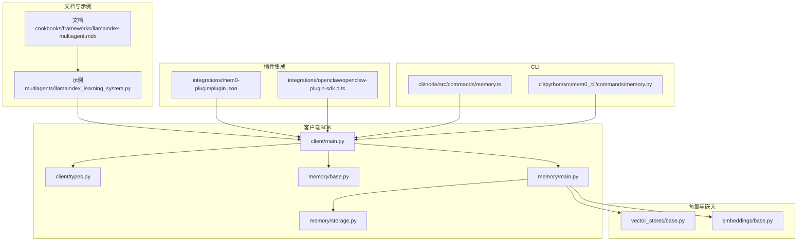
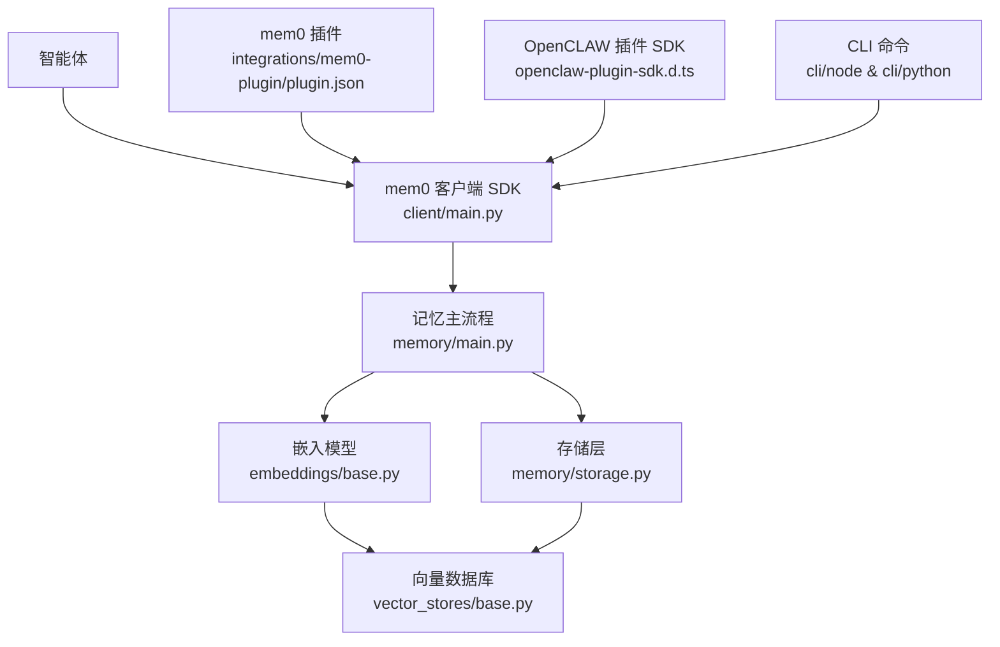
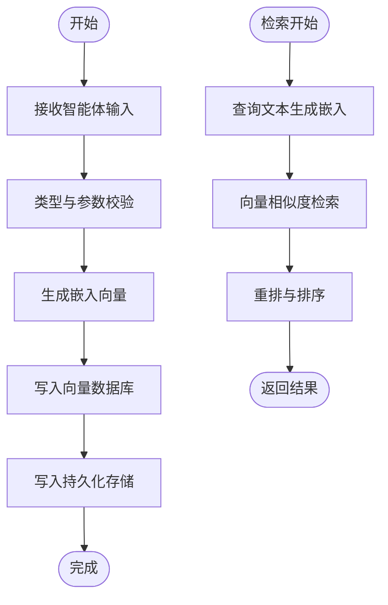
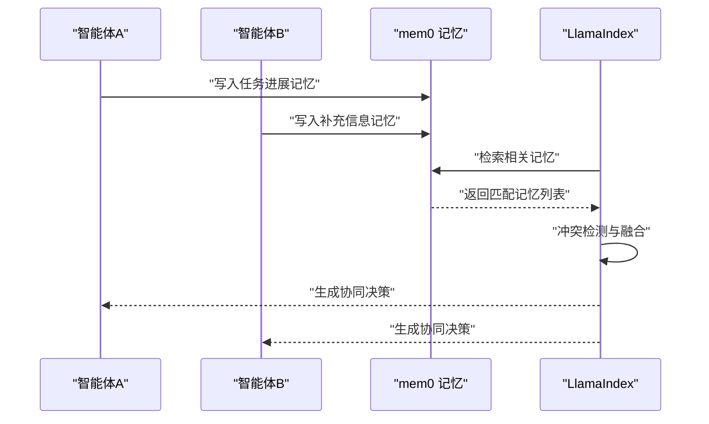
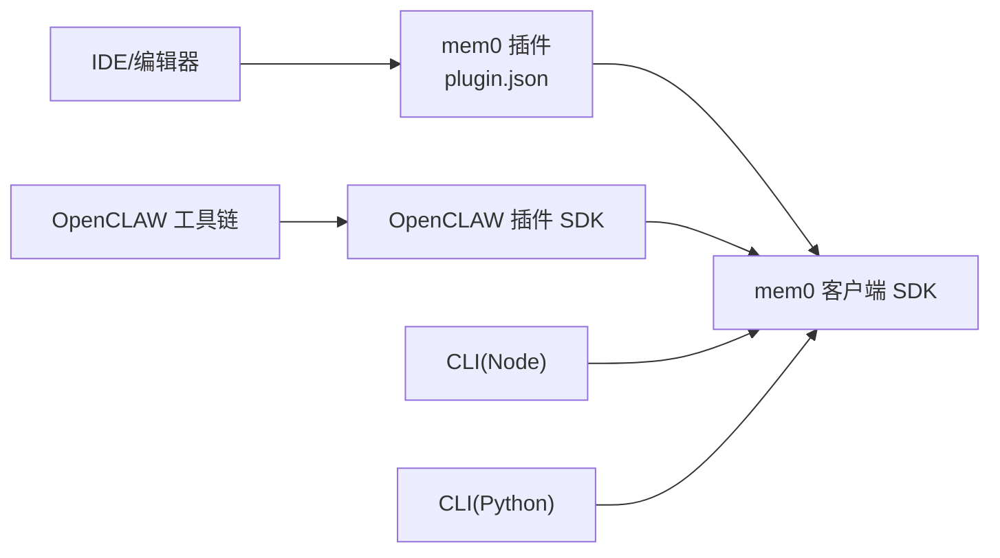
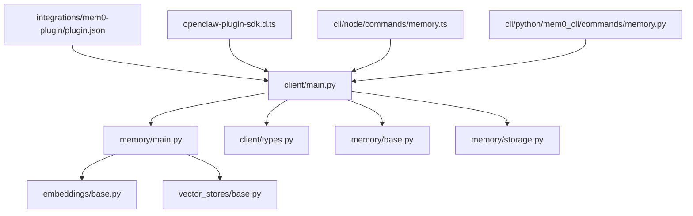

# 多智能体系统

<cite>
**本文引用的文件**
- [llamaindex_multiagent.mdx](file://docs/cookbooks/frameworks/llamaindex-multiagent.mdx)
- [llamaindex_learning_system.py](file://examples/multiagents/llamaindex_learning_system.py)
- [memory.ts](file://cli/node/src/commands/memory.ts)
- [memory.py](file://cli/python/src/mem0_cli/commands/memory.py)
- [main.py](file://mem0/client/main.py)
- [types.py](file://mem0/client/types.py)
- [base.py](file://mem0/memory/base.py)
- [storage.py](file://mem0/memory/storage.py)
- [main.py](file://mem0/memory/main.py)
- [embeddings_base.py](file://mem0/embeddings/base.py)
- [vector_stores_base.py](file://mem0/vector_stores/base.py)
- [plugin.json](file://integrations/mem0-plugin/plugin.json)
- [openclaw-plugin-sdk.d.ts](file://integrations/openclaw/openclaw-plugin-sdk.d.ts)
- [openclaw.plugin.json](file://integrations/openclaw/openclaw-plugin-sdk.d.ts)
- [test_client.py](file://tests/test_client.py)
- [test_memory.py](file://tests/test_memory.py)
</cite>

## 目录
1. [简介](#简介)
2. [项目结构](#项目结构)
3. [核心组件](#核心组件)
4. [架构总览](#架构总览)
5. [详细组件分析](#详细组件分析)
6. [依赖关系分析](#依赖关系分析)
7. [性能考虑](#性能考虑)
8. [故障排除指南](#故障排除指南)
9. [结论](#结论)
10. [附录](#附录)

## 简介
本文件面向在复杂多智能体环境中使用 mem0 进行记忆管理与信息共享的工程团队，系统性阐述如何将 mem0 与 LlamaIndex 学习系统集成，实现智能体间通信协议、记忆同步机制与冲突解决策略。文档同时提供团队协作场景的最佳实践与性能优化建议，帮助读者在真实生产环境中稳定落地。

## 项目结构
仓库采用模块化分层组织：Python SDK（mem0）、CLI（Node/Python）、示例与教程（examples/docs）、插件集成（integrations）以及服务端与仪表盘（server）。其中与多智能体直接相关的关键路径包括：
- 集成文档：docs/cookbooks/frameworks/llamaindex-multiagent.mdx
- 示例脚本：examples/multiagents/llamaindex_learning_system.py
- 客户端入口：mem0/client/main.py
- 记忆核心：mem0/memory/main.py、mem0/memory/storage.py
- 向量化与嵌入：mem0/vector_stores/base.py、mem0/embeddings/base.py
- 插件集成：integrations/mem0-plugin/plugin.json
- CLI 命令：cli/node/src/commands/memory.ts、cli/python/src/mem0_cli/commands/memory.py

**图表来源**
- [llamaindex_multiagent.mdx](file://docs/cookbooks/frameworks/llamaindex-multiagent.mdx)
- [llamaindex_learning_system.py](file://examples/multiagents/llamaindex_learning_system.py)
- [main.py](file://mem0/client/main.py)
- [types.py](file://mem0/client/types.py)
- [base.py](file://mem0/memory/base.py)
- [main.py](file://mem0/memory/main.py)
- [storage.py](file://mem0/memory/storage.py)
- [vector_stores_base.py](file://mem0/vector_stores/base.py)
- [embeddings_base.py](file://mem0/embeddings/base.py)
- [plugin.json](file://integrations/mem0-plugin/plugin.json)
- [openclaw-plugin-sdk.d.ts](file://integrations/openclaw/openclaw-plugin-sdk.d.ts)
- [memory.ts](file://cli/node/src/commands/memory.ts)
- [memory.py](file://cli/python/src/mem0_cli/commands/memory.py)

**章节来源**
- [llamaindex_multiagent.mdx](file://docs/cookbooks/frameworks/llamaindex-multiagent.mdx)
- [llamaindex_learning_system.py](file://examples/multiagents/llamaindex_learning_system.py)
- [main.py](file://mem0/client/main.py)
- [types.py](file://mem0/client/types.py)
- [base.py](file://mem0/memory/base.py)
- [main.py](file://mem0/memory/main.py)
- [storage.py](file://mem0/memory/storage.py)
- [vector_stores_base.py](file://mem0/vector_stores/base.py)
- [embeddings_base.py](file://mem0/embeddings/base.py)
- [plugin.json](file://integrations/mem0-plugin/plugin.json)
- [openclaw-plugin-sdk.d.ts](file://integrations/openclaw/openclaw-plugin-sdk.d.ts)
- [memory.ts](file://cli/node/src/commands/memory.ts)
- [memory.py](file://cli/python/src/mem0_cli/commands/memory.py)

## 核心组件
- 记忆客户端与类型定义：提供统一的记忆增删改查接口与数据模型，支撑多智能体对记忆的标准化访问。
- 记忆主流程与存储：封装记忆写入、检索、更新与删除的完整生命周期，抽象向量化与嵌入细节。
- 向量数据库与嵌入模型：通过可插拔的适配器支持多种向量库与嵌入源，满足不同部署环境需求。
- 插件与集成：提供 mem0-plugin 与 OpenCLAW 插件 SDK，便于在外部工具链中无缝接入记忆能力。
- CLI 命令：为开发者提供命令行工具，快速执行记忆操作与配置同步。

**章节来源**
- [main.py](file://mem0/client/main.py)
- [types.py](file://mem0/client/types.py)
- [base.py](file://mem0/memory/base.py)
- [main.py](file://mem0/memory/main.py)
- [storage.py](file://mem0/memory/storage.py)
- [vector_stores_base.py](file://mem0/vector_stores/base.py)
- [embeddings_base.py](file://mem0/embeddings/base.py)
- [plugin.json](file://integrations/mem0-plugin/plugin.json)
- [openclaw-plugin-sdk.d.ts](file://integrations/openclaw/openclaw-plugin-sdk.d.ts)
- [memory.ts](file://cli/node/src/commands/memory.ts)
- [memory.py](file://cli/python/src/mem0_cli/commands/memory.py)

## 架构总览
下图展示了多智能体系统中 mem0 的整体架构：智能体通过客户端 SDK 写入/查询记忆；记忆经由嵌入模型生成向量表示后存入向量数据库；插件与 CLI 提供扩展与运维能力；文档与示例指导集成与最佳实践。

**图表来源**
- [main.py](file://mem0/client/main.py)
- [main.py](file://mem0/memory/main.py)
- [storage.py](file://mem0/memory/storage.py)
- [embeddings_base.py](file://mem0/embeddings/base.py)
- [vector_stores_base.py](file://mem0/vector_stores/base.py)
- [plugin.json](file://integrations/mem0-plugin/plugin.json)
- [openclaw-plugin-sdk.d.ts](file://integrations/openclaw/openclaw-plugin-sdk.d.ts)
- [memory.ts](file://cli/node/src/commands/memory.ts)
- [memory.py](file://cli/python/src/mem0_cli/commands/memory.py)

## 详细组件分析

### 记忆主流程与存储
- 写入流程：智能体输入触发客户端调用，经过类型校验与预处理后，进入记忆主流程；主流程负责调用嵌入模型生成向量，再写入向量数据库与持久化存储。
- 检索流程：基于查询文本生成向量，向量数据库返回相似度最高的记忆片段，主流程进行后处理与排序，最终返回给智能体。
- 更新与删除：提供原子级更新与批量删除能力，确保多智能体并发场景下的数据一致性。
- 存储抽象：通过存储层抽象屏蔽具体实现差异，支持多种向量库与嵌入源的切换。

**图表来源**
- [main.py](file://mem0/memory/main.py)
- [storage.py](file://mem0/memory/storage.py)
- [embeddings_base.py](file://mem0/embeddings/base.py)
- [vector_stores_base.py](file://mem0/vector_stores/base.py)

**章节来源**
- [main.py](file://mem0/memory/main.py)
- [storage.py](file://mem0/memory/storage.py)
- [embeddings_base.py](file://mem0/embeddings/base.py)
- [vector_stores_base.py](file://mem0/vector_stores/base.py)

### LlamaIndex 学习系统集成
- 协议设计：以“记忆作为上下文”的方式将检索到的记忆注入到 LlamaIndex 的提示模板中，形成“检索增强”的对话或推理循环。
- 记忆同步：在多智能体之间建立“共享记忆空间”，通过统一的命名空间与元数据标签实现跨智能体可见性；对同一主题的记忆采用版本号或时间戳进行去重与合并。
- 冲突解决：当多个智能体对同一事件产生不同记忆时，采用“时间优先+置信度加权”的策略进行融合；对于不可融合的矛盾信息，输出“待人工审核”标记并记录证据链。
- 示例参考：示例脚本演示了如何在 LlamaIndex 中加载 mem0 记忆，驱动多智能体协同学习与任务分解。

**图表来源**
- [llamaindex_multiagent.mdx](file://docs/cookbooks/frameworks/llamaindex-multiagent.mdx)
- [llamaindex_learning_system.py](file://examples/multiagents/llamaindex_learning_system.py)
- [main.py](file://mem0/memory/main.py)

**章节来源**
- [llamaindex_multiagent.mdx](file://docs/cookbooks/frameworks/llamaindex-multiagent.mdx)
- [llamaindex_learning_system.py](file://examples/multiagents/llamaindex_learning_system.py)
- [main.py](file://mem0/memory/main.py)

### 插件与 CLI 集成
- mem0 插件：通过插件 JSON 定义钩子与技能，使 IDE/编辑器等工具能够自动捕获上下文并写入记忆，实现“无感记忆”。
- OpenCLAW 插件 SDK：提供类型定义与入口，便于在 OpenCLAW 生态中复用 mem0 的记忆能力。
- CLI 命令：Node 与 Python 双栈 CLI 提供 add、delete、search、export 等常用操作，支持批量与异步模式，便于自动化与运维集成。

**图表来源**
- [plugin.json](file://integrations/mem0-plugin/plugin.json)
- [openclaw-plugin-sdk.d.ts](file://integrations/openclaw/openclaw-plugin-sdk.d.ts)
- [memory.ts](file://cli/node/src/commands/memory.ts)
- [memory.py](file://cli/python/src/mem0_cli/commands/memory.py)
- [main.py](file://mem0/client/main.py)

**章节来源**
- [plugin.json](file://integrations/mem0-plugin/plugin.json)
- [openclaw-plugin-sdk.d.ts](file://integrations/openclaw/openclaw-plugin-sdk.d.ts)
- [memory.ts](file://cli/node/src/commands/memory.ts)
- [memory.py](file://cli/python/src/mem0_cli/commands/memory.py)
- [main.py](file://mem0/client/main.py)

## 依赖关系分析
- 组件耦合：客户端 SDK 与记忆主流程强耦合，但通过嵌入与向量库接口弱化对外部实现的依赖。
- 外部依赖：向量库与嵌入模型通过适配器模式解耦，可在不修改上层逻辑的情况下切换实现。
- 集成点：插件与 CLI 作为外部集成入口，遵循统一的数据模型与错误处理规范。

**图表来源**
- [main.py](file://mem0/client/main.py)
- [main.py](file://mem0/memory/main.py)
- [embeddings_base.py](file://mem0/embeddings/base.py)
- [vector_stores_base.py](file://mem0/vector_stores/base.py)
- [types.py](file://mem0/client/types.py)
- [base.py](file://mem0/memory/base.py)
- [storage.py](file://mem0/memory/storage.py)
- [plugin.json](file://integrations/mem0-plugin/plugin.json)
- [openclaw-plugin-sdk.d.ts](file://integrations/openclaw/openclaw-plugin-sdk.d.ts)
- [memory.ts](file://cli/node/src/commands/memory.ts)
- [memory.py](file://cli/python/src/mem0_cli/commands/memory.py)

**章节来源**
- [main.py](file://mem0/client/main.py)
- [main.py](file://mem0/memory/main.py)
- [embeddings_base.py](file://mem0/embeddings/base.py)
- [vector_stores_base.py](file://mem0/vector_stores/base.py)
- [types.py](file://mem0/client/types.py)
- [base.py](file://mem0/memory/base.py)
- [storage.py](file://mem0/memory/storage.py)
- [plugin.json](file://integrations/mem0-plugin/plugin.json)
- [openclaw-plugin-sdk.d.ts](file://integrations/openclaw/openclaw-plugin-sdk.d.ts)
- [memory.ts](file://cli/node/src/commands/memory.ts)
- [memory.py](file://cli/python/src/mem0_cli/commands/memory.py)

## 性能考虑
- 向量检索优化：合理设置 top_k 与过滤条件，避免全库扫描；对高频检索建立本地缓存与预热。
- 批量写入：利用批量接口减少网络往返与序列化开销；在写入前进行去重与压缩。
- 异步与并发：CLI 与 SDK 支持异步模式，建议在高并发场景下限制并发度并增加重试与退避。
- 资源隔离：将嵌入与向量库置于独立资源池，避免相互影响；监控延迟与吞吐指标。
- 版本与增量：仅同步变更的记忆条目，减少传输与计算成本。

## 故障排除指南
- 常见问题定位
  - 记忆写入失败：检查嵌入模型可用性与向量维度是否匹配；确认存储连接与权限。
  - 检索结果异常：核对过滤条件与元数据标签；验证嵌入质量与向量库索引状态。
  - 并发冲突：启用幂等写入与版本控制；对冲突项进行人工复核。
- 测试与验证
  - 使用测试套件验证客户端与记忆功能的正确性与稳定性。
  - 在集成环境中模拟高负载与异常场景，评估系统韧性。

**章节来源**
- [test_client.py](file://tests/test_client.py)
- [test_memory.py](file://tests/test_memory.py)

## 结论
通过将 mem0 的记忆能力与 LlamaIndex 的学习系统深度集成，多智能体可以在复杂任务中实现高效的信息共享与协同决策。借助统一的通信协议、同步机制与冲突解决策略，结合插件与 CLI 的扩展能力，团队能够在真实场景中构建可维护、可观测且高性能的记忆型智能体系统。

## 附录
- 最佳实践清单
  - 明确记忆命名空间与元数据规范，确保跨智能体一致理解。
  - 对敏感信息进行脱敏与加密，遵守隐私与合规要求。
  - 建立定期审计与回滚机制，保障历史数据可追溯。
  - 将冲突解决纳入自动化流程，保留证据链以便事后审查。
- 性能优化建议
  - 选择合适的嵌入模型与向量库，平衡精度与速度。
  - 利用缓存与预取降低延迟，提升交互体验。
  - 在边缘或私有化部署中，优先考虑低延迟与低带宽方案。