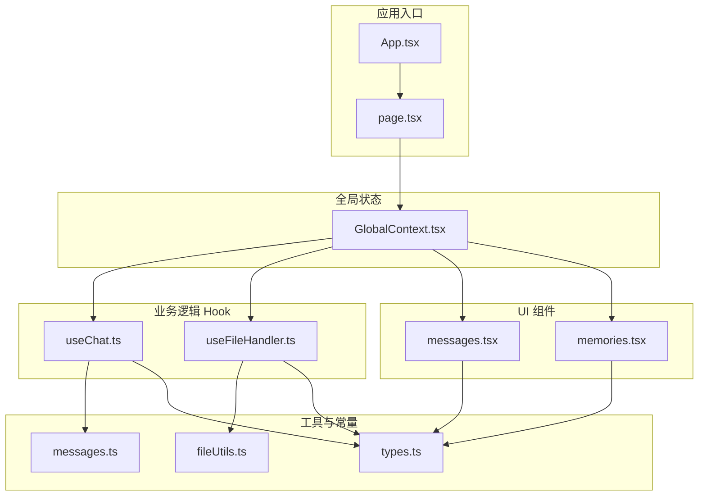
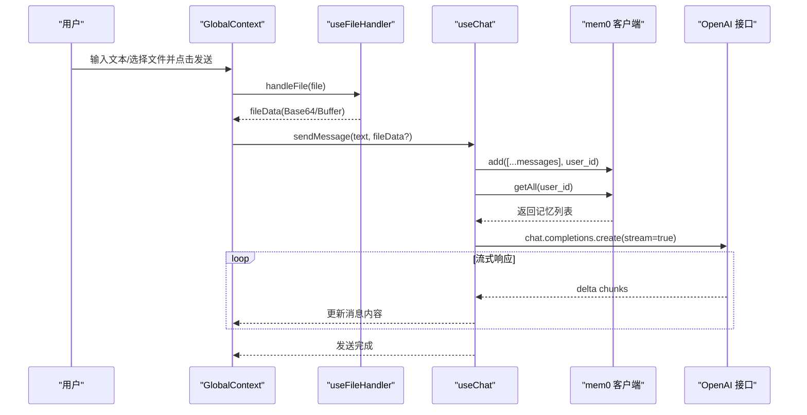
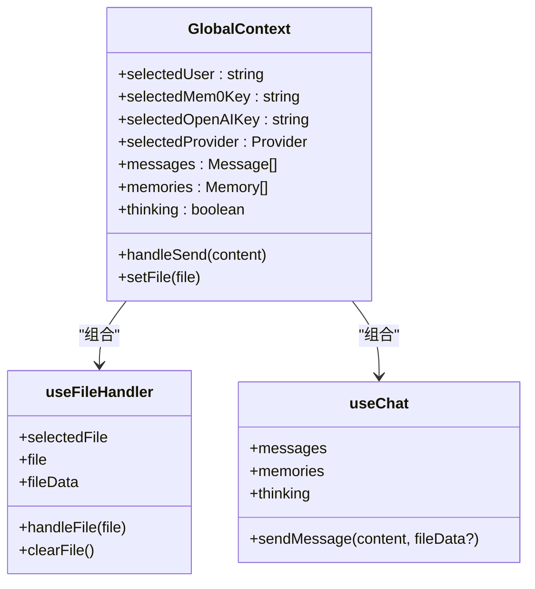
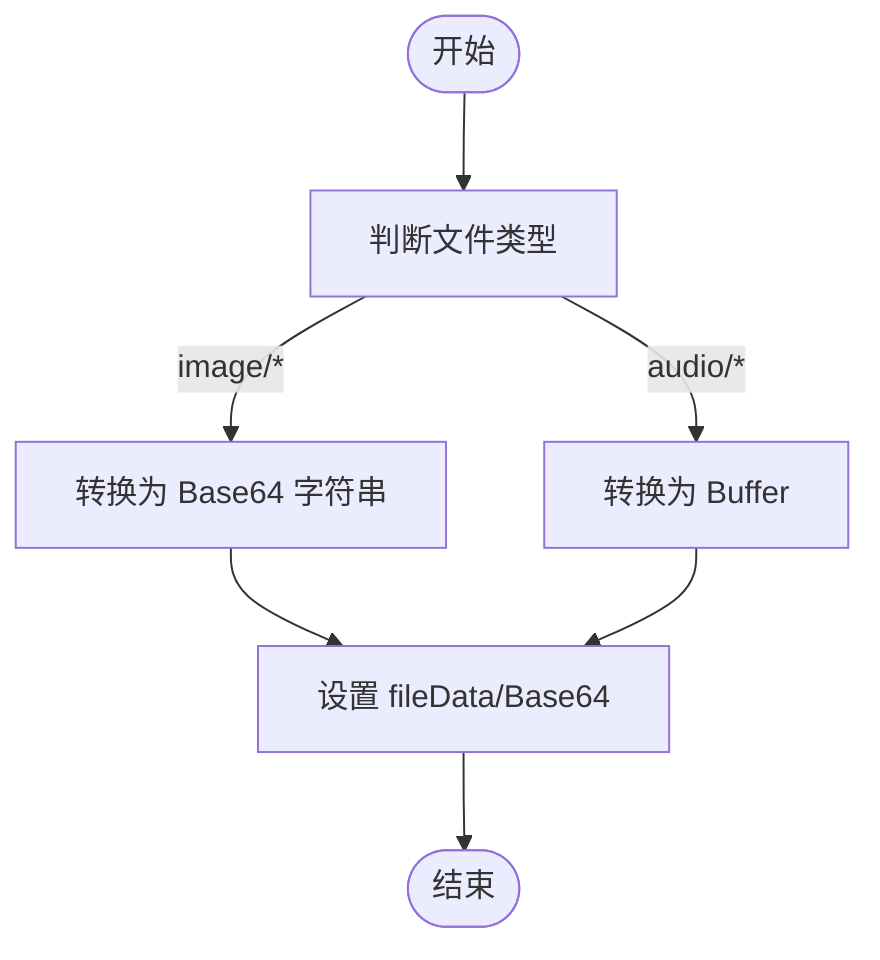
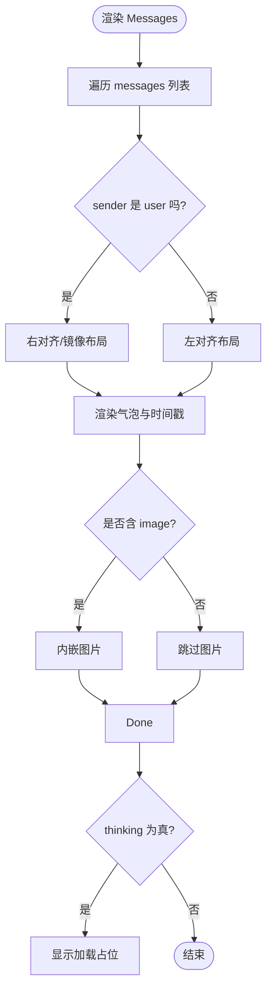
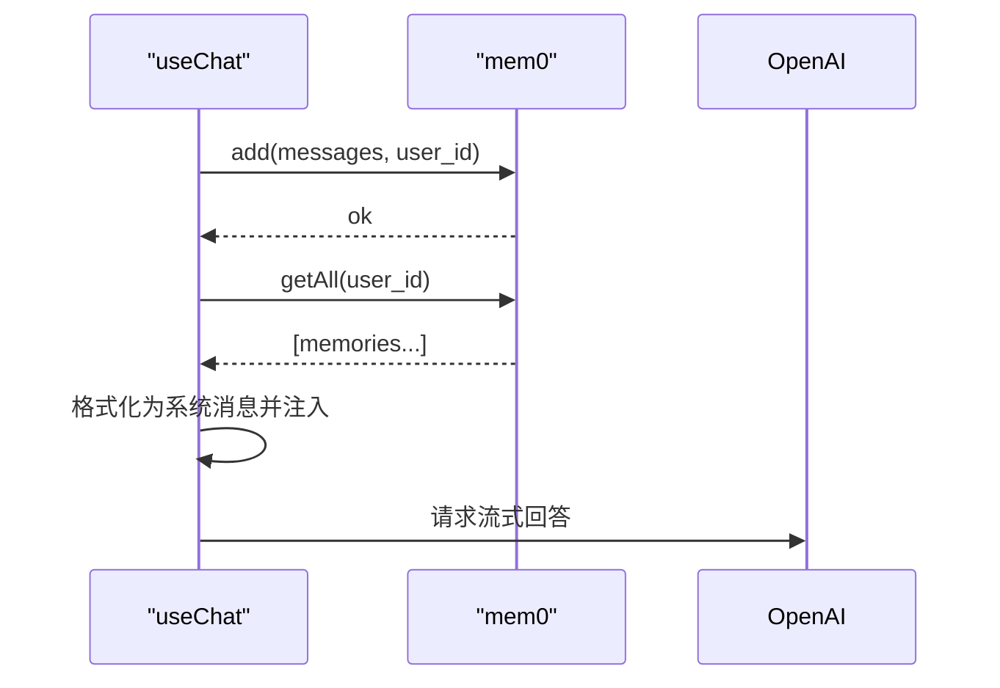
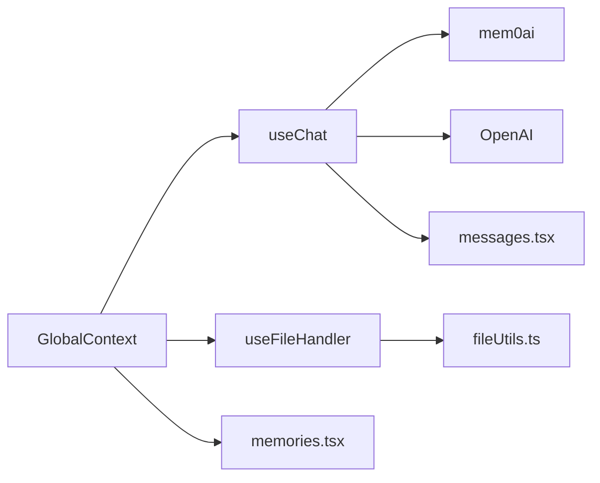

# 多模态演示

<cite>
**本文引用的文件**
- [App.tsx](file://examples/multimodal-demo/src/App.tsx)
- [page.tsx](file://examples/multimodal-demo/src/page.tsx)
- [GlobalContext.tsx](file://examples/multimodal-demo/src/contexts/GlobalContext.tsx)
- [useChat.ts](file://examples/multimodal-demo/src/hooks/useChat.ts)
- [useFileHandler.ts](file://examples/multimodal-demo/src/hooks/useFileHandler.ts)
- [messages.tsx](file://examples/multimodal-demo/src/components/messages.tsx)
- [memories.tsx](file://examples/multimodal-demo/src/components/memories.tsx)
- [fileUtils.ts](file://examples/multimodal-demo/src/utils/fileUtils.ts)
- [messages.ts](file://examples/multimodal-demo/src/constants/messages.ts)
- [types.ts](file://examples/multimodal-demo/src/types.ts)
</cite>

## 目录
1. [简介](#简介)
2. [项目结构](#项目结构)
3. [核心组件](#核心组件)
4. [架构总览](#架构总览)
5. [详细组件分析](#详细组件分析)
6. [依赖关系分析](#依赖关系分析)
7. [性能考虑](#性能考虑)
8. [故障排除指南](#故障排除指南)
9. [结论](#结论)
10. [附录](#附录)

## 简介
本文件面向希望在前端应用中集成 mem0 实现多模态（文本、图像、音频）处理的开发者，提供从架构到组件实现的完整说明。该示例基于 React + Vite 构建，通过自定义 Hook 将 mem0 的记忆存储与 OpenAI 的流式对话能力结合，支持图片与音频文件的上传与处理，并以上下文（Context）统一管理全局状态，包括消息列表、记忆检索结果、文件选择与发送流程等。

## 项目结构
多模态演示位于 examples/multimodal-demo，采用按功能分层的组织方式：
- 应用入口与页面：App.tsx、page.tsx
- 全局状态：GlobalContext.tsx
- 业务逻辑 Hook：useChat.ts、useFileHandler.ts
- UI 组件：messages.tsx、memories.tsx
- 工具函数：fileUtils.ts
- 常量与类型：messages.ts、types.ts

图表来源
- [App.tsx:1-14](file://examples/multimodal-demo/src/App.tsx#L1-L14)
- [page.tsx:1-15](file://examples/multimodal-demo/src/page.tsx#L1-L15)
- [GlobalContext.tsx:1-110](file://examples/multimodal-demo/src/contexts/GlobalContext.tsx#L1-L110)
- [useChat.ts:1-223](file://examples/multimodal-demo/src/hooks/useChat.ts#L1-L223)
- [useFileHandler.ts:1-45](file://examples/multimodal-demo/src/hooks/useFileHandler.ts#L1-L45)
- [messages.tsx:1-103](file://examples/multimodal-demo/src/components/messages.tsx#L1-L103)
- [memories.tsx:1-84](file://examples/multimodal-demo/src/components/memories.tsx#L1-L84)
- [fileUtils.ts:1-16](file://examples/multimodal-demo/src/utils/fileUtils.ts#L1-L16)
- [messages.ts:1-31](file://examples/multimodal-demo/src/constants/messages.ts#L1-L31)
- [types.ts:1-22](file://examples/multimodal-demo/src/types.ts#L1-L22)

章节来源
- [App.tsx:1-14](file://examples/multimodal-demo/src/App.tsx#L1-L14)
- [page.tsx:1-15](file://examples/multimodal-demo/src/page.tsx#L1-L15)

## 核心组件
- 全局状态与配置：GlobalContext 聚合用户认证、API 密钥、文件选择与发送逻辑，向子组件提供统一的上下文。
- 消息渲染：messages.tsx 负责聊天消息的渲染、滚动行为与“思考中”占位符显示。
- 记忆面板：memories.tsx 展示与动画呈现用户相关记忆片段。
- 文件处理：useFileHandler.ts 负责图片 Base64 编码与音频 Buffer 转换；fileUtils.ts 提供转换工具。
- 对话与记忆：useChat.ts 负责消息格式化、调用 OpenAI 流式接口、同步 mem0 记忆并注入上下文。

章节来源
- [GlobalContext.tsx:1-110](file://examples/multimodal-demo/src/contexts/GlobalContext.tsx#L1-L110)
- [messages.tsx:1-103](file://examples/multimodal-demo/src/components/messages.tsx#L1-L103)
- [memories.tsx:1-84](file://examples/multimodal-demo/src/components/memories.tsx#L1-L84)
- [useFileHandler.ts:1-45](file://examples/multimodal-demo/src/hooks/useFileHandler.ts#L1-L45)
- [fileUtils.ts:1-16](file://examples/multimodal-demo/src/utils/fileUtils.ts#L1-L16)
- [useChat.ts:1-223](file://examples/multimodal-demo/src/hooks/useChat.ts#L1-L223)

## 架构总览
整体交互链路如下：用户通过 GlobalContext 触发发送，useFileHandler 处理文件并转为内部数据，useChat 将消息与文件数据提交至 mem0 并调用 OpenAI 获取流式响应，同时更新本地消息与记忆列表。

图表来源
- [GlobalContext.tsx:63-73](file://examples/multimodal-demo/src/contexts/GlobalContext.tsx#L63-L73)
- [useFileHandler.ts:19-29](file://examples/multimodal-demo/src/hooks/useFileHandler.ts#L19-L29)
- [useChat.ts:84-215](file://examples/multimodal-demo/src/hooks/useChat.ts#L84-L215)

## 详细组件分析

### 全局状态与设计模式
- 设计模式：Provider/Consumer + 自定义 Hook，将认证、文件与消息逻辑解耦，便于复用与测试。
- 关键职责：
  - 用户与密钥选择：useAuth（由 GlobalContext 引入）
  - 文件处理：useFileHandler 返回 selectedFile、file、fileData 及操作方法
  - 对话流程：useChat 返回 messages、memories、thinking 与 sendMessage
  - 发送整合：GlobalContext.handleSend 在存在文件时传入 fileData，否则仅文本

图表来源
- [GlobalContext.tsx:9-26](file://examples/multimodal-demo/src/contexts/GlobalContext.tsx#L9-L26)
- [useFileHandler.ts:5-12](file://examples/multimodal-demo/src/hooks/useFileHandler.ts#L5-L12)
- [useChat.ts:14-19](file://examples/multimodal-demo/src/hooks/useChat.ts#L14-L19)

章节来源
- [GlobalContext.tsx:30-107](file://examples/multimodal-demo/src/contexts/GlobalContext.tsx#L30-L107)

### 文件上传与媒体处理
- 图片处理：使用 FileReader 将 File 转为 Base64 字符串，适配 OpenAI vision 接口的 image_url.url 结构。
- 音频处理：将 File 转为 ArrayBuffer 并封装为 Buffer，用于后续语音识别或模型输入（当前示例聚焦图片）。
- 状态管理：selectedFile、file、fileData 三元组确保 UI 与逻辑一致，clearFile 支持重置。

图表来源
- [useFileHandler.ts:19-29](file://examples/multimodal-demo/src/hooks/useFileHandler.ts#L19-L29)
- [fileUtils.ts:3-16](file://examples/multimodal-demo/src/utils/fileUtils.ts#L3-L16)

章节来源
- [useFileHandler.ts:1-45](file://examples/multimodal-demo/src/hooks/useFileHandler.ts#L1-L45)
- [fileUtils.ts:1-16](file://examples/multimodal-demo/src/utils/fileUtils.ts#L1-L16)

### 消息渲染与实时反馈
- 渲染策略：根据 sender 决定头像、气泡对齐与颜色；当消息包含 image 字段时内嵌图片。
- 滚动行为：每次新增消息后自动滚动到底部，提升阅读体验。
- 思考状态：当 thinking 为真时显示“加载中”占位，增强交互反馈。

图表来源
- [messages.tsx:14-19](file://examples/multimodal-demo/src/components/messages.tsx#L14-L19)
- [messages.tsx:25-74](file://examples/multimodal-demo/src/components/messages.tsx#L25-L74)
- [messages.tsx:75-95](file://examples/multimodal-demo/src/components/messages.tsx#L75-L95)

章节来源
- [messages.tsx:1-103](file://examples/multimodal-demo/src/components/messages.tsx#L1-L103)

### 记忆检索与上下文注入
- 记忆写入：每次发送前将当前消息序列（含图片时以 image_url 形式）写入 mem0。
- 记忆读取：发送后拉取用户所有记忆，映射为前端 Memory 结构并在侧栏展示。
- 上下文注入：当消息包含图片时，将检索到的记忆拼接为系统提示，作为后续对话上下文，提升回复质量。

图表来源
- [useChat.ts:40-61](file://examples/multimodal-demo/src/hooks/useChat.ts#L40-L61)
- [useChat.ts:145-168](file://examples/multimodal-demo/src/hooks/useChat.ts#L145-L168)

章节来源
- [useChat.ts:1-223](file://examples/multimodal-demo/src/hooks/useChat.ts#L1-L223)
- [memories.tsx:1-84](file://examples/multimodal-demo/src/components/memories.tsx#L1-L84)

### 类型与常量
- 类型定义：Message、Memory、FileInfo 明确了消息体、记忆项与文件信息的数据结构。
- 常量：欢迎语、无效配置与错误提示消息，以及可用 Provider 与模型映射。

章节来源
- [types.ts:1-22](file://examples/multimodal-demo/src/types.ts#L1-L22)
- [messages.ts:1-31](file://examples/multimodal-demo/src/constants/messages.ts#L1-L31)

## 依赖关系分析
- 组件耦合：
  - GlobalContext 作为协调者，聚合 useChat 与 useFileHandler，避免子组件直接访问外部服务。
  - messages.tsx、memories.tsx 仅消费 GlobalContext，保持低耦合高内聚。
- 外部依赖：
  - mem0ai：用于记忆的增删查改。
  - openai：用于流式对话生成。
  - react-markdown：用于消息内容的 Markdown 渲染。
  - framer-motion：用于记忆卡片的动画过渡。
- 数据流向：
  - 输入：用户文本/文件 → GlobalContext.handleSend → useChat.sendMessage
  - 处理：useChat.updateMemories → mem0；useChat.sendMessage → OpenAI
  - 输出：useChat 更新 messages → GlobalContext 暴露给 UI

图表来源
- [GlobalContext.tsx:51-61](file://examples/multimodal-demo/src/contexts/GlobalContext.tsx#L51-L61)
- [useChat.ts:40-61](file://examples/multimodal-demo/src/hooks/useChat.ts#L40-L61)
- [useFileHandler.ts:19-29](file://examples/multimodal-demo/src/hooks/useFileHandler.ts#L19-L29)
- [messages.tsx:1-103](file://examples/multimodal-demo/src/components/messages.tsx#L1-L103)
- [memories.tsx:1-84](file://examples/multimodal-demo/src/components/memories.tsx#L1-L84)
- [fileUtils.ts:1-16](file://examples/multimodal-demo/src/utils/fileUtils.ts#L1-L16)

章节来源
- [GlobalContext.tsx:1-110](file://examples/multimodal-demo/src/contexts/GlobalContext.tsx#L1-L110)
- [useChat.ts:1-223](file://examples/multimodal-demo/src/hooks/useChat.ts#L1-L223)
- [useFileHandler.ts:1-45](file://examples/multimodal-demo/src/hooks/useFileHandler.ts#L1-L45)

## 性能考虑
- 流式渲染：OpenAI 使用流式响应，useChat 逐步更新消息内容，减少一次性渲染压力。
- 懒加载与动画：memories.tsx 使用动画库进行局部动画，避免全量重绘。
- 文件处理：图片 Base64 与音频 Buffer 的转换在客户端完成，建议对大文件进行体积限制与进度提示。
- 记忆检索：仅在需要时拉取记忆并注入系统提示，避免冗余请求。

## 故障排除指南
- API 配置无效：
  - 现象：出现无效配置提示消息。
  - 排查：确认 GlobalContext 中用户与密钥已正确设置。
- 发送失败：
  - 现象：出现通用错误提示。
  - 排查：检查 OpenAI 与 mem0 的网络连通性、密钥有效性与用户权限。
- 图片未显示：
  - 现象：消息中无图片预览。
  - 排查：确认 fileData 为 Base64 字符串且消息对象包含 image 字段。
- 记忆未更新：
  - 现象：记忆面板为空或未变化。
  - 排查：确认 mem0 的 add 与 getAll 是否成功返回；检查 user_id 一致性。

章节来源
- [messages.tsx:14-19](file://examples/multimodal-demo/src/components/messages.tsx#L14-L19)
- [messages.ts:10-22](file://examples/multimodal-demo/src/constants/messages.ts#L10-L22)
- [useChat.ts:89-98](file://examples/multimodal-demo/src/hooks/useChat.ts#L89-L98)
- [useChat.ts:209-214](file://examples/multimodal-demo/src/hooks/useChat.ts#L209-L214)

## 结论
该多模态演示通过清晰的分层与上下文抽象，实现了文本、图片与音频的前端处理与 mem0 记忆的无缝集成。其设计模式可移植到更复杂的多模态应用中：将状态管理集中在 GlobalContext，将业务逻辑下沉到自定义 Hook，UI 组件专注于渲染与交互反馈。建议在生产环境中进一步完善文件大小限制、错误重试与缓存策略，以提升稳定性与用户体验。

## 附录
- 快速集成步骤
  - 在 GlobalContext 中配置用户与密钥
  - 通过 useFileHandler 选择文件并获取 fileData
  - 调用 GlobalContext.handleSend 发送文本与文件
  - useChat 自动完成 mem0 同步与 OpenAI 流式响应
- 扩展方向
  - 音频转文本：在 fileUtils.ts 增加音频转文本的工具函数
  - 多模态检索：在 useChat 中扩展检索策略，支持图文混合查询
  - 动画与主题：引入主题切换与更丰富的动画效果