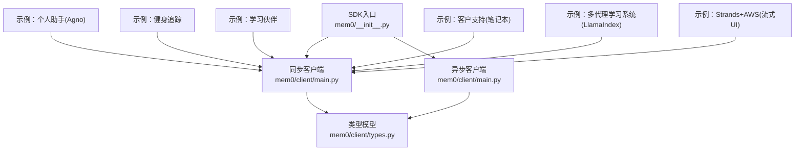
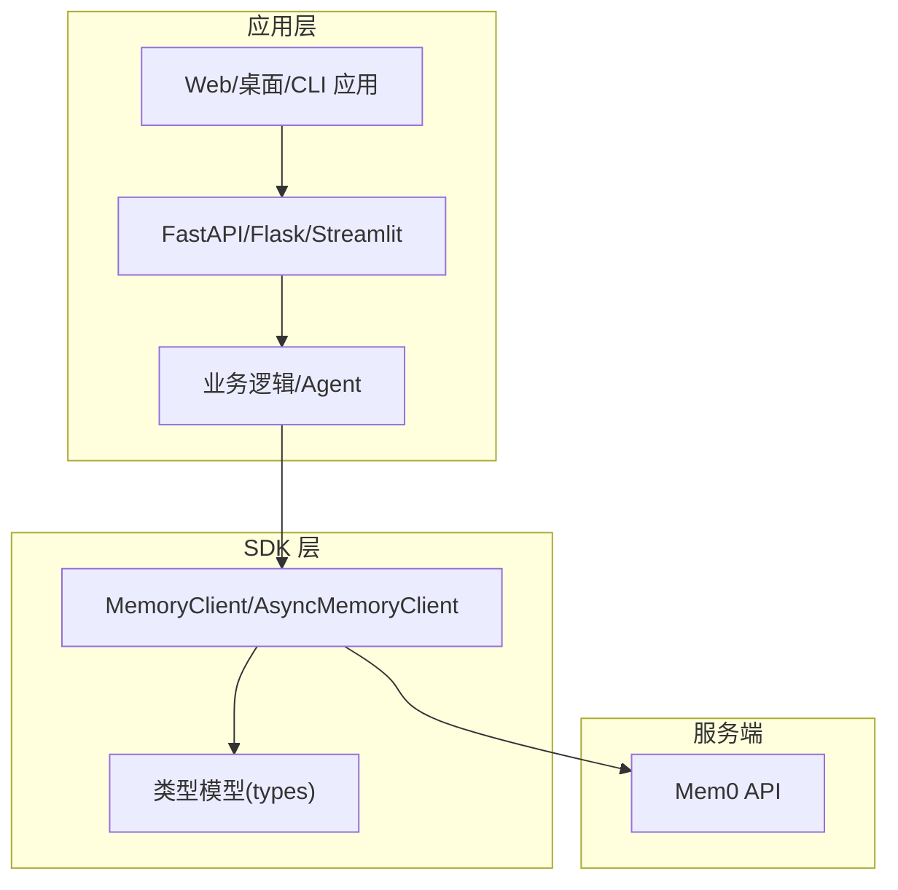
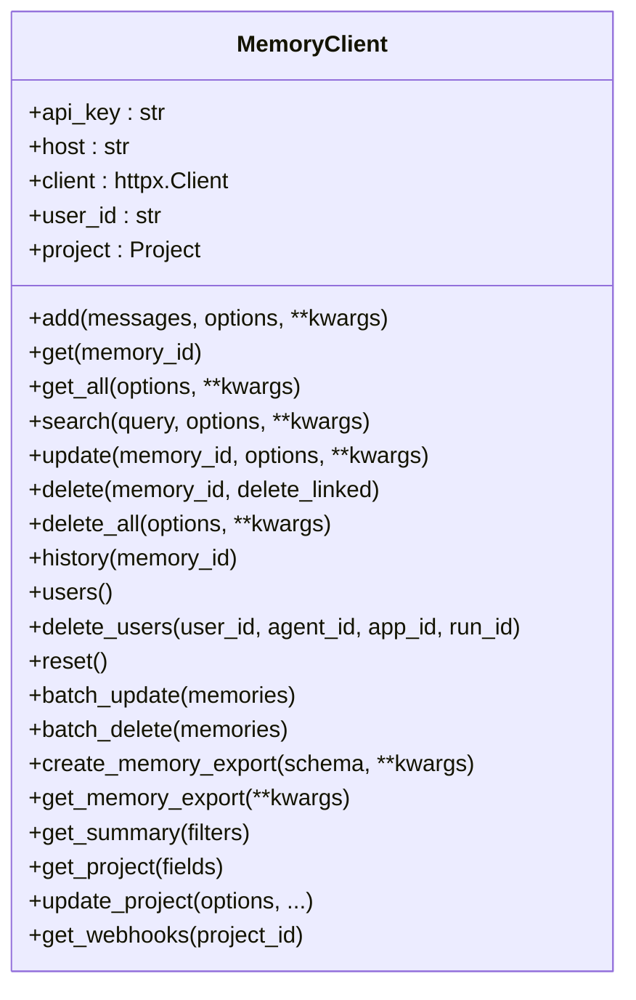
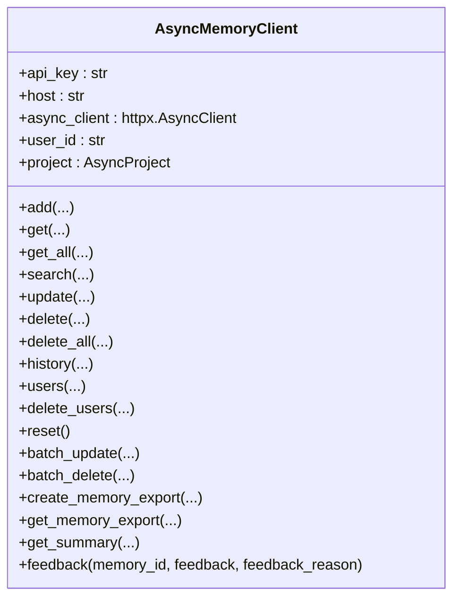
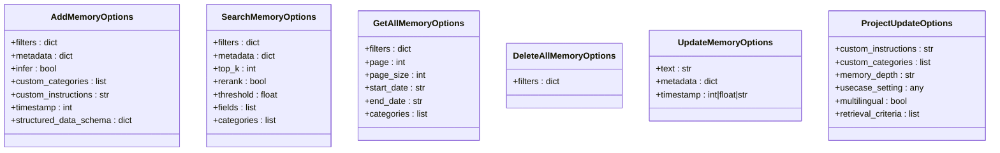
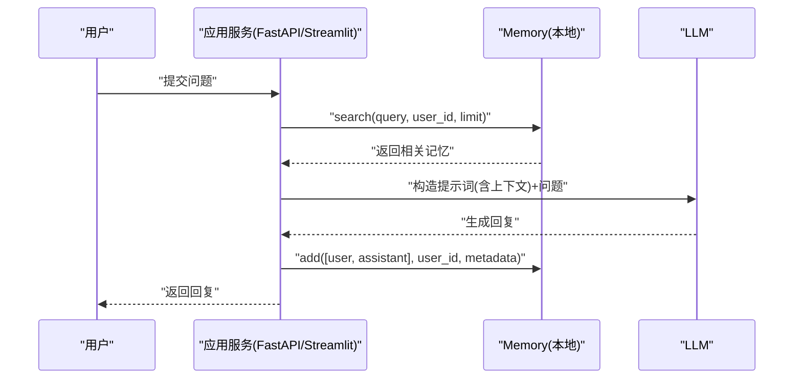
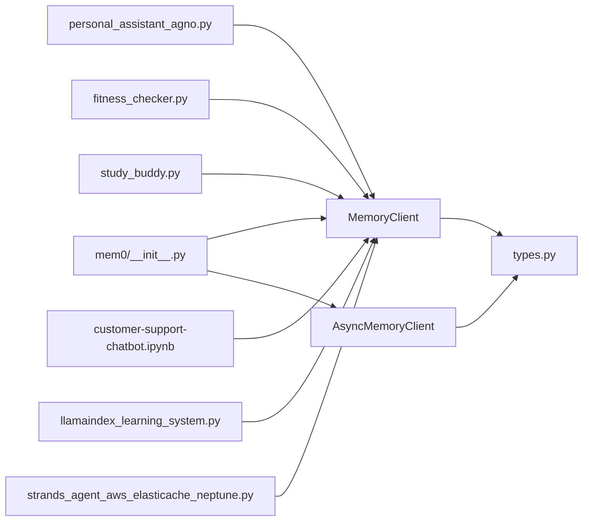

# 集成示例

<cite>
**本文引用的文件**   
- [mem0/__init__.py](file://mem0/__init__.py)
- [mem0/client/main.py](file://mem0/client/main.py)
- [mem0/client/types.py](file://mem0/client/types.py)
- [examples/misc/personal_assistant_agno.py](file://examples/misc/personal_assistant_agno.py)
- [examples/misc/fitness_checker.py](file://examples/misc/fitness_checker.py)
- [examples/misc/study_buddy.py](file://examples/misc/study_buddy.py)
- [examples/notebooks/customer-support-chatbot.ipynb](file://examples/notebooks/customer-support-chatbot.ipynb)
- [examples/multiagents/llamaindex_learning_system.py](file://examples/multiagents/llamaindex_learning_system.py)
- [examples/misc/strands_agent_aws_elasticache_neptune.py](file://examples/misc/strands_agent_aws_elasticache_neptune.py)
- [LLM.md](file://LLM.md)
</cite>

## 目录
1. [简介](#简介)
2. [项目结构](#项目结构)
3. [核心组件](#核心组件)
4. [架构总览](#架构总览)
5. [详细组件分析](#详细组件分析)
6. [依赖关系分析](#依赖关系分析)
7. [性能考量](#性能考量)
8. [故障排查指南](#故障排查指南)
9. [结论](#结论)
10. [附录](#附录)

## 简介
本文件面向希望在 Python 生态中集成 Mem0 的开发者，系统化地给出与主流 Python 框架（FastAPI、Flask、Streamlit）的集成方法，覆盖聊天机器人、内容推荐、客户支持等典型场景，并提供端到端示例路径与部署建议。同时总结性能优化与扩展性要点，帮助你在生产环境中稳定高效地使用 Mem0。

## 项目结构
- SDK 入口与导出：通过包级导出同步与异步客户端类，便于直接导入使用。
- 客户端实现：提供同步与异步两类客户端，封装 HTTP 请求、参数准备、错误处理与遥测上报。
- 类型定义：为各操作提供 Pydantic 模型，确保类型安全与向后兼容。
- 示例集合：涵盖多模态助手、学习系统、客户支持、多代理协作以及与 Streamlit 的集成实践。

**图示来源**
- [mem0/__init__.py:1-7](file://mem0/__init__.py#L1-L7)
- [mem0/client/main.py:71-148](file://mem0/client/main.py#L71-L148)
- [mem0/client/types.py:15-107](file://mem0/client/types.py#L15-L107)
- [examples/misc/personal_assistant_agno.py:16](file://examples/misc/personal_assistant_agno.py#L16)
- [examples/misc/fitness_checker.py:13](file://examples/misc/fitness_checker.py#L13)
- [examples/misc/study_buddy.py:15](file://examples/misc/study_buddy.py#L15)
- [examples/notebooks/customer-support-chatbot.ipynb:11](file://examples/notebooks/customer-support-chatbot.ipynb#L11)
- [examples/multiagents/llamaindex_learning_system.py:22](file://examples/multiagents/llamaindex_learning_system.py#L22)
- [examples/misc/strands_agent_aws_elasticache_neptune.py:48](file://examples/misc/strands_agent_aws_elasticache_neptune.py#L48)

**章节来源**
- [mem0/__init__.py:1-7](file://mem0/__init__.py#L1-L7)
- [mem0/client/main.py:71-148](file://mem0/client/main.py#L71-L148)
- [mem0/client/types.py:15-107](file://mem0/client/types.py#L15-L107)

## 核心组件
- 同步客户端 MemoryClient
  - 负责与 Mem0 API 交互，提供添加、查询、更新、删除、批量操作、导出与摘要等能力。
  - 支持过滤器与分页，统一参数准备与错误处理。
- 异步客户端 AsyncMemoryClient
  - 基于 httpx.AsyncClient，提供与同步客户端一致的方法签名，适合高并发场景。
- 类型模型
  - AddMemoryOptions、SearchMemoryOptions、GetAllMemoryOptions、DeleteAllMemoryOptions、UpdateMemoryOptions、ProjectUpdateOptions 等，确保调用时的类型安全与可读性。

**章节来源**
- [mem0/client/main.py:71-809](file://mem0/client/main.py#L71-L809)
- [mem0/client/main.py:962-1809](file://mem0/client/main.py#L962-L1809)
- [mem0/client/types.py:15-107](file://mem0/client/types.py#L15-L107)

## 架构总览
下图展示了从应用层到 Mem0 API 的请求链路，以及在不同框架中的集成位置。

**图示来源**
- [mem0/client/main.py:71-148](file://mem0/client/main.py#L71-L148)
- [mem0/client/types.py:15-107](file://mem0/client/types.py#L15-L107)

## 详细组件分析

### 组件 A：同步客户端 MemoryClient
- 关键职责
  - 初始化与校验：自动读取环境变量、设置基础 URL 与认证头；首次 ping 校验 API Key 并回填组织与项目 ID。
  - 记忆管理：add/get/get_all/search/update/delete/delete_all/history/users/delete_users/reset/batch_* 等。
  - 导出与摘要：create_memory_export/get_memory_export/get_summary。
  - 项目配置：get_project/update_project（已标注弃用，建议使用 client.project.* 替代）。
- 错误处理
  - 所有公开方法均通过装饰器进行统一异常捕获与转换，便于上层框架捕获。
- 过滤与实体参数
  - v3 API 不接受 user_id/agent_id/app_id/run_id 在顶层，必须放入 filters 字典中；客户端会在调用前进行校验与转换。

**图示来源**
- [mem0/client/main.py:71-809](file://mem0/client/main.py#L71-L809)

**章节来源**
- [mem0/client/main.py:71-809](file://mem0/client/main.py#L71-L809)

### 组件 B：异步客户端 AsyncMemoryClient
- 关键特性
  - 基于 httpx.AsyncClient，方法签名与同步版本一一对应，适合高并发与事件循环场景。
  - 提供 feedback 接口用于打点反馈。
- 使用建议
  - 在 FastAPI/Streamlit 等异步框架中优先选择 AsyncMemoryClient，避免阻塞事件循环。
  - 通过 asyncio.gather 并发调度多个记忆任务，注意后端承载能力与重试策略。

**图示来源**
- [mem0/client/main.py:962-1809](file://mem0/client/main.py#L962-L1809)

**章节来源**
- [mem0/client/main.py:962-1809](file://mem0/client/main.py#L962-L1809)

### 组件 C：类型模型（Pydantic）
- 作用
  - 为 add/search/get_all/delete_all/update 等方法提供强类型输入，兼顾 IDE 自动补全与运行时校验。
  - v3 API 要求实体参数（user_id/agent_id/app_id/run_id）必须置于 filters 中，类型模型明确约束。
- 常用模型
  - AddMemoryOptions、SearchMemoryOptions、GetAllMemoryOptions、DeleteAllMemoryOptions、UpdateMemoryOptions、ProjectUpdateOptions。

**图示来源**
- [mem0/client/types.py:15-107](file://mem0/client/types.py#L15-L107)

**章节来源**
- [mem0/client/types.py:15-107](file://mem0/client/types.py#L15-L107)

### 场景一：聊天机器人（基于 Notebook 的客户支持）
- 特点
  - 使用 Memory 实例（非 API 客户端）构建本地记忆，结合 LLM 生成回复。
  - 将历史对话以消息列表形式存储，并在新查询时检索相关上下文。
- 集成要点
  - 在 FastAPI/Streamlit 中，将 Memory 实例作为全局或会话状态持有，避免重复初始化。
  - 对搜索结果进行格式化，拼接到系统提示词中，再调用 LLM 生成回复。
- 示例路径
  - [examples/notebooks/customer-support-chatbot.ipynb](file://examples/notebooks/customer-support-chatbot.ipynb)

**图示来源**
- [examples/notebooks/customer-support-chatbot.ipynb:26-112](file://examples/notebooks/customer-support-chatbot.ipynb#L26-L112)

**章节来源**
- [examples/notebooks/customer-support-chatbot.ipynb:26-112](file://examples/notebooks/customer-support-chatbot.ipynb#L26-L112)

### 场景二：多模态个人助手（Agno + 图像）
- 特点
  - 支持文本与图像输入，将图像编码为消息并写入记忆，后续检索结合图像理解与记忆。
- 集成要点
  - 将图像转为 base64 数据流，构造多模态消息对象，传入 client.add。
  - 检索时将记忆上下文拼接至提示词，再调用多模态 LLM 生成回答。
- 示例路径
  - [examples/misc/personal_assistant_agno.py](file://examples/misc/personal_assistant_agno.py)

**章节来源**
- [examples/misc/personal_assistant_agno.py:31-75](file://examples/misc/personal_assistant_agno.py#L31-L75)

### 场景三：健身追踪与偏好记忆（Agno）
- 特点
  - 将用户健康偏好、训练计划、饮食安排等长期记忆存入 Mem0，指导个性化建议。
- 集成要点
  - 使用 MemoryClient.add 存储对话历史；search 检索过去记录，拼接进提示词。
- 示例路径
  - [examples/misc/fitness_checker.py](file://examples/misc/fitness_checker.py)

**章节来源**
- [examples/misc/fitness_checker.py:27-49](file://examples/misc/fitness_checker.py#L27-L49)

### 场景四：学习伙伴（PDF/笔记上传 + 多轮对话）
- 特点
  - 支持 PDF/图片等多模态输入，自动提取并存入记忆；多轮对话中持续检索与更新。
- 集成要点
  - 将 PDF/图片消息加入 client.add；对话后再次写入“用户提问+助手回答”的记录。
- 示例路径
  - [examples/misc/study_buddy.py](file://examples/misc/study_buddy.py)

**章节来源**
- [examples/misc/study_buddy.py:31-60](file://examples/misc/study_buddy.py#L31-L60)

### 场景五：多代理学习系统（LlamaIndex + Mem0）
- 特点
  - 两个 Agent 共享同一 Mem0Memory 上下文，实现跨代理的记忆复用与协同。
- 集成要点
  - 使用 Mem0Memory.from_client 创建共享记忆；在工作流 run 时传入 memory 参数。
- 示例路径
  - [examples/multiagents/llamaindex_learning_system.py](file://examples/multiagents/llamaindex_learning_system.py)

**章节来源**
- [examples/multiagents/llamaindex_learning_system.py:47-161](file://examples/multiagents/llamaindex_learning_system.py#L47-L161)

### 场景六：Strands + AWS（Streamlit 流式 UI）
- 特点
  - 结合 Strands Agent 与 Streamlit，构建带工具的记忆存储/检索 UI；底层使用自定义配置的 Memory。
- 集成要点
  - 在 Streamlit 页面中维护消息历史，每次输入触发 Agent 决策与工具调用，自动存储与检索记忆。
- 示例路径
  - [examples/misc/strands_agent_aws_elasticache_neptune.py](file://examples/misc/strands_agent_aws_elasticache_neptune.py)

**章节来源**
- [examples/misc/strands_agent_aws_elasticache_neptune.py:316-386](file://examples/misc/strands_agent_aws_elasticache_neptune.py#L316-L386)

## 依赖关系分析
- 包导出
  - SDK 入口导出 MemoryClient、AsyncMemoryClient、Memory、AsyncMemory，便于直接使用。
- 客户端依赖
  - MemoryClient/AsyncMemoryClient 依赖 httpx（同步/异步）、类型模型、工具函数与遥测模块。
- 示例依赖
  - 各示例根据场景引入相应第三方库（如 Agno、LlamaIndex、Anthropic、Streamlit 等）。

**图示来源**
- [mem0/__init__.py:5-6](file://mem0/__init__.py#L5-L6)
- [mem0/client/main.py:71-148](file://mem0/client/main.py#L71-L148)
- [mem0/client/types.py:15-107](file://mem0/client/types.py#L15-L107)
- [examples/misc/personal_assistant_agno.py:16](file://examples/misc/personal_assistant_agno.py#L16)
- [examples/misc/fitness_checker.py:13](file://examples/misc/fitness_checker.py#L13)
- [examples/misc/study_buddy.py:15](file://examples/misc/study_buddy.py#L15)
- [examples/notebooks/customer-support-chatbot.ipynb:11](file://examples/notebooks/customer-support-chatbot.ipynb#L11)
- [examples/multiagents/llamaindex_learning_system.py:22](file://examples/multiagents/llamaindex_learning_system.py#L22)
- [examples/misc/strands_agent_aws_elasticache_neptune.py:48](file://examples/misc/strands_agent_aws_elasticache_neptune.py#L48)

**章节来源**
- [mem0/__init__.py:5-6](file://mem0/__init__.py#L5-L6)
- [mem0/client/main.py:71-148](file://mem0/client/main.py#L71-L148)
- [mem0/client/types.py:15-107](file://mem0/client/types.py#L15-L107)

## 性能考量
- 并发与异步
  - 在高并发场景优先使用 AsyncMemoryClient，配合 asyncio.gather 并发执行多个记忆操作。
- 连接与超时
  - 同步客户端默认超时时间较长，异步客户端亦具备合理超时配置；根据网络状况调整。
- 批量操作
  - 使用 batch_update/batch_delete 减少往返次数，提升吞吐。
- 搜索与排序
  - 合理设置 top_k、阈值与 rerank，平衡召回质量与延迟。
- 缓存与会话
  - 在应用层缓存常用用户上下文，减少重复检索；在 Streamlit/FastAPI 中复用客户端实例。
- 遥测与可观测性
  - 客户端内置遥测事件采集，可用于监控调用频率、错误分布与耗时趋势。

[本节为通用性能建议，不直接分析具体文件]

## 故障排查指南
- API Key 无效或未设置
  - 同步客户端在初始化时会发起一次校验请求；若失败会抛出错误，检查环境变量与密钥有效性。
- 顶层实体参数错误
  - v3 API 不允许在顶层传递 user_id/agent_id/app_id/run_id，请将其放入 filters。
- 方法未实现或弃用
  - chat() 方法当前未实现；get_project()/update_project() 已标记弃用，建议改用 client.project.*。
- 错误处理
  - 所有公开方法均通过统一装饰器进行异常捕获，上层框架可按需捕获并记录。

**章节来源**
- [mem0/client/main.py:149-171](file://mem0/client/main.py#L149-L171)
- [mem0/client/main.py:308-314](file://mem0/client/main.py#L308-L314)
- [mem0/client/main.py:781-787](file://mem0/client/main.py#L781-L787)
- [mem0/client/main.py:691-708](file://mem0/client/main.py#L691-L708)

## 结论
通过本指南，你可以在多种 Python 框架与应用场景中快速集成 Mem0：在 FastAPI/Streamlit 中以同步或异步方式访问记忆 API，在多模态与多代理场景中发挥记忆的上下文增强能力。建议优先采用异步客户端与批量接口，结合合理的超时与重试策略，确保在高并发下的稳定性与性能。

## 附录

### 部署与运行指引（示例参考）
- 客户端初始化与 API Key 设置
  - 在环境变量中设置 MEM0_API_KEY；如需自定义主机地址，可在初始化时传入 host。
- 快速开始（示例路径）
  - 聊天机器人（Notebook）：[examples/notebooks/customer-support-chatbot.ipynb](file://examples/notebooks/customer-support-chatbot.ipynb)
  - 个人助手（Agno）：[examples/misc/personal_assistant_agno.py](file://examples/misc/personal_assistant_agno.py)
  - 健身追踪：[examples/misc/fitness_checker.py](file://examples/misc/fitness_checker.py)
  - 学习伙伴：[examples/misc/study_buddy.py](file://examples/misc/study_buddy.py)
  - 多代理学习系统：[examples/multiagents/llamaindex_learning_system.py](file://examples/multiagents/llamaindex_learning_system.py)
  - Strands + AWS（Streamlit）：[examples/misc/strands_agent_aws_elasticache_neptune.py](file://examples/misc/strands_agent_aws_elasticache_neptune.py)
- Streamlit 示例片段
  - 参考文档片段：[LLM.md](file://LLM.md) 中的 Streamlit 示例段落。

**章节来源**
- [examples/notebooks/customer-support-chatbot.ipynb:8-18](file://examples/notebooks/customer-support-chatbot.ipynb#L8-L18)
- [examples/misc/personal_assistant_agno.py:4-7](file://examples/misc/personal_assistant_agno.py#L4-L7)
- [examples/misc/fitness_checker.py:5-8](file://examples/misc/fitness_checker.py#L5-L8)
- [examples/misc/study_buddy.py:6-9](file://examples/misc/study_buddy.py#L6-L9)
- [examples/multiagents/llamaindex_learning_system.py:4-8](file://examples/multiagents/llamaindex_learning_system.py#L4-L8)
- [examples/misc/strands_agent_aws_elasticache_neptune.py:18-40](file://examples/misc/strands_agent_aws_elasticache_neptune.py#L18-L40)
- [LLM.md:1088-1131](file://LLM.md#L1088-L1131)