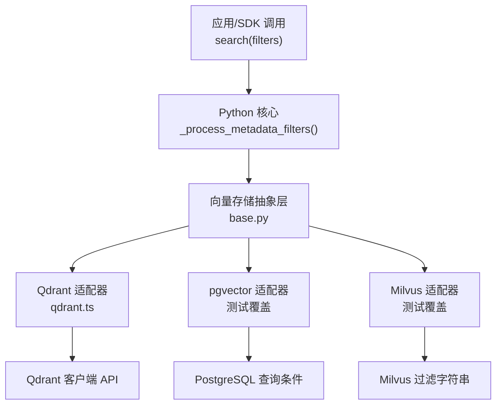
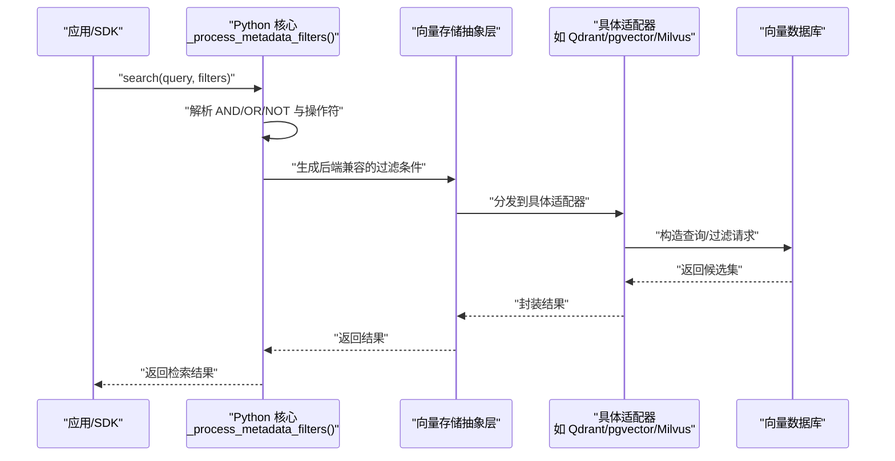
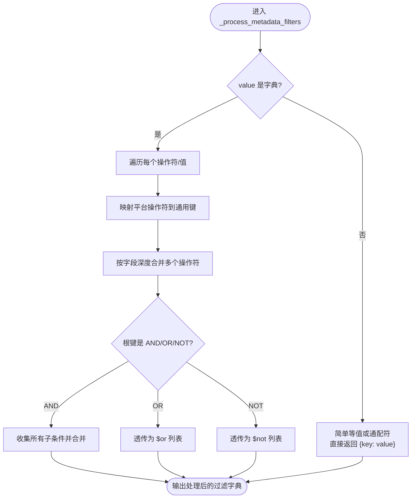
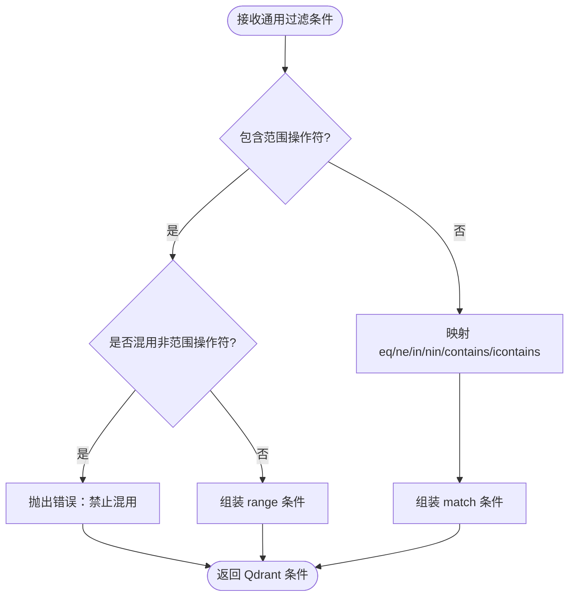
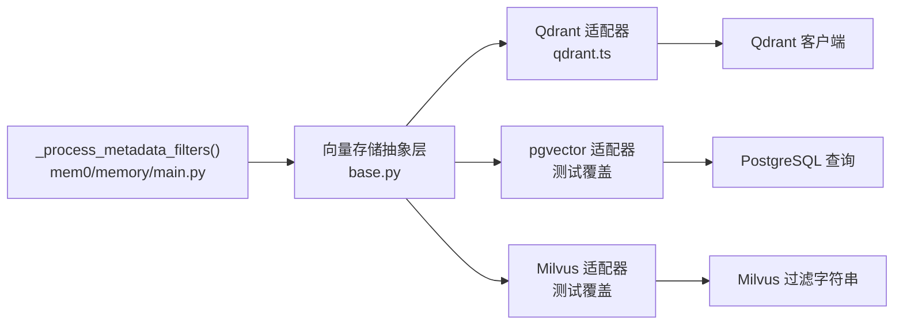

# 元数据过滤

<cite>
**本文引用的文件**
- [mem0/memory/main.py](file://mem0/memory/main.py)
- [mem0-ts/src/oss/src/vector_stores/qdrant.ts](file://mem0-ts/src/oss/src/vector_stores/qdrant.ts)
- [tests/vector_stores/test_pgvector.py](file://tests/vector_stores/test_pgvector.py)
- [tests/vector_stores/test_qdrant.py](file://tests/vector_stores/test_qdrant.py)
- [tests/vector_stores/test_milvus.py](file://tests/vector_stores/test_milvus.py)
- [docs/open-source/features/metadata-filtering.mdx](file://docs/open-source/features/metadata-filtering.mdx)
- [docs/platform/features/v2-memory-filters.mdx](file://docs/platform/features/v2-memory-filters.mdx)
- [mem0/client/main.py](file://mem0/client/main.py)
- [mem0/vector_stores/base.py](file://mem0/vector_stores/base.py)
</cite>

## 目录
1. [简介](#简介)
2. [项目结构](#项目结构)
3. [核心组件](#核心组件)
4. [架构总览](#架构总览)
5. [详细组件分析](#详细组件分析)
6. [依赖关系分析](#依赖关系分析)
7. [性能考虑](#性能考虑)
8. [故障排查指南](#故障排查指南)
9. [结论](#结论)
10. [附录](#附录)

## 简介
本文件系统性阐述 Mem0 的元数据过滤能力：如何通过元数据字段进行精确记忆检索与过滤；元数据结构设计、索引策略与查询语法；复杂过滤条件（AND/OR/NOT 组合、范围查询、子串匹配）的构建方法；以及在不同向量数据库上的实现差异与优化建议。文档同时给出面向真实场景的示例与最佳实践。

## 项目结构
围绕“元数据过滤”的关键代码分布在以下模块：
- Python 核心：元数据过滤解析与转换逻辑位于内存主流程中，负责把平台统一的过滤语法转为各向量存储可执行的形式。
- TypeScript 向量存储适配：以 Qdrant 为例，将通用过滤条件映射到具体客户端 API。
- 测试用例：覆盖 PostgreSQL/pgvector、Qdrant、Milvus 等后端的过滤行为与边界条件。
- 文档：提供操作符速查、示例与限制说明。

图表来源
- [mem0/memory/main.py:1373-1460](file://mem0/memory/main.py#L1373-L1460)
- [mem0-ts/src/oss/src/vector_stores/qdrant.ts:130-164](file://mem0-ts/src/oss/src/vector_stores/qdrant.ts#L130-L164)
- [mem0/vector_stores/base.py:70-90](file://mem0/vector_stores/base.py#L70-L90)
- [tests/vector_stores/test_pgvector.py:2433-2459](file://tests/vector_stores/test_pgvector.py#L2433-L2459)
- [tests/vector_stores/test_milvus.py:86-108](file://tests/vector_stores/test_milvus.py#L86-L108)
- [tests/vector_stores/test_qdrant.py:577-598](file://tests/vector_stores/test_qdrant.py#L577-L598)

章节来源
- [mem0/memory/main.py:1373-1460](file://mem0/memory/main.py#L1373-L1460)
- [mem0-ts/src/oss/src/vector_stores/qdrant.ts:130-164](file://mem0-ts/src/oss/src/vector_stores/qdrant.ts#L130-L164)
- [mem0/vector_stores/base.py:70-90](file://mem0/vector_stores/base.py#L70-L90)
- [tests/vector_stores/test_pgvector.py:2433-2459](file://tests/vector_stores/test_pgvector.py#L2433-L2459)
- [tests/vector_stores/test_milvus.py:86-108](file://tests/vector_stores/test_milvus.py#L86-L108)
- [tests/vector_stores/test_qdrant.py:577-598](file://tests/vector_stores/test_qdrant.py#L577-L598)

## 核心组件
- 元数据过滤处理器：将平台统一的过滤语法（含比较、范围、集合、文本匹配、通配符与逻辑运算）转换为各向量存储可执行的条件。
- 向量存储适配器：将通用条件映射到具体后端 API 或 SQL/过滤字符串。
- SDK/客户端入口：对外暴露 search(filters) 接口，内部委托核心处理与存储查询。

章节来源
- [mem0/memory/main.py:1373-1460](file://mem0/memory/main.py#L1373-L1460)
- [mem0/client/main.py:181-181](file://mem0/client/main.py#L181-L181)
- [mem0/client/main.py:1113-1113](file://mem0/client/main.py#L1113-L1113)
- [mem0/vector_stores/base.py:70-90](file://mem0/vector_stores/base.py#L70-L90)

## 架构总览
下图展示了从应用调用到向量存储执行的整体链路，以及元数据过滤的关键节点。

图表来源
- [mem0/memory/main.py:1373-1460](file://mem0/memory/main.py#L1373-L1460)
- [mem0-ts/src/oss/src/vector_stores/qdrant.ts:130-164](file://mem0-ts/src/oss/src/vector_stores/qdrant.ts#L130-L164)
- [mem0/vector_stores/base.py:70-90](file://mem0/vector_stores/base.py#L70-L90)

## 详细组件分析

### 元数据过滤语法与语义
- 比较操作符：eq/ne/gt/gte/lt/lte，用于数值或可排序字段的精确/区间筛选。
- 集合操作符：in/nin，用于白名单/黑名单快速筛选。
- 文本匹配：contains（区分大小写）、icontains（不区分大小写）。
- 通配符：* 表示该字段存在且非空。
- 逻辑运算：AND（隐式与显式）、OR、NOT；支持嵌套组合。
- 默认等值：未显式指定时，默认 eq 语义。

章节来源
- [docs/open-source/features/metadata-filtering.mdx:14-24](file://docs/open-source/features/metadata-filtering.mdx#L14-L24)
- [docs/platform/features/v2-memory-filters.mdx:394-433](file://docs/platform/features/v2-memory-filters.mdx#L394-L433)

### Python 核心：过滤解析与转换
- 将输入 filters 规范化为统一格式，支持裸键值（等价 eq）、字典形式（带操作符）与逻辑运算根节点（AND/OR/NOT）。
- 对同一字段多操作符进行合并（深度合并），避免重复键冲突。
- 将 OR/NOT 以特定键名透传给适配器，由后端决定是否原生支持。
- 不支持的操作符会抛出错误，保证语义清晰。

图表来源
- [mem0/memory/main.py:1373-1460](file://mem0/memory/main.py#L1373-L1460)
- [mem0/memory/main.py:2929-2950](file://mem0/memory/main.py#L2929-L2950)

章节来源
- [mem0/memory/main.py:1373-1460](file://mem0/memory/main.py#L1373-L1460)
- [mem0/memory/main.py:2929-2950](file://mem0/memory/main.py#L2929-L2950)

### TypeScript 适配器：Qdrant 映射
- 范围类操作符（gt/gte/lt/lte）必须独立使用，不可与非范围操作符混用；若混用将报错。
- 比较类操作符映射为 match/value/except/any 等结构。
- contains/icontains 映射为文本匹配。
- 适配器负责将通用条件转换为 Qdrant 的 Filter 结构。

图表来源
- [mem0-ts/src/oss/src/vector_stores/qdrant.ts:130-164](file://mem0-ts/src/oss/src/vector_stores/qdrant.ts#L130-L164)

章节来源
- [mem0-ts/src/oss/src/vector_stores/qdrant.ts:130-164](file://mem0-ts/src/oss/src/vector_stores/qdrant.ts#L130-L164)

### 向量存储适配差异与测试验证
- pgvector（PostgreSQL 扩展）：
  - icontains 会正确转义 SQL 通配符字符。
  - 通配符 * 通过 JSONB 键存在性判断实现。
  - 列表简写（数组）映射为 ANY 子查询。
  - OR 条件会被包裹并在 SQL 中拼接。
- Milvus：
  - 字符串/数值键值过滤以 metadata["key"] == value 形式拼接。
  - 多条件默认以 and 连接。
- Qdrant：
  - 支持 eq/ne/in/nin/range/text 等丰富类型。
  - OR/NOT 通过 should/must_not 去重保留优先级键（OR/NOT 胜过 $or/$not）。

章节来源
- [tests/vector_stores/test_pgvector.py:2433-2459](file://tests/vector_stores/test_pgvector.py#L2433-L2459)
- [tests/vector_stores/test_milvus.py:86-108](file://tests/vector_stores/test_milvus.py#L86-L108)
- [tests/vector_stores/test_qdrant.py:577-598](file://tests/vector_stores/test_qdrant.py#L577-L598)
- [tests/vector_stores/test_qdrant.py:887-920](file://tests/vector_stores/test_qdrant.py#L887-L920)

### 复杂过滤条件构建方法
- AND/OR/NOT 组合：在根层级使用 AND/OR/NOT 包裹多个子条件；支持嵌套。
- 范围查询：对数值/时间戳使用 gt/gte/lt/lte；注意某些后端（如 Qdrant）不允许与非范围操作符混用。
- 正则表达式：当前未提供原生正则匹配；可通过 icontains/contains 实现子串匹配，必要时结合业务侧二次过滤。
- 通配符：使用 "*" 表示字段存在且非空；注意 null 值不会被匹配。

章节来源
- [docs/open-source/features/metadata-filtering.mdx:14-24](file://docs/open-source/features/metadata-filtering.mdx#L14-L24)
- [docs/platform/features/v2-memory-filters.mdx:394-433](file://docs/platform/features/v2-memory-filters.mdx#L394-L433)
- [mem0-ts/src/oss/src/vector_stores/qdrant.ts:130-164](file://mem0-ts/src/oss/src/vector_stores/qdrant.ts#L130-L164)

### 实际应用场景示例
- 用户偏好检索：按 user_id 精确匹配，并限定 category 为偏好类别。
- 最近高分活动：按 user_id 筛选，score > 阈值，priority >= 某值，confidence < 阈值。
- 多分类内容：使用 in/nin 快速选择/排除多个类别。
- 文本关键词：使用 icontains 在 keywords 中模糊匹配。
- 时间窗口：结合时间字段的范围查询（如创建时间/更新时间）。
- 复合逻辑：在 AND 下组合用户身份与 OR 的多类别分支。

章节来源
- [docs/open-source/features/metadata-filtering.mdx:27-89](file://docs/open-source/features/metadata-filtering.mdx#L27-L89)
- [docs/platform/features/v2-memory-filters.mdx:108-178](file://docs/platform/features/v2-memory-filters.mdx#L108-L178)

## 依赖关系分析
- Python 核心依赖向量存储抽象层，后者再委派到具体适配器。
- TypeScript 适配器直接对接后端客户端 API。
- 测试用例覆盖多后端行为，确保跨实现一致性与边界处理。

图表来源
- [mem0/memory/main.py:1373-1460](file://mem0/memory/main.py#L1373-L1460)
- [mem0/vector_stores/base.py:70-90](file://mem0/vector_stores/base.py#L70-L90)
- [mem0-ts/src/oss/src/vector_stores/qdrant.ts:130-164](file://mem0-ts/src/oss/src/vector_stores/qdrant.ts#L130-L164)
- [tests/vector_stores/test_pgvector.py:2433-2459](file://tests/vector_stores/test_pgvector.py#L2433-L2459)
- [tests/vector_stores/test_milvus.py:86-108](file://tests/vector_stores/test_milvus.py#L86-L108)

## 性能考虑
- 操作符混合限制：范围类操作符不得与非范围类混用（以避免歧义与低效执行计划），请拆分为多个条件并通过 AND 组合。
- 逻辑运算开销：OR 条件通常需要更昂贵的并集操作，建议尽量减少 OR 分支数量或先用 AND 缩小候选集。
- 文本匹配成本：contains/icontains 可能触发全表扫描或索引回退，建议配合前缀/关键词索引或先用范围/集合过滤缩小规模。
- 通配符与空值：* 仅匹配非空字段，避免对大量 null 记录进行无意义扫描。
- 向量检索前置：优先用强过滤条件（实体 ID、时间窗、类别）缩小候选集，再进行向量相似度检索，可显著降低计算量。

章节来源
- [mem0-ts/src/oss/src/vector_stores/qdrant.ts:130-164](file://mem0-ts/src/oss/src/vector_stores/qdrant.ts#L130-L164)
- [docs/platform/features/v2-memory-filters.mdx:394-433](file://docs/platform/features/v2-memory-filters.mdx#L394-L433)

## 故障排查指南
- 混合范围操作符报错：当对同一字段同时出现范围与非范围操作符时会抛错。请将它们拆分为独立条件并通过 AND 组合。
- OR/NOT 重复键问题：后端会去重并保留优先级键（例如 OR 与 $or 同时出现时，OR 生效）。请统一使用一种表示法。
- icontains 通配符转义：在 pgvector 场景下，特殊字符会被转义，确保预期匹配。
- 通配符 * 的行为：仅匹配非空字段，null 值不会被包含。
- 嵌套逻辑校验：AND/OR/NOT 的子条件必须为列表且非空；否则会抛出参数错误。

章节来源
- [mem0-ts/src/oss/src/vector_stores/qdrant.ts:130-164](file://mem0-ts/src/oss/src/vector_stores/qdrant.ts#L130-L164)
- [tests/vector_stores/test_qdrant.py:887-920](file://tests/vector_stores/test_qdrant.py#L887-L920)
- [tests/vector_stores/test_pgvector.py:2433-2459](file://tests/vector_stores/test_pgvector.py#L2433-L2459)
- [tests/vector_stores/test_qdrant.py:844-863](file://tests/vector_stores/test_qdrant.py#L844-L863)

## 结论
Mem0 的元数据过滤通过统一的解析与转换机制，将复杂的过滤需求映射到多种向量存储后端。合理使用比较、范围、集合与文本匹配操作符，并结合 AND/OR/NOT 构建复合条件，可在保证可读性的同时获得高效检索。针对不同后端的限制（如范围操作符混用限制、OR/NOT 去重规则）进行规避，是稳定与高性能检索的关键。

## 附录

### 操作符速查与示例路径
- 操作符速查与示例：见文档章节
  - [docs/open-source/features/metadata-filtering.mdx:14-24](file://docs/open-source/features/metadata-filtering.mdx#L14-L24)
  - [docs/open-source/features/metadata-filtering.mdx:27-89](file://docs/open-source/features/metadata-filtering.mdx#L27-L89)
- 平台过滤与限制说明：见文档章节
  - [docs/platform/features/v2-memory-filters.mdx:108-178](file://docs/platform/features/v2-memory-filters.mdx#L108-L178)
  - [docs/platform/features/v2-memory-filters.mdx:394-433](file://docs/platform/features/v2-memory-filters.mdx#L394-L433)

### 关键实现参考路径
- Python 核心过滤处理
  - [mem0/memory/main.py:1373-1460](file://mem0/memory/main.py#L1373-L1460)
  - [mem0/memory/main.py:2929-2950](file://mem0/memory/main.py#L2929-L2950)
- TypeScript Qdrant 适配
  - [mem0-ts/src/oss/src/vector_stores/qdrant.ts:130-164](file://mem0-ts/src/oss/src/vector_stores/qdrant.ts#L130-L164)
- 向量存储测试验证
  - [tests/vector_stores/test_pgvector.py:2433-2459](file://tests/vector_stores/test_pgvector.py#L2433-L2459)
  - [tests/vector_stores/test_milvus.py:86-108](file://tests/vector_stores/test_milvus.py#L86-L108)
  - [tests/vector_stores/test_qdrant.py:577-598](file://tests/vector_stores/test_qdrant.py#L577-L598)
  - [tests/vector_stores/test_qdrant.py:887-920](file://tests/vector_stores/test_qdrant.py#L887-L920)