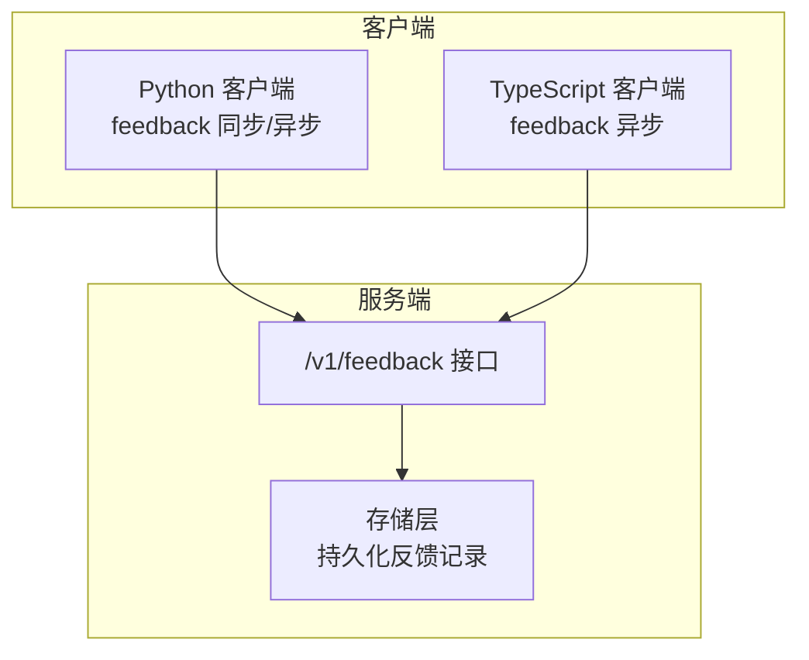
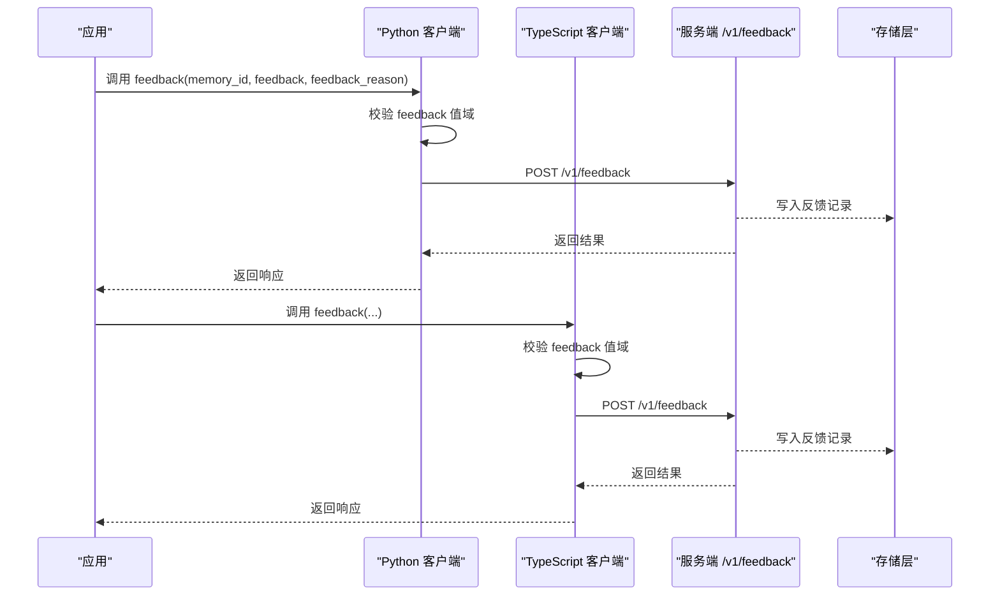
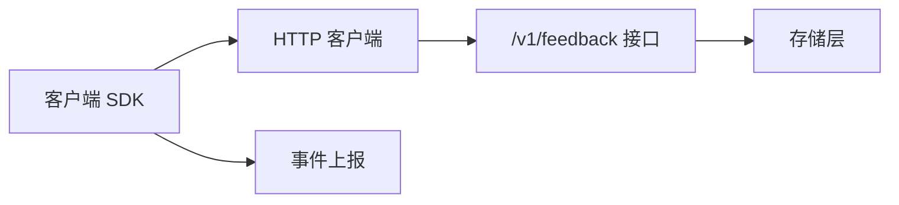

# 反馈机制

<cite>
**本文引用的文件**
- [mem0/client/main.py](file://mem0/client/main.py)
- [docs/api-reference/memory/feedback.mdx](file://docs/api-reference/memory/feedback.mdx)
- [docs/platform/features/feedback-mechanism.mdx](file://docs/platform/features/feedback-mechanism.mdx)
- [tests/test_client_feedback.py](file://tests/test_client_feedback.py)
- [docs/openapi.json](file://docs/openapi.json)
</cite>

## 目录
1. [简介](#简介)
2. [项目结构](#项目结构)
3. [核心组件](#核心组件)
4. [架构总览](#架构总览)
5. [详细组件分析](#详细组件分析)
6. [依赖关系分析](#依赖关系分析)
7. [性能考量](#性能考量)
8. [故障排查指南](#故障排查指南)
9. [结论](#结论)
10. [附录](#附录)

## 简介
本文件系统化阐述 mem0 的“反馈机制”能力：从用户反馈的采集、提交与存储，到对记忆质量的影响路径与可操作的优化策略；并给出反馈数据的分类维度、分析指标与可视化建议。文档同时覆盖错误处理、最佳实践以及自动化处理示例，帮助开发者在真实业务中落地反馈闭环。

## 项目结构
围绕反馈机制的关键位置如下：
- 客户端 SDK 提供 feedback 方法（同步与异步），负责参数校验、请求发送与事件上报
- 文档定义了反馈类型、参数与最佳实践
- OpenAPI 描述了后端接口契约
- 测试用例验证了客户端行为与事件捕获

图表来源
- [mem0/client/main.py:904-924](file://mem0/client/main.py#L904-L924)
- [mem0/client/main.py:1793-1808](file://mem0/client/main.py#L1793-L1808)
- [docs/openapi.json:2820-2853](file://docs/openapi.json#L2820-L2853)

章节来源
- [mem0/client/main.py:904-924](file://mem0/client/main.py#L904-L924)
- [mem0/client/main.py:1793-1808](file://mem0/client/main.py#L1793-L1808)
- [docs/openapi.json:2820-2853](file://docs/openapi.json#L2820-L2853)

## 核心组件
- 反馈提交接口
  - 支持同步与异步两种调用方式
  - 参数包括 memory_id、feedback（可选）、feedback_reason（可选）
  - feedback 值域为 POSITIVE、NEGATIVE、VERY_NEGATIVE 或空值（用于清除已有反馈）
- 错误处理
  - 对非法 feedback 值进行校验并抛出异常
  - 请求失败时由上层捕获并处理
- 事件上报
  - 调用 feedback 后会触发客户端事件捕获，便于遥测与审计

章节来源
- [mem0/client/main.py:904-924](file://mem0/client/main.py#L904-L924)
- [mem0/client/main.py:1793-1808](file://mem0/client/main.py#L1793-L1808)
- [tests/test_client_feedback.py:42-59](file://tests/test_client_feedback.py#L42-L59)

## 架构总览
下图展示了从客户端到服务端的反馈提交流程，以及与存储层的关系：

图表来源
- [mem0/client/main.py:904-924](file://mem0/client/main.py#L904-L924)
- [mem0/client/main.py:1793-1808](file://mem0/client/main.py#L1793-L1808)
- [docs/openapi.json:2820-2853](file://docs/openapi.json#L2820-L2853)

## 详细组件分析

### 反馈提交接口（Python 同步）
- 功能要点
  - 参数校验：feedback 必须为指定枚举之一或空
  - 组装 JSON 请求体并调用 HTTP 客户端
  - 成功后上报客户端事件
- 典型调用路径
  - [feedback 同步实现:904-924](file://mem0/client/main.py#L904-L924)

章节来源
- [mem0/client/main.py:904-924](file://mem0/client/main.py#L904-L924)

### 反馈提交接口（Python 异步）
- 功能要点
  - 与同步版本一致的参数校验与事件上报
  - 使用异步 HTTP 客户端发起请求
- 典型调用路径
  - [feedback 异步实现:1793-1808](file://mem0/client/main.py#L1793-L1808)

章节来源
- [mem0/client/main.py:1793-1808](file://mem0/client/main.py#L1793-L1808)

### 反馈提交接口（OpenAPI 描述）
- 关键信息
  - 接口：POST /v1/feedback
  - 必填项：memory_id
  - 可选项：feedback（枚举）、feedback_reason
- 典型调用路径
  - [OpenAPI 反馈接口定义:2820-2853](file://docs/openapi.json#L2820-L2853)

章节来源
- [docs/openapi.json:2820-2853](file://docs/openapi.json#L2820-L2853)

### 反馈类型与参数规范
- 反馈类型
  - POSITIVE：有用
  - NEGATIVE：无用
  - VERY_NEGATIVE：完全无用
- 参数
  - memory_id：必填
  - feedback：可选（为空表示清除反馈）
  - feedback_reason：可选（建议具体、可操作）
- 典型调用路径
  - [平台特性文档（含类型与参数）:40-60](file://docs/platform/features/feedback-mechanism.mdx#L40-L60)

章节来源
- [docs/platform/features/feedback-mechanism.mdx:40-60](file://docs/platform/features/feedback-mechanism.mdx#L40-L60)

### 最佳实践与错误处理
- 何时提供反馈
  - 检索后即时评估
  - 用户交互中显式反馈
  - 基于业务指标的自动评估
- 如何写好反馈原因
  - 避免模糊描述，尽量具体
- 错误处理
  - 记忆不存在、API 错误等异常场景
- 典型调用路径
  - [最佳实践与错误处理:117-193](file://docs/platform/features/feedback-mechanism.mdx#L117-L193)

章节来源
- [docs/platform/features/feedback-mechanism.mdx:117-193](file://docs/platform/features/feedback-mechanism.mdx#L117-L193)

### 测试用例验证
- 验证点
  - 正确构造请求体
  - 触发事件捕获
  - 返回值符合预期
- 典型调用路径
  - [测试用例:42-59](file://tests/test_client_feedback.py#L42-L59)

章节来源
- [tests/test_client_feedback.py:42-59](file://tests/test_client_feedback.py#L42-L59)

## 依赖关系分析
- 客户端依赖
  - HTTP 客户端库（同步/异步）
  - 事件上报模块
- 服务端依赖
  - 数据模型与序列化
  - 存储层（持久化反馈记录）

图表来源
- [mem0/client/main.py:904-924](file://mem0/client/main.py#L904-L924)
- [mem0/client/main.py:1793-1808](file://mem0/client/main.py#L1793-L1808)
- [docs/openapi.json:2820-2853](file://docs/openapi.json#L2820-L2853)

## 性能考量
- 批量反馈
  - 平台支持批量提交以降低网络开销
- 事件上报
  - 异步事件上报避免阻塞主流程
- 建议
  - 在高并发场景下采用批量提交
  - 控制 feedback_reason 的长度，减少传输体积

章节来源
- [docs/platform/features/feedback-mechanism.mdx:62-115](file://docs/platform/features/feedback-mechanism.mdx#L62-L115)

## 故障排查指南
- 常见问题
  - feedback 值不在允许集合内：检查大小写与拼写
  - 记忆不存在：确认 memory_id 是否正确
  - API 错误：查看返回状态码与消息
- 处理步骤
  - 捕获异常并记录上下文
  - 重试与降级策略（如适用）
- 典型调用路径
  - [错误处理示例:145-193](file://docs/platform/features/feedback-mechanism.mdx#L145-L193)

章节来源
- [docs/platform/features/feedback-mechanism.mdx:145-193](file://docs/platform/features/feedback-mechanism.mdx#L145-L193)

## 结论
反馈机制是提升记忆系统准确性与相关性的关键闭环。通过标准化的反馈类型、清晰的参数约定与完善的错误处理，结合批量提交与事件上报，可在保证性能的同时获得可观的质量收益。建议在产品中建立“即时评估—明确原因—持续优化”的反馈文化，并配合可视化与趋势分析推动迭代。

## 附录

### 反馈数据存储结构与分类
- 存储字段（基于接口定义）
  - memory_id：记忆标识
  - feedback：反馈类型（POSITIVE/NEGATIVE/VERY_NEGATIVE/空）
  - feedback_reason：反馈原因（字符串）
- 分类方法
  - 按类型分组统计正负向分布
  - 按时间窗口聚合趋势
  - 按业务维度（如来源、主题）交叉分析
- 分析维度建议
  - 反馈完成率：已反馈的记忆占检索到的记忆比例
  - 反馈分布：正/负/极负的比例
  - 质量趋势：随时间推移的准确率变化
  - 用户满意度：与外部指标的相关性

章节来源
- [docs/openapi.json:2820-2853](file://docs/openapi.json#L2820-L2853)
- [docs/platform/features/feedback-mechanism.mdx:195-202](file://docs/platform/features/feedback-mechanism.mdx#L195-L202)

### 反馈驱动的记忆优化策略
- 相关性调整
  - 将“正向反馈”作为增强信号，“负向/极负反馈”作为削弱信号
- 权重更新
  - 对反馈样本加权，提高代表性与稳定性
- 检索算法改进
  - 引入反馈信号到打分函数，动态调整相似度权重
  - 结合时间衰减与置信度修正
- 自动化处理示例
  - 批量提交：遍历反馈列表逐条提交
  - 清除反馈：传入 feedback 为空值
- 典型调用路径
  - [批量提交示例:62-115](file://docs/platform/features/feedback-mechanism.mdx#L62-L115)
  - [清除反馈示例:58-60](file://docs/platform/features/feedback-mechanism.mdx#L58-L60)

章节来源
- [docs/platform/features/feedback-mechanism.mdx:58-60](file://docs/platform/features/feedback-mechanism.mdx#L58-L60)
- [docs/platform/features/feedback-mechanism.mdx:62-115](file://docs/platform/features/feedback-mechanism.mdx#L62-L115)

### 可视化与趋势分析
- 指标建议
  - 反馈完成率、反馈分布、质量趋势、用户满意度
- 实现建议
  - 周/月维度折线图追踪趋势
  - 饼图/柱状图展示分布
  - 仪表盘联动展示多维指标
- 典型调用路径
  - [分析指标建议:195-202](file://docs/platform/features/feedback-mechanism.mdx#L195-L202)

章节来源
- [docs/platform/features/feedback-mechanism.mdx:195-202](file://docs/platform/features/feedback-mechanism.mdx#L195-L202)