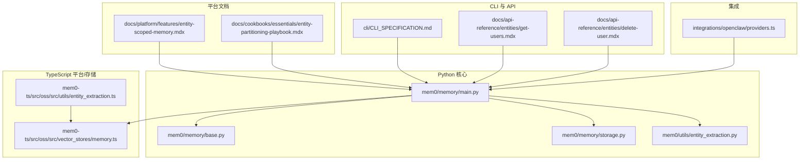
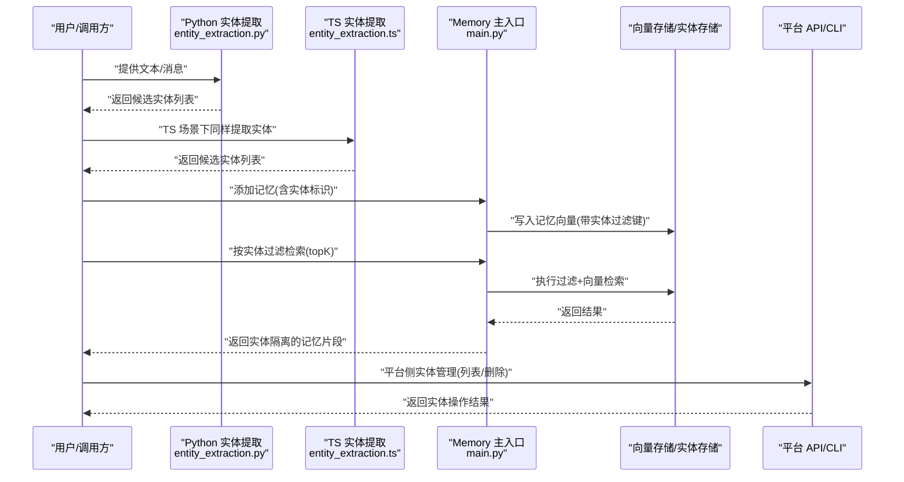
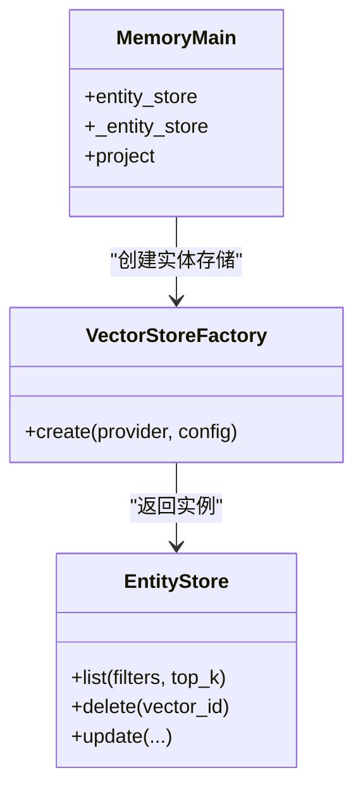
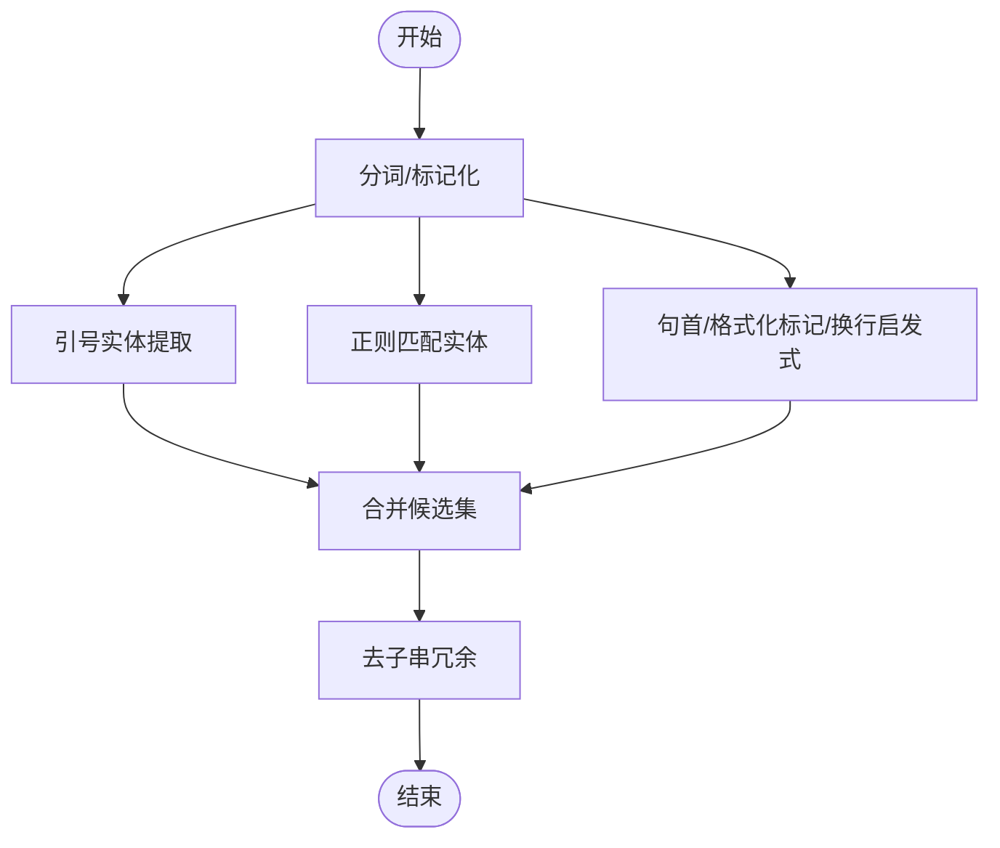
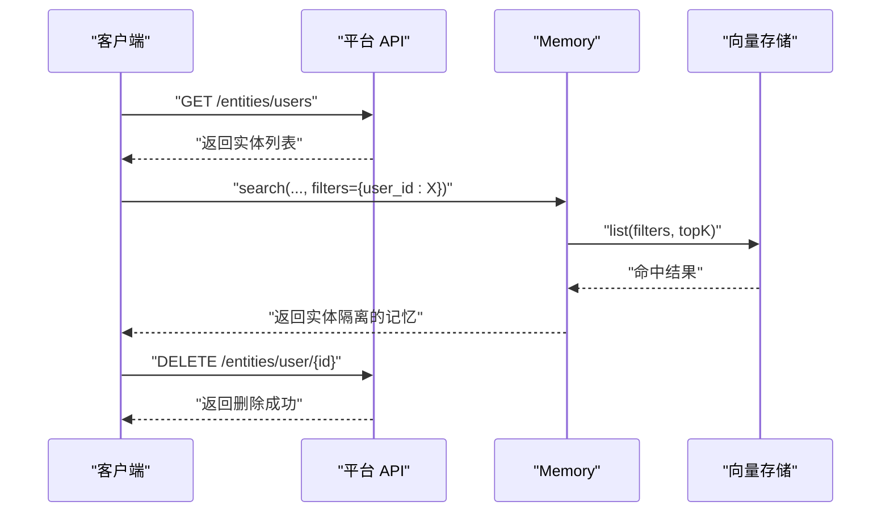
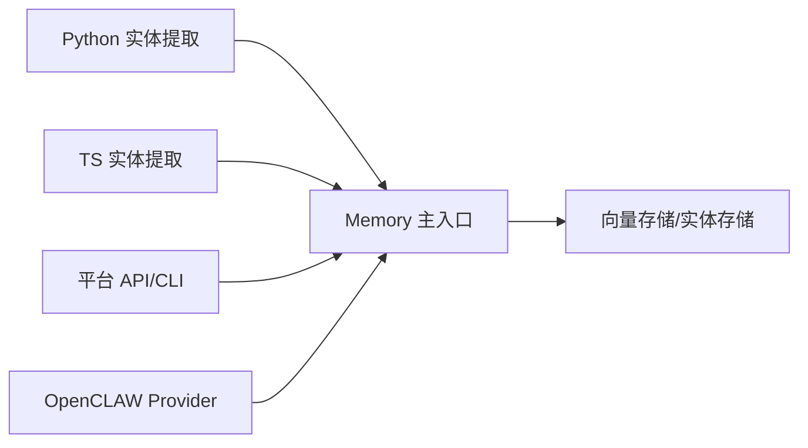

# 实体分区

<cite>
**本文引用的文件**
- [mem0/memory/main.py](file://mem0/memory/main.py)
- [mem0/utils/entity_extraction.py](file://mem0/utils/entity_extraction.py)
- [mem0-ts/src/oss/src/utils/entity_extraction.ts](file://mem0-ts/src/oss/src/utils/entity_extraction.ts)
- [integrations/openclaw/providers.ts](file://integrations/openclaw/providers.ts)
- [docs/cookbooks/essentials/entity-partitioning-playbook.mdx](file://docs/cookbooks/essentials/entity-partitioning-playbook.mdx)
- [docs/platform/features/entity-scoped-memory.mdx](file://docs/platform/features/entity-scoped-memory.mdx)
- [docs/api-reference/entities/get-users.mdx](file://docs/api-reference/entities/get-users.mdx)
- [docs/api-reference/entities/delete-user.mdx](file://docs/api-reference/entities/delete-user.mdx)
- [cli/CLI_SPECIFICATION.md](file://cli/CLI_SPECIFICATION.md)
- [mem0-ts/src/oss/src/vector_stores/memory.ts](file://mem0-ts/src/oss/src/vector_stores/memory.ts)
- [mem0/memory/base.py](file://mem0/memory/base.py)
- [mem0/memory/storage.py](file://mem0/memory/storage.py)
- [tests/utils/test_entity_extraction.py](file://tests/utils/test_entity_extraction.py)
</cite>

## 目录
1. [简介](#简介)
2. [项目结构](#项目结构)
3. [核心组件](#核心组件)
4. [架构总览](#架构总览)
5. [详细组件分析](#详细组件分析)
6. [依赖关系分析](#依赖关系分析)
7. [性能考量](#性能考量)
8. [故障排查指南](#故障排查指南)
9. [结论](#结论)
10. [附录](#附录)

## 简介
本文件系统性阐述“实体分区”能力：如何围绕实体（如用户、项目、组织）对记忆进行分区管理，包括实体提取算法、分区策略与命名空间隔离机制；提供配置方法、查询限制与性能影响分析，并总结多实体场景下的最佳实践（跨实体检索、实体关联与权限控制），最后给出实际应用示例与使用模式。

## 项目结构
与实体分区直接相关的关键模块分布如下：
- Python 后端与核心逻辑：mem0/memory/main.py、mem0/memory/base.py、mem0/memory/storage.py、mem0/utils/entity_extraction.py
- TypeScript 前端/平台侧：mem0-ts/src/oss/src/utils/entity_extraction.ts、mem0-ts/src/oss/src/vector_stores/memory.ts
- 平台特性与文档：docs/platform/features/entity-scoped-memory.mdx、docs/cookbooks/essentials/entity-partitioning-playbook.mdx
- CLI 与 API 文档：docs/api-reference/entities/*.mdx、CLI_SPECIFICATION.md
- OpenCLAW 集成：integrations/openclaw/providers.ts
- 单元测试：tests/utils/test_entity_extraction.py

图表来源
- [mem0/memory/main.py:472-500](file://mem0/memory/main.py#L472-L500)
- [mem0-ts/src/oss/src/vector_stores/memory.ts:399-450](file://mem0-ts/src/oss/src/vector_stores/memory.ts#L399-L450)
- [mem0-ts/src/oss/src/utils/entity_extraction.ts:341-723](file://mem0-ts/src/oss/src/utils/entity_extraction.ts#L341-L723)
- [mem0/utils/entity_extraction.py:1-200](file://mem0/utils/entity_extraction.py#L1-L200)
- [docs/platform/features/entity-scoped-memory.mdx:1-100](file://docs/platform/features/entity-scoped-memory.mdx#L1-L100)
- [docs/cookbooks/essentials/entity-partitioning-playbook.mdx:1-100](file://docs/cookbooks/essentials/entity-partitioning-playbook.mdx#L1-L100)
- [cli/CLI_SPECIFICATION.md:55-105](file://cli/CLI_SPECIFICATION.md#L55-L105)
- [docs/api-reference/entities/get-users.mdx:1-100](file://docs/api-reference/entities/get-users.mdx#L1-L100)
- [docs/api-reference/entities/delete-user.mdx:1-100](file://docs/api-reference/entities/delete-user.mdx#L1-L100)
- [integrations/openclaw/providers.ts:355-641](file://integrations/openclaw/providers.ts#L355-L641)

章节来源
- [mem0/memory/main.py:472-500](file://mem0/memory/main.py#L472-L500)
- [mem0-ts/src/oss/src/vector_stores/memory.ts:399-450](file://mem0-ts/src/oss/src/vector_stores/memory.ts#L399-L450)
- [mem0-ts/src/oss/src/utils/entity_extraction.ts:341-723](file://mem0-ts/src/oss/src/utils/entity_extraction.ts#L341-L723)
- [mem0/utils/entity_extraction.py:1-200](file://mem0/utils/entity_extraction.py#L1-L200)
- [docs/platform/features/entity-scoped-memory.mdx:1-100](file://docs/platform/features/entity-scoped-memory.mdx#L1-L100)
- [docs/cookbooks/essentials/entity-partitioning-playbook.mdx:1-100](file://docs/cookbooks/essentials/entity-partitioning-playbook.mdx#L1-L100)
- [cli/CLI_SPECIFICATION.md:55-105](file://cli/CLI_SPECIFICATION.md#L55-L105)
- [docs/api-reference/entities/get-users.mdx:1-100](file://docs/api-reference/entities/get-users.mdx#L1-L100)
- [docs/api-reference/entities/delete-user.mdx:1-100](file://docs/api-reference/entities/delete-user.mdx#L1-L100)
- [integrations/openclaw/providers.ts:355-641](file://integrations/openclaw/providers.ts#L355-L641)

## 核心组件
- 实体存储与集合命名
  - Python 端通过延迟初始化实体存储，为每个向量数据库提供独立集合名，避免与主记忆集合冲突，同时在特定供应商（如 Qdrant）共享客户端以降低资源竞争。
  - TypeScript 端内存向量存储提供基础的增删改查与过滤能力，作为本地或轻量场景的默认实现。
- 实体提取算法
  - Python 与 TS 两端均提供实体提取工具函数，支持引号实体识别、正则匹配、上下文窗口与启发式规则等策略，最终输出去重后的候选实体列表。
- 分区策略与命名空间隔离
  - 通过在过滤器中显式传入实体标识（如 user_id、project_id、org_id）实现查询隔离；在平台模式下可使用实体管理 API 进行统一维护。
- 查询限制与性能
  - 搜索接口支持 topK 限制与过滤器组合，TS 内存存储提供简单过滤与分页；Python 端结合向量检索与过滤器实现高效分区查询。
- 权限控制与实体管理
  - 平台侧提供实体列表与删除 API；OpenCLAW 提供历史记录与兼容性处理，确保在 OSS 模式下不暴露实体管理能力。

章节来源
- [mem0/memory/main.py:472-500](file://mem0/memory/main.py#L472-L500)
- [mem0-ts/src/oss/src/vector_stores/memory.ts:399-450](file://mem0-ts/src/oss/src/vector_stores/memory.ts#L399-L450)
- [mem0/utils/entity_extraction.py:1-200](file://mem0/utils/entity_extraction.py#L1-L200)
- [mem0-ts/src/oss/src/utils/entity_extraction.ts:341-723](file://mem0-ts/src/oss/src/utils/entity_extraction.ts#L341-L723)
- [docs/api-reference/entities/get-users.mdx:1-100](file://docs/api-reference/entities/get-users.mdx#L1-L100)
- [docs/api-reference/entities/delete-user.mdx:1-100](file://docs/api-reference/entities/delete-user.mdx#L1-L100)
- [integrations/openclaw/providers.ts:355-641](file://integrations/openclaw/providers.ts#L355-L641)

## 架构总览
实体分区的整体流程：输入文本经实体提取得到候选实体，写入记忆时携带实体标识；检索时通过过滤器限定实体域，实现命名空间隔离；平台侧提供实体管理与事件能力，CLI 与 API 支持实体维度的操作。

图表来源
- [mem0/memory/main.py:472-500](file://mem0/memory/main.py#L472-L500)
- [mem0/utils/entity_extraction.py:1-200](file://mem0/utils/entity_extraction.py#L1-L200)
- [mem0-ts/src/oss/src/utils/entity_extraction.ts:341-723](file://mem0-ts/src/oss/src/utils/entity_extraction.ts#L341-L723)
- [docs/api-reference/entities/get-users.mdx:1-100](file://docs/api-reference/entities/get-users.mdx#L1-L100)
- [docs/api-reference/entities/delete-user.mdx:1-100](file://docs/api-reference/entities/delete-user.mdx#L1-L100)

## 详细组件分析

### 组件一：实体存储与集合命名
- 延迟初始化与集合隔离
  - Python 端在首次访问 entity_store 属性时，复制向量存储配置并生成独立的集合名称，避免与主记忆集合混淆；对 Qdrant 特别处理，复用现有客户端以减少锁竞争。
- TypeScript 内存存储
  - 提供 list/update/delete 等基础能力，支持按过滤器筛选与 topK 截断，适合本地开发与小规模部署。

图表来源
- [mem0/memory/main.py:472-500](file://mem0/memory/main.py#L472-L500)
- [mem0-ts/src/oss/src/vector_stores/memory.ts:399-450](file://mem0-ts/src/oss/src/vector_stores/memory.ts#L399-L450)

章节来源
- [mem0/memory/main.py:472-500](file://mem0/memory/main.py#L472-L500)
- [mem0-ts/src/oss/src/vector_stores/memory.ts:399-450](file://mem0-ts/src/oss/src/vector_stores/memory.ts#L399-L450)

### 组件二：实体提取算法
- 策略与流程
  - 引号实体、正则匹配、句子边界判断、格式化标记、上下文窗口与启发式规则综合使用；最终对候选实体去子串冗余，保留最优集合。
- 批量处理
  - 提供批量提取接口，便于流水线处理多条文本。

图表来源
- [mem0-ts/src/oss/src/utils/entity_extraction.ts:341-723](file://mem0-ts/src/oss/src/utils/entity_extraction.ts#L341-L723)
- [mem0/utils/entity_extraction.py:1-200](file://mem0/utils/entity_extraction.py#L1-L200)

章节来源
- [mem0-ts/src/oss/src/utils/entity_extraction.ts:341-723](file://mem0-ts/src/oss/src/utils/entity_extraction.ts#L341-L723)
- [mem0/utils/entity_extraction.py:1-200](file://mem0/utils/entity_extraction.py#L1-L200)
- [tests/utils/test_entity_extraction.py:1-100](file://tests/utils/test_entity_extraction.py#L1-L100)

### 组件三：分区策略与命名空间隔离
- 过滤键设计
  - 在过滤器中显式传入 user_id、project_id、org_id 等实体键，确保检索仅在目标实体范围内进行。
- 平台模式下的实体管理
  - 提供实体列表与删除 API，便于集中治理与权限控制。
- CLI 与 SDK 的一致性
  - CLI 规范中包含实体命令模块，保证与平台 API 的行为一致。

图表来源
- [docs/api-reference/entities/get-users.mdx:1-100](file://docs/api-reference/entities/get-users.mdx#L1-L100)
- [docs/api-reference/entities/delete-user.mdx:1-100](file://docs/api-reference/entities/delete-user.mdx#L1-L100)
- [cli/CLI_SPECIFICATION.md:55-105](file://cli/CLI_SPECIFICATION.md#L55-L105)

章节来源
- [docs/api-reference/entities/get-users.mdx:1-100](file://docs/api-reference/entities/get-users.mdx#L1-L100)
- [docs/api-reference/entities/delete-user.mdx:1-100](file://docs/api-reference/entities/delete-user.mdx#L1-L100)
- [cli/CLI_SPECIFICATION.md:55-105](file://cli/CLI_SPECIFICATION.md#L55-L105)

### 组件四：OpenCLAW 集成与兼容性
- 兼容性处理
  - 在 OSS 模式下禁用实体管理相关能力，避免暴露平台特性；当底层依赖异常时自动降级并提示。
- 历史记录与初始化
  - 初始化阶段进行一次探测查询以确保可用性。

章节来源
- [integrations/openclaw/providers.ts:355-641](file://integrations/openclaw/providers.ts#L355-L641)

## 依赖关系分析
- Python 端
  - Memory 主入口依赖实体提取与向量存储工厂；实体存储与主存储共享配置但使用独立集合名。
- TS 端
  - 实体提取工具与内存向量存储解耦，便于在不同运行环境中选择合适实现。
- 平台侧
  - 实体管理 API 与 CLI 命令保持一致语义，确保跨环境的一致体验。

图表来源
- [mem0/memory/main.py:472-500](file://mem0/memory/main.py#L472-L500)
- [mem0/utils/entity_extraction.py:1-200](file://mem0/utils/entity_extraction.py#L1-L200)
- [mem0-ts/src/oss/src/utils/entity_extraction.ts:341-723](file://mem0-ts/src/oss/src/utils/entity_extraction.ts#L341-L723)
- [docs/api-reference/entities/get-users.mdx:1-100](file://docs/api-reference/entities/get-users.mdx#L1-L100)
- [cli/CLI_SPECIFICATION.md:55-105](file://cli/CLI_SPECIFICATION.md#L55-L105)
- [integrations/openclaw/providers.ts:355-641](file://integrations/openclaw/providers.ts#L355-L641)

章节来源
- [mem0/memory/main.py:472-500](file://mem0/memory/main.py#L472-L500)
- [mem0/utils/entity_extraction.py:1-200](file://mem0/utils/entity_extraction.py#L1-L200)
- [mem0-ts/src/oss/src/utils/entity_extraction.ts:341-723](file://mem0-ts/src/oss/src/utils/entity_extraction.ts#L341-L723)
- [docs/api-reference/entities/get-users.mdx:1-100](file://docs/api-reference/entities/get-users.mdx#L1-L100)
- [cli/CLI_SPECIFICATION.md:55-105](file://cli/CLI_SPECIFICATION.md#L55-L105)
- [integrations/openclaw/providers.ts:355-641](file://integrations/openclaw/providers.ts#L355-L641)

## 性能考量
- 向量检索与过滤
  - 结合过滤器与 topK 可显著缩小候选集，降低向量检索成本；TS 内存存储适合小规模数据，生产建议使用云原生向量数据库。
- 集合隔离与客户端复用
  - Python 端对 Qdrant 复用客户端，减少锁竞争；独立集合名避免写放大与索引碎片。
- 实体更新与清理
  - 删除记忆后需同步清理实体记录中的引用，防止悬挂引用导致查询膨胀；TS 端提供实体记录的删除与更新路径。

章节来源
- [mem0/memory/main.py:472-500](file://mem0/memory/main.py#L472-L500)
- [mem0-ts/src/oss/src/vector_stores/memory.ts:399-450](file://mem0-ts/src/oss/src/vector_stores/memory.ts#L399-L450)

## 故障排查指南
- 实体管理不可用
  - 在 OSS 模式下实体管理相关接口会抛出错误，需切换到平台模式或通过其他方式管理实体。
- 初始化失败与降级
  - 当底层依赖异常时自动降级并提示，检查日志定位具体原因（如 SQLite 绑定问题）。
- 记忆删除后实体残留
  - 确认已触发实体记录清理流程；若未生效，检查过滤键是否正确传递以及实体存储是否初始化成功。

章节来源
- [integrations/openclaw/providers.ts:355-641](file://integrations/openclaw/providers.ts#L355-L641)
- [mem0/memory/main.py:545-577](file://mem0/memory/main.py#L545-L577)

## 结论
实体分区通过“实体提取 + 过滤键 + 独立集合”的组合，在不牺牲检索效率的前提下实现了强隔离与可治理性。平台侧提供实体管理与事件能力，CLI 与 API 保持一致语义，OpenCLAW 提供兼容性保障。在多实体场景下，建议明确实体边界、规范过滤键传递、定期清理无效引用，并结合业务需求选择合适的向量存储与检索参数。

## 附录
- 最佳实践清单
  - 明确实体类型与边界（用户/项目/组织）
  - 在写入记忆时统一携带实体标识
  - 使用过滤器限定检索范围，避免跨实体泄露
  - 定期清理无用实体记录，保持索引健康
  - 在多实体检索场景下，优先使用 topK 与过滤器组合
- 参考文档
  - 平台特性：实体作用域记忆
  - 实战手册：实体分区实战手册
  - API 参考：实体相关接口
  - CLI 规范：实体命令模块

章节来源
- [docs/platform/features/entity-scoped-memory.mdx:1-100](file://docs/platform/features/entity-scoped-memory.mdx#L1-L100)
- [docs/cookbooks/essentials/entity-partitioning-playbook.mdx:1-100](file://docs/cookbooks/essentials/entity-partitioning-playbook.mdx#L1-L100)
- [docs/api-reference/entities/get-users.mdx:1-100](file://docs/api-reference/entities/get-users.mdx#L1-L100)
- [docs/api-reference/entities/delete-user.mdx:1-100](file://docs/api-reference/entities/delete-user.mdx#L1-L100)
- [cli/CLI_SPECIFICATION.md:55-105](file://cli/CLI_SPECIFICATION.md#L55-L105)