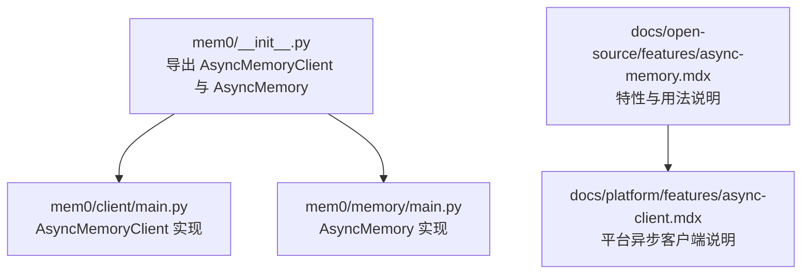
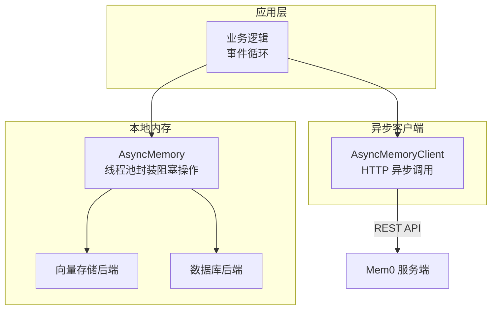
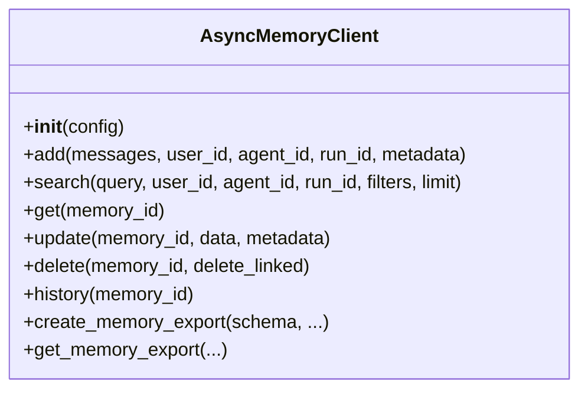
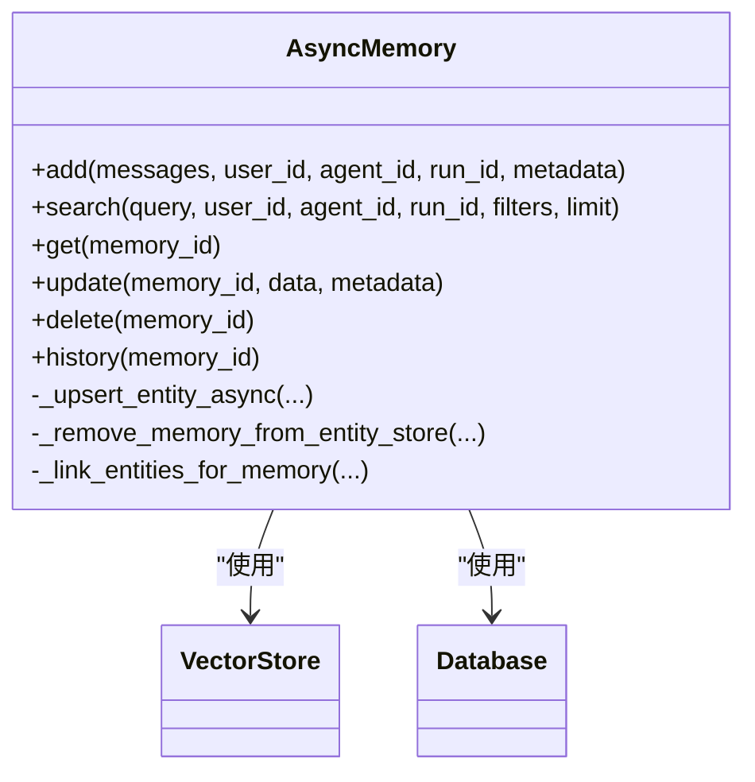
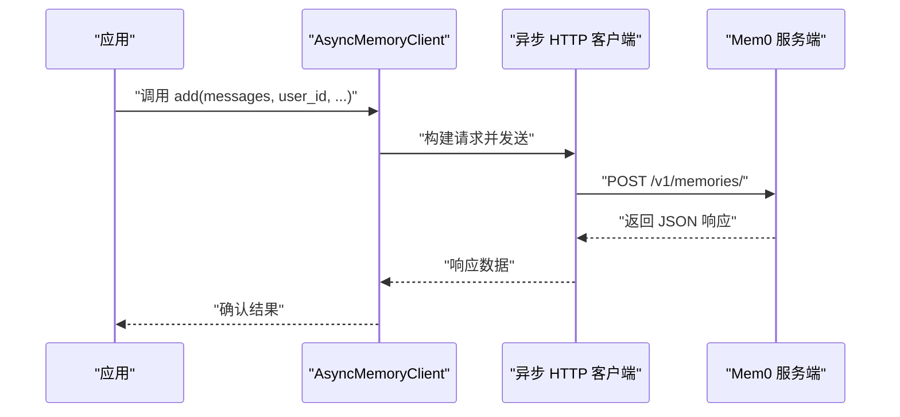
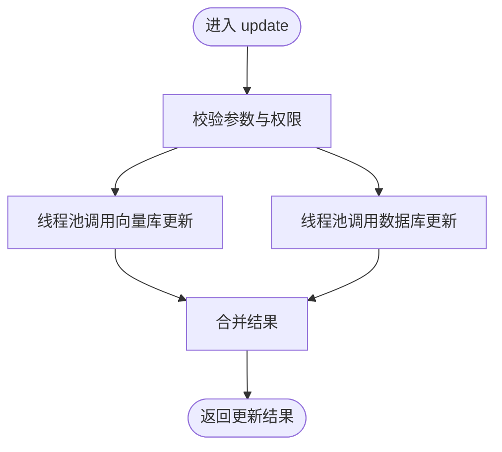
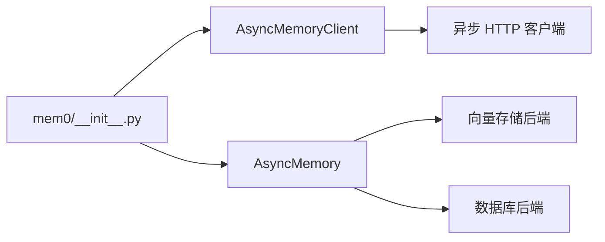

# 异步操作

<cite>
**本文引用的文件**
- [mem0/__init__.py](file://mem0/__init__.py)
- [mem0/client/main.py](file://mem0/client/main.py)
- [mem0/memory/main.py](file://mem0/memory/main.py)
- [docs/open-source/features/async-memory.mdx](file://docs/open-source/features/async-memory.mdx)
- [docs/platform/features/async-client.mdx](file://docs/platform/features/async-client.mdx)
</cite>

## 目录
1. [简介](#简介)
2. [项目结构](#项目结构)
3. [核心组件](#核心组件)
4. [架构总览](#架构总览)
5. [详细组件分析](#详细组件分析)
6. [依赖关系分析](#依赖关系分析)
7. [性能考虑](#性能考虑)
8. [故障排查指南](#故障排查指南)
9. [结论](#结论)
10. [附录](#附录)

## 简介
本篇文档系统性阐述异步操作能力，重点覆盖以下内容：
- AsyncMemoryClient 与 AsyncMemory 的使用方法：异步添加、搜索、更新、删除记忆
- 异步编程的优势与适用场景
- 事件循环集成示例与并发控制策略
- 错误处理、超时管理与重试机制
- 与 asyncio、aiohttp 等异步库的集成实践
- 性能优化建议与最佳实践

## 项目结构
围绕异步能力的核心实现位于 Python 包 mem0 中，对外通过包导出入口暴露 AsyncMemoryClient 与 AsyncMemory；官方文档提供了特性说明、用法示例与故障排查指引。

图表来源
- [mem0/__init__.py:4-5](file://mem0/__init__.py#L4-L5)
- [mem0/client/main.py:961](file://mem0/client/main.py#L961)
- [mem0/memory/main.py:1984](file://mem0/memory/main.py#L1984)
- [docs/open-source/features/async-memory.mdx:24](file://docs/open-source/features/async-memory.mdx#L24)
- [docs/platform/features/async-client.mdx:1](file://docs/platform/features/async-client.mdx#L1)

章节来源
- [mem0/__init__.py:4-5](file://mem0/__init__.py#L4-L5)
- [docs/open-source/features/async-memory.mdx:24](file://docs/open-source/features/async-memory.mdx#L24)
- [docs/platform/features/async-client.mdx:1](file://docs/platform/features/async-client.mdx#L1)

## 核心组件
- AsyncMemoryClient（平台/服务端调用）
  - 提供与同步客户端一致的方法集合，但以异步方式执行，适合高并发场景
  - 支持添加、搜索、获取、更新、删除、批量删除、历史记录等操作
  - 内部基于异步 HTTP 客户端发起请求，返回 JSON 结构
- AsyncMemory（本地直连向量库）
  - 与同步 Memory 方法对等，支持异步添加、搜索、获取、更新、删除、历史查询
  - 通过线程池包装阻塞式向量库与数据库操作，避免阻塞事件循环
  - 支持实体抽取与链接、变更审计等高级能力

章节来源
- [mem0/client/main.py:961](file://mem0/client/main.py#L961)
- [mem0/memory/main.py:1984](file://mem0/memory/main.py#L1984)
- [docs/open-source/features/async-memory.mdx:24](file://docs/open-source/features/async-memory.mdx#L24)

## 架构总览
下图展示了异步客户端与本地内存实现的职责边界与交互关系：

图表来源
- [mem0/client/main.py:961](file://mem0/client/main.py#L961)
- [mem0/memory/main.py:1984](file://mem0/memory/main.py#L1984)

## 详细组件分析

### AsyncMemoryClient 组件分析
- 职责
  - 对外暴露与同步客户端一致的记忆操作接口，内部以非阻塞方式执行网络请求
  - 支持按用户、代理、运行会话等维度进行作用域隔离
- 关键方法（异步）
  - 添加：接收消息列表与作用域参数，返回确认信息
  - 搜索：返回包含结果的字典结构
  - 获取单条：按 ID 获取
  - 更新：支持部分更新
  - 删除：支持按 ID 删除
  - 历史：获取变更日志用于审计
  - 导出：创建与拉取导出任务
- 并发与性能
  - 可与 asyncio.gather 并行调度多个任务，提升吞吐
  - 适用于高并发 Web 应用、自动化流水线与工具调用场景

图表来源
- [mem0/client/main.py:961](file://mem0/client/main.py#L961)
- [mem0/client/main.py:1145](file://mem0/client/main.py#L1145)
- [mem0/client/main.py:1283](file://mem0/client/main.py#L1283)
- [mem0/client/main.py:1311](file://mem0/client/main.py#L1311)
- [mem0/client/main.py:1345](file://mem0/client/main.py#L1345)
- [mem0/client/main.py:1520](file://mem0/client/main.py#L1520)
- [mem0/client/main.py:1538](file://mem0/client/main.py#L1538)

章节来源
- [docs/platform/features/async-client.mdx:1](file://docs/platform/features/async-client.mdx#L1)
- [mem0/client/main.py:961](file://mem0/client/main.py#L961)

### AsyncMemory 组件分析
- 职责
  - 在进程内直接对接向量库与数据库，降低网络延迟
  - 将阻塞式操作放入线程池，避免阻塞事件循环
- 关键方法（异步）
  - add/search/get/update/delete/history 等均以 async 形式提供
  - 支持实体抽取与链接、历史审计等增强功能
- 并发与性能
  - 通过线程池与异步 I/O 协同，适合高 QPS 的本地服务或嵌入式 Agent

图表来源
- [mem0/memory/main.py:1984](file://mem0/memory/main.py#L1984)
- [mem0/memory/main.py:2058](file://mem0/memory/main.py#L2058)
- [mem0/memory/main.py:2102](file://mem0/memory/main.py#L2102)
- [mem0/memory/main.py:2147](file://mem0/memory/main.py#L2147)
- [mem0/memory/main.py:2601](file://mem0/memory/main.py#L2601)
- [mem0/memory/main.py:3214](file://mem0/memory/main.py#L3214)
- [mem0/memory/main.py:3239](file://mem0/memory/main.py#L3239)
- [mem0/memory/main.py:3248](file://mem0/memory/main.py#L3248)
- [mem0/memory/main.py:3307](file://mem0/memory/main.py#L3307)
- [mem0/memory/main.py:3318](file://mem0/memory/main.py#L3318)

章节来源
- [docs/open-source/features/async-memory.mdx:24](file://docs/open-source/features/async-memory.mdx#L24)
- [mem0/memory/main.py:1984](file://mem0/memory/main.py#L1984)

### API 工作流（序列图：异步添加）

图表来源
- [mem0/client/main.py:961](file://mem0/client/main.py#L961)
- [mem0/client/main.py:1145](file://mem0/client/main.py#L1145)

### 处理流程（流程图：异步更新）

图表来源
- [mem0/memory/main.py:3214](file://mem0/memory/main.py#L3214)
- [mem0/memory/main.py:3239](file://mem0/memory/main.py#L3239)

## 依赖关系分析
- 导出入口
  - 通过包导出 AsyncMemoryClient 与 AsyncMemory，便于统一导入与使用
- 内部依赖
  - AsyncMemoryClient 依赖异步 HTTP 客户端完成网络请求
  - AsyncMemory 依赖向量存储与数据库后端，并通过线程池封装阻塞操作
- 文档依赖
  - 官方文档提供特性说明、方法对照表与故障排查清单

图表来源
- [mem0/__init__.py:4-5](file://mem0/__init__.py#L4-L5)
- [mem0/client/main.py:961](file://mem0/client/main.py#L961)
- [mem0/memory/main.py:1984](file://mem0/memory/main.py#L1984)

章节来源
- [mem0/__init__.py:4-5](file://mem0/__init__.py#L4-L5)

## 性能考虑
- 非阻塞 I/O 与线程池
  - AsyncMemoryClient 使用异步 HTTP 客户端，减少连接等待
  - AsyncMemory 将向量库与数据库操作放入线程池，避免阻塞事件循环
- 并发调度
  - 利用 asyncio.gather 并行提交多个任务，提高吞吐
- 适用场景
  - 高并发 Web 应用、自动化工具链、多 Agent 并行检索与写入
- 优化建议
  - 合理设置并发度，避免过度并发导致后端压力过大
  - 对热点查询进行缓存，降低重复计算与网络往返
  - 分批处理大批量操作，避免单次请求过大
  - 监控关键指标（延迟、错误率、队列长度），动态调整并发与批大小

## 故障排查指南
- 初始化失败
  - 检查配置与环境变量是否正确
- 操作缓慢
  - 数据规模大或后端延迟高，建议缓存与调优向量库参数
- 记忆未找到
  - 校验 ID 来源与软删除状态
- 连接超时
  - 网络异常或后端过载，增加重试与退避策略
- 内存溢出
  - 批次过大，降低并发或拆分批次

章节来源
- [docs/open-source/features/async-memory.mdx:395](file://docs/open-source/features/async-memory.mdx#L395)

## 结论
AsyncMemoryClient 与 AsyncMemory 提供了与同步 API 对等的异步能力，前者面向远程服务调用，后者面向本地向量库直连。二者结合可满足从高并发 Web 场景到低延迟本地服务的广泛需求。通过合理的并发控制、超时与重试策略，以及性能监控与优化，可在生产环境中稳定发挥异步优势。

## 附录
- 事件循环集成要点
  - 使用 asyncio.run 或在已有事件循环中调度协程
  - 使用 asyncio.gather 并行执行多个异步操作
  - 使用 aiohttp.ClientSession 配合 AsyncMemoryClient 进行网络请求
- 日志与可观测性
  - 为关键异步操作添加装饰器记录耗时与异常
  - 结合结构化日志与指标埋点，定位性能瓶颈

章节来源
- [docs/open-source/features/async-memory.mdx:337](file://docs/open-source/features/async-memory.mdx#L337)
- [docs/platform/features/async-client.mdx:1](file://docs/platform/features/async-client.mdx#L1)